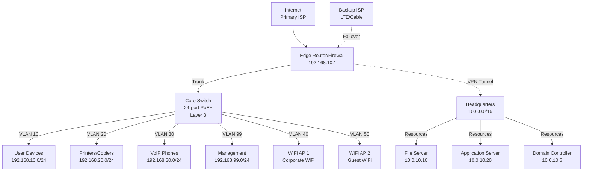

## Scenario Overview

**Organization**: Regional sales office for national company

**Location**: Remote office 200 miles from headquarters

**Requirements**:

- 35 employees (sales, support, management)
- Site-to-site VPN to headquarters for centralized resources
- Local internet breakout for cloud applications
- Redundant internet connectivity (primary + backup)
- VLAN segmentation for security
- Guest WiFi isolated from corporate network
- Budget: $8,000-$15,000

## Network Diagram



## IP Addressing Scheme

### VLAN Design

| VLAN ID | Name | Subnet | Gateway | DHCP Pool | Purpose |
| --- | --- | --- | --- | --- | --- |
| **10** | Users | 192.168.10.0/24 | .1 | .100-.200 | Workstations |
| **20** | Printers | 192.168.20.0/24 | .1 | .10-.50 | Network printers |
| **30** | VoIP | 192.168.30.0/24 | .1 | .100-.200 | IP phones |
| **40** | Corp WiFi | 192.168.40.0/24 | .1 | .100-.250 | Employee wireless |
| **50** | Guest WiFi | 192.168.50.0/24 | .1 | .10-.200 | Visitor access |
| **99** | Management | 192.168.99.0/24 | .1 | None | Device management |

### Reserved IP Addresses

**VLAN 10 (Users)**:

- `.1` - Gateway
- `.2-9` - Servers (local file storage, print server)
- `.100-200` - DHCP pool for workstations

**VLAN 99 (Management)**:

- `.1` - Gateway
- `.10` - Core switch management
- `.11` - Edge router management
- `.20-.30` - Access point management IPs

### Headquarters Network

**HQ Subnets**:

- `10.0.0.0/16` - Headquarters supernet
- `10.0.10.0/24` - Servers (file, application, DC)
- `10.0.20.0/24` - HQ users

## Equipment List

### Budget Option (~$8,000)

| Equipment | Model | Qty | Unit Price | Total | Notes |
| --- | --- | --- | --- | --- | --- |
| **Router/Firewall** | Ubiquiti EdgeRouter 4 | 1 | $200 | $200 | 3 Gbps throughput, VPN |
| **Core Switch** | Ubiquiti EdgeSwitch 24 PoE | 1 | $500 | $500 | Layer 3, 250W PoE |
| **Backup Router** | Ubiquiti EdgeRouter X | 1 | $60 | $60 | LTE/cable failover |
| **Access Points** | UniFi AP AC Pro | 3 | $130 | $390 | Dual-band, PoE |
| **Internet (Primary)** | Business Fiber 100/100 | 1 | $300/mo | - | Dedicated fiber |
| **Internet (Backup)** | Cable 100/10 | 1 | $80/mo | - | Diverse path |
| **Cloud Controller** | UniFi Controller | Free | - | - | Self-hosted or cloud |
| **Cables/Mounting** | Various | - | - | $250 | Cat6, patch panels |
| | | | **Total** | **$1,400** | One-time hardware |
| | | | **Monthly** | **$380** | Recurring costs |

### Recommended Option (~$12,000)

| Equipment | Model | Qty | Unit Price | Total | Notes |
| --- | --- | --- | --- | --- | --- |
| **Router/Firewall** | Fortinet FortiGate 60F | 1 | $1,200 | $1,200 | SD-WAN, 10 Gbps, UTM |
| **Core Switch** | Cisco Catalyst 1000-24P | 1 | $2,000 | $2,000 | Layer 3, 370W PoE+ |
| **Access Points** | Cisco Catalyst 9120AXI | 3 | $900 | $2,700 | WiFi 6, high density |
| **Backup Solution** | Cradlepoint IBR900 | 1 | $800 | $800 | LTE failover router |
| **Internet (Primary)** | Business Fiber 500/500 | 1 | $500/mo | - | Dedicated fiber |
| **Internet (Backup)** | LTE Unlimited | 1 | $150/mo | - | 4G/5G backup |
| **Licensing** | FortiCare + UTM | 1 year | $400 | $400 | Annual renewal |
| **Cloud Management** | Cisco Meraki Go | Free | - | - | First year included |
| **Installation** | Professional | 1 | $2,000 | $2,000 | Cabling, config, testing |
| | | | **Total** | **$9,100** | One-time hardware |
| | | | **Monthly** | **$650** | Recurring costs |

### Enterprise Option (~$20,000)

| Equipment | Model | Qty | Unit Price | Total | Notes |
| --- | --- | --- | --- | --- | --- |
| **Router/Firewall** | Palo Alto PA-450 | 1 | $5,000 | $5,000 | SD-WAN, threat prevention |
| **Core Switch** | Aruba 6300M 24-port | 1 | $3,500 | $3,500 | VSF stacking, 10G uplinks |
| **Access Switches** | Aruba 6200F 24-port | 1 | $1,500 | $1,500 | Layer 2+, PoE+ |
| **Access Points** | Aruba AP-635 (WiFi 6E) | 4 | $900 | $3,600 | Tri-band, high capacity |
| **Backup Connectivity** | Dual LTE/5G | 1 | $1,200 | $1,200 | Automatic failover |
| **Licensing** | PA threat prevention | 3 years | $4,000 | $4,000 | Advanced security |
| **Monitoring** | Aruba Central | 3 years | $1,500 | $1,500 | Cloud management |
| **Installation** | Professional | 1 | $5,000 | $5,000 | Full turnkey |
| | | | **Total** | **$25,300** | One-time hardware |
| | | | **Monthly** | **$700** | Recurring costs |

## Site-to-Site VPN Configuration

### IPsec VPN (Branch to HQ)

**Branch Router Configuration**:

```bash
# Branch Office (192.168.10.0/24)
crypto isakmp policy 10
 encryption aes 256
 hash sha256
 authentication pre-share
 group 14
 lifetime 28800

crypto isakmp key YourSecurePreSharedKey address 203.0.113.1

crypto ipsec transform-set BRANCH-HQ-SET esp-aes 256 esp-sha256-hmac
 mode tunnel

crypto ipsec profile BRANCH-HQ-PROFILE
 set transform-set BRANCH-HQ-SET

# Access list defining interesting traffic
access-list 100 permit ip 192.168.10.0 0.0.0.255 10.0.0.0 0.0.255.255
access-list 100 permit ip 192.168.20.0 0.0.0.255 10.0.0.0 0.0.255.255
access-list 100 permit ip 192.168.30.0 0.0.0.255 10.0.0.0 0.0.255.255

# Tunnel interface
interface Tunnel0
 ip address 172.16.0.2 255.255.255.252
 tunnel source GigabitEthernet0/0 (WAN interface)
 tunnel destination 203.0.113.1 (HQ public IP)
 tunnel mode ipsec ipv4
 tunnel protection ipsec profile BRANCH-HQ-PROFILE

# Static route to HQ networks via tunnel
ip route 10.0.0.0 255.255.0.0 Tunnel0
```

**Headquarters Router Configuration**:

```bash
# Headquarters (10.0.0.0/16)
crypto isakmp policy 10
 encryption aes 256
 hash sha256
 authentication pre-share
 group 14
 lifetime 28800

crypto isakmp key YourSecurePreSharedKey address 198.51.100.1

crypto ipsec transform-set BRANCH-HQ-SET esp-aes 256 esp-sha256-hmac
 mode tunnel

crypto ipsec profile BRANCH-HQ-PROFILE
 set transform-set BRANCH-HQ-SET

# Access list defining interesting traffic
access-list 100 permit ip 10.0.0.0 0.0.255.255 192.168.10.0 0.0.0.255
access-list 100 permit ip 10.0.0.0 0.0.255.255 192.168.20.0 0.0.0.255
access-list 100 permit ip 10.0.0.0 0.0.255.255 192.168.30.0 0.0.0.255

# Tunnel interface
interface Tunnel0
 ip address 172.16.0.1 255.255.255.252
 tunnel source GigabitEthernet0/0
 tunnel destination 198.51.100.1 (Branch public IP)
 tunnel mode ipsec ipv4
 tunnel protection ipsec profile BRANCH-HQ-PROFILE

# Static route to Branch networks via tunnel
ip route 192.168.10.0 255.255.255.0 Tunnel0
ip route 192.168.20.0 255.255.255.0 Tunnel0
ip route 192.168.30.0 255.255.255.0 Tunnel0
```

### Verification Commands

```bash
# Check VPN tunnel status
show crypto ipsec sa
show crypto isakmp sa
show interface Tunnel0

# Test connectivity
ping 10.0.10.10 source 192.168.10.1
traceroute 10.0.10.10 source 192.168.10.1

# Monitor VPN traffic
show crypto ipsec sa detail
```

## VLAN Configuration

### Core Switch Setup (Cisco/Catalyst Example)

```bash
# Create VLANs
vlan 10
 name Users
vlan 20
 name Printers
vlan 30
 name VoIP
vlan 40
 name Corp-WiFi
vlan 50
 name Guest-WiFi
vlan 99
 name Management

# Configure SVI (inter-VLAN routing)
interface Vlan10
 description Users
 ip address 192.168.10.1 255.255.255.0
 ip helper-address 10.0.10.30 (HQ DHCP server)

interface Vlan20
 description Printers
 ip address 192.168.20.1 255.255.255.0
 no ip redirects

interface Vlan30
 description VoIP
 ip address 192.168.30.1 255.255.255.0
 ip helper-address 10.0.10.40 (HQ VoIP DHCP)

interface Vlan40
 description Corp-WiFi
 ip address 192.168.40.1 255.255.255.0
 ip helper-address 10.0.10.30

interface Vlan50
 description Guest-WiFi
 ip address 192.168.50.1 255.255.255.0
 ip access-group GUEST-ACL in

interface Vlan99
 description Management
 ip address 192.168.99.1 255.255.255.0

# Trunk port to router
interface GigabitEthernet1/0/1
 description Uplink to Edge Router
 switchport mode trunk
 switchport trunk allowed vlan 10,20,30,40,50,99
 spanning-tree portfast trunk

# Access ports (example)
interface range GigabitEthernet1/0/2-20
 description User Access Ports
 switchport mode access
 switchport access vlan 10
 spanning-tree portfast

# VoIP phone ports (with PC daisy-chain)
interface range GigabitEthernet1/0/21-24
 description VoIP Phones + PC
 switchport mode access
 switchport access vlan 10
 switchport voice vlan 30
 spanning-tree portfast

# Guest ACL (internet only, block RFC1918)
ip access-list extended GUEST-ACL
 permit udp any any eq 53
 permit tcp any any eq 53
 deny ip any 192.168.0.0 0.0.255.255
 deny ip any 10.0.0.0 0.255.255.255
 deny ip any 172.16.0.0 0.15.255.255
 permit ip any any
```

## Redundancy and Failover

### Dual Internet Connectivity

**Primary**: Fiber (500 Mbps dedicated)

- Lowest latency
- Most reliable
- Static IP for VPN termination

**Backup**: LTE/5G or Cable

- Automatic failover (< 30 seconds)
- Cloud-based monitoring
- Budget-friendly

**Failover Configuration** (EdgeRouter example):

```bash
set load-balance group ISP-Failover interface eth0 (Primary)
set load-balance group ISP-Failover interface eth1 (Backup)
set load-balance group ISP-Failover lb-local enable
set load-balance group ISP-Failover lb-local-metric-change enable

# Health check for primary
set load-balance group ISP-Failover interface eth0 route-test type ping
set load-balance group ISP-Failover interface eth0 route-test initial-delay 60
set load-balance group ISP-Failover interface eth0 route-test interval 10
set load-balance group ISP-Failover interface eth0 route-test count 3
set load-balance group ISP-Failover interface eth0 route-test target 8.8.8.8

# Set backup as secondary
set load-balance group ISP-Failover interface eth1 weight 1
set load-balance group ISP-Failover interface eth0 weight 10
```

### VPN Redundancy

**Option 1:** Dynamic Routing** (OSPF over VPN)

- Automatic failover to backup tunnel
- HQ must support multiple VPN tunnels per site

**Option 2:** Backup VPN Tunnel

- Secondary tunnel via backup ISP
- Manual or script-based failover

## Security Hardening

### Firewall Rules (Branch Edge Router)

```bash
# Allow outbound internet from Users/VoIP
permit ip 192.168.10.0/24 any
permit ip 192.168.30.0/24 any

# Allow HQ access from Users/Printers/VoIP
permit ip 192.168.10.0/24 10.0.0.0/16
permit ip 192.168.20.0/24 10.0.10.0/24 (servers only)
permit ip 192.168.30.0/24 10.0.10.40 (VoIP server)

# Guest WiFi: Internet only
permit ip 192.168.50.0/24 any (with GUEST-ACL filtering RFC1918)

# Deny all by default
deny ip any any
```

### Branch Security Checklist

- ☐ Change default passwords on all devices
- ☐ Enable WPA3 for corporate WiFi (WPA2 minimum)
- ☐ Isolate guest WiFi from corporate network
- ☐ Configure firewall rules (deny by default)
- ☐ Enable VPN encryption (AES-256)
- ☐ Disable unused switch ports
- ☐ Set up SNMP monitoring (read-only community)
- ☐ Enable syslog to centralized logging server
- ☐ Implement 802.1X for WiFi (if supported)
- ☐ Schedule automatic firmware updates (during maintenance window)

## Implementation Plan

### Phase 1: Pre-Deployment (Week 1)

1. **Site Survey**:
   - Measure office space for AP placement
   - Identify cable runs needed
   - Document existing infrastructure

2. **Equipment Procurement**:
   - Order hardware (lead time: 1-2 weeks)
   - Confirm ISP installation dates

3. **IP Planning**:
   - Finalize VLAN assignments
   - Coordinate with HQ for VPN subnet allocation

### Phase 2: Installation (Week 2)

1. **Physical Setup**:
   - Install rack equipment
   - Run Cat6 cables
   - Mount access points
   - Label all connections

2. **ISP Connectivity**:
   - Activate primary fiber circuit
   - Activate backup cable/LTE
   - Test internet connectivity

### Phase 3: Configuration (Week 3)

1. **Core Network**:
   - Configure VLANs on switch
   - Set up inter-VLAN routing
   - Configure DHCP (or relay to HQ)

2. **VPN Setup**:
   - Configure IPsec tunnel
   - Test HQ resource access
   - Verify routing

3. **Wireless**:
   - Configure SSIDs (corporate + guest)
   - Set security (WPA3/WPA2)
   - Test coverage and roaming

### Phase 4: Testing (Week 3-4)

1. **Connectivity**:
   - Test internet access from each VLAN
   - Verify VPN access to HQ resources (file server, DC)
   - Test failover (disconnect primary internet)

2. **Performance**:
   - Measure WiFi speed and coverage
   - Test VoIP call quality
   - Verify inter-VLAN routing

3. **Security**:
   - Confirm guest isolation
   - Test firewall rules
   - Verify VPN encryption

### Phase 5: Migration (Week 4)

1. **User Devices**:
   - Connect workstations
   - Configure WiFi profiles
   - Test application access (file shares, email, CRM)

2. **Printers/Peripherals**:
   - Set static IPs or DHCP reservations
   - Update print queues on workstations

3. **VoIP**:
   - Configure IP phones
   - Test calls (internal HQ + external)
   - Verify QoS settings

### Phase 6: Handoff (Week 5)

1. **Documentation**:
   - Network diagram (as-built)
   - IP address assignments
   - Admin credentials (secure storage)
   - Troubleshooting guide

2. **Training**:
   - Admin training (basic troubleshooting, monitoring)
   - User orientation (WiFi access, resources)

3. **Monitoring**:
   - Set up alerts (link down, high utilization)
   - Establish baseline metrics
   - Schedule monthly review

## Ongoing Maintenance

### Weekly Tasks

- Monitor internet bandwidth usage
- Check VPN tunnel status
- Review firewall logs for anomalies

### Monthly Tasks

- Review WiFi client counts and coverage
- Check for firmware updates
- Verify backup connectivity (test failover)
- Review security logs

### Quarterly Tasks

- Performance review (bandwidth, latency)
- Capacity planning (user growth)
- Audit firewall rules
- Test disaster recovery (VPN failover, ISP failover)

### Annual Tasks

- Hardware refresh assessment
- Security audit (penetration testing)
- User satisfaction survey
- Budget planning for upgrades

## Troubleshooting

### VPN Tunnel Down

**Symptoms**: Cannot access HQ resources

**Diagnosis**:

```bash
# Check tunnel status
show crypto isakmp sa
show crypto ipsec sa
show interface Tunnel0

# Common issues:
ping HQ-public-IP (test connectivity)
show ip route (verify tunnel route)
```

**Solutions**:

- **No IKE SA**: Check pre-shared key, IKE policy mismatch
- **IKE SA but no IPsec SA**: Check ACL (interesting traffic), transform set mismatch
- **Tunnel up but no traffic**: Check routing, firewall rules

### Internet Failover Not Working

**Symptoms**: Internet down when primary ISP fails

**Diagnosis**:

```bash
# Check load balancing status
show load-balance status
show load-balance watchdog

# Verify health check
ping 8.8.8.8 (from router)
```

**Solutions**:

- **Health check failing**: Adjust ping target, timeout values
- **Backup not activating**: Check weight settings, verify backup ISP is up
- **Slow failover**: Reduce health check interval, enable lb-local-metric-change

### Slow WiFi Performance

**Symptoms**: Users report slow wireless speeds

**Diagnosis**:

- Check client count per AP (should be < 50)
- Measure RSSI (should be > -70 dBm)
- Check channel utilization (should be < 70%)

**Solutions**:

- **Too many clients**: Add more APs
- **Weak signal**: Reposition APs, adjust power
- **Channel interference**: Change channels (use 1, 6, 11 for 2.4 GHz)

### Cannot Access HQ File Server

**Symptoms**: Error accessing `\\fileserver` from branch

**Diagnosis**:

```bash
# From branch workstation
ping 10.0.10.10
tracert 10.0.10.10

# Check DNS
nslookup fileserver
```

**Solutions**:

- **Cannot ping**: VPN tunnel down, firewall blocking
- **Can ping, cannot resolve name**: DNS issue, use IP or configure DNS forwarder
- **Slow access**: Check VPN bandwidth, QoS settings

## Cost Analysis

### One-Time Costs

| Item | Budget | Recommended | Enterprise |
| --- | --- | --- | --- |
| **Hardware** | $1,400 | $9,100 | $25,300 |
| **Installation** | $0 (DIY) | $2,000 | $5,000 |
| **Cabling** | $250 | $500 | $1,000 |
| **Total** | **$1,650** | **$11,600** | **$31,300** |

### Monthly Costs

| Item | Budget | Recommended | Enterprise |
| --- | --- | --- | --- |
| **Primary ISP** | $300 | $500 | $700 |
| **Backup ISP** | $80 | $150 | $200 |
| **Licensing** | $0 | $50 | $200 |
| **Monitoring** | $0 | $0 | $50 |
| **Total** | **$380** | **$700** | **$1,150** |

### 3-Year TCO

| Option | Year 1 | Years 2-3 | Total |
| --- | --- | --- | --- |
| **Budget** | $6,210 | $9,120 | $15,330 |
| **Recommended** | $20,000 | $16,800 | $36,800 |
| **Enterprise** | $45,100 | $27,600 | $72,700 |

## Scaling Considerations

### 50-75 Users

- Add second core switch (stacking or LAG uplinks)
- Increase internet bandwidth (1 Gbps primary)
- Deploy 4-5 APs for better density
- Consider local DHCP server (reduce HQ dependency)

### 75-100 Users

- Upgrade to SD-WAN solution (Fortinet, Cisco Viptela)
- Deploy redundant core switches
- Segment network further (separate VLANs for departments)
- Local file server/cache (reduce HQ traffic)
- Increase VPN bandwidth (10 Gbps capable router)

## Related Topics

- [Scenarios Overview](index.md) - Other network design scenarios
- [Small Office Design](small-office.md) - Smaller deployment
- [Multi-Site Design](multi-site.md) - Enterprise with multiple branches
- [VPN Configuration](../security/vpn.md) - Detailed VPN setup
- [VLAN Configuration](../vlans.md) - VLAN best practices

---

*Branch office networks require reliable connectivity to headquarters, segmentation for security, and redundancy for business continuity. Proper planning ensures seamless integration with corporate resources.*
