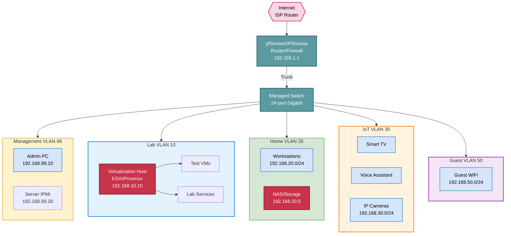

## Scenario Overview

**User**: IT professional, network enthusiast, or student

**Purpose**: Testing, learning, certification study, homelab experimentation

**Requirements**:

- Multiple VLANs for network segmentation
- Virtualization environment (ESXi, Proxmox, Hyper-V)
- Isolated lab network (safe for experiments/breaking things)
- Management network (out-of-band access)
- IoT network (smart home devices)
- Guest WiFi (visitors)
- Budget: $800-$3,000

## Network Diagram



## IP Addressing Scheme

### VLAN Design

| VLAN ID | Name | Subnet | Gateway | Purpose | Internet | Inter-VLAN |
| --- | --- | --- | --- | --- | --- | --- |
| **1** | WAN | DHCP from ISP | N/A | ISP connection | N/A | N/A |
| **10** | Lab | 192.168.10.0/24 | .1 | Testing, VMs | ✅ Allow | ❌ Isolated |
| **20** | Home | 192.168.20.0/24 | .1 | Workstations, NAS | ✅ Allow | ✅ Limited |
| **30** | IoT | 192.168.30.0/24 | .1 | Smart devices | ✅ Allow | ❌ Isolated |
| **50** | Guest | 192.168.50.0/24 | .1 | Visitor WiFi | ✅ Allow | ❌ Isolated |
| **99** | Management | 192.168.99.0/24 | .1 | IPMI, switch mgmt | ❌ Deny | ✅ Full access |

### Reserved IP Addresses

**VLAN 10 (Lab)**:

- `.1` - Gateway
- `.2` - DNS server (Pi-hole or bind9)
- `.10` - Hypervisor management (ESXi, Proxmox)
- `.20-.99` - Static VMs (domain controller, file server, web servers)
- `.100-.200` - DHCP pool for temporary VMs

**VLAN 20 (Home)**:

- `.1` - Gateway
- `.5` - NAS/file server
- `.10-.50` - Static workstations
- `.100-.200` - DHCP pool for laptops, tablets

**VLAN 30 (IoT)**:

- `.1` - Gateway
- `.10-.50` - Smart home hubs (Alexa, Google Home)
- `.51-.100` - IP cameras
- `.101-.150` - Smart TVs, streaming devices
- `.200-.250` - DHCP pool for new IoT devices

**VLAN 99 (Management)**:

- `.1` - Gateway (no internet access)
- `.10` - Admin workstation management interface
- `.20-.30` - Server IPMI/iLO/iDRAC
- `.40-.50` - Switch/router management IPs

### Firewall Rules Summary

**Lab VLAN (10)**:

- ✅ Allow outbound to internet
- ❌ Block inbound from all other VLANs
- ✅ Allow outbound to Management VLAN (for admin access)

**Home VLAN (20)**:

- ✅ Allow outbound to internet
- ✅ Allow to NAS (.5) on specific ports (SMB, NFS)
- ❌ Block to Lab/IoT/Guest VLANs
- ✅ Allow to Management VLAN (read-only monitoring)

**IoT VLAN (30)**:

- ✅ Allow outbound to internet (limited ports: 80, 443, 8883 for MQTT)
- ❌ Block to all other VLANs (including Home)
- ⚠️ Exception: Allow Home VLAN to initiate connections to IoT (control devices)

**Guest VLAN (50)**:

- ✅ Allow outbound to internet
- ❌ Block to all RFC1918 private addresses

**Management VLAN (99)**:

- ❌ Block internet access (no WAN route)
- ✅ Allow to all other VLANs (full admin access)

## Equipment List

### Budget Option (~$800)

| Equipment | Model/Option | Qty | Price | Total | Notes |
| --- | --- | --- | --- | --- | --- |
| **Router/Firewall** | Used PC + pfSense | 1 | $100 | $100 | Dual NIC, 4GB RAM |
| **Managed Switch** | TP-Link TL-SG108E (8-port) | 1 | $40 | $40 | VLAN support, unmanaged+ |
| **Access Point** | TP-Link EAP225 | 1 | $60 | $60 | Multiple SSIDs |
| **Hypervisor** | Used workstation/server | 1 | $300 | $300 | 16GB RAM, 500GB SSD |
| **NAS** | DIY with 2× HDD | 1 | $200 | $200 | OpenMediaVault, RAID1 |
| **Cables/Misc** | Cat6, power strips | - | $100 | $100 | - |
| | | | **Total** | **$800** | Entry-level homelab |

### Recommended Option (~$1,500)

| Equipment | Model/Option | Qty | Price | Total | Notes |
| --- | --- | --- | --- | --- | --- |
| **Router/Firewall** | Protectli Vault (4-port) | 1 | $300 | $300 | pfSense/OPNsense ready |
| **Managed Switch** | Ubiquiti EdgeSwitch 24 Lite | 1 | $180 | $180 | Layer 3, VLAN routing |
| **Access Points** | UniFi AP AC Lite | 2 | $80 | $160 | Multiple SSIDs, PoE |
| **Hypervisor** | Used Dell R720 or HP DL380 G9 | 1 | $400 | $400 | 32GB+ RAM, dual CPUs |
| **NAS** | Synology DS220+ with 2× 4TB | 1 | $450 | $450 | RAID1, Docker support |
| **Misc** | Cables, rack shelves | - | $100 | $100 | - |
| | | | **Total** | **$1,590** | Solid homelab |

### Advanced Option (~$3,000)

| Equipment | Model/Option | Qty | Price | Total | Notes |
| --- | --- | --- | --- | --- | --- |
| **Router/Firewall** | Netgate 4100 | 1 | $799 | $799 | Official pfSense appliance |
| **Core Switch** | UniFi Switch 24 PoE | 1 | $380 | $380 | Full PoE+, 250W budget |
| **Access Points** | UniFi AP WiFi 6 LR | 2 | $180 | $360 | High performance |
| **Hypervisor 1** | Used Dell R730xd | 1 | $700 | $700 | 64GB RAM, 12 bays |
| **Hypervisor 2** | Intel NUC 11 Pro | 1 | $500 | $500 | Compact, low power |
| **NAS** | Synology DS920+ with 4× 4TB | 1 | $850 | $850 | RAID10, NVMe cache |
| **UPS** | CyberPower 1500VA | 1 | $200 | $200 | Battery backup |
| **Rack** | 12U wall-mount rack | 1 | $150 | $150 | Organization |
| **Misc** | Patch panels, cables, PDU | - | $200 | $200 | - |
| | | | **Total** | **$4,139** | Professional-grade |

## pfSense/OPNsense Configuration

### VLAN Setup (Interfaces)

```bash
# WAN Interface
Interface: em0 (or igb0)
Type: DHCP (from ISP)

# LAN Interface (trunk for all VLANs)
Interface: em1 (or igb1)
Type: None (parent interface for VLANs)

# VLAN 10 - Lab
Parent Interface: em1
VLAN Tag: 10
Description: Lab
IPv4 Address: 192.168.10.1/24
DHCP: Enabled (.100-.200)

# VLAN 20 - Home
Parent Interface: em1
VLAN Tag: 20
Description: Home
IPv4 Address: 192.168.20.1/24
DHCP: Enabled (.100-.200)

# VLAN 30 - IoT
Parent Interface: em1
VLAN Tag: 30
Description: IoT
IPv4 Address: 192.168.30.1/24
DHCP: Enabled (.200-.250)

# VLAN 50 - Guest
Parent Interface: em1
VLAN Tag: 50
Description: Guest
IPv4 Address: 192.168.50.1/24
DHCP: Enabled (.10-.200)

# VLAN 99 - Management
Parent Interface: em1
VLAN Tag: 99
Description: Management
IPv4 Address: 192.168.99.1/24
DHCP: Disabled (static only)
```

### Firewall Rules

**VLAN 10 (Lab) Rules**:

```text
# Allow Lab to Management
Action: Pass
Interface: Lab (VLAN10)
Protocol: Any
Source: Lab net (192.168.10.0/24)
Destination: Management net (192.168.99.0/24)

# Allow Lab to Internet
Action: Pass
Interface: Lab (VLAN10)
Protocol: Any
Source: Lab net
Destination: Any
Destination Port: Any

# Block Lab to other VLANs
Action: Block
Interface: Lab (VLAN10)
Protocol: Any
Source: Lab net
Destination: RFC1918 networks (10.0.0.0/8, 172.16.0.0/12, 192.168.0.0/16)
```

**VLAN 20 (Home) Rules**:

```text
# Allow Home to NAS
Action: Pass
Interface: Home (VLAN20)
Protocol: TCP
Source: Home net
Destination: 192.168.20.5 (NAS)
Destination Port: 445 (SMB), 2049 (NFS), 5000-5001 (Synology)

# Allow Home to control IoT devices (initiated from Home only)
Action: Pass
Interface: Home (VLAN20)
Protocol: TCP/UDP
Source: Home net
Destination: IoT net (192.168.30.0/24)
Destination Port: 80, 443, 8080, 8883 (MQTT)

# Allow Home to Internet
Action: Pass
Interface: Home (VLAN20)
Protocol: Any
Source: Home net
Destination: Any

# Block Home to Lab
Action: Block
Interface: Home (VLAN20)
Protocol: Any
Source: Home net
Destination: Lab net
```

**VLAN 30 (IoT) Rules**:

```text
# Allow IoT to Internet (HTTP/HTTPS only)
Action: Pass
Interface: IoT (VLAN30)
Protocol: TCP
Source: IoT net
Destination: Any
Destination Port: 80, 443, 8883 (MQTT), 123 (NTP)

# Block IoT to all RFC1918 (including Home)
Action: Block
Interface: IoT (VLAN30)
Protocol: Any
Source: IoT net
Destination: RFC1918 networks
```

**VLAN 50 (Guest) Rules**:

```text
# Allow Guest to Internet
Action: Pass
Interface: Guest (VLAN50)
Protocol: Any
Source: Guest net
Destination: !RFC1918 (not private IPs)

# Block Guest to private networks
Action: Block
Interface: Guest (VLAN50)
Protocol: Any
Source: Guest net
Destination: RFC1918
```

**VLAN 99 (Management) Rules**:

```text
# Allow Management to all VLANs (admin access)
Action: Pass
Interface: Management (VLAN99)
Protocol: Any
Source: Management net
Destination: Any (except WAN)

# Block Management to Internet
Action: Block
Interface: Management (VLAN99)
Protocol: Any
Source: Management net
Destination: WAN net
```

### NAT (Outbound)

pfSense will automatically create outbound NAT rules for VLANs 10, 20, 30, 50 to WAN. VLAN 99 (Management) should NOT have NAT (blocked from internet).

## Switch Configuration (VLAN Tagging)

### Example: TP-Link Managed Switch

```text
# Trunk Port (to pfSense router)
Port 1: Mode = Trunk
        Tagged VLANs: 10, 20, 30, 50, 99
        Untagged VLAN: None

# Access Ports (Lab devices)
Ports 2-8: Mode = Access
           Untagged VLAN: 10 (Lab)
           Tagged VLANs: None

# Access Ports (Home devices)
Ports 9-16: Mode = Access
            Untagged VLAN: 20 (Home)

# Access Ports (IoT devices / WiFi APs)
Ports 17-20: Mode = Access
             Untagged VLAN: 30 (IoT) or Trunk with multiple VLANs for APs

# Management Port (switch itself)
VLAN 99: Management interface IP: 192.168.99.40
```

### WiFi AP Configuration (Multiple SSIDs)

**Corporate SSID**: `Home-Network`

- VLAN: 20 (Home)
- Security: WPA3/WPA2
- Password: Strong passphrase

**IoT SSID**: `Smart-Home`

- VLAN: 30 (IoT)
- Security: WPA2
- Password: Simple for compatibility

**Guest SSID**: `Guest-WiFi`

- VLAN: 50 (Guest)
- Security: WPA2
- Password: Provided to visitors

## Virtualization Lab Setup

### Hypervisor Options

**Proxmox VE** (Recommended for homelab):

- Free and open-source
- Web-based management
- Supports VMs (KVM) and containers (LXC)
- Clustering support

**ESXi Free** (Good for learning VMware):

- Industry-standard hypervisor
- Limited features in free version (no vMotion, no backups)
- Requires vCenter for advanced features

**Hyper-V** (Windows-based):

- Free with Windows Server or Windows 10/11 Pro
- Good integration with Windows environments

### Virtual Network Configuration (Proxmox Example)

```bash
# Bridge for VLAN 10 (Lab)
auto vmbr1
iface vmbr1 inet manual
        bridge-ports none
        bridge-stp off
        bridge-fd 0
        bridge-vlan-aware yes

# VMs connect to vmbr1 with VLAN tag 10
# pfSense routes between VLANs
```

### Lab VMs

**Essential VMs**:

1. **Domain Controller** (Windows Server 2022 or Samba AD)
   - IP: 192.168.10.20
   - Purpose: Active Directory, DNS, DHCP (optional)

2. **Pi-hole** (DNS ad-blocking)
   - IP: 192.168.10.2
   - Purpose: DNS sinkhole, DHCP server

3. **Docker Host** (Ubuntu or Debian)
   - IP: 192.168.10.30
   - Purpose: Containerized services (Portainer, Plex, etc.)

4. **Web Server** (Ubuntu with Apache/Nginx)
   - IP: 192.168.10.40
   - Purpose: Testing web applications

5. **Sandbox VM** (various OSes)
   - IP: DHCP (.100-.200)
   - Purpose: Testing, breaking things safely

## Security Considerations

### IoT Device Isolation

**Problem**: Smart devices often have poor security, vulnerable to exploitation

**Solution**:

- Isolate IoT VLAN (no access to Home/Lab)
- Allow Home → IoT (control devices) but not IoT → Home
- Block IoT internet except necessary ports (80, 443, 8883)
- Use firewall to log IoT traffic (detect unusual behavior)

### Guest Network Isolation

**Problem**: Visitors should not access internal resources

**Solution**:

- Separate Guest VLAN with no RFC1918 access
- Captive portal (optional, for password sharing)
- Rate limiting (prevent bandwidth abuse)

### Management Network Security

**Problem**: Administrative interfaces (IPMI, switch mgmt) are high-value targets

**Solution**:

- Separate Management VLAN with NO internet access
- Static IPs only (no DHCP)
- Require jump host or VPN to access
- Change default credentials immediately

## Cost Analysis

| Option | Hardware | Annual Power (est.) | 3-Year TCO |
| --- | --- | --- | --- |
| **Budget** | $800 | $100/year (50W avg) | $1,100 |
| **Recommended** | $1,590 | $200/year (100W avg) | $2,190 |
| **Advanced** | $4,139 | $400/year (200W avg) | $5,339 |

## Troubleshooting

### Cannot access devices in IoT VLAN from Home

**Cause**: Firewall rule blocking Home → IoT

**Solution**:

- Verify pfSense rule allows Home net to IoT net on specific ports (80, 443)
- Check rule order (block rules should be AFTER specific allow rules)

### VMs cannot communicate with each other in Lab VLAN

**Cause**: Switch not properly configured for VLAN 10

**Solution**:

- Verify switch ports are in VLAN 10 (untagged/access mode)
- Check trunk port to pfSense includes VLAN 10 (tagged)

### Guest WiFi can access NAS

**Cause**: Guest VLAN firewall rule misconfigured

**Solution**:

- Ensure Guest VLAN rule blocks RFC1918 (192.168.0.0/16)
- Rule should be: Allow Guest → !RFC1918 (internet only)

## Scaling Considerations

### Adding More VLANs

Common additions:

- **VLAN 40**: Security cameras (separate from IoT for recording/monitoring)
- **VLAN 60**: DMZ (public-facing services)
- **VLAN 70**: VPN clients (remote access)

### Expanding Compute

**Clustering**: Proxmox supports 3+ node clusters with HA
**Storage**: Add separate NAS or SAN for shared VM storage
**Networking**: Upgrade to 10 Gbps switch/NICs for VM storage traffic

## Related Topics

- [Scenarios Overview](index.md) - Other network designs
- [Small Office Design](small-office.md) - Simpler network
- [Branch Office Design](branch-office.md) - VPN to headquarters
- [VLANs](../vlans.md) - VLAN fundamentals
- [Firewalls](../firewalls.md) - pfSense/OPNsense deep dive

---

*Home lab networks provide hands-on experience with enterprise technologies in a safe, isolated environment. Segmentation and proper firewall rules are key to security and flexibility.*
