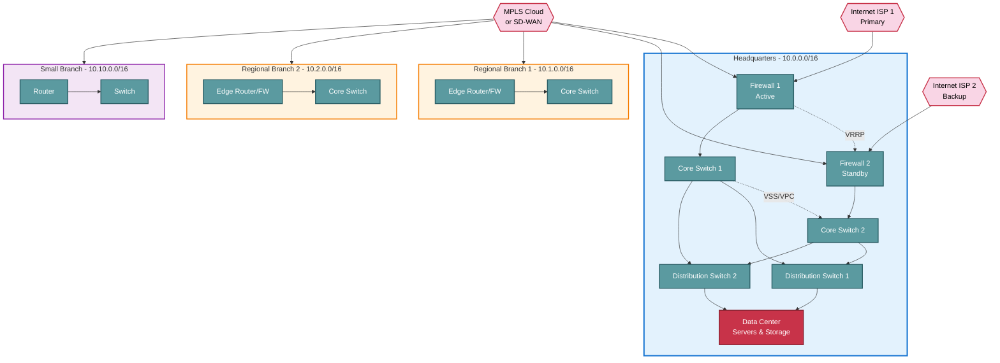

## Scenario Overview

**Organization**: National company with headquarters and regional branch offices

**Scale**:

- **Headquarters**: 150 employees, data center with centralized services
- **3 Regional Branches**: 30-50 employees each
- **5 Small Branches**: 10-20 employees each

**Requirements**:

- Centralized data center at HQ (file servers, application servers, databases)
- Site-to-site connectivity with redundancy
- Hierarchical IP addressing scheme
- QoS for VoIP and critical applications
- Centralized management and monitoring
- Disaster recovery and business continuity
- Budget: $150,000-$300,000 (initial deployment)

## Network Topology Overview



## IP Addressing Hierarchy

### Headquarters (10.0.0.0/16)

| Subnet | VLAN | Purpose | Capacity |
| --- | --- | --- | --- |
| **10.0.0.0/24** | 1 | Infrastructure (routers, firewalls) | 254 |
| **10.0.10.0/24** | 10 | Data center servers | 254 |
| **10.0.11.0/24** | 11 | Database servers | 254 |
| **10.0.12.0/24** | 12 | Storage (SAN, NAS) | 254 |
| **10.0.20.0/22** | 20 | HQ users (1,024 IPs) | 1,022 |
| **10.0.30.0/24** | 30 | Printers/copiers | 254 |
| **10.0.40.0/24** | 40 | VoIP phones | 254 |
| **10.0.50.0/24** | 50 | WiFi (corporate) | 254 |
| **10.0.60.0/24** | 60 | WiFi (guest) | 254 |
| **10.0.99.0/24** | 99 | Management (out-of-band) | 254 |

### Regional Branches (30-50 users each)

**Branch 1**: `10.1.0.0/16`

| Subnet | VLAN | Purpose |
| --- | --- | --- |
| 10.1.10.0/24 | 10 | Users |
| 10.1.20.0/24 | 20 | Printers |
| 10.1.30.0/24 | 30 | VoIP |
| 10.1.40.0/24 | 40 | WiFi (corporate) |
| 10.1.50.0/24 | 50 | WiFi (guest) |
| 10.1.99.0/24 | 99 | Management |

**Branch 2**: `10.2.0.0/16` (same structure as Branch 1)

**Branch 3**: `10.3.0.0/16` (same structure)

### Small Branches (10-20 users each)

**Small Branch 1-5**: `10.10-14.0.0/16`

| Subnet | VLAN | Purpose |
| --- | --- | --- |
| 10.X.10.0/24 | 10 | Users |
| 10.X.20.0/24 | 20 | Printers/VoIP |
| 10.X.50.0/24 | 50 | WiFi (guest) |
| 10.X.99.0/24 | 99 | Management |

### Summary Table

| Site Type | IP Range | User Capacity | Notes |
| --- | --- | --- | --- |
| **HQ** | 10.0.0.0/16 | 65,534 | Centralized services |
| **Regional 1** | 10.1.0.0/16 | 65,534 | Branch A |
| **Regional 2** | 10.2.0.0/16 | 65,534 | Branch B |
| **Regional 3** | 10.3.0.0/16 | 65,534 | Branch C |
| **Small 1-5** | 10.10-14.0.0/16 | 65,534 each | Smaller offices |
| **Future** | 10.15-254.0.0/16 | - | Growth capacity |

## WAN Connectivity Options

### Option 1: MPLS (Traditional)

**Pros**:

- Predictable performance (SLA guarantees)
- Built-in QoS
- Private network (secure)
- Low latency

**Cons**:

- Expensive ($500-2,000/mo per site)
- Long lead times (weeks-months for provisioning)
- Vendor lock-in
- Limited bandwidth (typically 10-100 Mbps)

**Typical Cost**:

- HQ: 100 Mbps MPLS = $2,000/month
- Regional branches: 50 Mbps = $1,000/month each
- Small branches: 10 Mbps = $500/month each
- **Total**: ~$10,500/month

### Option 2: SD-WAN (Modern)

**Pros**:

- Cost-effective (use internet circuits)
- Fast provisioning (days, not months)
- Application-aware routing
- Multiple transport options (broadband, LTE, MPLS hybrid)
- Centralized management

**Cons**:

- Internet-dependent (less predictable than MPLS)
- Requires skilled management
- Encryption overhead

**Topology**:

- HQ: 500 Mbps fiber (primary) + 250 Mbps cable (backup) = $800/mo
- Regional: 250 Mbps fiber (primary) + LTE (backup) = $600/mo
- Small: 100 Mbps fiber + LTE = $400/mo
- **Total**: ~$5,600/month (47% savings vs MPLS)

**Recommended SD-WAN Vendors**:

- **Fortinet SD-WAN** (FortiGate firewalls)
- **Cisco SD-WAN** (Viptela)
- **Palo Alto Prisma SD-WAN**
- **VMware SD-WAN** (VeloCloud)
- **Meraki SD-WAN** (simple, cloud-managed)

### Option 3: Hybrid (MPLS + SD-WAN)

**Use Case**: Transition from MPLS to SD-WAN

**Approach**:

- Keep MPLS for critical sites (HQ, large branches)
- Deploy SD-WAN for small branches and new sites
- Gradually migrate as MPLS contracts expire

**Benefits**: Best of both worlds during transition

## Headquarters Network Design

### Core Layer (Redundant)

**Equipment**:

- 2× Core switches (Cisco Catalyst 9500, Aruba CX 8360)
- 10 Gbps uplinks to distribution
- 40/100 Gbps inter-core link (VSS, VPC, or stacking)
- Routing: OSPF within HQ, BGP to branches

**Configuration** (Cisco VSS example):

```bash
# Core Switch 1
switch virtual domain 1
  switch 1
    priority 200 (higher priority = active)
  switch 2
    priority 100

# 10 Gbps port-channel to Core 2 (VSL)
interface Port-channel1
 switchport
 switch virtual link 1

interface TenGigabitEthernet1/1/1
 channel-group 1 mode on
 no shutdown
```

### Distribution Layer

**Equipment**:

- 4-6× Distribution switches (Cisco Catalyst 3850, Aruba 2930F)
- Aggregation for access layer
- VLAN routing (Layer 3)
- Uplinks: 10 Gbps to core

**Design**:

- 2 distribution switches per building/floor
- Each access switch dual-homed to 2 distribution switches
- LACP or static LAG for redundancy

### Access Layer

**Equipment**:

- 48-port PoE+ switches (Cisco Catalyst 9200, HP/Aruba 2530)
- 1 Gbps access ports
- 10 Gbps uplinks to distribution
- PoE+ for VoIP phones and access points

**Port Configuration** (example):

```bash
# User ports with VoIP
interface range GigabitEthernet1/0/1-40
 switchport mode access
 switchport access vlan 20 (Users)
 switchport voice vlan 40 (VoIP)
 spanning-tree portfast
 spanning-tree bpduguard enable
```

### Data Center

**Servers**:

- File servers: Windows Server 2022 or Linux with SMB/NFS
- Application servers: Web servers, CRM, ERP
- Database servers: SQL Server, MySQL, PostgreSQL
- Virtualization: VMware vSphere or Hyper-V cluster
- Backup: Veeam or Commvault

**Network**:

- 10 Gbps server NICs (dual-homed)
- Separate storage network (iSCSI or Fibre Channel)
- Management network (out-of-band)

**Redundancy**:

- Dual power supplies
- Dual network paths (separate switches)
- RAID for storage
- Cluster/HA for critical services

## Routing Design

### IGP (Interior Gateway Protocol)

**Within Each Site**: OSPF or EIGRP

**HQ OSPF Configuration** (Cisco):

```bash
router ospf 1
 router-id 10.0.0.1
 network 10.0.0.0 0.0.255.255 area 0
 passive-interface default
 no passive-interface GigabitEthernet0/0 (uplink to WAN)
```

### EGP (Exterior Gateway Protocol)

**Between Sites (over MPLS/SD-WAN)**: BGP

**HQ BGP Configuration**:

```bash
router bgp 65000
 bgp router-id 10.0.0.1
 neighbor 10.1.0.1 remote-as 65001 (Branch 1)
 neighbor 10.2.0.1 remote-as 65002 (Branch 2)
 
 address-family ipv4
  network 10.0.0.0 mask 255.255.0.0
  neighbor 10.1.0.1 activate
  neighbor 10.2.0.1 activate
 exit-address-family
```

**Branch BGP Configuration** (Branch 1):

```bash
router bgp 65001
 bgp router-id 10.1.0.1
 neighbor 10.0.0.1 remote-as 65000 (HQ)
 
 address-family ipv4
  network 10.1.0.0 mask 255.255.0.0
  neighbor 10.0.0.1 activate
  default-information originate (default route to HQ)
 exit-address-family
```

### Routing Summary

| Site | Protocol | AS Number | Notes |
| --- | --- | --- | --- |
| **HQ** | BGP | 65000 | Hub |
| **Regional Branches** | BGP | 65001-65003 | Spokes |
| **Small Branches** | Static or BGP | 65010-65014 | Simplified |

## QoS (Quality of Service)

### Traffic Classification

**Priority Classes**:

| Class | Traffic Type | DSCP | Example |
| --- | --- | --- | --- |
| **EF** (Expedited Forwarding) | VoIP | 46 | SIP, RTP |
| **AF41** (Assured Forwarding) | Video conferencing | 34 | Zoom, Teams |
| **AF31** | Business-critical apps | 26 | ERP, CRM |
| **AF21** | Transactional data | 18 | Database queries |
| **DF** (Default) | Best effort | 0 | Web, email |

### QoS Configuration (Cisco Example)

**Classify Traffic**:

```bash
# Class maps
class-map match-any VOIP
 match dscp ef
class-map match-any VIDEO
 match dscp af41
class-map match-any CRITICAL
 match dscp af31

# Policy map
policy-map WAN-QOS
 class VOIP
  priority percent 20
 class VIDEO
  bandwidth percent 20
 class CRITICAL
  bandwidth percent 30
 class class-default
  fair-queue
  random-detect

# Apply to WAN interface
interface GigabitEthernet0/1
 service-policy output WAN-QOS
```

### VoIP QoS Requirements

- **Latency**: < 150 ms (one-way)
- **Jitter**: < 30 ms
- **Packet Loss**: < 1%
- **Bandwidth**: 100 Kbps per call (with G.711 codec)

**Allocation**: Reserve 20-30% of WAN bandwidth for VoIP

## Security Architecture

### Firewall Topology

**HQ**:

- Dual firewalls (active/standby or active/active)
- North-South: Internet and MPLS/SD-WAN termination
- East-West: Data center segmentation

**Branches**:

- Single firewall (or SD-WAN appliance with firewall)
- VPN tunnels back to HQ

### Firewall Rules (HQ Example)

**Branches → HQ Data Center**:

```bash
# Allow branches to file servers
Action: Allow
Source: 10.1-14.0.0/16 (all branches)
Destination: 10.0.10.0/24 (servers)
Ports: 445 (SMB), 2049 (NFS), 3389 (RDP)

# Allow branches to SQL database
Action: Allow
Source: 10.1-14.0.0/16
Destination: 10.0.11.10 (SQL server)
Ports: 1433 (SQL)

# Block inter-branch traffic (must route through HQ)
Action: Deny
Source: 10.1.0.0/16 (Branch 1)
Destination: 10.2-14.0.0/16 (other branches)
```

### VPN (Remote Access)

**Solution**: Cisco AnyConnect, Palo Alto GlobalProtect, or Fortinet FortiClient

**Configuration**:

- Split tunneling: Only corporate traffic via VPN
- IP pool: 10.0.70.0/24 (VPN clients)
- MFA: Duo, Okta, or Azure MFA integration

## Centralized Management

### Network Monitoring

**Options**:

- **Cisco DNA Center**: Cisco-centric, comprehensive
- **SolarWinds NPM**: Multi-vendor, detailed monitoring
- **PRTG Network Monitor**: Affordable, user-friendly
- **Nagios/Zabbix**: Open-source options

**Monitored Metrics**:

- Interface utilization (bandwidth)
- CPU/memory on network devices
- VPN tunnel status
- Packet loss and latency (SLA monitoring)
- Syslog events (errors, failures)

### Configuration Management

**Tools**:

- **Ansible**: Automation, configuration templates
- **Git**: Version control for configs
- **Oxidized/RANCID**: Automated backups

**Best Practices**:

- Daily automated backups of all configs
- Version control (track changes)
- Testing in lab before production changes
- Change approval process

## High Availability & Disaster Recovery

### HQ Redundancy

**Firewalls**: Active/standby with VRRP or HSRP

```bash
# VRRP configuration (Cisco)
interface GigabitEthernet0/0
 ip address 10.0.0.2 255.255.255.0
 vrrp 1 ip 10.0.0.1 (virtual IP)
 vrrp 1 priority 110 (higher = active)
 vrrp 1 preempt
```

**Core Switches**: VSS, VPC, or stacking

**Internet**: Dual ISPs with BGP failover

### Branch Redundancy

**Internet**:

- Primary: Fiber (500 Mbps)
- Backup: Cable or LTE (automatic failover)

**Local Breakout**: Critical cloud apps (Office 365, Salesforce) go direct to internet, not through HQ

### Data Center DR

**Backup Site**: Secondary data center at another location

**Replication**:

- Database replication (SQL Always On, MySQL replication)
- File replication (DFS-R for Windows, rsync for Linux)
- VM replication (VMware SRM, Hyper-V Replica)

**RPO/RTO**:

- **RPO** (Recovery Point Objective): < 15 minutes (how much data loss is acceptable)
- **RTO** (Recovery Time Objective): < 4 hours (how long to restore service)

## Equipment List (Simplified)

### Headquarters

| Equipment | Qty | Unit Price | Total | Notes |
| --- | --- | --- | --- | --- |
| **Firewalls** (Palo Alto PA-3220) | 2 | $15,000 | $30,000 | Active/standby |
| **Core Switches** (Cisco C9500-48Y4C) | 2 | $25,000 | $50,000 | 48× 10G + 4× 40G |
| **Distribution Switches** | 4 | $5,000 | $20,000 | Layer 3 |
| **Access Switches** (48-port PoE+) | 20 | $2,000 | $40,000 | - |
| **Access Points** (WiFi 6) | 30 | $300 | $9,000 | - |
| **Servers** (virtualization, storage) | - | - | $80,000 | 3-node cluster |
| **UPS** (data center) | 2 | $5,000 | $10,000 | Redundant power |
| | | **HQ Total** | **$239,000** | - |

### Regional Branch (×3)

| Equipment | Qty | Unit Price | Total Each | Notes |
| --- | --- | --- | --- | --- |
| **Edge Router/Firewall** | 1 | $3,000 | $3,000 | Fortinet FG-100F |
| **Core Switch** (24-port PoE+) | 1 | $1,500 | $1,500 | Layer 3 |
| **Access Points** | 3 | $300 | $900 | - |
| | | **Per Branch** | **$5,400** | ×3 = $16,200 |

### Small Branch (×5)

| Equipment | Qty | Unit Price | Total Each | Notes |
| --- | --- | --- | --- | --- |
| **Router** (Ubiquiti ER-4) | 1 | $200 | $200 | - |
| **Switch** (8-port PoE+) | 1 | $150 | $150 | - |
| **Access Point** | 1 | $150 | $150 | - |
| | | **Per Branch** | **$500** | ×5 = $2,500 |

### Total Deployment Cost

| Category | Cost |
| --- | --- |
| **HQ** | $239,000 |
| **Regional Branches** (3) | $16,200 |
| **Small Branches** (5) | $2,500 |
| **Installation/Cabling** | $30,000 |
| **Licensing** (3 years) | $50,000 |
| **Professional Services** | $40,000 |
| **Contingency** (10%) | $37,770 |
| **Grand Total** | **~$415,470** |

### Monthly Recurring Costs

| Category | Monthly Cost |
| --- | --- |
| **Internet** (all sites) | $5,600 |
| **MPLS/SD-WAN** (if applicable) | $10,500 (MPLS) or $0 (SD-WAN) |
| **Licensing/Support** | $2,000 |
| **Monitoring Tools** | $500 |
| **Total** | **$8,100** (SD-WAN) or **$18,600** (MPLS) |

## Implementation Timeline

### Phase 1: Planning (Weeks 1-4)

- Finalize network design
- Order equipment (lead time: 4-8 weeks)
- Conduct site surveys (cabling, power)
- Coordinate with ISPs (circuit orders)

### Phase 2: HQ Core Build (Weeks 5-8)

- Install core and distribution switches
- Configure VLANs, routing (OSPF)
- Deploy firewalls (HA configuration)
- Test failover scenarios

### Phase 3: HQ Access Layer (Weeks 9-12)

- Install access switches
- Deploy WiFi access points
- Configure QoS, security policies
- Migrate users in phases (by floor/department)

### Phase 4: Branch Rollout (Weeks 13-20)

- Deploy regional branches first (Weeks 13-16)
  - Install equipment
  - Configure VPN/MPLS
  - Test connectivity to HQ
  - Migrate users
- Deploy small branches (Weeks 17-20)
  - Similar process, simplified configs

### Phase 5: Testing & Optimization (Weeks 21-24)

- End-to-end testing (all sites to HQ)
- Performance tuning (QoS, routing)
- Failover testing (ISP, firewall, core switch)
- User acceptance testing

### Phase 6: Documentation & Handoff (Week 25+)

- Network diagrams (physical, logical)
- IP addressing spreadsheets
- Configuration backups
- Runbooks (troubleshooting, change procedures)
- Training for IT staff

## Related Topics

- [Scenarios Overview](index.md) - Other network designs
- [Branch Office Design](branch-office.md) - Single remote site
- [Capacity Planning](../capacity-planning.md) - Sizing and scaling
- [Routing](../routing.md) - OSPF and BGP details
- [Firewalls](../firewalls.md) - Security architecture

---

*Multi-site enterprise networks require careful planning, redundancy at every layer, and centralized management to ensure reliability and performance across all locations.*
