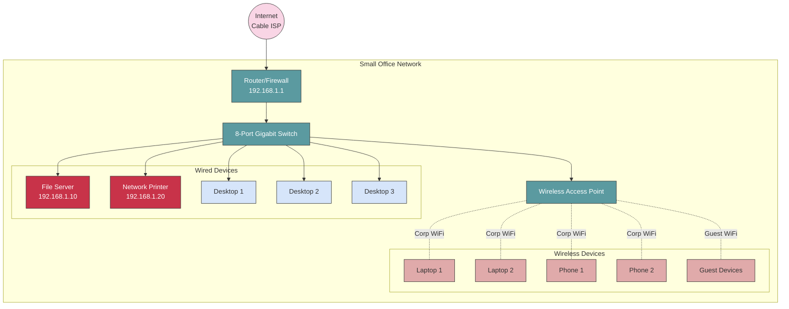

## Scenario Overview

**Organization**: Small consulting firm
**Users**: 15 employees + guests
**Budget**: $2,000-$4,000 for networking equipment
**Requirements**:

- Reliable internet access
- Secure WiFi for employees
- Guest WiFi (isolated)
- Network printer sharing
- Basic file sharing
- VPN for remote access (2-3 users)

## Network Design

### Network Diagram



### IP Addressing Scheme

| Device Type | IP Range | Example | Notes |
|-------------|----------|---------|-------|
| **Gateway** | 192.168.1.1 | Router | Default gateway |
| **Infrastructure** | 192.168.1.2-9 | Switch (if managed), AP | Static |
| **Servers** | 192.168.1.10-29 | File server, print server | Static or reserved |
| **Printers** | 192.168.1.30-49 | Network printers | Static or reserved |
| **Workstations** | 192.168.1.50-99 | Desktops (wired) | DHCP reservations |
| **DHCP Pool** | 192.168.1.100-200 | Laptops, phones | Dynamic |
| **Guests** | 192.168.1.201-254 | Guest devices | Dynamic, isolated |

**Network**: 192.168.1.0/24
**Subnet Mask**: 255.255.255.0
**Usable IPs**: 192.168.1.1 - 192.168.1.254 (254 addresses)

## Equipment List

### Required Equipment

| Device | Specification | Quantity | Est. Cost | Purpose |
|--------|---------------|----------|-----------|---------|
| **Router/Firewall** | Dual WAN, VPN, 1 Gbps throughput | 1 | $200-400 | Internet gateway, firewall, VPN |
| **Switch** | 8-port gigabit, unmanaged | 1 | $40-80 | Connect wired devices |
| **Wireless AP** | WiFi 6, dual-band, PoE | 1 | $150-300 | Employee and guest WiFi |
| **Cat6 Cables** | Various lengths | 10-15 | $50-100 | Network connections |
| **Patch Panel** | 12-port (optional) | 1 | $30-50 | Organized cable management |

**Total Equipment Cost**: $470-930

### Recommended Equipment Options

**Budget Option (~$500)**:

- Router: Ubiquiti EdgeRouter X ($60) + OpenVPN
- Switch: TP-Link TL-SG108 8-port ($25)
- AP: TP-Link EAP225 ($60) or Ubiquiti U6-Lite ($99)
- Cables and misc: $100

**Recommended Option (~$1,500)**:

- Router: Ubiquiti Dream Machine ($299) or pfSense box ($400)
- Switch: Ubiquiti US-8-150W PoE ($109) or Netgear GS110TP ($90)
- AP: Ubiquiti U6-Pro ($189) or Ruckus R650 ($600)
- Cables and misc: $150

**Enterprise Option (~$3,500)**:

- Firewall: Fortinet FortiGate 60F ($800) or Cisco Meraki MX67 ($800)
- Switch: Cisco SG350-10P ($400) or Aruba 2530-8G-PoE+ ($500)
- AP: Cisco Meraki MR36 ($600) or Aruba AP-515 ($700)
- Cables, rack, UPS: $400

## Implementation Guide

### Step 1: Physical Installation

1. **Mount rack equipment**:
   - Install patch panel at top
   - Mount switch below patch panel
   - Place router/firewall in rack or on shelf

2. **Run cables**:
   - Pull Cat6 cable to each desk location
   - Run cable to AP mounting location (ceiling preferred)
   - Label both ends of each cable

3. **Power considerations**:
   - UPS for router, switch, server (30 min runtime minimum)
   - PoE for access point (or use power injector)

### Step 2: Router Configuration

#### WAN Configuration

```text
Interface: eth0 (WAN)
Connection Type: DHCP (from ISP)
DNS: 1.1.1.1, 8.8.8.8 (Cloudflare, Google)
MTU: 1500 (or as specified by ISP)
```

#### LAN Configuration

```text
Interface: eth1 (LAN)
IP Address: 192.168.1.1
Subnet Mask: 255.255.255.0
DHCP Server: Enabled
  - Range: 192.168.1.100 - 192.168.1.254
  - Lease Time: 8 hours
  - DNS Servers: 192.168.1.1 (router forwards to 1.1.1.1)
  - Default Gateway: 192.168.1.1
```

#### Firewall Rules (Basic)

```text
WAN → LAN: Block all (except established/related)
LAN → WAN: Allow all
LAN → LAN: Allow all

Port Forwards (if needed):
- None by default (security)
- VPN on UDP 1194 (OpenVPN) or UDP 500/4500 (IPsec)
```

### Step 3: DHCP Reservations

Reserve IPs for key devices:

```text
File Server:
  MAC: aa:bb:cc:dd:ee:ff
  IP: 192.168.1.10
  Hostname: fileserver

Network Printer:
  MAC: 11:22:33:44:55:66
  IP: 192.168.1.20
  Hostname: printer-accounting

Wireless AP:
  MAC: 00:11:22:33:44:55
  IP: 192.168.1.5
  Hostname: ap-office
```

### Step 4: Wireless Configuration

#### Employee WiFi

```text
SSID: CompanyName-Office
Security: WPA2-Personal (or WPA3 if supported)
Password: [Strong 20+ character passphrase]
Band: 2.4 GHz + 5 GHz (same SSID)
Channel (2.4 GHz): 1, 6, or 11 (least congested)
Channel (5 GHz): Auto or 36, 149 (non-DFS)
Network: 192.168.1.0/24 (main network)
```

#### Guest WiFi

```text
SSID: CompanyName-Guest
Security: WPA2-Personal
Password: [Simple password, post in reception]
Band: 2.4 GHz + 5 GHz
Guest Isolation: Enabled
Network Access: Internet only (no local network access)
Bandwidth Limit: 10-20 Mbps per device (optional)
```

### Step 5: VPN Configuration

For remote access (2-3 users):

#### OpenVPN (Linux/pfSense)

```bash
# Server configuration
port 1194
proto udp
dev tun
ca ca.crt
cert server.crt
key server.key
dh dh2048.pem
server 10.8.0.0 255.255.255.0
push "route 192.168.1.0 255.255.255.0"
push "dhcp-option DNS 192.168.1.1"
keepalive 10 120
cipher AES-256-CBC
user nobody
group nogroup
persist-key
persist-tun
status openvpn-status.log
verb 3
```

#### Client Setup

```text
Distribute client certificates (.ovpn files)
Clients install OpenVPN client
Connect remotely to access 192.168.1.0/24 network
```

### Step 6: Testing and Verification

#### Connectivity Tests

```bash
# From workstation, test:

# 1. Internet connectivity
ping -c 4 8.8.8.8
ping -c 4 google.com

# 2. Local network
ping -c 4 192.168.1.1    # Gateway
ping -c 4 192.168.1.10   # File server
ping -c 4 192.168.1.20   # Printer

# 3. DNS resolution
nslookup google.com
nslookup fileserver.local  # If internal DNS

# 4. Speed test
speedtest-cli  # Or use web browser: speedtest.net
```

#### WiFi Performance

```text
Expected speeds (ideal conditions):
- 2.4 GHz: 50-150 Mbps
- 5 GHz: 200-600 Mbps

Minimum acceptable RSSI:
- Office space: -60 dBm or better
- Conference room: -55 dBm or better
- Reception: -65 dBm acceptable
```

## Security Hardening

### Router/Firewall

- ✅ Change default admin password (20+ characters)
- ✅ Disable remote management (or restrict to VPN)
- ✅ Enable automatic firmware updates
- ✅ Disable WPS on WiFi
- ✅ Enable SPI firewall (stateful packet inspection)
- ✅ Disable unused services (UPnP, Telnet)

### WiFi Security

- ✅ WPA2-Personal minimum (WPA3 preferred)
- ✅ Strong passphrase (20+ characters, not dictionary words)
- ✅ Guest isolation enabled
- ✅ Hidden SSID (optional, minimal security benefit)
- ✅ Disable WPS

### Network Security

- ✅ DHCP snooping (if managed switch)
- ✅ Port security (if managed switch)
- ✅ Regular firmware updates
- ✅ Document all configurations
- ✅ Monthly security reviews

## Maintenance Schedule

### Weekly

- Monitor internet connectivity
- Check WiFi performance complaints
- Review firewall logs for anomalies

### Monthly

- Check for firmware updates (router, AP, switch)
- Review DHCP leases for unknown devices
- Verify backups of configurations
- Test VPN connectivity

### Quarterly

- Audit user accounts and permissions
- Review and update documentation
- Test disaster recovery procedures
- Security assessment

### Annually

- Change WiFi passwords
- Review and update firewall rules
- Evaluate equipment for replacement/upgrade
- Plan for capacity growth

## Troubleshooting Common Issues

### No Internet Access

**Check**:

1. Modem lights (power, online, internet)
2. Router WAN light (should be lit)
3. Restart: Modem → wait 2 min → Router → wait 1 min
4. Check ISP status page for outages
5. Bypass router temporarily (connect PC directly to modem)

### Slow WiFi

**Check**:

1. Signal strength (move closer to AP)
2. Interference (use WiFi analyzer app)
3. Number of connected devices (disconnect unused)
4. Channel congestion (change to 1, 6, or 11)
5. Switch to 5 GHz band

### Can't Access Printer

**Check**:

1. Printer powered on and connected
2. Printer IP address correct (check DHCP reservation)
3. Printer drivers installed
4. Network path: ping 192.168.1.20
5. Printer not in error state (paper jam, offline)

### VPN Won't Connect

**Check**:

1. Internet connectivity working
2. VPN port forwarded (UDP 1194 or 500/4500)
3. Client certificate valid and not expired
4. Firewall allowing VPN traffic
5. Router VPN service running

## Cost Analysis

### One-Time Costs

- Equipment: $500-3,500 (depending on options)
- Installation: $500-1,500 (if hiring contractor)
- Cabling: $200-800 (materials + labor if needed)

### Monthly Costs

- Internet service: $50-150 (based on speed)
- Cloud services: $0-100 (if using cloud file storage)
- VPN licenses: $0-50 (if using commercial VPN service)
- **Total Monthly**: $50-300

### Annual Costs

- Maintenance/support: $500-2,000 (if outsourced)
- Equipment refresh: $200-500 (fund for replacements)
- Licenses/subscriptions: $0-500 (if using managed services)

## Scaling Considerations

### 20-30 Users

- Add second 8-port switch
- Consider managed switches for VLANs
- Add second access point for coverage
- Upgrade internet to 500 Mbps+

### 30-50 Users

- Upgrade to 24-port managed switch
- Multiple access points (survey needed)
- Dedicated firewall appliance
- Consider server VLAN segmentation
- Upgrade to business fiber internet

## Related Scenarios

- [Branch Office](branch-office.md) - Remote site with VPN to HQ
- [Home Lab](home-lab.md) - Segmented testing environment
- [Multi-Site](multi-site.md) - Enterprise with multiple locations

## Additional Resources

- [Getting Started Guide](../getting-started.md) - Basic networking concepts
- [Firewall Configuration](../firewalls.md) - Security best practices
- [WiFi Planning](../wireless.md) - Wireless design and optimization
- [Capacity Planning](../capacity-planning.md) - Growth planning

---

*This scenario provides a proven, cost-effective design for small office networks. Customize based on your specific requirements and budget.*
