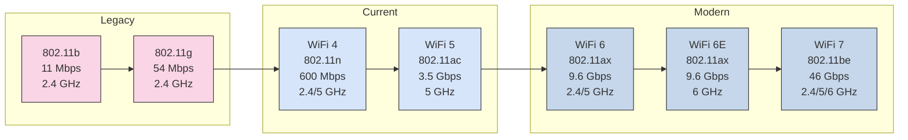

# Wireless Networking

## Overview

Wireless networking uses radio frequency (RF) signals to provide network connectivity without physical cables. Modern WiFi networks are essential for homes, offices, and public spaces, supporting laptops, smartphones, tablets, IoT devices, and more.

## Prerequisites

Before diving into wireless networking, you should understand:

- [Network Fundamentals](fundamentals.md) - Basic networking concepts
- [VLANs](vlans.md) - Network segmentation (for SSID-to-VLAN mapping)
- [DHCP](dhcp.md) and [DNS](dns.md) - Network services

## 802.11 Standards

WiFi is based on the IEEE 802.11 family of standards:

| Standard | Name | Year | Frequency | Max Speed | Range | Notes |
|----------|------|------|-----------|-----------|-------|-------|
| **802.11b** | | 1999 | 2.4 GHz | 11 Mbps | Good | Obsolete |
| **802.11a** | | 1999 | 5 GHz | 54 Mbps | Moderate | Obsolete |
| **802.11g** | | 2003 | 2.4 GHz | 54 Mbps | Good | Legacy |
| **802.11n** | Wi-Fi 4 | 2009 | 2.4/5 GHz | 600 Mbps | Good | Common |
| **802.11ac** | Wi-Fi 5 | 2014 | 5 GHz | 3.5 Gbps | Good | Current standard |
| **802.11ax** | Wi-Fi 6 | 2019 | 2.4/5 GHz | 9.6 Gbps | Better | Modern |
| **802.11ax** | Wi-Fi 6E | 2020 | 6 GHz | 9.6 Gbps | Good | Latest, requires new devices |
| **802.11be** | Wi-Fi 7 | 2024 | 2.4/5/6 GHz | 46 Gbps | Better | Emerging |

### WiFi Generations Comparison



### Key Improvements by Generation

**WiFi 4 (802.11n)**:

- MIMO (Multiple Input Multiple Output) - Multiple antennas
- Channel bonding (20 MHz → 40 MHz)
- Both 2.4 GHz and 5 GHz support

**WiFi 5 (802.11ac)**:

- Wider channels (80 MHz, 160 MHz)
- MU-MIMO (Multi-User MIMO) - Serve multiple clients simultaneously
- 5 GHz only (cleaner spectrum)
- Beamforming (directional signal focus)

**WiFi 6 (802.11ax)**:

- OFDMA (Orthogonal Frequency Division Multiple Access) - Efficient spectrum use
- Target Wake Time (TWT) - IoT battery savings
- 1024-QAM modulation - More data per transmission
- Better performance in crowded environments

**WiFi 6E**:

- 6 GHz band (1200 MHz of spectrum)
- No legacy device interference
- 14 additional 80 MHz channels or 7 additional 160 MHz channels

**WiFi 7 (802.11be)**:

- 320 MHz channels
- Multi-Link Operation (MLO) - Simultaneous multi-band
- 4K-QAM modulation
- Improved latency for gaming/VR

## Frequency Bands

### 2.4 GHz Band

**Characteristics**:

- **Range**: Excellent (penetrates walls better)
- **Speed**: Lower (more interference)
- **Channels**: 11 channels (North America), only 3 non-overlapping (1, 6, 11)
- **Interference**: High (Bluetooth, microwaves, cordless phones, baby monitors)

**Best For**:

- IoT devices (smart home, sensors)
- Devices far from access point
- Devices requiring wall penetration
- Legacy device support

### 5 GHz Band

**Characteristics**:

- **Range**: Moderate (less wall penetration)
- **Speed**: Higher (less interference)
- **Channels**: 24 non-overlapping channels (UNII-1, UNII-2, UNII-3)
- **Interference**: Low (less crowded)
- **DFS**: Dynamic Frequency Selection (shares with radar, may cause brief interruptions)

**Best For**:

- Laptops, tablets, smartphones
- Streaming video (Netflix, YouTube)
- Video conferencing
- Gaming
- High-density environments

### 6 GHz Band (WiFi 6E)

**Characteristics**:

- **Range**: Similar to 5 GHz
- **Speed**: Highest (pristine spectrum)
- **Channels**: 59 channels (14x 80 MHz, 7x 160 MHz, 3x 320 MHz)
- **Interference**: None (new spectrum)
- **Compatibility**: Requires WiFi 6E devices (iPhone 15+, recent Android flagships)

**Best For**:

- VR/AR applications
- 4K/8K video streaming
- Enterprise density scenarios
- Future-proofing

## WiFi Channels

### 2.4 GHz Channel Layout

```text
Channel:  1   2   3   4   5   6   7   8   9   10  11
Freq:   2412 ...                 ...                2462 MHz
        
Non-overlapping:
         [====1====]  [=======6=======]  [====11====]
         
Overlapping (BAD):
         [====1====]
             [====3====]
                 [====5====]   ← INTERFERENCE!
```

**Best Practice**: Only use channels 1, 6, and 11 in 2.4 GHz

### 5 GHz Channel Layout

Many more non-overlapping channels available:

**UNII-1** (Indoor):

- Channels: 36, 40, 44, 48
- Power: Lower
- No DFS required

**UNII-2A** (Indoor):

- Channels: 52, 56, 60, 64
- **DFS required** (Dynamic Frequency Selection)
- Shares with weather radar

**UNII-2C** (Indoor/Outdoor):

- Channels: 100, 104, 108, 112, 116, 120, 124, 128, 132, 136, 140, 144
- **DFS required**
- Higher power allowed

**UNII-3** (Outdoor):

- Channels: 149, 153, 157, 161, 165
- Higher power
- No DFS required
- Best for outdoor APs

### Channel Width

| Width | Use Case | 2.4 GHz | 5 GHz | 6 GHz |
|-------|----------|---------|-------|-------|
| **20 MHz** | Maximum compatibility, range | Standard | Available | Available |
| **40 MHz** | Balance speed/compatibility | Avoid (interference) | Good | Good |
| **80 MHz** | High performance | N/A | Best | Best |
| **160 MHz** | Maximum speed | N/A | Limited availability | Good |
| **320 MHz** | WiFi 7 | N/A | N/A | WiFi 7 only |

**Recommendations**:

- **2.4 GHz**: Always 20 MHz (avoid 40 MHz, causes interference)
- **5 GHz**: 80 MHz for most deployments, 40 MHz if crowded
- **6 GHz**: 80-160 MHz depending on client support

## WiFi Security

### Security Protocols Evolution

| Protocol | Year | Security | Status | Use |
|----------|------|----------|--------|-----|
| **Open** | N/A | None | Insecure | Never (except captive portal) |
| **WEP** | 1999 | Weak | Broken | Never use |
| **WPA** | 2003 | TKIP | Deprecated | Never use |
| **WPA2-Personal** | 2004 | AES-CCMP | Good | Home networks |
| **WPA2-Enterprise** | 2004 | AES-CCMP + 802.1X | Excellent | Corporate networks |
| **WPA3-Personal** | 2018 | SAE (Dragonfly) | Best | Modern home |
| **WPA3-Enterprise** | 2018 | 192-bit | Best | Government, financial |

### WPA2-Personal (Pre-Shared Key)

**How it works**:

- Single passphrase shared by all users
- 8-63 characters (longer = stronger)
- AES encryption (CCMP mode)

**Configuration**:

```text
SSID: MySecureNetwork
Security: WPA2-Personal
Passphrase: Sup3rS3cur3P@ssw0rdW1thL3ng7h!
```

**Best Practices**:

- **Minimum 20 characters** for passphrase
- Mix upper, lower, numbers, symbols
- Avoid dictionary words
- Change periodically (annually)
- Never share publicly

**Use Cases**:

- Home networks
- Small offices (<10 people)
- Guest networks (separate SSID)

### WPA3-Personal (Enhanced)

**Improvements over WPA2**:

- **SAE (Simultaneous Authentication of Equals)** - Stronger key exchange
- **Forward Secrecy** - Past traffic remains secure even if passphrase compromised
- **Protection against brute force** - Offline dictionary attacks prevented
- **Easier setup** - WiFi Easy Connect (QR code)

**Requirements**:

- WPA3-capable access points
- WPA3-capable clients (most devices 2020+)

**Transition Mode**:

```text
Security: WPA2/WPA3-Personal (Transitional)
```

Allows both WPA2 and WPA3 clients during migration.

### WPA2/WPA3-Enterprise (802.1X)

**How it works**:

- RADIUS server authenticates users
- Unique credentials per user (username/password or certificate)
- Centralized authentication and logging
- Per-user/device policies

**Components**:

```text
Client (Supplicant) ← → Access Point (Authenticator) ← → RADIUS Server
```

**Authentication Methods**:

- **PEAP-MSCHAPv2**: Username/password (most common)
- **EAP-TLS**: Certificate-based (most secure)
- **EAP-TTLS**: Certificate + inner authentication

**Advantages**:

- Individual user credentials
- Audit logging (who connected when)
- Easy user revocation
- No shared passphrase
- Dynamic VLAN assignment

**Use Cases**:

- Corporate networks
- Universities/schools
- Healthcare
- Any organization >50 users

### WiFi Security Best Practices

1. **Always use WPA2/WPA3** - Never open, WEP, or WPA
2. **Strong passphrases** - 20+ characters for WPA2-Personal
3. **Separate guest network** - Isolated from corporate
4. **Hide SSID (optional)** - Minimal security benefit, but reduces casual discovery
5. **MAC filtering (optional)** - Easy to bypass, not primary security
6. **Enterprise for corporate** - WPA2/WPA3-Enterprise with RADIUS
7. **Regular firmware updates** - Security patches
8. **Disable WPS** - Vulnerable to brute force attacks
9. **Monitor rogue APs** - Detect unauthorized access points

## WiFi Network Design

### Site Survey

Before deploying WiFi, conduct a site survey:

**Goals**:

- Identify coverage gaps
- Measure interference
- Determine AP placement
- Optimize channel assignment

**Tools**:

- Ekahau Site Survey (professional)
- NetSpot (affordable)
- WiFi Analyzer (Android, free)
- iStumbler (Mac, free)

**Process**:

1. Create floor plan
2. Measure signal strength throughout
3. Identify dead zones
4. Note interference sources
5. Plan AP locations

### Access Point Placement

**Guidelines**:

**Height**:

- **Ceiling mount**: 8-12 feet (2.5-3.5 m) ideal
- **Wall mount**: 6-8 feet (2-2.5 m)

**Coverage**:

- **Indoor**: 30-50 meters (100-165 feet) typical range
- **Walls**: Reduce coverage significantly
- **Overlap**: 15-20% overlap between APs for roaming

**Density**:

- **Office**: 1 AP per 2,000-3,000 sq ft (185-280 sq m)
- **High density** (conference room): 1 AP per 1,000 sq ft (93 sq m)
- **Outdoor**: 1 AP per 10,000 sq ft (930 sq m)

**Avoid**:

- Metal objects (filing cabinets, HVAC)
- Microwaves, refrigerators
- Thick concrete walls
- Aquariums (water absorbs 2.4 GHz)

### Channel Planning

#### Single AP Deployment

```text
2.4 GHz: Channel 1 or 6 or 11 (least interference)
5 GHz: Auto (DFS channels OK) or manually select uncongested channel
```

#### Multiple AP Deployment

```text
AP1: 2.4 GHz Channel 1, 5 GHz Channel 36
AP2: 2.4 GHz Channel 6, 5 GHz Channel 48
AP3: 2.4 GHz Channel 11, 5 GHz Channel 157
```

Repeat pattern for more APs, ensuring adjacent APs use different channels.

### SSID Design

**Single SSID** (Recommended for most):

```text
Corporate-WiFi (5 GHz and 2.4 GHz)
```

**Advantages**:

- Simpler for users
- Band steering (AP pushes capable devices to 5 GHz)
- Seamless roaming

**Multiple SSIDs** (Advanced):

```text
Corporate-5G (5 GHz only)
Corporate-2.4G (2.4 GHz only)
Corporate-Guest (Guest VLAN)
Corporate-IoT (IoT VLAN, limited access)
```

**Advantages**:

- Explicit band selection
- VLAN separation
- Different security policies

**Best Practice**:

- 1-3 SSIDs per AP (performance impact beyond 4-5)
- Corporate, Guest, and optionally IoT

## WiFi Performance Optimization

### Band Steering

Pushes dual-band clients to 5 GHz:

**Methods**:

- Lower 2.4 GHz power
- Delay 2.4 GHz probe responses
- Active client steering

**Benefits**:

- Frees 2.4 GHz for legacy/IoT devices
- Better performance for capable clients
- Reduced congestion

### Roaming

Clients transition between APs seamlessly:

**802.11r (Fast Roaming)**:

- Pre-authenticates with neighboring APs
- Reduces handoff time from 50ms to <10ms
- Critical for VoIP, video calls

**802.11k (Neighbor Reports)**:

- APs report nearby APs to clients
- Client can proactively roam to better AP

**802.11v (BSS Transition Management)**:

- AP suggests client roam to better AP
- Disassociates sticky clients from weak signal AP

**Best Practice**: Enable 802.11r/k/v on enterprise APs

### Airtime Fairness

Prevents slow clients from consuming disproportionate airtime:

**Problem**: 11 Mbps client takes 5x longer to transmit same data as 54 Mbps client

**Solution**:

- Limit per-client airtime
- Prioritize faster clients
- Minimum RSSI requirements (disconnect weak clients)

### Quality of Service (QoS)

Prioritize traffic types:

| Priority | WMM Access Category | Traffic Type |
|----------|---------------------|--------------|
| **Highest** | Voice | VoIP, video conferencing |
| **High** | Video | Streaming, real-time video |
| **Medium** | Best Effort | Web browsing, downloads |
| **Low** | Background | File transfers, backups |

**Enable WMM (WiFi Multimedia)** on all APs for QoS support.

## Wireless Troubleshooting

### Common Issues

#### Slow WiFi Speeds

**Possible Causes**:

1. **Weak signal** - Too far from AP, obstacles
2. **Interference** - Neighboring networks, 2.4 GHz devices
3. **Client limitations** - Old WiFi adapter (802.11g vs 802.11ac)
4. **Channel congestion** - Too many APs on same channel
5. **ISP bottleneck** - Slow internet (not WiFi problem)

**Solutions**:

1. Move closer to AP
2. Change channel (1, 6, or 11 for 2.4 GHz)
3. Switch to 5 GHz
4. Upgrade client WiFi adapter
5. Add more APs for coverage
6. Test wired speed to isolate WiFi vs internet

#### Can't Connect to WiFi

**Checklist**:

1. Correct passphrase
2. Compatible security protocol (WPA2 support)
3. DHCP scope not exhausted
4. MAC filtering not blocking device
5. Client driver updated
6. AP broadcasting SSID (if hidden, manually add)

#### Intermittent Disconnections

**Causes**:

- Roaming issues (poor coverage overlap)
- Interference
- DFS channel radar detection (5 GHz)
- Power management (client going to sleep)

**Solutions**:

- Improve AP overlap for roaming
- Change to non-DFS channels (149-165)
- Disable aggressive power management
- Update AP firmware

### WiFi Analysis Tools

#### Windows

```powershell
# View available networks
netsh wlan show networks mode=bssid

# View current connection
netsh wlan show interfaces

# Generate WiFi report
netsh wlan show wlanreport
```

#### Linux

```bash
# View networks
iwlist wlan0 scan

# Connection info
iwconfig wlan0

# Connection strength
watch -n 1 cat /proc/net/wireless

# Detailed info
iw dev wlan0 station dump
```

#### Mac

```bash
# Hold Option, click WiFi icon for detailed info
# Or:
/System/Library/PrivateFrameworks/Apple80211.framework/Versions/Current/Resources/airport -I

# Scan networks
/System/Library/PrivateFrameworks/Apple80211.framework/Versions/Current/Resources/airport -s
```

#### Mobile Apps

- **WiFi Analyzer** (Android) - Channel analysis, signal strength
- **NetSpot** (Windows/Mac) - Site surveys, heatmaps
- **iStumbler** (Mac) - Network discovery, signal monitoring

### Signal Strength Interpretation

| RSSI (dBm) | Signal Quality | Experience |
|------------|----------------|------------|
| **-30 to -50** | Excellent | Maximum performance |
| **-50 to -60** | Very Good | Reliable connectivity |
| **-60 to -67** | Good | Acceptable performance |
| **-67 to -70** | Fair | Minimum for VoIP |
| **-70 to -80** | Poor | Slow speeds, drops |
| **-80 to -90** | Very Poor | Unreliable |
| **Below -90** | No Signal | Cannot connect |

**Minimum Requirements**:

- **Data browsing**: -70 dBm
- **VoIP/streaming**: -67 dBm
- **HD video**: -60 dBm

## Platform-Specific Implementation

### UniFi WiFi

For Ubiquiti UniFi-specific configuration:

- [UniFi Network Guide](unifi/index.md)

### Enterprise WiFi

Consider enterprise solutions:

- **Cisco Meraki** - Cloud-managed, easy, expensive
- **Aruba** - Enterprise-grade, flexible
- **Ruckus** - High performance, education/healthcare
- **Ubiquiti UniFi** - Affordable, prosumer/SMB
- **Extreme Networks** - Large scale, hospitals/warehouses

## Best Practices Summary

### Security

1. ✅ WPA2/WPA3-Personal minimum (home)
2. ✅ WPA2/WPA3-Enterprise (corporate)
3. ✅ Separate guest network (isolated VLAN)
4. ✅ Strong passphrases (20+ characters)
5. ✅ Disable WPS
6. ✅ Regular firmware updates

### Performance

1. ✅ Use 5 GHz for high-speed clients
2. ✅ Reserve 2.4 GHz for IoT/legacy
3. ✅ Non-overlapping channels (1, 6, 11 in 2.4 GHz)
4. ✅ Enable 802.11r/k/v for roaming
5. ✅ Band steering to 5 GHz
6. ✅ Limit SSIDs (max 3-4 per AP)

### Coverage

1. ✅ Conduct site survey before deployment
2. ✅ 15-20% AP overlap for roaming
3. ✅ Ceiling mount 8-12 feet high
4. ✅ Avoid metal, microwaves, thick walls

### Management

1. ✅ Centralized WiFi controller (enterprise)
2. ✅ Monitor client connections and performance
3. ✅ Regular channel analysis (interference)
4. ✅ Document AP locations and channels

## Related Topics

- [VLANs](vlans.md) - SSID-to-VLAN mapping for network segmentation
- [Network Security](security/index.md) - Advanced security frameworks
- [UniFi Equipment](unifi/index.md) - Ubiquiti wireless implementation
- [DHCP](dhcp.md) - IP address management for wireless clients
- [Troubleshooting](troubleshooting.md) - Wireless diagnostics

## Next Steps

After understanding wireless networking:

1. Conduct [site survey](guides.md) for your environment
2. Plan [VLAN strategy](vlans.md) for SSID isolation
3. Configure [guest network](guides.md) with limited access
4. Implement [monitoring](troubleshooting.md) for WiFi health
5. Explore [enterprise WiFi controllers](guides.md)

## Additional Resources

- **WiFi Standards**: IEEE 802.11 Working Group (<https://www.ieee802.org/11/>)
- **WiFi Alliance**: <https://www.wi-fi.org> (certification, specs)
- **FCC Spectrum**: <https://www.fcc.gov/wireless-spectrum>
- **Ekahau Blog**: <https://www.ekahau.com/blog> (WiFi design)
- **Revolution WiFi**: <https://www.revolutionwifi.net> (troubleshooting)

---

*Wireless networking requires careful planning and ongoing optimization. Proper design ensures reliable, secure, high-performance WiFi for all users.*
