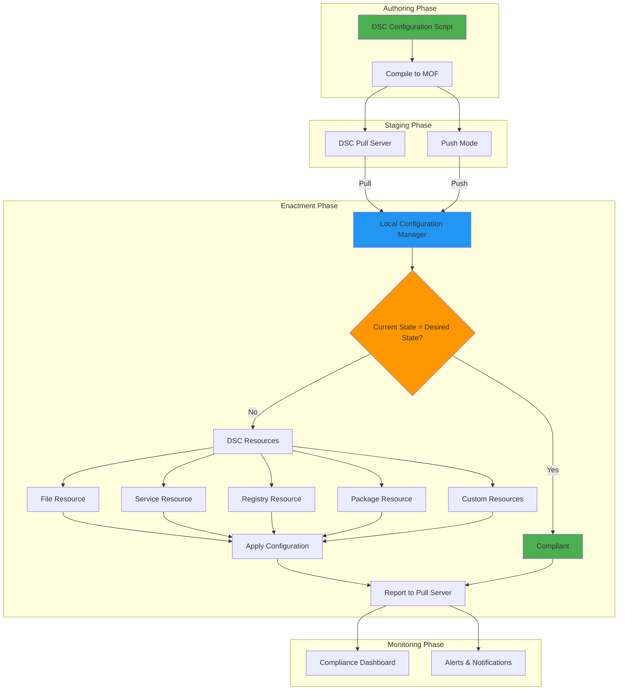
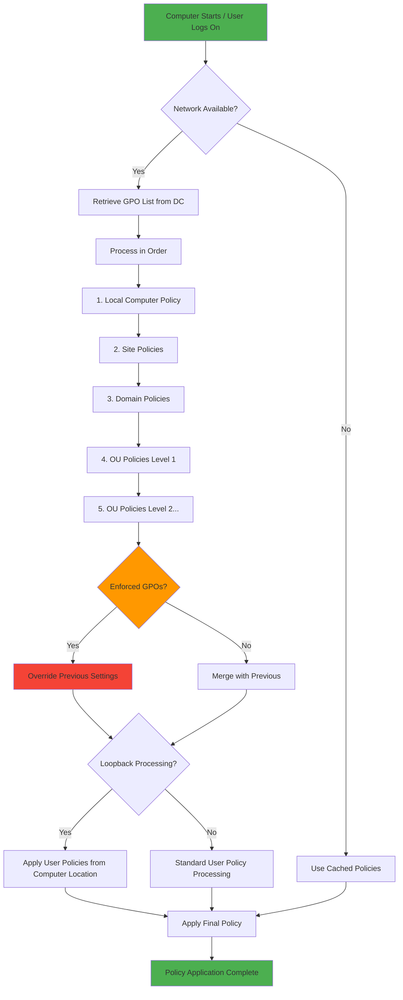

Configuration management is essential for maintaining consistent, secure, and efficient Windows Server environments. This guide covers PowerShell automation, package management with winget, and configuration management best practices.

## PowerShell for Configuration Management

### PowerShell Execution Policy

Configure execution policy for secure script execution:

```powershell
# View current execution policy
Get-ExecutionPolicy

# Set execution policy for current user
Set-ExecutionPolicy -ExecutionPolicy RemoteSigned -Scope CurrentUser

# Set execution policy for local machine
Set-ExecutionPolicy -ExecutionPolicy RemoteSigned -Scope LocalMachine
```

### PowerShell Modules Management

#### Installing PowerShell Modules

```powershell
# Install modules from PowerShell Gallery
Install-Module -Name PowerShellGet -Force
Install-Module -Name PackageManagement -Force
Install-Module -Name PSWindowsUpdate -Force
Install-Module -Name ActiveDirectory -Force

# Install specific version
Install-Module -Name Az -RequiredVersion 9.0.0

# Install for all users
Install-Module -Name SqlServer -Scope AllUsers
```

#### Module Management Commands

```powershell
# List installed modules
Get-InstalledModule

# Update modules
Update-Module

# Uninstall modules
Uninstall-Module -Name ModuleName

# Import modules
Import-Module -Name ActiveDirectory
```

### PowerShell Desired State Configuration (DSC)

#### DSC Architecture Overview

DSC provides declarative configuration management for Windows:



#### DSC Configuration Example

```powershell
Configuration WebServerConfig {
    param(
        [string[]]$NodeName = 'localhost'
    )

    Node $NodeName {
        # Enable IIS
        WindowsFeature IIS {
            Name = 'IIS-WebServer'
            Ensure = 'Present'
        }

        # Configure website
        File WebContent {
            DestinationPath = 'C:\inetpub\wwwroot\index.html'
            Contents = '<h1>Hello World</h1>'
            Ensure = 'Present'
            Type = 'File'
        }

        # Configure service
        Service W3SVC {
            Name = 'W3SVC'
            State = 'Running'
            StartupType = 'Automatic'
            DependsOn = '[WindowsFeature]IIS'
        }
    }
}

# Compile configuration
WebServerConfig -NodeName 'Server01'

# Apply configuration
Start-DscConfiguration -Path .\WebServerConfig -Wait -Verbose
```

#### DSC Resource Management

```powershell
# Install DSC resources
Install-Module -Name PSDscResources
Install-Module -Name xWebAdministration
Install-Module -Name SqlServerDsc

# List available DSC resources
Get-DscResource

# Get specific resource information
Get-DscResource -Name File
```

### PowerShell Remoting

#### Enable PowerShell Remoting

```powershell
# Enable PS Remoting
Enable-PSRemoting -Force

# Configure trusted hosts
Set-Item WSMan:\localhost\Client\TrustedHosts -Value "*"

# Test connection
Test-WSMan -ComputerName Server01
```

#### Remote Session Management

```powershell
# Create persistent session
$session = New-PSSession -ComputerName Server01 -Credential (Get-Credential)

# Execute commands remotely
Invoke-Command -Session $session -ScriptBlock {
    Get-Service | Where-Object Status -eq 'Running'
}

# Import remote module
Import-PSSession -Session $session -Module ActiveDirectory

# Close session
Remove-PSSession -Session $session
```

## Package Management with winget

### winget Installation and Setup

```powershell
# Install winget (if not already installed)
# Download from Microsoft Store or GitHub

# Update winget
winget upgrade --id Microsoft.AppInstaller

# Configure winget settings
winget settings --enable LocalManifestFiles
```

### Basic winget Commands

```powershell
# Search for packages
winget search "Visual Studio Code"
winget search --source msstore

# Install packages
winget install Microsoft.VisualStudioCode
winget install --id Git.Git
winget install --source msstore Microsoft.PowerToys

# List installed packages
winget list

# Upgrade packages
winget upgrade --all
winget upgrade Microsoft.VisualStudioCode

# Uninstall packages
winget uninstall Microsoft.VisualStudioCode
```

### Advanced winget Usage

#### Package Configuration Files

Create a `winget-packages.json` file:

```json
{
    "Sources": [
        {
            "Packages": [
                {
                    "PackageIdentifier": "Microsoft.VisualStudioCode"
                },
                {
                    "PackageIdentifier": "Git.Git"
                },
                {
                    "PackageIdentifier": "Microsoft.PowerToys"
                },
                {
                    "PackageIdentifier": "7zip.7zip"
                },
                {
                    "PackageIdentifier": "Microsoft.WindowsTerminal"
                }
            ],
            "SourceDetails": {
                "Argument": "https://cdn.winget.microsoft.com/cache",
                "Identifier": "Microsoft.Winget.Source_8wekyb3d8bbwe",
                "Name": "winget",
                "Type": "Microsoft.PreIndexed.Package"
            }
        }
    ]
}
```

#### Bulk Installation

```powershell
# Install from configuration file
winget import --import-file winget-packages.json

# Export current packages
winget export --output installed-packages.json

# Install essential development tools
$packages = @(
    "Microsoft.VisualStudioCode",
    "Git.Git",
    "Microsoft.PowerToys",
    "7zip.7zip",
    "Microsoft.WindowsTerminal",
    "Microsoft.Sysinternals.ProcessExplorer"
)

foreach ($package in $packages)
{
    winget install --id $package --silent
}
```

### winget for Server Management

#### Server Software Installation

```powershell
# Install server management tools
winget install Microsoft.Sysinternals.ProcessMonitor
winget install Microsoft.Sysinternals.ProcessExplorer
winget install Microsoft.Sysinternals.TCPView
winget install WiresharkFoundation.Wireshark

# Install development tools
winget install Microsoft.VisualStudio.2022.Professional
winget install Microsoft.SQLServerManagementStudio
winget install Microsoft.dotnet
```

## Configuration Management Scripts

### Server Initial Configuration Script

```powershell
# Server-Initial-Config.ps1
[CmdletBinding()]
param(
    [string]$ComputerName = $env:COMPUTERNAME,
    [string]$TimeZone = "Eastern Standard Time",
    [string]$DomainName = $null
)

# Set timezone
Set-TimeZone -Name $TimeZone

# Enable RDP
Set-ItemProperty -Path "HKLM:\System\CurrentControlSet\Control\Terminal Server" -Name "fDenyTSConnections" -Value 0
Enable-NetFirewallRule -DisplayGroup "Remote Desktop"

# Configure Windows Update
Install-Module PSWindowsUpdate -Force
Get-WindowsUpdate -Install -AcceptAll -AutoReboot

# Install essential software
$essentialPackages = @(
    "Microsoft.Sysinternals.ProcessExplorer",
    "Microsoft.Sysinternals.ProcessMonitor",
    "7zip.7zip",
    "Microsoft.PowerToys"
)

foreach ($package in $essentialPackages)
{
    try
    {
        winget install --id $package --silent
        Write-Host "Installed: $package" -ForegroundColor Green
    }
    catch
    {
        Write-Warning "Failed to install: $package"
    }
}

# Configure firewall
New-NetFirewallRule -DisplayName "Allow ICMP" -Direction Inbound -Protocol ICMPv4 -Action Allow

# Join domain if specified
if ($DomainName)
{
    Add-Computer -DomainName $DomainName -Credential (Get-Credential) -Restart
}
```

### Software Deployment Script

```powershell
# Deploy-Software.ps1
[CmdletBinding()]
param(
    [string[]]$ComputerName = @($env:COMPUTERNAME),
    [string[]]$Packages = @()
)

$scriptBlock = {
    param($PackageList)
    
    foreach ($package in $PackageList)
    {
        try
        {
            $result = winget install --id $package --silent
            [PSCustomObject]@{
                Package = $package
                Status = "Success"
                Message = "Installed successfully"
            }
        }
        catch
        {
            [PSCustomObject]@{
                Package = $package
                Status = "Failed"
                Message = $_.Exception.Message
            }
        }
    }
}

$results = Invoke-Command -ComputerName $ComputerName -ScriptBlock $scriptBlock -ArgumentList (,$Packages)

# Display results
$results | Format-Table -AutoSize
```

## Group Policy Management

### Group Policy Processing Flow

Understanding how Group Policies are processed is crucial for troubleshooting:



### PowerShell Group Policy Module

```powershell
# Install Group Policy module
Import-Module GroupPolicy

# Create new GPO
New-GPO -Name "Server Security Policy" -Comment "Security settings for servers"

# Link GPO to OU
New-GPLink -Name "Server Security Policy" -Target "OU=Servers,DC=domain,DC=com"

# Configure GPO settings
Set-GPRegistryValue -Name "Server Security Policy" -Key "HKLM\Software\Microsoft\Windows\CurrentVersion\Policies\System" -ValueName "EnableLUA" -Type DWord -Value 1
```

### Common GPO Configurations

```powershell
# Disable unnecessary services
$gpoName = "Server Security Policy"
$services = @(
    "Fax",
    "Spooler",
    "Themes",
    "TabletInputService"
)

foreach ($service in $services)
{
    Set-GPRegistryValue -Name $gpoName -Key "HKLM\System\CurrentControlSet\Services\$service" -ValueName "Start" -Type DWord -Value 4
}

# Configure audit policies
Set-GPRegistryValue -Name $gpoName -Key "HKLM\System\CurrentControlSet\Control\Lsa" -ValueName "AuditBaseObjects" -Type DWord -Value 1
Set-GPRegistryValue -Name $gpoName -Key "HKLM\System\CurrentControlSet\Control\Lsa" -ValueName "FullPrivilegeAuditing" -Type DWord -Value 1
```

## Registry Management

### Registry Automation

```powershell
# Registry backup
$backupPath = "C:\Backups\Registry"
if (-not (Test-Path $backupPath))
{
    New-Item -Path $backupPath -ItemType Directory
}

reg export HKLM "$backupPath\HKLM-$(Get-Date -Format 'yyyyMMdd-HHmmss').reg"
reg export HKCU "$backupPath\HKCU-$(Get-Date -Format 'yyyyMMdd-HHmmss').reg"

# Registry modifications
Set-ItemProperty -Path "HKLM:\SOFTWARE\Microsoft\Windows\CurrentVersion\Policies\System" -Name "ConsentPromptBehaviorAdmin" -Value 5
Set-ItemProperty -Path "HKLM:\SOFTWARE\Microsoft\Windows\CurrentVersion\Policies\System" -Name "ConsentPromptBehaviorUser" -Value 3
```

## Service Management

### Service Configuration Scripts

```powershell
# Configure-Services.ps1
$serviceConfigs = @(
    @{Name = "Spooler"; StartupType = "Disabled"; Status = "Stopped"},
    @{Name = "Fax"; StartupType = "Disabled"; Status = "Stopped"},
    @{Name = "W32Time"; StartupType = "Automatic"; Status = "Running"},
    @{Name = "EventLog"; StartupType = "Automatic"; Status = "Running"}
)

foreach ($config in $serviceConfigs)
{
    $service = Get-Service -Name $config.Name -ErrorAction SilentlyContinue
    if ($service)
    {
        Set-Service -Name $config.Name -StartupType $config.StartupType
        if ($config.Status -eq "Running")
        {
            Start-Service -Name $config.Name
        }
        else
        {
            Stop-Service -Name $config.Name -Force
        }
        Write-Host "Configured service: $($config.Name)" -ForegroundColor Green
    }
}
```

## Automated Configuration Management

### Configuration Management Framework

```powershell
# ConfigMgmt-Framework.ps1
class ConfigManager {
    [string]$ConfigPath
    [hashtable]$Configuration
    
    ConfigManager([string]$configPath) {
        $this.ConfigPath = $configPath
        $this.LoadConfiguration()
    }
    
    [void]LoadConfiguration()
    {
        if (Test-Path $this.ConfigPath)
        {
            $this.Configuration = Get-Content $this.ConfigPath | ConvertFrom-Json -AsHashtable
        }
    }
    
    [void]ApplyConfiguration() {
        # Apply services configuration
        if ($this.Configuration.Services)
        {
            foreach ($service in $this.Configuration.Services)
            {
                Set-Service -Name $service.Name -StartupType $service.StartupType
            }
        }
        
        # Apply registry settings
        if ($this.Configuration.Registry)
        {
            foreach ($reg in $this.Configuration.Registry)
            {
                Set-ItemProperty -Path $reg.Path -Name $reg.Name -Value $reg.Value
            }
        }
        
        # Install software
        if ($this.Configuration.Software)
        {
            foreach ($package in $this.Configuration.Software)
            {
                winget install --id $package --silent
            }
        }
    }
}

# Usage
$configManager = [ConfigManager]::new("C:\Config\server-config.json")
$configManager.ApplyConfiguration()
```

### Configuration File Example

```json
{
    "Services": [
        {
            "Name": "Spooler",
            "StartupType": "Disabled"
        },
        {
            "Name": "W32Time",
            "StartupType": "Automatic"
        }
    ],
    "Registry": [
        {
            "Path": "HKLM:\\SOFTWARE\\Microsoft\\Windows\\CurrentVersion\\Policies\\System",
            "Name": "ConsentPromptBehaviorAdmin",
            "Value": 5
        }
    ],
    "Software": [
        "Microsoft.Sysinternals.ProcessExplorer",
        "7zip.7zip",
        "Microsoft.PowerToys"
    ]
}
```

## Monitoring and Maintenance

### System Health Monitoring

```powershell
# System-Health-Monitor.ps1
function Get-SystemHealth
{
    $health = @{
        ComputerName = $env:COMPUTERNAME
        Timestamp = Get-Date
        CPU = Get-WmiObject -Class Win32_Processor | Measure-Object -Property LoadPercentage -Average
        Memory = Get-WmiObject -Class Win32_OperatingSystem
        Disk = Get-WmiObject -Class Win32_LogicalDisk | Where-Object DriveType -eq 3
        Services = Get-Service | Where-Object Status -eq "Stopped" | Where-Object StartType -eq "Automatic"
        EventLogs = Get-WinEvent -FilterHashtable @{LogName='System'; Level=1,2,3; StartTime=(Get-Date).AddHours(-24)} -MaxEvents 10
    }
    
    return $health
}

# Generate health report
$health = Get-SystemHealth
$health | ConvertTo-Json -Depth 3 | Out-File "C:\Reports\HealthReport-$(Get-Date -Format 'yyyyMMdd-HHmmss').json"
```

## Best Practices

### Security Best Practices

1. **Least Privilege Access**
   - Use dedicated service accounts
   - Implement Just-In-Time access
   - Regular access reviews

2. **Configuration Management**
   - Use version control for scripts
   - Implement change management
   - Document all configurations

3. **Automation Security**
   - Secure credential storage
   - Code signing for scripts
   - Regular security audits

### Performance Optimization

1. **PowerShell Performance**
   - Use built-in cmdlets over external tools
   - Implement proper error handling
   - Use PowerShell profiles efficiently

2. **Package Management**
   - Use package repositories
   - Implement caching strategies
   - Regular package updates

### Maintenance Procedures

1. **Regular Tasks**
   - Monthly security updates
   - Quarterly configuration reviews
   - Annual disaster recovery testing

2. **Documentation**
   - Maintain configuration baselines
   - Document custom scripts
   - Keep runbooks updated

## Troubleshooting Configuration Management

### PowerShell Issues

#### Issue: Scripts Not Running - Execution Policy

**Symptoms**:

- Error: "cannot be loaded because running scripts is disabled on this system"
- Scripts work for one user but not another

**Diagnosis**:

```powershell
# Check current execution policy
Get-ExecutionPolicy -List

# Check if script is blocked
Get-Item -Path "C:\Scripts\MyScript.ps1" -Stream * | Where-Object Stream -eq "Zone.Identifier"
```

**Solutions**:

```powershell
# Set execution policy for current user
Set-ExecutionPolicy -ExecutionPolicy RemoteSigned -Scope CurrentUser

# Unblock downloaded scripts
Unblock-File -Path "C:\Scripts\MyScript.ps1"

# Unblock all scripts in directory
Get-ChildItem -Path "C:\Scripts" -Recurse | Unblock-File

# Bypass execution policy for single script
PowerShell.exe -ExecutionPolicy Bypass -File "C:\Scripts\MyScript.ps1"
```

#### Issue: Module Import Failures

**Diagnosis**:

```powershell
# Check if module exists
Get-Module -ListAvailable -Name ModuleName

# Check module path
$env:PSModulePath -split ';'

# Verify module integrity
Test-ModuleManifest -Path "C:\Path\To\Module.psd1"

# Check for conflicting modules
Get-Module | Where-Object {$_.Name -like "*ModuleName*"}
```

**Solutions**:

```powershell
# Install missing module
Install-Module -Name ModuleName -Force

# Update module
Update-Module -Name ModuleName

# Import module explicitly with full path
Import-Module -Name "C:\Modules\ModuleName" -Force

# Remove conflicting module
Remove-Module -Name ConflictingModule -Force

# Add custom module path
$env:PSModulePath += ";C:\CustomModules"
```

#### Issue: PowerShell Remoting Not Working

**Diagnosis**:

```powershell
# Test WinRM connectivity
Test-WSMan -ComputerName Server01

# Check WinRM service
Get-Service WinRM

# Check WinRM configuration
winrm get winrm/config

# Test PS Remoting
Test-NetConnection -ComputerName Server01 -Port 5985

# Check firewall rules
Get-NetFirewallRule -DisplayName "*WinRM*" | Format-Table Name, Enabled, Direction
```

**Solutions**:

```powershell
# Enable PS Remoting on remote server
Enable-PSRemoting -Force

# Configure WinRM for HTTPS
winrm quickconfig -transport:https

# Add computer to TrustedHosts (workgroup only)
Set-Item WSMan:\localhost\Client\TrustedHosts -Value "Server01" -Force

# Restart WinRM service
Restart-Service WinRM

# Check and enable firewall rules
Enable-NetFirewallRule -DisplayName "Windows Remote Management (HTTP-In)"

# For domain environments, ensure Kerberos authentication
Test-ComputerSecureChannel -Verbose
```

### DSC Configuration Issues

#### Issue: DSC Configuration Not Applying

**Diagnosis**:

```powershell
# Check LCM status
Get-DscLocalConfigurationManager

# Get current DSC configuration status
Get-DscConfiguration

# View DSC configuration events
Get-WinEvent -LogName "Microsoft-Windows-DSC/Operational" | Select-Object -First 20

# Test current configuration
Test-DscConfiguration -Verbose

# Get detailed configuration status
Get-DscConfigurationStatus -All
```

**Solutions**:

```powershell
# Force DSC configuration
Start-DscConfiguration -Path "C:\DSC\Config" -Wait -Verbose -Force

# Reset LCM
Remove-DscConfigurationDocument -Stage Current, Pending, Previous
Stop-DscConfiguration

# Reconfigure LCM
[DSCLocalConfigurationManager()]
Configuration LCMConfig
{
    Node localhost
    {
        Settings
        {
            RefreshMode = 'Push'
            ConfigurationMode = 'ApplyAndAutoCorrect'
            RebootNodeIfNeeded = $true
        }
    }
}
LCMConfig -OutputPath "C:\DSC\LCM"
Set-DscLocalConfigurationManager -Path "C:\DSC\LCM" -Verbose

# Start configuration
Start-DscConfiguration -Path "C:\DSC\Config" -Wait -Verbose
```

#### Issue: DSC Resource Not Found

**Diagnosis**:

```powershell
# List available DSC resources
Get-DscResource

# Check if specific resource exists
Get-DscResource -Name ResourceName

# Find resource module
Find-DscResource -Name ResourceName
```

**Solutions**:

```powershell
# Install missing DSC resource module
Install-Module -Name xWebAdministration -Force
Install-Module -Name NetworkingDsc -Force

# Update DSC resource modules
Update-Module -Name xWebAdministration

# Import DSC resource
Import-DscResource -ModuleName PSDesiredStateConfiguration
```

### Package Management (winget) Issues

#### Issue: winget Not Found

**Diagnosis**:

```powershell
# Check if winget is installed
Get-Command winget -ErrorAction SilentlyContinue

# Check App Installer version
Get-AppxPackage Microsoft.DesktopAppInstaller
```

**Solutions**:

```powershell
# Install winget manually
# Download from: https://github.com/microsoft/winget-cli/releases

# Or install via Microsoft Store
Start-Process "ms-windows-store://pdp/?ProductId=9NBLGGH4NNS1"

# Register App Installer
Add-AppxPackage -RegisterByFamilyName -MainPackage Microsoft.DesktopAppInstaller_8wekyb3d8bbwe
```

#### Issue: winget Installation Failures

**Diagnosis**:

```powershell
# Try installation with detailed output
winget install PackageId --verbose

# Check source configuration
winget source list

# View installation logs
Get-Content "$env:LOCALAPPDATA\Packages\Microsoft.DesktopAppInstaller_8wekyb3d8bbwe\LocalState\DiagOutputDir\*.log"
```

**Solutions**:

```powershell
# Reset winget sources
winget source reset --force

# Update winget sources
winget source update

# Try alternative source
winget install PackageId --source msstore

# Install with specific version
winget install PackageId --version 1.2.3

# Skip hash validation (use with caution)
winget install PackageId --ignore-security-hash
```

### Group Policy Issues

#### Issue: GPO Settings Not Taking Effect

**Diagnosis**:

```powershell
# Force GP update
gpupdate /force

# Generate detailed report
gpresult /h C:\Temp\GPReport.html

# View applied GPOs
gpresult /r /scope:computer
gpresult /r /scope:user

# Check GPO replication (on DC)
Get-GPO -All | ForEach-Object {
    if ((Get-GPOReport -Guid $_.Id -ReportType XML) -match "Error") {
        Write-Host "Issue with GPO: $($_.DisplayName)" -ForegroundColor Red
    }
}
```

**Solutions**:

```powershell
# Clear group policy cache
Remove-Item "$env:SystemRoot\System32\GroupPolicy" -Recurse -Force
Remove-Item "$env:SystemRoot\System32\GroupPolicyUsers" -Recurse -Force
gpupdate /force

# On domain controller, force replication
repadmin /syncall /AdeP

# Check network connectivity to DC
Test-ComputerSecureChannel -Repair

# Verify GPO links
Get-GPInheritance -Target "OU=Servers,DC=contoso,DC=com"

# Check for blocked inheritance
Get-GPO -All | Get-GPOReport -ReportType XML | Select-String "BlockInheritance"
```

### Registry Configuration Issues

#### Issue: Registry Changes Not Persisting

**Diagnosis**:

```powershell
# Check if key exists and has correct permissions
$Key = "HKLM:\SOFTWARE\MyApp"
Test-Path $Key
Get-Acl $Key | Format-List

# Monitor registry changes
# Use Process Monitor from Sysinternals

# Check for Group Policy override
gpresult /h C:\Temp\GPReport.html
# Look for conflicting GPO settings
```

**Solutions**:

```powershell
# Set registry value with proper error handling
$RegPath = "HKLM:\SOFTWARE\MyApp"
if (!(Test-Path $RegPath))
{
    New-Item -Path $RegPath -Force
}
Set-ItemProperty -Path $RegPath -Name "Setting" -Value 1 -Type DWord

# Take ownership if access denied
$Acl = Get-Acl $RegPath
$Acl.SetOwner([System.Security.Principal.NTAccount]"BUILTIN\Administrators")
Set-Acl -Path $RegPath -AclObject $Acl

# Grant permissions
$Rule = New-Object System.Security.AccessControl.RegistryAccessRule(
    "BUILTIN\Administrators",
    "FullControl",
    "ContainerInherit,ObjectInherit",
    "None",
    "Allow"
)
$Acl.AddAccessRule($Rule)
Set-Acl -Path $RegPath -AclObject $Acl
```

### Service Configuration Issues

#### Issue: Service Fails to Start

**Diagnosis**:

```powershell
# Check service status and details
Get-Service -Name ServiceName | Format-List *

# Check service dependencies
Get-Service -Name ServiceName -DependentServices
Get-Service -Name ServiceName -RequiredServices

# View service configuration
sc.exe qc ServiceName

# Check event logs for service errors
Get-WinEvent -FilterHashtable @{
    LogName='System'
    ProviderName='Service Control Manager'
    Level=2  # Error
} -MaxEvents 20 | Where-Object {$_.Message -like "*ServiceName*"}
```

**Solutions**:

```powershell
# Start service with error handling
try
{
    Start-Service -Name ServiceName -ErrorAction Stop
    Write-Host "Service started successfully" -ForegroundColor Green
}
catch
{
    Write-Host "Error: $($_.Exception.Message)" -ForegroundColor Red
    
    # Check dependencies
    $RequiredServices = Get-Service -Name ServiceName -RequiredServices
    foreach ($Svc in $RequiredServices)
    {
        if ($Svc.Status -ne 'Running')
        {
            Write-Host "Required service $($Svc.Name) is not running" -ForegroundColor Yellow
            Start-Service -Name $Svc.Name
        }
    }
}

# Configure service recovery options
sc.exe failure ServiceName reset= 86400 actions= restart/60000/restart/60000/restart/60000

# Change service account if needed
$ServiceCred = Get-Credential
$Service = Get-WmiObject -Class Win32_Service -Filter "Name='ServiceName'"
$Service.Change($null,$null,$null,$null,$null,$null,$ServiceCred.UserName,$ServiceCred.GetNetworkCredential().Password)
```

### Scheduled Task Issues

#### Issue: Scheduled Task Not Running

**Diagnosis**:

```powershell
# Get task information
Get-ScheduledTask -TaskName "TaskName" | Get-ScheduledTaskInfo

# Check task history
Get-WinEvent -LogName "Microsoft-Windows-TaskScheduler/Operational" | 
    Where-Object {$_.Message -like "*TaskName*"} | 
    Select-Object TimeCreated, Message -First 10

# View task configuration
$Task = Get-ScheduledTask -TaskName "TaskName"
$Task | Select-Object -ExpandProperty Actions
$Task | Select-Object -ExpandProperty Triggers
$Task | Select-Object -ExpandProperty Principal
```

**Solutions**:

```powershell
# Recreate scheduled task
Unregister-ScheduledTask -TaskName "TaskName" -Confirm:$false

$Action = New-ScheduledTaskAction -Execute "PowerShell.exe" `
    -Argument "-ExecutionPolicy Bypass -File C:\Scripts\script.ps1"

$Trigger = New-ScheduledTaskTrigger -Daily -At "02:00AM"

$Principal = New-ScheduledTaskPrincipal -UserId "SYSTEM" `
    -LogonType ServiceAccount -RunLevel Highest

Register-ScheduledTask -TaskName "TaskName" `
    -Action $Action `
    -Trigger $Trigger `
    -Principal $Principal `
    -Description "Task Description"

# Enable task history
wevtutil set-log Microsoft-Windows-TaskScheduler/Operational /enabled:true

# Run task manually to test
Start-ScheduledTask -TaskName "TaskName"
```

### Performance and Resource Issues

#### Issue: High CPU or Memory Usage

**Diagnosis**:

```powershell
# Check top processes
Get-Process | Sort-Object CPU -Descending | Select-Object -First 10 Name, CPU, WorkingSet
Get-Process | Sort-Object WorkingSet -Descending | Select-Object -First 10 Name, CPU, @{N='MemoryMB';E={$_.WorkingSet/1MB}}

# Check performance counters
Get-Counter -Counter "\Processor(_Total)\% Processor Time" -SampleInterval 1 -MaxSamples 5
Get-Counter -Counter "\Memory\Available MBytes" -SampleInterval 1 -MaxSamples 5

# Identify memory leaks
Get-Process | Where-Object {$_.WorkingSet -gt 500MB} | 
    Format-Table Name, Id, @{N='MemoryMB';E={[math]::Round($_.WorkingSet/1MB,2)}} -AutoSize
```

**Solutions**:

```powershell
# Stop high-resource process
Stop-Process -Name ProcessName -Force

# Restart Windows service
Restart-Service -Name ServiceName

# Clear system cache (use with caution)
Clear-RecycleBin -Force

# Optimize performance
# Disable unnecessary startup programs
Get-CimInstance Win32_StartupCommand | Select-Object Name, Command, Location

# Adjust processor scheduling for background services
Set-ItemProperty -Path "HKLM:\SYSTEM\CurrentControlSet\Control\PriorityControl" `
    -Name "Win32PrioritySeparation" -Value 24

# Configure page file
$PageFile = Get-WmiObject -Query "SELECT * FROM Win32_ComputerSystem"
$PageFile.AutomaticManagedPagefile = $false
$PageFile.Put()

$PageFile = Get-WmiObject -Query "SELECT * FROM Win32_PageFileSetting WHERE Name='C:\\pagefile.sys'"
$PageFile.InitialSize = 4096
$PageFile.MaximumSize = 8192
$PageFile.Put()
```

### Common Configuration Errors and Solutions

| Error | Cause | Solution |
| --- | --- | --- |
| "Access denied" during configuration | Insufficient permissions | Run as administrator or check NTFS/share permissions |
| "Cannot find path" errors | Path doesn't exist or typo | Verify path exists, check for typos |
| "Object reference not set to an instance" | Null object reference | Add null checks: `if ($null -ne $Object)` |
| WMI errors | WMI repository corruption | Rebuild WMI: `winmgmt /salvagerepository` |
| "The system cannot find the file specified" | Missing dependency | Install required features/modules |

### Best Practices for Troubleshooting

1. **Enable Verbose Logging**

   ```powershell
   $VerbosePreference = "Continue"
   $DebugPreference = "Continue"
   ```

2. **Use Try-Catch for Error Handling**

   ```powershell
   try
   {
       # Your code here
   }
   catch
   {
       Write-Host "Error: $($_.Exception.Message)" -ForegroundColor Red
       Write-Host "Line: $($_.InvocationInfo.ScriptLineNumber)" -ForegroundColor Yellow
   }
   ```

3. **Test in Non-Production First**
   - Always test configuration changes in development environment
   - Use `-WhatIf` parameter where available
   - Create system restore points before major changes

4. **Document Changes**
   - Keep configuration change log
   - Comment code thoroughly
   - Maintain runbooks for common procedures

5. **Monitor and Alert**
   - Set up monitoring for critical services
   - Configure alerts for failures
   - Review logs regularly

### Useful Troubleshooting Commands

```powershell
# System information
Get-ComputerInfo | Format-List

# Check disk space
Get-PSDrive | Where-Object {$_.Provider -like "*FileSystem*"}

# Network diagnostics
Test-NetConnection -ComputerName google.com -Port 443 -InformationLevel Detailed

# DNS troubleshooting
Resolve-DnsName google.com
Clear-DnsClientCache
ipconfig /flushdns

# View recent errors
Get-WinEvent -FilterHashtable @{LogName='System'; Level=1,2} -MaxEvents 20

# Check Windows Update history
Get-HotFix | Sort-Object InstalledOn -Descending | Select-Object -First 10

# Verify service status
Get-Service | Where-Object {$_.StartType -eq 'Automatic' -and $_.Status -ne 'Running'}
```

## Related Topics

### Windows Documentation

- **[Windows Server Overview](index.md)** - Server roles, features, and editions
- **[Configuration Overview](configuration/index.md)** - Quick configuration reference
- **[Security Quick Start](security/quick-start.md)** - Essential security hardening
- **[Security (Advanced)](security/index.md)** - Comprehensive security guide

### Development and Automation

- **[PowerShell Development](~/docs/development/powershell/index.md)** - PowerShell coding standards and best practices
- **[Ansible](~/docs/infrastructure/ansible/index.md)** - Cross-platform automation
- **[Terraform](~/docs/infrastructure/terraform/index.md)** - Infrastructure as code

### Infrastructure Management

- **[Monitoring](~/docs/infrastructure/monitoring/index.md)** - Infrastructure monitoring and alerting
- **[Disaster Recovery](~/docs/infrastructure/disaster-recovery/index.md)** - Backup and recovery strategies

## Conclusion

Effective configuration management is crucial for maintaining secure, efficient, and consistent Windows Server environments. By leveraging PowerShell, winget, and automation tools, administrators can streamline server management tasks while maintaining security and compliance standards.

Regular monitoring, proper documentation, and adherence to best practices ensure that your Windows Server infrastructure remains reliable and secure over time.
