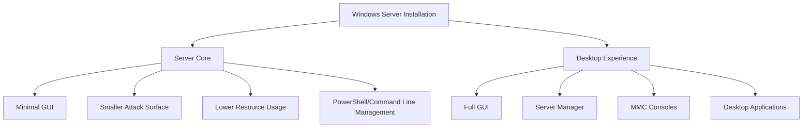

Windows Server is Microsoft's enterprise-grade server operating system designed to provide the foundation for modern datacenter infrastructure. This guide covers the essentials of Windows Server editions, installation options, and initial configuration.

## Overview

Windows Server provides a robust platform for hosting applications, managing networks, and delivering enterprise services. It combines proven reliability with modern cloud-ready features, making it suitable for both on-premises and hybrid cloud environments.

### Key Features

- **Active Directory Domain Services**: Centralized identity and access management
- **Hyper-V**: Enterprise virtualization platform
- **Windows Server Core**: Minimal installation option for reduced attack surface
- **PowerShell**: Advanced automation and configuration management
- **Windows Admin Center**: Modern web-based management interface
- **Storage Spaces Direct**: Software-defined storage solution
- **Network Controller**: Software-defined networking capabilities

## Windows Server Editions

### Windows Server Standard

**Target Use Cases:**

- Physical or minimally virtualized environments
- Small to medium-sized businesses
- Non-datacenter scenarios

**Key Features:**

- Two virtual machine licenses
- All standard server roles
- Storage Replica
- Shielded Virtual Machines

**Licensing**: Per-core licensing model with 16-core minimum per server

### Windows Server Datacenter

**Target Use Cases:**

- Highly virtualized datacenters
- Private cloud environments
- Software-defined datacenter

**Key Features:**

- Unlimited virtual machine licenses
- All datacenter features
- Storage Spaces Direct
- Network Controller
- Software-defined networking

**Licensing**: Per-core licensing model with 16-core minimum per server

### Windows Server Core vs. Desktop Experience



### Server Core Benefits

Server Core provides a minimal installation with no desktop experience, offering:

- **Reduced Attack Surface**: Fewer components mean fewer potential vulnerabilities
- **Lower Resource Requirements**: More resources available for applications
- **Reduced Maintenance**: Fewer updates and patches required
- **Remote Management**: Managed via PowerShell, Windows Admin Center, or RSAT

### Desktop Experience Benefits

Desktop Experience provides the full GUI, offering:

- **Familiar Interface**: Traditional Windows desktop with Server Manager
- **MMC Consoles**: Full graphical management tools
- **Easier Learning Curve**: Ideal for administrators new to Windows Server
- **Local Application Support**: Run GUI-based applications directly

## Installation

### Prerequisites

Before installing Windows Server, ensure:

- **Hardware Requirements Met**:
  - 1.4 GHz 64-bit processor
  - 512 MB RAM minimum (2 GB recommended)
  - 32 GB disk space minimum
  - Gigabit Ethernet adapter

- **Installation Media Ready**: ISO file, bootable USB, or network deployment
- **License Key Available**: Windows Server license key
- **Network Configuration Planned**: IP addressing, DNS, gateway information

### Installation Methods

#### Interactive Installation

1. Boot from installation media
2. Select language, time, and keyboard preferences
3. Click "Install now"
4. Enter product key (or skip for evaluation)
5. Select Windows Server edition
6. Choose installation type:
   - **Upgrade**: Keep files, settings, and applications (same version only)
   - **Custom**: Clean installation (recommended)
7. Select installation drive
8. Wait for installation to complete
9. Set Administrator password
10. Log in and begin configuration

#### Automated Installation

For large deployments, use:

- **Windows Deployment Services (WDS)**: Network-based installation
- **Microsoft Deployment Toolkit (MDT)**: Automated deployment framework
- **System Center Configuration Manager**: Enterprise deployment solution

## Post-Installation Configuration

### Initial Setup (Server Core)

```powershell
# Launch Server Configuration tool (SConfig)
SConfig

# Or configure via PowerShell:

# Set computer name
Rename-Computer -NewName "SERVER01" -Restart

# Configure network settings
$Interface = Get-NetAdapter | Where-Object {$_.Status -eq "Up"}
New-NetIPAddress -IPAddress 192.168.1.10 -PrefixLength 24 -DefaultGateway 192.168.1.1 -InterfaceAlias $Interface.Name
Set-DnsClientServerAddress -InterfaceAlias $Interface.Name -ServerAddresses 192.168.1.1,8.8.8.8

# Set time zone
Set-TimeZone -Id "Eastern Standard Time"

# Enable Remote Desktop
Set-ItemProperty -Path "HKLM:\System\CurrentControlSet\Control\Terminal Server" -Name fDenyTSConnections -Value 0
Enable-NetFirewallRule -DisplayGroup "Remote Desktop"

# Configure Windows Update
Install-Module PSWindowsUpdate -Force
Get-WindowsUpdate -Install -AcceptAll -AutoReboot
```

### Initial Setup (Desktop Experience)

Use Server Manager for guided configuration:

1. **Configure Local Server**:
   - Set computer name
   - Configure network adapters
   - Join domain (if applicable)
   - Enable Remote Desktop
   - Configure Windows Update

2. **Configure Windows Firewall**:
   - Review default rules
   - Add custom rules as needed
   - Configure advanced settings

3. **Install Roles and Features**:
   - Open "Add Roles and Features Wizard"
   - Select required server roles
   - Add necessary features
   - Complete installation

### Domain Join

To join an existing Active Directory domain:

```powershell
# Join domain
Add-Computer -DomainName "contoso.local" -Credential (Get-Credential) -Restart

# Verify domain membership
Get-ComputerInfo | Select-Object CsDomain, CsDomainRole
```

### Activation

Activate Windows Server to validate your license:

```powershell
# Check activation status
slmgr.vbs /dli

# Activate with product key
slmgr.vbs /ipk XXXXX-XXXXX-XXXXX-XXXXX-XXXXX
slmgr.vbs /ato

# Activate using KMS server
slmgr.vbs /skms kms.contoso.local:1688
slmgr.vbs /ato
```

## Management Tools

### Windows Admin Center

Modern web-based management interface for Windows Server:

- **Remote Management**: Manage servers from any browser
- **Consolidated View**: Single pane of glass for multiple servers
- **Azure Integration**: Hybrid cloud management capabilities
- **Extension Support**: Customize with additional tools

**Installation**:

```powershell
# Download from: https://aka.ms/windowsadmincenter
# Install on Windows Server or Windows 10/11

# Access via: https://servername:6516
```

### Remote Server Administration Tools (RSAT)

Manage Windows Server from a client workstation:

- Install RSAT on Windows 10/11
- Access Server Manager, Active Directory Users and Computers, DNS Manager, and more
- Remote PowerShell management capabilities

**Installation (Windows 11)**:

```powershell
Get-WindowsCapability -Name RSAT* -Online | Add-WindowsCapability -Online
```

### PowerShell Remoting

Enable PowerShell remoting for command-line management:

```powershell
# On server (enable remoting)
Enable-PSRemoting -Force

# From client (connect to server)
Enter-PSSession -ComputerName SERVER01 -Credential (Get-Credential)

# Run commands remotely
Invoke-Command -ComputerName SERVER01 -ScriptBlock {Get-Service}
```

## Best Practices for Initial Setup

### Security

- ✅ Set strong Administrator password
- ✅ Enable Windows Firewall
- ✅ Install latest updates before deploying to production
- ✅ Configure audit logging
- ✅ Disable unnecessary services
- ✅ Implement least privilege access

### Network Configuration

- ✅ Use static IP addresses for servers
- ✅ Configure DNS properly
- ✅ Set appropriate hostname
- ✅ Document network configuration
- ✅ Test network connectivity

### Documentation

- ✅ Record installation settings
- ✅ Document server purpose and roles
- ✅ Maintain configuration change log
- ✅ Track software and licenses
- ✅ Create disaster recovery procedures

## Next Steps

After completing initial setup:

1. **[Install Server Roles](../server-roles/index.md)** - Add specific functionality to your server
2. **[Configure Security](../security/quick-start.md)** - Harden your server with essential security settings
3. **[Set Up Configuration Management](../configuration/index.md)** - Implement automation and standardization
4. **[Deploy Scenarios](../scenarios.md)** - Follow end-to-end deployment guides

## Related Topics

- **[Windows Server Overview](../index.md)** - Main Windows Server documentation
- **[Server Roles](../server-roles/index.md)** - Available server roles and features
- **[Configuration Management](../configuration/index.md)** - Automation and configuration tools
- **[Security](../security/quick-start.md)** - Security hardening guide

## Additional Resources

- [Windows Server Documentation](https://docs.microsoft.com/en-us/windows-server/)
- [Windows Server Evaluation Center](https://www.microsoft.com/en-us/evalcenter/evaluate-windows-server)
- [Windows Admin Center Documentation](https://docs.microsoft.com/en-us/windows-server/manage/windows-admin-center/overview)
- [PowerShell Documentation](https://docs.microsoft.com/en-us/powershell/)
