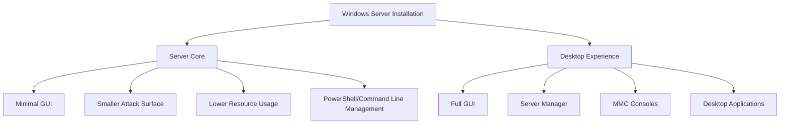

Windows Server is Microsoft's enterprise-grade server operating system designed to provide the foundation for modern datacenter infrastructure. This comprehensive guide covers Windows Server administration, security hardening, and automation with PowerShell and package management tools.

## Overview

Windows Server provides a robust platform for hosting applications, managing networks, and delivering enterprise services. It combines proven reliability with modern cloud-ready features, making it suitable for both on-premises and hybrid cloud environments.

### Key Features

- **Active Directory Domain Services**: Centralized identity and access management
- **Hyper-V**: Enterprise virtualization platform
- **Windows Server Core**: Minimal installation option for reduced attack surface
- **PowerShell**: Advanced automation and configuration management
- **Windows Admin Center**: Modern web-based management interface
- **Storage Spaces Direct**: Software-defined storage solution
- **Network Controller**: Software-defined networking capabilities

## Windows Server Editions

### Windows Server Standard

**Target Use Cases:**

- Physical or minimally virtualized environments
- Small to medium-sized businesses
- Non-datacenter scenarios

**Key Features:**

- Two virtual machine licenses
- All standard server roles
- Storage Replica
- Shielded Virtual Machines

### Windows Server Datacenter

**Target Use Cases:**

- Highly virtualized datacenters
- Private cloud environments
- Software-defined datacenter

**Key Features:**

- Unlimited virtual machine licenses
- All datacenter features
- Storage Spaces Direct
- Network Controller
- Software-defined networking

### Windows Server Core vs. Desktop Experience



## Installation and Initial Configuration

### Server Core Installation

Server Core provides a minimal installation with no desktop experience, offering:

- **Reduced Attack Surface**: Fewer components mean fewer potential vulnerabilities
- **Lower Resource Requirements**: More resources available for applications
- **Reduced Maintenance**: Fewer updates and patches required
- **Remote Management**: Managed via PowerShell, Windows Admin Center, or RSAT

### Post-Installation Configuration

```powershell
# Set computer name
Rename-Computer -NewName "SERVER01" -Restart

# Configure network settings
New-NetIPAddress -IPAddress 192.168.1.10 -PrefixLength 24 -DefaultGateway 192.168.1.1 -InterfaceAlias "Ethernet"
Set-DnsClientServerAddress -InterfaceAlias "Ethernet" -ServerAddresses 192.168.1.1,8.8.8.8

# Enable Remote Desktop
Set-ItemProperty -Path "HKLM:\System\CurrentControlSet\Control\Terminal Server" -Name fDenyTSConnections -Value 0
Enable-NetFirewallRule -DisplayGroup "Remote Desktop"

# Configure Windows Update
Install-Module PSWindowsUpdate -Force
Get-WindowsUpdate -Install -AcceptAll -AutoReboot
```

## Server Roles and Features

### Common Server Roles

#### Active Directory Domain Services (AD DS)

- Domain controller functionality
- User and computer account management
- Group Policy administration
- LDAP directory services

#### DNS Server

- Name resolution services
- Zone management
- DNS security features
- Integration with Active Directory

#### DHCP Server

- Automatic IP address assignment
- Scope and reservation management
- Failover and load balancing
- Integration with DNS

#### File and Storage Services

- File sharing (SMB/CIFS)
- Distributed File System (DFS)
- File Server Resource Manager (FSRM)
- Storage Spaces and Storage Replica

#### Hyper-V

- Virtual machine hosting
- Live migration
- Replica and backup
- Network virtualization

### Feature Installation

```powershell
# Install Active Directory Domain Services
Install-WindowsFeature AD-Domain-Services -IncludeManagementTools

# Install DNS Server
Install-WindowsFeature DNS -IncludeManagementTools

# Install DHCP Server
Install-WindowsFeature DHCP -IncludeManagementTools

# Install Hyper-V
Install-WindowsFeature Hyper-V -IncludeManagementTools -Restart

# Install File Services
Install-WindowsFeature FS-FileServer,FS-DFS-Namespace,FS-DFS-Replication -IncludeManagementTools
```

## Active Directory Domain Services

### Domain Controller Promotion

```powershell
# Install AD DS role
Install-WindowsFeature AD-Domain-Services -IncludeManagementTools

# Promote to domain controller (new forest)
Install-ADDSForest `
    -DomainName "contoso.local" `
    -DomainNetbiosName "CONTOSO" `
    -InstallDns `
    -SafeModeAdministratorPassword (ConvertTo-SecureString "P@ssw0rd123!" -AsPlainText -Force) `
    -Force

# Promote to domain controller (existing domain)
Install-ADDSDomainController `
    -DomainName "contoso.local" `
    -InstallDns `
    -Credential (Get-Credential) `
    -SafeModeAdministratorPassword (ConvertTo-SecureString "P@ssw0rd123!" -AsPlainText -Force) `
    -Force
```

### User and Group Management

```powershell
# Create Organizational Unit
New-ADOrganizationalUnit -Name "IT Department" -Path "DC=contoso,DC=local"

# Create user account
New-ADUser `
    -Name "John Doe" `
    -GivenName "John" `
    -Surname "Doe" `
    -SamAccountName "jdoe" `
    -UserPrincipalName "jdoe@contoso.local" `
    -Path "OU=IT Department,DC=contoso,DC=local" `
    -AccountPassword (ConvertTo-SecureString "P@ssw0rd123!" -AsPlainText -Force) `
    -Enabled $true

# Create security group
New-ADGroup `
    -Name "IT Administrators" `
    -GroupScope Global `
    -GroupCategory Security `
    -Path "OU=IT Department,DC=contoso,DC=local"

# Add user to group
Add-ADGroupMember -Identity "IT Administrators" -Members "jdoe"
```

## Networking and Connectivity

### Network Configuration

```powershell
# View network adapters
Get-NetAdapter

# Configure static IP
New-NetIPAddress -IPAddress 192.168.1.10 -PrefixLength 24 -DefaultGateway 192.168.1.1 -InterfaceAlias "Ethernet"

# Set DNS servers
Set-DnsClientServerAddress -InterfaceAlias "Ethernet" -ServerAddresses 192.168.1.1,8.8.8.8

# Configure firewall
New-NetFirewallRule -DisplayName "Allow HTTP" -Direction Inbound -Protocol TCP -LocalPort 80
New-NetFirewallRule -DisplayName "Allow HTTPS" -Direction Inbound -Protocol TCP -LocalPort 443
```

### Remote Access and VPN

```powershell
# Install RRAS role
Install-WindowsFeature RemoteAccess -IncludeManagementTools

# Configure VPN server
Install-RemoteAccess -VpnType VpnS2S

# Add VPN user
Add-VpnUser -UserName "vpnuser" -Password "P@ssw0rd123!"
```

## Storage and File Services

### Storage Spaces

```powershell
# Create storage pool
New-StoragePool -FriendlyName "DataPool" -StorageSubSystemFriendlyName "Storage Spaces*" -PhysicalDisks (Get-PhysicalDisk -CanPool $true)

# Create virtual disk
New-VirtualDisk -StoragePoolFriendlyName "DataPool" -FriendlyName "DataDisk" -Size 1TB -ResiliencySettingName Mirror

# Initialize and format disk
Get-VirtualDisk -FriendlyName "DataDisk" | Get-Disk | Initialize-Disk -PartitionStyle GPT
New-Partition -DiskNumber 2 -UseMaximumSize -AssignDriveLetter | Format-Volume -FileSystem NTFS -NewFileSystemLabel "Data"
```

### File Shares

```powershell
# Create shared folder
New-Item -Path "C:\Shares\CompanyData" -ItemType Directory
New-SmbShare -Name "CompanyData" -Path "C:\Shares\CompanyData" -FullAccess "Domain Admins" -ReadAccess "Domain Users"

# Set NTFS permissions
$acl = Get-Acl "C:\Shares\CompanyData"
$accessRule = New-Object System.Security.AccessControl.FileSystemAccessRule("Domain Users","ReadAndExecute","ContainerInherit,ObjectInherit","None","Allow")
$acl.SetAccessRule($accessRule)
Set-Acl "C:\Shares\CompanyData" $acl
```

## Virtualization with Hyper-V

### Virtual Machine Management

```powershell
# Create virtual machine
New-VM -Name "WebServer01" -MemoryStartupBytes 4GB -Generation 2 -NewVHDPath "C:\VMs\WebServer01.vhdx" -NewVHDSizeBytes 50GB

# Configure VM settings
Set-VM -Name "WebServer01" -ProcessorCount 2
Set-VM -Name "WebServer01" -DynamicMemory -MemoryMinimumBytes 2GB -MemoryMaximumBytes 8GB

# Create and connect virtual switch
New-VMSwitch -Name "External" -NetAdapterName "Ethernet" -AllowManagementOS $true
Connect-VMNetworkAdapter -VMName "WebServer01" -SwitchName "External"

# Start virtual machine
Start-VM -Name "WebServer01"
```

### Live Migration

```powershell
# Enable live migration
Enable-VMMigration
Set-VMHost -VirtualMachineMigrationAuthenticationType Kerberos
Set-VMHost -VirtualMachineMigrationPerformanceOption SMB

# Perform live migration
Move-VM -Name "WebServer01" -DestinationHost "HyperV02" -IncludeStorage -DestinationStoragePath "D:\VMs"
```

## Monitoring and Performance

### Performance Monitoring

```powershell
# Get system information
Get-ComputerInfo

# Monitor performance counters
Get-Counter "\Processor(_Total)\% Processor Time"
Get-Counter "\Memory\Available MBytes"
Get-Counter "\PhysicalDisk(_Total)\Disk Transfers/sec"

# Event log monitoring
Get-WinEvent -LogName System -MaxEvents 50 | Where-Object {$_.LevelDisplayName -eq "Error"}
Get-WinEvent -LogName Application -MaxEvents 50 | Where-Object {$_.LevelDisplayName -eq "Warning"}
```

### Resource Management

```powershell
# Configure resource limits for services
Set-Service -Name "Spooler" -StartupType Manual
Set-Service -Name "Fax" -StartupType Disabled

# Monitor disk usage
Get-WmiObject -Class Win32_LogicalDisk | Select-Object DeviceID,Size,FreeSpace,@{Name="PercentFree";Expression={($_.FreeSpace/$_.Size)*100}}
```

## Backup and Disaster Recovery

### Windows Server Backup

```powershell
# Install Windows Server Backup feature
Install-WindowsFeature Windows-Server-Backup -IncludeManagementTools

# Create backup policy
$policy = New-WBPolicy
$backup = New-WBBackupTarget -VolumePath "D:"
Add-WBBackupTarget -Policy $policy -Target $backup
$fileSpec = New-WBFileSpec -FileSpec "C:\Important Data"
Add-WBFileSpec -Policy $policy -FileSpec $fileSpec

# Start backup
Start-WBBackup -Policy $policy
```

### System State Backup

```powershell
# Backup system state
wbadmin start systemstatebackup -backupTarget:D: -quiet

# Restore system state
wbadmin start systemstaterecovery -version:12/31/2024-23:00 -backupTarget:D: -quiet
```

## Troubleshooting Common Issues

### Service Management

```powershell
# Check service status
Get-Service | Where-Object {$_.Status -eq "Stopped"} | Select-Object Name,Status

# Restart failed services
Get-Service | Where-Object {$_.Status -eq "Stopped" -and $_.StartType -eq "Automatic"} | Start-Service

# Check service dependencies
Get-Service -Name "Server" -DependentServices
Get-Service -Name "Server" -RequiredServices
```

### Network Troubleshooting

```powershell
# Test network connectivity
Test-NetConnection -ComputerName "google.com" -Port 80
Test-NetConnection -ComputerName "8.8.8.8" -InformationLevel Detailed

# DNS troubleshooting
Resolve-DnsName "google.com"
Clear-DnsClientCache
Test-DnsServer -IPAddress 8.8.8.8
```

### Process and Port Investigation

```powershell
# Find process using specific port
Get-NetTCPConnection -LocalPort 80 | Select-Object LocalAddress,LocalPort,State,OwningProcess
Get-Process -Id (Get-NetTCPConnection -LocalPort 80).OwningProcess

# Alternative method using netstat
netstat -ano | findstr ":80"
tasklist /fi "PID eq 1234"
```

## Best Practices

### Security Hardening

1. **Principle of Least Privilege**: Grant minimum necessary permissions
2. **Regular Updates**: Keep system and applications updated
3. **Strong Password Policies**: Implement complex password requirements
4. **Firewall Configuration**: Enable and properly configure Windows Firewall
5. **Audit Logging**: Enable comprehensive audit logging
6. **Antivirus Protection**: Install and maintain endpoint protection

### Performance Optimization

1. **Resource Monitoring**: Regularly monitor CPU, memory, and disk usage
2. **Service Management**: Disable unnecessary services
3. **Disk Optimization**: Implement proper disk partitioning and defragmentation
4. **Network Optimization**: Configure appropriate network settings
5. **Virtual Memory**: Properly configure page file settings

### Maintenance Procedures

1. **Regular Backups**: Implement automated backup procedures
2. **Update Management**: Deploy updates in a controlled manner
3. **Health Checks**: Perform regular system health assessments
4. **Documentation**: Maintain accurate system documentation
5. **Disaster Recovery**: Test disaster recovery procedures regularly

## Next Steps

This introduction provides the foundation for Windows Server administration. For more detailed information, explore the following topics:

- **[Security Hardening](security.md)**: Comprehensive security configuration and best practices
- **[Configuration Management](configuration.md)**: PowerShell automation and winget package management

## Additional Resources

### Microsoft Documentation

- **Windows Server Documentation**: <https://docs.microsoft.com/en-us/windows-server/>
- **PowerShell Documentation**: <https://docs.microsoft.com/en-us/powershell/>
- **Active Directory Documentation**: <https://docs.microsoft.com/en-us/windows-server/identity/ad-ds/>

### Tools and Utilities

- **Windows Admin Center**: Modern web-based management interface
- **Remote Server Administration Tools (RSAT)**: Management tools for client computers
- **System Center**: Enterprise management suite
- **PowerShell ISE/VS Code**: PowerShell development environments

Windows Server provides a robust foundation for enterprise infrastructure. With proper configuration, security hardening, and automation, it can deliver reliable, scalable, and secure services for organizations of all sizes.
