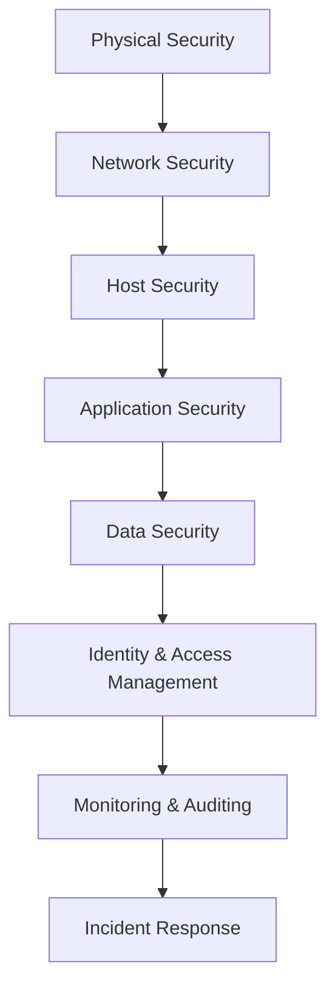

This comprehensive guide covers security hardening and best practices for Windows Server environments, including Active Directory security, Group Policy configuration, firewall management, and compliance requirements.

## Security Framework

### Defense in Depth Strategy

Windows Server security should implement multiple layers of protection:



### Security Principles

- **Principle of Least Privilege**: Grant minimum necessary permissions
- **Defense in Depth**: Multiple security layers
- **Assume Breach**: Plan for compromise scenarios
- **Zero Trust**: Verify every access request
- **Continuous Monitoring**: Real-time security assessment

## Initial Security Hardening

### Server Core Security Benefits

Server Core installation provides enhanced security through:

- **Reduced Attack Surface**: Fewer installed components
- **Lower Maintenance**: Fewer updates and patches required
- **Remote Management**: Eliminates local logon attack vectors
- **Better Performance**: More resources for security monitoring

### Post-Installation Security Configuration

```powershell
# Disable unnecessary services
$servicesToDisable = @(
    'Fax',
    'Print Spooler',
    'Remote Registry',
    'Windows Error Reporting Service',
    'Computer Browser'
)

foreach ($service in $servicesToDisable) {
    Set-Service -Name $service -StartupType Disabled -ErrorAction SilentlyContinue
    Stop-Service -Name $service -Force -ErrorAction SilentlyContinue
}

# Configure automatic updates
Set-ItemProperty -Path "HKLM:\SOFTWARE\Policies\Microsoft\Windows\WindowsUpdate\AU" -Name "NoAutoUpdate" -Value 0
Set-ItemProperty -Path "HKLM:\SOFTWARE\Policies\Microsoft\Windows\WindowsUpdate\AU" -Name "AUOptions" -Value 4
Set-ItemProperty -Path "HKLM:\SOFTWARE\Policies\Microsoft\Windows\WindowsUpdate\AU" -Name "ScheduledInstallDay" -Value 0
Set-ItemProperty -Path "HKLM:\SOFTWARE\Policies\Microsoft\Windows\WindowsUpdate\AU" -Name "ScheduledInstallTime" -Value 3

# Enable Windows Defender
Set-MpPreference -DisableRealtimeMonitoring $false
Set-MpPreference -DisableBehaviorMonitoring $false
Set-MpPreference -DisableIOAVProtection $false
Set-MpPreference -DisableScriptScanning $false
```

## User Account Security

### Local Administrator Security

```powershell
# Rename built-in Administrator account
$admin = Get-LocalUser -Name "Administrator"
Rename-LocalUser -Name "Administrator" -NewName "ServerAdmin"

# Create decoy Administrator account
New-LocalUser -Name "Administrator" -Description "Decoy Administrator Account" -NoPassword
Disable-LocalUser -Name "Administrator"

# Configure Local Administrator Password Solution (LAPS)
# Install LAPS from Microsoft Download Center first
Import-Module AdmPwd.PS

# Extend AD schema for LAPS (run on DC)
Update-AdmPwdADSchema

# Set permissions for computer accounts to update passwords
Set-AdmPwdComputerSelfPermission -OrgUnit "OU=Servers,DC=contoso,DC=local"

# Configure LAPS via Group Policy
Set-AdmPwdPasswordComplexity -ComplexityEnabled $true -PasswordLength 14
```

### Service Account Security

```powershell
# Create Managed Service Account
New-ADServiceAccount -Name "WebServiceMSA" -DNSHostName "webserver.contoso.local" -PrincipalsAllowedToRetrieveManagedPassword "WebServer$"

# Install MSA on target server
Install-ADServiceAccount -Identity "WebServiceMSA"

# Configure service to use MSA
$service = Get-WmiObject -Class Win32_Service -Filter "Name='W3SVC'"
$service.Change($null,$null,$null,$null,$null,$null,"contoso\WebServiceMSA$",$null)
```

## Active Directory Security

### Domain Controller Security

```powershell
# Enable advanced audit policies
auditpol /set /subcategory:"Logon" /success:enable /failure:enable
auditpol /set /subcategory:"Account Logon" /success:enable /failure:enable
auditpol /set /subcategory:"Account Management" /success:enable /failure:enable
auditpol /set /subcategory:"Directory Service Access" /success:enable /failure:enable
auditpol /set /subcategory:"Policy Change" /success:enable /failure:enable
auditpol /set /subcategory:"Privilege Use" /success:enable /failure:enable

# Configure secure LDAP (LDAPS)
# Import certificate to Domain Controller
Import-Certificate -FilePath "C:\Certificates\dc-cert.pfx" -CertStoreLocation "Cert:\LocalMachine\My" -Password (ConvertTo-SecureString "password" -AsPlainText -Force)

# Configure LDAP signing requirement
Set-ItemProperty -Path "HKLM:\SYSTEM\CurrentControlSet\Services\NTDS\Parameters" -Name "LDAPServerIntegrity" -Value 2
```

### Password Policy Configuration

```powershell
# Configure Default Domain Policy for password requirements
Set-ADDefaultDomainPasswordPolicy -Identity "contoso.local" -MinPasswordLength 14 -ComplexityEnabled $true -MaxPasswordAge (New-TimeSpan -Days 90) -MinPasswordAge (New-TimeSpan -Days 1) -PasswordHistoryCount 24

# Create Fine-Grained Password Policy for privileged accounts
New-ADFineGrainedPasswordPolicy -Name "AdminPasswordPolicy" -MinPasswordLength 16 -ComplexityEnabled $true -MaxPasswordAge (New-TimeSpan -Days 60) -MinPasswordAge (New-TimeSpan -Days 1) -PasswordHistoryCount 24 -LockoutDuration (New-TimeSpan -Minutes 30) -LockoutObservationWindow (New-TimeSpan -Minutes 30) -LockoutThreshold 3

# Apply policy to Domain Admins group
Add-ADFineGrainedPasswordPolicySubject -Identity "AdminPasswordPolicy" -Subjects "Domain Admins"
```

### Privileged Access Management

```powershell
# Create Privileged Access Workstation (PAW) OU structure
New-ADOrganizationalUnit -Name "Admin" -Path "DC=contoso,DC=local"
New-ADOrganizationalUnit -Name "Tier 0" -Path "OU=Admin,DC=contoso,DC=local"
New-ADOrganizationalUnit -Name "Tier 1" -Path "OU=Admin,DC=contoso,DC=local"
New-ADOrganizationalUnit -Name "Tier 2" -Path "OU=Admin,DC=contoso,DC=local"

# Create administrative groups
New-ADGroup -Name "Tier 0 Admins" -GroupScope Global -GroupCategory Security -Path "OU=Tier 0,OU=Admin,DC=contoso,DC=local"
New-ADGroup -Name "Tier 1 Admins" -GroupScope Global -GroupCategory Security -Path "OU=Tier 1,OU=Admin,DC=contoso,DC=local"
New-ADGroup -Name "Tier 2 Admins" -GroupScope Global -GroupCategory Security -Path "OU=Tier 2,OU=Admin,DC=contoso,DC=local"

# Configure authentication policy for Tier 0 accounts
New-ADAuthenticationPolicy -Name "Tier0Policy" -UserAllowedToAuthenticateFrom "O:SYG:SYD:(XA;OICI;CR;;;WD;(@USER.ad://ext/AuthenticationSilo == `"Tier0Silo`"))"
```

## Group Policy Security Configuration

### Security Templates

```powershell
# Import security templates
secedit /import /db C:\Windows\security\Database\SecConfig.sdb /cfg C:\SecurityTemplates\HighSecurity.inf

# Apply security configuration
secedit /configure /db C:\Windows\security\Database\SecConfig.sdb

# Export current security configuration for backup
secedit /export /cfg C:\Backup\CurrentSecurity.inf
```

### Critical Group Policy Settings

```powershell
# Configure User Rights Assignment via Group Policy
# Create GPO for server security
New-GPO -Name "Server Security Policy" -Domain "contoso.local"

# Link GPO to Servers OU
New-GPLink -Name "Server Security Policy" -Target "OU=Servers,DC=contoso,DC=local"

# Configure security settings (these would typically be done via GPMC)
# Example registry settings for security
Set-GPRegistryValue -Name "Server Security Policy" -Key "HKLM\System\CurrentControlSet\Control\Lsa" -ValueName "RestrictAnonymous" -Type DWord -Value 1
Set-GPRegistryValue -Name "Server Security Policy" -Key "HKLM\System\CurrentControlSet\Control\Lsa" -ValueName "RestrictAnonymousSAM" -Type DWord -Value 1
Set-GPRegistryValue -Name "Server Security Policy" -Key "HKLM\System\CurrentControlSet\Control\Lsa" -ValueName "EveryoneIncludesAnonymous" -Type DWord -Value 0
```

### Account Lockout Policy

```powershell
# Configure account lockout policy
Set-ADDefaultDomainPasswordPolicy -Identity "contoso.local" -LockoutDuration (New-TimeSpan -Minutes 30) -LockoutObservationWindow (New-TimeSpan -Minutes 30) -LockoutThreshold 5

# Monitor account lockouts
Get-WinEvent -FilterHashtable @{LogName='Security'; ID=4740} | Select-Object TimeCreated, @{Name='LockedAccount';Expression={$_.Properties[0].Value}}, @{Name='SourceComputer';Expression={$_.Properties[1].Value}}
```

## Windows Firewall Configuration

### Advanced Firewall Management

```powershell
# Enable Windows Firewall for all profiles
Set-NetFirewallProfile -Profile Domain,Public,Private -Enabled True

# Configure default actions
Set-NetFirewallProfile -Profile Domain -DefaultInboundAction Block -DefaultOutboundAction Allow
Set-NetFirewallProfile -Profile Public -DefaultInboundAction Block -DefaultOutboundAction Allow
Set-NetFirewallProfile -Profile Private -DefaultInboundAction Block -DefaultOutboundAction Allow

# Create firewall rules for common services
New-NetFirewallRule -DisplayName "Allow RDP" -Direction Inbound -Protocol TCP -LocalPort 3389 -Action Allow -Profile Domain
New-NetFirewallRule -DisplayName "Allow WinRM HTTP" -Direction Inbound -Protocol TCP -LocalPort 5985 -Action Allow -Profile Domain
New-NetFirewallRule -DisplayName "Allow WinRM HTTPS" -Direction Inbound -Protocol TCP -LocalPort 5986 -Action Allow -Profile Domain

# Block potentially dangerous protocols
New-NetFirewallRule -DisplayName "Block SMBv1" -Direction Inbound -Protocol TCP -LocalPort 139 -Action Block
New-NetFirewallRule -DisplayName "Block NetBIOS" -Direction Inbound -Protocol UDP -LocalPort 137,138 -Action Block

# Configure logging
Set-NetFirewallProfile -Profile Domain,Public,Private -LogAllowed True -LogBlocked True -LogMaxSizeKilobytes 32767 -LogFileName "%SystemRoot%\System32\LogFiles\Firewall\pfirewall.log"
```

### Application-Specific Rules

```powershell
# SQL Server firewall rules
New-NetFirewallRule -DisplayName "SQL Server" -Direction Inbound -Protocol TCP -LocalPort 1433 -Action Allow -Profile Domain
New-NetFirewallRule -DisplayName "SQL Browser" -Direction Inbound -Protocol UDP -LocalPort 1434 -Action Allow -Profile Domain

# Web server rules
New-NetFirewallRule -DisplayName "HTTP" -Direction Inbound -Protocol TCP -LocalPort 80 -Action Allow -Profile Domain
New-NetFirewallRule -DisplayName "HTTPS" -Direction Inbound -Protocol TCP -LocalPort 443 -Action Allow -Profile Domain

# Exchange Server rules (example)
New-NetFirewallRule -DisplayName "Exchange OWA" -Direction Inbound -Protocol TCP -LocalPort 80,443 -Action Allow -Profile Domain
New-NetFirewallRule -DisplayName "Exchange RPC" -Direction Inbound -Protocol TCP -LocalPort 135 -Action Allow -Profile Domain
```

## Certificate Services Security

### Certificate Authority Security

```powershell
# Install Certificate Services role
Install-WindowsFeature ADCS-Cert-Authority -IncludeManagementTools

# Configure Enterprise CA
Install-AdcsCertificationAuthority -CAType EnterpriseRootCA -CACommonName "Contoso Root CA" -KeyLength 4096 -HashAlgorithm SHA256 -CryptoProviderName "RSA#Microsoft Software Key Storage Provider"

# Configure certificate templates security
# Export existing template
certlm.msc # Manual step - export User template

# Import and modify template
# This typically requires ADSI edit or manual configuration

# Configure auto-enrollment
Set-GPRegistryValue -Name "Certificate Auto-Enrollment" -Key "HKCU\Software\Policies\Microsoft\Cryptography\AutoEnrollment" -ValueName "AEPolicy" -Type DWord -Value 7
```

### SSL/TLS Configuration

```powershell
# Disable weak protocols and ciphers
$regPath = "HKLM:\SYSTEM\CurrentControlSet\Control\SecurityProviders\SCHANNEL\Protocols"

# Disable SSLv2
New-Item -Path "$regPath\SSL 2.0\Server" -Force
Set-ItemProperty -Path "$regPath\SSL 2.0\Server" -Name "Enabled" -Value 0

# Disable SSLv3
New-Item -Path "$regPath\SSL 3.0\Server" -Force
Set-ItemProperty -Path "$regPath\SSL 3.0\Server" -Name "Enabled" -Value 0

# Disable TLS 1.0
New-Item -Path "$regPath\TLS 1.0\Server" -Force
Set-ItemProperty -Path "$regPath\TLS 1.0\Server" -Name "Enabled" -Value 0

# Enable TLS 1.2
New-Item -Path "$regPath\TLS 1.2\Server" -Force
Set-ItemProperty -Path "$regPath\TLS 1.2\Server" -Name "Enabled" -Value 1

# Configure cipher suite order
$cipherSuites = @(
    "TLS_ECDHE_RSA_WITH_AES_256_GCM_SHA384",
    "TLS_ECDHE_RSA_WITH_AES_128_GCM_SHA256",
    "TLS_ECDHE_RSA_WITH_AES_256_CBC_SHA384",
    "TLS_ECDHE_RSA_WITH_AES_128_CBC_SHA256"
)
$cipherSuiteOrder = $cipherSuites -join ","
Set-ItemProperty -Path "HKLM:\SOFTWARE\Policies\Microsoft\Cryptography\Configuration\SSL\00010002" -Name "Functions" -Value $cipherSuiteOrder
```

## Antivirus and Endpoint Protection

### Windows Defender Configuration

```powershell
# Configure Windows Defender settings
Set-MpPreference -DisableRealtimeMonitoring $false
Set-MpPreference -DisableBehaviorMonitoring $false
Set-MpPreference -DisableIOAVProtection $false
Set-MpPreference -DisableScriptScanning $false
Set-MpPreference -EnableControlledFolderAccess Enabled
Set-MpPreference -EnableNetworkProtection Enabled

# Configure exclusions for performance (only if necessary)
Add-MpPreference -ExclusionPath "C:\Program Files\SQL Server"
Add-MpPreference -ExclusionProcess "sqlservr.exe"

# Schedule scans
Set-MpPreference -ScanScheduleDay Everyday
Set-MpPreference -ScanScheduleTime 02:00:00

# Configure cloud protection
Set-MpPreference -MAPSReporting Advanced
Set-MpPreference -SubmitSamplesConsent SendAllSamples
```

### Third-Party Antivirus Integration

```powershell
# Configure Windows Security Center for third-party AV
Set-ItemProperty -Path "HKLM:\SOFTWARE\Microsoft\Security Center" -Name "AntiVirusDisableNotify" -Value 1
Set-ItemProperty -Path "HKLM:\SOFTWARE\Microsoft\Security Center" -Name "FirewallDisableNotify" -Value 1

# Monitor antivirus status
Get-MpComputerStatus | Select-Object AntivirusEnabled, AMServiceEnabled, AntispywareEnabled, RealTimeProtectionEnabled
```

## Security Monitoring and Auditing

### Event Log Configuration

```powershell
# Increase security log size
wevtutil sl Security /ms:1073741824  # 1GB

# Configure retention policy
wevtutil sl Security /rt:true  # Retain old events

# Configure audit policies
auditpol /set /subcategory:"Credential Validation" /success:enable /failure:enable
auditpol /set /subcategory:"Kerberos Authentication Service" /success:enable /failure:enable
auditpol /set /subcategory:"Kerberos Service Ticket Operations" /success:enable /failure:enable
auditpol /set /subcategory:"Account Lockout" /success:enable /failure:enable
auditpol /set /subcategory:"User Account Management" /success:enable /failure:enable
auditpol /set /subcategory:"Security Group Management" /success:enable /failure:enable
auditpol /set /subcategory:"Distribution Group Management" /success:enable /failure:enable
```

### Security Event Monitoring

```powershell
# Create script to monitor critical security events
$criticalEvents = @(
    4624,  # Successful logon
    4625,  # Failed logon
    4648,  # Logon with explicit credentials
    4672,  # Special privileges assigned
    4720,  # User account created
    4726,  # User account deleted
    4728,  # User added to global group
    4732,  # User added to local group
    4740,  # User account locked
    4756,  # User added to universal group
    4767   # User account unlocked
)

foreach ($eventID in $criticalEvents) {
    Register-WmiEvent -Query "SELECT * FROM Win32_NTLogEvent WHERE LogFile='Security' AND EventCode=$eventID" -Action {
        $event = $Event.SourceEventArgs.NewEvent
        Write-Host "Security Event $($event.EventCode) detected at $($event.TimeGenerated)"
        # Add notification logic here
    }
}
```

## Network Security

### SMB Security Configuration

```powershell
# Disable SMBv1
Disable-WindowsOptionalFeature -Online -FeatureName SMB1Protocol

# Configure SMB security
Set-SmbServerConfiguration -EnableSMB1Protocol $false -Force
Set-SmbServerConfiguration -EnableSMB2Protocol $true -Force
Set-SmbServerConfiguration -RequireSecuritySignature $true -Force
Set-SmbServerConfiguration -EnableSecuritySignature $true -Force

# Configure SMB encryption for shares
New-SmbShare -Name "SecureShare" -Path "C:\SecureData" -EncryptData $true -FullAccess "Domain Admins"
```

### IPSec Configuration

```powershell
# Create IPSec policy for server communication
New-NetIPsecPolicy -DisplayName "Server Protection Policy" -Description "Requires authentication for server communication"

# Create authentication proposal
$authProposal = New-NetIPsecAuthProposal -Machine -Cert -Authority "CN=Contoso Root CA"

# Create main mode crypto set
$mmCryptoSet = New-NetIPsecMainModeCryptoSet -DisplayName "Main Mode Crypto Set" -Proposal @($authProposal)

# Create quick mode crypto set
$qmCryptoSet = New-NetIPsecQuickModeCryptoSet -DisplayName "Quick Mode Crypto Set" -Proposal (New-NetIPsecQuickModeCryptoProposal -Encryption AES256 -Hash SHA256)

# Create connection security rule
New-NetConnectionSecurityRule -DisplayName "Require Auth for All Traffic" -InboundSecurity Require -OutboundSecurity Require -MainModeCryptoSet $mmCryptoSet.Name -QuickModeCryptoSet $qmCryptoSet.Name
```

## Data Protection

### BitLocker Configuration

```powershell
# Enable BitLocker on system drive
Enable-BitLocker -MountPoint "C:" -EncryptionMethod XtsAes256 -UsedSpaceOnly -TpmProtector

# Add recovery key protector
Add-BitLockerKeyProtector -MountPoint "C:" -RecoveryPasswordProtector

# Backup recovery key to Active Directory
Backup-BitLockerKeyProtector -MountPoint "C:" -KeyProtectorId (Get-BitLockerVolume -MountPoint "C:").KeyProtector[1].KeyProtectorId

# Configure BitLocker policy via Group Policy
Set-GPRegistryValue -Name "BitLocker Policy" -Key "HKLM\SOFTWARE\Policies\Microsoft\FVE" -ValueName "UseAdvancedStartup" -Type DWord -Value 1
Set-GPRegistryValue -Name "BitLocker Policy" -Key "HKLM\SOFTWARE\Policies\Microsoft\FVE" -ValueName "EnableBDEWithNoTPM" -Type DWord -Value 1
```

### EFS Configuration

```powershell
# Configure EFS recovery agent
cipher /r:EFSRecoveryAgent

# Import recovery certificate
certlm.msc  # Manual import of recovery certificate

# Configure EFS policy
Set-GPRegistryValue -Name "EFS Policy" -Key "HKLM\SOFTWARE\Policies\Microsoft\Windows NT\EFS" -ValueName "EfsConfiguration" -Type DWord -Value 1
```

## Compliance and Hardening

### CIS Benchmark Implementation

```powershell
# Implement CIS Level 1 recommendations
# Account policies
Set-ItemProperty -Path "HKLM:\SYSTEM\CurrentControlSet\Control\Lsa" -Name "LimitBlankPasswordUse" -Value 1

# Audit policies
auditpol /set /subcategory:"Security State Change" /success:enable /failure:enable
auditpol /set /subcategory:"Security System Extension" /success:enable /failure:enable
auditpol /set /subcategory:"System Integrity" /success:enable /failure:enable

# User rights assignment
secedit /export /cfg c:\temp\current.inf
# Edit the file to modify user rights
secedit /configure /db secedit.sdb /cfg c:\temp\modified.inf

# Security options
Set-ItemProperty -Path "HKLM:\SYSTEM\CurrentControlSet\Control\Lsa" -Name "NoLMHash" -Value 1
Set-ItemProperty -Path "HKLM:\SYSTEM\CurrentControlSet\Control\Lsa" -Name "LmCompatibilityLevel" -Value 5
```

### STIG Compliance

```powershell
# Download and apply STIG GPOs
# This typically involves importing STIG GPOs from DISA

# Example STIG configurations
Set-ItemProperty -Path "HKLM:\SYSTEM\CurrentControlSet\Control\Session Manager\kernel" -Name "DisableExceptionChainValidation" -Value 0
Set-ItemProperty -Path "HKLM:\SYSTEM\CurrentControlSet\Control\Session Manager" -Name "ProtectionMode" -Value 1

# Configure UAC for STIG compliance
Set-ItemProperty -Path "HKLM:\SOFTWARE\Microsoft\Windows\CurrentVersion\Policies\System" -Name "ConsentPromptBehaviorAdmin" -Value 2
Set-ItemProperty -Path "HKLM:\SOFTWARE\Microsoft\Windows\CurrentVersion\Policies\System" -Name "ConsentPromptBehaviorUser" -Value 0
Set-ItemProperty -Path "HKLM:\SOFTWARE\Microsoft\Windows\CurrentVersion\Policies\System" -Name "EnableInstallerDetection" -Value 1
```

## Incident Response and Recovery

### Security Incident Procedures

```powershell
# Create incident response script
function Start-IncidentResponse {
    param(
        [string]$IncidentType,
        [string]$Description
    )
    
    # Log incident
    Write-EventLog -LogName Application -Source "Security Incident" -EventId 9999 -EntryType Warning -Message "Security incident: $IncidentType - $Description"
    
    # Collect system information
    $computerInfo = Get-ComputerInfo
    $networkInfo = Get-NetAdapter | Get-NetIPAddress
    $processes = Get-Process | Select-Object Name, Id, Path, Company
    $services = Get-Service | Where-Object {$_.Status -eq "Running"}
    
    # Create incident report
    $report = @{
        Timestamp = Get-Date
        ComputerInfo = $computerInfo
        NetworkInfo = $networkInfo
        RunningProcesses = $processes
        RunningServices = $services
        EventLogs = Get-WinEvent -LogName Security -MaxEvents 100
    }
    
    # Export report
    $report | ConvertTo-Json -Depth 3 | Out-File "C:\IncidentReports\Incident_$(Get-Date -Format 'yyyyMMdd_HHmmss').json"
}

# Register for security events
Register-WmiEvent -Query "SELECT * FROM Win32_NTLogEvent WHERE LogFile='Security' AND EventCode=4625" -Action {
    Start-IncidentResponse -IncidentType "Failed Logon" -Description "Multiple failed logon attempts detected"
}
```

### System Recovery

```powershell
# Create system restore point
Checkpoint-Computer -Description "Pre-Security-Update" -RestorePointType "MODIFY_SETTINGS"

# Backup security configuration
secedit /export /cfg "C:\Backup\SecurityConfig_$(Get-Date -Format 'yyyyMMdd').inf"

# Backup Group Policy
Backup-GPO -All -Path "C:\Backup\GPO_$(Get-Date -Format 'yyyyMMdd')"

# Create recovery media
# This would typically involve creating WinPE recovery media
```

## Security Automation and Maintenance

### Automated Security Checks

```powershell
# Daily security health check script
function Test-SecurityHealth {
    $results = @{}
    
    # Check Windows Updates
    $updates = Get-HotFix | Sort-Object InstalledOn -Descending | Select-Object -First 5
    $results.RecentUpdates = $updates
    
    # Check antivirus status
    $avStatus = Get-MpComputerStatus
    $results.AntivirusStatus = $avStatus
    
    # Check firewall status
    $firewallStatus = Get-NetFirewallProfile | Select-Object Name, Enabled
    $results.FirewallStatus = $firewallStatus
    
    # Check failed logons
    $failedLogons = Get-WinEvent -FilterHashtable @{LogName='Security'; ID=4625; StartTime=(Get-Date).AddHours(-24)} -ErrorAction SilentlyContinue
    $results.FailedLogons = $failedLogons.Count
    
    # Check account lockouts
    $lockouts = Get-WinEvent -FilterHashtable @{LogName='Security'; ID=4740; StartTime=(Get-Date).AddHours(-24)} -ErrorAction SilentlyContinue
    $results.AccountLockouts = $lockouts.Count
    
    # Check critical services
    $criticalServices = @('ADWS', 'DNS', 'Kdc', 'NTDS', 'W32Time')
    $serviceStatus = foreach ($service in $criticalServices) {
        Get-Service -Name $service -ErrorAction SilentlyContinue | Select-Object Name, Status
    }
    $results.CriticalServices = $serviceStatus
    
    return $results
}

# Schedule daily security check
$action = New-ScheduledTaskAction -Execute "PowerShell.exe" -Argument "-File C:\Scripts\SecurityHealthCheck.ps1"
$trigger = New-ScheduledTaskTrigger -Daily -At "02:00AM"
Register-ScheduledTask -Action $action -Trigger $trigger -TaskName "Daily Security Health Check" -Description "Performs daily security health assessment"
```

## Best Practices Summary

### Security Configuration Checklist

- **✓ Enable Windows Firewall** on all profiles
- **✓ Configure strong password policies** with complexity requirements
- **✓ Implement account lockout policies** to prevent brute force attacks
- **✓ Disable unnecessary services** and features
- **✓ Enable comprehensive audit logging** for security events
- **✓ Configure antivirus protection** with real-time scanning
- **✓ Apply security updates** regularly and promptly
- **✓ Use strong encryption** for data at rest and in transit
- **✓ Implement privileged access management** with tiered administration
- **✓ Configure secure communication protocols** (disable weak protocols)

### Ongoing Security Maintenance

1. **Regular Security Assessments**: Perform monthly security reviews
2. **Vulnerability Management**: Scan for and remediate vulnerabilities
3. **Access Reviews**: Regularly review user permissions and group memberships
4. **Security Training**: Ensure administrators are trained on security best practices
5. **Incident Response Testing**: Regularly test incident response procedures
6. **Backup Verification**: Ensure backups are working and can be restored
7. **Documentation Updates**: Keep security documentation current

This comprehensive security guide provides the foundation for securing Windows Server environments. Regular application of these practices, combined with ongoing monitoring and maintenance, will significantly improve your security posture.
