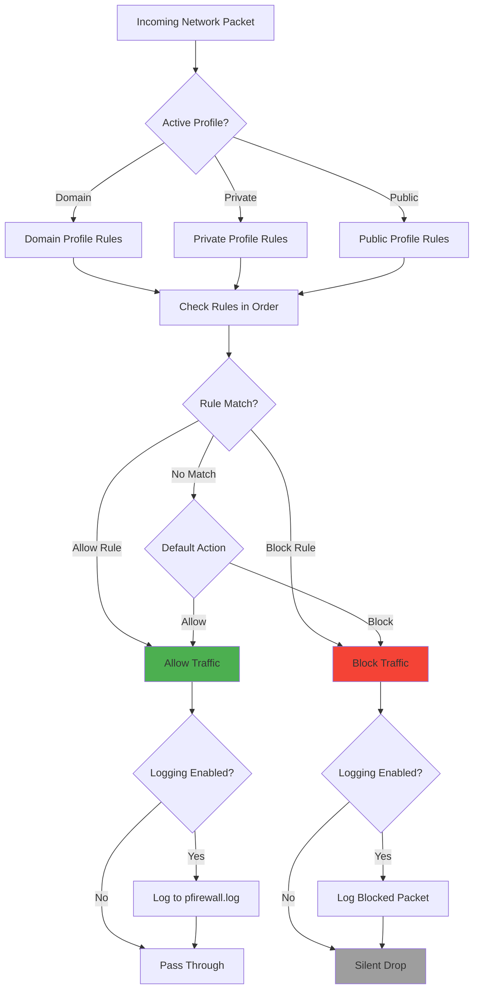
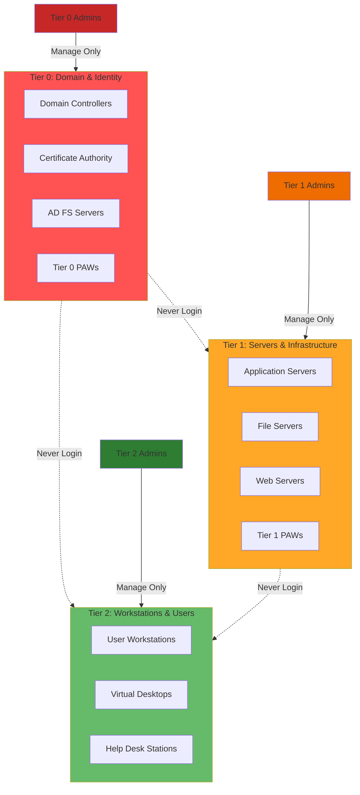
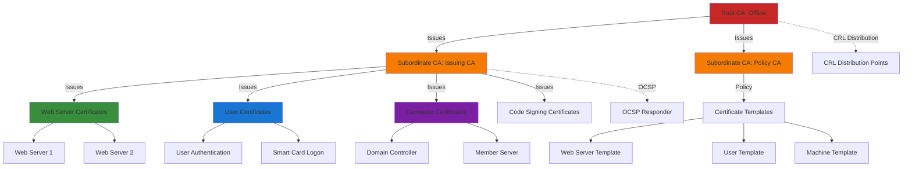

This quick-start guide provides essential security configurations for Windows Server. For comprehensive security documentation including advanced threat protection, compliance, and enterprise security architecture, see [Windows Infrastructure Security (Advanced)](index.md).

> [!TIP]
> **Time to secure**: 15-30 minutes for basic hardening
> **Skill level**: Intermediate
> **Prerequisites**: Administrator access to Windows Server

## Security Quick Wins

### 1. Initial Security Hardening (5 minutes)

Run this script immediately after installation:

```powershell
# Disable unnecessary services
$ServicesToDisable = @(
    'Fax',
    'Print Spooler',  # Only if not a print server
    'Remote Registry',
    'Windows Error Reporting Service',
    'Computer Browser'
)

foreach ($Service in $ServicesToDisable) {
    Set-Service -Name $Service -StartupType Disabled -ErrorAction SilentlyContinue
    Stop-Service -Name $Service -Force -ErrorAction SilentlyContinue
}

# Configure automatic updates
Set-ItemProperty -Path "HKLM:\SOFTWARE\Policies\Microsoft\Windows\WindowsUpdate\AU" `
    -Name "NoAutoUpdate" -Value 0
Set-ItemProperty -Path "HKLM:\SOFTWARE\Policies\Microsoft\Windows\WindowsUpdate\AU" `
    -Name "AUOptions" -Value 4  # Auto download and schedule install
Set-ItemProperty -Path "HKLM:\SOFTWARE\Policies\Microsoft\Windows\WindowsUpdate\AU" `
    -Name "ScheduledInstallDay" -Value 0  # Every day
Set-ItemProperty -Path "HKLM:\SOFTWARE\Policies\Microsoft\Windows\WindowsUpdate\AU" `
    -Name "ScheduledInstallTime" -Value 3  # 3 AM

# Enable Windows Defender
Set-MpPreference -DisableRealtimeMonitoring $false
Set-MpPreference -DisableBehaviorMonitoring $false
Set-MpPreference -DisableIOAVProtection $false
Set-MpPreference -DisableScriptScanning $false
```

### 2. Configure Windows Firewall (5 minutes)

> [!CAUTION]
> Test firewall rules carefully to avoid blocking legitimate traffic. Keep a backup connection (console/ILO) available.

```powershell
# Enable firewall for all profiles
Set-NetFirewallProfile -Profile Domain,Public,Private -Enabled True

# Set default deny inbound, allow outbound
Set-NetFirewallProfile -Profile Domain -DefaultInboundAction Block -DefaultOutboundAction Allow
Set-NetFirewallProfile -Profile Public -DefaultInboundAction Block -DefaultOutboundAction Allow
Set-NetFirewallProfile -Profile Private -DefaultInboundAction Block -DefaultOutboundAction Allow

# Allow RDP (if needed)
New-NetFirewallRule -DisplayName "Allow RDP" -Direction Inbound `
    -Protocol TCP -LocalPort 3389 -Action Allow -Profile Domain

# Allow WinRM for remote management
New-NetFirewallRule -DisplayName "Allow WinRM HTTP" -Direction Inbound `
    -Protocol TCP -LocalPort 5985 -Action Allow -Profile Domain
New-NetFirewallRule -DisplayName "Allow WinRM HTTPS" -Direction Inbound `
    -Protocol TCP -LocalPort 5986 -Action Allow -Profile Domain

# Enable firewall logging
Set-NetFirewallProfile -Profile Domain,Public,Private `
    -LogAllowed True -LogBlocked True `
    -LogMaxSizeKilobytes 32767 `
    -LogFileName "%SystemRoot%\System32\LogFiles\Firewall\pfirewall.log"
```

### Firewall Rule Processing Logic



For advanced firewall configuration including application-specific rules and IPSec, see [Network Security Controls](index.md#network-security-controls).

### 3. Secure Local Administrator Account (3 minutes)

> [!WARNING]
> Never use the built-in Administrator account for daily operations. Create a separate account and rename the default.

```powershell
# Rename built-in Administrator account
Rename-LocalUser -Name "Administrator" -NewName "ServerAdmin"

# Create decoy Administrator account (disabled)
New-LocalUser -Name "Administrator" -Description "Decoy Account" -NoPassword
Disable-LocalUser -Name "Administrator"

# Set strong password policy (if not using domain policies)
net accounts /minpwlen:14 /maxpwage:60 /minpwage:1 /uniquepw:24
```

For enterprise-scale privileged access management including tiered admin models and LAPS, see [Domain Controller Security Hardening](index.md#domain-controller-security-hardening).

### Privileged Access Security Model

Windows security should follow a tiered administration model:



> [!IMPORTANT]
> Tier 0 credentials should NEVER be used on lower-tier systems. This prevents credential theft and lateral movement.

### 4. Enable Security Auditing (5 minutes)

```powershell
# Enable advanced audit policies
auditpol /set /subcategory:"Logon" /success:enable /failure:enable
auditpol /set /subcategory:"Account Logon" /success:enable /failure:enable
auditpol /set /subcategory:"Account Management" /success:enable /failure:enable
auditpol /set /subcategory:"Directory Service Access" /success:enable /failure:enable
auditpol /set /subcategory:"Policy Change" /success:enable /failure:enable
auditpol /set /subcategory:"Privilege Use" /success:enable /failure:enable
auditpol /set /subcategory:"Object Access" /success:enable /failure:enable
auditpol /set /subcategory:"System" /success:enable /failure:enable

# Increase security log size to 1GB
wevtutil sl Security /ms:1073741824
wevtutil sl Security /rt:true  # Retain old events
```

For comprehensive security monitoring and SIEM integration, see [Endpoint Detection and Response](index.md#endpoint-detection-and-response-edr).

### 5. Disable SMBv1 (2 minutes)

> [!IMPORTANT]
> SMBv1 is insecure and vulnerable to ransomware. Disable it unless you have legacy systems that absolutely require it.

```powershell
# Disable SMBv1 completely
Disable-WindowsOptionalFeature -Online -FeatureName SMB1Protocol -NoRestart

# Configure SMB security
Set-SmbServerConfiguration -EnableSMB1Protocol $false -Force
Set-SmbServerConfiguration -RequireSecuritySignature $true -Force
Set-SmbServerConfiguration -EnableSecuritySignature $true -Force

# Verify SMBv1 is disabled
Get-WindowsOptionalFeature -Online -FeatureName SMB1Protocol
```

For network security including IPSec and network segmentation, see [Network Security Controls](index.md#network-security-controls).

## Security Baselines by Server Role

### Domain Controller Security

**Critical actions**:

- Enable advanced audit policies ✓
- Implement privileged access workstations (PAWs)
- Configure fine-grained password policies
- Secure LDAP (enable LDAPS)
- Implement tiered administration

**Full guide**: [Domain Controller Security Hardening](index.md#domain-controller-security-hardening)

### File Server Security

**Critical actions**:

- Configure access-based enumeration
- Enable file screening (FSRM)
- Implement dynamic access control
- Configure audit policies for file access
- Enable SMB encryption for sensitive shares

```powershell
# Enable SMB encryption for a share
New-SmbShare -Name "SecureShare" -Path "C:\SecureData" `
    -EncryptData $true -FullAccess "Domain Admins" `
    -ReadAccess "Domain Users"
```

### Web Server Security

**Critical actions**:

- Remove unnecessary IIS features
- Configure SSL/TLS (disable weak protocols)
- Implement request filtering
- Configure URL rewrite rules
- Enable custom error pages

**Full guide**: See IIS security best practices in the comprehensive guide.

### SQL Server Security

**Critical actions**:

- Use Windows Authentication mode
- Disable SA account
- Enable encryption (TLS 1.2+)
- Configure SQL Server firewall rules
- Implement row-level security

## Password Policy Configuration

> [!IMPORTANT]
> Modern password policies should align with NIST SP 800-63B. Consider passwordless authentication where possible.

### Domain Password Policy

```powershell
# Configure default domain password policy
Set-ADDefaultDomainPasswordPolicy -Identity "contoso.local" `
    -MinPasswordLength 14 `
    -ComplexityEnabled $true `
    -MaxPasswordAge (New-TimeSpan -Days 90) `
    -MinPasswordAge (New-TimeSpan -Days 1) `
    -PasswordHistoryCount 24 `
    -LockoutDuration (New-TimeSpan -Minutes 30) `
    -LockoutObservationWindow (New-TimeSpan -Minutes 30) `
    -LockoutThreshold 5
```

### Fine-Grained Password Policy (for privileged accounts)

```powershell
# Create stricter policy for admins
New-ADFineGrainedPasswordPolicy -Name "AdminPasswordPolicy" `
    -MinPasswordLength 16 `
    -ComplexityEnabled $true `
    -MaxPasswordAge (New-TimeSpan -Days 60) `
    -MinPasswordAge (New-TimeSpan -Days 1) `
    -PasswordHistoryCount 24 `
    -LockoutDuration (New-TimeSpan -Minutes 30) `
    -LockoutObservationWindow (New-TimeSpan -Minutes 30) `
    -LockoutThreshold 3 `
    -Precedence 10

# Apply to Domain Admins
Add-ADFineGrainedPasswordPolicySubject -Identity "AdminPasswordPolicy" `
    -Subjects "Domain Admins"
```

For advanced password policies and passwordless authentication, see [Domain Controller Security](index.md#domain-controller-security-hardening).

## SSL/TLS Configuration

> [!WARNING]
> Modifying SSL/TLS settings can break applications. Test in non-production first and document all changes.

```powershell
# Disable weak protocols
$RegPath = "HKLM:\SYSTEM\CurrentControlSet\Control\SecurityProviders\SCHANNEL\Protocols"

# Disable SSL 2.0 and 3.0
foreach ($Protocol in @("SSL 2.0", "SSL 3.0"))
{
    New-Item -Path "$RegPath\$Protocol\Server" -Force | Out-Null
    Set-ItemProperty -Path "$RegPath\$Protocol\Server" -Name "Enabled" -Value 0
}

# Disable TLS 1.0 and 1.1
foreach ($Protocol in @("TLS 1.0", "TLS 1.1"))
{
    New-Item -Path "$RegPath\$Protocol\Server" -Force | Out-Null
    Set-ItemProperty -Path "$RegPath\$Protocol\Server" -Name "Enabled" -Value 0
}

# Enable TLS 1.2 and 1.3
foreach ($Protocol in @("TLS 1.2", "TLS 1.3"))
{
    New-Item -Path "$RegPath\$Protocol\Server" -Force | Out-Null
    Set-ItemProperty -Path "$RegPath\$Protocol\Server" -Name "Enabled" -Value 1
}

# Configure strong cipher suites
$CipherSuites = @(
    "TLS_ECDHE_RSA_WITH_AES_256_GCM_SHA384",
    "TLS_ECDHE_RSA_WITH_AES_128_GCM_SHA256",
    "TLS_ECDHE_RSA_WITH_AES_256_CBC_SHA384",
    "TLS_ECDHE_RSA_WITH_AES_128_CBC_SHA256"
)
$CipherSuiteOrder = $CipherSuites -join ","
Set-ItemProperty -Path "HKLM:\SOFTWARE\Policies\Microsoft\Cryptography\Configuration\SSL\00010002" `
    -Name "Functions" -Value $CipherSuiteOrder
```

For certificate services and PKI implementation, see [Advanced Security Guide](index.md).

### Public Key Infrastructure (PKI) Hierarchy

Understanding certificate hierarchies is essential for SSL/TLS and authentication:



## Security Monitoring Essentials

### Critical Events to Monitor

```powershell
# Create alert for failed logon attempts
$Query = @"
<QueryList>
  <Query Id="0" Path="Security">
    <Select Path="Security">
      *[System[(EventID=4625)]]
    </Select>
  </Query>
</QueryList>
"@

# Check for failed logons in last 24 hours
Get-WinEvent -FilterXml $Query -MaxEvents 50 | 
    Where-Object {$_.TimeCreated -gt (Get-Date).AddHours(-24)} |
    Select-Object TimeCreated, Message | Format-Table -AutoSize
```

**Critical Event IDs to monitor**:

- **4624**: Successful logon
- **4625**: Failed logon attempt
- **4648**: Logon with explicit credentials
- **4672**: Special privileges assigned
- **4720**: User account created
- **4726**: User account deleted
- **4740**: User account locked
- **4767**: User account unlocked

For automated monitoring and incident response, see [Endpoint Detection and Response](index.md#endpoint-detection-and-response-edr).

## Compliance Quick Check

### CIS Benchmark Critical Controls

```powershell
# Quick CIS compliance check script
function Test-CISCompliance
{
    $Results = @{}
    
    # Check if guest account is disabled
    $Guest = Get-LocalUser -Name "Guest" -ErrorAction SilentlyContinue
    $Results.GuestDisabled = if ($Guest) { $Guest.Enabled -eq $false } else { $null }
    
    # Check if Windows Firewall is enabled
    $Firewall = Get-NetFirewallProfile
    $Results.FirewallEnabled = ($Firewall | Where-Object Enabled -eq $false).Count -eq 0
    
    # Check if Windows Defender is running
    $Defender = Get-MpComputerStatus
    $Results.DefenderEnabled = $Defender.RealTimeProtectionEnabled
    
    # Check if SMBv1 is disabled
    $SMB1 = Get-WindowsOptionalFeature -Online -FeatureName SMB1Protocol
    $Results.SMBv1Disabled = $SMB1.State -eq "Disabled"
    
    # Check audit policies
    $AuditPolicies = auditpol /get /category:* | Select-String "Success and Failure"
    $Results.AuditPoliciesConfigured = $AuditPolicies.Count -gt 5
    
    return [PSCustomObject]$Results
}

# Run compliance check
Test-CISCompliance | Format-List
```

For full CIS and STIG compliance implementation, see [Compliance and Audit Framework](index.md#compliance-and-audit-framework).

## Next Steps

### Immediate Actions (Today)

1. ✅ Run initial security hardening script (5 min)
2. ✅ Enable Windows Firewall (5 min)
3. ✅ Secure local administrator account (3 min)
4. ✅ Enable security auditing (5 min)
5. ✅ Disable SMBv1 (2 min)

**Total time**: ~20 minutes

### This Week

- Review and configure SSL/TLS settings
- Implement password policies
- Set up security monitoring
- Document security baseline
- Test disaster recovery procedures

### This Month

- Implement privileged access management
- Deploy Group Policy security baseline
- Configure BitLocker encryption
- Conduct security assessment
- Train administrators on security practices

## Essential Documentation

### Quick Reference Guides

- **[Configuration Overview](../configuration/index.md)** - Basic Windows configuration
- **[Configuration Management](../configuration-management.md)** - PowerShell automation and DSC

### Comprehensive Security Documentation

- **[Windows Infrastructure Security (Advanced)](index.md)** - Complete security guide including:
  - Domain controller hardening
  - Privileged access management
  - Advanced threat protection
  - Compliance frameworks (CIS, STIG)
  - Network security (IPSec, network segmentation)
  - Certificate services and PKI
  - BitLocker and data protection
  - Incident response procedures

### Server Administration

- **[Windows Server Index](index.md)** - Server roles and features overview

### External Resources

- **[Microsoft Security Baselines](https://docs.microsoft.com/en-us/windows/security/threat-protection/windows-security-baselines)**
- **[CIS Benchmarks](https://www.cisecurity.org/cis-benchmarks/)**
- **[NIST Cybersecurity Framework](https://www.nist.gov/cyberframework)**

---

This quick-start guide provides the minimum essential security configurations. For production environments, comprehensive security requires implementing all controls in the [Advanced Security Guide](index.md).

## Troubleshooting Security Issues

### Authentication and Access Problems

#### Issue: Unable to Authenticate to Domain

**Symptoms**:

- "The trust relationship between this workstation and the primary domain failed"
- "There are currently no logon servers available"
- Login takes very long time

**Diagnosis**:

```powershell
# Test domain connectivity
Test-ComputerSecureChannel -Verbose

# Check domain controller reachability
nltest /dsgetdc:contoso.com

# Verify time synchronization (critical for Kerberos)
w32tm /query /status
w32tm /query /source

# Check secure channel
Get-ADComputer -Identity $env:COMPUTERNAME -Properties PasswordLastSet
```

**Solutions**:

```powershell
# Reset computer account password
Reset-ComputerMachinePassword -Server DC01.contoso.com -Credential (Get-Credential)

# Repair trust relationship
Test-ComputerSecureChannel -Repair -Credential (Get-Credential)

# Force time synchronization
w32tm /resync /force

# Re-join domain if all else fails
Remove-Computer -UnjoinDomainCredential (Get-Credential) -Force -Restart
# Then after restart:
Add-Computer -DomainName contoso.com -Credential (Get-Credential) -Restart
```

#### Issue: Account Lockouts

**Diagnosis**:

```powershell
# Find account lockout source
Get-WinEvent -FilterHashtable @{LogName='Security'; ID=4740} -MaxEvents 50 | 
    Select-Object TimeCreated, 
        @{N='LockedAccount';E={$_.Properties[0].Value}},
        @{N='SourceComputer';E={$_.Properties[1].Value}} |
    Format-Table -AutoSize

# Check account lockout policy
Get-ADDefaultDomainPasswordPolicy | Select-Object LockoutThreshold, LockoutDuration, LockoutObservationWindow

# Check user's last bad password attempt
Get-ADUser username -Properties BadLogonCount, LastBadPasswordAttempt, LockedOut
```

**Solutions**:

```powershell
# Unlock user account
Unlock-ADAccount -Identity username

# Find service or scheduled task with old credentials
Get-ScheduledTask | Where-Object {$_.Principal.UserId -like "*username*"}
Get-Service | Where-Object {$_.StartName -like "*username*"}

# Check IIS application pools
Import-Module WebAdministration
Get-WebAppPoolState | Get-ItemProperty IIS:\AppPools\* | 
    Where-Object {$_.processModel.userName -like "*username*"}
```

### Firewall Issues

#### Issue: Legitimate Traffic Blocked

**Diagnosis**:

```powershell
# Check firewall logs
Get-Content "$env:SystemRoot\System32\LogFiles\Firewall\pfirewall.log" | Select-String "DROP" | Select-Object -Last 20

# View active firewall rules
Get-NetFirewallRule | Where-Object {$_.Enabled -eq $true -and $_.Direction -eq "Inbound"} | 
    Format-Table DisplayName, Action, Enabled -AutoSize

# Test specific port
Test-NetConnection -ComputerName localhost -Port 443

# Check if rule exists for application
Get-NetFirewallApplicationFilter | Where-Object {$_.Program -like "*application.exe*"}
```

**Solutions**:

```powershell
# Temporarily disable firewall for testing (NOT RECOMMENDED FOR PRODUCTION)
Set-NetFirewallProfile -Profile Domain,Public,Private -Enabled False

# Create specific allow rule
New-NetFirewallRule -DisplayName "Allow App" `
    -Direction Inbound `
    -Program "C:\Program Files\App\app.exe" `
    -Action Allow

# Allow specific port
New-NetFirewallRule -DisplayName "Allow Port 8080" `
    -Direction Inbound `
    -Protocol TCP `
    -LocalPort 8080 `
    -Action Allow

# Re-enable firewall
Set-NetFirewallProfile -Profile Domain,Public,Private -Enabled True
```

### Certificate and SSL/TLS Issues

#### Issue: Certificate Validation Errors

**Diagnosis**:

```powershell
# List installed certificates
Get-ChildItem -Path Cert:\LocalMachine\My | 
    Format-Table Subject, NotBefore, NotAfter, Thumbprint -AutoSize

# Check certificate trust chain
$Cert = Get-ChildItem -Path Cert:\LocalMachine\My | Where-Object {$_.Subject -like "*contoso.com*"}
$Chain = New-Object System.Security.Cryptography.X509Certificates.X509Chain
$Chain.Build($Cert)
$Chain.ChainElements | ForEach-Object {$_.Certificate} | 
    Format-Table Subject, Issuer, NotAfter

# Test SSL connection
$TcpClient = New-Object System.Net.Sockets.TcpClient("app.contoso.com", 443)
$SslStream = New-Object System.Net.Security.SslStream($TcpClient.GetStream(), $false)
$SslStream.AuthenticateAsClient("app.contoso.com")
$SslStream.RemoteCertificate
```

**Solutions**:

```powershell
# Import missing root CA certificate
Import-Certificate -FilePath "C:\Certs\RootCA.cer" `
    -CertStoreLocation Cert:\LocalMachine\Root

# Import intermediate CA certificate
Import-Certificate -FilePath "C:\Certs\IntermediateCA.cer" `
    -CertStoreLocation Cert:\LocalMachine\CA

# Remove expired certificates
Get-ChildItem -Path Cert:\LocalMachine\My | 
    Where-Object {$_.NotAfter -lt (Get-Date)} | 
    Remove-Item

# Rebuild certificate trust lists
certutil -generateSSTFromWU C:\Temp\RootStore.sst
```

### Windows Defender and Antivirus Issues

#### Issue: Defender Blocking Legitimate Application

**Diagnosis**:

```powershell
# Check recent detections
Get-MpThreatDetection | Format-List

# View quarantined items
Get-MpThreat

# Check exclusions
Get-MpPreference | Select-Object -ExpandProperty ExclusionPath
Get-MpPreference | Select-Object -ExpandProperty ExclusionProcess

# View real-time protection status
Get-MpComputerStatus
```

**Solutions**:

```powershell
# Add path exclusion
Add-MpPreference -ExclusionPath "C:\Program Files\MyApp"

# Add process exclusion
Add-MpPreference -ExclusionProcess "myapp.exe"

# Add file extension exclusion
Add-MpPreference -ExclusionExtension "myext"

# Restore quarantined file
$Threat = Get-MpThreat | Where-Object {$_.Resources -like "*filename*"}
Restore-MpItem -Path $Threat.Resources[0]

# Submit false positive to Microsoft
Set-MpPreference -SubmitSamplesConsent SendAllSamples
```

### Event Log and Auditing Issues

#### Issue: Important Events Not Being Logged

**Diagnosis**:

```powershell
# Check audit policy configuration
auditpol /get /category:*

# Verify event log settings
Get-WinEvent -ListLog Security | 
    Select-Object LogName, IsEnabled, MaximumSizeInBytes, RecordCount

# Check if log is full
Get-EventLog -List | Format-Table Log, MaximumKilobytes, OverflowAction
```

**Solutions**:

```powershell
# Enable required audit policies
auditpol /set /subcategory:"Logon" /success:enable /failure:enable
auditpol /set /subcategory:"Account Lockout" /success:enable /failure:enable
auditpol /set /subcategory:"Privilege Use" /success:enable /failure:enable

# Increase security log size
wevtutil sl Security /ms:1073741824  # 1GB

# Enable log retention
wevtutil sl Security /rt:true

# Clear old logs if necessary (backup first!)
wevtutil epl Security C:\Backup\Security-$(Get-Date -Format 'yyyyMMdd').evtx
wevtutil cl Security
```

### Group Policy Issues

#### Issue: Group Policy Not Applying

**Diagnosis**:

```powershell
# Force group policy update
gpupdate /force

# View applied GPOs
gpresult /r

# Detailed HTML report
gpresult /h C:\Temp\GPReport.html

# Check GPO replication status (on DC)
repadmin /showrepl

# Test DC connectivity
nltest /dsgetdc:contoso.com /force
```

**Solutions**:

```powershell
# Reset group policy cache
Remove-Item -Path "$env:SystemRoot\System32\GroupPolicy\*" -Recurse -Force
Remove-Item -Path "$env:SystemRoot\System32\GroupPolicyUsers\*" -Recurse -Force
gpupdate /force

# Check for GPO corruption on DC
dcdiag /test:systemlog

# Manually sync with specific DC
gpupdate /target:computer /force /sync

# Check WMI filtering
Get-WmiObject -Namespace root\cimv2 -Query "SELECT * FROM Win32_OperatingSystem"
```

### Common Error Messages and Solutions

| Error Message | Likely Cause | Solution |
| --- | --- | --- |
| "Access is denied" | Insufficient permissions | Check user group membership and NTFS permissions |
| "The RPC server is unavailable" | Firewall blocking or service stopped | Check Windows Firewall, verify RPC service running |
| "The specified domain either does not exist or could not be contacted" | DNS issue or DC unavailable | Verify DNS settings, check DC status |
| "The trust relationship failed" | Computer account password mismatch | Reset computer account or rejoin domain |
| "The security database on the server does not have a computer account" | Computer account deleted | Recreate computer account or rejoin domain |
| "An error occurred during logon: The name or security ID (SID) of the domain specified is inconsistent" | SID mismatch | Remove and rejoin domain |

### Security Tools and Utilities

```powershell
# Microsoft security tools
# Security Compliance Toolkit (SCT)
# https://www.microsoft.com/en-us/download/details.aspx?id=55319

# Download and import LGPO tool
# Local Group Policy Object tool for scripting GPO settings

# Sysinternals tools for security investigation
$SysinternalsTools = @(
    "ProcessExplorer",
    "ProcessMonitor", 
    "Autoruns",
    "TCPView",
    "PsExec"
)

foreach ($Tool in $SysinternalsTools)
{
    winget install --id "Sysinternals.$Tool" --silent
}
```

### Getting Help

**Internal Resources**:

- Review [Advanced Security Guide](index.md) for detailed security implementations
- Check [Configuration Management](../configuration-management.md) for automation scripts
- Consult [Windows Server Index](../index.md) for architecture information

**External Resources**:

- **Microsoft Docs**: <https://docs.microsoft.com/en-us/windows-server/>
- **Security Baselines**: <https://docs.microsoft.com/en-us/windows/security/threat-protection/windows-security-baselines>
- **TechNet Forums**: <https://social.technet.microsoft.com/>
- **Windows Server subreddit**: r/sysadmin

---
