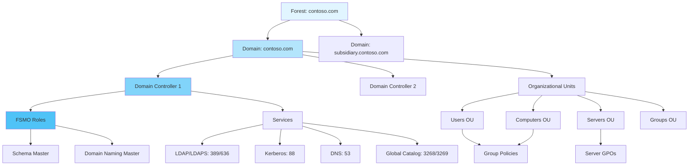

Active Directory Domain Services provides centralized authentication, authorization, and directory services for Windows environments. It serves as the foundation for enterprise identity management.

## Overview

AD DS offers:

- **Centralized Authentication**: Single sign-on using Kerberos
- **Directory Services**: LDAP-based hierarchical directory
- **Group Policy Management**: Centralized configuration management
- **Authorization**: Role-based access control
- **Replication**: Multi-master replication between domain controllers

## Architecture

Active Directory provides centralized authentication and authorization for Windows environments:



## Installation

### Install AD DS Role

```powershell
# Install AD DS role and management tools
Install-WindowsFeature AD-Domain-Services -IncludeManagementTools

# Verify installation
Get-WindowsFeature AD-Domain-Services
```

## Domain Controller Promotion

### Create New Forest

> [!WARNING]
> Never hardcode passwords in production scripts. Always use `Get-Credential` or `Read-Host -AsSecureString`.

```powershell
# Prompt for Safe Mode password securely
$SafeModePassword = Read-Host -AsSecureString -Prompt "Enter Safe Mode Administrator Password"

# Promote to domain controller (new forest)
Install-ADDSForest `
    -DomainName "contoso.local" `
    -DomainNetbiosName "CONTOSO" `
    -DomainMode "WinThreshold" `
    -ForestMode "WinThreshold" `
    -InstallDns `
    -SafeModeAdministratorPassword $SafeModePassword `
    -Force
```

### Add Domain Controller to Existing Domain

```powershell
# Prompt for Safe Mode password securely
$SafeModePassword = Read-Host -AsSecureString -Prompt "Enter Safe Mode Administrator Password"

# Promote to domain controller (existing domain)
Install-ADDSDomainController `
    -DomainName "contoso.local" `
    -InstallDns `
    -Credential (Get-Credential -Message "Enter Domain Admin credentials") `
    -SafeModeAdministratorPassword $SafeModePassword `
    -Force
```

### Add Child Domain

```powershell
$SafeModePassword = Read-Host -AsSecureString -Prompt "Enter Safe Mode Administrator Password"

Install-ADDSDomain `
    -NewDomainName "subsidiary" `
    -ParentDomainName "contoso.local" `
    -DomainMode "WinThreshold" `
    -InstallDns `
    -Credential (Get-Credential -Message "Enter Enterprise Admin credentials") `
    -SafeModeAdministratorPassword $SafeModePassword `
    -Force
```

## User and Group Management

### Create Organizational Units

```powershell
# Create OU structure
New-ADOrganizationalUnit -Name "Departments" -Path "DC=contoso,DC=local"
New-ADOrganizationalUnit -Name "IT" -Path "OU=Departments,DC=contoso,DC=local"
New-ADOrganizationalUnit -Name "Finance" -Path "OU=Departments,DC=contoso,DC=local"
New-ADOrganizationalUnit -Name "HR" -Path "OU=Departments,DC=contoso,DC=local"
```

### Create User Accounts

> [!WARNING]
> Always use secure password generation methods. Never hardcode passwords in production environments.

```powershell
# Prompt for initial user password securely
$UserPassword = Read-Host -AsSecureString -Prompt "Enter initial password for new user"

# Create user account
New-ADUser `
    -Name "John Doe" `
    -GivenName "John" `
    -Surname "Doe" `
    -SamAccountName "jdoe" `
    -UserPrincipalName "jdoe@contoso.local" `
    -Path "OU=IT,OU=Departments,DC=contoso,DC=local" `
    -AccountPassword $UserPassword `
    -Enabled $true `
    -ChangePasswordAtLogon $true `
    -Description "IT Administrator"

# Set additional properties
Set-ADUser -Identity "jdoe" `
    -Title "Systems Administrator" `
    -Department "IT" `
    -Company "Contoso" `
    -EmailAddress "jdoe@contoso.com" `
    -OfficePhone "555-1234"
```

### Create Security Groups

```powershell
# Create security group
New-ADGroup `
    -Name "IT Administrators" `
    -GroupScope Global `
    -GroupCategory Security `
    -Path "OU=IT,OU=Departments,DC=contoso,DC=local" `
    -Description "IT department administrators"

# Add members to group
Add-ADGroupMember -Identity "IT Administrators" -Members "jdoe","asmith","bjones"

# Verify membership
Get-ADGroupMember -Identity "IT Administrators"
```

### Bulk User Creation

```powershell
# Import users from CSV
$Users = Import-Csv -Path "C:\Users.csv"

foreach ($User in $Users)
{
    $SecurePassword = Read-Host -AsSecureString -Prompt "Enter password for $($User.SamAccountName)"
    
    New-ADUser `
        -Name "$($User.FirstName) $($User.LastName)" `
        -GivenName $User.FirstName `
        -Surname $User.LastName `
        -SamAccountName $User.SamAccountName `
        -UserPrincipalName "$($User.SamAccountName)@contoso.local" `
        -Path $User.OU `
        -AccountPassword $SecurePassword `
        -Enabled $true `
        -ChangePasswordAtLogon $true
}
```

## FSMO Roles

### View FSMO Role Holders

```powershell
# View all FSMO roles
Get-ADDomain | Select-Object PDCEmulator,RIDMaster,InfrastructureMaster
Get-ADForest | Select-Object SchemaMaster,DomainNamingMaster

# Using netdom (alternative)
netdom query fsmo
```

### Transfer FSMO Roles

```powershell
# Transfer PDC Emulator role
Move-ADDirectoryServerOperationMasterRole -Identity "DC02" -OperationMasterRole PDCEmulator

# Transfer all roles
Move-ADDirectoryServerOperationMasterRole -Identity "DC02" `
    -OperationMasterRole SchemaMaster,DomainNamingMaster,PDCEmulator,RIDMaster,InfrastructureMaster
```

### Seize FSMO Roles (Emergency Only)

```powershell
# Seize roles when original DC is permanently offline
Move-ADDirectoryServerOperationMasterRole -Identity "DC02" `
    -OperationMasterRole PDCEmulator -Force
```

## Replication Management

### Check Replication Status

```powershell
# View replication partners
Get-ADReplicationPartnerMetadata -Target "DC01"

# Check replication health
Get-ADReplicationUpToDatenessVectorTable -Target "DC01"

# Force replication
repadmin /syncall /AeD

# Check for replication errors
repadmin /showrepl
```

### Troubleshoot Replication

```powershell
# Check replication queue
repadmin /queue

# Replicate specific partition
repadmin /replicate DC02 DC01 "DC=contoso,DC=local"

# Check DCDiag
dcdiag /v /c /d /e /s:DC01
```

## Active Directory Sites

### Create Sites and Subnets

```powershell
# Create site
New-ADReplicationSite -Name "Boston"

# Create subnet
New-ADReplicationSubnet -Name "10.0.1.0/24" -Site "Boston"

# Create site link
New-ADReplicationSiteLink -Name "HQ-Boston" `
    -SitesIncluded "Default-First-Site-Name","Boston" `
    -Cost 100 `
    -ReplicationFrequencyInMinutes 180
```

### Move Domain Controller to Site

```powershell
Move-ADDirectoryServer -Identity "DC01" -Site "Boston"
```

## Backup and Recovery

### Backup Active Directory

```powershell
# Backup system state (includes AD DS)
wbadmin start systemstatebackup -backupTarget:E: -quiet

# Using Windows Server Backup
$Policy = New-WBPolicy
$BackupLocation = New-WBBackupTarget -VolumePath "E:"
Add-WBBackupTarget -Policy $Policy -Target $BackupLocation
Add-WBSystemState -Policy $Policy
Start-WBBackup -Policy $Policy
```

### Restore Active Directory

```powershell
# Non-authoritative restore
wbadmin start systemstaterecovery -version:12/30/2024-23:00 -backupTarget:E:

# Authoritative restore (in Directory Services Restore Mode)
ntdsutil
activate instance ntds
authoritative restore
restore subtree "OU=IT,OU=Departments,DC=contoso,DC=local"
quit
quit
```

## Maintenance

### Active Directory Database

```powershell
# Offline defragmentation (in Directory Services Restore Mode)
ntdsutil
activate instance ntds
files
compact to c:\temp
quit
quit

# After compaction, replace original file
# copy c:\temp\ntds.dit c:\windows\ntds\ntds.dit
```

### Tombstone Lifetime

```powershell
# View tombstone lifetime
Get-ADObject -Identity "CN=Directory Service,CN=Windows NT,CN=Services,CN=Configuration,DC=contoso,DC=local" `
    -Properties tombstoneLifetime

# Set tombstone lifetime (days)
Set-ADObject -Identity "CN=Directory Service,CN=Windows NT,CN=Services,CN=Configuration,DC=contoso,DC=local" `
    -Replace @{tombstoneLifetime=180}
```

## Security Best Practices

- ✅ Use separate accounts for admin tasks (regular user + admin account)
- ✅ Implement tiered admin model (Tier 0/1/2)
- ✅ Enable LDAPS (LDAP over SSL) for encrypted communication
- ✅ Configure fine-grained password policies
- ✅ Monitor privileged group membership
- ✅ Enable audit logging for sensitive operations
- ✅ Implement regular AD backups
- ✅ Use read-only domain controllers (RODC) in branch offices

## Monitoring

```powershell
# Check AD replication status
Get-ADReplicationFailure -Target "DC01"

# Monitor authentication attempts
Get-WinEvent -LogName Security | Where-Object {$_.Id -eq 4624} | Select-Object -First 10

# Check AD database size
Get-ChildItem "C:\Windows\NTDS\ntds.dit" | Select-Object Name, @{N='SizeGB';E={$_.Length/1GB}}

# View domain controller diagnostics
dcdiag /v
```

## Related Topics

- **[DNS Server](index.md#common-server-roles)** - DNS configuration for Active Directory
- **[DHCP Server](index.md#common-server-roles)** - IP address management
- **[Security Quick Start](../security/quick-start.md)** - AD security hardening
- **[Group Policy](../configuration-management.md#group-policy-management)** - Centralized configuration management
