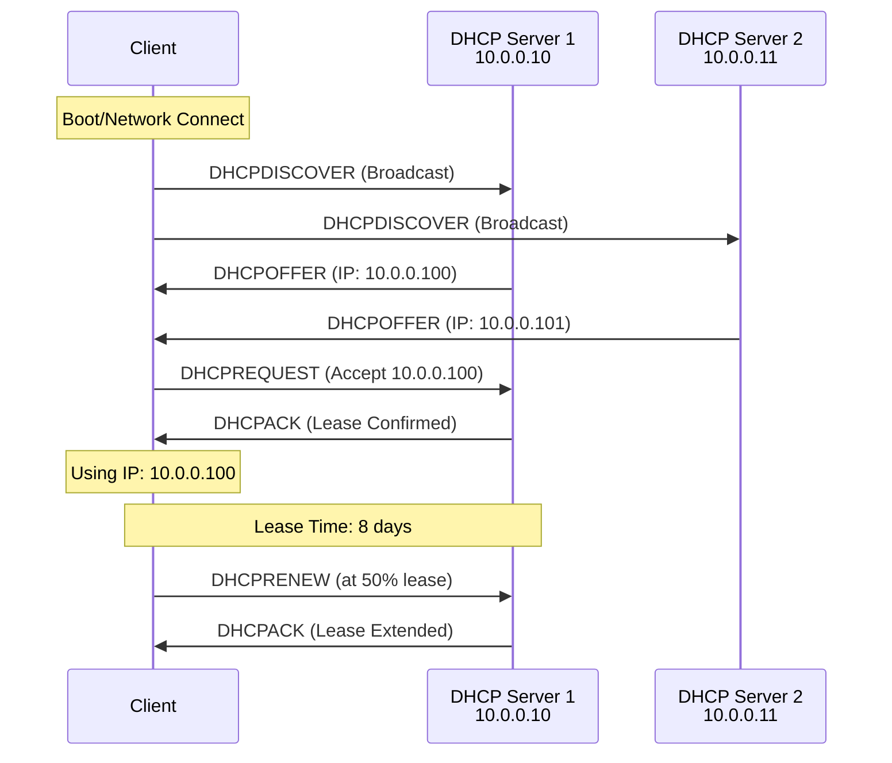

The Dynamic Host Configuration Protocol (DHCP) Server role automatically assigns IP addresses and network configuration to clients, simplifying network management and reducing configuration errors.

## DHCP Architecture Overview



## Prerequisites

- Windows Server 2019 or later
- Static IP address configuration
- Member of Enterprise Admins or DHCP Administrators group
- Proper network connectivity
- DNS server configured

## Installation

### Using Server Manager

1. Open Server Manager
2. Click **Manage** > **Add Roles and Features**
3. Select **Role-based or feature-based installation**
4. Select your server
5. Check **DHCP Server**
6. Click **Next** through the wizard
7. Click **Install**
8. Complete post-installation configuration wizard

### Using PowerShell

```powershell
# Install DHCP Server role
Install-WindowsFeature -Name DHCP -IncludeManagementTools

# Verify installation
Get-WindowsFeature -Name DHCP

# Check DHCP service status
Get-Service -Name DHCPServer
```

## Post-Installation Configuration

### Authorize DHCP Server in Active Directory

```powershell
# Authorize DHCP server (run on domain controller or as Enterprise Admin)
Add-DhcpServerInDC -DnsName "dhcp01.company.com" -IPAddress "10.0.0.10"

# Verify authorization
Get-DhcpServerInDC

# Check authorization status
Get-DhcpServerSetting
```

### Create Security Groups

```powershell
# Add DHCP Administrators group
netsh dhcp add securitygroups

# Restart DHCP service
Restart-Service DHCPServer

# Configure DHCP permissions
Add-DhcpServerSecurityGroup -ComputerName "dhcp01.company.com"
```

## Scope Configuration

### Creating DHCP Scopes

```powershell
# Create basic DHCP scope
Add-DhcpServerv4Scope -Name "Main Office" `
    -StartRange 10.0.0.100 `
    -EndRange 10.0.0.200 `
    -SubnetMask 255.255.255.0 `
    -LeaseDuration 8.00:00:00 `
    -State Active

# Set scope options (gateway, DNS)
Set-DhcpServerv4OptionValue -ScopeId 10.0.0.0 `
    -Router 10.0.0.1 `
    -DnsServer 10.0.0.10,10.0.0.11 `
    -DnsDomain "company.com"

# Create scope with exclusion ranges
Add-DhcpServerv4Scope -Name "Branch Office" `
    -StartRange 10.0.1.50 `
    -EndRange 10.0.1.250 `
    -SubnetMask 255.255.255.0
    
Add-DhcpServerv4ExclusionRange -ScopeId 10.0.1.0 `
    -StartRange 10.0.1.1 `
    -EndRange 10.0.1.49
```

### Configuring Scope Options

```powershell
# Set server-level options (apply to all scopes)
Set-DhcpServerv4OptionValue -DnsServer 10.0.0.10,10.0.0.11 `
    -DnsDomain "company.com" `
    -Router 10.0.0.1

# Set scope-specific options
Set-DhcpServerv4OptionValue -ScopeId 10.0.0.0 `
    -Router 10.0.0.1 `
    -WinsServer 10.0.0.15 `
    -NtpServer 10.0.0.10

# Set vendor-specific options
Set-DhcpServerv4OptionValue -ScopeId 10.0.0.0 `
    -OptionId 43 `
    -Value 0x010400000001

# Configure boot options for PXE
Set-DhcpServerv4OptionValue -ScopeId 10.0.0.0 `
    -BootFileName "boot\x64\wdsnbp.com" `
    -BootServerHostName "wds01.company.com"
```

### Advanced Scope Configuration

```powershell
# Create superscope (combine multiple scopes)
Add-DhcpServerv4Superscope -SuperscopeName "Building-A" `
    -ScopeId 10.0.0.0,10.0.1.0

# Create multicast scope
Add-DhcpServerv4MulticastScope -Name "Imaging" `
    -StartRange 239.0.0.1 `
    -EndRange 239.0.0.254 `
    -LeaseDuration 30.00:00:00

# Configure failover (for high availability)
Add-DhcpServerv4Failover -ComputerName "dhcp01.company.com" `
    -PartnerServer "dhcp02.company.com" `
    -Name "DHCP-Failover" `
    -ScopeId 10.0.0.0 `
    -LoadBalancePercent 50 `
    -SharedSecret "SecurePassword123!"
```

## Reservation Management

### Creating DHCP Reservations

```powershell
# Create reservation by MAC address
Add-DhcpServerv4Reservation -ScopeId 10.0.0.0 `
    -IPAddress 10.0.0.50 `
    -ClientId "00-15-5D-00-01-00" `
    -Name "Server01" `
    -Description "File Server"

# Create multiple reservations from CSV
$Reservations = Import-Csv "C:\reservations.csv"
foreach ($Res in $Reservations) {
    Add-DhcpServerv4Reservation -ScopeId $Res.ScopeId `
        -IPAddress $Res.IPAddress `
        -ClientId $Res.MAC `
        -Name $Res.Name
}

# Set reservation options
Set-DhcpServerv4OptionValue -ReservedIP 10.0.0.50 `
    -Router 10.0.0.254 `
    -DnsServer 10.0.0.20

# View reservations
Get-DhcpServerv4Reservation -ScopeId 10.0.0.0
```

### Managing Reservations

```powershell
# Modify reservation
Set-DhcpServerv4Reservation -IPAddress 10.0.0.50 `
    -Name "FileServer01-Updated" `
    -Description "Primary File Server"

# Remove reservation
Remove-DhcpServerv4Reservation -IPAddress 10.0.0.50

# Export reservations
Get-DhcpServerv4Reservation -ScopeId 10.0.0.0 | Export-Csv "C:\reservations-backup.csv"
```

## Lease Management

### Viewing and Managing Leases

```powershell
# View all active leases
Get-DhcpServerv4Lease -ScopeId 10.0.0.0

# View leases for specific scope
Get-DhcpServerv4Lease -ScopeId 10.0.0.0 | Where-Object {$_.AddressState -eq "Active"}

# Find lease by IP
Get-DhcpServerv4Lease -IPAddress 10.0.0.100

# Find lease by MAC address
Get-DhcpServerv4Lease -ScopeId 10.0.0.0 | Where-Object {$_.ClientId -eq "00-15-5D-00-01-00"}

# Remove expired leases
Get-DhcpServerv4Lease -ScopeId 10.0.0.0 | Where-Object {$_.AddressState -eq "Expired"} | Remove-DhcpServerv4Lease
```

### Lease Duration Configuration

```powershell
# Set lease duration for scope
Set-DhcpServerv4Scope -ScopeId 10.0.0.0 -LeaseDuration 8.00:00:00

# Set different lease durations by client type
# Desktop computers - 8 days
# Laptops - 1 day
# Servers - 30 days (use reservations instead)

# Configure lease time based on policy
Add-DhcpServerv4Policy -Name "Laptops-Short-Lease" `
    -ScopeId 10.0.0.0 `
    -Condition OR `
    -MacAddress EQ,"00-50-56-*" `
    -LeaseDuration 1.00:00:00
```

## DHCP Policies

### Creating Client Policies

```powershell
# Create policy for specific vendor class
Add-DhcpServerv4Policy -Name "Android-Devices" `
    -ScopeId 10.0.0.0 `
    -Condition OR `
    -VendorClass EQ,"Android"

# Set options for policy
Set-DhcpServerv4OptionValue -ScopeId 10.0.0.0 `
    -PolicyName "Android-Devices" `
    -DnsServer 10.0.0.12 `
    -Router 10.0.0.2

# Create policy based on MAC address prefix
Add-DhcpServerv4Policy -Name "Corporate-Devices" `
    -ScopeId 10.0.0.0 `
    -MacAddress EQ,"00-50-56-*","00-0C-29-*" `
    -Condition OR

# Create policy based on user class
Add-DhcpServerv4Policy -Name "VIP-Users" `
    -ScopeId 10.0.0.0 `
    -UserClass EQ,"VIP" `
    -LeaseDuration 30.00:00:00
```

### Creating Range Policies

```powershell
# Create policy with specific IP range
Add-DhcpServerv4Policy -Name "Guest-Network" `
    -ScopeId 10.0.0.0 `
    -Condition OR `
    -RelayAgent EQ,"10.0.2.1"

Set-DhcpServerv4OptionValue -ScopeId 10.0.0.0 `
    -PolicyName "Guest-Network" `
    -Router 10.0.0.254 `
    -DnsServer 8.8.8.8,8.8.4.4

# Create policy for specific device types
Add-DhcpServerv4Policy -Name "IoT-Devices" `
    -ScopeId 10.0.0.0 `
    -MacAddress EQ,"B8-27-EB-*" `  # Raspberry Pi prefix
    -LeaseDuration 365.00:00:00
```

## IPv6 DHCP Configuration

### DHCPv6 Scope Creation

```powershell
# Create DHCPv6 scope
Add-DhcpServerv6Scope -Name "IPv6-Main" `
    -Prefix 2001:db8::/64 `
    -State Active

# Set DHCPv6 options
Set-DhcpServerv6OptionValue -DnsServer 2001:db8::10,2001:db8::11 `
    -DomainSearchList "company.com"

# Create DHCPv6 reservation
Add-DhcpServerv6Reservation -Prefix 2001:db8::/64 `
    -IPAddress 2001:db8::50 `
    -ClientDuid "00-01-00-01-1A-2B-3C-4D-00-15-5D-00-01-00" `
    -Name "Server01-v6"
```

## High Availability

### DHCP Failover Configuration

```powershell
# Configure load balance failover
Add-DhcpServerv4Failover -ComputerName "dhcp01.company.com" `
    -PartnerServer "dhcp02.company.com" `
    -Name "DHCP-LB-Failover" `
    -ScopeId 10.0.0.0,10.0.1.0 `
    -LoadBalancePercent 50 `
    -MaxClientLeadTime 1:00:00 `
    -AutoStateTransition $true `
    -StateSwitchInterval 1:00:00 `
    -SharedSecret "ComplexPassword123!"

# Configure hot standby failover
Add-DhcpServerv4Failover -ComputerName "dhcp01.company.com" `
    -PartnerServer "dhcp02.company.com" `
    -Name "DHCP-HS-Failover" `
    -ScopeId 10.0.2.0 `
    -ServerRole Active `
    -ReservePercent 10 `
    -SharedSecret "ComplexPassword123!"

# View failover status
Get-DhcpServerv4Failover

# Replicate failover configuration
Invoke-DhcpServerv4FailoverReplication -ComputerName "dhcp01.company.com" `
    -Name "DHCP-LB-Failover"
```

### DHCP Split-Scope Configuration

```powershell
# Configure split-scope (manual method)
# Server 1: 10.0.0.100-10.0.0.150
Add-DhcpServerv4Scope -ComputerName "dhcp01.company.com" `
    -Name "Main-Split-1" `
    -StartRange 10.0.0.100 `
    -EndRange 10.0.0.150 `
    -SubnetMask 255.255.255.0

# Server 2: 10.0.0.151-10.0.0.200
Add-DhcpServerv4Scope -ComputerName "dhcp02.company.com" `
    -Name "Main-Split-2" `
    -StartRange 10.0.0.151 `
    -EndRange 10.0.0.200 `
    -SubnetMask 255.255.255.0

# Configure delay on backup server
Set-DhcpServerv4Scope -ComputerName "dhcp02.company.com" `
    -ScopeId 10.0.0.0 `
    -Delay 1000  # 1 second delay
```

## Monitoring and Reporting

### DHCP Statistics

```powershell
# View DHCP statistics
Get-DhcpServerv4Statistics

# View scope statistics
Get-DhcpServerv4ScopeStatistics -ScopeId 10.0.0.0

# View all scope utilization
Get-DhcpServerv4Scope | Get-DhcpServerv4ScopeStatistics | 
    Select-Object ScopeId, AddressesInUse, AddressesFree, PercentageInUse

# Monitor DHCP performance counters
Get-Counter '\DHCP Server\Acks/sec'
Get-Counter '\DHCP Server\Active Queue Length'
```

### Audit Logging

```powershell
# Enable DHCP audit logging
Set-DhcpServerAuditLog -Enable $true -Path "C:\Windows\System32\dhcp"

# View audit log settings
Get-DhcpServerAuditLog

# Read recent audit logs
Get-Content "C:\Windows\System32\dhcp\DhcpSrvLog-*.log" -Tail 100

# Search for specific events
Select-String -Path "C:\Windows\System32\dhcp\DhcpSrvLog-*.log" -Pattern "10.0.0.100"
```

## Backup and Recovery

### Backup DHCP Configuration

```powershell
# Backup DHCP database
Backup-DhcpServer -ComputerName "dhcp01.company.com" -Path "C:\DHCP-Backups\"

# Export DHCP configuration
Export-DhcpServer -ComputerName "dhcp01.company.com" `
    -File "C:\DHCP-Backups\dhcp-config.xml" `
    -Leases

# Export specific scope
Export-DhcpServer -ComputerName "dhcp01.company.com" `
    -File "C:\DHCP-Backups\scope-10.0.0.0.xml" `
    -ScopeId 10.0.0.0 `
    -Leases

# Backup to network share
$BackupPath = "\\fileserver\DHCP-Backups\$(Get-Date -Format 'yyyy-MM-dd')"
New-Item -Path $BackupPath -ItemType Directory -Force
Backup-DhcpServer -ComputerName "dhcp01.company.com" -Path $BackupPath
```

### Restore DHCP Configuration

```powershell
# Restore DHCP database
Restore-DhcpServer -ComputerName "dhcp01.company.com" -Path "C:\DHCP-Backups\"

# Import DHCP configuration
Import-DhcpServer -ComputerName "dhcp01.company.com" `
    -File "C:\DHCP-Backups\dhcp-config.xml" `
    -BackupPath "C:\DHCP-Backups\" `
    -Leases

# Migrate DHCP to new server
Export-DhcpServer -ComputerName "dhcp-old.company.com" -File "C:\dhcp-export.xml" -Leases
Import-DhcpServer -ComputerName "dhcp-new.company.com" -File "C:\dhcp-export.xml" -Leases
```

## Integration with DNS

### Dynamic DNS Updates

```powershell
# Configure DHCP to update DNS
Set-DhcpServerv4DnsSetting -ComputerName "dhcp01.company.com" `
    -DynamicUpdates Always `
    -DeleteDnsRROnLeaseExpiry $true `
    -UpdateDnsRRForOlderClients $true `
    -DnsSuffix "company.com"

# Configure credentials for DNS updates
Set-DhcpServerDnsCredential -ComputerName "dhcp01.company.com" `
    -Credential (Get-Credential)

# View DNS settings
Get-DhcpServerv4DnsSetting

# Configure per-scope DNS settings
Set-DhcpServerv4DnsSetting -ScopeId 10.0.0.0 `
    -DynamicUpdates Always `
    -NameProtection $true
```

## Troubleshooting DHCP Issues

### Common DHCP Problems

**Symptom**: Clients not receiving IP addresses

```powershell
# Check DHCP service status
Get-Service DHCPServer
Test-ServiceHealth DHCPServer

# Verify DHCP authorization
Get-DhcpServerInDC

# Check scope status
Get-DhcpServerv4Scope | Where-Object {$_.State -eq "Inactive"}

# Check available IPs in scope
Get-DhcpServerv4ScopeStatistics -ScopeId 10.0.0.0

# Test DHCP server
Test-NetConnection -ComputerName "dhcp01.company.com" -Port 67

# View DHCP event logs
Get-WinEvent -LogName "Microsoft-Windows-DHCP-Server/Operational" -MaxEvents 50
```

**Symptom**: Duplicate IP address conflicts

```powershell
# Enable conflict detection
Set-DhcpServerv4Scope -ScopeId 10.0.0.0 -ConflictDetectionAttempts 2

# Check for duplicate IPs
Get-DhcpServerv4Lease -ScopeId 10.0.0.0 | Group-Object IPAddress | Where-Object {$_.Count -gt 1}

# Verify exclusion ranges
Get-DhcpServerv4ExclusionRange -ScopeId 10.0.0.0

# Check reservations
Get-DhcpServerv4Reservation -ScopeId 10.0.0.0
```

**Symptom**: DHCP failover issues

```powershell
# Check failover status
Get-DhcpServerv4Failover

# Test failover connectivity
Test-NetConnection -ComputerName "dhcp02.company.com" -Port 647

# Force failover replication
Invoke-DhcpServerv4FailoverReplication -Force

# View failover event logs
Get-WinEvent -LogName "Microsoft-Windows-DHCP-Server/Operational" | 
    Where-Object {$_.Message -like "*failover*"}
```

### DHCP Debugging

```powershell
# Enable debug logging
Set-DhcpServerAuditLog -Enable $true

# Capture DHCP traffic
netsh trace start capture=yes protocol=udp ports=(67,68) tracefile=C:\dhcp-trace.etl

# Stop capture
netsh trace stop

# View DHCP packets with netsh
netsh dhcp server show mibinfo

# Check DHCP database integrity
netsh dhcp server \\dhcp01.company.com show dbproperties

# Reconcile scopes
Repair-DhcpServerv4IPRecord -ScopeId 10.0.0.0
```

### Performance Issues

```powershell
# Check database size
Get-ChildItem "$env:SystemRoot\System32\dhcp\dhcp.mdb" | Select-Object Length

# Compact DHCP database
Stop-Service DHCPServer
netsh dhcp server compact
Start-Service DHCPServer

# Monitor performance
Get-Counter '\DHCP Server\Packets Received/sec'
Get-Counter '\DHCP Server\Packets Expired/sec'

# Optimize database
Set-DhcpServerDatabase -FileName "dhcp.mdb" `
    -BackupPath "C:\Windows\System32\dhcp\backup" `
    -BackupInterval 30 `
    -LoggingEnabled $true
```

## Best Practices

### DHCP Design

- **High Availability**: Deploy DHCP failover or split-scope configuration
- **80/20 Rule**: Use 80/20 split for split-scope (80% on primary, 20% on secondary)
- **Scope Planning**: Plan IP address ranges with room for growth
- **Reservations**: Use reservations for servers and network devices
- **Lease Duration**: Set appropriate lease durations (8 days for wired, 1 day for wireless)

### DHCP Security

- **Authorization**: Always authorize DHCP servers in Active Directory
- **Rogue Detection**: Monitor for unauthorized DHCP servers
- **MAC Filtering**: Use DHCP policies to restrict access by MAC address
- **Audit Logging**: Enable and regularly review DHCP audit logs
- **Secure DNS Updates**: Use credentials for dynamic DNS updates

### DHCP Operations

- **Monitoring**: Regularly monitor scope utilization (alert at 85%)
- **Backup**: Implement automated DHCP configuration backups
- **Documentation**: Document all scopes, reservations, and policies
- **Testing**: Test failover configurations regularly
- **Maintenance**: Perform regular database maintenance

## Related Topics

- **[DNS Server](dns.md)** - DNS integration and dynamic updates
- **[Active Directory DS](ad-ds.md)** - DHCP authorization and integration
- **[Server Roles Overview](index.md)** - Other Windows Server roles
- **[Security Quick Start](../security/quick-start.md)** - DHCP security hardening
- **[Configuration Management](../configuration-management.md)** - Automate DHCP configuration

## Additional Resources

- [Microsoft DHCP Documentation](https://docs.microsoft.com/en-us/windows-server/networking/technologies/dhcp/dhcp-top)
- [DHCP Failover Planning](https://docs.microsoft.com/en-us/previous-versions/windows/it-pro/windows-server-2012-R2-and-2012/dn338978(v=ws.11))
- [DHCP Best Practices](https://docs.microsoft.com/en-us/previous-versions/windows/it-pro/windows-server-2008-R2-and-2008/dd183591(v=ws.10))
