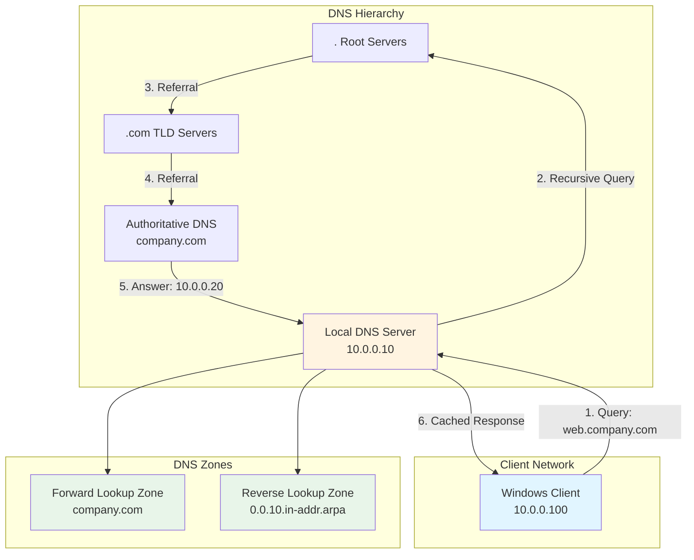

The Domain Name System (DNS) Server role provides name resolution services, translating human-readable domain names into IP addresses. DNS is essential for Active Directory environments and internet connectivity.

## DNS Architecture Overview



## Prerequisites

- Windows Server 2019 or later
- Static IP address configuration
- Administrative privileges
- Proper network connectivity

## Installation

### Using Server Manager

1. Open Server Manager
2. Click **Manage** > **Add Roles and Features**
3. Select **Role-based or feature-based installation**
4. Select your server
5. Check **DNS Server**
6. Click **Next** through the wizard
7. Click **Install**

### Using PowerShell

```powershell
# Install DNS Server role
Install-WindowsFeature -Name DNS -IncludeManagementTools

# Verify installation
Get-WindowsFeature -Name DNS

# Check DNS service status
Get-Service -Name DNS
```

## Initial Configuration

### Configure DNS Server Settings

```powershell
# Set DNS forwarders (use Google DNS or your ISP DNS)
Set-DnsServerForwarder -IPAddress "8.8.8.8","8.8.4.4"

# Configure root hints (if needed)
Add-DnsServerRootHint -NameServer "a.root-servers.net" -IPAddress "198.41.0.4"

# Enable DNS scavenging
Set-DnsServerScavenging -ScavengingState $true -ScavengingInterval 7.00:00:00

# Configure DNS aging
Set-DnsServerZoneAging -ZoneName "company.com" -Aging $true -RefreshInterval 7 -NoRefreshInterval 7
```

## DNS Zones

### Creating Forward Lookup Zones

```powershell
# Create primary zone
Add-DnsServerPrimaryZone -Name "company.com" -ReplicationScope "Forest" -DynamicUpdate Secure

# Create secondary zone
Add-DnsServerSecondaryZone -Name "partner.com" -ZoneFile "partner.com.dns" -MasterServers "192.168.1.10"

# Create stub zone
Add-DnsServerStubZone -Name "external.com" -MasterServers "10.10.10.10" -ReplicationScope "Domain"
```

### Creating Reverse Lookup Zones

```powershell
# Create reverse lookup zone for 10.0.0.0/24 network
Add-DnsServerPrimaryZone -NetworkId "10.0.0.0/24" -ReplicationScope "Forest" -DynamicUpdate Secure

# Create reverse lookup zone for IPv6
Add-DnsServerPrimaryZone -NetworkId "2001:db8::/64" -ReplicationScope "Domain"
```

## DNS Record Management

### Creating DNS Records

```powershell
# Add A record
Add-DnsServerResourceRecordA -Name "web01" -ZoneName "company.com" -IPv4Address "10.0.0.20"

# Add AAAA record (IPv6)
Add-DnsServerResourceRecordAAAA -Name "web01" -ZoneName "company.com" -IPv6Address "2001:db8::20"

# Add CNAME record
Add-DnsServerResourceRecordCName -Name "www" -ZoneName "company.com" -HostNameAlias "web01.company.com"

# Add MX record
Add-DnsServerResourceRecordMX -Name "." -ZoneName "company.com" -MailExchange "mail.company.com" -Preference 10

# Add TXT record (SPF)
Add-DnsServerResourceRecord -ZoneName "company.com" -Name "." -Txt -DescriptiveText "v=spf1 mx ~all"

# Add SRV record (for Active Directory)
Add-DnsServerResourceRecord -ZoneName "company.com" -Name "_ldap._tcp.dc._msdcs" -Srv -DomainName "dc01.company.com" -Port 389 -Priority 0 -Weight 100

# Add PTR record (reverse)
Add-DnsServerResourceRecordPtr -Name "20" -ZoneName "0.0.10.in-addr.arpa" -PtrDomainName "web01.company.com"
```

### Querying DNS Records

```powershell
# Query A records
Get-DnsServerResourceRecord -ZoneName "company.com" -RRType A

# Query specific record
Get-DnsServerResourceRecord -ZoneName "company.com" -Name "web01"

# Query all records in zone
Get-DnsServerResourceRecord -ZoneName "company.com"

# Test DNS resolution
Resolve-DnsName -Name "web01.company.com" -Type A
Resolve-DnsName -Name "company.com" -Type MX

# Clear DNS cache
Clear-DnsServerCache
```

### Modifying DNS Records

```powershell
# Modify A record
$OldRecord = Get-DnsServerResourceRecord -Name "web01" -ZoneName "company.com" -RRType A
$NewRecord = $OldRecord.Clone()
$NewRecord.RecordData.IPv4Address = "10.0.0.21"
Set-DnsServerResourceRecord -ZoneName "company.com" -OldInputObject $OldRecord -NewInputObject $NewRecord

# Remove DNS record
Remove-DnsServerResourceRecord -ZoneName "company.com" -Name "web01" -RRType A -Force
```

## DNS Security

### Configure DNS Policies

```powershell
# Create query resolution policy (geo-location)
Add-DnsServerQueryResolutionPolicy -Name "USPolicy" -Action ALLOW -Fqdn "EQ,*.company.com" -ClientSubnet "EQ,US-Subnet"

# Create zone transfer policy
Add-DnsServerZoneTransferPolicy -Name "AllowTransfer" -Action ALLOW -ServerInterfaceIP "EQ,10.0.0.10"

# Block specific clients
Add-DnsServerQueryResolutionPolicy -Name "BlockClient" -Action IGNORE -ClientSubnet "EQ,10.0.1.0/24"
```

### DNSSEC Implementation

```powershell
# Enable DNSSEC for zone
Add-DnsServerSigningKey -ZoneName "company.com" -Type KeySigningKey -CryptoAlgorithm RsaSha256
Add-DnsServerSigningKey -ZoneName "company.com" -Type ZoneSigningKey -CryptoAlgorithm RsaSha256

# Sign the zone
Invoke-DnsServerZoneSign -ZoneName "company.com"

# Verify DNSSEC status
Get-DnsServerDnsSecZoneSetting -ZoneName "company.com"

# Export DS record for parent zone
Get-DnsServerResourceRecord -ZoneName "company.com" -RRType DS
```

### Configure DNS Logging

```powershell
# Enable DNS debug logging
Set-DnsServerDiagnostics -All $true -LogFilePath "C:\Windows\System32\dns\dns.log"

# Enable specific logging categories
Set-DnsServerDiagnostics -Queries $true -Answers $true -Updates $true

# Configure audit logging
Set-DnsServerDiagnostics -EnableLoggingForPluginDllEvent $true

# View current logging settings
Get-DnsServerDiagnostics
```

## DNS Performance Optimization

### Configure Caching

```powershell
# Configure cache settings
Set-DnsServerCache -MaxTTL 86400 -MaxNegativeTTL 900

# Configure recursion
Set-DnsServerRecursion -Enable $true -SecureResponse $true

# Set socket pool size (for performance)
dnscmd /config /socketpoolsize 5000

# Configure EDNS (Extended DNS)
Set-DnsServerEDns -EnableProbes $true -CacheTimeout "00:15:00"
```

### Monitor DNS Performance

```powershell
# Get DNS statistics
Get-DnsServerStatistics

# Monitor queries per second
(Get-Counter '\DNS\Total Query Received/sec').CounterSamples

# Monitor cache hit ratio
(Get-Counter '\DNS\Caching Memory').CounterSamples

# Export statistics
Get-DnsServerStatistics | Export-Csv -Path "C:\DNS-Stats.csv" -NoTypeInformation
```

## Integration with Active Directory

### DNS and AD DS

```powershell
# Verify AD-integrated zones
Get-DnsServerZone | Where-Object {$_.ZoneType -eq "Primary" -and $_.IsDsIntegrated -eq $true}

# Configure dynamic updates for AD
Set-DnsServerPrimaryZone -Name "company.com" -DynamicUpdate Secure

# Create AD DNS records
Register-DnsClient

# Force AD DNS registration
ipconfig /registerdns

# Verify SRV records
nslookup -type=SRV _ldap._tcp.dc._msdcs.company.com
```

## High Availability

### DNS Replication

```powershell
# Verify zone replication
Get-DnsServerZone -Name "company.com" | Select-Object ZoneName, ReplicationScope, IsDsIntegrated

# Force zone replication
Sync-DnsServerZone -ZoneName "company.com"

# Check replication status
Get-DnsServerZoneTransferPolicy
```

### Load Balancing

```powershell
# Configure round-robin
Set-DnsServerGlobalQueryBlockList -Enable $false
Set-DnsServerRoundRobin -Enable $true

# Add multiple A records for same host (round-robin)
Add-DnsServerResourceRecordA -Name "web" -ZoneName "company.com" -IPv4Address "10.0.0.20"
Add-DnsServerResourceRecordA -Name "web" -ZoneName "company.com" -IPv4Address "10.0.0.21"
Add-DnsServerResourceRecordA -Name "web" -ZoneName "company.com" -IPv4Address "10.0.0.22"

# Configure netmask ordering
Set-DnsServerGlobalNameZone -Enable $true
```

## Backup and Recovery

### Backup DNS Configuration

```powershell
# Export DNS zones
Export-DnsServerZone -Name "company.com" -FileName "company.com.backup"

# Backup all zone files
$Zones = Get-DnsServerZone
foreach ($Zone in $Zones)
{
    Export-DnsServerZone -Name $Zone.ZoneName -FileName "$($Zone.ZoneName).backup"
}

# Backup DNS server configuration
dnscmd /enumzones | Out-File "C:\DNS-Zones-Backup.txt"

# Copy zone files
Copy-Item "$env:SystemRoot\System32\dns\*" -Destination "C:\DNS-Backup\" -Recurse
```

### Restore DNS Configuration

```powershell
# Restore zone from file
Add-DnsServerPrimaryZone -Name "company.com" -ZoneFile "company.com.backup"

# Restore zone files
Copy-Item "C:\DNS-Backup\*" -Destination "$env:SystemRoot\System32\dns\" -Force

# Restart DNS service
Restart-Service -Name DNS
```

## Troubleshooting DNS Issues

### Common DNS Problems

**Symptom**: DNS queries failing

```powershell
# Check DNS service
Get-Service -Name DNS

# Test DNS resolution
Resolve-DnsName -Name "localhost"
Resolve-DnsName -Name "company.com" -Server 127.0.0.1

# Check DNS server responsiveness
Test-DnsServer -IPAddress "10.0.0.10" -ZoneName "company.com"

# Clear DNS cache
Clear-DnsServerCache
ipconfig /flushdns  # On client
```

**Symptom**: Slow DNS resolution

```powershell
# Check forwarders
Get-DnsServerForwarder

# Test forwarder response
Resolve-DnsName -Name "google.com" -Server "8.8.8.8"

# Monitor performance counters
Get-Counter '\DNS\Total Query Received/sec'
Get-Counter '\DNS\Recursive Queries/sec'

# Check recursion settings
Get-DnsServerRecursion
```

**Symptom**: Zone transfer failures

```powershell
# Check zone transfer settings
Get-DnsServerZone -Name "company.com" | Select-Object ZoneName, SecondaryServers, NotifyServers

# Test zone transfer
nslookup -type=AXFR company.com 10.0.0.10

# Check zone transfer permissions
Get-DnsServerZoneTransferPolicy

# Force zone transfer
Start-DnsServerZoneTransfer -Name "company.com"
```

### DNS Event Logs

```powershell
# View DNS event logs
Get-WinEvent -LogName "DNS Server" -MaxEvents 100

# Filter for errors
Get-WinEvent -LogName "DNS Server" | Where-Object {$_.LevelDisplayName -eq "Error"}

# Search for specific event ID
Get-WinEvent -LogName "DNS Server" | Where-Object {$_.Id -eq 4015}

# Export DNS logs
Get-WinEvent -LogName "DNS Server" -MaxEvents 1000 | Export-Csv "C:\DNS-Events.csv"
```

### DNS Debugging

```powershell
# Enable debug logging
Set-DnsServerDiagnostics -All $true

# View debug log
Get-Content "$env:SystemRoot\System32\dns\dns.log" -Tail 50

# Capture DNS traffic with netsh
netsh trace start capture=yes tracefile=C:\dns-trace.etl

# Stop capture
netsh trace stop

# Use nslookup for testing
nslookup company.com
nslookup -type=MX company.com
nslookup -type=SRV _ldap._tcp.dc._msdcs.company.com
```

## Best Practices

### DNS Design

- **Redundancy**: Deploy at least two DNS servers for fault tolerance
- **AD Integration**: Use AD-integrated zones for domain environments
- **Forwarders**: Configure reliable forwarders (ISP DNS or public DNS like 8.8.8.8)
- **Reverse Zones**: Create reverse lookup zones for all networks
- **Scavenging**: Enable DNS scavenging to remove stale records

### DNS Security Best Practices

- **Secure Dynamic Updates**: Use secure dynamic updates for AD-integrated zones
- **DNSSEC**: Implement DNSSEC for critical zones
- **Access Control**: Restrict zone transfers to authorized servers
- **Logging**: Enable audit logging for security monitoring
- **Recursion**: Disable recursion on public-facing DNS servers

### DNS Performance

- **Caching**: Optimize cache settings for your environment
- **Monitoring**: Regularly monitor DNS performance counters
- **Zone Types**: Use appropriate zone types (primary, secondary, stub)
- **Record TTL**: Set appropriate TTL values for records
- **Round Robin**: Use round-robin for simple load distribution

## Related Topics

- **[Active Directory DS](ad-ds.md)** - DNS integration with Active Directory
- **[DHCP Server](dhcp.md)** - Coordinate with DHCP for dynamic DNS updates
- **[Server Roles Overview](index.md)** - Other Windows Server roles
- **[Security Quick Start](../security/quick-start.md)** - DNS security hardening
- **[Configuration Management](../configuration-management.md)** - Automate DNS configuration

## Additional Resources

- [Microsoft DNS Documentation](https://docs.microsoft.com/en-us/windows-server/networking/dns/)
- [DNS Best Practices](https://docs.microsoft.com/en-us/previous-versions/windows/it-pro/windows-server-2008-R2-and-2008/cc794554(v=ws.10))
- [DNSSEC Deployment Guide](https://docs.microsoft.com/en-us/previous-versions/windows/it-pro/windows-server-2012-R2-and-2012/dn593666(v=ws.11))
