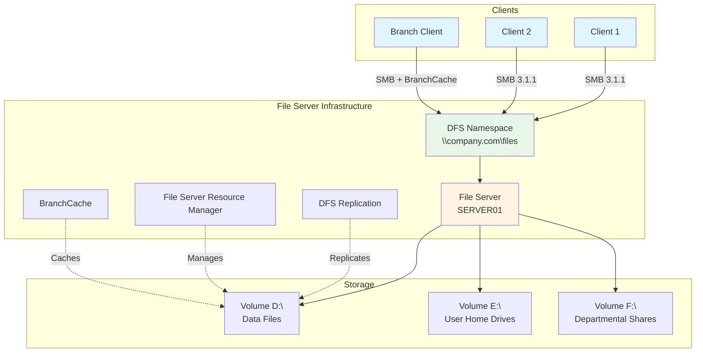

File and Storage Services provides technologies for storage management, file replication, distributed namespace management, fast file searching, and streamlined client access to files.

## File Services Architecture



## Prerequisites

- Windows Server 2019 or later
- Adequate storage capacity
- NTFS-formatted volumes
- Administrative privileges
- Active Directory integration (for DFS, Access-Based Enumeration)

## Installation

### Using Server Manager

1. Open Server Manager
2. Click **Manage** > **Add Roles and Features**
3. Select **Role-based or feature-based installation**
4. Check **File and Storage Services**
5. Expand and select specific role services:
   - File Server
   - BranchCache for Network Files
   - Data Deduplication
   - DFS Namespaces
   - DFS Replication
   - File Server Resource Manager
   - File Server VSS Agent Service
   - Work Folders
6. Click **Install**

### Using PowerShell

```powershell
# Install File Server role with all features
Install-WindowsFeature -Name FS-FileServer,FS-BranchCache,FS-Data-Deduplication,FS-DFS-Namespace,FS-DFS-Replication,FS-Resource-Manager,FS-VSS-Agent -IncludeManagementTools

# Verify installation
Get-WindowsFeature -Name FS-*

# Check File Server service
Get-Service -Name LanmanServer
```

## File Shares Configuration

### Creating SMB Shares

```powershell
# Create basic file share
New-SmbShare -Name "Data" -Path "D:\Shares\Data" -FullAccess "Domain Admins" -ChangeAccess "Domain Users"

# Create share with specific permissions
New-SmbShare -Name "Finance" -Path "D:\Shares\Finance" `
    -FullAccess "COMPANY\Finance-Admins" `
    -ChangeAccess "COMPANY\Finance-Users" `
    -ReadAccess "COMPANY\Finance-ReadOnly"

# Create share with ABE (Access-Based Enumeration)
New-SmbShare -Name "Departments" -Path "D:\Shares\Departments" `
    -FolderEnumerationMode AccessBased `
    -FullAccess "Everyone"

# Create share with encryption
New-SmbShare -Name "Confidential" -Path "D:\Shares\Confidential" `
    -EncryptData $true `
    -FullAccess "COMPANY\Executives"

# Create hidden administrative share
New-SmbShare -Name "IT$" -Path "D:\IT" -FullAccess "COMPANY\IT-Admins"
```

### Configuring Share Properties

```powershell
# Enable Access-Based Enumeration
Set-SmbShare -Name "Data" -FolderEnumerationMode AccessBased

# Configure share caching (offline files)
Set-SmbShare -Name "Data" -CachingMode Manual

# Enable continuous availability (for failover cluster)
Set-SmbShare -Name "Data" -ContinuouslyAvailable $true

# Set concurrent user limit
Set-SmbShare -Name "Data" -ConcurrentUserLimit 100

# Configure SMB encryption
Set-SmbShare -Name "Confidential" -EncryptData $true

# View share properties
Get-SmbShare -Name "Data" | Format-List *
```

### NTFS Permissions Management

```powershell
# Set NTFS permissions
$Acl = Get-Acl "D:\Shares\Data"
$Permission = "COMPANY\Domain Users","Modify","Allow"
$AccessRule = New-Object System.Security.AccessControl.FileSystemAccessRule $Permission
$Acl.SetAccessRule($AccessRule)
Set-Acl "D:\Shares\Data" $Acl

# Remove inheritance
$Acl = Get-Acl "D:\Shares\Finance"
$Acl.SetAccessRuleProtection($true, $false)
Set-Acl "D:\Shares\Finance" $Acl

# Copy permissions from another folder
$SourceAcl = Get-Acl "D:\Shares\Template"
Set-Acl "D:\Shares\NewFolder" $SourceAcl

# View effective permissions
Get-Acl "D:\Shares\Data" | Format-List
```

## DFS Namespace Configuration

### Creating DFS Namespace

```powershell
# Install DFS Management Tools
Install-WindowsFeature -Name RSAT-DFS-Mgmt-Con

# Create domain-based namespace
New-DfsnRoot -Path "\\company.com\files" -TargetPath "\\fileserver01\files" -Type DomainV2

# Create standalone namespace
New-DfsnRoot -Path "\\fileserver01\Public" -TargetPath "\\fileserver01\Public" -Type Standalone

# Add namespace server (for redundancy)
New-DfsnRootTarget -Path "\\company.com\files" -TargetPath "\\fileserver02\files"
```

### Creating DFS Folders

```powershell
# Add folder to namespace
New-DfsnFolder -Path "\\company.com\files\Data" -TargetPath "\\fileserver01\Data"

# Add folder with multiple targets
New-DfsnFolder -Path "\\company.com\files\Shared" -TargetPath "\\fileserver01\Shared"
New-DfsnFolderTarget -Path "\\company.com\files\Shared" -TargetPath "\\fileserver02\Shared"

# Set folder referral priority
Set-DfsnFolderTarget -Path "\\company.com\files\Data" -TargetPath "\\fileserver01\Data" -ReferralPriorityClass GlobalHigh

# View DFS configuration
Get-DfsnRoot
Get-DfsnFolder -Path "\\company.com\files\*"
```

## DFS Replication Configuration

### Creating Replication Group

```powershell
# Create replication group
New-DfsReplicationGroup -GroupName "File-Replication"

# Add members to group
Add-DfsrMember -GroupName "File-Replication" -ComputerName "FileServer01","FileServer02"

# Create replicated folder
New-DfsReplicatedFolder -GroupName "File-Replication" -FolderName "Data"

# Set replication connection
Add-DfsrConnection -GroupName "File-Replication" -SourceComputerName "FileServer01" -DestinationComputerName "FileServer02"

# Set membership
Set-DfsrMembership -GroupName "File-Replication" -FolderName "Data" -ComputerName "FileServer01" -ContentPath "D:\Replication\Data" -PrimaryMember $true
Set-DfsrMembership -GroupName "File-Replication" -FolderName "Data" -ComputerName "FileServer02" -ContentPath "D:\Replication\Data"
```

### Configuring Replication Settings

```powershell
# Set replication schedule (full 24/7)
Set-DfsrGroupSchedule -GroupName "File-Replication" -ScheduleType Always

# Set bandwidth throttling
Set-DfsrConnection -GroupName "File-Replication" -SourceComputerName "FileServer01" -DestinationComputerName "FileServer02" -MaximumBandwidthInMbps 50

# Configure staging quota
Set-DfsrMembership -GroupName "File-Replication" -FolderName "Data" -ComputerName "FileServer01" -StagingPathQuotaInMB 16384

# Set conflict and deleted quota
Set-DfsrMembership -GroupName "File-Replication" -FolderName "Data" -ComputerName "FileServer01" -ConflictAndDeletedQuotaInMB 4096

# View replication status
Get-DfsrState -ComputerName "FileServer01"
Get-DfsrBacklog -GroupName "File-Replication" -FolderName "Data" -SourceComputerName "FileServer01" -DestinationComputerName "FileServer02"
```

## File Server Resource Manager (FSRM)

### Quota Management

```powershell
# Create quota template
New-FsrmQuotaTemplate -Name "User-5GB" -Size 5GB -SoftLimit

# Create quota on folder
New-FsrmQuota -Path "E:\Users\jsmith" -Template "User-5GB"

# Create auto-apply quota
New-FsrmAutoQuota -Path "E:\Users" -Template "User-5GB"

# Set quota notifications
$Action = New-FsrmAction -Type Email -MailTo "admin@company.com" -Subject "Quota Warning" -Body "User [Source Io Owner] has exceeded quota limit"
$Threshold = New-FsrmQuotaThreshold -Percentage 85 -Action $Action
Set-FsrmQuotaTemplate -Name "User-5GB" -Threshold $Threshold

# View quota usage
Get-FsrmQuota | Select-Object Path, Usage, Size, @{Name="Used%";Expression={[math]::Round(($_.Usage/$_.Size)*100,2)}}
```

### File Screening

```powershell
# Create file group
New-FsrmFileGroup -Name "Media-Files" -IncludePattern @("*.mp3","*.mp4","*.avi","*.mkv")

# Create file screen template
New-FsrmFileScreenTemplate -Name "Block-Media" -IncludeGroup "Media-Files" -Active

# Apply file screen
New-FsrmFileScreen -Path "D:\Shares\Data" -Template "Block-Media"

# Create file screen exception
New-FsrmFileScreenException -Path "D:\Shares\Data\Marketing" -IncludeGroup "Media-Files"

# Set file screen notification
$Action = New-FsrmAction -Type Email -MailTo "[Source Io Owner Email]" -Subject "File Blocked" -Body "File [Source File Path] was blocked"
Set-FsrmFileScreenTemplate -Name "Block-Media" -Notification $Action
```

### Storage Reports

```powershell
# Generate storage report
New-FsrmStorageReport -Name "Monthly-Report" -Namespace "D:\Shares" -ReportType @("DuplicateFiles","LargeFiles","LeastRecentlyAccessed","QuotaUsage") -MailTo "admin@company.com"

# Schedule report
$Task = New-FsrmScheduledTask -Time "01:00AM" -Weekly @(Sunday)
New-FsrmStorageReport -Name "Weekly-Report" -Namespace "D:\Shares" -ReportType "FilesByOwner" -Schedule $Task

# Generate immediate report
Start-FsrmStorageReport -Name "Monthly-Report" -Wait
```

## Data Deduplication

### Enabling Data Deduplication

```powershell
# Enable deduplication on volume
Enable-DedupVolume -Volume "D:" -UsageType Default

# Enable for specific workload
Enable-DedupVolume -Volume "E:" -UsageType HyperV

# Set deduplication schedule
Set-DedupVolume -Volume "D:" -MinimumFileAgeDays 3

# Exclude file types
Set-DedupVolume -Volume "D:" -ExcludeFileType @(".mp4",".avi")

# Exclude folders
Set-DedupVolume -Volume "D:" -ExcludeFolder @("D:\NoDedup","D:\Temp")
```

### Managing Deduplication

```powershell
# Start deduplication job
Start-DedupJob -Volume "D:" -Type Optimization

# View deduplication status
Get-DedupStatus -Volume "D:"

# View deduplication schedule
Get-DedupSchedule -Type Optimization

# Monitor deduplication job
Get-DedupJob -Volume "D:"

# View savings
Get-DedupStatus | Select-Object Volume, Capacity, SavedSpace, OptimizedFilesCount, @{Name="Savings%";Expression={[math]::Round(($_.SavedSpace/$_.Capacity)*100,2)}}
```

## Work Folders

### Configuring Work Folders

```powershell
# Create sync share
New-SyncShare -Name "UserWorkFolders" -Path "F:\WorkFolders\%username%" -User "COMPANY\Domain Users"

# Configure Work Folders settings
Set-SyncShare -Name "UserWorkFolders" -RequireEncryption $true -RequirePasswordAutoLock $true

# Set sync share quota
Set-SyncShare -Name "UserWorkFolders" -UserQuotaGB 50

# View Work Folders status
Get-SyncShare
Get-SyncShare -Name "UserWorkFolders" | Get-SyncShareStatus
```

## BranchCache

### Enabling BranchCache

```powershell
# Enable BranchCache on file server
Install-WindowsFeature -Name FS-BranchCache

# Configure BranchCache for SMB shares
Set-SmbShare -Name "Data" -CachingMode BranchCache

# Set BranchCache hash publication
Set-BCCache -Percentage 10

# Enable BranchCache firewall rules
Enable-NetFirewallRule -DisplayGroup "BranchCache*"
```

## Monitoring and Reporting

### File Server Monitoring

```powershell
# View open files
Get-SmbOpenFile | Select-Object ClientComputerName, ClientUserName, Path, SessionId

# View SMB sessions
Get-SmbSession | Select-Object ClientComputerName, ClientUserName, NumOpens, SecondsIdle

# Close specific session
Close-SmbSession -SessionId 12345 -Force

# Monitor SMB performance
Get-Counter '\SMB Server Shares(*)\*'
Get-Counter '\SMB Client Shares(*)\*'

# View share access
Get-SmbShareAccess -Name "Data"
```

### Storage Monitoring

```powershell
# Check volume free space
Get-Volume | Select-Object DriveLetter, FileSystemLabel, Size, SizeRemaining, @{Name="Free%";Expression={[math]::Round(($_.SizeRemaining/$_.Size)*100,2)}}

# Monitor disk performance
Get-Counter '\LogicalDisk(*)\% Free Space'
Get-Counter '\PhysicalDisk(*)\Avg. Disk Queue Length'

# Check NTFS health
Get-Volume | Get-VolumeHealth

# Scan for corruption
Repair-Volume -DriveLetter D -Scan
```

## Backup and Recovery

### Shadow Copies (VSS)

```powershell
# Enable shadow copies
Enable-ComputerRestore -Drive "D:\"

# Create shadow copy
Checkpoint-Computer -Description "Manual Snapshot" -RestorePointType MODIFY_SETTINGS

# Configure shadow copy schedule (use Task Scheduler or Storage Spaces)
$Action = New-ScheduledTaskAction -Execute "vssadmin.exe" -Argument "create shadow /for=D:"
$Trigger = New-ScheduledTaskTrigger -Daily -At 2am
Register-ScheduledTask -TaskName "Shadow-Copy-D" -Action $Action -Trigger $Trigger

# View shadow copies
vssadmin list shadows

# Restore from shadow copy
# (Use Previous Versions in File Explorer or PowerShell)
```

### File Share Backup

```powershell
# Backup share configuration
Get-SmbShare | Export-Clixml "C:\Backup\Shares-Config.xml"

# Backup NTFS permissions
$Shares = Get-SmbShare
foreach ($Share in $Shares) {
    $Path = $Share.Path
    $Acl = Get-Acl $Path
    $Acl | Export-Clixml "C:\Backup\ACL-$($Share.Name).xml"
}

# Restore share configuration
Import-Clixml "C:\Backup\Shares-Config.xml" | ForEach-Object {
    New-SmbShare -Name $_.Name -Path $_.Path -FullAccess $_.FullAccess
}
```

## Troubleshooting File Services

### Common File Server Issues

**Symptom**: Cannot access file share

```powershell
# Check SMB service
Get-Service -Name LanmanServer

# Test SMB connectivity
Test-NetConnection -ComputerName "fileserver01" -Port 445

# View SMB configuration
Get-SmbServerConfiguration

# Check firewall rules
Get-NetFirewallRule -DisplayGroup "File and Printer Sharing" | Where-Object {$_.Enabled -eq $true}

# View event logs
Get-WinEvent -LogName "Microsoft-Windows-SMBServer/Operational" -MaxEvents 50
```

**Symptom**: DFS replication not working

```powershell
# Check DFS-R service
Get-Service -Name DFSR

# View replication status
Get-DfsrState

# Check backlog
Get-DfsrBacklog -GroupName "File-Replication" -FolderName "Data" -SourceComputerName "Server01" -DestinationComputerName "Server02"

# View DFS-R event log
Get-WinEvent -LogName "DFS Replication" -MaxEvents 100 | Where-Object {$_.LevelDisplayName -eq "Error"}

# Force replication
Sync-DfsReplicationGroup -GroupName "File-Replication"
```

**Symptom**: Performance issues

```powershell
# Check disk performance
Get-Counter '\PhysicalDisk(*)\Avg. Disk sec/Read'
Get-Counter '\PhysicalDisk(*)\Avg. Disk sec/Write'

# Monitor SMB performance
Get-SmbConnection
Get-SmbBandwidthLimit

# Check for file locks
Get-SmbOpenFile | Where-Object {$_.Path -like "*locked-file*"}

# Analyze large files
Get-ChildItem -Path "D:\Shares" -Recurse -File | 
    Sort-Object Length -Descending | 
    Select-Object -First 100 FullName, @{Name="SizeMB";Expression={[math]::Round($_.Length/1MB,2)}}
```

## Best Practices

### File Server Design

- **Storage Planning**: Allocate adequate storage with 20% free space buffer
- **Redundancy**: Use RAID configurations and regular backups
- **DFS Namespaces**: Implement DFS for scalability and redundancy
- **Access Control**: Use groups for permissions, not individual users
- **ABE**: Enable Access-Based Enumeration for security

### File Server Security

- **SMB Encryption**: Enable encryption for sensitive data shares
- **NTFS Permissions**: Follow principle of least privilege
- **Auditing**: Enable audit logging for sensitive folders
- **File Screening**: Block unauthorized file types
- **Shadow Copies**: Enable VSS for quick recovery

### File Server Performance

- **Deduplication**: Enable on appropriate volumes to save space
- **Quotas**: Implement quotas to prevent runaway storage usage
- **BranchCache**: Deploy for branch offices to reduce WAN traffic
- **Monitoring**: Set alerts for storage capacity and performance
- **Maintenance**: Schedule regular maintenance windows

## Related Topics

- **[Active Directory DS](ad-ds.md)** - Integration with AD for permissions
- **[Server Roles Overview](index.md)** - Other Windows Server roles
- **[Security Quick Start](../security/quick-start.md)** - File server security hardening
- **[Configuration Management](../configuration-management.md)** - Automate file server configuration

## Additional Resources

- [Microsoft File Services Documentation](https://docs.microsoft.com/en-us/windows-server/storage/storage)
- [DFS Namespaces and Replication](https://docs.microsoft.com/en-us/windows-server/storage/dfs-namespaces/dfs-overview)
- [File Server Resource Manager](https://docs.microsoft.com/en-us/windows-server/storage/fsrm/fsrm-overview)
- [Data Deduplication](https://docs.microsoft.com/en-us/windows-server/storage/data-deduplication/overview)
