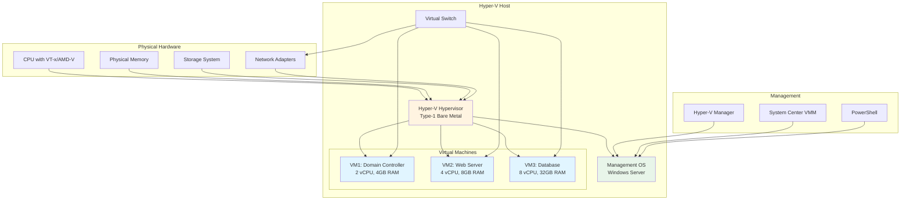

Hyper-V is Microsoft's hardware virtualization technology that enables running multiple operating systems as virtual machines on Windows Server, providing efficient resource utilization and workload isolation.

## Hyper-V Architecture Overview



## Prerequisites

### Hardware Requirements

- **CPU**: 64-bit processor with:
  - Hardware-assisted virtualization (Intel VT-x or AMD-V)
  - Second Level Address Translation (SLAT)
  - Hardware-enforced Data Execution Prevention (DEP)
- **RAM**: Minimum 4GB (8GB+ recommended for production)
- **Storage**: Adequate disk space for VMs (SSD recommended)
- **Network**: At least one network adapter (multiple recommended)

### Software Requirements

- Windows Server 2019 or later (Datacenter or Standard)
- Administrative privileges
- BIOS/UEFI virtualization enabled

### Checking Prerequisites

```powershell
# Check if CPU supports virtualization
Get-ComputerInfo | Select-Object HyperVisorPresent, HyperVRequirementVirtualizationFirmwareEnabled

# Check Hyper-V requirements
systeminfo | findstr /C:"Hyper-V Requirements"

# Verify SLAT support
Get-WmiObject -Class Win32_Processor | Select-Object Name, SecondLevelAddressTranslationExtensions
```

## Installation

### Using Server Manager

1. Open Server Manager
2. Click **Manage** > **Add Roles and Features**
3. Select **Role-based or feature-based installation**
4. Check **Hyper-V**
5. Select network adapters for virtual switch creation
6. Configure virtual machine migration settings
7. Choose default VM and VHD storage locations
8. Click **Install**
9. **Restart** the server when prompted

### Using PowerShell

```powershell
# Install Hyper-V role
Install-WindowsFeature -Name Hyper-V -IncludeManagementTools -Restart

# Install with all features
Install-WindowsFeature -Name Hyper-V,Hyper-V-Tools,Hyper-V-PowerShell -IncludeManagementTools -Restart

# Verify installation
Get-WindowsFeature -Name Hyper-V*

# Check Hyper-V service
Get-Service -Name vmms,vmcompute
```

## Initial Configuration

### Configure Host Settings

```powershell
# Set default VM storage location
Set-VMHost -VirtualHardDiskPath "D:\Hyper-V\Virtual Hard Disks"
Set-VMHost -VirtualMachinePath "D:\Hyper-V\Virtual Machines"

# Enable Enhanced Session Mode
Set-VMHost -EnableEnhancedSessionMode $true

# Configure NUMA spanning
Set-VMHost -NumaSpanningEnabled $false  # Disable for better performance

# Configure resource metering
Enable-VMResourceMetering -ComputerName localhost

# View host configuration
Get-VMHost | Format-List *
```

## Virtual Switch Configuration

### Creating Virtual Switches

```powershell
# Create external virtual switch
New-VMSwitch -Name "External-vSwitch" -NetAdapterName "Ethernet" -AllowManagementOS $true

# Create internal virtual switch
New-VMSwitch -Name "Internal-vSwitch" -SwitchType Internal

# Create private virtual switch
New-VMSwitch -Name "Private-vSwitch" -SwitchType Private

# View virtual switches
Get-VMSwitch | Select-Object Name, SwitchType, NetAdapterInterfaceDescription
```

### Advanced Virtual Switch Configuration

```powershell
# Enable SR-IOV on virtual switch
New-VMSwitch -Name "SR-IOV-vSwitch" -NetAdapterName "Ethernet 2" -EnableIov $true

# Configure bandwidth management
Set-VMSwitch -Name "External-vSwitch" -DefaultFlowMinimumBandwidthWeight 1

# Enable RDMA
Enable-NetAdapterRdma -Name "vEthernet (External-vSwitch)"

# View switch details
Get-VMSwitch -Name "External-vSwitch" | Format-List *
```

## Virtual Machine Creation

### Creating VMs with PowerShell

```powershell
# Create basic VM
New-VM -Name "VM01" -MemoryStartupBytes 4GB -Generation 2 -NewVHDPath "D:\Hyper-V\Virtual Hard Disks\VM01.vhdx" -NewVHDSizeBytes 60GB -SwitchName "External-vSwitch"

# Create VM with specific configuration
New-VM -Name "DC01" `
    -MemoryStartupBytes 4GB `
    -Generation 2 `
    -NewVHDPath "D:\VMs\DC01\DC01.vhdx" `
    -NewVHDSizeBytes 80GB `
    -SwitchName "External-vSwitch"

# Configure VM processor
Set-VMProcessor -VMName "DC01" -Count 2

# Enable dynamic memory
Set-VMMemory -VMName "DC01" -DynamicMemoryEnabled $true -MinimumBytes 2GB -MaximumBytes 8GB -Buffer 20

# Add DVD drive with ISO
Add-VMDvdDrive -VMName "DC01" -Path "D:\ISOs\Windows-Server-2022.iso"

# Start VM
Start-VM -Name "DC01"
```

### VM Configuration Options

```powershell
# Enable secure boot
Set-VMFirmware -VMName "VM01" -EnableSecureBoot On -SecureBootTemplate "MicrosoftWindows"

# Configure automatic start/stop
Set-VM -Name "VM01" -AutomaticStartAction Start -AutomaticStartDelay 30
Set-VM -Name "VM01" -AutomaticStopAction ShutDown

# Enable integration services
Enable-VMIntegrationService -VMName "VM01" -Name "Guest Service Interface","Heartbeat","Key-Value Pair Exchange","Shutdown","Time Synchronization","VSS"

# Configure checkpoints
Set-VM -Name "VM01" -CheckpointType Production

# Disable checkpoints
Set-VM -Name "VM01" -CheckpointType Disabled
```

## Virtual Hard Disk Management

### Creating Virtual Disks

```powershell
# Create fixed VHD
New-VHD -Path "D:\VMs\Data01.vhdx" -SizeBytes 100GB -Fixed

# Create dynamically expanding VHD
New-VHD -Path "D:\VMs\Data02.vhdx" -SizeBytes 500GB -Dynamic

# Create differencing disk
New-VHD -Path "D:\VMs\Child01.vhdx" -ParentPath "D:\VMs\Template.vhdx" -Differencing

# Attach VHD to VM
Add-VMHardDiskDrive -VMName "VM01" -Path "D:\VMs\Data01.vhdx"
```

### Managing Virtual Disks

```powershell
# Resize VHD
Resize-VHD -Path "D:\VMs\Data01.vhdx" -SizeBytes 200GB

# Convert dynamic to fixed
Convert-VHD -Path "D:\VMs\Data02.vhdx" -DestinationPath "D:\VMs\Data02-Fixed.vhdx" -VHDType Fixed

# Optimize VHD (compact)
Optimize-VHD -Path "D:\VMs\Data02.vhdx" -Mode Full

# Mount VHD on host
Mount-VHD -Path "D:\VMs\Data01.vhdx"

# Dismount VHD
Dismount-VHD -Path "D:\VMs\Data01.vhdx"

# Get VHD information
Get-VHD -Path "D:\VMs\Data01.vhdx" | Format-List *
```

## Checkpoint Management

### Creating and Managing Checkpoints

```powershell
# Create standard checkpoint
Checkpoint-VM -Name "VM01" -SnapshotName "Pre-Update"

# Create production checkpoint
Checkpoint-VM -Name "VM01" -SnapshotName "Backup-$(Get-Date -Format 'yyyy-MM-dd')"

# List checkpoints
Get-VMSnapshot -VMName "VM01"

# Restore checkpoint
Restore-VMSnapshot -VMName "VM01" -Name "Pre-Update" -Confirm:$false

# Remove checkpoint
Remove-VMSnapshot -VMName "VM01" -Name "Pre-Update"

# Remove all checkpoints
Get-VMSnapshot -VMName "VM01" | Remove-VMSnapshot

# Export checkpoint tree
Get-VMSnapshot -VMName "VM01" | Export-VMSnapshot -Path "D:\Backups\VM01-Checkpoints"
```

## VM Networking Configuration

### Configuring Network Adapters

```powershell
# Add network adapter
Add-VMNetworkAdapter -VMName "VM01" -SwitchName "External-vSwitch"

# Configure MAC address
Set-VMNetworkAdapter -VMName "VM01" -StaticMacAddress "00-15-5D-00-01-00"

# Enable MAC address spoofing
Set-VMNetworkAdapter -VMName "VM01" -MacAddressSpoofing On

# Configure VLAN
Set-VMNetworkAdapterVlan -VMName "VM01" -Access -VlanId 100

# Enable bandwidth management
Set-VMNetworkAdapter -VMName "VM01" -MinimumBandwidthWeight 10 -MaximumBandwidth 1000000000

# Enable DHCP guard
Set-VMNetworkAdapter -VMName "VM01" -DhcpGuard On
```

### Advanced Networking

```powershell
# Enable SR-IOV on network adapter
Set-VMNetworkAdapter -VMName "VM01" -IovWeight 100

# Configure NIC teaming
Add-VMNetworkAdapter -VMName "VM01" -SwitchName "External-vSwitch" -Name "NIC-Team1"
Add-VMNetworkAdapter -VMName "VM01" -SwitchName "External-vSwitch" -Name "NIC-Team2"
Set-VMNetworkAdapterTeamMapping -VMName "VM01" -VMNetworkAdapterName "NIC-Team1" -PhysicalNetAdapterName "Ethernet 1"

# Enable packet direct
Set-VMNetworkAdapter -VMName "VM01" -PacketDirectModerationCount 64 -PacketDirectModerationInterval 100
```

## Live Migration

### Configuring Live Migration

```powershell
# Enable Live Migration
Enable-VMMigration

# Configure authentication protocol
Set-VMMigrationNetwork -ComputerName "HyperV-Host01" -Subnet "10.0.0.0/24" -Priority 1

# Set simultaneous migrations
Set-VMHost -MaximumVirtualMachineMigrations 2

# Configure performance options
Set-VMHost -VirtualMachineMigrationPerformanceOption SMB

# Use compression
Set-VMHost -VirtualMachineMigrationPerformanceOption Compression
```

### Performing Live Migration

```powershell
# Live migrate VM to another host
Move-VM -Name "VM01" -DestinationHost "HyperV-Host02"

# Live migrate with storage
Move-VM -Name "VM01" -DestinationHost "HyperV-Host02" -DestinationStoragePath "D:\VMs"

# Storage-only migration
Move-VMStorage -VMName "VM01" -DestinationStoragePath "E:\VMs"

# Quick migration (save state, move, restore)
Move-VM -Name "VM01" -DestinationHost "HyperV-Host02" -IncludeStorage
```

## Replication

### Configuring Hyper-V Replica

```powershell
# Enable replication on primary host
Set-VMReplicationServer -ReplicationEnabled $true -AllowedAuthenticationType Kerberos -ReplicationAllowedFromAnyServer $false -DefaultStorageLocation "D:\Replica"

# Configure firewall
Enable-NetFirewallRule -DisplayName "Hyper-V Replica HTTP Listener (TCP-In)"

# Enable replication for VM
Enable-VMReplication -VMName "VM01" -ReplicaServerName "HyperV-Replica01" -ReplicaServerPort 80 -AuthenticationType Kerberos -CompressionEnabled $true

# Start initial replication
Start-VMInitialReplication -VMName "VM01"

# View replication status
Get-VMReplication -VMName "VM01"
```

### Managing Replication

```powershell
# Test failover
Start-VMFailover -VMName "VM01" -Prepare -AsJob

# Planned failover
Start-VMFailover -VMName "VM01" -AsJob

# Reverse replication
Set-VMReplication -Reverse -VMName "VM01"

# Cancel failover
Stop-VMFailover -VMName "VM01"

# Remove replication
Remove-VMReplication -VMName "VM01"
```

## High Availability with Failover Clustering

### Creating Hyper-V Cluster

```powershell
# Install Failover Clustering
Install-WindowsFeature -Name Failover-Clustering -IncludeManagementTools

# Test cluster configuration
Test-Cluster -Node "HyperV01","HyperV02" -Include "Storage","Network","System Configuration","Hyper-V Configuration"

# Create cluster
New-Cluster -Name "HyperV-Cluster" -Node "HyperV01","HyperV02" -StaticAddress "10.0.0.50"

# Add shared storage
Get-ClusterAvailableDisk | Add-ClusterDisk

# Create Cluster Shared Volume
Add-ClusterSharedVolume -Name "Cluster Disk 1"
```

### Making VMs Highly Available

```powershell
# Make VM highly available
Add-ClusterVirtualMachineRole -VirtualMachine "VM01"

# Configure VM priority
Set-ClusterGroup -Name "VM01" -Priority 3000

# Configure anti-affinity (separate hosts)
(Get-ClusterGroup "VM01").AntiAffinityClassNames = "Production-VMs"
(Get-ClusterGroup "VM02").AntiAffinityClassNames = "Production-VMs"

# Move VM to another node
Move-ClusterVirtualMachineRole -Name "VM01" -Node "HyperV02"
```

## Backup and Recovery

### VM Export and Import

```powershell
# Export VM
Export-VM -Name "VM01" -Path "D:\Exports"

# Import VM (copy mode)
Import-VM -Path "D:\Exports\VM01\Virtual Machines\*.vmcx" -Copy -VhdDestinationPath "D:\VMs" -GenerateNewId

# Import VM (register in place)
Import-VM -Path "D:\Exports\VM01\Virtual Machines\*.vmcx"

# Clone VM
Export-VM -Name "Template-VM" -Path "D:\Templates"
Import-VM -Path "D:\Templates\Template-VM\Virtual Machines\*.vmcx" -Copy -GenerateNewId -VhdDestinationPath "D:\VMs\Clone01"
```

### VM Backup with Windows Server Backup

```powershell
# Install Windows Server Backup
Install-WindowsFeature Windows-Server-Backup

# Create backup policy
$Policy = New-WBPolicy
$VMs = Get-WBVirtualMachine | Where-Object {$_.VMName -in @("VM01","VM02")}
Add-WBVirtualMachine -Policy $Policy -VirtualMachine $VMs
$BackupLocation = New-WBBackupTarget -VolumePath "E:"
Add-WBBackupTarget -Policy $Policy -Target $BackupLocation
Set-WBSchedule -Policy $Policy -Schedule "23:00"
Set-WBPolicy -Policy $Policy

# Start backup
Start-WBBackup -Policy $Policy
```

## Performance Tuning

### CPU Configuration

```powershell
# Set CPU reserve
Set-VMProcessor -VMName "VM01" -Reserve 10

# Configure NUMA
Set-VMProcessor -VMName "VM01" -ExposeVirtualizationExtensions $true
Set-VMProcessor -VMName "VM01" -Maximum 100 -Reserve 10 -RelativeWeight 100

# Enable hardware virtualization for nested virtualization
Set-VMProcessor -VMName "VM01" -ExposeVirtualizationExtensions $true
```

### Memory Configuration

```powershell
# Configure dynamic memory
Set-VMMemory -VMName "VM01" -DynamicMemoryEnabled $true -MinimumBytes 2GB -StartupBytes 4GB -MaximumBytes 16GB -Priority 80 -Buffer 20

# Configure static memory
Set-VMMemory -VMName "VM01" -DynamicMemoryEnabled $false -StartupBytes 8GB

# Enable memory weight
Set-VMMemory -VMName "VM01" -Priority 100  # High priority
```

### Storage Performance

```powershell
# Enable storage QoS
Set-VMHardDiskDrive -VMName "VM01" -ControllerType SCSI -ControllerNumber 0 -ControllerLocation 0 -MaximumIOPS 5000 -MinimumIOPS 100

# Use pass-through disks
Add-VMHardDiskDrive -VMName "VM01" -DiskNumber 2 -ControllerType SCSI

# Enable storage I/O control
Enable-VMResourceMetering -VMName "VM01"
```

## Monitoring and Reporting

### VM Resource Monitoring

```powershell
# Get VM resource usage
Get-VM | Select-Object Name, State, CPUUsage, MemoryAssigned, MemoryDemand, Uptime

# Get detailed metrics
Measure-VM -VMName "VM01"

# Monitor specific VM
while ($true) {
    $VM = Get-VM -Name "VM01"
    Write-Host "$($VM.Name) - CPU: $($VM.CPUUsage)% - Memory: $([math]::Round($VM.MemoryAssigned/1GB,2))GB"
    Start-Sleep -Seconds 5
}

# Get resource metering data
Get-VM | Get-VMResourcePool -ResourcePoolType Memory | Measure-VMResourcePool
```

### Performance Counters

```powershell
# Monitor Hyper-V performance
Get-Counter '\Hyper-V Hypervisor Logical Processor(*)\% Total Run Time'
Get-Counter '\Hyper-V Hypervisor Virtual Processor(*)\% Total Run Time'
Get-Counter '\Hyper-V Dynamic Memory VM(*)\Current Pressure'

# Export performance data
$Counters = @(
    '\Hyper-V Hypervisor Logical Processor(_Total)\% Total Run Time',
    '\Hyper-V Dynamic Memory Balancer(*)\Available Memory',
    '\Hyper-V Virtual Storage Device(*)\Write Bytes/sec'
)
Get-Counter -Counter $Counters -SampleInterval 10 -MaxSamples 360 | Export-Counter -Path "C:\PerfLogs\HyperV-Performance.blg"
```

## Troubleshooting Hyper-V

### Common Hyper-V Issues

**Symptom**: VM won't start

```powershell
# Check VM configuration
Get-VM -Name "VM01" | Format-List *

# Check event logs
Get-WinEvent -LogName "Microsoft-Windows-Hyper-V-VMMS-Admin" -MaxEvents 50 | Where-Object {$_.LevelDisplayName -eq "Error"}

# Verify virtual switch
Get-VMSwitch | Format-List *

# Check storage
Get-VMHardDiskDrive -VMName "VM01"
Test-Path "D:\VMs\VM01\VM01.vhdx"

# Verify memory availability
Get-VMHost | Select-Object MemoryCapacity, @{Name="FreeMemoryGB";Expression={[math]::Round($_.MemoryCapacity/1GB - (Get-VM | Measure-Object -Property MemoryAssigned -Sum).Sum/1GB,2)}}
```

**Symptom**: Poor VM performance

```powershell
# Check CPU usage
Get-VM | Sort-Object CPUUsage -Descending | Select-Object Name, CPUUsage, ProcessorCount

# Check memory pressure
Get-VMMemory -VMName "VM01"

# Check storage latency
Get-Counter '\Hyper-V Virtual Storage Device(*)\Read Operations/Sec'
Get-Counter '\Hyper-V Virtual Storage Device(*)\Write Operations/Sec'

# Check network bandwidth
Get-VMNetworkAdapter -VMName "VM01" | Select-Object Name, BandwidthSetting
```

**Symptom**: Network connectivity issues

```powershell
# Check VM network adapter
Get-VMNetworkAdapter -VMName "VM01" | Format-List *

# Verify virtual switch
Get-VMSwitch | Format-List *

# Check physical adapter
Get-NetAdapter | Where-Object {$_.Status -eq "Up"}

# Test connectivity from VM
Invoke-Command -VMName "VM01" -ScriptBlock {Test-NetConnection google.com}
```

## Best Practices

### Hyper-V Design

- **Resource Allocation**: Don't over-commit CPU and memory beyond 80% capacity
- **Storage**: Use separate physical disks for host OS and VM storage
- **Network**: Use dedicated network adapters for management, VM traffic, and Live Migration
- **VM Generation**: Use Generation 2 VMs for better performance (UEFI, secure boot)
- **Licensing**: Understand Windows Server licensing for virtualization rights

### Hyper-V Security

- **Shielded VMs**: Use for sensitive workloads requiring encryption
- **Secure Boot**: Enable secure boot on Generation 2 VMs
- **BitLocker**: Encrypt VM disks containing sensitive data
- **Network Isolation**: Use VLANs and private virtual switches
- **Least Privilege**: Run VMs with minimal necessary permissions

### Hyper-V Operations

- **Backup**: Implement regular VM backups with tested recovery procedures
- **Monitoring**: Monitor host and VM performance, set alerts
- **Patching**: Maintain regular patching schedule for host and VMs
- **Documentation**: Document VM configurations, network topology, dependencies
- **Disaster Recovery**: Implement Hyper-V Replica or clustering for critical VMs

## Related Topics

- **[File Services](file-services.md)** - Storage for VM files
- **[Active Directory DS](ad-ds.md)** - Authentication for Hyper-V management
- **[Server Roles Overview](index.md)** - Other Windows Server roles
- **[Security Quick Start](../security/quick-start.md)** - Hyper-V security hardening
- **[Configuration Management](../configuration-management.md)** - Automate Hyper-V configuration

## Additional Resources

- [Microsoft Hyper-V Documentation](https://docs.microsoft.com/en-us/windows-server/virtualization/hyper-v/hyper-v-on-windows-server)
- [Hyper-V Best Practices](https://docs.microsoft.com/en-us/windows-server/virtualization/hyper-v/best-practices-for-running-linux-on-hyper-v)
- [Hyper-V Networking](https://docs.microsoft.com/en-us/windows-server/virtualization/hyper-v/plan/plan-hyper-v-networking-in-windows-server)
- [Hyper-V Security](https://docs.microsoft.com/en-us/windows-server/virtualization/hyper-v/learn-more/hyper-v-virtual-machine-security)
