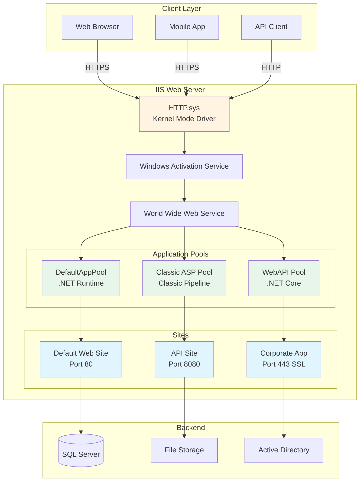

Internet Information Services (IIS) is a flexible, secure, and manageable web server platform for hosting websites, services, and applications on Windows Server.

## IIS Architecture Overview



## Prerequisites

- Windows Server 2019 or later
- Administrative privileges
- Static IP address (recommended)
- DNS records configured
- SSL certificate (for HTTPS sites)

## Installation

### Using Server Manager

1. Open Server Manager
2. Click **Manage** > **Add Roles and Features**
3. Select **Role-based or feature-based installation**
4. Check **Web Server (IIS)**
5. Add required role services:
   - Web Server (includes Common HTTP Features)
   - Management Tools
   - Application Development (.NET, ASP.NET, etc.)
   - Health and Diagnostics
   - Performance Features
   - Security Features
6. Click **Install**

### Using PowerShell

```powershell
# Install IIS with common features
Install-WindowsFeature -Name Web-Server -IncludeManagementTools

# Install all IIS features
Install-WindowsFeature -Name Web-Server,Web-WebServer,Web-Common-Http,Web-Default-Doc,Web-Dir-Browsing,Web-Http-Errors,Web-Static-Content,Web-Http-Redirect,Web-Health,Web-Http-Logging,Web-Log-Libraries,Web-Request-Monitor,Web-Performance,Web-Stat-Compression,Web-Dyn-Compression,Web-Security,Web-Filtering,Web-Basic-Auth,Web-Windows-Auth,Web-Digest-Auth,Web-Client-Auth,Web-Cert-Auth,Web-IP-Security,Web-Url-Auth,Web-App-Dev,Web-Net-Ext45,Web-Asp-Net45,Web-ISAPI-Ext,Web-ISAPI-Filter,Web-Mgmt-Tools,Web-Mgmt-Console -IncludeManagementTools

# Verify installation
Get-WindowsFeature -Name Web-* | Where-Object {$_.Installed -eq $true}

# Check IIS service
Get-Service -Name W3SVC
```

## Initial Configuration

### Basic IIS Setup

```powershell
# Import IIS module
Import-Module WebAdministration

# Start IIS service
Start-Service W3SVC

# Set IIS to start automatically
Set-Service W3SVC -StartupType Automatic

# View default website
Get-Website -Name "Default Web Site"

# Test default website
Invoke-WebRequest -Uri "http://localhost" -UseBasicParsing
```

## Website Management

### Creating Websites

```powershell
# Create basic website
New-Website -Name "CorporateWeb" -Port 80 -PhysicalPath "C:\inetpub\wwwroot\corporate" -ApplicationPool "DefaultAppPool"

# Create website with bindings
New-Website -Name "SecureWeb" `
    -PhysicalPath "C:\inetpub\wwwroot\secure" `
    -ApplicationPool "SecureAppPool" `
    -Port 443 `
    -Protocol https `
    -SslFlags 1

# Create website with host header
New-Website -Name "SubDomain" `
    -PhysicalPath "C:\inetpub\wwwroot\subdomain" `
    -Port 80 `
    -HostHeader "sub.company.com"

# Create multiple bindings
New-Website -Name "MultiBinding" -PhysicalPath "C:\inetpub\wwwroot\multi"
New-WebBinding -Name "MultiBinding" -Protocol http -Port 80 -HostHeader "www.company.com"
New-WebBinding -Name "MultiBinding" -Protocol https -Port 443 -HostHeader "www.company.com" -SslFlags 1
```

### Managing Websites

```powershell
# Start/Stop website
Start-Website -Name "CorporateWeb"
Stop-Website -Name "CorporateWeb"

# Remove website
Remove-Website -Name "OldSite"

# Modify website
Set-Website -Name "CorporateWeb" -PhysicalPath "D:\Websites\Corporate"

# List all websites
Get-Website | Select-Object Name, State, PhysicalPath, Bindings

# View website details
Get-Website -Name "CorporateWeb" | Format-List *
```

### Virtual Directories and Applications

```powershell
# Create virtual directory
New-WebVirtualDirectory -Site "CorporateWeb" -Name "Images" -PhysicalPath "D:\WebContent\Images"

# Create web application
New-WebApplication -Site "CorporateWeb" -Name "API" -PhysicalPath "C:\inetpub\wwwroot\api" -ApplicationPool "ApiAppPool"

# Convert virtual directory to application
ConvertTo-WebApplication -PSPath "IIS:\Sites\CorporateWeb\Images"

# Remove virtual directory
Remove-WebVirtualDirectory -Site "CorporateWeb" -Name "Images"
```

## Application Pool Management

### Creating Application Pools

```powershell
# Create basic application pool
New-WebAppPool -Name "CustomAppPool"

# Create application pool with .NET version
New-WebAppPool -Name "DotNet48Pool"
Set-ItemProperty IIS:\AppPools\DotNet48Pool -Name "managedRuntimeVersion" -Value "v4.0"

# Create application pool for .NET Core (No Managed Code)
New-WebAppPool -Name "DotNetCorePool"
Set-ItemProperty IIS:\AppPools\DotNetCorePool -Name "managedRuntimeVersion" -Value ""

# Create application pool with specific identity
New-WebAppPool -Name "ServiceAccountPool"
Set-ItemProperty IIS:\AppPools\ServiceAccountPool -Name "processModel.identityType" -Value "SpecificUser"
Set-ItemProperty IIS:\AppPools\ServiceAccountPool -Name "processModel.userName" -Value "COMPANY\svc-webapp"
Set-ItemProperty IIS:\AppPools\ServiceAccountPool -Name "processModel.password" -Value "P@ssw0rd"
```

### Configuring Application Pool Settings

```powershell
# Set 32-bit mode
Set-ItemProperty IIS:\AppPools\CustomAppPool -Name "enable32BitAppOnWin64" -Value $true

# Configure recycling
Set-ItemProperty IIS:\AppPools\CustomAppPool -Name "recycling.periodicRestart.time" -Value "1.00:00:00"

# Set idle timeout
Set-ItemProperty IIS:\AppPools\CustomAppPool -Name "processModel.idleTimeout" -Value "00:20:00"

# Configure process model
Set-ItemProperty IIS:\AppPools\CustomAppPool -Name "processModel.maxProcesses" -Value 4  # Web garden

# Set queue length
Set-ItemProperty IIS:\AppPools\CustomAppPool -Name "queueLength" -Value 2000

# Enable rapid fail protection
Set-ItemProperty IIS:\AppPools\CustomAppPool -Name "failure.rapidFailProtection" -Value $true
Set-ItemProperty IIS:\AppPools\CustomAppPool -Name "failure.rapidFailProtectionInterval" -Value "00:05:00"
Set-ItemProperty IIS:\AppPools\CustomAppPool -Name "failure.rapidFailProtectionMaxCrashes" -Value 5
```

### Managing Application Pools

```powershell
# Start/Stop/Recycle application pool
Start-WebAppPool -Name "CustomAppPool"
Stop-WebAppPool -Name "CustomAppPool"
Restart-WebAppPool -Name "CustomAppPool"

# View application pool status
Get-WebAppPoolState -Name "CustomAppPool"

# List all application pools
Get-IISAppPool | Select-Object Name, State, ManagedRuntimeVersion, ManagedPipelineMode

# View application pool worker processes
Get-WmiObject -Namespace "root\WebAdministration" -Class "WorkerProcess" | Select-Object ProcessId, AppPoolName
```

## SSL/TLS Configuration

### Installing SSL Certificates

```powershell
# Import certificate to personal store
$Cert = Import-Certificate -FilePath "C:\Certs\website.pfx" -CertStoreLocation Cert:\LocalMachine\My -Password (Read-Host -AsSecureString)

# Bind certificate to website
$Binding = Get-WebBinding -Name "SecureWeb" -Protocol https
$Binding.AddSslCertificate($Cert.Thumbprint, "My")

# Create HTTPS binding with SNI
New-WebBinding -Name "SecureWeb" -Protocol https -Port 443 -HostHeader "www.company.com" -SslFlags 1

# View certificate bindings
Get-ChildItem IIS:\SslBindings
```

### SSL Best Practices

```powershell
# Disable weak protocols (TLS 1.0, 1.1) via registry
New-Item "HKLM:\SYSTEM\CurrentControlSet\Control\SecurityProviders\SCHANNEL\Protocols\TLS 1.0\Server" -Force
New-ItemProperty -Path "HKLM:\SYSTEM\CurrentControlSet\Control\SecurityProviders\SCHANNEL\Protocols\TLS 1.0\Server" -Name "Enabled" -Value 0 -PropertyType DWORD -Force

New-Item "HKLM:\SYSTEM\CurrentControlSet\Control\SecurityProviders\SCHANNEL\Protocols\TLS 1.1\Server" -Force
New-ItemProperty -Path "HKLM:\SYSTEM\CurrentControlSet\Control\SecurityProviders\SCHANNEL\Protocols\TLS 1.1\Server" -Name "Enabled" -Value 0 -PropertyType DWORD -Force

# Enable TLS 1.2 and 1.3
New-Item "HKLM:\SYSTEM\CurrentControlSet\Control\SecurityProviders\SCHANNEL\Protocols\TLS 1.2\Server" -Force
New-ItemProperty -Path "HKLM:\SYSTEM\CurrentControlSet\Control\SecurityProviders\SCHANNEL\Protocols\TLS 1.2\Server" -Name "Enabled" -Value 1 -PropertyType DWORD -Force

# Require SSL for website
Set-WebConfigurationProperty -Filter "system.webServer/security/access" -PSPath "IIS:\Sites\SecureWeb" -Name "sslFlags" -Value "Ssl"

# Enable HSTS (HTTP Strict Transport Security)
Add-WebConfigurationProperty -PSPath "IIS:\Sites\SecureWeb" -Filter "system.webServer/httpProtocol/customHeaders" -Name "." -Value @{name="Strict-Transport-Security";value="max-age=31536000; includeSubDomains"}
```

## Authentication Configuration

### Windows Authentication

```powershell
# Install Windows Authentication
Install-WindowsFeature Web-Windows-Auth

# Enable Windows Authentication
Set-WebConfigurationProperty -Filter "/system.webServer/security/authentication/windowsAuthentication" -PSPath "IIS:\Sites\CorporateWeb" -Name "enabled" -Value $true

# Disable Anonymous Authentication
Set-WebConfigurationProperty -Filter "/system.webServer/security/authentication/anonymousAuthentication" -PSPath "IIS:\Sites\CorporateWeb" -Name "enabled" -Value $false

# Configure providers
Set-WebConfigurationProperty -Filter "/system.webServer/security/authentication/windowsAuthentication" -PSPath "IIS:\Sites\CorporateWeb" -Name "providers" -Value "Negotiate,NTLM"
```

### Basic Authentication

```powershell
# Install Basic Authentication
Install-WindowsFeature Web-Basic-Auth

# Enable Basic Authentication
Set-WebConfigurationProperty -Filter "/system.webServer/security/authentication/basicAuthentication" -PSPath "IIS:\Sites\CorporateWeb" -Name "enabled" -Value $true

# Set realm
Set-WebConfigurationProperty -Filter "/system.webServer/security/authentication/basicAuthentication" -PSPath "IIS:\Sites\CorporateWeb" -Name "realm" -Value "Company Portal"
```

### Forms Authentication (ASP.NET)

```xml
<!-- Add to web.config -->
<configuration>
  <system.web>
    <authentication mode="Forms">
      <forms loginUrl="~/Account/Login" timeout="30" slidingExpiration="true" />
    </authentication>
    <authorization>
      <deny users="?" />
    </authorization>
  </system.web>
</configuration>
```

## URL Rewrite

### Installing URL Rewrite Module

```powershell
# Download and install URL Rewrite Module
# https://www.iis.net/downloads/microsoft/url-rewrite

# Verify installation
Get-WebConfiguration -Filter "/system.webServer/rewrite/rules"
```

### Creating Rewrite Rules

```powershell
# HTTP to HTTPS redirect
Add-WebConfigurationProperty -PSPath "IIS:\Sites\CorporateWeb" -Filter "system.webServer/rewrite/rules" -Name "." -Value @{name="HTTP to HTTPS";patternSyntax="Wildcard";stopProcessing="True"}
Set-WebConfigurationProperty -PSPath "IIS:\Sites\CorporateWeb" -Filter "system.webServer/rewrite/rules/rule[@name='HTTP to HTTPS']/match" -Name "url" -Value "*"
Set-WebConfigurationProperty -PSPath "IIS:\Sites\CorporateWeb" -Filter "system.webServer/rewrite/rules/rule[@name='HTTP to HTTPS']/conditions" -Name "." -Value @{input="{HTTPS}";pattern="off"}
Set-WebConfigurationProperty -PSPath "IIS:\Sites\CorporateWeb" -Filter "system.webServer/rewrite/rules/rule[@name='HTTP to HTTPS']/action" -Name "type" -Value "Redirect"
Set-WebConfigurationProperty -PSPath "IIS:\Sites\CorporateWeb" -Filter "system.webServer/rewrite/rules/rule[@name='HTTP to HTTPS']/action" -Name "url" -Value "https://{HTTP_HOST}{REQUEST_URI}"
```

### Common Rewrite Examples

```xml
<!-- Add to web.config -->
<system.webServer>
  <rewrite>
    <rules>
      <!-- Force WWW -->
      <rule name="Add WWW" stopProcessing="true">
        <match url="(.*)" />
        <conditions>
          <add input="{HTTP_HOST}" pattern="^company\.com$" />
        </conditions>
        <action type="Redirect" url="https://www.company.com/{R:1}" redirectType="Permanent" />
      </rule>
      
      <!-- Remove trailing slash -->
      <rule name="Remove Trailing Slash" stopProcessing="true">
        <match url="(.*)/$" />
        <action type="Redirect" url="{R:1}" redirectType="Permanent" />
      </rule>
      
      <!-- API versioning -->
      <rule name="API Version" stopProcessing="true">
        <match url="^api/v([0-9]+)/(.*)$" />
        <action type="Rewrite" url="api{R:1}/{R:2}" />
      </rule>
    </rules>
  </rewrite>
</system.webServer>
```

## Performance Optimization

### Compression

```powershell
# Enable static compression
Set-WebConfigurationProperty -Filter "/system.webServer/httpCompression" -PSPath "IIS:\" -Name "staticCompressionEnabled" -Value $true

# Enable dynamic compression
Set-WebConfigurationProperty -Filter "/system.webServer/httpCompression" -PSPath "IIS:\" -Name "dynamicCompressionEnabled" -Value $true

# Add compression types
Add-WebConfigurationProperty -Filter "/system.webServer/httpCompression/dynamicTypes" -PSPath "IIS:\" -Name "." -Value @{mimeType="application/json";enabled="True"}
Add-WebConfigurationProperty -Filter "/system.webServer/httpCompression/dynamicTypes" -PSPath "IIS:\" -Name "." -Value @{mimeType="application/xml";enabled="True"}
```

### Output Caching

```powershell
# Enable output caching
Install-WindowsFeature Web-CacheModule

# Configure cache policy
Add-WebConfigurationProperty -PSPath "IIS:\Sites\CorporateWeb" -Filter "system.webServer/caching/profiles" -Name "." -Value @{extension=".html";policy="CacheUntilChange";duration="00:10:00"}

# Set cache headers
Add-WebConfigurationProperty -PSPath "IIS:\Sites\CorporateWeb" -Filter "system.webServer/staticContent" -Name "." -Value @{mimeType="text/css";cacheControlMode="UseMaxAge";cacheControlMaxAge="7.00:00:00"}
```

### Application Initialization

```powershell
# Install Application Initialization
Install-WindowsFeature Web-AppInit

# Enable application initialization
Set-WebConfigurationProperty -PSPath "IIS:\Sites\CorporateWeb" -Filter "system.webServer/applicationInitialization" -Name "remappingManagedRequestsTo" -Value "/warming.html"
Set-WebConfigurationProperty -PSPath "IIS:\Sites\CorporateWeb" -Filter "system.webServer/applicationInitialization" -Name "skipManagedModules" -Value $true

# Add initialization page
Add-WebConfigurationProperty -PSPath "IIS:\Sites\CorporateWeb" -Filter "system.webServer/applicationInitialization" -Name "." -Value @{initializationPage="/";hostName="www.company.com"}

# Configure app pool for AlwaysRunning
Set-ItemProperty IIS:\AppPools\CustomAppPool -Name "startMode" -Value "AlwaysRunning"
```

## Logging and Monitoring

### Configuring IIS Logs

```powershell
# Set log file location
Set-WebConfigurationProperty -Filter "/system.applicationHost/sites/siteDefaults/logFile" -PSPath "IIS:\" -Name "directory" -Value "D:\IISLogs"

# Configure log format
Set-WebConfigurationProperty -Filter "/system.applicationHost/sites/site[@name='CorporateWeb']/logFile" -PSPath "IIS:\" -Name "logFormat" -Value "W3C"

# Set log fields
Set-WebConfigurationProperty -Filter "/system.applicationHost/sites/siteDefaults/logFile" -PSPath "IIS:\" -Name "logExtFileFlags" -Value "Date,Time,ClientIP,UserName,Method,UriStem,UriQuery,HttpStatus,TimeTaken,UserAgent"

# Configure log rollover
Set-WebConfigurationProperty -Filter "/system.applicationHost/sites/siteDefaults/logFile" -PSPath "IIS:\" -Name "period" -Value "Daily"
```

### Analyzing IIS Logs

```powershell
# Parse IIS logs with PowerShell
$Logs = Get-Content "D:\IISLogs\W3SVC1\u_ex*.log" | Where-Object {$_ -notmatch "^#"}
$Logs | ForEach-Object {
    $Fields = $_ -split '\s+'
    [PSCustomObject]@{
        Date = $Fields[0]
        Time = $Fields[1]
        ClientIP = $Fields[2]
        Method = $Fields[3]
        URI = $Fields[4]
        Status = $Fields[5]
        TimeTaken = $Fields[6]
    }
} | Export-Csv "C:\Analysis\IIS-Report.csv"

# Find slow requests
Import-Csv "C:\Analysis\IIS-Report.csv" | Where-Object {[int]$_.TimeTaken -gt 5000} | Sort-Object TimeTaken -Descending

# Top requested URLs
Import-Csv "C:\Analysis\IIS-Report.csv" | Group-Object URI | Sort-Object Count -Descending | Select-Object -First 10
```

### Performance Monitoring

```powershell
# Monitor IIS performance counters
Get-Counter '\Web Service(_Total)\Current Connections'
Get-Counter '\Web Service(_Total)\Get Requests/sec'
Get-Counter '\ASP.NET\Requests Queued'
Get-Counter '\ASP.NET Applications(__Total__)\Requests/Sec'

# Monitor application pool
Get-Counter "\APP_POOL_WAS(*)\Current Application Pool State"

# Create performance monitoring script
$Counters = @(
    '\Web Service(_Total)\Current Connections',
    '\Web Service(_Total)\Get Requests/sec',
    '\ASP.NET\Requests Queued',
    '\Processor(_Total)\% Processor Time',
    '\Memory\Available MBytes'
)
Get-Counter -Counter $Counters -SampleInterval 5 -MaxSamples 720 | Export-Counter -Path "C:\PerfLogs\IIS-Performance.blg"
```

## Troubleshooting IIS

### Common IIS Issues

**Symptom**: 503 Service Unavailable

```powershell
# Check application pool status
Get-WebAppPoolState -Name "CustomAppPool"

# Check event logs
Get-WinEvent -LogName "System" | Where-Object {$_.ProviderName -eq "Microsoft-Windows-WAS"}

# Check rapid fail protection
Get-ItemProperty IIS:\AppPools\CustomAppPool -Name "failure.rapidFailProtection"

# Restart application pool
Restart-WebAppPool -Name "CustomAppPool"
```

**Symptom**: Slow performance

```powershell
# Check worker process CPU usage
Get-Process w3wp | Select-Object Id, CPU, WorkingSet64, @{Name="AppPool";Expression={(Get-WmiObject -Namespace "root\WebAdministration" -Class "WorkerProcess" | Where-Object {$_.ProcessId -eq $_.Id}).AppPoolName}}

# Enable Failed Request Tracing
Install-WindowsFeature Web-Http-Tracing

# Check for memory leaks
Get-Process w3wp | Sort-Object WorkingSet64 -Descending
```

**Symptom**: Authentication failures

```powershell
# Check authentication settings
Get-WebConfigurationProperty -Filter "/system.webServer/security/authentication/*" -PSPath "IIS:\Sites\CorporateWeb" -Name "enabled"

# Test connectivity to domain controller (for Windows Auth)
Test-ComputerSecureChannel -Verbose

# Check application pool identity
Get-ItemProperty IIS:\AppPools\CustomAppPool -Name "processModel"
```

## Best Practices

### IIS Security

- **Disable unnecessary features**: Remove unused IIS modules and features
- **Use HTTPS**: Enforce SSL/TLS for all sites with sensitive data
- **Request Filtering**: Implement request filtering to block malicious requests
- **Least Privilege**: Run application pools with minimal permissions
- **Update regularly**: Keep IIS and Windows Server updated with latest patches

### IIS Performance

- **Application Pool Isolation**: Use separate app pools for different applications
- **Enable Compression**: Reduce bandwidth usage with static and dynamic compression
- **Output Caching**: Cache static content to reduce server load
- **CDN**: Use Content Delivery Network for static assets
- **Monitoring**: Implement comprehensive performance monitoring

### IIS Reliability

- **Health Monitoring**: Configure health monitoring and auto-recovery
- **Load Balancing**: Distribute traffic across multiple IIS servers
- **Application Initialization**: Use AlwaysRunning mode for critical apps
- **Backup Configuration**: Regularly backup IIS configuration
- **Logging**: Enable detailed logging for troubleshooting

## Related Topics

- **[Active Directory DS](ad-ds.md)** - Windows Authentication integration
- **[File Services](file-services.md)** - Hosting website content
- **[Server Roles Overview](index.md)** - Other Windows Server roles
- **[Security Quick Start](../security/quick-start.md)** - IIS security hardening
- **[Configuration Management](../configuration-management.md)** - Automate IIS configuration

## Additional Resources

- [Microsoft IIS Documentation](https://docs.microsoft.com/en-us/iis/)
- [IIS Configuration Reference](https://docs.microsoft.com/en-us/iis/configuration/)
- [URL Rewrite Module](https://www.iis.net/downloads/microsoft/url-rewrite)
- [Application Request Routing](https://www.iis.net/downloads/microsoft/application-request-routing)
