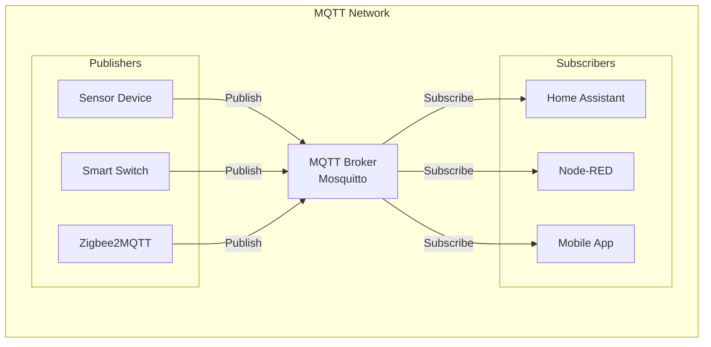

## Overview

**Mosquitto** is an open-source MQTT broker that implements the MQTT protocol versions 5.0, 3.1.1, and 3.1. It provides a lightweight method of carrying out messaging using a publish/subscribe model, making it ideal for IoT and home automation applications.

## What is MQTT?

**MQTT (Message Queuing Telemetry Transport)** is a lightweight, publish-subscribe network protocol that transports messages between devices. It's designed for connections with remote locations where a "small code footprint" is required or network bandwidth is limited.

### Key MQTT Concepts

- **Publisher**: Device that sends messages to topics
- **Subscriber**: Device that receives messages from topics
- **Topic**: Named channel for message routing
- **Broker**: Server that routes messages between publishers and subscribers
- **QoS (Quality of Service)**: Message delivery guarantee levels
- **Retained Messages**: Last message on a topic stored for new subscribers

### MQTT Architecture



## Prerequisites

### System Requirements

**Minimum Specifications:**

- **CPU**: 1 core, 512MHz (Raspberry Pi Zero compatible)
- **RAM**: 256MB (512MB+ recommended for high traffic)
- **Storage**: 100MB (more for persistence and logs)
- **Network**: Ethernet or WiFi connectivity

**Supported Platforms:**

- Linux (Ubuntu, Debian, Raspberry Pi OS)
- Windows
- macOS
- Docker containers
- Home Assistant Add-on

### Network Requirements

- **Port 1883**: Standard MQTT (unencrypted)
- **Port 8883**: MQTT over SSL/TLS (encrypted)
- **Port 9001**: MQTT over WebSockets (optional)

## Installation Methods

### Method 1: Docker Installation (Recommended)

#### Docker Compose Setup

Create directory structure:

```bash
mkdir -p ~/mosquitto/{config,data,logs}
cd ~/mosquitto
```

Create `docker-compose.yml`:

```yaml
version: '3.8'

services:
  mosquitto:
    container_name: mosquitto
    image: eclipse-mosquitto:latest
    restart: unless-stopped
    ports:
      - "1883:1883"
      - "9001:9001"  # WebSockets
      - "8883:8883"  # SSL/TLS
    volumes:
      - ./config:/mosquitto/config
      - ./data:/mosquitto/data
      - ./logs:/mosquitto/log
    networks:
      - mqtt_network

networks:
  mqtt_network:
    driver: bridge
```

Create basic configuration:

```bash
cat > config/mosquitto.conf << EOF
# Basic Mosquitto Configuration
persistence true
persistence_location /mosquitto/data/

# Logging
log_dest file /mosquitto/log/mosquitto.log
log_dest stdout
log_type error
log_type warning
log_type notice
log_type information

# Network settings
listener 1883
allow_anonymous true

# WebSocket support (optional)
listener 9001
protocol websockets
allow_anonymous true

# Connection limits
max_connections 1000
max_keepalive 65535
max_packet_size 100

# Message limits
message_size_limit 100
EOF
```

Start the service:

```bash
docker-compose up -d
```

### Method 2: Native Installation on Linux

#### Ubuntu/Debian Installation

```bash
# Update package list
sudo apt update

# Install Mosquitto and clients
sudo apt install -y mosquitto mosquitto-clients

# Enable and start service
sudo systemctl enable mosquitto
sudo systemctl start mosquitto

# Check status
sudo systemctl status mosquitto
```

#### Raspberry Pi Optimization

```bash
# Install on Raspberry Pi
sudo apt install -y mosquitto mosquitto-clients

# Optimize for Pi resources
sudo nano /etc/mosquitto/mosquitto.conf
```

Add Pi-specific optimizations:

```text
# Raspberry Pi optimizations
max_connections 100
max_keepalive 60
max_packet_size 50
message_size_limit 50

# Reduce log verbosity
log_type error
log_type warning
```

### Method 3: Home Assistant Add-on

1. Navigate to **Supervisor → Add-on Store**
2. Search for "Mosquitto broker"
3. Click **Install**
4. Configure authentication and options
5. Start the add-on

## Configuration

### Basic Configuration File

Default location: `/etc/mosquitto/mosquitto.conf`

```text
# =================================================================
# Mosquitto Configuration File
# =================================================================

# General settings
user mosquitto
max_keepalive 65535
max_connections 1000
max_packet_size 100

# Persistence settings
persistence true
persistence_location /var/lib/mosquitto/
autosave_interval 1800
autosave_on_changes false

# Logging configuration
log_dest file /var/log/mosquitto/mosquitto.log
log_dest syslog
log_type error
log_type warning
log_type notice
log_type information
connection_messages true

# Default listener
port 1883
max_connections 1000

# Security settings
allow_anonymous false
password_file /etc/mosquitto/passwd
acl_file /etc/mosquitto/acl

# WebSocket listener (optional)
listener 9001
protocol websockets
allow_anonymous false

# SSL/TLS listener (recommended for production)
listener 8883
cafile /etc/mosquitto/ca_certificates/ca.crt
certfile /etc/mosquitto/certs/server.crt
keyfile /etc/mosquitto/certs/server.key
require_certificate false
use_identity_as_username false
```

### Security Configuration

#### User Authentication

Create password file:

```bash
# Create password file
sudo mosquitto_passwd -c /etc/mosquitto/passwd admin

# Add additional users
sudo mosquitto_passwd /etc/mosquitto/passwd homeassistant
sudo mosquitto_passwd /etc/mosquitto/passwd zigbee2mqtt
sudo mosquitto_passwd /etc/mosquitto/passwd nodered

# Set proper permissions
sudo chown mosquitto:mosquitto /etc/mosquitto/passwd
sudo chmod 600 /etc/mosquitto/passwd
```

#### Access Control Lists (ACL)

Create ACL file `/etc/mosquitto/acl`:

```text
# Admin user - full access
user admin
topic readwrite #

# Home Assistant user
user homeassistant
topic readwrite homeassistant/#
topic readwrite zigbee2mqtt/#
topic readwrite tasmota/#
topic read $SYS/#

# Zigbee2MQTT user
user zigbee2mqtt
topic readwrite zigbee2mqtt/#
topic read homeassistant/status

# Node-RED user
user nodered
topic readwrite nodered/#
topic readwrite homeassistant/#
topic readwrite zigbee2mqtt/#

# Anonymous users (if enabled)
pattern read $SYS/broker/load/#
pattern read $SYS/broker/clients/connected
pattern read $SYS/broker/uptime
```

#### SSL/TLS Configuration

Generate certificates:

```bash
# Create certificate directory
sudo mkdir -p /etc/mosquitto/{ca_certificates,certs}

# Generate CA private key
sudo openssl genrsa -out /etc/mosquitto/ca_certificates/ca.key 2048

# Generate CA certificate
sudo openssl req -new -x509 -days 3650 -key /etc/mosquitto/ca_certificates/ca.key \
  -out /etc/mosquitto/ca_certificates/ca.crt \
  -subj "/C=US/ST=State/L=City/O=Organization/CN=Mosquitto CA"

# Generate server private key
sudo openssl genrsa -out /etc/mosquitto/certs/server.key 2048

# Generate server certificate signing request
sudo openssl req -new -key /etc/mosquitto/certs/server.key \
  -out /etc/mosquitto/certs/server.csr \
  -subj "/C=US/ST=State/L=City/O=Organization/CN=mqtt.local"

# Generate server certificate
sudo openssl x509 -req -in /etc/mosquitto/certs/server.csr \
  -CA /etc/mosquitto/ca_certificates/ca.crt \
  -CAkey /etc/mosquitto/ca_certificates/ca.key \
  -CAcreateserial -out /etc/mosquitto/certs/server.crt \
  -days 365

# Set permissions
sudo chown -R mosquitto:mosquitto /etc/mosquitto/ca_certificates
sudo chown -R mosquitto:mosquitto /etc/mosquitto/certs
sudo chmod 600 /etc/mosquitto/certs/server.key
```

Update configuration for SSL:

```text
# SSL/TLS Configuration
listener 8883
cafile /etc/mosquitto/ca_certificates/ca.crt
certfile /etc/mosquitto/certs/server.crt
keyfile /etc/mosquitto/certs/server.key
require_certificate false
use_identity_as_username false
tls_version tlsv1.2
```

### Advanced Configuration Options

#### Performance Tuning

```text
# High-performance settings
max_connections 10000
max_keepalive 65535
max_packet_size 268435456
message_size_limit 268435456

# Memory management
memory_limit 1073741824
max_queued_messages 1000

# Persistence optimization
autosave_interval 1800
autosave_on_changes false
persistence_file mosquitto.db

# Network optimization
max_inflight_messages 20
max_queued_messages 1000
upgrade_outgoing_qos false
```

#### Bridge Configuration

Connect to remote MQTT brokers:

```text
# Bridge to cloud MQTT service
connection bridge-to-cloud
address cloud-mqtt.example.com:8883
remote_username cloud_user
remote_password cloud_password
topic homeassistant/# out 1
topic commands/# in 1
bridge_cafile /etc/ssl/certs/ca-certificates.crt
bridge_insecure false
try_private false
start_type automatic
restart_timeout 30
```

#### WebSocket Configuration

```text
# WebSocket support for web clients
listener 9001
protocol websockets
allow_anonymous false
max_connections 100

# WebSocket with SSL
listener 9002
protocol websockets
cafile /etc/mosquitto/ca_certificates/ca.crt
certfile /etc/mosquitto/certs/server.crt
keyfile /etc/mosquitto/certs/server.key
allow_anonymous false
```

## Client Usage and Testing

### Command Line Tools

#### Publishing Messages

```bash
# Basic publish
mosquitto_pub -h localhost -t "test/topic" -m "Hello World"

# Publish with authentication
mosquitto_pub -h localhost -u admin -P password -t "home/sensor1" -m "temperature:22.5"

# Publish retained message
mosquitto_pub -h localhost -t "home/status" -m "online" -r

# Publish with QoS
mosquitto_pub -h localhost -t "important/data" -m "critical_value" -q 2

# Publish JSON data
mosquitto_pub -h localhost -t "sensor/data" -m '{"temperature": 22.5, "humidity": 65}'

# Publish to SSL/TLS broker
mosquitto_pub -h mqtt.local -p 8883 --cafile ca.crt -t "secure/topic" -m "encrypted message"
```

#### Subscribing to Messages

```bash
# Basic subscription
mosquitto_sub -h localhost -t "test/topic"

# Subscribe with authentication
mosquitto_sub -h localhost -u admin -P password -t "home/+"

# Subscribe to multiple topics
mosquitto_sub -h localhost -t "home/+/temperature" -t "home/+/humidity"

# Subscribe with wildcards
mosquitto_sub -h localhost -t "home/#"  # All topics under home/
mosquitto_sub -h localhost -t "+/sensor"  # Any device sensor topic

# Subscribe with QoS
mosquitto_sub -h localhost -t "important/data" -q 2

# Show system topics
mosquitto_sub -h localhost -t "\$SYS/#" -C 10

# Subscribe with output formatting
mosquitto_sub -h localhost -t "home/+" -F "@Y-@m-@d @H:@M:@S [%t] %p"
```

### System Monitoring Topics

Mosquitto publishes system information to `$SYS/` topics:

```bash
# Monitor broker statistics
mosquitto_sub -h localhost -t "\$SYS/broker/load/messages/received/1min"
mosquitto_sub -h localhost -t "\$SYS/broker/clients/connected"
mosquitto_sub -h localhost -t "\$SYS/broker/uptime"
mosquitto_sub -h localhost -t "\$SYS/broker/version"

# Memory usage
mosquitto_sub -h localhost -t "\$SYS/broker/heap/current"
mosquitto_sub -h localhost -t "\$SYS/broker/heap/maximum"

# Message statistics
mosquitto_sub -h localhost -t "\$SYS/broker/messages/stored"
mosquitto_sub -h localhost -t "\$SYS/broker/publish/messages/received"
mosquitto_sub -h localhost -t "\$SYS/broker/publish/messages/sent"
```

## Monitoring and Management

### Log Analysis

#### Log Locations

- **Docker**: Container logs via `docker logs mosquitto`
- **Native Linux**: `/var/log/mosquitto/mosquitto.log`
- **Systemd**: `journalctl -u mosquitto -f`

#### Log Levels and Types

```text
# Configure logging detail
log_type error      # Error messages only
log_type warning    # Warning and error messages
log_type notice     # Notice, warning, and error messages
log_type information # All message types
log_type debug      # Debug information (verbose)

# Log specific events
connection_messages true    # Log client connections
log_timestamp true         # Include timestamps
```

#### Common Log Patterns

```bash
# Monitor connections
tail -f /var/log/mosquitto/mosquitto.log | grep "New connection"

# Monitor authentication failures
tail -f /var/log/mosquitto/mosquitto.log | grep "authentication failure"

# Monitor memory usage
tail -f /var/log/mosquitto/mosquitto.log | grep "memory"

# Monitor subscription patterns
tail -f /var/log/mosquitto/mosquitto.log | grep "SUBSCRIBE"
```

### Performance Monitoring

#### Real-time Statistics

```bash
# Create monitoring script
cat > monitor_mqtt.sh << 'EOF'
#!/bin/bash
echo "=== MQTT Broker Statistics ==="
echo "Connected Clients: $(mosquitto_sub -h localhost -t '$SYS/broker/clients/connected' -C 1)"
echo "Total Clients: $(mosquitto_sub -h localhost -t '$SYS/broker/clients/total' -C 1)"
echo "Messages Stored: $(mosquitto_sub -h localhost -t '$SYS/broker/messages/stored' -C 1)"
echo "Uptime: $(mosquitto_sub -h localhost -t '$SYS/broker/uptime' -C 1)"
echo "Load 1min: $(mosquitto_sub -h localhost -t '$SYS/broker/load/messages/received/1min' -C 1)"
echo "Load 5min: $(mosquitto_sub -h localhost -t '$SYS/broker/load/messages/received/5min' -C 1)"
echo "Memory Current: $(mosquitto_sub -h localhost -t '$SYS/broker/heap/current' -C 1)"
echo "Memory Maximum: $(mosquitto_sub -h localhost -t '$SYS/broker/heap/maximum' -C 1)"
EOF

chmod +x monitor_mqtt.sh
./monitor_mqtt.sh
```

#### Prometheus Integration

```yaml
# mosquitto_exporter configuration
version: '3.8'

services:
  mosquitto-exporter:
    image: sapcc/mosquitto-exporter
    ports:
      - "9234:9234"
    environment:
      - BROKER_ENDPOINT=tcp://mosquitto:1883
    depends_on:
      - mosquitto
```

### Backup and Recovery

#### Configuration Backup

```bash
#!/bin/bash
# backup-mosquitto.sh

BACKUP_DIR="/home/pi/backups/mosquitto"
DATE=$(date +%Y%m%d_%H%M%S)
BACKUP_PATH="$BACKUP_DIR/$DATE"

# Create backup directory
mkdir -p "$BACKUP_PATH"

# Stop Mosquitto
sudo systemctl stop mosquitto

# Backup configuration files
cp /etc/mosquitto/mosquitto.conf "$BACKUP_PATH/"
cp -r /etc/mosquitto/conf.d "$BACKUP_PATH/" 2>/dev/null || true
cp /etc/mosquitto/passwd "$BACKUP_PATH/" 2>/dev/null || true
cp /etc/mosquitto/acl "$BACKUP_PATH/" 2>/dev/null || true

# Backup certificates
cp -r /etc/mosquitto/ca_certificates "$BACKUP_PATH/" 2>/dev/null || true
cp -r /etc/mosquitto/certs "$BACKUP_PATH/" 2>/dev/null || true

# Backup persistence data
cp -r /var/lib/mosquitto "$BACKUP_PATH/" 2>/dev/null || true

# Start Mosquitto
sudo systemctl start mosquitto

# Compress backup
tar -czf "$BACKUP_PATH.tar.gz" -C "$BACKUP_DIR" "$DATE"
rm -rf "$BACKUP_PATH"

# Keep only last 30 backups
find "$BACKUP_DIR" -name "*.tar.gz" -mtime +30 -delete

echo "Backup completed: $BACKUP_PATH.tar.gz"
```

#### Docker Backup

```bash
# Backup Docker volumes
docker run --rm -v mosquitto_config:/source -v $(pwd):/backup alpine \
  tar czf /backup/mosquitto-config-$(date +%Y%m%d).tar.gz -C /source .

docker run --rm -v mosquitto_data:/source -v $(pwd):/backup alpine \
  tar czf /backup/mosquitto-data-$(date +%Y%m%d).tar.gz -C /source .
```

## Troubleshooting

### Common Issues

#### Connection Problems

**Check Service Status:**

```bash
# Check if Mosquitto is running
sudo systemctl status mosquitto

# Check listening ports
sudo netstat -tlnp | grep 1883
sudo ss -tlnp | grep 1883

# Test local connection
mosquitto_sub -h localhost -t '$SYS/broker/uptime' -C 1
```

**Authentication Issues:**

```bash
# Test with credentials
mosquitto_pub -h localhost -u admin -P password -t "test" -m "hello"

# Check password file
sudo mosquitto_passwd -U /etc/mosquitto/passwd

# Verify ACL permissions
tail -f /var/log/mosquitto/mosquitto.log | grep "denied"
```

#### Performance Issues

**High Memory Usage:**

```text
# Optimize configuration
max_queued_messages 100
message_size_limit 1048576
max_packet_size 1048576
autosave_interval 3600
```

**Connection Limits:**

```bash
# Check current connections
mosquitto_sub -h localhost -t '$SYS/broker/clients/connected' -C 1

# Monitor connection patterns
tail -f /var/log/mosquitto/mosquitto.log | grep -E "(New connection|Client.*disconnected)"
```

#### SSL/TLS Issues

```bash
# Test SSL connection
mosquitto_sub -h mqtt.local -p 8883 --cafile ca.crt -t '$SYS/broker/uptime' -C 1

# Debug SSL handshake
openssl s_client -connect mqtt.local:8883 -CAfile ca.crt

# Check certificate validity
openssl x509 -in /etc/mosquitto/certs/server.crt -text -noout
```

### Diagnostic Commands

```bash
# Comprehensive health check
echo "=== Mosquitto Health Check ==="

echo "Service Status:"
sudo systemctl is-active mosquitto

echo "Process Information:"
ps aux | grep mosquitto

echo "Port Status:"
sudo netstat -tlnp | grep mosquitto

echo "Configuration Test:"
mosquitto -c /etc/mosquitto/mosquitto.conf -v

echo "Connection Test:"
timeout 5 mosquitto_sub -h localhost -t '$SYS/broker/uptime' -C 1

echo "Log Errors (last 10):"
sudo tail -n 10 /var/log/mosquitto/mosquitto.log | grep -i error
```

## Integration Examples

### Home Assistant Integration

**configuration.yaml:**

```yaml
mqtt:
  broker: localhost
  port: 1883
  username: homeassistant
  password: !secret mqtt_password
  discovery: true
  discovery_prefix: homeassistant
  birth_message:
    topic: "homeassistant/status"
    payload: "online"
  will_message:
    topic: "homeassistant/status"
    payload: "offline"
```

### Node-RED Integration

**MQTT Node Configuration:**

```json
{
  "id": "mqtt-broker",
  "type": "mqtt-broker",
  "name": "Local Mosquitto",
  "broker": "localhost",
  "port": "1883",
  "clientid": "nodered",
  "usetls": false,
  "username": "nodered",
  "password": "password",
  "keepalive": "60",
  "cleansession": true
}
```

### Python Client Example

```python
import paho.mqtt.client as mqtt
import json
import time

class MQTTClient:
    def __init__(self, broker_host, broker_port=1883, username=None, password=None):
        self.client = mqtt.Client()
        self.broker_host = broker_host
        self.broker_port = broker_port
        
        if username and password:
            self.client.username_pw_set(username, password)
        
        self.client.on_connect = self.on_connect
        self.client.on_message = self.on_message
        self.client.on_disconnect = self.on_disconnect
    
    def on_connect(self, client, userdata, flags, rc):
        if rc == 0:
            print(f"Connected to MQTT broker")
            # Subscribe to topics
            client.subscribe("home/+/sensor")
            client.subscribe("$SYS/broker/uptime")
        else:
            print(f"Failed to connect, return code {rc}")
    
    def on_message(self, client, userdata, msg):
        topic = msg.topic
        payload = msg.payload.decode()
        print(f"Received message on {topic}: {payload}")
        
        # Process JSON messages
        try:
            data = json.loads(payload)
            self.process_sensor_data(topic, data)
        except json.JSONDecodeError:
            print(f"Non-JSON message: {payload}")
    
    def on_disconnect(self, client, userdata, rc):
        print(f"Disconnected from MQTT broker")
    
    def process_sensor_data(self, topic, data):
        # Process sensor data
        if "temperature" in data:
            temp = data["temperature"]
            print(f"Temperature reading: {temp}°C")
    
    def publish_message(self, topic, payload, qos=0, retain=False):
        result = self.client.publish(topic, payload, qos, retain)
        if result.rc == mqtt.MQTT_ERR_SUCCESS:
            print(f"Message published to {topic}")
        else:
            print(f"Failed to publish message to {topic}")
    
    def connect(self):
        try:
            self.client.connect(self.broker_host, self.broker_port, 60)
            self.client.loop_start()
        except Exception as e:
            print(f"Connection error: {e}")
    
    def disconnect(self):
        self.client.loop_stop()
        self.client.disconnect()

# Usage example
if __name__ == "__main__":
    mqtt_client = MQTTClient("localhost", username="python_client", password="password")
    mqtt_client.connect()
    
    # Publish some test data
    sensor_data = {
        "temperature": 22.5,
        "humidity": 65.0,
        "timestamp": int(time.time())
    }
    
    mqtt_client.publish_message("home/livingroom/sensor", json.dumps(sensor_data))
    
    # Keep running
    try:
        while True:
            time.sleep(1)
    except KeyboardInterrupt:
        mqtt_client.disconnect()
```

## Security Best Practices

### Network Security

**Firewall Configuration:**

```bash
# Allow MQTT ports
sudo ufw allow 1883/tcp  # Standard MQTT
sudo ufw allow 8883/tcp  # MQTT over SSL/TLS
sudo ufw allow 9001/tcp  # WebSockets (if needed)

# Restrict to specific networks
sudo ufw allow from 192.168.1.0/24 to any port 1883
sudo ufw deny 1883
```

**Network Isolation:**

```text
# Bind to specific interface
bind_address 192.168.1.100

# Disable anonymous access
allow_anonymous false

# Require authentication
password_file /etc/mosquitto/passwd
acl_file /etc/mosquitto/acl
```

### Access Control Best Practices

**Principle of Least Privilege:**

```text
# Example ACL with minimal permissions
user sensor_device
topic write sensors/device1/#
topic read commands/device1

user automation_system
topic readwrite homeassistant/#
topic read sensors/#

user admin
topic readwrite #
```

**Password Security:**

```bash
# Use strong passwords
mosquitto_passwd /etc/mosquitto/passwd user1

# Regular password rotation
crontab -e
# Add: 0 2 1 * * /usr/local/bin/rotate_mqtt_passwords.sh
```

## Performance Optimization

### High-Traffic Configurations

```text
# High-performance settings
max_connections 50000
max_keepalive 3600
max_packet_size 268435456
message_size_limit 268435456

# Memory optimization
memory_limit 2147483648
max_queued_messages 10000
max_inflight_messages 100

# Persistence tuning
autosave_interval 3600
autosave_on_changes false
persistence_file mosquitto.db

# Network tuning
upgrade_outgoing_qos false
max_queued_messages 10000
```

### Load Balancing

**Multiple Broker Setup:**

```text
# Bridge configuration for load balancing
connection broker2
address broker2.local:1883
topic # both 0 local_prefix remote/ local_suffix /broker1
```

**Clustering with External Load Balancer:**

```yaml
# HAProxy configuration for MQTT
backend mqtt_servers
    mode tcp
    balance roundrobin
    server mqtt1 192.168.1.10:1883 check
    server mqtt2 192.168.1.11:1883 check
    server mqtt3 192.168.1.12:1883 check
```

## Maintenance and Updates

### Regular Maintenance Tasks

```bash
#!/bin/bash
# maintenance-mosquitto.sh

echo "=== Mosquitto Maintenance ==="

# Check disk space
echo "Disk usage:"
df -h /var/lib/mosquitto
df -h /var/log/mosquitto

# Rotate logs
sudo logrotate /etc/logrotate.d/mosquitto

# Clean old retained messages
mosquitto_sub -h localhost -t '#' -R | grep "old_device" | \
while read topic; do
    mosquitto_pub -h localhost -t "$topic" -n -r
done

# Backup configuration
sudo cp /etc/mosquitto/mosquitto.conf /etc/mosquitto/mosquitto.conf.backup.$(date +%Y%m%d)

# Update package
sudo apt update && sudo apt upgrade mosquitto

# Restart service
sudo systemctl restart mosquitto

# Verify operation
sleep 5
mosquitto_sub -h localhost -t '$SYS/broker/uptime' -C 1

echo "Maintenance completed"
```

### Update Procedures

```bash
# Update Mosquitto package
sudo apt update
sudo apt upgrade mosquitto

# Backup configuration before updates
sudo cp -r /etc/mosquitto /etc/mosquitto.backup.$(date +%Y%m%d)

# Test configuration after update
mosquitto -c /etc/mosquitto/mosquitto.conf -v

# Monitor logs after restart
sudo systemctl restart mosquitto
sudo journalctl -u mosquitto -f
```

This comprehensive Mosquitto MQTT documentation provides complete coverage of installation, configuration, monitoring, troubleshooting, and maintenance for both standalone and integrated home automation environments.
