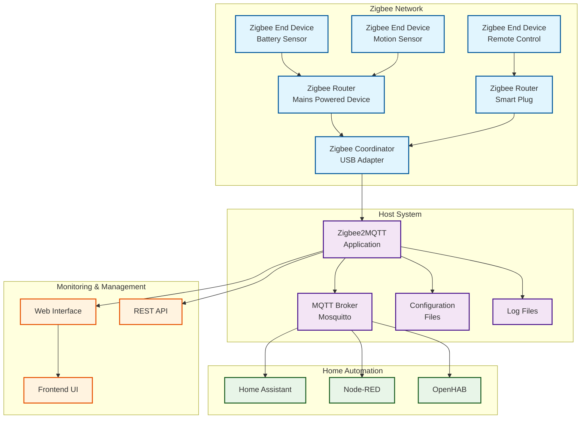

## Overview

**Zigbee2MQTT** is a powerful bridge that allows you to use your Zigbee devices without the vendor's bridge or gateway. It bridges events and allows you to control your Zigbee devices via MQTT, making them compatible with any smart home solution that supports MQTT, including Home Assistant, OpenHAB, and Node-RED.

## What is Zigbee2MQTT?

Zigbee2MQTT is an open-source project that:

- **Eliminates vendor lock-in** by removing the need for proprietary hubs
- **Provides local control** without cloud dependencies
- **Supports 2000+ devices** from various manufacturers
- **Enables advanced features** not available in vendor apps
- **Offers extensive customization** through configuration files
- **Provides detailed logging** for troubleshooting

### Key Benefits

- **Cost-effective**: Single adapter supports multiple device brands
- **Privacy-focused**: All communication stays local
- **Flexible**: Works with any MQTT-compatible automation platform
- **Feature-rich**: Exposes all device capabilities
- **Community-driven**: Extensive device support and documentation

## Architecture Overview



## Prerequisites

### Hardware Requirements

#### Zigbee Coordinator (Required)

**Recommended Adapters:**

- **SONOFF Zigbee 3.0 USB Dongle Plus** (CC2652P)
  - Excellent range and stability
  - Pre-flashed with recommended firmware
  - USB-A connector with extension cable

- **ConBee II** (deCONZ)
  - Stable and reliable
  - Good Home Assistant integration
  - USB stick form factor

- **CC2531 with CC2591** (Budget option)
  - Requires firmware flashing
  - Limited device capacity (20-30 devices)
  - Good for testing/small setups

**Adapter Specifications:**

```text
Recommended: CC2652P/CC2652R based adapters
- Support for Zigbee 3.0
- 50+ direct children
- Thread support (future-proof)

```

#### Host System Requirements

**Minimum Specifications:**

- **CPU**: 1 core, 1GHz (Raspberry Pi 3+ recommended)
- **RAM**: 512MB (1GB+ recommended)
- **Storage**: 2GB free space (SD card class 10+ for Pi)
- **Network**: Ethernet preferred for reliability
- **USB**: Available USB port for Zigbee adapter

**Supported Platforms:**

- Raspberry Pi (Recommended)
- Intel NUC / Mini PC
- Docker containers
- Virtual machines
- Home Assistant Add-on

### Software Requirements

- **Operating System**: Linux (Raspberry Pi OS, Ubuntu, Debian)
- **Node.js**: Version 16+ (18 LTS recommended)
- **MQTT Broker**: [Mosquitto](../mosquitto/index.md) (see dedicated setup guide)
- **Git**: For installation and updates

## Installation Methods

### Method 1: Docker Installation (Recommended)

#### Docker Compose Setup

Create directory structure:

```bash
mkdir -p ~/zigbee2mqtt/data
cd ~/zigbee2mqtt

```

Create `docker-compose.yml`:

```yaml
version: '3.8'

services:
  zigbee2mqtt:
    container_name: zigbee2mqtt
    image: koenkk/zigbee2mqtt:latest
    restart: unless-stopped
    volumes:
      - ./data:/app/data
      - /run/udev:/run/udev:ro
    ports:
      - "8080:8080"  # Web interface
    environment:
      - TZ=America/New_York  # Set your timezone
    devices:
      - /dev/ttyUSB0:/dev/ttyUSB0  # Adjust to your adapter
    networks:
      - zigbee2mqtt

  mosquitto:
    container_name: mosquitto
    image: eclipse-mosquitto:latest
    restart: unless-stopped
    ports:
      - "1883:1883"
      - "9001:9001"
    volumes:
      - ./mosquitto/config:/mosquitto/config
      - ./mosquitto/data:/mosquitto/data
      - ./mosquitto/logs:/mosquitto/log
    networks:
      - zigbee2mqtt

networks:
  zigbee2mqtt:
    driver: bridge

```

Start services:

```bash
docker-compose up -d

```

### Method 2: Native Installation on Raspberry Pi

#### Install Dependencies

```bash
# Update system
sudo apt update && sudo apt upgrade -y

# Install Node.js 18 LTS
curl -fsSL https://deb.nodesource.com/setup_18.x | sudo -E bash -
sudo apt-get install -y nodejs

# Install Git and build tools
sudo apt-get install -y git build-essential

# Verify installation
node --version
npm --version

```

#### Install Zigbee2MQTT

```bash
# Create user and directory
sudo useradd -r -s /bin/false zigbee2mqtt
sudo mkdir -p /opt/zigbee2mqtt
sudo chown -R zigbee2mqtt:zigbee2mqtt /opt/zigbee2mqtt

# Clone repository
sudo -u zigbee2mqtt git clone https://github.com/Koenkk/zigbee2mqtt.git /opt/zigbee2mqtt

# Install dependencies
cd /opt/zigbee2mqtt
sudo -u zigbee2mqtt npm ci

# Create systemd service
sudo nano /etc/systemd/system/zigbee2mqtt.service

```

Systemd service file:

```ini
[Unit]
Description=zigbee2mqtt
After=network.target

[Service]
ExecStart=/usr/bin/node index.js
WorkingDirectory=/opt/zigbee2mqtt
StandardOutput=inherit
StandardError=inherit
Restart=always
RestartSec=10s
User=zigbee2mqtt
Environment=NODE_ENV=production

[Install]
WantedBy=multi-user.target

```

Enable and start service:

```bash
sudo systemctl daemon-reload
sudo systemctl enable zigbee2mqtt
sudo systemctl start zigbee2mqtt

```

### Method 3: Home Assistant Add-on

1. Navigate to **Supervisor → Add-on Store**
2. Search for "Zigbee2MQTT"
3. Click **Install**
4. Configure via the add-on configuration tab
5. Start the add-on

## Configuration

> **Prerequisites**: Ensure you have a working MQTT broker before configuring Zigbee2MQTT. See the [Mosquitto MQTT Setup Guide](../mosquitto/index.md) for detailed installation and configuration instructions.

### Basic Configuration File

Create or edit `data/configuration.yaml`:

```yaml
# Home Assistant integration (MQTT discovery)
homeassistant: true

# Allow new devices to join
permit_join: false

# MQTT settings
mqtt:
  base_topic: zigbee2mqtt
  server: mqtt://localhost:1883
  # user: mqtt_user
  # password: mqtt_password
  # client_id: zigbee2mqtt
  # keepalive: 60
  # clean: true
  # ca: /etc/ssl/mqtt-ca.crt
  # key: /etc/ssl/mqtt-client.key
  # cert: /etc/ssl/mqtt-client.crt

# Serial settings
serial:
  port: /dev/ttyUSB0
  # adapter: zstack  # Options: zstack, deconz, zigate, ezsp
  # baudrate: 115200

# Network settings
advanced:
  # Zigbee channel (11-26)
  channel: 11
  
  # Pan ID (should be unique in your environment)
  pan_id: 0x1a62
  
  # Extended Pan ID
  ext_pan_id: [0xDD, 0xDD, 0xDD, 0xDD, 0xDD, 0xDD, 0xDD, 0xDD]
  
  # Network key (change for security)
  network_key: [1, 3, 5, 7, 9, 11, 13, 15, 0, 2, 4, 6, 8, 10, 12, 13]
  
  # Security
  security_key: [0x01, 0x02, 0x03, 0x04, 0x05, 0x06, 0x07, 0x08, 0x09, 0x0A, 0x0B, 0x0C, 0x0D, 0x0E, 0x0F, 0x10]

# Frontend settings
frontend:
  port: 8080
  host: 0.0.0.0
  # auth_token: your_secret_token

# Logging
advanced:
  log_level: info  # Options: error, warn, info, debug
  log_output: ['console', 'file']
  log_directory: data/log/%TIMESTAMP%
  log_file: log.txt

# Device-specific settings
device_options:
  # Global options for all devices
  retain: false
  qos: 0
  
  # Device-specific options
  '0x00158d0001abcdef':
    friendly_name: 'living_room_sensor'
    retain: true
    qos: 1

# Groups
groups:
  '1':
    friendly_name: living_room_lights
    retain: false
    devices:
      - 0x00158d0001abcdef
      - 0x00158d0001fedcba

# Availability
availability:
  active:
    timeout: 10
  passive:
    timeout: 1500

# OTA updates
ota:
  update_check_interval: 1440  # Check every 24 hours
  disable_automatic_update_check: false

```

### Advanced Configuration Options

#### Security Settings

```yaml
advanced:
  # Network security
  network_key: GENERATE  # Auto-generate secure key
  
  # Disable joining by default
  permit_join: false
  
  # Enable security for new devices
  security_key: GENERATE

```

#### Performance Tuning

```yaml
advanced:
  # Transmission power (0-20 dBm)
  transmit_power: 20
  
  # Adapter delay
  adapter_delay: 0
  
  # Availability timeout
  availability_timeout: 0
  
  # Last seen precision
  last_seen: 'ISO_8601_local'

```

#### MQTT Optimization

```yaml
mqtt:
  # Quality of Service
  qos: 1
  
  # Retain messages
  retain: true
  
  # Connection options
  keepalive: 30
  clean: true
  reconnect_period: 5000
  connect_timeout: 30000

```

## Device Management

### Pairing Devices

#### Enable Pairing Mode

**Via Web Interface:**

1. Open http://[host-ip]:8080
2. Click "Permit Join" button
3. Set timer (default 5 minutes)

**Via MQTT:**

```bash
# Enable pairing for 60 seconds
mosquitto_pub -h localhost -t "zigbee2mqtt/bridge/request/permit_join" -m '{"value": true, "time": 60}'

# Disable pairing
mosquitto_pub -h localhost -t "zigbee2mqtt/bridge/request/permit_join" -m '{"value": false}'

```

**Via Configuration:**

```yaml
permit_join: true  # Restart Z2M to enable

```

#### Pairing Process

1. **Enable pairing mode** (methods above)
2. **Put device in pairing mode**:
   - Press reset button (varies by device)
   - Hold power button for 5-10 seconds
   - Refer to device manual for specific instructions
3. **Monitor logs** for successful pairing
4. **Disable pairing mode** when complete

#### Common Pairing Issues

**Device Not Found:**

```bash
# Check if adapter is detected
ls -la /dev/ttyUSB*
ls -la /dev/ttyACM*

# Verify coordinator is working
mosquitto_sub -h localhost -t "zigbee2mqtt/bridge/info"

```

**Pairing Timeout:**

- Move device closer to coordinator
- Check battery level
- Reset device and try again
- Check Zigbee channel interference

### Device Configuration

#### Renaming Devices

**Via Web Interface:**

1. Go to Devices tab
2. Click on device
3. Change "Friendly Name"
4. Save changes

**Via MQTT:**

```bash
mosquitto_pub -h localhost -t "zigbee2mqtt/bridge/request/device/rename" \
  -m '{"from": "0x00158d0001abcdef", "to": "living_room_sensor"}'

```

#### Device-Specific Settings

```yaml
device_options:
  living_room_sensor:
    # Reporting intervals (seconds)
    temperature_reporting_interval: 300
    humidity_reporting_interval: 300
    
    # Calibration
    temperature_calibration: -2.0
    humidity_calibration: 5.0
    
    # MQTT settings
    retain: true
    qos: 1
    
    # Availability
    availability: true

```

#### Removing Devices

**Via Web Interface:**

1. Select device in Devices tab
2. Click "Remove" button
3. Confirm removal

**Via MQTT:**

```bash
mosquitto_pub -h localhost -t "zigbee2mqtt/bridge/request/device/remove" \
  -m '{"id": "living_room_sensor"}'

```

## Groups and Scenes

### Creating Groups

#### Via Configuration File

```yaml
groups:
  '1':
    friendly_name: living_room_lights
    retain: false
    optimistic: true
    devices:
      - ceiling_light_1
      - ceiling_light_2
      - table_lamp
  
  '2':
    friendly_name: bedroom_lights
    devices:
      - bedside_lamp_left
      - bedside_lamp_right
      - ceiling_fan_light

```

#### Via MQTT

```bash
# Create group
mosquitto_pub -h localhost -t "zigbee2mqtt/bridge/request/group/add" \
  -m '{"friendly_name": "kitchen_lights"}'

# Add device to group
mosquitto_pub -h localhost -t "zigbee2mqtt/bridge/request/group/members/add" \
  -m '{"group": "kitchen_lights", "device": "kitchen_ceiling"}'

```

### Controlling Groups

```bash
# Turn on all lights in group
mosquitto_pub -h localhost -t "zigbee2mqtt/living_room_lights/set" \
  -m '{"state": "ON"}'

# Set brightness for group
mosquitto_pub -h localhost -t "zigbee2mqtt/living_room_lights/set" \
  -m '{"state": "ON", "brightness": 150}'

# Set color for group
mosquitto_pub -h localhost -t "zigbee2mqtt/living_room_lights/set" \
  -m '{"state": "ON", "color": {"hex": "#FF0000"}}'

```

## Monitoring and Maintenance

### Logging Configuration

#### Log Levels

```yaml
advanced:
  log_level: info  # error, warn, info, debug
  log_output: ['console', 'file']
  log_directory: data/log/%TIMESTAMP%
  log_file: log.txt
  log_rotation: true
  log_symlink_current: true

```

#### Real-time Monitoring

```bash
# Monitor logs in real-time
tail -f /opt/zigbee2mqtt/data/log/log.txt

# Docker logs
docker logs -f zigbee2mqtt

# Systemd logs
journalctl -u zigbee2mqtt -f

```

### Network Map and Topology

#### Generate Network Map

**Via Web Interface:**

1. Open Network Map tab
2. Click "Refresh" to update
3. View device connections and link quality

**Via MQTT:**

```bash
# Request network map
mosquitto_pub -h localhost -t "zigbee2mqtt/bridge/request/networkmap" -m '{"type": "raw"}'

# Subscribe to response
mosquitto_sub -h localhost -t "zigbee2mqtt/bridge/response/networkmap"

```

#### Network Health Monitoring

```bash
# Check coordinator info
mosquitto_sub -h localhost -t "zigbee2mqtt/bridge/info"

# Monitor device availability
mosquitto_sub -h localhost -t "zigbee2mqtt/+/availability"

# Check link quality
mosquitto_sub -h localhost -t "zigbee2mqtt/bridge/logging"

```

### Performance Optimization

#### Channel Selection

```bash
# Scan for optimal channel
mosquitto_pub -h localhost -t "zigbee2mqtt/bridge/request/health_check" -m '{}'

# Check WiFi interference
sudo iwlist scan | grep -E "Channel|ESSID"

# Recommended channels to avoid WiFi interference:
# WiFi Channel 1 (2412 MHz) → Use Zigbee Channel 15-20
# WiFi Channel 6 (2437 MHz) → Use Zigbee Channel 20-25  
# WiFi Channel 11 (2462 MHz) → Use Zigbee Channel 25-26

```

#### Network Optimization

```yaml
advanced:
  # Transmission power (increase range)
  transmit_power: 20
  
  # Reduce reporting intervals for battery devices
  reporting_interval: 300
  
  # Optimize group commands
  group_optimistic: true
  
  # Cache configuration
  cache_state: true
  cache_state_persistent: true

```

### Backup and Recovery

#### Configuration Backup

```bash
# Create backup directory
mkdir -p ~/zigbee2mqtt-backup/$(date +%Y%m%d)

# Backup configuration and database
cp /opt/zigbee2mqtt/data/configuration.yaml ~/zigbee2mqtt-backup/$(date +%Y%m%d)/
cp /opt/zigbee2mqtt/data/database.db ~/zigbee2mqtt-backup/$(date +%Y%m%d)/
cp /opt/zigbee2mqtt/data/coordinator_backup.json ~/zigbee2mqtt-backup/$(date +%Y%m%d)/

# Docker backup
docker exec zigbee2mqtt cp /app/data/configuration.yaml /tmp/
docker cp zigbee2mqtt:/tmp/configuration.yaml ~/zigbee2mqtt-backup/$(date +%Y%m%d)/

```

#### Automated Backup Script

```bash
#!/bin/bash
# backup-zigbee2mqtt.sh

BACKUP_DIR="/home/pi/backups/zigbee2mqtt"
DATE=$(date +%Y%m%d_%H%M%S)
BACKUP_PATH="$BACKUP_DIR/$DATE"

# Create backup directory
mkdir -p "$BACKUP_PATH"

# Stop Zigbee2MQTT
sudo systemctl stop zigbee2mqtt

# Copy files
cp /opt/zigbee2mqtt/data/configuration.yaml "$BACKUP_PATH/"
cp /opt/zigbee2mqtt/data/database.db "$BACKUP_PATH/"
cp /opt/zigbee2mqtt/data/coordinator_backup.json "$BACKUP_PATH/"

# Start Zigbee2MQTT
sudo systemctl start zigbee2mqtt

# Compress backup
tar -czf "$BACKUP_PATH.tar.gz" -C "$BACKUP_DIR" "$DATE"
rm -rf "$BACKUP_PATH"

# Keep only last 30 backups
find "$BACKUP_DIR" -name "*.tar.gz" -mtime +30 -delete

echo "Backup completed: $BACKUP_PATH.tar.gz"

```

Schedule with cron:

```bash
# Edit crontab
crontab -e

# Add daily backup at 2 AM
0 2 * * * /home/pi/scripts/backup-zigbee2mqtt.sh

```

## Troubleshooting

### Common Issues

#### Coordinator Not Found

**Check USB Device:**

```bash
# List USB devices
lsusb

# Check serial devices
ls -la /dev/ttyUSB* /dev/ttyACM*

# Check device permissions
ls -la /dev/ttyUSB0

```

**Fix Permissions:**

```bash
# Add user to dialout group
sudo usermod -a -G dialout $USER

# Set device permissions
sudo chmod 666 /dev/ttyUSB0

# For Docker, ensure device mapping is correct

```

#### Devices Not Responding

**Check Network Map:**

1. Verify device appears in network map
2. Check link quality (LQI should be >50)
3. Ensure adequate router devices

**MQTT Diagnostics:**

```bash
# Check device status
mosquitto_sub -h localhost -t "zigbee2mqtt/device_name/availability"

# Ping device
mosquitto_pub -h localhost -t "zigbee2mqtt/bridge/request/device/ping" \
  -m '{"id": "device_name"}'

```

#### High CPU Usage

**Optimize Configuration:**

```yaml
advanced:
  # Reduce log level
  log_level: warn
  
  # Increase reporting intervals
  reporting:
    enabled: true
    interval: 60
  
  # Disable unnecessary features
  legacy: false

```

#### Database Corruption

**Reset Database:**

```bash
# Stop Zigbee2MQTT
sudo systemctl stop zigbee2mqtt

# Backup current database
cp /opt/zigbee2mqtt/data/database.db /opt/zigbee2mqtt/data/database.db.backup

# Remove database (devices will need re-pairing)
rm /opt/zigbee2mqtt/data/database.db

# Start Zigbee2MQTT
sudo systemctl start zigbee2mqtt

```

### Diagnostic Commands

#### System Diagnostics

```bash
# Check system resources
htop
df -h
free -h

# Check network connectivity
ping google.com
nslookup google.com

# Check MQTT broker (see Mosquitto guide for detailed MQTT diagnostics)
mosquitto_sub -h localhost -t "\$SYS/#" -C 5

```

#### Zigbee2MQTT Diagnostics

```bash
# Health check
mosquitto_pub -h localhost -t "zigbee2mqtt/bridge/request/health_check" -m '{}'

# Get bridge info
mosquitto_sub -h localhost -t "zigbee2mqtt/bridge/info" -C 1

# List all devices
mosquitto_sub -h localhost -t "zigbee2mqtt/bridge/devices" -C 1

# Check log level
mosquitto_pub -h localhost -t "zigbee2mqtt/bridge/request/config/log_level" -m '{"level": "debug"}'

```

### Recovery Procedures

#### Coordinator Recovery

**Reset Coordinator:**

```bash
# Stop Zigbee2MQTT
sudo systemctl stop zigbee2mqtt

# Remove coordinator backup
rm /opt/zigbee2mqtt/data/coordinator_backup.json

# Clear database
rm /opt/zigbee2mqtt/data/database.db

# Start with fresh network
# Edit configuration.yaml and change:
# - pan_id
# - network_key
# - ext_pan_id

sudo systemctl start zigbee2mqtt

```

#### Device Recovery

**Force Remove Device:**

```bash
# Remove from database
mosquitto_pub -h localhost -t "zigbee2mqtt/bridge/request/device/remove" \
  -m '{"id": "device_name", "force": true}'

# Reset device (refer to device manual)
# Re-pair device

```

## Integration with Home Assistant

### MQTT Discovery

**Enable in Configuration:**

```yaml
homeassistant: true

mqtt:
  base_topic: zigbee2mqtt
  server: mqtt://homeassistant.local:1883
  user: homeassistant
  password: your_password

```

### Home Assistant Configuration

**configuration.yaml:**

```yaml
mqtt:
  broker: localhost
  port: 1883
  username: homeassistant
  password: your_password
  discovery: true
  discovery_prefix: homeassistant

# Optional: Zigbee2MQTT Panel
panel_iframe:
  zigbee2mqtt:
    title: Zigbee2MQTT
    icon: mdi:zigbee
    url: http://192.168.1.100:8080

```

### Device Automation Examples

#### Motion Sensor Automation

```yaml
# automations.yaml
- id: motion_lights
  alias: "Motion Activated Lights"
  trigger:
    - platform: state
      entity_id: binary_sensor.motion_sensor_occupancy
      to: 'on'
  condition:
    - condition: sun
      after: sunset
  action:
    - service: light.turn_on
      entity_id: light.living_room_lights
      data:
        brightness: 150
        color_temp: 350

```

#### Temperature Monitoring

```yaml
- id: temperature_alert
  alias: "High Temperature Alert"
  trigger:
    - platform: numeric_state
      entity_id: sensor.temperature_sensor_temperature
      above: 25
  action:
    - service: notify.mobile_app
      data:
        message: "Temperature is {{ states('sensor.temperature_sensor_temperature') }}°C"
        title: "High Temperature Alert"

```

## Security Best Practices

### Network Security

```yaml
advanced:
  # Generate secure keys
  network_key: GENERATE
  security_key: GENERATE
  
  # Use unique PAN ID
  pan_id: GENERATE
  
  # Disable permit join by default
permit_join: false

```

### Access Control

```yaml
# MQTT authentication
mqtt:
  user: zigbee2mqtt_user
  password: strong_random_password

# Frontend authentication
frontend:
  auth_token: very_long_random_token
  
# Bind to localhost only (use reverse proxy)
frontend:
  host: 127.0.0.1

```

### Network Isolation

**Firewall Rules:**

```bash
# Allow only necessary ports
sudo ufw allow from 192.168.1.0/24 to any port 8080  # Web interface
sudo ufw allow from 192.168.1.0/24 to any port 1883  # MQTT

# Block external access
sudo ufw deny 8080
sudo ufw deny 1883

```

**VLAN Isolation:**

- Place IoT devices on separate VLAN
- Restrict inter-VLAN communication
- Use firewall rules for necessary access

## Performance Monitoring

### Metrics Collection

#### Prometheus Integration

```yaml
# configuration.yaml
advanced:
  metrics: true
  
experimental:
  new_api: true
  
frontend:
  port: 8080
  metrics_port: 9090

```

**Prometheus Configuration:**

```yaml
# prometheus.yml
scrape_configs:
  - job_name: 'zigbee2mqtt'
    static_configs:
      - targets: ['localhost:9090']
    scrape_interval: 30s

```

#### Key Metrics to Monitor

- **Message Rate**: MQTT messages per second
- **Device Count**: Total paired devices
- **Link Quality**: Network mesh health
- **Memory Usage**: Application memory consumption
- **CPU Usage**: System resource utilization
- **Database Size**: Storage growth over time

### Alerting

#### Grafana Alerts

```json
{
  "alert": {
    "name": "Zigbee Device Offline",
    "frequency": "10s",
    "conditions": [
      {
        "query": {
          "queryType": "",
          "refId": "A"
        },
        "reducer": {
          "type": "last",
          "params": []
        },
        "evaluator": {
          "params": [1],
          "type": "lt"
        }
      }
    ],
    "executionErrorState": "alerting",
    "noDataState": "no_data",
    "for": "5m"
  }
}

```

## Advanced Topics

### Custom Device Converters

```javascript
// external_converters.js
const fz = require('zigbee-herdsman-converters/converters/fromZigbee');
const tz = require('zigbee-herdsman-converters/converters/toZigbee');
const exposes = require('zigbee-herdsman-converters/lib/exposes');
const reporting = require('zigbee-herdsman-converters/lib/reporting');

const device = {
    zigbeeModel: ['Custom Device'],
    model: 'CUSTOM001',
    vendor: 'CustomVendor',
    description: 'Custom device description',
    fromZigbee: [fz.on_off, fz.brightness],
    toZigbee: [tz.on_off, tz.brightness],
    exposes: [exposes.light_brightness()],
};

module.exports = device;

```

### OTA Updates

```yaml
# configuration.yaml
ota:
  update_check_interval: 1440  # Check daily
  disable_automatic_update_check: false
  
advanced:
  ota_cache_path: data/ota_cache

```

**Manual OTA Update:**

```bash
# Check for updates
mosquitto_pub -h localhost -t "zigbee2mqtt/bridge/request/device/ota_update/check" \
  -m '{"id": "device_name"}'

# Start update
mosquitto_pub -h localhost -t "zigbee2mqtt/bridge/request/device/ota_update/update" \
  -m '{"id": "device_name"}'

```

## Resources and References

### Official Documentation

- [Zigbee2MQTT Documentation](https://www.zigbee2mqtt.io/)
- [Supported Devices](https://www.zigbee2mqtt.io/supported-devices/)
- [GitHub Repository](https://github.com/Koenkk/zigbee2mqtt)

### Community Resources

- [Zigbee2MQTT Community Forum](https://github.com/Koenkk/zigbee2mqtt/discussions)
- [Home Assistant Community](https://community.home-assistant.io/)
- [Reddit r/homeassistant](https://www.reddit.com/r/homeassistant/)

### Hardware Vendors

- [SONOFF Zigbee Devices](https://sonoff.tech/)
- [Aqara Sensors](https://www.aqara.com/)
- [IKEA TRÅDFRI](https://www.ikea.com/us/en/cat/smart-lighting-36812/)
- [Philips Hue](https://www.philips-hue.com/) (limited compatibility)

### Related Tools

- [ZHA (Zigbee Home Automation)](https://www.home-assistant.io/integrations/zha/)
- [deCONZ](https://phoscon.de/en/conbee2)
- [Node-RED](https://nodered.org/)
- [Zigbee2MQTT Assistant](https://github.com/yllibed/Zigbee2MqttAssistant)

---

Zigbee2MQTT provides a powerful, flexible, and privacy-focused solution for managing Zigbee devices in your smart home. With proper setup and maintenance, it offers superior device support, local control, and integration capabilities compared to vendor-specific solutions.
