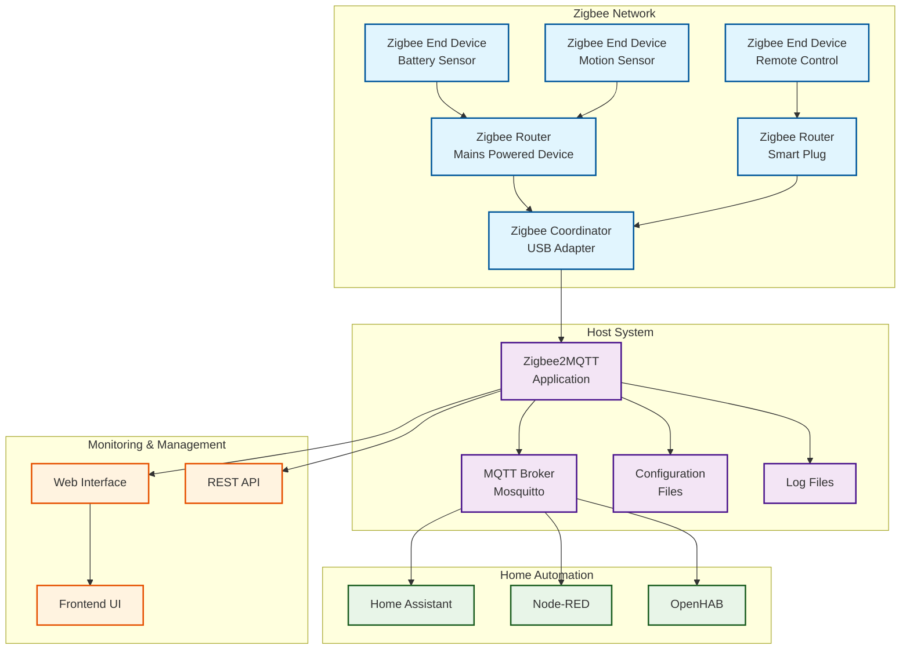

## Overview

**Zigbee2MQTT** is a powerful bridge that allows you to use your Zigbee devices without the vendor's bridge or gateway. It bridges events and allows you to control your Zigbee devices via MQTT, making them compatible with any smart home solution that supports MQTT, including Home Assistant, OpenHAB, and Node-RED.

## What is Zigbee2MQTT?

Zigbee2MQTT is an open-source project that:

- **Eliminates vendor lock-in** by removing the need for proprietary hubs
- **Provides local control** without cloud dependencies
- **Supports 2000+ devices** from various manufacturers
- **Enables advanced features** not available in vendor apps
- **Offers extensive customization** through configuration files
- **Provides detailed logging** for troubleshooting

### Key Benefits

- **Cost-effective**: Single adapter supports multiple device brands
- **Privacy-focused**: All communication stays local
- **Flexible**: Works with any MQTT-compatible automation platform
- **Feature-rich**: Exposes all device capabilities
- **Community-driven**: Extensive device support and documentation

## Architecture Overview

## Prerequisites

### Hardware Requirements

- **Zigbee USB Adapter** (recommended: Texas Instruments CC2652 based)
- **Host System** with USB port (Raspberry Pi, x86 server, or desktop)
- **MQTT Broker** (Mosquitto recommended)
- **Minimum 1GB RAM** for stable operation
- **At least 8GB storage** for logs and backups

### Software Prerequisites

- **Linux, Windows, or macOS** host system
- **Docker** (recommended) or Node.js 18+ for native installation
- **MQTT broker** running and accessible
- **Network connectivity** between Zigbee2MQTT and MQTT broker

## Documentation Structure

This comprehensive guide is organized into focused sections for easy navigation:

### 📦 [Installation](installation.md)

Complete installation guide covering all deployment methods:

- **Docker Installation** with Docker Compose examples
- **Native Installation** for direct system deployment
- **Home Assistant Add-on** for HASSIO users
- **Post-installation verification** and testing

### ⚙️ [Configuration](configuration.md)

Comprehensive configuration guide:

- **Basic configuration** for quick setup
- **Advanced settings** for optimization
- **Security configuration** and best practices
- **Network optimization** for large deployments
- **Device-specific configurations**

### 🔧 [Device Management](device-management.md)

Complete device lifecycle management:

- **Device pairing** procedures and troubleshooting
- **Device configuration** and customization
- **Groups and scenes** setup and management
- **Device removal** and network cleanup
- **Bulk operations** for large deployments

### 📊 [Monitoring and Maintenance](monitoring.md)

System monitoring and maintenance procedures:

- **Logging configuration** and analysis
- **Backup strategies** and automation
- **Health monitoring** and alerting
- **Performance optimization**
- **Maintenance schedules** and procedures

### 🔍 [Troubleshooting](troubleshooting.md)

Common issues and diagnostic procedures:

- **Connection problems** and network issues
- **Device pairing failures** and solutions
- **Performance issues** and optimization
- **Log analysis** and error interpretation
- **Recovery procedures** for system failures

### 🏠 [Home Assistant Integration](integration.md)

Deep integration with Home Assistant:

- **MQTT discovery** configuration
- **Entity customization** and naming
- **Automation examples** and best practices
- **Dashboard integration** and visualization
- **Advanced integrations** with other platforms

### 🚀 [Advanced Topics](advanced.md)

Advanced configuration and optimization:

- **Security hardening** and access control
- **Performance tuning** for large networks
- **Custom device handlers** and modifications
- **Network topology** optimization
- **High availability** setup and clustering

## Quick Start

If you're new to Zigbee2MQTT, follow this recommended path:

1. **Start with [Installation](installation.md)** to get Zigbee2MQTT running
2. **Configure basics** using the [Configuration](configuration.md) guide
3. **Pair your first device** following [Device Management](device-management.md)
4. **Set up monitoring** with [Monitoring and Maintenance](monitoring.md)
5. **Integrate with Home Assistant** using [Integration](integration.md) guide

## Community and Support

- **Official Documentation**: [zigbee2mqtt.io](https://www.zigbee2mqtt.io/)
- **GitHub Repository**: [Koenkk/zigbee2mqtt](https://github.com/Koenkk/zigbee2mqtt)
- **Community Forum**: [GitHub Discussions](https://github.com/Koenkk/zigbee2mqtt/discussions)
- **Device Database**: [Supported Devices](https://www.zigbee2mqtt.io/supported-devices/)
- **Discord Community**: Active community support and discussions

## Version Information

This guide is maintained for:

- **Zigbee2MQTT**: Version 1.35.x and newer
- **Node.js**: Version 18.x and newer
- **MQTT Brokers**: Mosquitto 2.0+, Eclipse Mosquitto, EMQX
- **Home Assistant**: 2023.1 and newer

---

> **Note**: This documentation is continuously updated to reflect the latest features and best practices. Always refer to the official Zigbee2MQTT documentation for the most current information.
