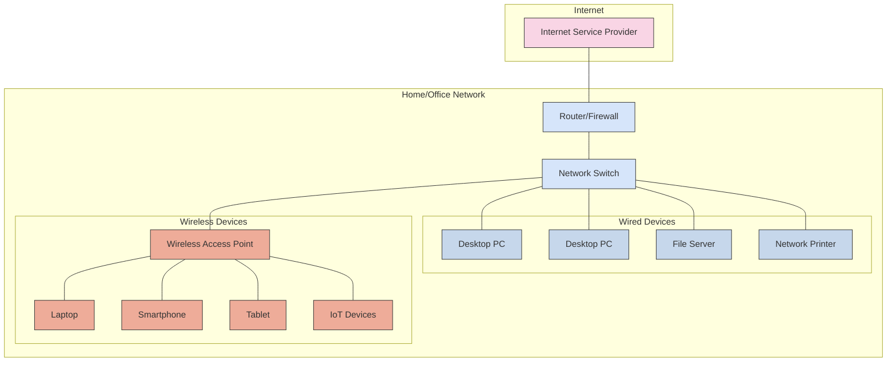

# Basic Network Topology

```mermaid
flowchart TB
    subgraph Internet
        ISP[Internet Service Provider]
    end
    
    subgraph "Home/Office Network"
        Router[Router/Firewall]
        Switch[Network Switch]
        
        subgraph "Wired Devices"
            PC1[Desktop PC]
            PC2[Desktop PC]
            Server[File Server]
            Printer[Network Printer]
        end
        
        subgraph "Wireless Devices"
            WAP[Wireless Access Point]
            Laptop[Laptop]
            Phone[Smartphone]
            Tablet[Tablet]
            IOT[IoT Devices]
        end
    end
    
    ISP --- Router
    Router --- Switch
    Switch --- PC1
    Switch --- PC2
    Switch --- Server
    Switch --- Printer
    Switch --- WAP
    WAP --- Laptop
    WAP --- Phone
    WAP --- Tablet
    WAP --- IOT
    
    classDef internet fill:#f9d5e5,stroke:#333
    classDef network fill:#d6e5fa,stroke:#333
    classDef wired fill:#c6d7eb,stroke:#333
    classDef wireless fill:#eeac99,stroke:#333
    
    class ISP internet
    class Router,Switch network
    class PC1,PC2,Server,Printer wired
    class WAP,Laptop,Phone,Tablet,IOT wireless
```
