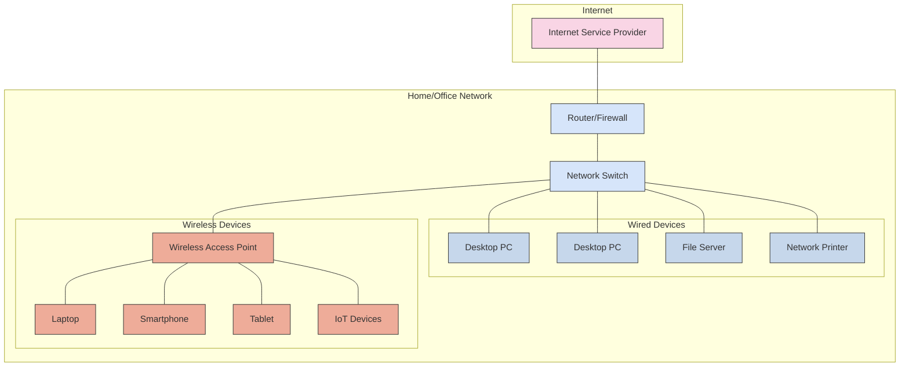

This section covers networking concepts, protocols, configuration guides, and troubleshooting for various networking equipment and software.

## Network Fundamentals

### OSI Model

The OSI (Open Systems Interconnection) model is a conceptual framework used to understand network interactions in seven layers:

```mermaid
flowchart TB
    subgraph "OSI Model"
        direction TB
        L7["Layer 7: Application Layer<br>HTTP, SMTP, FTP, DNS"]
        L6["Layer 6: Presentation Layer<br>TLS/SSL, JPEG, MPEG"]
        L5["Layer 5: Session Layer<br>NetBIOS, PPTP, RPC"]
        L4["Layer 4: Transport Layer<br>TCP, UDP"]
        L3["Layer 3: Network Layer<br>IP, ICMP, OSPF"]
        L2["Layer 2: Data Link Layer<br>Ethernet, PPP, HDLC"]
        L1["Layer 1: Physical Layer<br>Cables, Hubs, Repeaters"]
        
        L7 --- L6
        L6 --- L5
        L5 --- L4
        L4 --- L3
        L3 --- L2
        L2 --- L1
    end
    
    subgraph "Data Units"
        D7["Data"]
        D6["Data"]
        D5["Data"]
        D4["Segments/Datagrams"]
        D3["Packets"]
        D2["Frames"]
        D1["Bits"]
        
        D7 --- D6
        D6 --- D5
        D5 --- D4
        D4 --- D3
        D3 --- D2
        D2 --- D1
    end
    
    subgraph "Devices"
        Dev7["Application Gateway<br>Proxy"]
        Dev6[""]
        Dev5[""]
        Dev4["Firewall<br>Load Balancer"]
        Dev3["Router<br>Layer 3 Switch"]
        Dev2["Switch<br>Bridge"]
        Dev1["Hub<br>Repeater<br>Cable"]
        
        Dev7 --- Dev6
        Dev6 --- Dev5
        Dev5 --- Dev4
        Dev4 --- Dev3
        Dev3 --- Dev2
        Dev2 --- Dev1
    end
    
    L7 --- D7
    L6 --- D6
    L5 --- D5
    L4 --- D4
    L3 --- D3
    L2 --- D2
    L1 --- D1
    
    D7 --- Dev7
    D6 --- Dev6
    D5 --- Dev5
    D4 --- Dev4
    D3 --- Dev3
    D2 --- Dev2
    D1 --- Dev1
    
    classDef application fill:#f9d5e5,stroke:#333
    classDef presentation fill:#eeac99,stroke:#333
    classDef session fill:#e06377,stroke:#333
    classDef transport fill:#c83349,stroke:#333
    classDef network fill:#5b9aa0,stroke:#333
    classDef datalink fill:#d6e5fa,stroke:#333
    classDef physical fill:#c6d7eb,stroke:#333
    
    class L7,D7,Dev7 application
    class L6,D6,Dev6 presentation
    class L5,D5,Dev5 session
    class L4,D4,Dev4 transport
    class L3,D3,Dev3 network
    class L2,D2,Dev2 datalink
    class L1,D1,Dev1 physical
```

### Basic Network Topology

A typical home or small office network structure:



## Topics

- [Unifi Dream Machine](unifi/index.md) - Configuration and operation of the Unifi networking equipment.

## Getting Started

### Prerequisites

Before diving into networking topics, it's helpful to have:

1. **Basic Knowledge**:
   - Understanding of IP addressing and subnetting
   - Familiarity with OSI model and basic networking concepts
   - Knowledge of common protocols (TCP/IP, DNS, DHCP)

2. **Tools for Network Analysis**:
   - Wireshark or tcpdump for packet analysis
   - Ping and traceroute utilities
   - SSH client for device access

3. **Lab Environment** (optional but recommended):
   - Virtual network with GNS3 or Packet Tracer
   - Small physical lab with switches and routers

### First Steps

#### 1. Understanding Network Fundamentals

Start with these fundamental concepts:

- **IP Addressing**: Learn IPv4/IPv6 addressing and subnetting
- **Network Protocols**: Understand TCP, UDP, ICMP, and application protocols
- **Network Devices**: Learn the functions of routers, switches, firewalls

#### 2. Hands-on Practice

For Unifi equipment:

```bash
# Access Unifi Controller
https://unifi.local:8443

# Basic troubleshooting commands
ping 8.8.8.8
traceroute google.com
nslookup example.com
```

For general networking diagnostics:

```bash
# Check interface status
ip addr show

# View routing table
ip route

# Scan open ports on a server
nmap -A 192.168.1.1
```

### Common Tasks

#### Configuring a Network Device

1. Connect to device via SSH or console
2. Enter configuration mode
3. Set IP addresses, VLANs, and routing parameters
4. Save configuration

#### Troubleshooting Connectivity Issues

1. Verify physical connectivity (cables, link lights)
2. Check IP configuration (address, subnet mask, gateway)
3. Test local network connectivity (ping local gateway)
4. Test internet connectivity (ping public DNS)
5. Examine routing tables and firewall rules

### Next Steps

- Learn about [VLANs and network segmentation](https://en.wikipedia.org/wiki/Virtual_LAN)
- Explore [network security best practices](https://www.cisco.com/c/en/us/support/docs/ip/access-lists/13608-21.html)
- Study [routing protocols](https://en.wikipedia.org/wiki/Routing_protocol) (OSPF, BGP, EIGRP)
