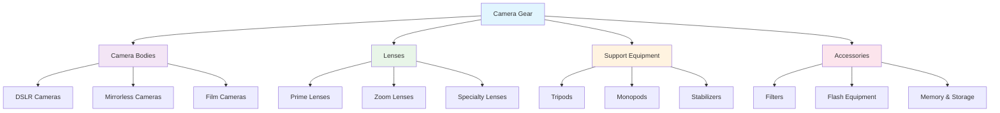

# Camera Gear

Welcome to the comprehensive camera gear section. Here you'll find detailed information about photography equipment, from camera bodies and lenses to essential accessories that will help you capture better images.

## Overview

Choosing the right camera gear can significantly impact your photography journey. This section provides practical guidance on equipment selection, covering everything from entry-level options to professional-grade equipment.

## What You'll Find in This Section

### 📸 [Camera Bodies](camera-bodies.md)

Learn about different types of camera bodies, their strengths and weaknesses, and which might be best for your photography style and budget.

### 🔍 [Lenses](lenses.md)

Explore the world of camera lenses, from versatile zoom lenses to specialized prime lenses, and understand how different focal lengths affect your images.

### 🗜️ [Tripods and Supports](tripods-supports.md)

Discover the importance of camera support systems and find the right tripod or stabilization solution for your shooting style.

### 🌈 [Filters](filters.md)

Learn about optical filters that can enhance your images in-camera, from polarizing filters to neutral density filters.

### 🎒 [Accessories](accessories.md)

Essential accessories that every photographer should consider, from memory cards to cleaning kits.

### 💰 [Budget Recommendations](budget-recommendations.md)

Practical advice for building a photography kit on any budget, with specific product recommendations and alternatives.

## Getting Started with Camera Gear

### Essential First Purchases

For beginners starting their photography journey, focus on these essential items:

1. **Camera Body**: Start with an entry-level DSLR or mirrorless camera
2. **Kit Lens**: Usually included with camera bodies, perfect for learning
3. **Memory Card**: Fast, reliable storage for your images
4. **Extra Battery**: Never miss a shot due to power loss
5. **Basic Tripod**: For sharp images in low light and long exposures

### Building Your Kit Over Time

Photography gear should evolve with your skills and interests:

#### Phase 1: Foundation (Months 1-6)

- Camera body with kit lens
- Essential accessories (memory cards, batteries)
- Basic tripod

#### Phase 2: Expansion (Months 6-18)

- Additional lenses (prime lens, telephoto zoom)
- Better tripod
- Filters (polarizing, UV)
- External flash

#### Phase 3: Specialization (18+ months)

- Specialized lenses for your preferred genres
- Professional accessories
- Backup equipment
- Advanced lighting equipment

## Budget Considerations

### Entry-Level Budget ($500-1500)

- Camera body with kit lens
- Basic accessories
- Entry-level tripod

### Enthusiast Budget ($1500-5000)

- Better camera body or additional lenses
- Quality tripod and filters
- External flash
- Camera bag and protection

### Professional Budget ($5000+)

- Professional camera bodies
- High-quality lens collection
- Professional accessories
- Backup equipment
- Specialized tools

## Maintenance and Care

### Camera Body Care

- Regular sensor cleaning
- Weather protection
- Proper storage
- Firmware updates

### Lens Maintenance

- Front and rear element cleaning
- UV filter protection
- Proper storage and transport
- Calibration checks

### Equipment Protection

- Camera bags and cases
- Weather sealing considerations
- Insurance considerations
- Backup strategies

## Buying Advice

### New vs Used Equipment

**New Equipment Advantages:**

- Full warranty coverage
- Latest features and technology
- Known history and condition

**Used Equipment Advantages:**

- Significant cost savings
- Access to premium equipment at lower prices
- Environmentally friendly choice

### Where to Buy

- **Authorized Dealers**: Full warranty and support
- **Online Retailers**: Competitive pricing and selection
- **Used Equipment Dealers**: Quality pre-owned gear
- **Private Sales**: Best prices but higher risk

### What to Check When Buying Used

- Shutter count (for cameras)
- Lens element condition
- Autofocus accuracy
- Physical condition and wear
- Included accessories

## Future Considerations

### Technology Trends

- Mirrorless camera evolution
- Computational photography
- Video capabilities
- Connectivity features

### Investment Strategy

- Choose systems with lens compatibility
- Consider upgrade paths
- Balance quality vs quantity
- Plan for your specific needs

---

*Remember: The best camera gear is the gear you have with you. While quality equipment can enhance your photography, creativity and technique are far more important than having the most expensive gear.*

**Ready to build your camera kit?** Start with the basics and gradually expand your collection as your skills and interests develop.
