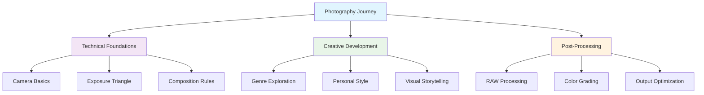

# Photography

Welcome to my photography documentation and resource collection. This section serves as a comprehensive guide covering various aspects of photography, from technical fundamentals to creative techniques and post-processing workflows.

## Overview

Photography is both an art and a science, combining technical knowledge with creative vision to capture compelling images. Whether you're just starting your photography journey or looking to refine your skills, this collection covers essential topics that will help you grow as a photographer.

## What You'll Find Here

This photography section is organized into several key areas designed to support photographers at all skill levels:

### 📷 **Camera Gear**

**Coming Soon** - This section will cover:

- Equipment reviews and recommendations
- Lens selection guides
- Camera settings and configurations
- Accessory recommendations
- Budget-friendly alternatives

### 🎯 **Photography Tips**

**Coming Soon** - This section will cover:

- Composition techniques and rules
- Lighting fundamentals
- Genre-specific techniques (portrait, landscape, street, macro)
- Technical tips for challenging conditions
- Creative exercises and challenges

### 🎨 **Photo Editing**

**Coming Soon** - This section will cover:

- RAW processing workflows
- Adobe Lightroom and Photoshop techniques
- Alternative editing software
- Color theory and grading
- Retouching and enhancement techniques

### 🖼️ **Photo Gallery**

**Coming Soon** - This section will feature:

- Curated collection of work
- Behind-the-scenes stories
- Technical details and settings
- Before and after comparisons
- Project showcases

## Getting Started with Photography

### Essential Concepts

#### The Exposure Triangle

Understanding the relationship between **aperture**, **shutter speed**, and **ISO** is fundamental to controlling your camera:

- **Aperture (f-stop)**: Controls depth of field and light entry
- **Shutter Speed**: Controls motion blur and light duration
- **ISO**: Controls sensor sensitivity to light

#### Composition Fundamentals

- **Rule of Thirds**: Divide frame into thirds for balanced composition
- **Leading Lines**: Use lines to guide viewer's eye through the image
- **Framing**: Use natural elements to frame your subject
- **Symmetry and Patterns**: Create visual interest through repetition
- **Depth**: Use foreground, middle ground, and background elements

### Equipment Recommendations for Beginners

#### Entry-Level Camera Options

**DSLR Cameras:**

- Canon EOS Rebel series
- Nikon D3500/D5600 series
- Pentax K-70

**Mirrorless Cameras:**

- Sony Alpha a6000 series
- Fujifilm X-T30
- Canon EOS M50

#### Essential Lenses

1. **Kit Lens (18-55mm)**: Versatile for learning fundamentals
2. **50mm Prime**: Great for portraits and low light
3. **Wide-angle (10-24mm)**: Landscape and architecture photography

#### Must-Have Accessories

- **Tripod**: For stable shots and long exposures
- **Polarizing Filter**: Reduces reflections and enhances colors
- **Extra Batteries**: Never miss a shot due to dead battery
- **Memory Cards**: Fast, reliable storage for your images

## Photography Genres and Techniques

### Popular Photography Styles

#### Portrait Photography

- Natural lighting techniques
- Posing and directing subjects
- Background selection and management
- Studio lighting setups

#### Landscape Photography

- Golden hour and blue hour timing
- Hyperfocal distance techniques
- Long exposure water and cloud effects
- Foreground composition

#### Street Photography

- Candid moment capture
- Urban composition techniques
- Low-light shooting strategies
- Ethics and legal considerations

#### Macro Photography

- Close-up focusing techniques
- Depth of field management
- Lighting for small subjects
- Equipment recommendations

### Technical Challenges and Solutions

#### Low Light Photography

- High ISO noise management
- Stable shooting techniques
- Focus assistance methods
- Post-processing for noise reduction

#### Action and Sports Photography

- Continuous autofocus techniques
- Burst mode strategies
- Anticipating the decisive moment
- Equipment for fast-moving subjects

## Post-Processing Workflow

### RAW vs JPEG

**RAW Advantages:**

- Greater dynamic range
- Non-destructive editing
- Color depth and flexibility
- Recovery of highlights and shadows

**Basic RAW Processing Steps:**

1. Import and organize images
2. Basic exposure and contrast adjustments
3. Color temperature and tint correction
4. Highlight and shadow recovery
5. Local adjustments and masking
6. Sharpening and noise reduction
7. Export for intended use

### Essential Editing Tools

#### Adobe Creative Suite

- **Lightroom**: RAW processing and organization
- **Photoshop**: Advanced editing and compositing

#### Alternative Software

- **Capture One**: Professional RAW processing
- **Luminar**: AI-powered editing tools
- **GIMP**: Free open-source alternative
- **Affinity Photo**: Professional editing at lower cost

## Learning Resources and Development

### Skill Development Path

#### Beginner Level (0-6 months)

1. Master camera controls and exposure triangle
2. Learn basic composition rules
3. Practice with available light
4. Understand file formats and basic editing

#### Intermediate Level (6-18 months)

1. Develop personal style and preferences
2. Explore specific genres in depth
3. Learn advanced editing techniques
4. Start building a portfolio

#### Advanced Level (18+ months)

1. Master challenging lighting conditions
2. Develop signature style and vision
3. Create cohesive bodies of work
4. Consider professional opportunities

### Practice Exercises

#### Weekly Challenges

- **Minimalism Week**: Focus on simple, clean compositions
- **Golden Hour Week**: Shoot only during golden hour
- **Black and White Week**: Create compelling monochrome images
- **Street Photography Week**: Document urban life and moments

#### Monthly Projects

- **365 Project**: Take one photo every day for a year
- **Single Location Series**: Explore one location across different seasons
- **Portrait Series**: Document a specific group or community
- **Abstract Series**: Focus on shapes, patterns, and textures

## Community and Inspiration

### Online Resources

#### Learning Platforms

- YouTube channels for photography education
- Online photography courses and workshops
- Photography forums and communities
- Social media groups and hashtags

#### Inspiration Sources

- Photography books and magazines
- Museum and gallery exhibitions
- Master photographer portfolios
- Contemporary photography blogs

### Building Your Photography Network

- Join local photography clubs
- Participate in photo walks and meetups
- Attend workshops and seminars
- Share work for constructive feedback
- Collaborate with other creatives

## Technical Tips for Better Photos

### Camera Settings Cheat Sheet

#### Portrait Photography Settings

- **Aperture**: f/1.4 - f/5.6 for shallow depth of field
- **Shutter Speed**: 1/focal length minimum
- **ISO**: Keep as low as possible (100-800)
- **Focus Mode**: Single-point autofocus on eyes

#### Landscape Photography Settings

- **Aperture**: f/8 - f/11 for sharp foreground to background
- **Shutter Speed**: Varies (fast for sharp details, slow for motion blur)
- **ISO**: Base ISO (100-200) when possible
- **Focus Mode**: Hyperfocal distance or focus stacking

#### Action Photography Settings

- **Aperture**: f/2.8 - f/5.6 for sufficient shutter speed
- **Shutter Speed**: 1/500s or faster to freeze motion
- **ISO**: Adjust as needed for proper exposure
- **Focus Mode**: Continuous autofocus with tracking

## Next Steps

### Immediate Actions

1. **Choose Your Equipment**: Start with what you have or invest in entry-level gear
2. **Learn Your Camera**: Master the basic controls and settings
3. **Practice Daily**: Take photos regularly, even with your phone
4. **Study Great Photography**: Analyze work that inspires you

### Building Your Skills

1. **Take a Course**: Structured learning accelerates progress
2. **Join a Community**: Connect with other photographers for support and feedback
3. **Develop a Project**: Work on a cohesive series of images
4. **Share Your Work**: Get feedback and build confidence

### Long-term Development

1. **Develop Your Voice**: Find what you want to say through photography
2. **Build a Portfolio**: Curate your best work for specific purposes
3. **Consider Specialization**: Focus on genres that excite you most
4. **Explore Professional Opportunities**: If desired, consider monetizing your skills

---

*Photography is a journey of continuous learning and creative growth. Whether you're capturing family memories, exploring artistic expression, or building professional skills, the fundamentals covered in this section will support your development as a photographer.*

**Ready to start shooting?** Begin with the basics, practice regularly, and most importantly, enjoy the process of seeing the world through your camera's lens!
