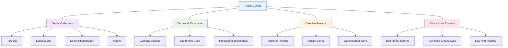

# Photo Gallery

Welcome to my photography portfolio - a curated collection of images showcasing different genres, techniques, and creative approaches. Each gallery includes technical details, behind-the-scenes insights, and the stories behind the photographs.

## Overview

This gallery represents my photographic journey across various genres and styles. Each section demonstrates different techniques, equipment usage, and creative approaches, providing both inspiration and educational value for fellow photographers.

## Gallery Collections

### 👤 [Portrait Gallery](portrait-gallery.md)

A showcase of portrait photography including environmental portraits, studio work, and candid captures with detailed lighting and posing insights.

### 🏔️ [Landscape Gallery](landscape-gallery.md)

Stunning landscape photography from various locations, featuring golden hour shots, long exposures, and dramatic natural scenes.

### 🚶 [Street Photography Gallery](street-gallery.md)

Authentic moments captured in urban environments, showcasing storytelling through candid photography and human interaction.

### 🔍 [Macro Gallery](macro-gallery.md)

Close-up photography revealing the intricate details of small subjects, from insects to textures and abstract compositions.

### ⚫ [Black and White Gallery](bw-gallery.md)

Monochrome photography emphasizing composition, contrast, and emotional impact without the distraction of color.

### ✈️ [Travel Photography](travel-gallery.md)

Images from various destinations capturing cultures, landscapes, and experiences from around the world.

### 🎬 [Behind the Scenes](behind-scenes.md)

A look at the creative process, setup shots, and the story behind how specific images were created.

## Gallery Features

### Technical Information

Each image in the galleries includes detailed technical information:

#### Camera Settings

- **Camera Body**: Model used for the shot
- **Lens**: Focal length and aperture specs
- **Settings**: ISO, aperture, shutter speed
- **Focus**: Autofocus mode and point selection

#### Post-Processing Details

- **Software Used**: Lightroom, Photoshop, or alternatives
- **Key Adjustments**: Major edits and techniques applied
- **Style Notes**: Artistic choices and creative decisions
- **Time Investment**: Approximate editing time

#### Location and Context

- **Where**: Shooting location and conditions
- **When**: Time of day, season, weather
- **Why**: Creative intent and story behind the image
- **How**: Technique and approach used

### Interactive Elements

#### Before and After Comparisons

- RAW vs processed images
- Step-by-step editing progression
- Alternative processing approaches
- Artistic interpretation variations

#### Equipment Spotlights

- Specific lens performance examples
- Camera body capability demonstrations
- Accessory usage illustrations
- Budget vs premium gear comparisons

#### Technique Demonstrations

- Focus stacking examples
- HDR processing results
- Long exposure effects
- Creative composition studies

## Image Categories

### By Technical Approach

#### Natural Light Photography

- Golden hour portraits
- Overcast day advantages
- Window light techniques
- Outdoor natural lighting

#### Artificial Lighting

- Studio portrait setups
- Flash photography techniques
- Continuous lighting approaches
- Mixed lighting scenarios

#### Long Exposure Photography

- Water motion effects
- Cloud movement capture
- Light trail creation
- Star photography techniques

#### High-Speed Photography

- Action freezing techniques
- Sports photography captures
- Wildlife in motion
- Technical precision shots

### By Creative Style

#### Documentary Approach

- Authentic moment capture
- Storytelling through images
- Environmental context inclusion
- Unposed natural expressions

#### Artistic Interpretation

- Creative compositions
- Abstract approaches
- Experimental techniques
- Personal vision expression

#### Commercial Style

- Clean, professional aesthetics
- Product photography techniques
- Corporate portrait approaches
- Marketing-focused compositions

## Learning from the Gallery

### Study Composition

- Rule of thirds applications
- Leading line usage
- Framing techniques
- Pattern and symmetry examples

### Analyze Lighting

- Direction and quality assessment
- Shadow and highlight management
- Color temperature considerations
- Mood creation through light

### Understand Post-Processing

- Subtle vs dramatic edits
- Color grading approaches
- Black and white conversion techniques
- Style consistency maintenance

### Technical Execution

- Sharp focus achievement
- Proper exposure techniques
- Depth of field control
- Motion handling methods

## Gallery Organization

### Chronological Progression

Images are often organized to show:

- Technical skill development over time
- Style evolution and refinement
- Equipment upgrade impacts
- Creative growth documentation

### Thematic Collections

Related images grouped by:

- Location-based series
- Project-specific work
- Seasonal collections
- Mood and emotion themes

### Difficulty Progression

Examples range from:

- Beginner-friendly techniques
- Intermediate skill applications
- Advanced technical challenges
- Master-level creative work

## Viewing Recommendations

### For Beginners

1. Start with basic technique demonstrations
2. Focus on fundamental composition examples
3. Study simple lighting scenarios
4. Observe gear-specific capabilities

### For Intermediate Photographers

1. Analyze advanced composition techniques
2. Study challenging lighting solutions
3. Examine post-processing approaches
4. Learn from creative problem-solving

### For Advanced Photographers

1. Deconstruct complex technical setups
2. Study artistic interpretation choices
3. Analyze style development patterns
4. Find inspiration for personal projects

## Contributing Images

### Submission Guidelines

If you'd like to contribute images to educational discussions:

- High-resolution originals required
- Detailed technical information needed
- Permission for educational use
- Story and context description

### Technical Requirements

- **Format**: RAW files preferred for demonstrations
- **Resolution**: Full resolution for detail analysis
- **Metadata**: Preserve EXIF data for learning
- **Backup**: Original file preservation

## Gallery Updates

### Regular Additions

- New work added monthly
- Seasonal collections updated
- Technique demonstrations expanded
- Equipment reviews illustrated

### Community Features

- Viewer favorite voting
- Comment and discussion sections
- Technique question responses
- Educational workshop tie-ins

---

*This gallery serves both as a portfolio showcase and educational resource. Every image tells a story - not just about the subject, but about the techniques, decisions, and creative process that brought it to life.*

**Ready to explore?** Choose a gallery that interests you and dive into the images. Each one offers opportunities to learn and find inspiration for your own photography journey.
