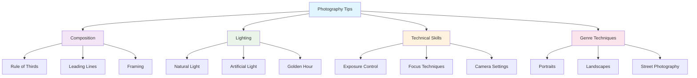

# Photography Tips

Master the art and craft of photography with practical tips, techniques, and creative insights. This comprehensive collection covers essential skills for photographers at all levels, from composition basics to advanced shooting techniques.

## Overview

Great photography combines technical knowledge with artistic vision. Whether you're capturing portraits, landscapes, or street scenes, the fundamental principles and advanced techniques covered in this section will help you create more compelling images.

## Essential Photography Techniques

### 🎨 [Composition Techniques](composition-techniques.md)

Learn the fundamental rules of visual composition and when to break them for creative impact.

### 💡 [Lighting Fundamentals](lighting-fundamentals.md)

Master the art of working with light - the most crucial element in photography.

### 👤 [Portrait Photography](portrait-photography.md)

Techniques for capturing compelling portraits, from posing to lighting to expression.

### 🏔️ [Landscape Photography](landscape-photography.md)

Create stunning landscape images with proper planning, composition, and technique.

### 🚶 [Street Photography](street-photography.md)

Develop skills for capturing authentic moments and stories in urban environments.

### 🔍 [Macro Photography](macro-photography.md)

Explore the fascinating world of close-up photography and small subject capture.

### 🌙 [Low Light Photography](low-light-photography.md)

Master challenging lighting conditions and create dramatic images after dark.

### ⚡ [Action Photography](action-photography.md)

Freeze or blur motion to create dynamic images of moving subjects.

## Quick Reference Guides

### Essential Camera Settings by Genre

#### Portrait Photography

- **Aperture**: f/1.4 - f/5.6 (shallow depth of field)
- **Shutter Speed**: 1/focal length minimum
- **ISO**: 100-800 (keep noise low)
- **Focus**: Single-point AF on eyes

#### Landscape Photography

- **Aperture**: f/8 - f/11 (maximum sharpness)
- **Shutter Speed**: Varies by effect desired
- **ISO**: 100-200 (base ISO when possible)
- **Focus**: Hyperfocal distance or focus stacking

#### Street Photography

- **Aperture**: f/5.6 - f/8 (good depth of field)
- **Shutter Speed**: 1/125s minimum for sharp subjects
- **ISO**: Auto or up to 1600
- **Focus**: Zone focusing or continuous AF

#### Action Photography

- **Aperture**: f/2.8 - f/5.6 (fast enough shutter)
- **Shutter Speed**: 1/500s+ to freeze motion
- **ISO**: Adjust for proper exposure
- **Focus**: Continuous AF with tracking

### Composition Quick Tips

#### Rule of Thirds

- Place subjects on intersection points
- Align horizons with grid lines
- Create more dynamic compositions

#### Leading Lines

- Use roads, rivers, or architectural elements
- Guide viewer's eye to main subject
- Create depth and movement in images

#### Framing

- Use natural elements as frames
- Draw attention to main subject
- Add context and depth

#### Symmetry and Patterns

- Look for repeating elements
- Break patterns for visual interest
- Use reflections effectively

### Lighting Guidelines

#### Golden Hour (Sunrise/Sunset)

- Warm, soft light
- Long shadows for depth
- Side lighting for texture
- Plan timing with sun calculator apps

#### Blue Hour (Twilight)

- Even, diffused light
- Balanced exposure between sky and ground
- Great for cityscapes and landscapes
- Use tripod for longer exposures

#### Overcast Days

- Soft, even lighting
- Perfect for portraits
- Saturated colors
- No harsh shadows

#### Harsh Midday Sun

- Use shadows creatively
- Look for reflected light
- Consider black and white
- Use fill flash for portraits

## Creative Techniques

### Advanced Composition Methods

#### Dynamic Symmetry

- Use diagonal lines for energy
- Apply golden ratio principles
- Create visual tension

#### Color Theory

- Complementary color combinations
- Monochromatic schemes
- Color temperature for mood

#### Negative Space

- Use empty areas effectively
- Create minimalist compositions
- Emphasize main subject

### Special Effects Techniques

#### Long Exposure

- Smooth water and clouds
- Light trails and star trails
- Use neutral density filters
- Calculate exposure times

#### Focus Stacking

- Combine multiple focus points
- Achieve front-to-back sharpness
- Essential for macro photography
- Use specialized software

#### HDR Photography

- Capture extreme dynamic range
- Bracket exposures
- Process carefully for natural look
- Avoid over-processing

### Creative Perspectives

#### Change Your Angle

- Get low for dramatic foregrounds
- Shoot from above for patterns
- Use unusual viewpoints
- Move around your subject

#### Use Different Focal Lengths

- Wide angle for context and drama
- Telephoto for compression
- Macro for details
- Fish-eye for extreme perspective

## Troubleshooting Common Problems

### Blurry Images

**Causes:**

- Camera shake
- Subject movement
- Missed focus
- Slow shutter speed

**Solutions:**

- Use proper hand-holding technique
- Increase shutter speed
- Use image stabilization
- Check focus accuracy

### Poor Exposure

**Causes:**

- Incorrect metering mode
- Extreme lighting conditions
- Camera limitations

**Solutions:**

- Understand metering patterns
- Use exposure compensation
- Bracket exposures
- Learn manual mode

### Composition Issues

**Causes:**

- Tilted horizons
- Cluttered backgrounds
- Poor timing
- Lack of focal point

**Solutions:**

- Use camera's level indicator
- Change shooting position
- Wait for better moments
- Simplify compositions

## Practice Exercises

### Daily Challenges

1. **One Lens Day**: Use only one focal length
2. **Color Focus**: Shoot only one color theme
3. **Texture Hunt**: Focus on surface details
4. **Shadow Play**: Use shadows as main element

### Weekly Projects

1. **Street Portraits**: Approach strangers respectfully
2. **Golden Hour Series**: Shoot only during golden hour
3. **Minimalism Week**: Create simple, clean compositions
4. **Black and White**: Remove color distraction

### Monthly Goals

1. **Master Manual Mode**: Learn exposure triangle
2. **Develop Personal Style**: Find your visual voice
3. **Genre Deep Dive**: Focus on one type of photography
4. **Technical Challenge**: Learn new camera function

## Equipment Tips for Better Results

### Essential Accessories

- **Tripod**: For sharp images and creative effects
- **Polarizing Filter**: Reduce reflections, enhance colors
- **Neutral Density Filters**: Control exposure for effects
- **Reflector**: Fill shadows in portraits

### Camera Setup Optimization

- **Custom Functions**: Program frequently used settings
- **Back Button Focus**: Separate focus from exposure
- **Exposure Compensation**: Quick adjustments
- **Custom Modes**: Save settings for different situations

### Lens Selection

- **50mm**: Great for learning fundamentals
- **24-70mm**: Versatile zoom for most situations
- **70-200mm**: Excellent for portraits and sports
- **16-35mm**: Wide angle for landscapes

## Developing Your Eye

### Study Great Photography

- Analyze work of master photographers
- Understand what makes images compelling
- Learn from different genres and styles
- Visit galleries and photography books

### Practice Regularly

- Carry camera consistently
- Shoot every day, even with phone
- Review and critique your work
- Learn from mistakes

### Seek Feedback

- Join photography communities
- Share work for constructive criticism
- Learn from other photographers
- Attend workshops and meetups

---

*Remember: Technical perfection means nothing without emotional impact. Focus on telling stories and capturing moments that matter to you and your viewers.*

**Ready to improve your photography?** Start with the fundamentals and practice consistently. Great photography is the result of seeing combined with technical skill.
