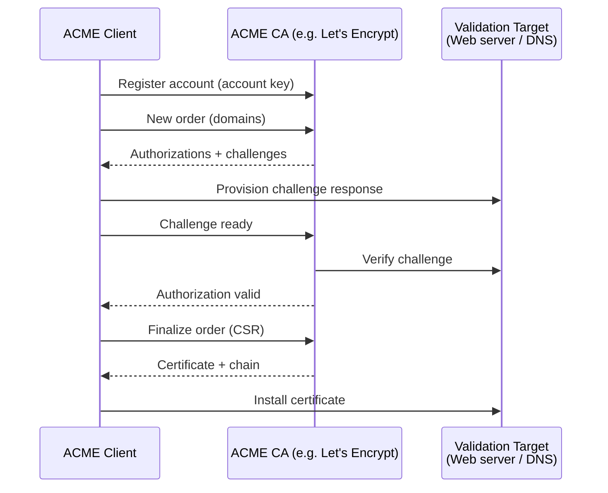

## ACME Protocol and Automated Certificates

### Overview

The **Automatic Certificate Management Environment (ACME)** is an open standard protocol that automates the issuance, renewal, and revocation of X.509 certificates. Originally developed by the Internet Security Research Group (ISRG) for the [Let's Encrypt](https://letsencrypt.org/) certificate authority, ACME is now formalized in [RFC 8555](https://datatracker.ietf.org/doc/html/rfc8555) and supported by a growing number of certificate authorities and client tools.

Before ACME, obtaining and installing a TLS certificate was a manual, error-prone process involving CSR generation, domain validation via email or web forms, manual download, and manual installation. ACME replaces this workflow with a fully automated exchange between a client (running on your server) and the CA, enabling free, short-lived certificates that renew themselves without human intervention.

> [!NOTE]
> This section focuses on the two most widely used ACME clients: **[win-acme](win-acme.md)** for Windows/IIS environments and **[Certbot](certbot.md)** for Linux and cross-platform deployments. Both automate the same underlying protocol but target different ecosystems.

### Table of Contents

- [Why ACME Matters](#why-acme-matters)
- [How the ACME Protocol Works](#how-the-acme-protocol-works)
- [Challenge Types](#challenge-types)
- [ACME Certificate Authorities](#acme-certificate-authorities)
- [Choosing a Client](#choosing-a-client)
- [Security Considerations](#security-considerations)
- [win-acme Guide](win-acme.md)
- [Certbot Guide](certbot.md)

## Why ACME Matters

Automated certificate management solves several persistent operational problems:

- **Eliminates expiration outages**: The single most common certificate incident is an expired certificate causing an outage. ACME clients renew automatically, typically well before expiry.
- **Enables short-lived certificates**: ACME certificates are usually valid for 90 days (Let's Encrypt) or less. Short lifetimes reduce the impact of key compromise and encourage automation.
- **Removes manual toil**: No more generating CSRs, copying files between systems, or submitting web forms.
- **Free, publicly trusted certificates**: Let's Encrypt and other ACME CAs issue certificates trusted by all major browsers and operating systems at no cost.
- **Scales to large fleets**: Automation makes it practical to secure hundreds or thousands of hosts and subdomains.

> [!IMPORTANT]
> The short validity period of ACME certificates (90 days for Let's Encrypt) is a feature, not a limitation. It **requires** you to automate renewal. Any deployment that depends on manual renewal of ACME certificates will eventually fail. Always configure and test automatic renewal.

## How the ACME Protocol Works

ACME is a client–server protocol running over HTTPS. The client proves control of one or more domains, then requests certificates for those domains. The high-level flow is:

1. **Account registration**: The client generates an account key pair and registers with the CA's ACME directory endpoint, agreeing to the terms of service.
2. **Order creation**: The client submits an order identifying the domain names (identifiers) it wants certified.
3. **Authorization and challenges**: For each domain, the CA issues one or more *challenges*. The client fulfills a challenge to prove it controls the domain.
4. **Validation**: The CA verifies the completed challenge (for example, by fetching a token from the web server or querying DNS).
5. **CSR submission (finalization)**: Once all authorizations are valid, the client submits a Certificate Signing Request. The client generates a fresh key pair for the certificate.
6. **Certificate issuance**: The CA signs the certificate and provides a download URL. The client retrieves the full certificate chain.
7. **Installation and renewal**: The client installs the certificate into the target service and schedules automatic renewal, repeating the process before expiry.

## Challenge Types

Challenges are how the client proves domain control. The type you choose determines your infrastructure requirements and which certificate types you can obtain.

| Challenge | How it works | Requirements | Wildcards |
| --------- | ------------ | ------------ | --------- |
| **HTTP-01** | CA requests a token file at `http://<domain>/.well-known/acme-challenge/<token>` | Port 80 reachable from the internet; a web server or the client's built-in listener | No |
| **DNS-01** | Client creates a `_acme-challenge.<domain>` TXT record; CA queries DNS | API access to your DNS provider (or manual record creation) | **Yes** |
| **TLS-ALPN-01** | CA connects on port 443 using a special ALPN protocol; client presents a validation certificate | Port 443 reachable; client controls the TLS handshake | No |

> [!TIP]
> Use **DNS-01** when you need wildcard certificates (`*.example.com`), when the host is not reachable from the public internet, or when you want to issue certificates on a machine other than the one serving traffic. Use **HTTP-01** for simple, single-host web servers that are publicly reachable on port 80.

---

> [!WARNING]
> DNS-01 requires storing DNS provider API credentials on the machine running the ACME client. Scope these credentials as narrowly as possible — ideally to a single zone with permission only to manage `_acme-challenge` TXT records — and protect them with strict file permissions.

## ACME Certificate Authorities

While Let's Encrypt is the best-known ACME CA, the protocol is an open standard supported by others:

| CA | Notes |
| -- | ----- |
| **[Let's Encrypt](https://letsencrypt.org/)** | Free, most widely used. 90-day certificates. Rate-limited. |
| **[ZeroSSL](https://zerossl.com/)** | Free tier plus paid plans. ACME and REST API. |
| **[Buypass Go](https://www.buypass.com/products/tls-ssl-certificates/go-ssl)** | Free ACME CA offering 180-day certificates. |
| **[Google Trust Services](https://pki.goog/)** | Free ACME endpoint for Google Cloud and general use. |
| **Commercial CAs** | DigiCert, Sectigo, and others offer ACME endpoints for OV/EV automation. |
| **Private/internal** | [Smallstep `step-ca`](https://smallstep.com/docs/step-ca/), HashiCorp Vault, and Microsoft ADCS (with an ACME connector) can run ACME internally. |

> [!IMPORTANT]
> **Respect rate limits.** Let's Encrypt enforces [rate limits](https://letsencrypt.org/docs/rate-limits/) (for example, certificates per registered domain per week). When testing automation, always use the CA's **staging environment** first to avoid exhausting production limits. Both win-acme and Certbot support switching to staging.

## Choosing a Client

Both clients implement the same ACME protocol and can talk to the same CAs. Pick based on your platform and integration needs.

| Consideration | [win-acme](win-acme.md) | [Certbot](certbot.md) |
| ------------- | ----------------------- | --------------------- |
| Primary platform | Windows | Linux, BSD, macOS |
| Native integration | IIS, Exchange, RDS, Windows Certificate Store | Apache, Nginx, standalone, webroot |
| Language/runtime | .NET | Python |
| Renewal scheduling | Windows Task Scheduler (auto-created) | systemd timer or cron (auto-created) |
| Interface | Interactive menu + command line | Command line |
| Best for | IIS and other Windows services | Linux web servers and containers |

- Running **IIS, Exchange, or other Windows services**? Use **[win-acme](win-acme.md)**.
- Running **Nginx, Apache, or Linux-based services**? Use **[Certbot](certbot.md)**.
- Managing **containers or ephemeral infrastructure**? Consider Certbot in a sidecar, or lightweight alternatives such as [acme.sh](https://github.com/acmesh-official/acme.sh) or the built-in ACME support in reverse proxies like Caddy and Traefik.

## Security Considerations

- **Protect the account key**: Compromise of the ACME account key lets an attacker manage (and potentially revoke) your certificates. Store it with restrictive permissions.
- **Protect DNS API credentials**: When using DNS-01, treat provider tokens as high-value secrets. Scope them to the minimum required zone and permissions.
- **Automate renewal and monitor it**: Automation can fail silently. Monitor certificate expiry independently (for example, with an external check) so a broken renewal job does not become an outage.
- **Use CAA records**: Add [DNS CAA records](https://letsencrypt.org/docs/caa/) to restrict which CAs may issue certificates for your domains, reducing the risk of misissuance.
- **Prefer staging for testing**: Validate every change against the CA's staging environment before touching production.
- **Keep clients updated**: ACME clients handle cryptographic material and network communication with the CA. Keep them patched.

## Related Topics

- [win-acme Guide](win-acme.md)
- [Certbot Guide](certbot.md)
- [Certificate Management and PKI](../index.md)
- [OpenSSL Guide](../openssl/index.md)
- [SSL vs TLS](../sslvstls.md)

## Additional Resources

- [RFC 8555 - Automatic Certificate Management Environment (ACME)](https://datatracker.ietf.org/doc/html/rfc8555)
- [Let's Encrypt Documentation](https://letsencrypt.org/docs/)
- [Let's Encrypt Rate Limits](https://letsencrypt.org/docs/rate-limits/)
- [Certbot Official Site](https://certbot.eff.org/)
- [win-acme Documentation](https://www.win-acme.com/)
