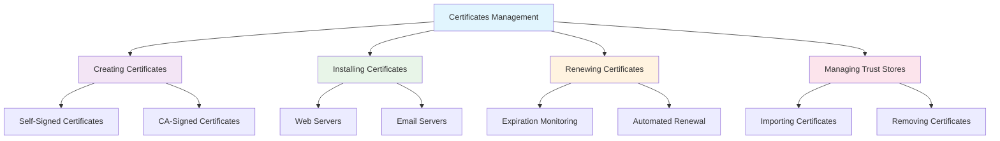

# Certificates

This section provides information about managing security certificates in the system. It covers topics such as creating, installing, and renewing certificates to ensure secure communication and data integrity.

## Overview

Certificates are essential for establishing trust in digital communications. They are used to authenticate identities and encrypt data, ensuring that sensitive information remains secure during transmission.

