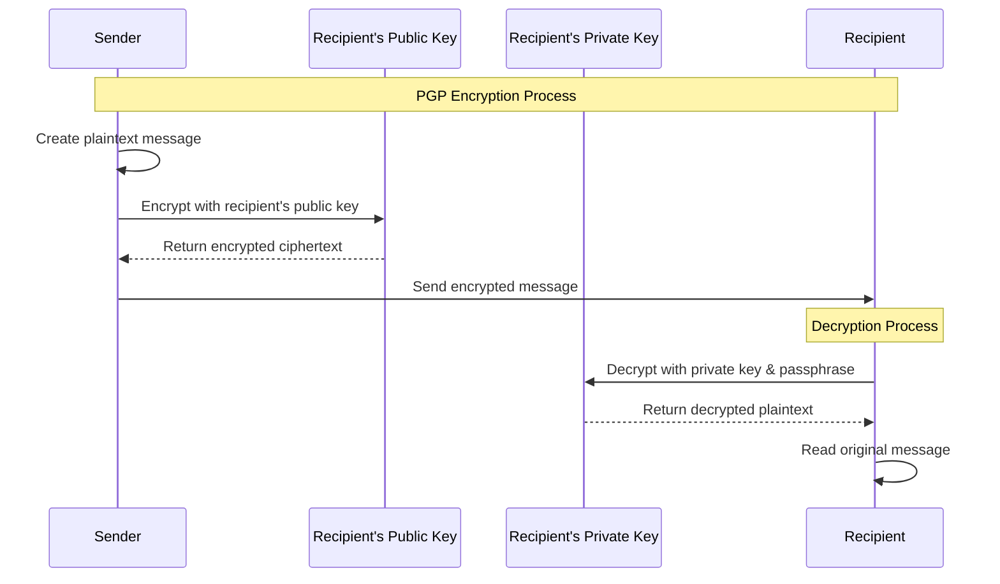

# Encryption Flow

```mermaid
sequenceDiagram
    participant Sender
    participant RecipientPublicKey as Recipient's Public Key
    participant RecipientPrivateKey as Recipient's Private Key
    participant Recipient
    
    Note over Sender,Recipient: PGP Encryption Process
    
    Sender->>Sender: Create plaintext message
    Sender->>RecipientPublicKey: Encrypt with recipient's public key
    RecipientPublicKey-->>Sender: Return encrypted ciphertext
    Sender->>Recipient: Send encrypted message
    
    Note over Recipient: Decryption Process
    
    Recipient->>RecipientPrivateKey: Decrypt with private key & passphrase
    RecipientPrivateKey-->>Recipient: Return decrypted plaintext
    Recipient->>Recipient: Read original message
```
