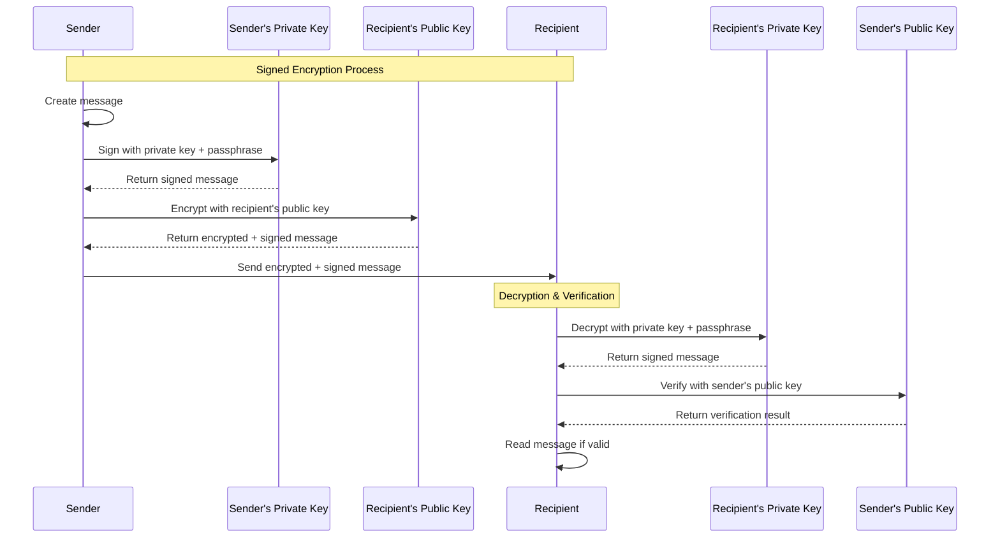

# PGP Signed Encryption Flow Diagram

```mermaid
sequenceDiagram
    participant Sender
    participant SenderPrivate as Sender's Private Key
    participant RecipientPublic as Recipient's Public Key
    participant Recipient
    participant RecipientPrivate as Recipient's Private Key
    participant SenderPublic as Sender's Public Key
    
    Note over Sender,Recipient: Signed Encryption Process
    
    Sender->>Sender: Create message
    Sender->>SenderPrivate: Sign with private key + passphrase
    SenderPrivate-->>Sender: Return signed message
    Sender->>RecipientPublic: Encrypt with recipient's public key
    RecipientPublic-->>Sender: Return encrypted + signed message
    Sender->>Recipient: Send encrypted + signed message
    
    Note over Recipient: Decryption & Verification
    
    Recipient->>RecipientPrivate: Decrypt with private key + passphrase
    RecipientPrivate-->>Recipient: Return signed message
    Recipient->>SenderPublic: Verify with sender's public key
    SenderPublic-->>Recipient: Return verification result
    Recipient->>Recipient: Read message if valid
```
