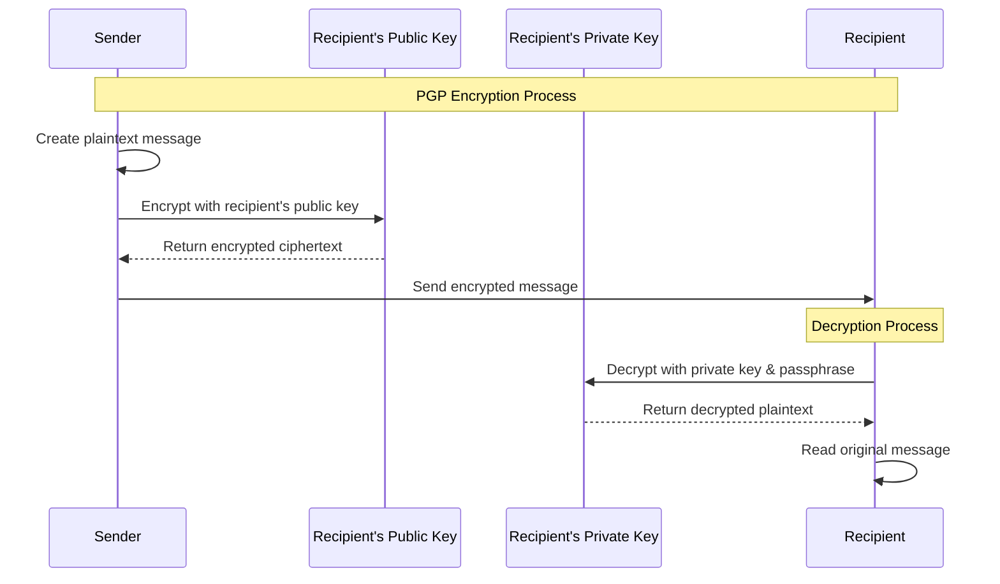
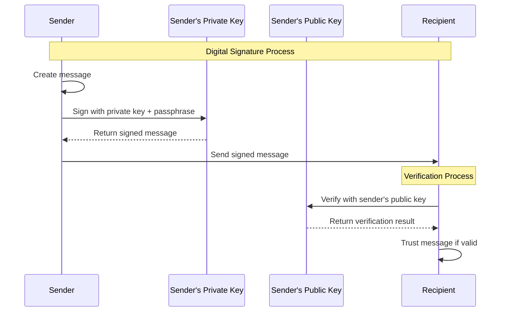
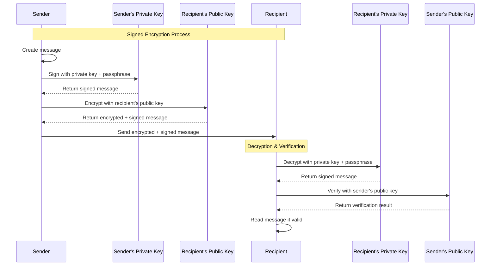

## PGP/GPG Summary and Overview

The purpose of this information is to explain what PGP/GPG is and how to use it to secure communications. While frequently PGP is used together with other tools for anonymity, like Tor or I2P, that is not the purpose of this guide. PGP encrypted messages do not have to be sent over email. Messages can be easily sent over SMS, Facebook, or any application that will allow you to paste in the encrypted message. The message could also be contained in an encrypted file and sent as an attachment or stored in a shared file system.

This guide will cover the basic tasks required to:

- Install a PGP application
- Create a PGP keypair
- Encrypt and decrypt messages
- Sign and verify messages
- Store, share, and retrieve keys using a public key server

## Supported Platforms

Applications to enable the use of PGP are available for Windows, Mac, Linux, and mobile devices. This guide will use Kleopatra and GPA as part of the GPG4Win application, or GPG4Win portable, to enable this capability on Windows hosts. The GPG4Win Portable application will allow you to store the application and your keys on a USB device so that it can be used without having to install the application. It can also be run from the local file system for situations when you cannot install applications and are prevented from mounting removable media.

## Security Considerations

> [!WARNING]
> One thing to keep in mind is that PGP cannot protect your messages from situations where the plaintext message may be captured before it is encrypted. For example, a key logger installed on the host used to create the message before it is encrypted will capture the keystrokes used when crafting the message.
> Do not create your messages in a service like Gmail, as the text that you entered could be saved automatically as a "draft" within your account by the service. Instead, craft the message in notepad and only paste the message into Gmail once it is encrypted.

## PGP Background

**Source**: [Wikipedia - Pretty Good Privacy](https://en.wikipedia.org/wiki/Pretty_Good_Privacy)

Pretty Good Privacy (PGP) is a data encryption and decryption computer program that provides cryptographic privacy and authentication for data communication. PGP is often used for signing, encrypting, and decrypting texts, emails, files, directories, and whole disk partitions to increase the security of email communications.

To the best of publicly available information, there is no known method which will allow a person or group to break PGP encryption by cryptographic or computational means. Indeed, in 1995, cryptographer [Bruce Schneier](https://en.wikipedia.org/wiki/Bruce_Schneier) characterized an early version as being "the closest you're likely to get to military-grade encryption."

## Core Concepts

PGP allows us to perform one or more of the following tasks: encrypt, decrypt, sign, or verify. This section will describe each of these tasks. It is important to understand how the public and private keys are used and by whom for each of these tasks.

### Key Management

- **Creating Keypairs** - Generate public/private key pairs
- **Managing Keypairs** - Import, export, and maintain keys
- **Key Distribution** - Share public keys securely

### Encryption Process

**Encryption** takes the recipient's **public key** and scrambles a message. This scrambled text can only be unscrambled by the recipient's **private key**. The sender always **encrypts** with the recipient's **public key**.

```text
Plaintext Message + Recipient's Public Key → Encrypted Message (Ciphertext)
```

### Decryption Process

**Decryption** takes a message that has been **encrypted** using the recipient's **public key** and descrambles it using the recipient's **private key** and the passphrase associated with that **private key**. The recipient always decrypts with the recipient's **private key**.

```text
Encrypted Message (Ciphertext) + Recipient's Private Key + Passphrase → Plaintext Message
```

### Visual Encryption Flow

The diagram below illustrates the complete PGP encryption and decryption process:



### Digital Signatures

**Signing** a message authenticates the author of the message and provides cryptographic integrity. In other words, it ensures that the message was authored by the owner of the keypair that it was signed with and that it was not tampered with in transit. The sender always signs a message with the sender's **private key** and the passphrase associated with it.

```text
Message + Sender's Private Key + Passphrase → Signed Message
```

**Verifying** a message is the process of analyzing a signed message to determine if the signing is authentic.

```text
Signed Message + Sender's Public Key → Verification Result (Valid/Invalid)
```

> [!WARNING]
> Signing and verifying can be thought of as opposites. Signing a message does not obscure the contents of the message; it only authenticates the sender and verifies that the message hasn't been altered. However, an encrypted message can also be signed by the author.

### Visual Signing & Verification Flow

The diagram below illustrates the digital signature process:



### Combining Encryption and Signatures

It's common to both encrypt and sign a message to provide both confidentiality and authentication:

```text
Message + Sender's Private Key → Signed Message + Recipient's Public Key → Encrypted and Signed Message
```

When the recipient receives the message, they reverse the process:

```text
Encrypted and Signed Message + Recipient's Private Key → Signed Message + Sender's Public Key → Verified Message
```

> [!NOTE]
> The order of operations matters. In the scenario above, the message is first signed with the sender's private key, and then the signed message is encrypted with the recipient's public key.

### Visual Combined Encryption & Signing Flow

The diagram below illustrates the complete process of signing and encrypting a message, followed by decryption and verification:



## Complete Workflow Example

### Sending an Encrypted Message

1. **Obtain Recipient's Public Key**
   - The sender must retrieve the recipient's public key
   - Can be acquired via email, web page, business card, key server, etc.
   - Remember: public keys are "public", so the method doesn't matter for security

2. **Compose and Encrypt**
   - Message is composed by the sender
   - Message is encrypted with the recipient's public key
   - Results in ciphertext

3. **Transmit Securely**
   - Ciphertext is copied and pasted into email, SMS, Facebook post, chat message, etc.
   - Only the encrypted text is secured
   - Email headers, addresses, subject lines remain in plaintext

4. **Decrypt on Receipt**
   - Recipient uses their own private key
   - Private key is unlocked with the private key's password
   - Ciphertext is decrypted to reveal original message

### Key Security Principle

> [!IMPORTANT]
> Only someone with the private key and password from the same keypair as the public key used for encryption can decrypt the message. This is what makes the private key so critical to protect.

## When to Sign vs. Encrypt

It is not necessary to sign and encrypt every outgoing message. Understanding how signing and encrypting achieves confidentiality and authentication will help you choose the appropriate method.

### Security Goals

- **Confidentiality** - Ensuring that the message can only be read by its intended audience
- **Authentication** - Validating that the message was sent by who it appears to be sent by (non-repudiation) and that it was not tampered with in transit (integrity)

### Decision Matrix

| Scenario | Method | Reason |
|----------|--------|--------|
| Public information, no authentication needed | **Plain text** | Contents not confidential, authentication not important |
| Public information, authentication important | **Sign only** | Message authentication required, but contents not confidential |
| Confidential information | **Sign and encrypt** | If message is important enough to encrypt, it's important enough to sign |

### Best Practices

> [!TIP]
> For 90% of messages most people send, signing and encrypting is not necessary. The remaining 10% may require signing and encrypting confidential information such as:
>
> - Personally Identifiable Information (PII)
> - Credit card information
> - Bank account numbers
> - Social security numbers
> - Corporate strategies
> - Legal documents

The need for signing-only will likely be rare in most use cases.

## Message Format Considerations

### PGP MIME vs. PGP INLINE

#### PGP INLINE (Recommended)

- Ciphertext sent as plain text in message body
- Works everywhere: shell, Facebook, iMessage, etc.
- No extra steps required
- Compatible with all applications

#### PGP MIME (Attachments)

- Encrypted message sent as attachment
- Extra steps for no security benefit
- Limited compatibility
- May not work in all applications

> [!TIP]
> **Recommendation**: Use inline text format as nothing is gained from sending the message as attachments, and it ends up being extra steps for no reason.

### Mail Client Plugin Considerations

> [!CAUTION]
> **Security Warning**: Relying on mail client plugins can result in a false sense of security. Unless you have access to the source code and are willing to review it, users have no idea what the plugins may be doing. When a plugin generates an attachment and sends it before you can see what is happening, you have no control or visibility into the process.

**Recommended Approach**: Use standalone PGP applications where you can see and verify each step of the encryption/decryption process.

## Common Use Cases

### Personal Communications

- Sensitive financial information
- Medical records sharing
- Legal document exchange
- Personal diary/journal entries

### Business Communications

- Confidential business strategies
- Employee records
- Customer data
- Intellectual property

### Journalist/Activist Communications

- Source protection
- Sensitive story information
- Location and identity protection
- Document verification

## Modern Alternatives and Considerations

### Signal vs. PGP

While PGP remains relevant, modern alternatives like Signal provide:

- Forward secrecy
- Simpler user experience
- Real-time communication
- Mobile-first design

### When to Choose PGP

- Email communication requirements
- File encryption needs
- Long-term message storage
- Cross-platform compatibility requirements
- When you need full control over the encryption process

## Security Best Practices

### Key Management Best Practices

1. **Generate strong keypairs** (4096-bit RSA minimum)
2. **Use strong passphrases** for private keys
3. **Regular key rotation** (every 2-4 years)
4. **Secure key backup** and storage
5. **Revocation certificate** generation and secure storage

### Operational Security

1. **Secure key generation environment** (offline if possible)
2. **Verify key fingerprints** before use
3. **Regular security updates** for PGP software
4. **Monitor for key compromise** indicators
5. **Use hardware security modules** (HSMs) for high-value keys

### Communication Security

1. **Verify recipient identity** before encrypting
2. **Use secure channels** for key exchange verification
3. **Sign important messages** for authenticity
4. **Regular security training** and awareness

## Troubleshooting Common Issues

### Key Import Problems

```bash
# Check key format
gpg --show-keys keyfile.asc

# Import with verbose output
gpg --import --verbose keyfile.asc
```

### Encryption Failures

- Verify recipient's public key is imported
- Check key expiration dates
- Ensure key trust levels are set correctly

### Decryption Issues

- Verify you have the correct private key
- Check passphrase accuracy
- Ensure private key hasn't been corrupted

## Next Steps

This guide provides foundational knowledge for PGP/GPG usage. For practical implementation:

1. **[Installation Guide](03-install-clients.md)** - Set up PGP software
2. **[Key Management](04-key-management.md)** - Create and manage keypairs
3. **[Encryption Tutorial](05-encryption.md)** - Hands-on encryption practice
4. **[Advanced Features](04-advanced.md)** - Advanced PGP functionality

## Conclusion

This should provide you with enough information to get started with PGP/GPG. While PGP can seem complicated at first, it is actually quite straightforward once you understand the core concepts. With this technology, you can secure nearly all of your electronic communications while maintaining control over your own encryption keys and processes.

Remember that security is a process, not a destination. Regular practice, staying updated with security best practices, and maintaining good operational security habits are essential for effective use of PGP/GPG encryption.
