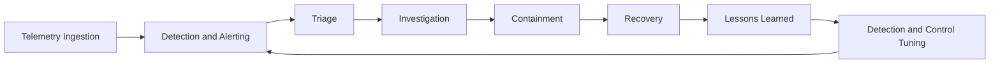

## Security Operations Center

The Security Operations Center (SOC) section is the operational security hub for this infrastructure documentation. It focuses on building a practical detection and response capability that scales from home lab environments to enterprise operations.

Use this area to define how alerts are triaged, incidents are investigated, and defensive controls are continuously improved.

## SOC Mission

- **Detect quickly** by turning telemetry into actionable alerts
- **Respond consistently** with clear workflows and escalation paths
- **Recover safely** while preserving evidence and minimizing business impact
- **Improve continuously** through lessons learned and measurable outcomes

## Core Capabilities

### Monitoring and Detection

- Log and telemetry collection from endpoints, network devices, and services
- Detection engineering aligned to known adversary techniques
- Alert tuning to reduce false positives and analyst fatigue

### Incident Response

- Severity-based triage and prioritization
- Investigation playbooks for common attack patterns
- Containment, eradication, and recovery procedures

### Threat Intelligence and Hunting

- Intelligence-informed detection updates
- Hypothesis-driven threat hunting
- Mapping activity to ATT&CK-style behaviors for consistency

### Compliance and Reporting

- Security control validation and evidence collection
- Operational metrics and trend reporting
- Post-incident reviews and remediation tracking

## Operating Model

## SOC Workflow

1. **Collect** telemetry from infrastructure, identity, and application layers.
2. **Correlate** events into prioritized alerts.
3. **Triage** alerts by severity, confidence, and business impact.
4. **Investigate** scope, root cause, and affected assets.
5. **Respond** with containment and eradication actions.
6. **Recover** services and verify security posture.
7. **Review** incident outcomes and improve detections or controls.

## Suggested Metrics

- **MTTD** (Mean Time to Detect)
- **MTTR** (Mean Time to Respond)
- Alert volume by severity and source
- False positive rate and tuning backlog
- Incident recurrence by category

## Adjacent Infrastructure Security Areas

- [Infrastructure Security](../../infrastructure/security/index.md)
- [Identity and Access Management](../../infrastructure/security/iam/index.md)
- [Compliance and Auditing](../../infrastructure/security/compliance/index.md)
- [Infrastructure Monitoring](../../infrastructure/monitoring/index.md)
- [KQL](../../infrastructure/kql/index.md)

## Next Build-Out Topics

- [SOC Analyst Playbook](soc_analyst.md)
- [Kusto Cheatsheet for SOC Analyst](kusto_cheatsheet.md)
- [Microsoft Defender Outline](ms_defender.md)
- SIEM architecture and onboarding standards
- Detection rule lifecycle and quality gates
- Incident response playbooks by scenario
- Threat hunting methodology and cadence
- SOC dashboards and executive reporting
