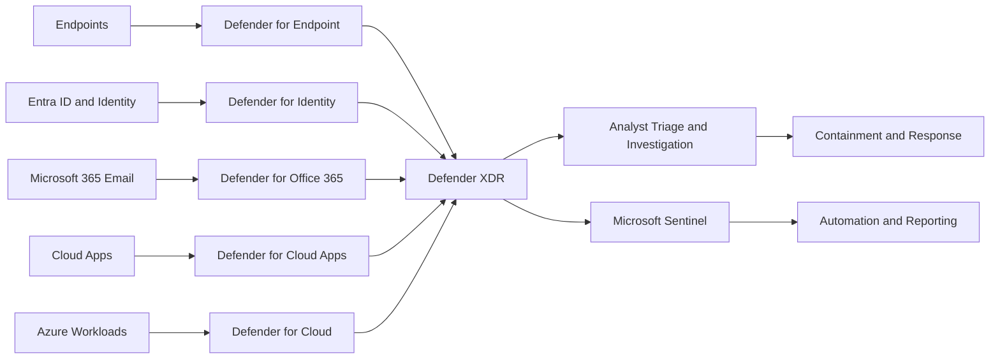

## Microsoft Defender in the SOC

This page is a build-out outline for documenting how Microsoft Defender is
used in SOC operations.

## Purpose and Scope

The purpose of this page is to define how Microsoft Defender capabilities are
used by SOC analysts to detect, investigate, and respond to threats in a
consistent way.

This section sets the operational boundary for Defender in this environment and
clarifies which workflows are owned by the SOC team.

### In Scope

- Defender signal ingestion and incident triage workflows
- Identity, endpoint, email, and cloud-app threat investigation patterns
- Standard analyst procedures for severity scoring and escalation
- Integration points between Defender and Sentinel for case handling
- Evidence collection requirements for incident response and post-incident
  review

### Out of Scope

- Tool administration tasks not performed by SOC analysts
- Long-term platform engineering decisions unrelated to detection or response
- Non-security operational monitoring and service performance troubleshooting
- Legal policy authoring outside security evidence and incident requirements

### Operational Outcomes

- Analysts follow a repeatable process from alert to containment
- Triage decisions are risk-based, documented, and auditable
- Escalations are consistent across shifts and analyst experience levels
- Investigation evidence is captured in a format suitable for follow-up,
    reporting, and compliance needs

## Platform Components

The SOC uses these platform components as a unified detection and response
stack. Each component contributes specific telemetry, detections, and response
actions.

### Microsoft Defender XDR

- Serves as the central incident and correlation layer across identity,
  endpoint, email, and cloud app signals
- Aggregates related alerts into incidents to reduce analyst triage overhead
- Provides investigation context, asset relationships, and attack story
  visibility

### Microsoft Defender for Endpoint

- Delivers endpoint telemetry such as process, file, network, and device
  behavior events
- Detects malware, ransomware, suspicious process chains, and lateral movement
- Supports response actions such as device isolation, file quarantine, and
  endpoint investigation packages

### Microsoft Defender for Identity

- Monitors identity and authentication activity for identity-focused threats
- Detects credential abuse patterns such as suspicious sign-ins and privilege
  misuse indicators
- Improves identity risk context used in analyst severity scoring and
  escalation

### Microsoft Defender for Office 365

- Provides email and collaboration threat detection for phishing, malware,
  malicious links, and spoofing
- Surfaces message-level artifacts used in business email compromise
  investigations
- Supports response actions such as message remediation and sender control

### Microsoft Defender for Cloud Apps

- Monitors SaaS activity and cloud application behavior across sanctioned and
  unsanctioned usage
- Detects risky session behavior, impossible activity patterns, and potential
  data movement anomalies
- Adds cloud app context to user and incident timelines

### Microsoft Defender for Cloud

- Contributes cloud workload and posture signals from IaaS and PaaS resources
- Highlights security misconfigurations and workload threat detections
- Supports investigation of cloud resource compromise and privilege pathways

### Microsoft Sentinel Integration

- Extends Defender investigations with SIEM-scale ingestion, retention, and
  cross-source correlation
- Supports playbooks and automation for standardized containment and
  notification workflows
- Enables centralized case management and reporting across SOC operations

### Component Ownership and Analyst Expectations

- Analysts triage and investigate incidents in Defender XDR as the primary
  workspace
- Specialized pivots are performed in component-specific portals when deeper
  artifacts are required
- Sentinel is used for cross-platform enrichment, automation, and long-horizon
  analysis

## Architecture and Data Flow

Microsoft Defender architecture in the SOC should be understood as a telemetry
pipeline that converts raw activity into analyst-ready incidents.

At a high level, data flows from protected services and endpoints into Defender
components, where signals are normalized, enriched, correlated, and surfaced
as alerts or incidents for analyst action.

### Data Sources and Connector Inventory

Key data sources typically include:

- Endpoint telemetry from managed devices
- Identity and authentication events from Entra ID and on-prem identity
  integrations
- Email and collaboration activity from Microsoft 365 workloads
- Cloud app session and access activity from monitored SaaS platforms
- Cloud workload findings and security posture signals from Azure resources

The SOC should maintain an inventory of which sources are enabled, which are
partially onboarded, and which are not yet producing production-quality data.

### Event Normalization and Enrichment Path

Raw events are not equally useful at ingest time. Defender improves detection
quality by enriching data with:

- Identity context such as user, role, and group associations
- Device posture such as compliance state, risk state, and ownership
- Email metadata such as sender, recipient, message ID, and delivery action
- Cloud context such as application name, session type, and access behavior

This enrichment stage is important because analysts should make decisions on
contextualized signals rather than isolated events.

### Alert Generation and Incident Correlation

After enrichment, Defender analytics generate alerts based on suspicious
patterns, threat intelligence, and behavioral detections.

Those alerts are then correlated into incidents when activity appears related
across users, devices, mailboxes, or workloads. This helps reduce alert fatigue
and gives analysts a broader attack narrative instead of isolated findings.

Typical correlation points include:

- Same user across sign-in, endpoint, and email signals
- Same device across malware and identity abuse indicators
- Same IP or infrastructure across multiple user investigations
- Same message campaign across multiple recipients or mailboxes

### Analyst Investigation Flow

From the analyst perspective, the operational flow is:

1. Ingest telemetry from Defender-integrated sources.
2. Normalize and enrich events with identity, device, and workload context.
3. Generate alerts through built-in and custom detections.
4. Correlate alerts into incidents where related activity exists.
5. Triage incidents in Defender XDR.
6. Pivot to supporting portals or Sentinel when deeper investigation is needed.
7. Execute containment, document findings, and escalate if required.

### Cross-Workspace and Multi-Tenant Considerations

If the organization uses multiple workspaces, tenants, or segmented operational
domains, the SOC should document:

- Where primary investigation ownership lives
- Which data sources are centralized versus locally managed
- Which incidents must be handled in Defender versus Sentinel
- How cross-tenant evidence is shared, normalized, and retained

This reduces analyst confusion when the same incident requires pivots across
multiple consoles or administrative boundaries.

## Onboarding and Configuration

Onboarding and configuration determine whether Defender produces reliable,
actionable signals or just operational noise. The SOC should treat onboarding
as a controlled rollout with validation at each stage.

### Licensing and Tenant Prerequisites

Before onboarding sources, confirm that the tenant has the required Defender
licensing, feature entitlements, and service dependencies enabled.

This usually includes:

- Appropriate Microsoft security licensing for the Defender workloads in scope
- Tenant-level security features enabled for identity, endpoint, and email
- Required integrations between Microsoft 365, Entra ID, Intune, and Azure
- Logging and retention settings that support SOC investigations

The SOC should document which features are fully licensed, partially licensed,
or planned for later enablement.

### Role-Based Access Control Model

Access to Defender should follow least-privilege principles.

Recommended access model:

- Analysts receive read and investigation permissions needed for triage and
  case handling
- Senior analysts or leads receive approved response permissions for
  containment actions
- Platform administrators retain configuration ownership separate from
  day-to-day analyst duties
- Emergency or break-glass access is tightly controlled and audited

The SOC should maintain a clear mapping between role, permissions, and
authorized actions in each Defender component.

### Endpoint Onboarding Strategy

Endpoint onboarding should be staged rather than performed as a single broad
rollout.

Recommended sequence:

1. Validate onboarding with a pilot group of known, well-managed devices.
2. Confirm telemetry quality, device inventory accuracy, and detection flow.
3. Expand to high-value or high-risk device populations.
4. Move to broad production coverage after alert quality is reviewed.

The SOC should track coverage gaps, stale devices, and onboarding failures as
operational risks.

### Identity and Email Protection Baselines

Identity and email sources often produce the most immediately actionable SOC
signals, so baseline protections should be documented clearly.

Baseline configuration should cover:

- Identity Protection risk signal availability
- Conditional Access coverage and expected enforcement paths
- Mail protection policies for phishing, spoofing, malware, and safe links
- Standard handling for mailbox rules, forwarding behavior, and user-reported
  phish workflows

Analysts should know which controls are preventive, which are detective, and
which generate investigation artifacts.

### Cloud Workload Onboarding Standards

For cloud resources and SaaS platforms, onboarding should prioritize sources
that materially improve detection or incident context.

This should include:

- A list of supported cloud applications and workloads in scope
- Minimum telemetry requirements before a source is considered production-ready
- Ownership for onboarding, validation, and ongoing maintenance
- Expected use cases for the data in investigations and reporting

Every onboarded workload should have a documented validation step proving that
signals arrive in the correct platform and can be used by analysts.

## Detection Engineering

Detection engineering is the process of turning telemetry into high-confidence,
actionable alerts that support SOC decision-making. In Microsoft Defender,
this means understanding which built-in detections are enabled, which custom
detections are required, and how alert quality is maintained over time.

### Alert Rule Catalog and Ownership

The SOC should maintain a catalog of all important detections used in
operations.

Each entry should identify:

- Detection name and platform source
- Purpose and attack behavior being detected
- Severity and expected analyst response
- Technical owner for tuning or maintenance
- Business owner or stakeholder when relevant

This catalog helps analysts understand why a detection exists and who to engage
when a rule requires tuning or exception review.

### Tuning Process for Noisy Detections

Noisy detections reduce analyst confidence and increase missed incidents.
Tuning should be a formal process rather than an ad hoc suppression activity.

Recommended tuning workflow:

1. Review repeated false positives or low-value alerts.
2. Identify the cause, such as expected admin activity or service-account
   behavior.
3. Adjust thresholds, exclusions, or supporting logic with documented
   justification.
4. Revalidate the detection after tuning to confirm risk coverage remains.

The goal is to reduce unnecessary alert volume without suppressing meaningful
attack visibility.

### Detection Validation and Quality Gates

Detections should be validated before they are treated as production-ready.

Validation should confirm:

- Required telemetry is present and reliable
- The detection triggers on representative malicious or simulated behavior
- The alert includes enough context for analysts to investigate effectively
- Response guidance is documented and aligned with the analyst playbook

Quality gates help prevent brittle or low-context detections from entering
routine SOC workflows.

### Coverage Mapping to ATT&CK Techniques

Coverage should be mapped to attacker behaviors rather than only to products or
tools.

Mapping detections to ATT&CK techniques helps the SOC:

- Understand where it has strong detection depth
- Identify gaps in privilege escalation, persistence, phishing, or lateral
  movement coverage
- Prioritize future engineering work based on realistic threat scenarios

This mapping should be reviewed periodically as platform telemetry and threat
priorities evolve.

### Change Control for Rule Deployment

Detection changes should follow lightweight but explicit change control.

Each material change should document:

- What changed and why
- Which detections or workflows are affected
- Expected effect on volume, severity, or analyst process
- Validation results before and after deployment
- Rollback plan if the change creates operational issues

This ensures that new or modified detections improve security visibility
without destabilizing analyst operations.

## Incident Response Workflow

Microsoft Defender should support a repeatable incident response workflow that
allows analysts to move from alert review to containment with clear decision
points and evidence handling expectations.

### Severity Model and Triage Criteria

Incidents should be prioritized based on business impact, confidence of
malicious activity, affected asset criticality, and evidence of privilege or
lateral movement.

Typical severity inputs include:

- Identity risk level and account privilege
- Endpoint criticality and device exposure
- Mailbox abuse indicators and phishing blast radius
- Cloud workload sensitivity and access level
- Evidence of persistence, exfiltration, or cross-user spread

The SOC should document how these factors map to High, Medium, and Low
severity so triage outcomes remain consistent across analysts and shifts.

### Investigation Steps by Signal Type

Analysts should adapt their investigation path based on the primary signal
source while maintaining a standard evidence collection process.

Common investigation pivots include:

- Identity-driven incidents: sign-in history, risk detections, group changes,
  and privilege assignments
- Endpoint-driven incidents: process chains, file activity, network behavior,
  and device isolation status
- Email-driven incidents: sender history, message distribution, URL or
  attachment indicators, and mailbox rule changes
- Cloud-driven incidents: session activity, access anomalies, resource
  modifications, and privilege pathways

Even when one signal starts the case, analysts should correlate across other
Defender components before concluding scope.

### Containment and Eradication Procedures

Containment actions should be proportional to confidence and impact.

Common Defender-supported containment actions include:

- Revoke user sessions or require password reset
- Isolate an endpoint from the network
- Quarantine files or messages
- Block malicious indicators where supported
- Escalate privileged or high-impact cases for lead approval

Eradication should focus on removing persistence, unauthorized access, and any
known malicious artifacts before returning systems or identities to normal use.

### Recovery Validation Checklist

Before closing active response, the SOC should confirm that recovery actions
have succeeded and that the original issue is no longer active.

Recovery validation should include:

- Confirming affected identities are secured and no longer show active abuse
- Confirming endpoints are no longer executing suspicious activity
- Confirming mailbox, rule, or forwarding persistence has been removed
- Confirming cloud resource access and configuration are back to approved state
- Confirming monitoring remains in place for recurrence

This step prevents premature closure while residual risk remains.

### Case Closure and Lessons Learned Process

Case closure should occur only after the incident is scoped, documented,
contained, and validated.

The final case record should include:

- Summary of what happened
- Systems, users, and data affected
- Timeline of key events and actions
- Evidence used to support conclusions
- Containment and remediation decisions
- Follow-up actions for engineering, policy, or training improvements

Lessons learned should feed back into detection tuning, runbook updates,
automation improvements, and analyst training.

## Threat Hunting

Threat hunting in Microsoft Defender should complement alert-driven operations
by proactively searching for attacker behavior that may not yet have produced a
high-confidence incident.

### Hypothesis-Driven Hunt Process

Hunts should start with a testable hypothesis rather than a generic search for
"anything suspicious".

Examples include:

- A compromised student account is being used for internal phishing
- Repeated sign-in anomalies indicate password spray against staff accounts
- Suspicious endpoint behavior may indicate low-volume malware execution
- Cloud session anomalies may reflect token theft or unauthorized access reuse

Each hunt should define scope, time window, expected indicators, and clear
criteria for escalation into an incident.

### Hunting Query Library and Naming Standard

The SOC should maintain a reusable hunt library so analysts do not rebuild the
same logic on every shift.

Each query entry should include:

- Query name and purpose
- Data sources used
- Expected output fields
- Known false-positive patterns
- Last validation date and owner

Naming should be clear and consistent so analysts can quickly locate hunts by
platform, behavior, or threat scenario.

### Hunt to Detection Promotion Workflow

Repeated successful hunts should be candidates for formal detection logic.

Promotion criteria should include:

- The behavior is repeatable and operationally relevant
- The query returns enough context for analyst action
- The false-positive rate is manageable
- The detection can be validated before production use

This process ensures that high-value hunt logic becomes durable SOC coverage
instead of remaining analyst-only knowledge.

### Threat Intelligence Ingestion and Usage

Threat intelligence should be used to guide hunt priorities, enrich
investigations, and refine detections.

Useful intelligence inputs include:

- Malicious IPs, domains, and URLs
- Known phishing themes affecting the education sector
- Identity abuse patterns and attacker tradecraft
- Malware families and infrastructure tied to current campaigns

Threat intelligence should support prioritization, not replace analyst
validation. All indicators still require environmental context before action.

## Automation and Orchestration

Automation and orchestration should reduce analyst toil while preserving
control over high-impact response actions.

### Automated Response Actions in Defender

Defender can automate low-friction actions that improve response speed when
confidence is high.

Appropriate candidates include:

- Session revocation for confirmed identity abuse
- Message remediation for known malicious mail campaigns
- File or device response actions tied to validated endpoint detections
- Alert enrichment steps that add user, device, or incident context

Automated actions should be documented so analysts understand what occurred,
why it occurred, and how to validate the result.

### Sentinel Playbooks and Trigger Policies

Sentinel playbooks should handle multi-step workflows that benefit from
consistent execution.

Examples include:

- Notifying stakeholders when high-severity incidents open
- Creating tickets or case records in downstream systems
- Enriching incidents with threat intelligence or directory context
- Running approval-driven containment sequences

Trigger policies should clearly define when automation runs automatically,
when it requires approval, and when it is disabled for manual review.

### Approval Gates for High-Impact Actions

Not all response actions should be automated without human review.

Approval gates are especially important for:

- Disabling privileged or shared accounts
- Isolating critical production endpoints
- Blocking business-critical domains or applications
- Applying tenant-wide or policy-level response changes

The SOC should document who can approve these actions and what evidence is
required before approval is granted.

### Failure Handling and Rollback Patterns

Automation should include operational safeguards.

Each automated workflow should define:

- What happens when enrichment or response steps fail
- How failures are surfaced to analysts
- Which actions can be safely retried
- How to roll back actions that cause unintended business impact

This keeps automation from becoming a hidden operational risk.

## Metrics and Reporting

Metrics and reporting should show whether Defender is improving detection,
response quality, and analyst efficiency over time.

### Mean Time to Detect

Mean time to detect measures how quickly malicious activity is surfaced after
it begins.

This metric helps the SOC understand whether telemetry coverage, detections,
and triage processes are timely enough to reduce impact.

### Mean Time to Respond

Mean time to respond measures how quickly the SOC moves from detection to a
meaningful containment or remediation action.

This metric should be interpreted alongside severity, approval workflows, and
incident complexity.

### Alert Volume by Category and Severity

Alert volume should be tracked by platform source, alert type, and severity.

This helps identify:

- Sources creating excessive operational noise
- Areas where detections are underrepresented
- Shifts in attacker behavior or campaign intensity

### False Positive Rate

False positive tracking helps determine whether detection engineering is
improving or degrading analyst effectiveness.

The SOC should measure both overall false-positive rate and the worst noisy
detections that consume disproportionate analyst time.

### Recurring Incident Categories

Recurring incident tracking reveals whether the same root causes continue to
generate cases.

This supports prioritization for:

- Detection improvements
- Policy changes
- User awareness efforts
- Hardening or engineering work

### Executive and Operational Dashboard Requirements

Dashboards should be designed for the intended audience.

Operational dashboards should emphasize queue health, detection quality,
containment speed, and active incident load.

Executive dashboards should emphasize trends, business impact, recurring risk,
and strategic improvement areas rather than raw alert volume.

## Compliance and Evidence

Compliance and evidence practices ensure that Defender-driven investigations
support both operational security and governance obligations.

### Control Mapping for Applicable Frameworks

The SOC should map Defender capabilities and workflows to the control families
relevant to the organization.

Typical mappings may include:

- Logging and monitoring controls
- Incident response controls
- Identity and access controls
- Endpoint protection and malware defense controls
- Evidence preservation and auditability requirements

This helps demonstrate how Defender supports security objectives beyond daily
incident handling.

### Audit Evidence Collection Process

Evidence collection should be consistent, minimal, and defensible.

The SOC should define:

- Which artifacts must be captured for each incident type
- How screenshots, exports, message IDs, and log references are recorded
- Where evidence is stored
- How evidence integrity and access are controlled

Analysts should collect enough evidence to support conclusions without creating
unnecessary data sprawl.

### Data Retention and Legal Hold Requirements

Retention requirements affect how long evidence and telemetry remain useful for
investigations and audit support.

The SOC should document:

- Standard retention periods for Defender and Sentinel data
- Conditions that require extended retention or legal hold
- Ownership for approving retention exceptions
- Procedures for preserving high-value evidence during significant incidents

### Access Review and Segregation of Duties Checks

Regular access review is necessary to ensure Defender permissions remain
appropriate.

Reviews should confirm:

- Analysts retain only the access required for their role
- Response permissions are limited to approved personnel
- Configuration and operational responsibilities remain separated
- Departed or reassigned users no longer retain investigation or admin access

This reduces both security risk and audit findings.

## Operational Runbooks to Add

The Defender program should be supported by scenario-specific runbooks that let
analysts move quickly without improvising high-risk decisions.

Priority runbooks to develop include:

### Malware Outbreak Response

Runbook: [Malware Outbreak Response](malware_outbreak_response.md)

- Initial triage of endpoint alerts and affected device scope
- Isolation, quarantine, and reimage decision criteria
- User communication and business impact coordination
- Recovery validation before returning endpoints to service

### Identity Compromise Response

Runbook: [Identity Compromise Response](identity_compromise_response.md)

- Sign-in and privilege review steps
- Session revocation and password reset actions
- Group membership and role validation checks
- Monitoring steps for follow-on abuse after containment

### Phishing and Business Email Compromise Response

Runbook: [Phishing and Business Email Compromise Response](phishing_bec_response.md)

- Message identification and campaign scope analysis
- Sender, recipient, and mailbox artifact review
- Mail remediation and user-notification steps
- Post-incident control improvements for mail protection and awareness

### Suspicious Cloud Activity Response

Runbook: [Suspicious Cloud Activity Response](suspicious_cloud_activity_response.md)

- Session and workload context collection
- Resource modification and privilege pathway review
- Containment decision points for high-risk cloud resources
- Recovery validation for cloud configuration and access state

### Privileged Access Abuse Response

Runbook: [Privileged Access Abuse Response](privileged_access_abuse_response.md)

- Role assignment review and recent privilege-change validation
- Approval and escalation requirements for privileged containment
- Evidence collection expectations for sensitive administrative actions
- Post-incident hardening and access review follow-up

## Implementation Backlog

The implementation backlog should prioritize the smallest set of work that
materially improves SOC readiness first, then build toward broader maturity.

### Near-Term Priorities

- Define minimum viable Defender deployment for identity, endpoint, and email
- Document approved analyst roles and response permissions
- Validate core telemetry coverage and incident triage workflow
- Publish the first set of analyst playbooks and hunt references

### Mid-Term Priorities

- Build a phase-by-phase onboarding plan for remaining workloads
- Establish production and test validation process for detections and
  automation
- Add reusable query references and runbook links into SOC documentation
- Create architecture diagrams that show data flow and operational ownership

### Long-Term Priorities

- Mature detection-to-hunt promotion workflow
- Expand automation coverage with approval-aware response actions
- Add reporting views for operational and executive stakeholders
- Build ownership matrix for platform administration, engineering, and SOC use

## Related Pages

- [SOC Home](index.md)
- [Infrastructure Security](../../infrastructure/security/index.md)
- [Identity and Access Management](../../infrastructure/security/iam/index.md)
- [Compliance and Auditing](../../infrastructure/security/compliance/index.md)
