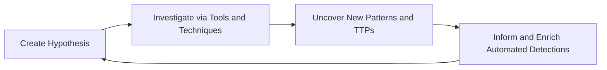

Threat hunting is the proactive, hypothesis-driven search through networks, endpoints, and datasets to detect malicious activity that has evaded existing automated security controls. Unlike alert-driven monitoring, hunting assumes a breach may already have occurred and sets out to prove or disprove that assumption.

> [!NOTE]
> Threat hunting complements - it does not replace - your automated detections. The goal of a hunt is not only to find an adversary, but to turn every successful hunt into a durable, automated detection so the same activity is caught for you next time.

## Why hunt?

Automated tools are excellent at catching *known* bad activity, but adversaries deliberately operate below the threshold of signatures and rules. Hunting closes that gap by:

- **Finding what alerts miss** - novel tradecraft, living-off-the-land techniques, and slow, low-and-slow campaigns.
- **Reducing dwell time** - the time an attacker operates undetected, which is measured in weeks or months for many breaches.
- **Improving detections** - each hunt produces new analytics, tuned rules, and better telemetry coverage.
- **Understanding your environment** - hunters build deep knowledge of what "normal" looks like, which is the prerequisite for spotting "abnormal."

## Hunting vs. monitoring vs. incident response

| Activity | Trigger | Posture | Primary output |
| -------- | ------- | ------- | -------------- |
| Monitoring / alerting | A rule or signature fires | Reactive | An alert to triage |
| Threat hunting | A hypothesis about adversary activity | Proactive | Findings and new detections |
| Incident response | A confirmed incident | Reactive | Containment and recovery |

A hunt frequently *feeds* the other two: a hunt that uncovers real malicious activity hands off to incident response, and a hunt that finds a repeatable pattern hands a new detection to monitoring.

## The hunt loop

Most mature hunting programs follow a cyclical process. This section uses the widely referenced four-stage loop:

1. **Create a hypothesis** - a testable statement about how an adversary might be operating in your environment.
2. **Investigate** - use tooling and data to gather evidence for or against the hypothesis.
3. **Uncover patterns and TTPs** - identify the tactics, techniques, and procedures revealed by the investigation.
4. **Inform and enrich** - document findings and convert them into automated detections and improved telemetry.

## In this section

1. [Methodology and frameworks](methodology.md) - The hunt loop, hypothesis-driven hunting, hunt types, and frameworks such as PEAK and TaHiTI.
2. [Data sources and telemetry](data-sources.md) - The logs and signals a hunt depends on, and how to assess coverage.
3. [Hunting with MITRE ATT&CK](mitre-attack.md) - Using the ATT&CK knowledge base to prioritize and structure hunts.
4. [Analytic techniques](techniques.md) - Searching, clustering, grouping, stack counting, and baselining.
5. [Example hunts](example-hunts.md) - Practical, query-driven hunts you can adapt to your environment.
6. [Tools and references](references.md) - Platforms, open-source tooling, and further reading.

## Prerequisites

Threat hunting builds on several other disciplines. Before diving in, it helps to be comfortable with:

- A query language for your log platform - this section uses [Kusto Query Language (KQL)](../../infrastructure/kql/index.md) for its examples.
- The [MITRE ATT&CK](mitre-attack.md) framework for describing adversary behavior.
- Your organization's log sources and where they are centralized (SIEM, data lake, or EDR console).

> [!TIP]
> If you are new to querying security logs, work through the [KQL section](../../infrastructure/kql/index.md) first. Nearly every hunt in this guide is expressed as a KQL query against Microsoft Sentinel or Defender data.
