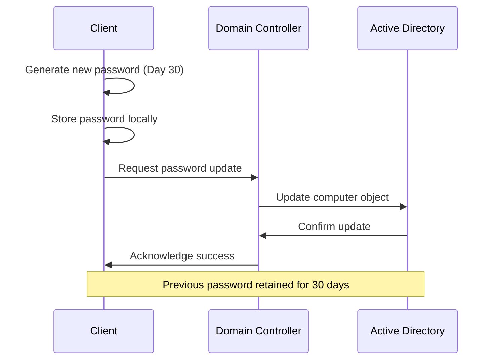

## Overview

The secure channel is a critical authentication mechanism that maintains trust between domain-joined computers and Active Directory domain controllers. When this relationship becomes corrupted, users experience authentication failures and the infamous "trust relationship" error. This guide provides comprehensive procedures for diagnosing and repairing secure channel issues across modern Windows environments.

## Executive Summary

Secure channel problems manifest as:

- **Authentication failures** for domain users on affected computers
- **"Trust relationship failed"** error messages during logon attempts
- **Group Policy processing failures** on client computers
- **Network resource access issues** for domain-authenticated users

### Common Scenarios

- **Network connectivity issues** during password refresh cycles
- **System clock synchronization problems** causing authentication timeouts
- **Domain controller unavailability** during scheduled password changes
- **Computer account corruption** in Active Directory
- **Registry corruption** on client computers

## Understanding Secure Channel Authentication

### How Secure Channels Work

Each domain-joined computer maintains a **machine account password** that enables secure communication with domain controllers:

1. **Password Creation**: Generated during domain join process
2. **Automatic Refresh**: Updated every 30 days by default
3. **Dual Storage**: Current and previous passwords stored in AD
4. **Local Storage**: Password hash stored in local registry
5. **Authentication**: Used for computer authentication and secure channel establishment

### Password Refresh Process



### Registry Storage Locations

**Windows NT/2000/XP:**

```registry
HKEY_LOCAL_MACHINE\SECURITY\Policy\Secrets\$MACHINE.ACC
```

**Windows Vista and later:**

```registry
HKEY_LOCAL_MACHINE\SECURITY\Policy\Secrets\$MACHINE.ACC\CurrVal
HKEY_LOCAL_MACHINE\SECURITY\Policy\Secrets\$MACHINE.ACC\OldVal
```

## Prerequisites

### Administrative Requirements

**Required Permissions:**

- **Local Administrator** privileges on the affected computer
- **Domain User** account with permission to reset computer passwords
- **Physical or remote access** to the affected computer

### System Requirements

**Supported Operating Systems:**

- Windows 10 (version 1607 and later)
- Windows 11 (all versions)
- Windows Server 2016 and later
- Windows Server Core installations

**Required Tools:**

- **PowerShell 5.1 or later** (built-in on modern Windows)
- **Remote Server Administration Tools (RSAT)** for advanced scenarios
- **Active Directory PowerShell module** (installed with RSAT)

### Network Connectivity

**Domain Controller Access:**

- **Port 389** (LDAP) - Required for authentication
- **Port 88** (Kerberos) - Required for secure authentication
- **Port 53** (DNS) - Required for domain controller location
- **Time synchronization** - Computer clock within 5 minutes of domain controllers

## Diagnostic Procedures

### Initial Assessment

Before attempting repairs, perform comprehensive diagnostics to identify the root cause:

```powershell
# Test secure channel status
Test-ComputerSecureChannel -Verbose

# Check domain controller connectivity
Test-NetConnection -ComputerName (Get-ADDomain).PDCEmulator -Port 389

# Verify time synchronization
w32tm /query /status

# Check computer account status
Get-ADComputer -Identity $env:COMPUTERNAME -Properties PasswordLastSet, LastLogonDate
```

### Advanced Diagnostics

**Comprehensive System Assessment:**

```powershell
function Test-SecureChannelHealth {
    [CmdletBinding()]
    param()
    
    Write-Host "=== Secure Channel Health Assessment ===" -ForegroundColor Green
    
    # Basic connectivity tests
    Write-Host "`n1. Testing Domain Controller Connectivity..." -ForegroundColor Yellow
    try {
        $Domain = Get-ADDomain
        $PDC = $Domain.PDCEmulator
        
        Write-Host "  Domain: $($Domain.DNSRoot)" -ForegroundColor Gray
        Write-Host "  PDC Emulator: $PDC" -ForegroundColor Gray
        
        $ConnTest = Test-NetConnection -ComputerName $PDC -Port 389 -WarningAction SilentlyContinue
        if ($ConnTest.TcpTestSucceeded) {
            Write-Host "  ✓ LDAP connectivity successful" -ForegroundColor Green
        } else {
            Write-Host "  ✗ LDAP connectivity failed" -ForegroundColor Red
        }
    }
    catch {
        Write-Host "  ✗ Domain controller discovery failed: $($_.Exception.Message)" -ForegroundColor Red
    }
    
    # Time synchronization check
    Write-Host "`n2. Testing Time Synchronization..." -ForegroundColor Yellow
    try {
        $TimeStatus = w32tm /query /status
        if ($TimeStatus -match "Source.*domain.*hierarchy") {
            Write-Host "  ✓ Time synchronization configured properly" -ForegroundColor Green
        } else {
            Write-Host "  ⚠ Time synchronization may be misconfigured" -ForegroundColor Yellow
        }
    }
    catch {
        Write-Host "  ✗ Time synchronization check failed" -ForegroundColor Red
    }
    
    # Secure channel test
    Write-Host "`n3. Testing Secure Channel..." -ForegroundColor Yellow
    try {
        $SecureChannelTest = Test-ComputerSecureChannel
        if ($SecureChannelTest) {
            Write-Host "  ✓ Secure channel is healthy" -ForegroundColor Green
        } else {
            Write-Host "  ✗ Secure channel is broken" -ForegroundColor Red
        }
    }
    catch {
        Write-Host "  ✗ Secure channel test failed: $($_.Exception.Message)" -ForegroundColor Red
    }
    
    # Computer account information
    Write-Host "`n4. Computer Account Information..." -ForegroundColor Yellow
    try {
        $Computer = Get-ADComputer -Identity $env:COMPUTERNAME -Properties PasswordLastSet, LastLogonDate, OperatingSystem
        
        Write-Host "  Computer Name: $($Computer.Name)" -ForegroundColor Gray
        Write-Host "  Operating System: $($Computer.OperatingSystem)" -ForegroundColor Gray
        Write-Host "  Password Last Set: $($Computer.PasswordLastSet)" -ForegroundColor Gray
        Write-Host "  Last Logon: $($Computer.LastLogonDate)" -ForegroundColor Gray
        
        # Calculate password age
        $PasswordAge = (Get-Date) - $Computer.PasswordLastSet
        if ($PasswordAge.Days -gt 35) {
            Write-Host "  ⚠ Password is $($PasswordAge.Days) days old (consider refresh)" -ForegroundColor Yellow
        } else {
            Write-Host "  ✓ Password age is acceptable ($($PasswordAge.Days) days)" -ForegroundColor Green
        }
    }
    catch {
        Write-Host "  ✗ Computer account lookup failed: $($_.Exception.Message)" -ForegroundColor Red
    }
    
    Write-Host "`n=== Assessment Complete ===" -ForegroundColor Green
}

# Run comprehensive assessment
Test-SecureChannelHealth
```

## Repair Procedures

### Method 1: PowerShell Test-ComputerSecureChannel (Recommended)

**Modern PowerShell Approach (Windows 10/11, Server 2016+):**

```powershell
# Step 1: Test current secure channel status
Test-ComputerSecureChannel -Verbose

# Step 2: Repair secure channel if needed
if (-not (Test-ComputerSecureChannel)) {
    Write-Host "Secure channel is broken. Attempting repair..." -ForegroundColor Yellow
    
    # Repair with domain admin credentials
    $Credential = Get-Credential -Message "Enter domain admin credentials"
    Test-ComputerSecureChannel -Repair -Credential $Credential
    
    # Verify repair
    if (Test-ComputerSecureChannel) {
        Write-Host "✓ Secure channel repair successful" -ForegroundColor Green
    } else {
        Write-Host "✗ Secure channel repair failed" -ForegroundColor Red
    }
}

# Step 3: Restart computer to complete repair
Restart-Computer -Confirm
```

### Method 2: Reset-ComputerMachinePassword

**For PowerShell 3.0 and later:**

```powershell
# Enhanced machine password reset with validation
function Reset-MachinePassword {
    [CmdletBinding()]
    param(
        [Parameter(Mandatory=$false)]
        [PSCredential]$Credential,
        
        [Parameter(Mandatory=$false)]
        [switch]$Force
    )
    
    Write-Host "=== Machine Password Reset Procedure ===" -ForegroundColor Green
    
    # Pre-reset validation
    Write-Host "`n1. Pre-reset validation..." -ForegroundColor Yellow
    $InitialTest = Test-ComputerSecureChannel
    Write-Host "  Initial secure channel status: $InitialTest" -ForegroundColor Gray
    
    if ($InitialTest -and -not $Force) {
        Write-Host "  Secure channel appears healthy. Use -Force to reset anyway." -ForegroundColor Yellow
        return
    }
    
    # Get credentials if not provided
    if (-not $Credential) {
        $Credential = Get-Credential -Message "Enter domain admin credentials for password reset"
    }
    
    # Reset machine password
    Write-Host "`n2. Resetting machine password..." -ForegroundColor Yellow
    try {
        Reset-ComputerMachinePassword -Credential $Credential -ErrorAction Stop
        Write-Host "  ✓ Machine password reset completed" -ForegroundColor Green
    }
    catch {
        Write-Host "  ✗ Machine password reset failed: $($_.Exception.Message)" -ForegroundColor Red
        return
    }
    
    # Post-reset validation
    Write-Host "`n3. Post-reset validation..." -ForegroundColor Yellow
    Start-Sleep -Seconds 5  # Allow time for changes to propagate
    
    $PostTest = Test-ComputerSecureChannel
    if ($PostTest) {
        Write-Host "  ✓ Secure channel validation successful" -ForegroundColor Green
        Write-Host "`n⚠ Restart required to complete the process" -ForegroundColor Yellow
    } else {
        Write-Host "  ✗ Secure channel validation failed" -ForegroundColor Red
        Write-Host "  Consider manual troubleshooting or domain rejoin" -ForegroundColor Yellow
    }
}

# Execute password reset
Reset-MachinePassword
```

### Method 3: Netdom Command (Legacy Support)

**For older systems or when PowerShell is unavailable:**

```cmd
REM Install RSAT if needed (Windows 10/11)
DISM /Online /Add-Capability /CapabilityName:Rsat.ActiveDirectory.DS-LDS.Tools~~~~0.0.1.0

REM Reset computer password using netdom
netdom resetpwd /server:dc01.contoso.com /userd:CONTOSO\administrator /passwordd:*

REM Alternative syntax with specific user
netdom resetpwd /s:dc01.contoso.com /ud:CONTOSO\administrator /pd:*
```

**Netdom Parameters Explained:**

- `/server` or `/s`: Target domain controller
- `/userd` or `/ud`: Domain user with reset permissions
- `/passwordd` or `/pd`: User password (* for prompt)

### Method 4: Advanced Reset with NLTest

**For complex scenarios requiring detailed diagnostics:**

```powershell
# Comprehensive NLTest-based reset procedure
function Reset-SecureChannelAdvanced {
    param(
        [string]$DomainController,
        [PSCredential]$Credential
    )
    
    Write-Host "=== Advanced Secure Channel Reset ===" -ForegroundColor Green
    
    # Step 1: Test current trust relationship
    Write-Host "`n1. Testing current trust relationship..." -ForegroundColor Yellow
    $TrustTest = nltest /sc_query:$env:USERDOMAIN
    Write-Host $TrustTest -ForegroundColor Gray
    
    # Step 2: Discover domain controllers
    Write-Host "`n2. Discovering domain controllers..." -ForegroundColor Yellow
    $DCList = nltest /dclist:$env:USERDOMAIN
    Write-Host $DCList -ForegroundColor Gray
    
    # Step 3: Reset secure channel
    Write-Host "`n3. Resetting secure channel..." -ForegroundColor Yellow
    if ($DomainController) {
        $ResetResult = nltest /sc_reset:$env:USERDOMAIN /server:$DomainController
    } else {
        $ResetResult = nltest /sc_reset:$env:USERDOMAIN
    }
    Write-Host $ResetResult -ForegroundColor Gray
    
    # Step 4: Verify reset
    Write-Host "`n4. Verifying reset..." -ForegroundColor Yellow
    Start-Sleep -Seconds 10
    $VerifyTest = nltest /sc_query:$env:USERDOMAIN
    
    if ($VerifyTest -match "SUCCESS") {
        Write-Host "  ✓ Secure channel reset successful" -ForegroundColor Green
    } else {
        Write-Host "  ✗ Secure channel reset verification failed" -ForegroundColor Red
    }
}

# Execute advanced reset
Reset-SecureChannelAdvanced
```

## Modern Scenarios and Considerations

### Azure AD Joined Devices

**For Azure AD joined devices, use different procedures:**

```powershell
# Check Azure AD join status
dsregcmd /status

# Azure AD join troubleshooting
if ((dsregcmd /status) -match "AzureAdJoined : YES") {
    Write-Host "Device is Azure AD joined - use Azure AD troubleshooting procedures" -ForegroundColor Yellow
    
    # Test Azure AD connectivity
    Test-NetConnection login.microsoftonline.com -Port 443
    
    # Check for hybrid join issues
    if ((dsregcmd /status) -match "DomainJoined : YES") {
        Write-Host "Hybrid joined device detected" -ForegroundColor Yellow
        # Continue with traditional secure channel reset
    }
}
```

### Hybrid Azure AD Join Scenarios

**For hybrid-joined devices, address both on-premises and cloud authentication:**

```powershell
function Repair-HybridJoinTrust {
    Write-Host "=== Hybrid Azure AD Join Trust Repair ===" -ForegroundColor Green
    
    # Check on-premises domain trust
    Write-Host "`n1. Testing on-premises domain trust..." -ForegroundColor Yellow
    $OnPremTrust = Test-ComputerSecureChannel
    Write-Host "  On-premises trust: $OnPremTrust" -ForegroundColor Gray
    
    # Check Azure AD connectivity
    Write-Host "`n2. Testing Azure AD connectivity..." -ForegroundColor Yellow
    $AzureADTest = Test-NetConnection login.microsoftonline.com -Port 443
    Write-Host "  Azure AD connectivity: $($AzureADTest.TcpTestSucceeded)" -ForegroundColor Gray
    
    # Repair on-premises trust if needed
    if (-not $OnPremTrust) {
        Write-Host "`n3. Repairing on-premises trust..." -ForegroundColor Yellow
        $Credential = Get-Credential -Message "Enter domain admin credentials"
        Test-ComputerSecureChannel -Repair -Credential $Credential
    }
    
    # Check device registration status
    Write-Host "`n4. Checking device registration..." -ForegroundColor Yellow
    $DeviceStatus = dsregcmd /status
    
    if ($DeviceStatus -match "DomainJoined.*YES.*AzureAdJoined.*YES") {
        Write-Host "  ✓ Hybrid join configuration detected" -ForegroundColor Green
    } else {
        Write-Host "  ⚠ Hybrid join configuration issue detected" -ForegroundColor Yellow
        Write-Host "  Consider running: dsregcmd /join" -ForegroundColor Gray
    }
}

# Execute hybrid join repair
Repair-HybridJoinTrust
```

## Troubleshooting Common Issues

### Issue: "Trust Relationship Failed" Error

**Symptoms:**

- Users cannot log in with domain credentials
- Error message: "The trust relationship between this workstation and the primary domain failed"
- Local administrator accounts still work

**Resolution Steps:**

1. **Immediate Access Recovery**

```powershell
# Log in with local administrator account
# Open elevated PowerShell

# Quick secure channel test and repair
if (-not (Test-ComputerSecureChannel)) {
    $DomainCred = Get-Credential -Message "Enter domain admin credentials"
    Test-ComputerSecureChannel -Repair -Credential $DomainCred
    
    # Restart computer
    Restart-Computer -Force
}
```

1. **Alternative Recovery Methods**

```powershell
# Method 1: Reset machine password
Reset-ComputerMachinePassword -Credential (Get-Credential)

# Method 2: Use netdom (if PowerShell fails)
netdom resetpwd /server:dc01.contoso.com /userd:contoso\administrator /passwordd:*

# Method 3: Rejoin domain (last resort)
Remove-Computer -Credential (Get-Credential) -PassThru -Verbose -Restart
```

### Issue: Authentication Delays and Timeouts

**Symptoms:**

- Slow login process
- Group Policy processing delays
- Network resource access timeouts

**Resolution Steps:**

1. **Time Synchronization Fix**

```powershell
# Check current time configuration
w32tm /query /configuration

# Synchronize with domain controllers
w32tm /resync /rediscover

# Configure proper time source
w32tm /config /manualpeerlist:"dc01.contoso.com,dc02.contoso.com" /syncfromflags:manual
```

1. **DNS Resolution Issues**

```powershell
# Test DNS resolution for domain controllers
Resolve-DnsName -Name $env:USERDNSDOMAIN -Type SRV

# Flush DNS cache
Clear-DnsClientCache

# Reset network adapter if needed
Reset-NetAdapter -Name "Ethernet" -Confirm:$false
```

### Issue: Computer Account Corruption

**Symptoms:**

- Secure channel test fails consistently
- Computer account shows unusual properties in AD
- Authentication works sporadically

**Resolution Steps:**

1. **Computer Account Validation**

```powershell
# Check computer account status in AD
Get-ADComputer -Identity $env:COMPUTERNAME -Properties *

# Look for account flags that indicate problems
$Computer = Get-ADComputer -Identity $env:COMPUTERNAME -Properties UserAccountControl
if ($Computer.UserAccountControl -band 0x0002) {
    Write-Host "Computer account is disabled" -ForegroundColor Red
}

# Reset computer account if corrupted
Set-ADComputer -Identity $env:COMPUTERNAME -Reset
```

1. **Manual Computer Account Recreation**

```powershell
# Last resort: Remove and recreate computer account
# WARNING: This will require domain rejoin

# Remove computer from domain
Remove-Computer -Credential (Get-Credential) -PassThru -Verbose

# Delete computer account from AD (run on domain controller)
Remove-ADComputer -Identity $env:COMPUTERNAME -Confirm

# Rejoin domain
Add-Computer -DomainName contoso.com -Credential (Get-Credential) -Restart
```

## Security Considerations

### Least Privilege Access

**Account Permissions for Reset Operations:**

```powershell
# Create dedicated service account for computer resets
New-ADUser -Name "ComputerResetSvc" -UserPrincipalName "computerreset@contoso.com" -AccountPassword (ConvertTo-SecureString "P@ssw0rd123!" -AsPlainText -Force) -Enabled $true

# Grant minimal permissions for computer password resets
$User = Get-ADUser -Identity "ComputerResetSvc"
$Computers = Get-ADOrganizationalUnit -Filter "Name -eq 'Computers'"

# Grant Reset Password permission on computer objects
$Acl = Get-Acl -Path "AD:\$($Computers.DistinguishedName)"
$AccessRule = New-Object System.DirectoryServices.ActiveDirectoryAccessRule(
    $User.SID, 
    [System.DirectoryServices.ActiveDirectoryRights]::ResetPassword,
    [System.Security.AccessControl.AccessControlType]::Allow
)
$Acl.SetAccessRule($AccessRule)
Set-Acl -Path "AD:\$($Computers.DistinguishedName)" -AclObject $Acl
```

### Audit and Monitoring

**Enable Secure Channel Monitoring:**

```powershell
# Configure audit policy for computer account changes
auditpol /set /subcategory:"Computer Account Management" /success:enable /failure:enable

# Create event log monitoring for secure channel failures
$EventQuery = @"
<QueryList>
  <Query Id="0" Path="System">
    <Select Path="System">*[System[(EventID=5722)]]</Select>
  </Query>
</QueryList>
"@

# Monitor for secure channel failures
Register-WmiEvent -Query "SELECT * FROM Win32_NTLogEvent WHERE EventCode = 5722" -Action {
    Write-EventLog -LogName Application -Source "SecureChannelMonitor" -EventId 1001 -Message "Secure channel failure detected on $($Event.SourceEventArgs.NewEvent.ComputerName)"
}
```

### Password Policy Considerations

**Machine Account Password Policy:**

```powershell
# Check current machine account password policy
Get-ADDefaultDomainPasswordPolicy

# Configure machine account password change frequency (default: 30 days)
# Registry modification on clients:
$RegPath = "HKLM:\SYSTEM\CurrentControlSet\Services\Netlogon\Parameters"
Set-ItemProperty -Path $RegPath -Name "MaximumPasswordAge" -Value 30
```

## Prevention and Maintenance

### Proactive Monitoring

**Automated Secure Channel Health Checks:**

```powershell
# Scheduled task for regular secure channel monitoring
$TaskAction = New-ScheduledTaskAction -Execute "PowerShell.exe" -Argument "-Command `"if (-not (Test-ComputerSecureChannel)) { Write-EventLog -LogName Application -Source 'SecureChannelMonitor' -EventId 1002 -Message 'Secure channel failure detected' }`""

$TaskTrigger = New-ScheduledTaskTrigger -Daily -At "02:00AM"

$TaskSettings = New-ScheduledTaskSettingsSet -ExecutionTimeLimit "00:05:00" -RestartCount 3

Register-ScheduledTask -TaskName "SecureChannelHealthCheck" -Action $TaskAction -Trigger $TaskTrigger -Settings $TaskSettings -User "SYSTEM" -RunLevel Highest
```

### Group Policy Configuration

**Recommended Group Policy Settings:**

```powershell
# Export current relevant GPO settings
Get-GPOReport -Name "Default Domain Policy" -ReportType HTML -Path "C:\Temp\GPOReport.html"

# Key settings to review:
# Computer Configuration > Policies > Windows Settings > Security Settings > Local Policies > Security Options
# - Network security: Force logoff when logon time expires
# - Network security: Do not store LAN Manager hash value on next password change
# - Microsoft network client: Digitally sign communications (always)
```

## Performance Impact and Optimization

### Resource Utilization

**Monitor Secure Channel Performance:**

```powershell
# Performance counter monitoring for authentication
$Counters = @(
    "\NTLM\NTLM Authentications",
    "\Kerberos v5\Authentications/sec",
    "\Security System-Wide Statistics\NTLM Authentications"
)

Get-Counter -Counter $Counters -SampleInterval 5 -MaxSamples 12
```

### Network Optimization

**Optimize Domain Controller Communication:**

```powershell
# Configure preferred domain controllers via registry
$RegPath = "HKLM:\SYSTEM\CurrentControlSet\Services\Netlogon\Parameters"

# Set site-aware DC locator
Set-ItemProperty -Path $RegPath -Name "SiteCoverage" -Value 1

# Configure DC locator timeout values
Set-ItemProperty -Path $RegPath -Name "NegativeCachePeriod" -Value 45
```

## Related Documentation

### Microsoft Official Resources

- [Machine Account Password Process](https://docs.microsoft.com/en-us/troubleshoot/windows-server/identity/machine-account-password-process)
- [Test-ComputerSecureChannel Documentation](https://docs.microsoft.com/en-us/powershell/module/microsoft.powershell.management/test-computersecurechannel)
- [Domain Controller Locator Process](https://docs.microsoft.com/en-us/openspecs/windows_protocols/ms-adts/4e1cc7cf-d69a-47f7-bb9f-dd93b2bd3d0e)

### Internal Documentation Links

- [Active Directory Security Best Practices](../Security/index.md)
- [Group Policy Management](../GroupPolicy/index.md)
- [Domain Controller Maintenance](../DomainControllers/index.md)

### Troubleshooting Tools

- **Event Viewer**: System and Security logs for authentication events
- **NLTest**: Domain trust and secure channel diagnostics
- **DCDiag**: Comprehensive domain controller diagnostics
- **RepAdmin**: Active Directory replication monitoring

This comprehensive guide provides enterprise-ready procedures for managing secure channel relationships in modern Active Directory environments, with emphasis on automation, security, and proactive maintenance.
