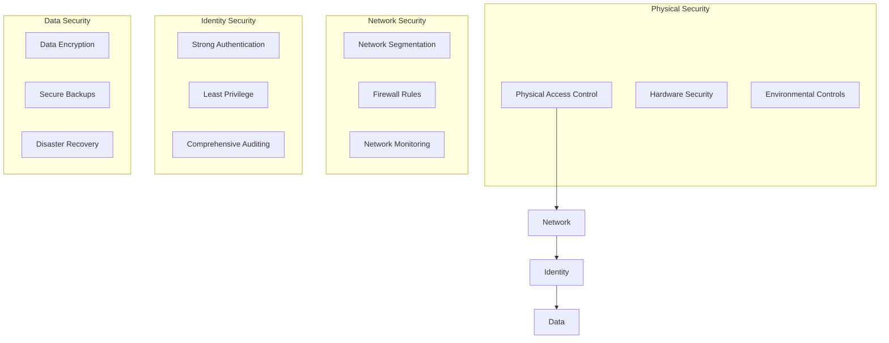

## Active Directory Security Best Practices

Comprehensive security guidelines and best practices for hardening Active Directory environments against modern threats and attack vectors.

## Core Security Principles

### Defense in Depth Strategy



## Domain Controller Security

### Hardening Domain Controllers

```powershell
# Domain Controller Security Configuration Script
function Set-DomainControllerSecurity {
    [CmdletBinding()]
    param(
        [Parameter(Mandatory)]
        [string[]]$DomainControllers,
        
        [switch]$ApplyGPOSettings,
        [switch]$ConfigureAuditing,
        [switch]$EnableAdvancedSecurity
    )
    
    foreach ($DC in $DomainControllers) {
        Write-Host "Configuring security for Domain Controller: $DC" -ForegroundColor Green
        
        try {
            # Test connectivity
            if (-not (Test-Connection -ComputerName $DC -Count 2 -Quiet)) {
                Write-Warning "Cannot reach $DC. Skipping..."
                continue
            }
            
            # Configure Windows Firewall
            Invoke-Command -ComputerName $DC -ScriptBlock {
                Write-Host "Configuring Windows Firewall..." -ForegroundColor Yellow
                
                # Enable Windows Firewall for all profiles
                Set-NetFirewallProfile -Profile Domain,Public,Private -Enabled True
                
                # Configure specific AD-related rules
                New-NetFirewallRule -DisplayName "AD DS LDAP" -Direction Inbound -Protocol TCP -LocalPort 389 -Action Allow
                New-NetFirewallRule -DisplayName "AD DS LDAPS" -Direction Inbound -Protocol TCP -LocalPort 636 -Action Allow
                New-NetFirewallRule -DisplayName "AD DS Global Catalog" -Direction Inbound -Protocol TCP -LocalPort 3268 -Action Allow
                New-NetFirewallRule -DisplayName "AD DS Global Catalog SSL" -Direction Inbound -Protocol TCP -LocalPort 3269 -Action Allow
                New-NetFirewallRule -DisplayName "Kerberos" -Direction Inbound -Protocol TCP -LocalPort 88 -Action Allow
                New-NetFirewallRule -DisplayName "DNS" -Direction Inbound -Protocol TCP -LocalPort 53 -Action Allow
                
                # Block unnecessary services
                New-NetFirewallRule -DisplayName "Block SMBv1" -Direction Inbound -Protocol TCP -LocalPort 445 -Action Block
            }
            
            # Configure Security Policies
            if ($ApplyGPOSettings) {
                Write-Host "Applying security policies to $DC..." -ForegroundColor Yellow
                Invoke-Command -ComputerName $DC -ScriptBlock {
                    # Disable SMBv1
                    Disable-WindowsOptionalFeature -Online -FeatureName SMB1Protocol -NoRestart
                    
                    # Configure password policies
                    secedit /configure /cfg C:\Windows\System32\GroupPolicy\Machine\Microsoft\Windows NT\SecEdit\GptTmpl.inf
                    
                    # Enable credential guard if supported
                    if (Get-CimInstance -ClassName Win32_DeviceGuard | Where-Object {$_.VirtualizationBasedSecurityStatus -eq 2}) {
                        bcdedit /set {0cb3b571-2f2e-4343-a879-d86a476d7215} loadoptions DISABLE-LSA-ISO
                    }
                }
            }
            
            # Configure Advanced Auditing
            if ($ConfigureAuditing) {
                Write-Host "Configuring advanced auditing on $DC..." -ForegroundColor Yellow
                $this.ConfigureAdvancedAuditing($DC)
            }
            
            # Additional security configurations
            if ($EnableAdvancedSecurity) {
                Write-Host "Applying advanced security configurations to $DC..." -ForegroundColor Yellow
                $this.EnableAdvancedSecurityFeatures($DC)
            }
            
            Write-Host "Security configuration completed for $DC" -ForegroundColor Green
        }
        catch {
            Write-Error "Failed to configure security for $DC : $($_.Exception.Message)"
        }
    }
}

# Configure Advanced Auditing
function ConfigureAdvancedAuditing {
    [CmdletBinding()]
    param([string]$DomainController)
    
    Invoke-Command -ComputerName $DomainController -ScriptBlock {
        # Enable advanced audit policies
        auditpol /set /subcategory:"Account Logon" /success:enable /failure:enable
        auditpol /set /subcategory:"Account Management" /success:enable /failure:enable
        auditpol /set /subcategory:"Directory Service Access" /success:enable /failure:enable
        auditpol /set /subcategory:"Logon/Logoff" /success:enable /failure:enable
        auditpol /set /subcategory:"Object Access" /success:enable /failure:enable
        auditpol /set /subcategory:"Policy Change" /success:enable /failure:enable
        auditpol /set /subcategory:"Privilege Use" /success:enable /failure:enable
        auditpol /set /subcategory:"System" /success:enable /failure:enable
        
        # Configure SACL for critical AD objects
        $RootDSE = [ADSI]"LDAP://RootDSE"
        $ConfigNC = $RootDSE.configurationNamingContext
        $SchemaNC = $RootDSE.schemaNamingContext
        
        # Enable auditing on Schema partition
        dsacls $SchemaNC /G "Everyone:CA;Write All Properties;All"
        
        # Enable auditing on Configuration partition
        dsacls $ConfigNC /G "Everyone:CA;Write All Properties;All"
    }
}

# Enable Advanced Security Features
function EnableAdvancedSecurityFeatures {
    [CmdletBinding()]
    param([string]$DomainController)
    
    Invoke-Command -ComputerName $DomainController -ScriptBlock {
        # Enable LDAP signing and channel binding
        Set-ItemProperty -Path "HKLM:\SYSTEM\CurrentControlSet\Services\NTDS\Parameters" -Name "LDAPServerIntegrity" -Value 2
        Set-ItemProperty -Path "HKLM:\SYSTEM\CurrentControlSet\Services\NTDS\Parameters" -Name "LdapEnforceChannelBinding" -Value 2
        
        # Disable NTLM authentication where possible
        Set-ItemProperty -Path "HKLM:\SYSTEM\CurrentControlSet\Control\Lsa" -Name "RestrictSendingNTLMTraffic" -Value 2
        
        # Enable additional security features
        Set-ItemProperty -Path "HKLM:\SYSTEM\CurrentControlSet\Control\Lsa" -Name "DisableDomainCreds" -Value 1
        Set-ItemProperty -Path "HKLM:\SYSTEM\CurrentControlSet\Control\Lsa" -Name "EveryoneIncludesAnonymous" -Value 0
        
        # Configure Kerberos settings
        Set-ItemProperty -Path "HKLM:\SYSTEM\CurrentControlSet\Control\Lsa\Kerberos\Parameters" -Name "MaxTokenSize" -Value 65535
        
        Write-Host "Advanced security features enabled" -ForegroundColor Green
    }
}
```

### Physical Security for Domain Controllers

1. **Secure Physical Access**
   - Locked server rooms/cabinets
   - Access logging and monitoring
   - Environmental controls
   - Backup power systems

2. **Console Security**
   - Disable unnecessary local accounts
   - Secure console access
   - Boot security configuration
   - USB port restrictions

## Account Security

### Privileged Account Management

```powershell
# Privileged Account Security Framework
class PrivilegedAccountManager {
    [string]$Domain
    [hashtable]$PrivilegedGroups
    [hashtable]$SecurityPolicies
    
    PrivilegedAccountManager([string]$DomainName) {
        $this.Domain = $DomainName
        $this.PrivilegedGroups = @{
            'Domain Admins' = @{
                'MaxMembers' = 2
                'RequireJustification' = $true
                'AuditAccess' = $true
                'TemporaryMembership' = $true
            }
            'Enterprise Admins' = @{
                'MaxMembers' = 1
                'RequireJustification' = $true
                'AuditAccess' = $true
                'TemporaryMembership' = $true
            }
            'Schema Admins' = @{
                'MaxMembers' = 0
                'RequireJustification' = $true
                'AuditAccess' = $true
                'TemporaryMembership' = $true
            }
            'Backup Operators' = @{
                'MaxMembers' = 3
                'RequireJustification' = $false
                'AuditAccess' = $true
                'TemporaryMembership' = $false
            }
        }
        $this.SecurityPolicies = @{
            'PasswordComplexity' = $true
            'MinPasswordLength' = 14
            'PasswordHistory' = 24
            'MaxPasswordAge' = 90
            'AccountLockoutThreshold' = 5
            'LockoutDuration' = 30
        }
    }
    
    [void]AuditPrivilegedAccounts() {
        Write-Host "Auditing privileged accounts in domain: $($this.Domain)" -ForegroundColor Cyan
        
        foreach ($Group in $this.PrivilegedGroups.Keys) {
            try {
                $GroupMembers = Get-ADGroupMember -Identity $Group -Recursive
                $CurrentCount = $GroupMembers.Count
                $MaxAllowed = $this.PrivilegedGroups[$Group].MaxMembers
                
                Write-Host "Group: $Group" -ForegroundColor Yellow
                Write-Host "  Current Members: $CurrentCount" -ForegroundColor White
                Write-Host "  Maximum Allowed: $MaxAllowed" -ForegroundColor White
                
                if ($CurrentCount -gt $MaxAllowed) {
                    Write-Warning "  ⚠️  Group $Group exceeds maximum member limit!"
                }
                
                # List members
                foreach ($Member in $GroupMembers) {
                    $LastLogon = (Get-ADUser $Member.SamAccountName -Properties LastLogonDate).LastLogonDate
                    $Enabled = (Get-ADUser $Member.SamAccountName).Enabled
                    
                    $Status = if ($Enabled) { "Enabled" } else { "Disabled" }
                    Write-Host "    - $($Member.Name) ($Status, Last Logon: $LastLogon)" -ForegroundColor Gray
                    
                    # Check for stale accounts
                    if ($LastLogon -and $LastLogon -lt (Get-Date).AddDays(-90)) {
                        Write-Warning "      ⚠️  Account has not logged in for over 90 days"
                    }
                }
                
                Write-Host ""
            }
            catch {
                Write-Error "Failed to audit group $Group : $($_.Exception.Message)"
            }
        }
    }
    
    [void]ImplementAccountSecurity() {
        Write-Host "Implementing account security policies..." -ForegroundColor Green
        
        try {
            # Configure fine-grained password policies for privileged accounts
            $PrivilegedUsersPSO = @{
                Name = "PrivilegedAccountsPolicy"
                Precedence = 10
                ComplexityEnabled = $this.SecurityPolicies.PasswordComplexity
                MinPasswordLength = $this.SecurityPolicies.MinPasswordLength
                PasswordHistoryCount = $this.SecurityPolicies.PasswordHistory
                MaxPasswordAge = (New-TimeSpan -Days $this.SecurityPolicies.MaxPasswordAge)
                LockoutThreshold = $this.SecurityPolicies.AccountLockoutThreshold
                LockoutDuration = (New-TimeSpan -Minutes $this.SecurityPolicies.LockoutDuration)
                AppliesTo = "Domain Admins","Enterprise Admins","Schema Admins"
            }
            
            # Create or update PSO
            try {
                $ExistingPSO = Get-ADFineGrainedPasswordPolicy -Identity $PrivilegedUsersPSO.Name
                Set-ADFineGrainedPasswordPolicy @PrivilegedUsersPSO
                Write-Host "Updated existing password policy: $($PrivilegedUsersPSO.Name)" -ForegroundColor Yellow
            }
            catch {
                New-ADFineGrainedPasswordPolicy @PrivilegedUsersPSO
                Write-Host "Created new password policy: $($PrivilegedUsersPSO.Name)" -ForegroundColor Green
            }
            
            # Configure account lockout policies
            $this.ConfigureAccountLockout()
            
            # Configure logon restrictions
            $this.ConfigureLogonRestrictions()
            
        }
        catch {
            Write-Error "Failed to implement account security: $($_.Exception.Message)"
        }
    }
    
    [void]ConfigureAccountLockout() {
        # Configure account lockout settings
        $LockoutPolicy = @{
            AccountLockoutDuration = $this.SecurityPolicies.LockoutDuration
            AccountLockoutThreshold = $this.SecurityPolicies.AccountLockoutThreshold
            ResetAccountLockoutCounterAfter = 30
        }
        
        # Apply via Group Policy or direct registry modification
        Write-Host "Configuring account lockout policies..." -ForegroundColor Yellow
        # Implementation would depend on your GPO management approach
    }
    
    [void]ConfigureLogonRestrictions() {
        # Configure logon hour restrictions for service accounts
        $ServiceAccounts = Get-ADUser -Filter {ServicePrincipalName -like "*"} -Properties ServicePrincipalName
        
        foreach ($Account in $ServiceAccounts) {
            if ($Account.ServicePrincipalName) {
                # Restrict logon hours for service accounts (example: business hours only)
                $LogonHours = [byte[]]::new(21)
                # Set business hours (9 AM to 6 PM, Monday to Friday)
                for ($day = 1; $day -le 5; $day++) {
                    for ($hour = 9; $hour -le 18; $hour++) {
                        $LogonHours[$day * 3 + [math]::Floor($hour / 8)] -bor (1 -shl ($hour % 8))
                    }
                }
                
                Set-ADUser $Account.SamAccountName -Replace @{logonHours = $LogonHours}
                Write-Host "Configured logon restrictions for service account: $($Account.SamAccountName)" -ForegroundColor Gray
            }
        }
    }
    
    [hashtable]GenerateSecurityReport() {
        $Report = @{
            'Timestamp' = Get-Date
            'Domain' = $this.Domain
            'PrivilegedAccountAudit' = @{}
            'SecurityFindings' = @()
            'Recommendations' = @()
        }
        
        # Audit each privileged group
        foreach ($Group in $this.PrivilegedGroups.Keys) {
            $GroupMembers = Get-ADGroupMember -Identity $Group -Recursive -ErrorAction SilentlyContinue
            $Report.PrivilegedAccountAudit[$Group] = @{
                'MemberCount' = $GroupMembers.Count
                'MaxAllowed' = $this.PrivilegedGroups[$Group].MaxMembers
                'Members' = $GroupMembers | ForEach-Object { $_.Name }
                'Compliant' = $GroupMembers.Count -le $this.PrivilegedGroups[$Group].MaxMembers
            }
            
            if ($GroupMembers.Count -gt $this.PrivilegedGroups[$Group].MaxMembers) {
                $Report.SecurityFindings += "Group $Group exceeds maximum member limit"
                $Report.Recommendations += "Review and reduce membership in $Group group"
            }
        }
        
        return $Report
    }
}
```

### Administrative Account Best Practices

1. **Separate Administrative Accounts**
   - Dedicated admin accounts for privileged tasks
   - Regular user accounts for daily activities
   - Service accounts for applications and services
   - Emergency break-glass accounts

2. **Account Naming Conventions**
   - Clear identification of account purpose
   - Consistent naming standards
   - Documentation of account ownership
   - Regular account inventory

## Authentication Security

### Multi-Factor Authentication

```powershell
# MFA Implementation for AD
function Enable-ADMultiFactorAuth {
    [CmdletBinding()]
    param(
        [Parameter(Mandatory)]
        [string[]]$PrivilegedUsers,
        
        [ValidateSet("AzureMFA", "ADFS", "ThirdParty")]
        [string]$MFAProvider = "AzureMFA",
        
        [switch]$EnforceForAll,
        [switch]$CreateConditionalAccessPolicy
    )
    
    Write-Host "Configuring Multi-Factor Authentication..." -ForegroundColor Green
    
    switch ($MFAProvider) {
        "AzureMFA" {
            # Configure Azure MFA integration
            $AzureMFAConfig = @{
                TenantId = $env:AZURE_TENANT_ID
                RequiredForPrivilegedUsers = $true
                BackupMethods = @("SMS", "PhoneCall", "AuthenticatorApp")
                SessionTimeout = 8
            }
            
            foreach ($User in $PrivilegedUsers) {
                try {
                    # Enable MFA for user (requires Azure AD PowerShell)
                    Set-MsolUser -UserPrincipalName "$User@$($env:USERDNSDOMAIN)" -StrongAuthenticationRequirements @{
                        State = "Enabled"
                        RelyingParty = "*"
                    }
                    Write-Host "Enabled MFA for user: $User" -ForegroundColor Yellow
                }
                catch {
                    Write-Error "Failed to enable MFA for $User : $($_.Exception.Message)"
                }
            }
        }
        
        "ADFS" {
            # Configure ADFS MFA
            Write-Host "Configuring ADFS Multi-Factor Authentication..." -ForegroundColor Yellow
            
            # Configure MFA policies in ADFS
            $MFAPolicy = @{
                PolicyName = "PrivilegedUserMFA"
                RequiredFor = "PrivilegedUsers"
                AuthenticationMethods = @("Certificate", "WindowsHello", "AzureMFA")
            }
            
            # Implementation would depend on your ADFS configuration
        }
        
        "ThirdParty" {
            Write-Host "Configure third-party MFA solution according to vendor documentation" -ForegroundColor Yellow
        }
    }
    
    if ($CreateConditionalAccessPolicy -and $MFAProvider -eq "AzureMFA") {
        $this.CreateConditionalAccessPolicy($PrivilegedUsers)
    }
}

function CreateConditionalAccessPolicy {
    [CmdletBinding()]
    param([string[]]$TargetUsers)
    
    # Create conditional access policy for privileged users
    $PolicyConfig = @{
        DisplayName = "Require MFA for Privileged Users"
        State = "Enabled"
        Conditions = @{
            Users = @{
                IncludeUsers = $TargetUsers
            }
            Applications = @{
                IncludeApplications = "All"
            }
            Locations = @{
                IncludeLocations = "All"
                ExcludeLocations = "TrustedNetworks"
            }
        }
        GrantControls = @{
            BuiltInControls = @("Mfa")
            Operator = "OR"
        }
    }
    
    Write-Host "Conditional Access Policy configuration prepared" -ForegroundColor Green
    Write-Host "Apply this configuration in Azure AD portal or via Microsoft Graph API" -ForegroundColor Yellow
}
```

### Kerberos Security

1. **Kerberos Configuration**
   - Strong encryption types (AES256, AES128)
   - Disable weak encryption (DES, RC4)
   - Service Principal Name (SPN) management
   - Kerberos delegation restrictions

2. **Ticket Granting Ticket (TGT) Security**
   - Appropriate ticket lifetime
   - Renewal policies
   - Delegation controls
   - Cross-realm trust security

## Network Security

### Secure LDAP Implementation

```powershell
# Secure LDAP Configuration
function Configure-SecureLDAP {
    [CmdletBinding()]
    param(
        [Parameter(Mandatory)]
        [string[]]$DomainControllers,
        
        [Parameter(Mandatory)]
        [string]$CertificateThumbprint,
        
        [switch]$RequireSSL,
        [switch]$DisablePlaintext
    )
    
    foreach ($DC in $DomainControllers) {
        Write-Host "Configuring Secure LDAP on $DC" -ForegroundColor Green
        
        try {
            Invoke-Command -ComputerName $DC -ScriptBlock {
                param($CertThumbprint, $RequireSSL, $DisablePlaintext)
                
                # Install certificate for LDAPS
                $Cert = Get-ChildItem -Path Cert:\LocalMachine\My | Where-Object {$_.Thumbprint -eq $CertThumbprint}
                if (-not $Cert) {
                    throw "Certificate with thumbprint $CertThumbprint not found"
                }
                
                # Configure LDAP server settings
                $LDAPSettings = @{
                    "HKLM:\SYSTEM\CurrentControlSet\Services\NTDS\Parameters" = @{
                        "LDAPServerIntegrity" = if ($RequireSSL) { 2 } else { 1 }
                        "LdapEnforceChannelBinding" = 2
                    }
                }
                
                foreach ($Path in $LDAPSettings.Keys) {
                    foreach ($Setting in $LDAPSettings[$Path].Keys) {
                        Set-ItemProperty -Path $Path -Name $Setting -Value $LDAPSettings[$Path][$Setting]
                        Write-Host "Set $Setting to $($LDAPSettings[$Path][$Setting])" -ForegroundColor Yellow
                    }
                }
                
                if ($DisablePlaintext) {
                    # Disable plaintext LDAP (port 389)
                    Set-ItemProperty -Path "HKLM:\SYSTEM\CurrentControlSet\Services\NTDS\Parameters" -Name "LDAPServerIntegrity" -Value 2
                    Write-Host "Disabled plaintext LDAP authentication" -ForegroundColor Yellow
                }
                
                # Restart NTDS service to apply changes
                Write-Host "Restarting Active Directory Domain Services..." -ForegroundColor Yellow
                Restart-Service -Name "NTDS" -Force
                
            } -ArgumentList $CertificateThumbprint, $RequireSSL, $DisablePlaintext
            
            Write-Host "Secure LDAP configuration completed on $DC" -ForegroundColor Green
        }
        catch {
            Write-Error "Failed to configure Secure LDAP on $DC : $($_.Exception.Message)"
        }
    }
}
```

### Network Segmentation

1. **AD Network Isolation**
   - Dedicated VLAN for domain controllers
   - Firewall rules for AD traffic
   - Network access control (NAC)
   - VPN security for remote access

2. **Port Security**
   - Minimal required ports open
   - Dynamic port filtering
   - IPSec for DC communication
   - SMB signing enforcement

## Monitoring and Auditing

### Advanced Security Monitoring

```powershell
# AD Security Monitoring Framework
class ADSecurityMonitor {
    [string]$Domain
    [string]$LogAnalyticsWorkspace
    [hashtable]$AlertRules
    
    ADSecurityMonitor([string]$DomainName) {
        $this.Domain = $DomainName
        $this.AlertRules = @{
            'PrivilegedGroupChanges' = @{
                'EventIDs' = @(4728, 4729, 4732, 4733, 4756, 4757)
                'Severity' = 'High'
                'NotificationMethod' = 'Email'
            }
            'AccountLockouts' = @{
                'EventIDs' = @(4740)
                'Threshold' = 5
                'TimeWindow' = 300
                'Severity' = 'Medium'
            }
            'FailedLogons' = @{
                'EventIDs' = @(4625)
                'Threshold' = 10
                'TimeWindow' = 600
                'Severity' = 'Medium'
            }
            'DCLogons' = @{
                'EventIDs' = @(4624)
                'LogonTypes' = @(2, 3, 10)
                'Severity' = 'High'
                'MonitorAccounts' = @('Domain Admins', 'Enterprise Admins')
            }
            'SchemaChanges' = @{
                'EventIDs' = @(5136, 5137, 5138, 5139, 5141)
                'Severity' = 'Critical'
                'NotificationMethod' = 'SMS'
            }
        }
    }
    
    [void]SetupEventLogMonitoring() {
        Write-Host "Setting up Advanced Security Event Monitoring..." -ForegroundColor Green
        
        # Configure advanced audit policies
        $AuditPolicies = @{
            "Audit Account Logon Events" = "Success,Failure"
            "Audit Account Management" = "Success,Failure"
            "Audit Directory Service Access" = "Success,Failure"
            "Audit Logon Events" = "Success,Failure"
            "Audit Object Access" = "Success,Failure"
            "Audit Policy Change" = "Success,Failure"
            "Audit Privilege Use" = "Success,Failure"
            "Audit Process Tracking" = "Success,Failure"
            "Audit System Events" = "Success,Failure"
        }
        
        foreach ($Policy in $AuditPolicies.Keys) {
            $Setting = $AuditPolicies[$Policy]
            auditpol /set /category:"$Policy" /$Setting.ToLower()
            Write-Host "Configured audit policy: $Policy = $Setting" -ForegroundColor Yellow
        }
        
        # Configure SACL on critical AD objects
        $this.ConfigureSACL()
        
        # Setup event forwarding
        $this.ConfigureEventForwarding()
    }
    
    [void]ConfigureSACL() {
        Write-Host "Configuring Security Access Control Lists (SACL) for critical AD objects..." -ForegroundColor Yellow
        
        try {
            # Get domain DN
            $DomainDN = (Get-ADDomain).DistinguishedName
            
            # Critical containers to monitor
            $CriticalContainers = @(
                "CN=Users,$DomainDN",
                "CN=Computers,$DomainDN",
                "CN=Domain Controllers,$DomainDN",
                "CN=AdminSDHolder,CN=System,$DomainDN"
            )
            
            foreach ($Container in $CriticalContainers) {
                # Configure auditing for all changes
                $AuditRule = "Everyone:GA;CCDCSDRCWDWO;;;"
                dsacls $Container /G $AuditRule
                Write-Host "Configured SACL for: $Container" -ForegroundColor Gray
            }
            
            # Monitor privileged groups
            $PrivilegedGroups = @("Domain Admins", "Enterprise Admins", "Schema Admins", "Backup Operators")
            foreach ($Group in $PrivilegedGroups) {
                $GroupDN = (Get-ADGroup $Group).DistinguishedName
                dsacls $GroupDN /G "Everyone:GA;CCDCSDRCWDWO;;;"
                Write-Host "Configured SACL for group: $Group" -ForegroundColor Gray
            }
        }
        catch {
            Write-Error "Failed to configure SACL: $($_.Exception.Message)"
        }
    }
    
    [void]ConfigureEventForwarding() {
        Write-Host "Configuring Windows Event Forwarding..." -ForegroundColor Yellow
        
        # Configure WinRM for event forwarding
        $WinRMConfig = @"
winrm quickconfig -q
winrm set winrm/config/client @{TrustedHosts="*"}
winrm set winrm/config/service @{AllowUnencrypted="false"}
winrm set winrm/config/service/Auth @{Basic="false";Kerberos="true";Negotiate="true";Certificate="true"}
"@
        
        # Apply WinRM configuration
        Invoke-Expression $WinRMConfig
        
        # Create event subscription for critical events
        $SubscriptionXML = @"
<Subscription xmlns="http://schemas.microsoft.com/2006/03/windows/events/subscription">
    <SubscriptionId>ADSecurityEvents</SubscriptionId>
    <SubscriptionType>SourceInitiated</SubscriptionType>
    <Description>Critical Active Directory Security Events</Description>
    <Enabled>true</Enabled>
    <Uri>http://schemas.microsoft.com/wbem/wsman/1/windows/EventLog</Uri>
    <ConfigurationMode>Normal</ConfigurationMode>
    <Delivery Mode="Push">
        <Batching>
            <MaxItems>5</MaxItems>
            <MaxLatencyTime>300000</MaxLatencyTime>
        </Batching>
        <PushSettings>
            <Heartbeat Interval="900000"/>
        </PushSettings>
    </Delivery>
    <Query>
        <![CDATA[
        <QueryList>
            <Query Id="0">
                <Select Path="Security">*[System[(EventID=4728 or EventID=4729 or EventID=4732 or EventID=4733 or EventID=4756 or EventID=4757 or EventID=4740 or EventID=4625 or EventID=4624 or EventID=5136 or EventID=5137 or EventID=5138 or EventID=5139 or EventID=5141)]]</Select>
            </Query>
        </QueryList>
        ]]>
    </Query>
    <ReadExistingEvents>false</ReadExistingEvents>
    <TransportName>http</TransportName>
    <ContentFormat>Events</ContentFormat>
    <Locale Language="en-US"/>
    <LogFile>ForwardedEvents</LogFile>
    <AllowedSourceNonDomainComputers></AllowedSourceNonDomainComputers>
    <AllowedSourceDomainComputers>O:NSG:NSD:(A;;GA;;;DC)(A;;GA;;;NS)</AllowedSourceDomainComputers>
</Subscription>
"@
        
        # Save and create subscription
        $SubscriptionXML | Out-File -FilePath "C:\temp\ADSecuritySubscription.xml" -Encoding UTF8
        wecutil cs "C:\temp\ADSecuritySubscription.xml"
        Write-Host "Created event subscription: ADSecurityEvents" -ForegroundColor Green
    }
    
    [hashtable]AnalyzeSecurityEvents([int]$Hours = 24) {
        Write-Host "Analyzing AD security events for the past $Hours hours..." -ForegroundColor Cyan
        
        $StartTime = (Get-Date).AddHours(-$Hours)
        $SecurityEvents = @{}
        
        foreach ($AlertType in $this.AlertRules.Keys) {
            $Rule = $this.AlertRules[$AlertType]
            $Events = Get-WinEvent -FilterHashtable @{
                LogName = 'Security'
                ID = $Rule.EventIDs
                StartTime = $StartTime
            } -ErrorAction SilentlyContinue
            
            $SecurityEvents[$AlertType] = @{
                'EventCount' = $Events.Count
                'Events' = $Events
                'Severity' = $Rule.Severity
                'RequiresAlert' = $false
            }
            
            # Check thresholds
            if ($Rule.ContainsKey('Threshold') -and $Events.Count -gt $Rule.Threshold) {
                $SecurityEvents[$AlertType].RequiresAlert = $true
            }
            
            Write-Host "$AlertType : $($Events.Count) events (Severity: $($Rule.Severity))" -ForegroundColor $(
                switch ($Rule.Severity) {
                    'Critical' { 'Red' }
                    'High' { 'Yellow' }
                    'Medium' { 'Cyan' }
                    default { 'White' }
                }
            )
        }
        
        return $SecurityEvents
    }
}
```

### Key Performance Indicators (KPIs)

1. **Security Metrics**
   - Failed authentication attempts
   - Privileged account usage
   - Schema modifications
   - Group membership changes
   - Account lockouts and password resets

2. **Compliance Metrics**
   - Audit log completeness
   - Access review completion
   - Policy compliance rates
   - Incident response times
   - Vulnerability remediation

## Incident Response

### AD Security Incident Response Plan

```powershell
# AD Incident Response Framework
class ADIncidentResponse {
    [string]$Domain
    [hashtable]$ResponseTeam
    [hashtable]$IncidentCategories
    
    ADIncidentResponse([string]$DomainName) {
        $this.Domain = $DomainName
        $this.ResponseTeam = @{
            'IncidentCommander' = @{
                'Primary' = 'security-lead@company.com'
                'Secondary' = 'it-manager@company.com'
            }
            'TechnicalLead' = @{
                'Primary' = 'ad-admin@company.com'
                'Secondary' = 'systems-admin@company.com'
            }
            'SecurityAnalyst' = @{
                'Primary' = 'security-analyst@company.com'
                'Secondary' = 'junior-analyst@company.com'
            }
            'Communications' = @{
                'Primary' = 'communications@company.com'
                'Secondary' = 'pr-manager@company.com'
            }
        }
        
        $this.IncidentCategories = @{
            'CompromisedAccount' = @{
                'Severity' = 'High'
                'ResponseTime' = 30  # minutes
                'EscalationTime' = 60  # minutes
                'Actions' = @('DisableAccount', 'ResetPassword', 'AuditAccess', 'NotifyManagement')
            }
            'PrivilegedAccountAbuse' = @{
                'Severity' = 'Critical'
                'ResponseTime' = 15  # minutes
                'EscalationTime' = 30  # minutes
                'Actions' = @('DisableAccount', 'DisconnectSessions', 'AuditChanges', 'NotifyExecutives')
            }
            'UnauthorizedSchemaChange' = @{
                'Severity' = 'Critical'
                'ResponseTime' = 15  # minutes
                'EscalationTime' = 30  # minutes
                'Actions' = @('DocumentChange', 'ValidateImpact', 'NotifyArchitect', 'ConsiderRollback')
            }
            'MassAccountLockout' = @{
                'Severity' = 'High'
                'ResponseTime' = 30  # minutes
                'EscalationTime' = 60  # minutes
                'Actions' = @('IdentifySource', 'UnlockAccounts', 'AdjustPolicies', 'MonitorRepeat')
            }
        }
    }
    
    [void]HandleSecurityIncident([string]$IncidentType, [hashtable]$IncidentDetails) {
        $Timestamp = Get-Date
        Write-Host "=== AD SECURITY INCIDENT DETECTED ===" -ForegroundColor Red
        Write-Host "Time: $Timestamp" -ForegroundColor Yellow
        Write-Host "Type: $IncidentType" -ForegroundColor Yellow
        Write-Host "Domain: $($this.Domain)" -ForegroundColor Yellow
        
        if (-not $this.IncidentCategories.ContainsKey($IncidentType)) {
            Write-Error "Unknown incident type: $IncidentType"
            return
        }
        
        $Category = $this.IncidentCategories[$IncidentType]
        Write-Host "Severity: $($Category.Severity)" -ForegroundColor Red
        Write-Host "Required Response Time: $($Category.ResponseTime) minutes" -ForegroundColor Yellow
        
        # Notify response team
        $this.NotifyResponseTeam($IncidentType, $IncidentDetails, $Category.Severity)
        
        # Execute immediate response actions
        foreach ($Action in $Category.Actions) {
            try {
                Write-Host "Executing action: $Action" -ForegroundColor Cyan
                $this.ExecuteResponseAction($Action, $IncidentDetails)
            }
            catch {
                Write-Error "Failed to execute action $Action : $($_.Exception.Message)"
            }
        }
        
        # Create incident record
        $IncidentRecord = @{
            'IncidentID' = [guid]::NewGuid().ToString()
            'Timestamp' = $Timestamp
            'Type' = $IncidentType
            'Severity' = $Category.Severity
            'Details' = $IncidentDetails
            'Actions' = $Category.Actions
            'Status' = 'Active'
            'AssignedTo' = $this.ResponseTeam.TechnicalLead.Primary
        }
        
        $this.LogIncident($IncidentRecord)
    }
    
    [void]ExecuteResponseAction([string]$Action, [hashtable]$Details) {
        switch ($Action) {
            'DisableAccount' {
                if ($Details.ContainsKey('Username')) {
                    Disable-ADAccount -Identity $Details.Username
                    Write-Host "Disabled account: $($Details.Username)" -ForegroundColor Green
                }
            }
            
            'ResetPassword' {
                if ($Details.ContainsKey('Username')) {
                    $NewPassword = -join ((33..126) | Get-Random -Count 16 | ForEach-Object {[char]$_})
                    Set-ADAccountPassword -Identity $Details.Username -NewPassword (ConvertTo-SecureString $NewPassword -AsPlainText -Force) -Reset
                    Write-Host "Reset password for account: $($Details.Username)" -ForegroundColor Green
                }
            }
            
            'DisconnectSessions' {
                if ($Details.ContainsKey('Username')) {
                    # Disconnect all sessions for the user
                    $Sessions = quser | Where-Object {$_ -match $Details.Username}
                    foreach ($Session in $Sessions) {
                        $SessionID = ($Session -split '\s+')[2]
                        logoff $SessionID
                    }
                    Write-Host "Disconnected all sessions for: $($Details.Username)" -ForegroundColor Green
                }
            }
            
            'AuditAccess' {
                if ($Details.ContainsKey('Username')) {
                    # Generate access report for the user
                    $AccessReport = $this.GenerateUserAccessReport($Details.Username)
                    Write-Host "Generated access report for: $($Details.Username)" -ForegroundColor Green
                }
            }
            
            'DocumentChange' {
                # Document the change for later analysis
                Write-Host "Documenting detected change..." -ForegroundColor Green
                $this.DocumentIncidentChanges($Details)
            }
            
            default {
                Write-Host "Executing generic action: $Action" -ForegroundColor Yellow
            }
        }
    }
    
    [hashtable]GenerateUserAccessReport([string]$Username) {
        $Report = @{
            'Username' = $Username
            'GeneratedAt' = Get-Date
            'GroupMemberships' = @()
            'RecentLogons' = @()
            'RecentChanges' = @()
        }
        
        try {
            # Get user information
            $User = Get-ADUser $Username -Properties MemberOf, LastLogonDate, WhenChanged
            
            # Get group memberships
            $Report.GroupMemberships = $User.MemberOf | ForEach-Object {
                (Get-ADGroup $_).Name
            }
            
            # Get recent logon events
            $LogonEvents = Get-WinEvent -FilterHashtable @{
                LogName = 'Security'
                ID = 4624
                StartTime = (Get-Date).AddDays(-7)
            } | Where-Object {$_.Message -match $Username} | Select-Object -First 10
            
            $Report.RecentLogons = $LogonEvents | ForEach-Object {
                @{
                    'Timestamp' = $_.TimeCreated
                    'Computer' = $_.MachineName
                    'LogonType' = ($_.Message | Select-String 'Logon Type:\s+(\d+)').Matches[0].Groups[1].Value
                }
            }
            
            # Get recent changes to the account
            $ChangeEvents = Get-WinEvent -FilterHashtable @{
                LogName = 'Security'
                ID = @(4738, 4728, 4729, 4732, 4733)
                StartTime = (Get-Date).AddDays(-30)
            } | Where-Object {$_.Message -match $Username} | Select-Object -First 5
            
            $Report.RecentChanges = $ChangeEvents | ForEach-Object {
                @{
                    'Timestamp' = $_.TimeCreated
                    'EventID' = $_.Id
                    'Description' = $_.LevelDisplayName
                }
            }
        }
        catch {
            Write-Error "Failed to generate access report for $Username : $($_.Exception.Message)"
        }
        
        return $Report
    }
}
```

## Backup and Recovery Security

### Secure Backup Practices

1. **System State Backup**
   - Regular system state backups
   - Offline backup copies
   - Backup encryption
   - Backup integrity verification

2. **Directory Services Restore Mode (DSRM)**
   - Strong DSRM administrator password
   - Regular password updates
   - Secure password storage
   - Recovery procedure documentation

## Compliance and Governance

### Regulatory Compliance

1. **SOX Compliance**
   - Access control documentation
   - Change management processes
   - Audit trail maintenance
   - Regular compliance assessments

2. **PCI DSS Requirements**
   - Access restriction to cardholder data
   - Strong access control measures
   - Regular monitoring and testing
   - Secure authentication systems

3. **HIPAA Compliance**
   - Minimum necessary access
   - Audit controls implementation
   - Access management procedures
   - Security incident procedures

## Related Topics

- [Active Directory Backup](../Backup/index.md)
- [Domain Controller Management](../DomainControllers/index.md)
- [Group Policy Security](../GroupPolicy/index.md)
- [Privileged Access Management](../PAM/index.md)
