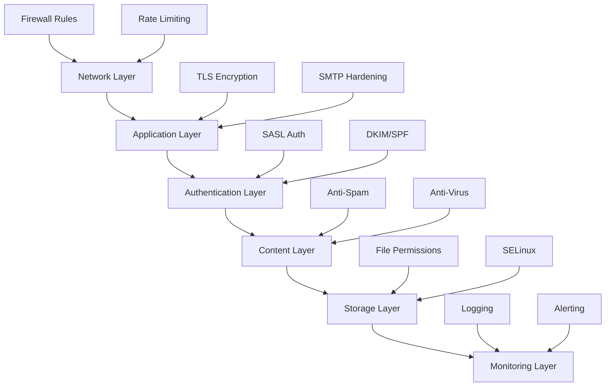

Comprehensive guide to securing Postfix mail servers using industry best
practices, CIS benchmarks, and defense-in-depth strategies.

## Security Overview

### Defense-in-Depth Strategy



### Security Principles

- **Least Privilege**: Run services with minimal permissions
- **Defense in Depth**: Multiple security layers
- **Fail Secure**: Default to deny, explicit allow
- **Security by Design**: Security built-in, not bolted-on
- **Regular Updates**: Patch management and monitoring

## Pre-Hardening Assessment

### System Information Gathering

```bash
# Postfix version and configuration
postconf -d | grep mail_version
postconf -n > /tmp/postfix-config-backup.txt

# Check current security settings
postconf | grep -i "tls\|sasl\|smtpd_.*restrictions"

# Review running processes
ps aux | grep postfix

# Check listening ports
sudo ss -tulpn | grep master

# Review current iptables/firewalld rules
sudo iptables -L -n -v
# OR
sudo firewall-cmd --list-all
```

### Vulnerability Scanning

```bash
# Check for known vulnerabilities
sudo lynis audit system

# Scan for open ports
nmap -sV -p- localhost

# Test SMTP banner disclosure
telnet localhost 25

# Check SSL/TLS configuration
testssl.sh localhost:587
```

## Network Layer Hardening

### Firewall Configuration

#### UFW (Ubuntu/Debian)

```bash
# Enable UFW
sudo ufw enable

# Allow SSH (before enabling firewall!)
sudo ufw allow 22/tcp

# SMTP ports
sudo ufw allow 25/tcp comment 'SMTP'
sudo ufw allow 587/tcp comment 'SMTP Submission'
sudo ufw allow 465/tcp comment 'SMTPS'

# IMAP/POP3 (if using Dovecot)
sudo ufw allow 993/tcp comment 'IMAPS'
sudo ufw allow 995/tcp comment 'POP3S'

# Rate limit SMTP connections
sudo ufw limit 25/tcp
sudo ufw limit 587/tcp

# Default deny
sudo ufw default deny incoming
sudo ufw default allow outgoing

# Verify rules
sudo ufw status verbose
```

#### Firewalld (RHEL/CentOS/Rocky)

```bash
# Enable firewalld
sudo systemctl enable --now firewalld

# Add services
sudo firewall-cmd --permanent --add-service=smtp
sudo firewall-cmd --permanent --add-service=smtp-submission
sudo firewall-cmd --permanent --add-service=smtps

# Custom ports if needed
sudo firewall-cmd --permanent --add-port=587/tcp
sudo firewall-cmd --permanent --add-port=465/tcp

# Rich rules for rate limiting
sudo firewall-cmd --permanent --add-rich-rule='rule service name="smtp" \
    limit value="10/m" accept'

# Reload
sudo firewall-cmd --reload

# Verify
sudo firewall-cmd --list-all
```

### Connection Rate Limiting

Add to `/etc/postfix/main.cf`:

```ini
# Connection limits per client
smtpd_client_connection_count_limit = 10
smtpd_client_connection_rate_limit = 30

# Error and recipient limits
smtpd_error_sleep_time = 5s
smtpd_soft_error_limit = 5
smtpd_hard_error_limit = 10
smtpd_recipient_limit = 50

# Time limits
smtpd_timeout = 300s
smtpd_helo_timeout = 60s

# Anvil rate limiting service
anvil_rate_time_unit = 60s
anvil_status_update_time = 600s
```

### Network Access Control

```ini
# Restrict relay to specific networks
mynetworks = 127.0.0.0/8, 10.0.0.0/24
mynetworks_style = subnet

# Disable open relay
smtpd_relay_restrictions = 
    permit_mynetworks,
    permit_sasl_authenticated,
    reject_unauth_destination

# Reject unknown clients
smtpd_client_restrictions =
    permit_mynetworks,
    permit_sasl_authenticated,
    reject_unknown_client_hostname

# Block private IP ranges in HELO
smtpd_helo_restrictions =
    permit_mynetworks,
    reject_invalid_helo_hostname,
    reject_non_fqdn_helo_hostname
```

## Application Layer Hardening

### SMTP Banner Hardening

```ini
# Minimal banner information
smtpd_banner = $myhostname ESMTP
smtpd_helo_required = yes

# Disable version disclosure
mail_name = Mail Server
smtpd_client_restrictions = reject_unknown_client_hostname
```

### Disable Unnecessary Features

```ini
# Disable VRFY and EXPN commands
disable_vrfy_command = yes

# Restrict ETRN command
smtpd_etrn_restrictions = reject

# Disable XCLIENT
smtpd_discard_ehlo_keywords = silent-discard, dsn, etrn, xclient
```

### SMTP Relay Protection

```ini
# Comprehensive relay restrictions
smtpd_relay_restrictions =
    permit_mynetworks,
    permit_sasl_authenticated,
    reject_unauth_destination,
    reject_unauth_pipelining,
    reject_non_fqdn_recipient,
    reject_unknown_recipient_domain

# Recipient restrictions
smtpd_recipient_restrictions =
    permit_mynetworks,
    permit_sasl_authenticated,
    reject_non_fqdn_recipient,
    reject_unknown_recipient_domain,
    reject_unauth_destination,
    reject_rbl_client zen.spamhaus.org,
    reject_rbl_client bl.spamcop.net,
    permit

# Sender restrictions
smtpd_sender_restrictions =
    permit_mynetworks,
    permit_sasl_authenticated,
    reject_non_fqdn_sender,
    reject_unknown_sender_domain

# Data restrictions
smtpd_data_restrictions =
    reject_unauth_pipelining,
    permit
```

## Authentication Layer Hardening

### TLS/SSL Configuration

```ini
# Require TLS for submission
smtpd_tls_security_level = may
smtpd_tls_auth_only = yes
smtp_tls_security_level = may

# Modern TLS protocols only
smtpd_tls_mandatory_protocols = >=TLSv1.2
smtpd_tls_protocols = >=TLSv1.2
smtp_tls_mandatory_protocols = >=TLSv1.2
smtp_tls_protocols = >=TLSv1.2

# Strong cipher suites
smtpd_tls_mandatory_ciphers = high
smtpd_tls_ciphers = high
smtp_tls_mandatory_ciphers = high
tls_high_cipherlist = ECDHE-RSA-AES256-GCM-SHA384:ECDHE-RSA-AES128-GCM-SHA256

# Certificate settings
smtpd_tls_cert_file = /etc/ssl/certs/postfix.pem
smtpd_tls_key_file = /etc/ssl/private/postfix.key
smtpd_tls_CAfile = /etc/ssl/certs/ca-bundle.crt

# DH parameters for PFS
smtpd_tls_dh1024_param_file = /etc/postfix/dh2048.pem
smtpd_tls_dh512_param_file = /etc/postfix/dh512.pem

# Session cache
smtpd_tls_session_cache_database = btree:${data_directory}/smtpd_scache
smtp_tls_session_cache_database = btree:${data_directory}/smtp_scache

# Logging
smtpd_tls_loglevel = 1
smtp_tls_loglevel = 1
smtpd_tls_received_header = yes
```

Generate strong DH parameters:

```bash
# Generate 2048-bit DH parameters (takes time)
sudo openssl dhparam -out /etc/postfix/dh2048.pem 2048
sudo openssl dhparam -out /etc/postfix/dh512.pem 512

sudo chmod 644 /etc/postfix/dh*.pem
```

### SASL Authentication Hardening

```ini
# Enable SASL authentication
smtpd_sasl_auth_enable = yes
smtpd_sasl_type = dovecot
smtpd_sasl_path = private/auth

# Security options
smtpd_sasl_security_options = noanonymous, noplaintext
smtpd_sasl_tls_security_options = noanonymous

# Require authentication for submission
smtpd_sasl_authenticated_header = yes
smtpd_sasl_local_domain = $mydomain

# Reject sender mismatches
smtpd_sender_login_maps = hash:/etc/postfix/sender_login
reject_sender_login_mismatch = yes
```

#### /etc/postfix/sender_login

```text
# Map authenticated users to allowed sender addresses
user@example.com user@example.com
admin@example.com admin@example.com,postmaster@example.com
```

```bash
sudo postmap /etc/postfix/sender_login
sudo chmod 640 /etc/postfix/sender_login*
```

### Master Process Hardening

Edit `/etc/postfix/master.cf`:

```ini
# Submission port with forced TLS and auth
submission inet n       -       y       -       -       smtpd
    -o syslog_name=postfix/submission
    -o smtpd_tls_security_level=encrypt
    -o smtpd_sasl_auth_enable=yes
    -o smtpd_tls_auth_only=yes
    -o smtpd_reject_unlisted_recipient=no
    -o smtpd_client_restrictions=permit_sasl_authenticated,reject
    -o smtpd_helo_restrictions=permit_mynetworks,permit_sasl_authenticated,reject
    -o smtpd_sender_restrictions=permit_mynetworks,permit_sasl_authenticated,reject
    -o smtpd_recipient_restrictions=permit_mynetworks,permit_sasl_authenticated,reject
    -o milter_macro_daemon_name=ORIGINATING

# SMTPS port (legacy, but still used)
smtps     inet  n       -       y       -       -       smtpd
    -o syslog_name=postfix/smtps
    -o smtpd_tls_wrappermode=yes
    -o smtpd_sasl_auth_enable=yes
    -o smtpd_client_restrictions=permit_sasl_authenticated,reject
```

## Content Layer Hardening

### Header Checks

#### /etc/postfix/header_checks

```text
# Reject suspicious headers
/^X-Mailer: Stealth Mailer/         REJECT Spam detected
/^X-PHP-Originating-Script:/        REJECT PHP script detected
/^Received: from .*\[127\.0\.0\.1\]/ REJECT Forged localhost origin

# Remove potentially harmful headers
/^X-Originating-IP:/                IGNORE
/^X-Sender-IP:/                     IGNORE
```

```bash
sudo postmap /etc/postfix/header_checks
```

Add to `/etc/postfix/main.cf`:

```ini
header_checks = regexp:/etc/postfix/header_checks
```

### Body Checks

#### /etc/postfix/body_checks

```text
# Block common spam patterns
/^\s*<html>/i REJECT HTML-only email
/viagra|cialis/i REJECT Pharmaceutical spam
/click here.*unsubscribe/i REJECT Spam pattern detected

# Block executable attachments
/^Content-Type:.*name=".*\.(exe|scr|vbs|pif|bat|cmd|com)"/ REJECT Executable
```

```bash
sudo postmap /etc/postfix/body_checks
```

Add to `/etc/postfix/main.cf`:

```ini
body_checks = regexp:/etc/postfix/body_checks
```

### MIME Checks

#### /etc/postfix/mime_header_checks

```text
# Reject dangerous MIME types
/^Content-Type: application\/(x-)?executable/ REJECT Executable attachment
/^Content-Type: application\/(x-)?msdos-program/ REJECT DOS program
/^Content-Type: application\/(x-)?msdownload/ REJECT Windows executable

# Block suspicious filenames
/name="?.*\.(exe|pif|scr|vbs|bat|cmd|com)"?/ REJECT Dangerous attachment
```

```bash
sudo postmap /etc/postfix/mime_header_checks
```

Add to `/etc/postfix/main.cf`:

```ini
mime_header_checks = regexp:/etc/postfix/mime_header_checks
```

### Message Size Limits

```ini
# Message size restrictions
message_size_limit = 25600000  # 25MB
mailbox_size_limit = 0         # Unlimited mailbox (controlled by quota)

# Queue size limits
qmgr_message_recipient_limit = 1000
qmgr_message_active_limit = 20000
qmgr_message_recipient_minimum = 10
```

## Storage Layer Hardening

### File System Permissions

```bash
# Postfix directories
sudo chmod 755 /etc/postfix
sudo chmod 644 /etc/postfix/main.cf
sudo chmod 644 /etc/postfix/master.cf

# Private keys
sudo chmod 600 /etc/ssl/private/postfix.key
sudo chown root:root /etc/ssl/private/postfix.key

# Password files
sudo chmod 600 /etc/postfix/sasl_passwd*
sudo chown root:postfix /etc/postfix/sasl_passwd*

# Virtual mailboxes
sudo chmod 770 /var/mail/vhosts
sudo chown vmail:vmail /var/mail/vhosts

# Queue directories
sudo chmod 755 /var/spool/postfix
sudo chown -R postfix:postfix /var/spool/postfix
```

### SELinux/AppArmor Configuration

#### SELinux (RHEL/CentOS/Rocky)

```bash
# Verify SELinux is enabled
sestatus

# Set correct context for custom directories
sudo semanage fcontext -a -t postfix_spool_t "/var/mail/vhosts(/.*)?"
sudo restorecon -Rv /var/mail/vhosts

# Allow Postfix to connect to database
sudo setsebool -P postfix_can_connect_db 1

# Allow Postfix to send mail
sudo setsebool -P postfix_can_sendmail 1

# Check for denials
sudo ausearch -m avc -ts recent | grep postfix
```

#### AppArmor (Ubuntu/Debian)

```bash
# Install AppArmor utilities
sudo apt install apparmor-utils

# Enable Postfix profile
sudo aa-enforce /etc/apparmor.d/usr.lib.postfix.master

# Check status
sudo aa-status | grep postfix

# Review logs for denials
sudo journalctl -xe | grep apparmor | grep postfix
```

### Chroot Configuration

Enable chroot for Postfix daemons in `/etc/postfix/master.cf`:

```ini
# Example: chroot for smtpd (column 5 = 'y')
smtp      inet  n       -       y       -       -       smtpd
pickup    unix  n       -       y       60      1       pickup
cleanup   unix  n       -       y       -       0       cleanup
qmgr      unix  n       -       y       300     1       qmgr
```

**Note**: Running Postfix in chroot requires careful setup of required files
in `/var/spool/postfix/`.

### Secure Queue Management

```ini
# Queue file permissions
default_privs = nobody
mail_owner = postfix

# Disable local delivery for system users
local_recipient_maps = proxy:unix:passwd.byname $alias_maps
local_transport = error:local mail delivery is disabled

# Forward root mail
root_map_file = hash:/etc/postfix/root_forward
```

## Monitoring and Logging

### Enhanced Logging

```ini
# Verbose logging (for initial setup)
smtpd_tls_loglevel = 1
smtp_tls_loglevel = 1

# Connection logging
smtpd_client_restrictions = 
    check_client_access hash:/etc/postfix/client_access,
    permit_mynetworks,
    reject

# Sender/recipient logging
smtpd_sasl_authenticated_header = yes
```

### Log Monitoring Scripts

#### /usr/local/bin/postfix-security-monitor.sh

```bash
#!/bin/bash

LOGFILE="/var/log/mail.log"
ALERT_EMAIL="security@example.com"
THRESHOLD=10

echo "Postfix Security Monitor - $(date)" > /tmp/security-report.txt
echo "================================================" >> /tmp/security-report.txt

# Check for authentication failures
AUTH_FAIL=$(sudo grep "authentication failed" $LOGFILE | \
    grep "$(date +%b\ %d)" | wc -l)
if [ "$AUTH_FAIL" -gt "$THRESHOLD" ]; then
    echo "⚠ WARNING: $AUTH_FAIL authentication failures detected" \
        >> /tmp/security-report.txt
fi

# Check for relay attempts
RELAY_DENY=$(sudo grep "Relay access denied" $LOGFILE | \
    grep "$(date +%b\ %d)" | wc -l)
if [ "$RELAY_DENY" -gt "$THRESHOLD" ]; then
    echo "⚠ WARNING: $RELAY_DENY relay access denials detected" \
        >> /tmp/security-report.txt
fi

# Check for rejected connections
REJECT=$(sudo grep "reject:" $LOGFILE | grep "$(date +%b\ %d)" | wc -l)
echo "ℹ INFO: $REJECT connections rejected today" >> /tmp/security-report.txt

# Check for TLS errors
TLS_ERROR=$(sudo grep "TLS.*error" $LOGFILE | \
    grep "$(date +%b\ %d)" | wc -l)
if [ "$TLS_ERROR" -gt 5 ]; then
    echo "⚠ WARNING: $TLS_ERROR TLS errors detected" \
        >> /tmp/security-report.txt
fi

# Top rejected clients
echo "" >> /tmp/security-report.txt
echo "Top 10 Rejected Clients:" >> /tmp/security-report.txt
sudo grep "reject:" $LOGFILE | grep "$(date +%b\ %d)" | \
    awk '{print $7}' | sort | uniq -c | sort -rn | head -10 \
    >> /tmp/security-report.txt

# Send alert if issues found
if grep -q "WARNING" /tmp/security-report.txt; then
    cat /tmp/security-report.txt | mail -s "Postfix Security Alert" \
        $ALERT_EMAIL
fi

cat /tmp/security-report.txt
```

```bash
sudo chmod +x /usr/local/bin/postfix-security-monitor.sh

# Add to crontab (run hourly)
sudo crontab -e
0 * * * * /usr/local/bin/postfix-security-monitor.sh
```

### Centralized Logging

#### Rsyslog Configuration

```bash
# /etc/rsyslog.d/30-postfix.conf
if $programname == 'postfix' then /var/log/postfix.log
& stop

# Restart rsyslog
sudo systemctl restart rsyslog
```

#### Send to SIEM/Centralized Logger

```bash
# /etc/rsyslog.d/40-remote.conf
*.* @@logserver.example.com:514

# Restart rsyslog
sudo systemctl restart rsyslog
```

## Incident Response

### Compromised Server Detection

```bash
# Check for unauthorized queue entries
sudo postqueue -p | grep MAILER-DAEMON

# Review recent SASL authentications
sudo grep "sasl_username" /var/log/mail.log | tail -50

# Check for unusual outbound volume
sudo pflogsumm -d today /var/log/mail.log | head -30

# Review active connections
sudo postfix status

# Check for backdoor SMTP relays
sudo netstat -tulpn | grep :25
```

### Emergency Response Actions

```bash
# Immediately stop mail service
sudo systemctl stop postfix

# Flush queue (after verification)
sudo postsuper -d ALL

# Block specific IP
sudo iptables -A INPUT -s 192.0.2.100 -j DROP

# Reset passwords
doveadm pw -s SHA512-CRYPT
# Update database with new password

# Review and rotate TLS certificates
sudo openssl req -new -x509 -nodes -days 365 \
    -keyout /etc/ssl/private/postfix.key \
    -out /etc/ssl/certs/postfix.pem
```

### Post-Incident Hardening

```bash
# Enable stricter restrictions
sudo postconf -e 'smtpd_client_restrictions = reject_unknown_client_hostname'

# Require authentication for all external connections
sudo postconf -e 'smtpd_relay_restrictions = permit_mynetworks, \
    permit_sasl_authenticated, reject'

# Implement stricter rate limits
sudo postconf -e 'smtpd_client_connection_rate_limit = 10'

# Restart service
sudo systemctl restart postfix
```

## Security Compliance

### CIS Benchmark Checklist

- [ ] **1.1** Ensure Postfix is installed from official repositories
- [ ] **1.2** Ensure Postfix service is enabled and running
- [ ] **2.1** Disable unnecessary services (VRFY, EXPN, ETRN)
- [ ] **2.2** Configure mail banner to minimal information
- [ ] **2.3** Restrict network access with firewall rules
- [ ] **3.1** Enable TLS encryption for all connections
- [ ] **3.2** Use TLS 1.2 or higher
- [ ] **3.3** Configure strong cipher suites
- [ ] **4.1** Implement SASL authentication
- [ ] **4.2** Require authentication for relay
- [ ] **4.3** Implement sender authentication checks
- [ ] **5.1** Configure anti-spam measures (RBL, SPF, DKIM)
- [ ] **5.2** Implement content filtering
- [ ] **5.3** Enable anti-virus scanning
- [ ] **6.1** Set appropriate file permissions
- [ ] **6.2** Enable SELinux/AppArmor
- [ ] **6.3** Run services with least privilege
- [ ] **7.1** Enable comprehensive logging
- [ ] **7.2** Implement log monitoring and alerting
- [ ] **7.3** Centralize log collection
- [ ] **8.1** Regular security updates
- [ ] **8.2** Periodic security audits
- [ ] **8.3** Incident response plan documented

### PCI DSS Compliance

For email servers handling payment card data:

```ini
# Encrypt all transmissions
smtpd_tls_security_level = encrypt
smtp_tls_security_level = encrypt

# Strong authentication
smtpd_sasl_auth_enable = yes
smtpd_tls_auth_only = yes

# Log all access
smtpd_sasl_authenticated_header = yes
```

### GDPR Compliance

```ini
# Data minimization
smtpd_banner = $myhostname ESMTP
remove_headers = X-Originating-IP, X-Client-IP

# Retention policy
maximal_queue_lifetime = 5d
bounce_queue_lifetime = 5d
```

## Automated Security Auditing

### Security Audit Script

#### /usr/local/bin/postfix-security-audit.sh

```bash
#!/bin/bash

REPORT="/tmp/postfix-security-audit-$(date +%Y%m%d).txt"

echo "Postfix Security Audit Report" > $REPORT
echo "Generated: $(date)" >> $REPORT
echo "========================================" >> $REPORT

# Check Postfix version
echo -e "\n[*] Postfix Version:" >> $REPORT
postconf mail_version >> $REPORT

# Check TLS configuration
echo -e "\n[*] TLS Configuration:" >> $REPORT
postconf | grep "smtpd_tls_security_level\|smtp_tls_security_level" >> $REPORT
postconf | grep "smtpd_tls.*protocols" >> $REPORT

# Check relay restrictions
echo -e "\n[*] Relay Restrictions:" >> $REPORT
postconf smtpd_relay_restrictions >> $REPORT

# Check SASL authentication
echo -e "\n[*] SASL Configuration:" >> $REPORT
postconf | grep "smtpd_sasl" >> $REPORT

# Check file permissions
echo -e "\n[*] Critical File Permissions:" >> $REPORT
ls -la /etc/postfix/main.cf >> $REPORT
ls -la /etc/postfix/sasl_passwd* 2>/dev/null >> $REPORT
ls -la /etc/ssl/private/postfix.key 2>/dev/null >> $REPORT

# Check firewall status
echo -e "\n[*] Firewall Status:" >> $REPORT
if command -v ufw &>/dev/null; then
    sudo ufw status >> $REPORT
elif command -v firewall-cmd &>/dev/null; then
    sudo firewall-cmd --list-all >> $REPORT
fi

# Check SELinux/AppArmor
echo -e "\n[*] Mandatory Access Control:" >> $REPORT
if command -v sestatus &>/dev/null; then
    sestatus >> $REPORT
elif command -v aa-status &>/dev/null; then
    sudo aa-status | grep postfix >> $REPORT
fi

# Recent authentication failures
echo -e "\n[*] Recent Authentication Failures:" >> $REPORT
sudo grep "authentication failed" /var/log/mail.log | tail -5 >> $REPORT

# Recent relay denials
echo -e "\n[*] Recent Relay Denials:" >> $REPORT
sudo grep "Relay access denied" /var/log/mail.log | tail -5 >> $REPORT

echo -e "\n[*] Audit complete. Report saved to $REPORT"
cat $REPORT
```

```bash
sudo chmod +x /usr/local/bin/postfix-security-audit.sh

# Run weekly
sudo crontab -e
0 2 * * 1 /usr/local/bin/postfix-security-audit.sh | \
    mail -s "Weekly Postfix Security Audit" admin@example.com
```

## Next Steps

- [Getting Started](getting-started.md) - Quick setup guide
- [SASL Authentication](sasl.md) - Configure SMTP authentication
- [Spam Filtering](spam-filtering.md) - Implement anti-spam measures
- [Virtual Domains](virtual-domains.md) - Multi-domain hosting

## Additional Resources

- [CIS Postfix Benchmark](https://www.cisecurity.org/)
- [Postfix Security Documentation](http://www.postfix.org/SECURITY.html)
- [OWASP Email Security](https://owasp.org/www-community/vulnerabilities/)
- [NIST Cybersecurity Framework](https://www.nist.gov/cyberframework)
