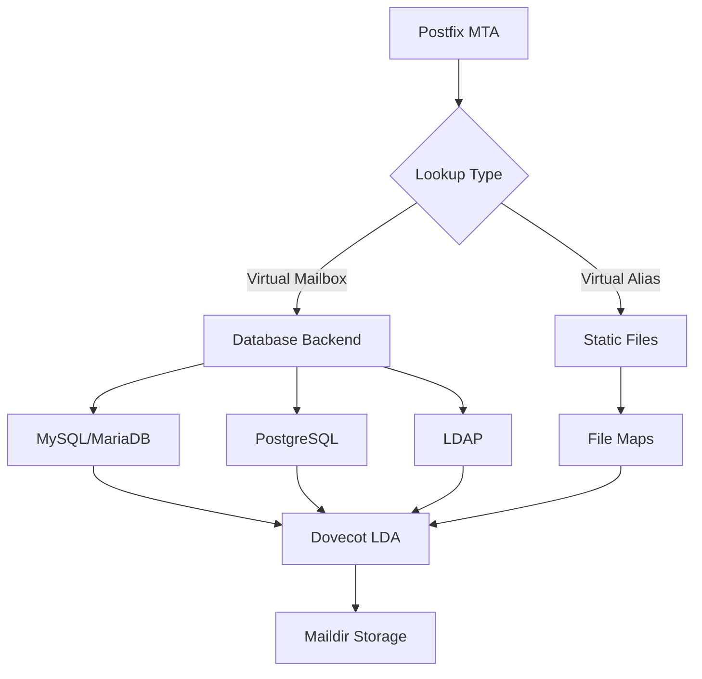

Virtual domains allow a single Postfix server to handle email for multiple
domains, providing centralized management, scalability, and flexibility for
hosting environments and organizations managing multiple domain names.

## Overview

### What are Virtual Domains?

Virtual domains enable Postfix to:

- **Host multiple domains** on a single mail server
- **Separate mailboxes** completely from system users
- **Scale efficiently** without creating system accounts
- **Centralize management** with database backends
- **Support dynamic configuration** without restarting services

### Architecture Options



### Virtual Domain Types

| Type | Use Case | Backend | Complexity | Scalability |
| --- | --- | --- | --- | --- |
| Virtual Alias | Forwarding only | Files | Low | Limited |
| Virtual Mailbox | Full hosting | Database | Medium | High |
| Hybrid | Mixed requirements | Both | Medium | Medium |

## Prerequisites

### System Requirements

- Postfix 3.x or later installed
- Database server (MySQL, PostgreSQL, or LDAP)
- Dovecot for mailbox delivery
- Sufficient disk space for mailboxes
- Root or sudo access

### Required Packages

**Ubuntu/Debian:**

```bash
sudo apt update
sudo apt install postfix postfix-mysql dovecot-core dovecot-imapd \
  dovecot-pop3d dovecot-lmtpd mysql-server
```

**RHEL/CentOS/Rocky:**

```bash
sudo dnf install postfix dovecot dovecot-mysql mariadb-server
sudo systemctl enable --now mariadb
```

## Database Setup

### MySQL/MariaDB Backend

#### Create Virtual Mail Database

```sql
CREATE DATABASE mailserver CHARACTER SET utf8mb4 COLLATE utf8mb4_unicode_ci;

CREATE USER 'mailuser'@'localhost' IDENTIFIED BY 'SecurePassword123!';
GRANT SELECT ON mailserver.* TO 'mailuser'@'localhost';
FLUSH PRIVILEGES;

USE mailserver;
```

#### Create Domain Table

```sql
CREATE TABLE virtual_domains (
    id INT AUTO_INCREMENT PRIMARY KEY,
    name VARCHAR(255) NOT NULL,
    enabled TINYINT(1) DEFAULT 1,
    created_at TIMESTAMP DEFAULT CURRENT_TIMESTAMP,
    updated_at TIMESTAMP DEFAULT CURRENT_TIMESTAMP ON UPDATE CURRENT_TIMESTAMP,
    UNIQUE KEY (name),
    INDEX idx_enabled (enabled)
) ENGINE=InnoDB DEFAULT CHARSET=utf8mb4;
```

#### Create User Table

```sql
CREATE TABLE virtual_users (
    id INT AUTO_INCREMENT PRIMARY KEY,
    domain_id INT NOT NULL,
    email VARCHAR(255) NOT NULL,
    password VARCHAR(255) NOT NULL,
    quota BIGINT DEFAULT 0,
    enabled TINYINT(1) DEFAULT 1,
    created_at TIMESTAMP DEFAULT CURRENT_TIMESTAMP,
    updated_at TIMESTAMP DEFAULT CURRENT_TIMESTAMP ON UPDATE CURRENT_TIMESTAMP,
    UNIQUE KEY (email),
    FOREIGN KEY (domain_id) REFERENCES virtual_domains(id) ON DELETE CASCADE,
    INDEX idx_domain (domain_id),
    INDEX idx_enabled (enabled)
) ENGINE=InnoDB DEFAULT CHARSET=utf8mb4;
```

#### Create Alias Table

```sql
CREATE TABLE virtual_aliases (
    id INT AUTO_INCREMENT PRIMARY KEY,
    domain_id INT NOT NULL,
    source VARCHAR(255) NOT NULL,
    destination TEXT NOT NULL,
    enabled TINYINT(1) DEFAULT 1,
    created_at TIMESTAMP DEFAULT CURRENT_TIMESTAMP,
    updated_at TIMESTAMP DEFAULT CURRENT_TIMESTAMP ON UPDATE CURRENT_TIMESTAMP,
    UNIQUE KEY (source),
    FOREIGN KEY (domain_id) REFERENCES virtual_domains(id) ON DELETE CASCADE,
    INDEX idx_domain (domain_id),
    INDEX idx_enabled (enabled)
) ENGINE=InnoDB DEFAULT CHARSET=utf8mb4;
```

#### Insert Sample Data

```sql
-- Add domains
INSERT INTO virtual_domains (name) VALUES
    ('example.com'),
    ('example.org');

-- Add users (password is hashed with doveadm pw -s SHA512-CRYPT)
INSERT INTO virtual_users (domain_id, email, password, quota) VALUES
    (1, 'admin@example.com', '{SHA512-CRYPT}$6$...', 5368709120),
    (1, 'sales@example.com', '{SHA512-CRYPT}$6$...', 2147483648),
    (2, 'info@example.org', '{SHA512-CRYPT}$6$...', 1073741824);

-- Add aliases
INSERT INTO virtual_aliases (domain_id, source, destination) VALUES
    (1, 'postmaster@example.com', 'admin@example.com'),
    (1, 'abuse@example.com', 'admin@example.com'),
    (1, 'support@example.com', 'sales@example.com,admin@example.com');
```

### PostgreSQL Backend

#### Create PostgreSQL Database

```sql
CREATE DATABASE mailserver WITH ENCODING 'UTF8';

CREATE USER mailuser WITH PASSWORD 'SecurePassword123!';
GRANT CONNECT ON DATABASE mailserver TO mailuser;

\c mailserver

GRANT USAGE ON SCHEMA public TO mailuser;
```

#### Create Tables

```sql
CREATE TABLE virtual_domains (
    id SERIAL PRIMARY KEY,
    name VARCHAR(255) NOT NULL UNIQUE,
    enabled BOOLEAN DEFAULT TRUE,
    created_at TIMESTAMP DEFAULT CURRENT_TIMESTAMP,
    updated_at TIMESTAMP DEFAULT CURRENT_TIMESTAMP
);

CREATE TABLE virtual_users (
    id SERIAL PRIMARY KEY,
    domain_id INTEGER NOT NULL REFERENCES virtual_domains(id) ON DELETE CASCADE,
    email VARCHAR(255) NOT NULL UNIQUE,
    password VARCHAR(255) NOT NULL,
    quota BIGINT DEFAULT 0,
    enabled BOOLEAN DEFAULT TRUE,
    created_at TIMESTAMP DEFAULT CURRENT_TIMESTAMP,
    updated_at TIMESTAMP DEFAULT CURRENT_TIMESTAMP
);

CREATE TABLE virtual_aliases (
    id SERIAL PRIMARY KEY,
    domain_id INTEGER NOT NULL REFERENCES virtual_domains(id) ON DELETE CASCADE,
    source VARCHAR(255) NOT NULL UNIQUE,
    destination TEXT NOT NULL,
    enabled BOOLEAN DEFAULT TRUE,
    created_at TIMESTAMP DEFAULT CURRENT_TIMESTAMP,
    updated_at TIMESTAMP DEFAULT CURRENT_TIMESTAMP
);

CREATE INDEX idx_users_domain ON virtual_users(domain_id);
CREATE INDEX idx_users_enabled ON virtual_users(enabled);
CREATE INDEX idx_aliases_domain ON virtual_aliases(domain_id);
CREATE INDEX idx_aliases_enabled ON virtual_aliases(enabled);

GRANT SELECT ON ALL TABLES IN SCHEMA public TO mailuser;
```

## Postfix Configuration

### Database Connection Files

Create MySQL connection files in `/etc/postfix/`:

#### /etc/postfix/mysql-virtual-mailbox-domains.cf

```ini
user = mailuser
password = SecurePassword123!
hosts = localhost
dbname = mailserver
query = SELECT 1 FROM virtual_domains WHERE name='%s' AND enabled=1
```

#### /etc/postfix/mysql-virtual-mailbox-maps.cf

```ini
user = mailuser
password = SecurePassword123!
hosts = localhost
dbname = mailserver
query = SELECT 1 FROM virtual_users WHERE email='%s' AND enabled=1
```

#### /etc/postfix/mysql-virtual-alias-maps.cf

```ini
user = mailuser
password = SecurePassword123!
hosts = localhost
dbname = mailserver
query = SELECT destination FROM virtual_aliases WHERE source='%s' AND enabled=1
```

#### /etc/postfix/mysql-virtual-email2email.cf

```ini
user = mailuser
password = SecurePassword123!
hosts = localhost
dbname = mailserver
query = SELECT email FROM virtual_users WHERE email='%s' AND enabled=1
```

### Secure Configuration Files

```bash
sudo chmod 640 /etc/postfix/mysql-*.cf
sudo chown root:postfix /etc/postfix/mysql-*.cf
```

### Main Postfix Configuration

Add to `/etc/postfix/main.cf`:

```ini
# Virtual domain settings
virtual_mailbox_domains = mysql:/etc/postfix/mysql-virtual-mailbox-domains.cf
virtual_mailbox_maps = mysql:/etc/postfix/mysql-virtual-mailbox-maps.cf
virtual_alias_maps = mysql:/etc/postfix/mysql-virtual-alias-maps.cf,
    mysql:/etc/postfix/mysql-virtual-email2email.cf

# Virtual mailbox settings
virtual_mailbox_base = /var/mail/vhosts
virtual_minimum_uid = 1000
virtual_uid_maps = static:5000
virtual_gid_maps = static:5000

# Dovecot LMTP delivery
virtual_transport = lmtp:unix:private/dovecot-lmtp
```

### Create Virtual Mail Directory

```bash
sudo mkdir -p /var/mail/vhosts
sudo groupadd -g 5000 vmail
sudo useradd -g vmail -u 5000 vmail -d /var/mail/vhosts -s /sbin/nologin
sudo chown -R vmail:vmail /var/mail/vhosts
sudo chmod -R 770 /var/mail/vhosts
```

## Dovecot Integration

### Dovecot SQL Configuration

#### /etc/dovecot/dovecot-sql.conf.ext

```ini
driver = mysql
connect = host=localhost dbname=mailserver user=mailuser password=SecurePass!
default_pass_scheme = SHA512-CRYPT

# User query
user_query = SELECT \
    CONCAT('/var/mail/vhosts/', SUBSTRING_INDEX(email, '@', -1), \
    '/', SUBSTRING_INDEX(email, '@', 1)) AS home, \
    5000 AS uid, \
    5000 AS gid, \
    CONCAT('*:bytes=', quota) AS quota_rule \
    FROM virtual_users \
    WHERE email = '%u' AND enabled = 1

# Password query
password_query = SELECT email as user, password \
    FROM virtual_users \
    WHERE email = '%u' AND enabled = 1

# Iterate query (for doveadm)
iterate_query = SELECT email as user FROM virtual_users WHERE enabled = 1
```

For PostgreSQL, use:

```ini
driver = pgsql
connect = host=localhost dbname=mailserver user=mailuser password=SecurePass!
```

### Dovecot Main Configuration

#### /etc/dovecot/conf.d/10-mail.conf

```ini
# Maildir location
mail_location = maildir:/var/mail/vhosts/%d/%n

# Namespace configuration
namespace inbox {
    inbox = yes
    separator = /
    
    mailbox Drafts {
        special_use = \Drafts
        auto = subscribe
    }
    
    mailbox Sent {
        special_use = \Sent
        auto = subscribe
    }
    
    mailbox Trash {
        special_use = \Trash
        auto = subscribe
    }
    
    mailbox Spam {
        special_use = \Junk
        auto = subscribe
    }
}

# Mail user settings
mail_uid = vmail
mail_gid = vmail
mail_privileged_group = vmail
first_valid_uid = 5000
first_valid_gid = 5000
```

#### /etc/dovecot/conf.d/10-auth.conf

```ini
# Disable system user auth
!include auth-system.conf.ext

# Enable SQL auth
!include auth-sql.conf.ext

# Authentication settings
disable_plaintext_auth = yes
auth_mechanisms = plain login
```

#### /etc/dovecot/conf.d/auth-sql.conf.ext

```ini
passdb {
    driver = sql
    args = /etc/dovecot/dovecot-sql.conf.ext
}

userdb {
    driver = sql
    args = /etc/dovecot/dovecot-sql.conf.ext
}
```

#### /etc/dovecot/conf.d/10-master.conf

```ini
service lmtp {
    unix_listener /var/spool/postfix/private/dovecot-lmtp {
        mode = 0600
        user = postfix
        group = postfix
    }
}

service auth {
    unix_listener /var/spool/postfix/private/auth {
        mode = 0660
        user = postfix
        group = postfix
    }
    
    unix_listener auth-userdb {
        mode = 0600
        user = vmail
        group = vmail
    }
}

service auth-worker {
    user = vmail
}
```

### Secure Dovecot Configuration

```bash
sudo chmod 640 /etc/dovecot/dovecot-sql.conf.ext
sudo chown root:vmail /etc/dovecot/dovecot-sql.conf.ext
```

## Quota Management

### Enable Dovecot Quota Plugin

#### /etc/dovecot/conf.d/10-mail.conf (Quota)

```ini
mail_plugins = $mail_plugins quota
```

#### /etc/dovecot/conf.d/20-imap.conf

```ini
protocol imap {
    mail_plugins = $mail_plugins imap_quota
}
```

#### /etc/dovecot/conf.d/90-quota.conf

```ini
plugin {
    quota = maildir:User quota
    quota_status_success = DUNNO
    quota_status_nouser = DUNNO
    quota_status_overquota = "552 5.2.2 Mailbox is full"
    
    # Quota warnings
    quota_warning = storage=95%% quota-warning 95 %u
    quota_warning2 = storage=80%% quota-warning 80 %u
}

service quota-warning {
    executable = script /usr/local/bin/quota-warning.sh
    user = vmail
    unix_listener quota-warning {
        user = vmail
    }
}
```

### Quota Warning Script

#### /usr/local/bin/quota-warning.sh

```bash
#!/bin/bash

PERCENT=$1
USER=$2

cat << EOF | /usr/sbin/sendmail -f postmaster@example.com $USER
From: Mail Administrator <postmaster@example.com>
To: $USER
Subject: Mailbox Quota Warning - ${PERCENT}% Full

Your mailbox is ${PERCENT}% full. Please delete old messages or contact
support to increase your quota.

Current usage details:
- Quota limit: Check your email client
- Action required: Delete unnecessary emails
- Help: contact support@example.com

This is an automated message.
EOF
```

```bash
sudo chmod +x /usr/local/bin/quota-warning.sh
```

### Postfix Quota Checks

Add to `/etc/postfix/main.cf`:

```ini
# Check quota before accepting mail
smtpd_recipient_restrictions =
    permit_mynetworks,
    permit_sasl_authenticated,
    reject_unauth_destination,
    check_policy_service unix:private/quota-status
```

Add to `/etc/postfix/master.cf`:

```ini
quota-status unix:    n       n       n       -       0       spawn
    user=vmail argv=/usr/bin/doveadm quota get -u ${recipient}
```

## Virtual Alias Management

### Catch-All Addresses

Add to virtual_aliases table:

```sql
INSERT INTO virtual_aliases (domain_id, source, destination) VALUES
    (1, '@example.com', 'catchall@example.com');
```

This forwards all non-existent addresses to <catchall@example.com>.

### Multi-Destination Aliases

```sql
INSERT INTO virtual_aliases (domain_id, source, destination) VALUES
    (1, 'sales@example.com', 'user1@example.com,user2@example.com,user3@ex.co');
```

### Domain-Wide Forwarding

```sql
-- Forward entire domain to another domain
INSERT INTO virtual_aliases (domain_id, source, destination)
SELECT id, CONCAT('@', name), '@newdomain.com'
FROM virtual_domains WHERE name = 'olddomain.com';
```

## User Management

### Creating Virtual Users

#### Generate Password Hash

```bash
# Use Dovecot to generate password hash
doveadm pw -s SHA512-CRYPT
Enter new password: ****
Retype new password: ****
{SHA512-CRYPT}$6$rounds=5000$...
```

#### Add User via SQL

```sql
-- Get domain ID
SELECT id FROM virtual_domains WHERE name = 'example.com';

-- Add user (quota in bytes: 1GB = 1073741824)
INSERT INTO virtual_users (domain_id, email, password, quota)
VALUES (1, 'newuser@example.com', '{SHA512-CRYPT}$6$...', 1073741824);
```

#### Add User Management Script

#### /usr/local/bin/add-virtual-user.sh

```bash
#!/bin/bash

set -e

if [ "$#" -ne 3 ]; then
    echo "Usage: $0 <email> <password> <quota_gb>"
    echo "Example: $0 user@example.com MyPass123 5"
    exit 1
fi

EMAIL="$1"
PASSWORD="$2"
QUOTA_GB="$3"
DOMAIN="${EMAIL##*@}"

# Generate password hash
HASH=$(doveadm pw -s SHA512-CRYPT -p "$PASSWORD")

# Calculate quota in bytes
QUOTA=$((QUOTA_GB * 1024 * 1024 * 1024))

# Get domain ID
DOMAIN_ID=$(mysql -u mailuser -pSecurePassword123! mailserver -se \
    "SELECT id FROM virtual_domains WHERE name='$DOMAIN' AND enabled=1")

if [ -z "$DOMAIN_ID" ]; then
    echo "Error: Domain $DOMAIN not found or disabled"
    exit 1
fi

# Add user
mysql -u mailuser -pSecurePassword123! mailserver -e \
    "INSERT INTO virtual_users (domain_id, email, password, quota) \
     VALUES ($DOMAIN_ID, '$EMAIL', '$HASH', $QUOTA)"

echo "User $EMAIL created successfully with ${QUOTA_GB}GB quota"
```

```bash
sudo chmod +x /usr/local/bin/add-virtual-user.sh
```

### Modifying Virtual Users

```sql
-- Change password
UPDATE virtual_users
SET password = '{SHA512-CRYPT}$6$...'
WHERE email = 'user@example.com';

-- Update quota (5GB = 5368709120 bytes)
UPDATE virtual_users
SET quota = 5368709120
WHERE email = 'user@example.com';

-- Disable user
UPDATE virtual_users
SET enabled = 0
WHERE email = 'user@example.com';

-- Delete user
DELETE FROM virtual_users WHERE email = 'user@example.com';
```

### User Management Commands

```bash
# List all users
mysql -u mailuser -pSecurePass! mailserver -e \
    "SELECT email, quota, enabled FROM virtual_users ORDER BY email"

# Check user quota usage
doveadm quota get -u user@example.com

# Recalculate quota for user
doveadm quota recalc -u user@example.com

# List all mailboxes for user
doveadm mailbox list -u user@example.com

# Search user's mailbox
doveadm search -u user@example.com ALL

# Expunge deleted messages
doveadm expunge -u user@example.com mailbox Trash all
```

## Testing

### Test Database Connectivity

```bash
# Test domain lookup
postmap -q example.com mysql:/etc/postfix/mysql-virtual-mailbox-domains.cf

# Test user lookup
postmap -q admin@example.com mysql:/etc/postfix/mysql-virtual-mailbox-maps.cf

# Test alias lookup
postmap -q postmaster@example.com mysql:/etc/postfix/mysql-virtual-alias-maps.cf
```

Expected output: `1` for successful lookups.

### Test Email Delivery

```bash
# Send test email
echo "Test message" | mail -s "Test Virtual Domain" admin@example.com

# Check Postfix logs
sudo tail -f /var/log/mail.log | grep "admin@example.com"

# Verify mailbox creation
sudo ls -la /var/mail/vhosts/example.com/admin/
```

### Test IMAP Access

```bash
# Test with OpenSSL
openssl s_client -connect localhost:993 -crlf
a1 LOGIN admin@example.com password
a2 LIST "" "*"
a3 SELECT INBOX
a4 LOGOUT
```

### Test Quota Enforcement

```bash
# Check current quota
doveadm quota get -u admin@example.com

# Try to exceed quota (if set)
dd if=/dev/zero bs=1M count=6000 | \
    mail -s "Large file" admin@example.com
```

## Troubleshooting

### Common Issues

#### Postfix Cannot Connect to Database

```bash
# Test MySQL connection
mysql -u mailuser -pSecurePassword123! mailserver -e "SELECT 1"

# Check Postfix logs
sudo tail -f /var/log/mail.log

# Test query manually
postmap -q example.com mysql:/etc/postfix/mysql-virtual-mailbox-domains.cf
```

#### Dovecot Authentication Failures

```bash
# Enable auth debugging
sudo doveconf -n | grep auth_debug
# If not enabled, add to /etc/dovecot/conf.d/10-logging.conf
auth_debug = yes
auth_debug_passwords = yes

# Restart and check logs
sudo systemctl restart dovecot
sudo tail -f /var/log/dovecot.log
```

#### Permission Issues

```bash
# Verify vmail user
id vmail

# Check directory ownership
sudo ls -la /var/mail/vhosts/

# Fix permissions
sudo chown -R vmail:vmail /var/mail/vhosts/
sudo chmod -R 770 /var/mail/vhosts/
```

#### Mail Not Delivered to Mailbox

```bash
# Check Postfix-Dovecot integration
sudo postconf virtual_transport

# Test LMTP socket
sudo ls -la /var/spool/postfix/private/dovecot-lmtp

# Check Dovecot logs
sudo tail -f /var/log/dovecot.log
```

## Performance Optimization

### Database Indexing

```sql
-- Verify indexes exist
SHOW INDEX FROM virtual_domains;
SHOW INDEX FROM virtual_users;
SHOW INDEX FROM virtual_aliases;

-- Add additional indexes for large deployments
CREATE INDEX idx_users_email_enabled ON virtual_users(email, enabled);
CREATE INDEX idx_aliases_source_enabled ON virtual_aliases(source, enabled);
```

### Connection Pooling

Add to MySQL query files:

```ini
# Connection pooling settings
option_file = /etc/my.cnf
option_group = client

# Use persistent connections
hosts = localhost
```

### Query Caching

Add to `/etc/postfix/main.cf`:

```ini
# Enable Postfix query caching
virtual_mailbox_maps = proxy:mysql:/etc/postfix/mysql-virtual-mailbox-maps.cf
virtual_alias_maps = proxy:mysql:/etc/postfix/mysql-virtual-alias-maps.cf
```

## Security Best Practices

### Database Security

```sql
-- Use least privilege
REVOKE ALL PRIVILEGES ON mailserver.* FROM 'mailuser'@'localhost';
GRANT SELECT ON mailserver.* TO 'mailuser'@'localhost';
FLUSH PRIVILEGES;

-- Restrict connections
-- Edit /etc/mysql/mariadb.conf.d/50-server.cnf
bind-address = 127.0.0.1
```

### File Permissions

```bash
# Secure configuration files
sudo chmod 640 /etc/postfix/mysql-*.cf
sudo chmod 640 /etc/dovecot/dovecot-sql.conf.ext

# Secure mailbox directories
sudo chmod 770 /var/mail/vhosts
```

### Password Policies

- **Enforce strong passwords**: Minimum 12 characters, mixed case, numbers
- **Use SHA512-CRYPT**: Industry standard for password hashing
- **Regular password rotation**: Implement 90-day rotation policy
- **Multi-factor authentication**: Consider Dovecot MFA plugins

## Monitoring

### Mailbox Usage Reports

#### /usr/local/bin/mailbox-usage-report.sh

```bash
#!/bin/bash

echo "Virtual Mailbox Usage Report - $(date)"
echo "=========================================="

mysql -u mailuser -pSecurePassword123! mailserver -e "
    SELECT
        d.name AS domain,
        COUNT(u.id) AS users,
        SUM(u.quota) / 1024 / 1024 / 1024 AS total_quota_gb
    FROM virtual_domains d
    LEFT JOIN virtual_users u ON d.id = u.domain_id
    WHERE d.enabled = 1 AND u.enabled = 1
    GROUP BY d.name
    ORDER BY users DESC;
"

echo ""
echo "Top 10 Mailboxes by Size:"
for user in $(mysql -u mailuser -pSecurePassword123! mailserver -se \
    "SELECT email FROM virtual_users WHERE enabled=1 LIMIT 10"); do
    SIZE=$(du -sh "/var/mail/vhosts/${user#*@}/${user%%@*}" 2>/dev/null | \
        awk '{print $1}')
    echo "$user: $SIZE"
done
```

### Automated Backups

#### /usr/local/bin/backup-virtual-mail.sh

```bash
#!/bin/bash

BACKUP_DIR="/backup/mail"
DATE=$(date +%Y%m%d)
RETENTION_DAYS=30

mkdir -p "$BACKUP_DIR"

# Backup database
mysqldump -u mailuser -pSecurePassword123! mailserver | \
    gzip > "$BACKUP_DIR/mailserver-$DATE.sql.gz"

# Backup mailboxes
tar czf "$BACKUP_DIR/mailboxes-$DATE.tar.gz" /var/mail/vhosts/

# Remove old backups
find "$BACKUP_DIR" -name "*.gz" -mtime +$RETENTION_DAYS -delete

echo "Backup completed: $DATE"
```

## Migration Strategies

### Migrating from File-Based Virtual

```bash
# Convert virtual_mailbox_maps file to database
awk -F'@| ' '{print $2, $1}' /etc/postfix/virtual_mailbox_maps | \
while read domain user; do
    DOMAIN_ID=$(mysql -u mailuser -pSecurePass! mailserver -se \
        "SELECT id FROM virtual_domains WHERE name='$domain'")
    
    if [ -n "$DOMAIN_ID" ]; then
        mysql -u mailuser -pSecurePass! mailserver -e \
            "INSERT IGNORE INTO virtual_users (domain_id, email, password) \
             VALUES ($DOMAIN_ID, '$user@$domain', 'changeme')"
    fi
done
```

### Bulk Import from CSV

```bash
# CSV format: email,password_hash,quota_gb,domain
while IFS=',' read -r email password quota domain; do
    DOMAIN_ID=$(mysql -u mailuser -pSecurePass! mailserver -se \
        "SELECT id FROM virtual_domains WHERE name='$domain'")
    
    QUOTA_BYTES=$((quota * 1024 * 1024 * 1024))
    
    mysql -u mailuser -pSecurePass! mailserver -e \
        "INSERT INTO virtual_users (domain_id, email, password, quota) \
         VALUES ($DOMAIN_ID, '$email', '$password', $QUOTA_BYTES)"
done < users.csv
```

## Advanced Features

### Domain Aliases

```sql
CREATE TABLE domain_aliases (
    id INT AUTO_INCREMENT PRIMARY KEY,
    domain_id INT NOT NULL,
    alias VARCHAR(255) NOT NULL UNIQUE,
    FOREIGN KEY (domain_id) REFERENCES virtual_domains(id) ON DELETE CASCADE
);

INSERT INTO domain_aliases (domain_id, alias) VALUES
    (1, 'example.net');  -- Alias for example.com
```

Update `/etc/postfix/mysql-virtual-mailbox-domains.cf`:

```ini
query = SELECT 1 FROM virtual_domains WHERE name='%s' AND enabled=1
        UNION
        SELECT 1 FROM domain_aliases da
        JOIN virtual_domains vd ON da.domain_id = vd.id
        WHERE da.alias='%s' AND vd.enabled=1
```

### Per-User Mail Filters

```sql
CREATE TABLE user_filters (
    id INT AUTO_INCREMENT PRIMARY KEY,
    user_id INT NOT NULL,
    filter_type ENUM('subject', 'from', 'to', 'header'),
    pattern VARCHAR(255),
    action ENUM('reject', 'discard', 'redirect'),
    action_value VARCHAR(255),
    enabled TINYINT(1) DEFAULT 1,
    FOREIGN KEY (user_id) REFERENCES virtual_users(id) ON DELETE CASCADE
);
```

Implement with Sieve filters in Dovecot.

### Auto-Responders

Use Dovecot's vacation extension:

```ini
# /etc/dovecot/conf.d/90-sieve.conf
plugin {
    sieve = file:~/sieve;active=~/.dovecot.sieve
    sieve_vacation_min_period = 1h
}
```

## Next Steps

- [SASL Authentication](sasl.md) - Configure SMTP authentication
- [DKIM Signing](dkim.md) - Set up email authentication
- [Spam Filtering](spam-filtering.md) - Implement anti-spam measures
- [Security Hardening](security-hardening.md) - Secure your installation

## Additional Resources

- [Postfix Virtual Domain Documentation](http://www.postfix.org/VIRTUAL_README)
- [Dovecot Virtual Users](https://doc.dovecot.org/configuration_manual/authentication/user_databases_userdb/)
- [MySQL Postfix Integration](http://www.postfix.org/MYSQL_README.html)
- [PostgreSQL Postfix Integration](http://www.postfix.org/PGSQL_README.html)
