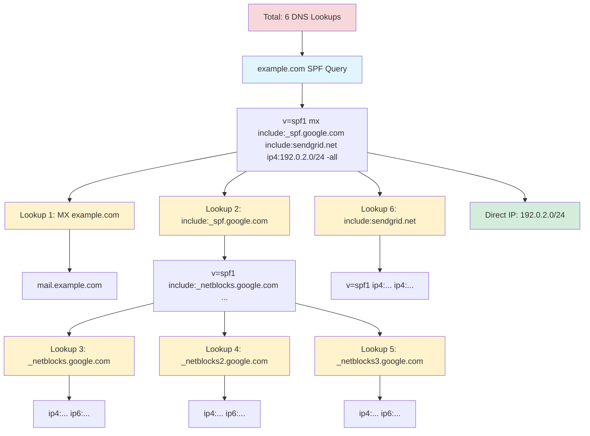

This section covers email authentication protocols including DKIM, DMARC, and SPF for securing email communications and preventing spoofing.

## Overview

Email authentication protocols form the foundation of modern email security, working together to verify message authenticity and protect against phishing, spoofing, domain impersonation, and other email-based attacks. These protocols have become essential as email remains one of the primary attack vectors for cybercriminals.

The three primary protocols work in concert:

- **SPF** (Sender Policy Framework) - Validates that emails come from authorized sending servers for a domain
- **DKIM** (DomainKeys Identified Mail) - Cryptographically signs email messages to verify sender identity and message integrity
- **DMARC** (Domain-based Message Authentication, Reporting & Conformance) - Provides a policy framework and reporting mechanism that builds on SPF and DKIM

### Why Email Authentication Matters

Email was originally designed without authentication mechanisms, making it trivial for attackers to forge sender addresses. This fundamental security gap has led to:

- **Phishing attacks** - Criminals impersonating legitimate organizations
- **Business Email Compromise (BEC)** - Attackers posing as executives or partners
- **Brand reputation damage** - Fraudulent emails appearing to come from your domain
- **Email deliverability issues** - Legitimate emails being rejected or marked as spam

Modern email receivers increasingly require proper authentication, with major providers like Gmail, Yahoo, and Microsoft enforcing strict policies. Domains without proper authentication face significant deliverability challenges.

### The Three-Layer Defense

Email authentication uses a defense-in-depth approach:

1. **SPF (Infrastructure Layer)** - Verifies the sending server is authorized for the domain
2. **DKIM (Message Layer)** - Verifies the message hasn't been tampered with in transit
3. **DMARC (Policy Layer)** - Defines what to do when authentication fails and provides visibility

Each protocol addresses different attack vectors. SPF prevents unauthorized servers from sending mail for your domain. DKIM ensures message integrity and provides non-repudiation. DMARC ties them together with policy enforcement and reporting.

### Authentication Flow Overview

When an email is sent with full authentication:

1. **Sender** prepares message with proper headers
2. **Sending Server** adds DKIM signature using private key
3. **Message** travels through internet with SPF and DKIM data
4. **Receiving Server** checks SPF by querying DNS for authorized senders
5. **Receiving Server** verifies DKIM signature using public key from DNS
6. **Receiving Server** checks DMARC policy and alignment
7. **Action Taken** based on DMARC policy (deliver, quarantine, or reject)
8. **Report Sent** to domain owner about authentication results

### Complete Email Authentication Flow Diagram


This diagram shows the complete flow of email authentication from sending to policy enforcement and reporting.

## SPF (Sender Policy Framework)

### SPF Overview

SPF, defined in RFC 7208, allows domain owners to specify which mail servers are authorized to send email on behalf of their domain. It works by publishing a DNS TXT record listing authorized sending sources. Receiving mail servers check this record against the actual sending server's IP address.

### How SPF Works

The SPF verification process occurs during the SMTP transaction:

1. **Receiving server** accepts connection from sending server
2. **MAIL FROM** command specifies the envelope sender (return-path)
3. **Receiving server** extracts domain from envelope sender
4. **DNS query** retrieves SPF record from sender's domain
5. **IP comparison** checks if sending server IP matches SPF record
6. **Result determined** - pass, fail, softfail, neutral, or none
7. **Action taken** based on result and local policy

SPF checks happen before message content is transmitted, making it an efficient first line of defense.

#### SPF Validation Flow Diagram


This diagram illustrates the step-by-step SPF validation process from email receipt to final result determination.

### SPF Record Syntax

An SPF record is published as a DNS TXT record for the domain. Basic syntax:

```text
v=spf1 [mechanisms] [modifiers]
```

#### Required Elements

- `v=spf1` - Version identifier (always spf1, must be first)

#### Mechanisms

Mechanisms define authorized sending sources. Evaluated left to right, first match wins:

| Mechanism | Description | Example |
| --- | --- | --- |
| `all` | Matches all IPs (catch-all) | `v=spf1 -all` |
| `ip4` | IPv4 address or range | `ip4:192.0.2.0/24` |
| `ip6` | IPv6 address or range | `ip6:2001:db8::/32` |
| `a` | Domain's A record | `a:mail.example.com` |
| `mx` | Domain's MX records | `mx:example.com` |
| `include` | Include another domain's SPF | `include:_spf.google.com` |
| `exists` | Check if domain exists | `exists:%{i}.spf.example.com` |
| `ptr` | PTR record (deprecated) | `ptr:example.com` |

#### Qualifiers

Each mechanism can have a qualifier prefix:

| Qualifier | Symbol | Meaning | Result |
| --- | --- | --- | --- |
| Pass | `+` | Authorized (default) | Pass |
| Fail | `-` | Not authorized | Fail (hard fail) |
| SoftFail | `~` | Probably not authorized | SoftFail |
| Neutral | `?` | No assertion | Neutral |

Examples:

```text
+ip4:192.0.2.0/24    Explicitly pass
-all                 Fail all others (hard fail)
~all                 Soft fail all others (common)
?all                 Neutral (don't use)
```

#### Modifiers

Modifiers provide additional information:

| Modifier | Description | Example |
| --- | --- | --- |
| `redirect` | Redirect to another domain's SPF | `redirect=_spf.example.com` |
| `exp` | Explanation for failures | `exp=explain.example.com` |

### Creating SPF Records

#### Basic SPF Record

Simplest configuration - only allow domain's MX servers:

```text
example.com. IN TXT "v=spf1 mx -all"
```

This means:

- `v=spf1` - SPF version 1
- `mx` - Authorize servers listed in domain's MX records
- `-all` - Hard fail all others

#### Common SPF Configurations

**Company using own mail servers:**

```text
v=spf1 mx ip4:192.0.2.0/24 -all
```

**Using third-party email service (like Google Workspace):**

```text
v=spf1 include:_spf.google.com -all
```

**Multiple sending sources:**

```text
v=spf1 mx include:_spf.google.com include:servers.mcsv.net ip4:203.0.113.0/24 -all
```

**Subdomain delegation:**

```text
mail.example.com. IN TXT "v=spf1 ip4:192.0.2.10 -all"
```

**Complex organization:**

```text
v=spf1 mx include:_spf.google.com include:_spf.salesforce.com include:servers.mcsv.net ip4:192.0.2.0/24 ip4:198.51.100.0/24 -all
```

#### SPF for Subdomains

By default, subdomains don't inherit the parent domain's SPF record. You must create explicit records:

```text
# Parent domain
example.com. IN TXT "v=spf1 mx -all"

# Subdomain for marketing
marketing.example.com. IN TXT "v=spf1 include:servers.mcsv.net -all"

# Subdomain for transactional email
app.example.com. IN TXT "v=spf1 ip4:203.0.113.50 -all"

# Prevent subdomain spoofing (no legitimate email)
*.example.com. IN TXT "v=spf1 -all"
```

### SPF Mechanisms in Detail

#### IP4 and IP6 Mechanisms

Specify exact IP addresses or ranges:

```text
# Single IPv4 address
v=spf1 ip4:192.0.2.10 -all

# IPv4 CIDR range
v=spf1 ip4:192.0.2.0/24 -all

# Multiple IPv4 ranges
v=spf1 ip4:192.0.2.0/24 ip4:198.51.100.0/24 -all

# IPv6 address
v=spf1 ip6:2001:db8::1 -all

# IPv6 range
v=spf1 ip6:2001:db8::/32 -all

# Mixed IPv4 and IPv6
v=spf1 ip4:192.0.2.0/24 ip6:2001:db8::/32 -all
```

#### Include Mechanism

Include another domain's SPF policy. Most common for third-party services:

```text
v=spf1 include:_spf.google.com include:_spf.salesforce.com -all
```

Important: `include` only passes if the included domain returns Pass. If it returns Fail, evaluation continues.

Nesting depth limited to 10 DNS lookups total (see Limitations section).

### Redirect vs Include: Decision Guide

Understanding when to use `redirect` versus `include` is critical for efficient SPF design.

#### Quick Decision Tree

```text
┌─────────────────────────────────────────┐
│ Do you need to add mechanisms           │
│ beyond the delegated record?            │
└──────────────┬──────────────────────────┘
               │
       ┌───────┴───────┐
       │               │
      NO              YES
       │               │
       ↓               ↓
  Use REDIRECT    Use INCLUDE
       │               │
       ↓               ↓
┌─────────────┐  ┌──────────────┐
│ Full        │  │ Modular      │
│ Delegation  │  │ Composition  │
└─────────────┘  └──────────────┘
```

#### Comparison Table

| Factor | Redirect | Include |
| ------ | -------- | ------- |
| **Purpose** | Replace entire SPF | Add to existing SPF |
| **DNS Lookups** | 1 | 1 per include |
| **Additional Mechanisms** | ❌ Cannot add | ✅ Can add |
| **All Mechanism** | In redirected record | In both main & included |
| **Use Case** | All domains same infrastructure | Mix internal + third-party |
| **Management** | Centralized (single team) | Distributed (multiple teams) |
| **Lookup Efficiency** | Most efficient | Moderate |
| **Best For** | Multi-brand/domain consolidation | Modular service separation |

#### Redirect: When and How

**Use redirect when:**

- ✅ All domains use identical mail infrastructure
- ✅ You manage multiple domains/brands centrally
- ✅ You want maximum DNS lookup efficiency
- ✅ You need single-point SPF management
- ✅ Domains have no unique sending sources

**Example: Multi-Brand Organization:**

```text
# All brands redirect to shared infrastructure
acmecorp.com. IN TXT "v=spf1 redirect=_spf.acmecorp.com"
acmebrands.com. IN TXT "v=spf1 redirect=_spf.acmecorp.com"
acmeservices.com. IN TXT "v=spf1 redirect=_spf.acmecorp.com"

# Single SPF definition
_spf.acmecorp.com. IN TXT "v=spf1 mx include:_spf.google.com ip4:192.0.2.0/24 -all"
```

**Benefits:**

- Update once, affects all domains
- Reduces total DNS lookups
- Simple maintenance
- Clear infrastructure ownership

**DNS Lookup Analysis:**

```bash
# Check redirect
dig TXT acmecorp.com +short
# v=spf1 redirect=_spf.acmecorp.com

dig TXT _spf.acmecorp.com +short
# v=spf1 mx include:_spf.google.com ip4:192.0.2.0/24 -all

# Total lookups: 1 (redirect) + 1 (mx) + 1 (include) = 3 ✓
```

#### Include: When and How

**Use include when:**

- ✅ Combining internal servers + third-party services
- ✅ Different departments manage different services
- ✅ Domains have unique sending sources
- ✅ You need modular, flexible architecture
- ✅ You want per-function separation

**Example: Department-Based Management:**

```text
# Main domain coordinates sources
example.com. IN TXT "v=spf1 include:_spf-corp.example.com include:_spf-cloud.example.com -all"

# IT department manages infrastructure
_spf-corp.example.com. IN TXT "v=spf1 mx ip4:192.0.2.0/24 -all"

# Marketing manages cloud services
_spf-cloud.example.com. IN TXT "v=spf1 include:_spf.google.com include:servers.mcsv.net -all"
```

**Benefits:**

- Team ownership per include
- Add/remove services independently
- Logical grouping by function
- Easier troubleshooting

**DNS Lookup Analysis:**

```bash
# Total lookups:
# 2 (includes in main) + 1 (mx) + 2 (includes in cloud) = 5 ✓
```

#### Architectural Decision Flowchart

```text
                    ┌─────────────────────┐
                    │ Starting SPF Design │
                    └──────────┬──────────┘
                               │
                               ↓
                    ┌─────────────────────┐
                    │ How many domains?   │
                    └──────────┬──────────┘
                               │
                  ┌────────────┴─────────────┐
                  │                          │
            Single Domain              Multiple Domains
                  │                          │
                  ↓                          ↓
         ┌─────────────────┐      ┌──────────────────────┐
         │ Same sending    │      │ Same infrastructure  │
         │ infrastructure  │      │ across all domains?  │
         │ for all mail?   │      └──────────┬───────────┘
         └────────┬────────┘                 │
                  │              ┌───────────┴────────────┐
         ┌────────┴────────┐     │                        │
         │                 │    YES                       NO
        YES               NO     │                        │
         │                 │     ↓                        ↓
         ↓                 ↓  ┌──────────────┐  ┌─────────────────┐
   ┌──────────┐    ┌──────────────┐  │ Use REDIRECT │  │ Each domain has │
   │ Direct   │    │ Use INCLUDE  │  │              │  │ unique sources? │
   │ IP/MX    │    │ - Group by   │  │ Benefits:    │  └────────┬────────┘
   │ listing  │    │   function   │  │ • Efficient  │           │
   │          │    │ - Team-based │  │ • Central    │  ┌────────┴────────┐
   │ Example: │    │   ownership  │  │   mgmt       │  │                 │
   │ v=spf1   │    │              │  │ • Simple     │ YES               NO
   │ mx       │    │ Example:     │  └──────────────┘  │                 │
   │ ip4:...  │    │ v=spf1       │                    ↓                 ↓
   │ -all     │    │ include:_corp│         ┌──────────────┐  ┌──────────────┐
   └──────────┘    │ include:_saas│         │ Use INCLUDE  │  │ Use REDIRECT │
                   │ -all         │         │ per domain   │  │ + INCLUDE    │
                   └──────────────┘         │              │  │ hybrid       │
                                            │ Benefits:    │  │              │
                                            │ • Flexible   │  │ Benefits:    │
                                            │ • Modular    │  │ • Best of    │
                                            │              │  │   both       │
                                            └──────────────┘  └──────────────┘
```

#### Common Patterns by Organization Type

**Small Business (1-2 domains):**

```text
# Simple direct listing
example.com. IN TXT "v=spf1 mx include:_spf.google.com -all"
```

**Growing Company (3-10 domains, shared infrastructure):**

```text
# Redirect pattern
example.com. IN TXT "v=spf1 redirect=_spf.example.com"
example.net. IN TXT "v=spf1 redirect=_spf.example.com"
example.org. IN TXT "v=spf1 redirect=_spf.example.com"

_spf.example.com. IN TXT "v=spf1 mx include:_spf.google.com include:_spf.salesforce.com -all"
```

**Mid-Size Enterprise (multiple departments/services):**

```text
# Include pattern with modular design
example.com. IN TXT "v=spf1 include:_spf-it.example.com include:_spf-marketing.example.com include:_spf-sales.example.com -all"

_spf-it.example.com. IN TXT "v=spf1 mx ip4:192.0.2.0/24 -all"
_spf-marketing.example.com. IN TXT "v=spf1 include:servers.mcsv.net include:_spf.sendgrid.net -all"
_spf-sales.example.com. IN TXT "v=spf1 include:_spf.salesforce.com -all"
```

**Large Enterprise (many domains/brands):**

```text
# Hybrid: Redirect for brand domains + Include for services
# Brand domains redirect to regional infrastructure
acmecorp.com. IN TXT "v=spf1 redirect=_spf-us.acme.com"
acmecorp.eu. IN TXT "v=spf1 redirect=_spf-eu.acme.com"

# Regional records use includes for services
_spf-us.acme.com. IN TXT "v=spf1 include:_spf-infra-us.acme.com include:_spf-saas.acme.com -all"
_spf-infra-us.acme.com. IN TXT "v=spf1 ip4:192.0.2.0/24 mx -all"
_spf-saas.acme.com. IN TXT "v=spf1 include:_spf.google.com include:_spf.salesforce.com -all"
```

#### Key Differences in Behavior

**Redirect Behavior:**

```bash
# When SPF checking encounters redirect:
1. Ignore all mechanisms after redirect
2. Replace current record with redirected record
3. Evaluate redirected record as if it were the original
4. Redirected record MUST have 'all' mechanism

# Example:
example.com: v=spf1 redirect=_spf.example.com
_spf.example.com: v=spf1 ip4:192.0.2.0/24 -all

# Evaluation: As if example.com had "v=spf1 ip4:192.0.2.0/24 -all"
```

**Include Behavior:**

```bash
# When SPF checking encounters include:
1. Query included domain
2. If included returns Pass → Pass
3. If included returns Fail/SoftFail/Neutral → Continue evaluation
4. If included returns TempError/PermError → TempError/PermError

# Example:
example.com: v=spf1 include:_spf.partner.com ip4:192.0.2.0/24 -all
_spf.partner.com: v=spf1 ip4:198.51.100.0/24 -all

# Sending from 192.0.2.10:
# 1. Check include → Partner IP doesn't match → Continue
# 2. Check ip4:192.0.2.0/24 → Match! → Pass
```

### Advanced Patterns

> **For Complex Scenarios**: See [Advanced SPF Architecture Patterns](spf-advanced-patterns.md) for:
>
> - Multi-region SPF deployment strategies
> - SPF flattening techniques and tools
> - Tiered include structures
> - Vendor-specific grouping patterns
> - DNS lookup optimization
> - Enterprise-scale implementations

#### A and MX Mechanisms

Reference DNS records:

```text
# Use domain's A record
v=spf1 a -all

# Use specific host's A record
v=spf1 a:mail.example.com -all

# Use domain's MX records
v=spf1 mx -all

# Use specific domain's MX records
v=spf1 mx:example.com -all

# With CIDR notation (IP must be in range)
v=spf1 a:mail.example.com/24 -all
```

#### Exists Mechanism

Advanced mechanism for conditional logic:

```text
v=spf1 exists:%{i}.spf.example.com -all
```

Passes if the constructed domain name exists (returns any A record). Used for complex conditional authorization.

### SPF Macros

Macros enable dynamic SPF record construction:

| Macro | Expands To |
| --- | --- |
| `%{s}` | Sender email address |
| `%{l}` | Local part of sender |
| `%{d}` | Domain of sender |
| `%{i}` | Sending IP address |
| `%{v}` | IP version (in-addr/ip6) |
| `%{h}` | HELO/EHLO domain |

Example using macro for per-IP validation:

```text
v=spf1 exists:%{i}.whitelist.example.com -all
```

If sending IP is 192.0.2.10, checks for `192.0.2.10.whitelist.example.com`.

### SPF Validation Process

#### Validation Steps

1. **Extract domain** from MAIL FROM (envelope sender)
2. **Query DNS** for TXT record at domain
3. **Parse SPF record** and evaluate mechanisms left to right
4. **Perform DNS lookups** for includes, mx, a, exists mechanisms
5. **Compare sending IP** against authorized sources
6. **Return result** - pass, fail, softfail, neutral, none, temperror, or permerror

#### SPF Results

| Result | Meaning | Recommended Action |
| --- | --- | --- |
| `Pass` | Sender is authorized | Accept message |
| `Fail` | Sender is not authorized | Reject message |
| `SoftFail` | Sender probably not authorized | Accept but mark |
| `Neutral` | No assertion made | Accept message |
| `None` | No SPF record found | Accept message |
| `TempError` | Temporary DNS error | Retry later |
| `PermError` | SPF record error | Accept with caution |

#### Authentication-Results Header

Receiving servers add authentication results to message headers:

```text
Authentication-Results: mx.example.com;
  spf=pass smtp.mailfrom=sender@example.com smtp.helo=mail.example.com
```

### SPF Limitations and Challenges

#### DNS Lookup Limit

SPF imposes a limit of **10 DNS lookups** per validation. This includes:

- Each `include` mechanism (1 lookup)
- Each `a` mechanism (1 lookup)
- Each `mx` mechanism (1 lookup + 1 per MX record)
- Each `exists` mechanism (1 lookup)

Exceeding this limit causes `PermError`, resulting in SPF failure.

Example exceeding limit:

```text
v=spf1 
  include:_spf.google.com        # Lookup 1 (may cause additional internal)
  include:_spf.salesforce.com    # Lookup 2
  include:servers.mcsv.net       # Lookup 3
  include:_spf.service4.com      # Lookup 4
  include:_spf.service5.com      # Lookup 5
  mx                             # Lookup 6 + per MX
  a:mail1.example.com            # Lookup 7
  a:mail2.example.com            # Lookup 8
  a:mail3.example.com            # Lookup 9
  a:mail4.example.com            # Lookup 10
  -all
```

**Solution**: Consolidate using IP addresses instead of mechanisms:

```text
v=spf1 
  include:_spf.google.com 
  ip4:192.0.2.0/24 
  ip4:198.51.100.0/24 
  -all
```

#### 255 Character Limit

DNS TXT records have soft limit of 255 characters per string. While multiple strings can be concatenated, keep records concise:

**Too long:**

```text
v=spf1 include:_spf.google.com include:_spf.salesforce.com include:servers.mcsv.net include:_spf.service4.com include:_spf.service5.com include:_spf.service6.com ip4:192.0.2.0/24 ip4:198.51.100.0/24 ip4:203.0.113.0/24 -all
```

**Better - use redirect or split:**

```text
example.com. IN TXT "v=spf1 include:_spf.example.com -all"
_spf.example.com. IN TXT "v=spf1 include:_spf.google.com include:_spf.salesforce.com ip4:192.0.2.0/24 -all"
```

**Redirect vs Include:**

For complex SPF architectures, you can use either `redirect` or `include` mechanisms:

- **`redirect`** - Replaces the entire SPF record with another domain's record (centralized management)
- **`include`** - Adds another domain's authorized sources to the current record (modular composition)

Basic example of redirect:

```text
example.com. IN TXT "v=spf1 redirect=_spf.example.com"
_spf.example.com. IN TXT "v=spf1 mx include:_spf.google.com ip4:192.0.2.0/24 -all"
```

Basic example of include:

```text
example.com. IN TXT "v=spf1 include:_spf-corp.example.com include:_spf-cloud.example.com -all"
_spf-corp.example.com. IN TXT "v=spf1 mx ip4:192.0.2.0/24 -all"
_spf-cloud.example.com. IN TXT "v=spf1 include:_spf.google.com -all"
```

**For detailed guidance on complex SPF architectures, enterprise patterns, and performance optimization, see [Advanced SPF Architecture Patterns](spf-advanced-patterns.md).**

#### Redirect vs Include Architecture Comparison


**When to use Include:**

- ✅ Adding third-party services to existing SPF
- ✅ Modular SPF architecture with multiple sources
- ✅ Each include handles a specific mail source

**When to use Redirect:**

- ✅ Centralizing SPF for multiple domains
- ✅ Complete delegation to another SPF record
- ✅ Simplifying multi-brand management

#### Email Forwarding Problem

SPF breaks with email forwarding:

1. Alice sends from `alice@example.com` via authorized server
2. Bob's server receives and forwards to Charlie's server
3. Charlie's server sees Bob's IP, not example.com's authorized IP
4. SPF check fails

**Solutions:**

- **SRS (Sender Rewriting Scheme)** - Forwarding server rewrites envelope sender
- **DKIM** - Survives forwarding since signature stays with message
- **DMARC** - Can pass with DKIM even if SPF fails

For more details on handling forwarding scenarios, see [Advanced SPF Architecture Patterns](spf-advanced-patterns.md#troubleshooting-complex-spf).

### SPF Best Practices

#### Start with Soft Fail

When first implementing SPF, use soft fail to avoid breaking legitimate email:

```text
v=spf1 mx include:_spf.google.com ~all
```

Monitor for several weeks, then upgrade to hard fail:

```text
v=spf1 mx include:_spf.google.com -all
```

#### Document Sending Sources

Maintain an inventory of all legitimate sending sources:

- Corporate mail servers
- Marketing platforms (Mailchimp, SendGrid, etc.)
- Transactional email services
- CRM systems (Salesforce, HubSpot)
- Help desk software
- Application servers
- Third-party services sending on your behalf

#### Use Include for Third-Party Services

Don't list third-party IPs directly - they change frequently:

```text
# Bad - IPs change
v=spf1 ip4:192.0.2.10 ip4:192.0.2.11 -all

# Good - use provider's SPF
v=spf1 include:_spf.provider.com -all
```

#### Implement for All Domains and Subdomains

Every domain and subdomain should have an SPF record:

```text
# Main domain
example.com. IN TXT "v=spf1 mx -all"

# Subdomain that sends email
mail.example.com. IN TXT "v=spf1 a -all"

# Subdomains that never send email
*.example.com. IN TXT "v=spf1 -all"
```

#### Monitor DNS Lookup Count

Regularly audit your SPF record to stay under 10 lookups:

```bash
# Tools to check SPF lookup count
dig +short TXT example.com
# Manual count or use online tools
```

For strategies to reduce DNS lookup count through IP consolidation and other optimization techniques, see [Advanced SPF Architecture Patterns](spf-advanced-patterns.md#performance-optimization).

#### DNS Lookup Tree Visualization



This visualization shows how DNS lookups accumulate. Each `include`, `mx`, and `a` mechanism counts toward the 10-lookup limit.

### SPF Dangerous Patterns to Avoid

#### ❌ DON'T: Use Soft Fail in Production

```text
# Bad - Allows unauthorized senders to deliver mail
v=spf1 mx include:_spf.google.com ~all
```

**Why it's dangerous:** Soft fail (`~all`) doesn't prevent spoofing. Attackers can send from any server, and mail may still be delivered.

#### ✅ DO: Use Hard Fail in Production

```text
# Good - Rejects unauthorized senders
v=spf1 mx include:_spf.google.com -all
```

**Why it's better:** Hard fail (`-all`) explicitly rejects mail from unauthorized servers, providing real protection.

---

#### ❌ DON'T: Forget Subdomain Protection

```text
# Bad - Only main domain protected
example.com. IN TXT "v=spf1 mx -all"
# mail.example.com has no SPF record
# app.example.com has no SPF record
```

**Why it's dangerous:** Attackers can spoof any subdomain without SPF protection.

#### ✅ DO: Protect All Subdomains

```text
# Good - Main domain and all subdomains protected
example.com. IN TXT "v=spf1 mx -all"
mail.example.com. IN TXT "v=spf1 a -all"
app.example.com. IN TXT "v=spf1 ip4:192.0.2.100 -all"
*.example.com. IN TXT "v=spf1 -all"  # Non-sending subdomains
```

**Why it's better:** Comprehensive protection prevents subdomain spoofing attacks.

---

#### ❌ DON'T: Exceed DNS Lookup Limit

```text
# Bad - 12+ lookups, causes PermError
v=spf1 mx a:mail1.example.com a:mail2.example.com include:_spf.google.com include:_spf.salesforce.com include:servers.mcsv.net include:_spf.service4.com include:_spf.service5.com include:_spf.service6.com -all
```

**Why it's dangerous:** Exceeds 10 lookup limit, results in SPF failure for all mail.

#### ✅ DO: Consolidate with IP Addresses

```text
# Good - Under 10 lookups
v=spf1 ip4:192.0.2.0/24 ip4:198.51.100.0/24 include:_spf.google.com include:servers.mcsv.net -all
```

**Why it's better:** Stays under lookup limit while covering all legitimate sources.

---

#### ❌ DON'T: Use Overly Permissive Mechanisms

```text
# Bad - Too broad, includes unintended servers
v=spf1 a mx ptr ?all
```

**Why it's dangerous:**

- `ptr` is deprecated and unreliable
- `?all` provides no protection (neutral result)
- May authorize unintended servers

#### ✅ DO: Be Explicit and Specific

```text
# Good - Specific, authorized sources only
v=spf1 ip4:192.0.2.0/24 include:_spf.google.com -all
```

**Why it's better:** Only explicitly authorized sources can send, clear policy enforcement.

---

#### ❌ DON'T: Hardcode Third-Party IPs

```text
# Bad - SendGrid IPs will change
v=spf1 ip4:168.245.0.0/16 ip4:167.89.0.0/17 mx -all
```

**Why it's dangerous:** Third-party services change IPs frequently. Hardcoded IPs become outdated, breaking email delivery.

#### ✅ DO: Use Provider's SPF Include

```text
# Good - Uses SendGrid's maintained SPF record
v=spf1 include:sendgrid.net mx -all
```

**Why it's better:** Provider maintains their SPF record with current IPs. Automatically stays up-to-date.

#### Advanced SPF Architectures

For complex multi-domain or enterprise SPF architectures, see the comprehensive guide: [Advanced SPF Architecture Patterns](spf-advanced-patterns.md).

This advanced guide covers:

- **Redirect vs Include Decision Matrix** - Detailed comparison and use cases
- **Enterprise Architecture Patterns** - Multi-domain, multi-region, multi-team structures
- **Performance Optimization** - IP consolidation, DNS lookup reduction strategies
- **Migration Patterns** - Step-by-step guides for restructuring SPF records
- **Troubleshooting Complex SPF** - DNS lookup counting, circular redirects, and more

#### Avoid ptr Mechanism

The `ptr` mechanism is deprecated due to performance and reliability issues:

```text
# Avoid this
v=spf1 ptr:example.com -all

# Use explicit mechanisms instead
v=spf1 ip4:192.0.2.0/24 -all
```

### SPF Subdomain Protection

**CRITICAL SECURITY REQUIREMENT:** Protecting subdomains with SPF is not optional—it's essential to prevent subdomain spoofing attacks. Attackers actively target unprotected subdomains because they're often overlooked in SPF configurations.

#### Why Subdomain Protection Matters

By default, **subdomains do NOT inherit** the parent domain's SPF record. This creates a significant security vulnerability:

**The Attack Scenario:**

```text
# You protect your main domain
example.com. IN TXT "v=spf1 mx -all"

# But forget subdomains...
# mail.example.com - No SPF record
# app.example.com - No SPF record
# support.example.com - No SPF record

# Result: Attackers can spoof emails from:
# - support@support.example.com
# - admin@app.example.com
# - noreply@mail.example.com
```

**Real-World Impact:**

- ✅ Users trust emails from `support@support.example.com` because it's your domain
- ❌ No SPF protection means ANY server can send as that subdomain
- 📧 Phishing emails appear legitimate and bypass many filters
- 💰 Brand damage and potential legal liability

#### Comprehensive Subdomain SPF Configuration

##### Configuration Strategy

**Step 1: Identify Subdomain Types:**

Categorize your subdomains:

1. **Sending subdomains** - Legitimate mail servers (need specific SPF)
2. **Non-sending subdomains** - No legitimate email (need restrictive SPF)
3. **Wildcard protection** - Catch-all for undefined subdomains

##### Step 2: Configure Sending Subdomains

For subdomains that send legitimate email, create specific SPF records:

```text
# Marketing emails
marketing.example.com. IN TXT "v=spf1 include:sendgrid.net -all"

# Transactional emails from application
app.example.com. IN TXT "v=spf1 ip4:192.0.2.100 ip4:192.0.2.101 -all"

# Support system emails
support.example.com. IN TXT "v=spf1 include:zendesk.com -all"

# Newsletter subdomain
news.example.com. IN TXT "v=spf1 include:servers.mcsv.net -all"
```

##### Step 3: Protect Non-Sending Subdomains

For subdomains that should NEVER send email, use the most restrictive SPF:

```text
# Internal applications (no email)
internal.example.com. IN TXT "v=spf1 -all"

# Development environment
dev.example.com. IN TXT "v=spf1 -all"

# API endpoints
api.example.com. IN TXT "v=spf1 -all"

# Static content CDN
cdn.example.com. IN TXT "v=spf1 -all"

# Documentation site
docs.example.com. IN TXT "v=spf1 -all"
```

**Critical:** Use `-all` (hard fail), not `~all` (soft fail), for non-sending domains.

##### Step 4: Implement Wildcard Protection

**The Most Important Security Control:**

```text
# Wildcard SPF - protects ALL undefined subdomains
*.example.com. IN TXT "v=spf1 -all"
```

**What this does:**

- ✅ Protects every subdomain that doesn't have an explicit SPF record
- ✅ Prevents attackers from spoofing `random123.example.com`
- ✅ Provides defense-in-depth even if you miss a subdomain
- ✅ Stops subdomain enumeration attacks via email

**Record Precedence:**

```text
# Specific records override wildcard
example.com. IN TXT "v=spf1 mx -all"                    # Main domain
mail.example.com. IN TXT "v=spf1 a -all"                 # Specific subdomain
*.example.com. IN TXT "v=spf1 -all"                      # Wildcard catch-all

# Resolution examples:
# example.com         → Uses first record (mx mechanism)
# mail.example.com    → Uses second record (a mechanism)
# random.example.com  → Uses wildcard record (-all only)
# any.other.example.com → Uses wildcard record (-all only)
```

#### Complete DNS Zone Example

Here's a complete zone file demonstrating comprehensive subdomain protection:

```text
; Main domain SPF
example.com. IN TXT "v=spf1 mx include:_spf.google.com -all"

; Explicit sending subdomains
mail.example.com. IN TXT "v=spf1 a -all"
smtp.example.com. IN TXT "v=spf1 ip4:192.0.2.0/24 -all"
marketing.example.com. IN TXT "v=spf1 include:sendgrid.net -all"
transactional.example.com. IN TXT "v=spf1 include:_spf.sparkpost.com -all"

; Explicit non-sending subdomains
www.example.com. IN TXT "v=spf1 -all"
api.example.com. IN TXT "v=spf1 -all"
cdn.example.com. IN TXT "v=spf1 -all"
static.example.com. IN TXT "v=spf1 -all"
dev.example.com. IN TXT "v=spf1 -all"
staging.example.com. IN TXT "v=spf1 -all"
test.example.com. IN TXT "v=spf1 -all"

; Wildcard protection for everything else
*.example.com. IN TXT "v=spf1 -all"
```

#### Why Soft Fail (~all) is Dangerous

**⚠️ NEVER use `~all` (soft fail) in production, especially for non-sending domains:**

##### The Problem with Soft Fail

```text
# DANGEROUS - Soft fail
*.example.com. IN TXT "v=spf1 ~all"
```

**What soft fail means:**

- `~all` = "This server is probably not authorized, but don't reject the email"
- Receiving servers often deliver these emails anyway
- **Result:** Spoofing protection is essentially disabled

**Real-world impact:**

```text
# Attacker sends phishing email
From: password-reset@secure.example.com
Authentication-Results: mx.google.com;
  spf=softfail (domain owner discourages use of this host)

# Gmail's decision:
# - SPF says "softfail" 
# - Not a hard failure
# - Other signals (DKIM, DMARC) also weak/missing
# - Email is delivered to inbox or spam folder
# - User clicks phishing link
```

##### Hard Fail vs Soft Fail Comparison

| Qualifier | Meaning | Attacker Result | Use Case |
| --------- | ------- | --------------- | -------- |
| `-all` | Hard fail - **reject** | Email rejected | Production domains |
| `~all` | Soft fail - **accept but mark** | Email delivered | Testing phase only |
| `?all` | Neutral - **no policy** | Email delivered | No protection |
| `+all` | Pass - **explicitly allow** | Email delivered | Never use! |

**Bottom line:** In production, use `-all` for all domains and subdomains. Use `~all` only during initial testing periods.

#### Subdomain SPF Testing

**Test each subdomain:**

```bash
# Test main domain
dig +short TXT example.com | grep spf

# Test specific subdomains
dig +short TXT mail.example.com | grep spf
dig +short TXT marketing.example.com | grep spf

# Test wildcard (query non-existent subdomain)
dig +short TXT nonexistent123.example.com | grep spf
```

**Expected results:**

```text
# Main domain
"v=spf1 mx include:_spf.google.com -all"

# Specific subdomain
"v=spf1 a -all"

# Non-existent (should return wildcard)
"v=spf1 -all"
```

**Send test emails from subdomains:**

```bash
# Test from authorized subdomain
echo "Test from mail subdomain" | mail -a "From: test@mail.example.com" -s "SPF Test" recipient@gmail.com

# Check headers for: spf=pass

# Test from non-sending subdomain (should fail)
echo "Test from api subdomain" | mail -a "From: test@api.example.com" -s "SPF Test" recipient@gmail.com

# Check headers for: spf=fail
```

#### Subdomain Security Checklist

Before considering subdomain protection complete, verify:

- [ ] Main domain has SPF record with `-all`
- [ ] All email-sending subdomains have specific SPF records
- [ ] All non-sending subdomains have `v=spf1 -all` records
- [ ] Wildcard SPF record `*.example.com` configured with `-all`
- [ ] NO domains use `~all` in production (only during initial testing)
- [ ] NO domains use `?all` or `+all` (provides no/negative protection)
- [ ] Test emails from each sending subdomain show `spf=pass`
- [ ] Test emails from non-sending subdomains show `spf=fail`
- [ ] DMARC policy covers all subdomains (see DMARC section)
- [ ] Regular audits of new subdomains (quarterly review)

#### Common Subdomain Mistakes

##### Mistake 1: Forgetting Wildcard

```text
# Incomplete - Only main domain protected
example.com. IN TXT "v=spf1 mx -all"

# Missing: *.example.com protection
# Result: Any undefined subdomain can be spoofed
```

##### Mistake 2: Using Soft Fail for Non-Sending Domains

```text
# WRONG - Soft fail provides weak protection
dev.example.com. IN TXT "v=spf1 ~all"
api.example.com. IN TXT "v=spf1 ~all"

# CORRECT - Hard fail prevents spoofing
dev.example.com. IN TXT "v=spf1 -all"
api.example.com. IN TXT "v=spf1 -all"
```

##### Mistake 3: Assuming Inheritance

```text
# Developers often assume this works:
example.com. IN TXT "v=spf1 mx -all"
# Expectation: mail.example.com inherits parent SPF
# Reality: mail.example.com has NO SPF protection!

# Must explicitly configure:
mail.example.com. IN TXT "v=spf1 a -all"
```

#### Multi-Level Subdomain Protection

For deep subdomain hierarchies:

```text
# Second-level subdomains also need protection
app.prod.example.com. IN TXT "v=spf1 ip4:192.0.2.50 -all"
api.prod.example.com. IN TXT "v=spf1 -all"

# Wildcard at multiple levels
*.prod.example.com. IN TXT "v=spf1 -all"
*.dev.example.com. IN TXT "v=spf1 -all"
*.example.com. IN TXT "v=spf1 -all"
```

**Note:** Most DNS providers support multi-level wildcards, but verify with your provider.

#### Automated Subdomain Discovery

**Script to find unprotected subdomains:**

```bash
#!/bin/bash
# Find subdomains without SPF protection

DOMAIN="example.com"
SUBDOMAINS_FILE="subdomains.txt"

echo "Checking SPF records for subdomains of $DOMAIN..."
echo

while IFS= read -r subdomain; do
    FULL_DOMAIN="${subdomain}.${DOMAIN}"
    SPF=$(dig +short TXT "$FULL_DOMAIN" | grep "v=spf1" || true)
    
    if [ -z "$SPF" ]; then
        echo "⚠️  MISSING: $FULL_DOMAIN has no SPF record"
    else
        echo "✓ $FULL_DOMAIN: $SPF"
    fi
done < "$SUBDOMAINS_FILE"
```

**Usage:**

```bash
# Create subdomain list
echo -e "mail\napp\napi\nmarketing\nsupport" > subdomains.txt

# Run check
./check-subdomain-spf.sh
```

### SPF Security and Attack Vectors

Understanding how attackers exploit SPF weaknesses helps you build stronger email authentication defenses.

#### SPF Bypass Techniques

Attackers use various techniques to bypass or exploit SPF protection:

##### Attack 1: Subdomain Spoofing

**Technique:** Target unprotected subdomains

```text
# Main domain protected
example.com. IN TXT "v=spf1 mx -all"

# Subdomain unprotected
# support.example.com - No SPF record

# Attacker sends:
From: security@support.example.com
Subject: Urgent: Password Reset Required
```

**Why it works:**

- Users trust `@support.example.com` addresses
- No SPF record = no authentication check
- Email passes most filters

**Defense:**

```text
# Protect all subdomains with wildcard
*.example.com. IN TXT "v=spf1 -all"
```

##### Attack 2: Display Name Spoofing

**Technique:** SPF checks envelope sender, not display name

```text
# SPF checks this (MAIL FROM):
Return-Path: <attacker@malicious.com>

# But users see this (From header):
From: "IT Department" <it@example.com>
```

**SPF Result:**

```text
Authentication-Results: mx.google.com;
  spf=pass (malicious.com SPF passes)
  # SPF doesn't verify From header!
```

**Why it works:**

- SPF only validates envelope sender (MAIL FROM/Return-Path)
- Display name and From header are not checked by SPF
- Email clients show the From header prominently

**Defense:**

- **DKIM** signs the From header, detecting modifications
- **DMARC** requires alignment between envelope and header From
- Combined SPF + DKIM + DMARC prevents this attack

##### Attack 3: Email Forwarding Bypass

**Technique:** Exploit SPF's forwarding problem

```text
1. Attacker sends email through legitimate service with valid SPF
2. Recipient's mailbox forwards to final destination
3. Final destination sees forwarding server's IP, not original
4. SPF check fails for forwarded email
```

**Why it works:**

- SPF breaks with forwarding (by design)
- Legitimate emails may fail SPF after forwarding
- Creates confusion about SPF reliability

**Defense:**

- **SRS (Sender Rewriting Scheme)** at forwarding servers
- Rely on **DKIM** which survives forwarding
- **DMARC** with DKIM alignment handles this scenario

##### Attack 4: Soft Fail Exploitation

**Technique:** Soft fail doesn't prevent delivery

```text
# Weak SPF configuration
example.com. IN TXT "v=spf1 ~all"

# Attacker sends from any IP:
From: admin@example.com
Sending IP: 203.0.113.50 (attacker controlled)

# Result:
Authentication-Results: mx.gmail.com;
  spf=softfail (sender IP is 203.0.113.50)

# Email still delivered!
```

**Why it works:**

- `~all` means "probably not authorized" but not a hard fail
- Many receivers deliver softfail emails anyway
- Provides false sense of security

**Defense:**

```text
# Use hard fail in production
example.com. IN TXT "v=spf1 mx include:_spf.google.com -all"
```

##### Attack 5: Cousin Domain Spoofing

**Technique:** Register similar domain with no SPF checks

```text
# Legitimate domain
example.com. IN TXT "v=spf1 mx -all"

# Attacker registers similar domain
examp1e.com. - No SPF record needed (attacker controls it)

# Attacker sends:
From: admin@examp1e.com  # Note the "1" instead of "l"
```

**Why it works:**

- Attacker controls `examp1e.com`, so SPF passes
- Visual similarity deceives users
- SPF can't protect against this

**Defense:**

- Register common typosquatting domains
- Configure SPF `-all` for defensive registrations
- User training to verify sender domains
- **DMARC** reports show unauthorized use of your domain (not cousin domains)

#### SPF Forgery Detection Limitations

SPF alone has significant limitations in detecting forgery:

##### Limitation 1: Header vs Envelope

**What SPF checks:**

```text
✓ Envelope Sender (MAIL FROM/Return-Path)
✗ From Header (what users see)
✗ Reply-To Header
✗ Display Name
```

**Real example:**

```text
Return-Path: <legitimate@authorized.com>  # SPF checks this
From: "CEO" <ceo@yourcompany.com>         # SPF ignores this
Reply-To: attacker@malicious.com           # SPF ignores this
```

**SPF result:** PASS (because envelope sender is authorized)  
**Actual threat:** High (users see forged From header)

##### Limitation 2: No Message Integrity

SPF doesn't detect message tampering:

```text
# Email passes SPF validation
# Then content is modified in transit
# SPF can't detect this
```

**Defense:** Use DKIM for message integrity verification

##### Limitation 3: No Replay Protection

SPF doesn't prevent legitimate emails from being replayed:

```text
# Attacker intercepts legitimate email that passed SPF
# Replays it to different recipients
# SPF still passes (legitimate sender's IP)
```

**Defense:** DKIM signatures include timestamps and can expire

##### Limitation 4: Shared Infrastructure

Many legitimate senders share IP addresses:

```text
# Shared hosting environment
IP 192.0.2.100 sends for:
- example.com (your domain)
- attacker.com (attacker's domain)
- other-site.com (unrelated site)

# SPF passes for all domains using this IP
# No way to distinguish legitimate vs attacker
```

**Defense:** Use dedicated IP addresses or services with proper segmentation

#### Email Forgery Techniques Beyond SPF

Attackers use multiple techniques that SPF alone cannot prevent:

##### Technique 1: SMTP Header Injection

```text
# Attacker adds multiple From headers
From: attacker@malicious.com
From: ceo@example.com

# Some clients display second header
# SPF checks envelope, not headers
```

##### Technique 2: Homograph Attacks

```text
# Using Unicode lookalikes
exаmple.com  # Uses Cyrillic 'а' (U+0430)
example.com  # Uses Latin 'a' (U+0061)

# Visually identical, different domains
# Each has its own SPF record
```

##### Technique 3: Compromised Accounts

```text
# Attacker compromises legitimate user account
# Sends from legitimate server with valid SPF
# SPF passes because it's a legitimate source

# SPF cannot detect:
- Compromised credentials
- Insider threats
- Lateral movement
```

#### Comprehensive Email Authentication Security

To properly defend against email forgery, use all three protocols together:


**Layered Security Approach:**

1. **SPF** - Validates sending server infrastructure
2. **DKIM** - Verifies message integrity and signing domain
3. **DMARC** - Enforces alignment and provides reporting

**Example of complete protection:**

```text
# SPF record
example.com. IN TXT "v=spf1 mx include:_spf.google.com -all"

# DKIM public key
default._domainkey.example.com. IN TXT "v=DKIM1; k=rsa; p=MIGfMA0GCSqGSIb3..."

# DMARC policy
_dmarc.example.com. IN TXT "v=DMARC1; p=reject; rua=mailto:dmarc@example.com; ruf=mailto:forensic@example.com; pct=100"
```

#### SPF Security Deployment Checklist

Before considering your SPF security complete:

**Infrastructure Security:**

- [ ] All sending IPs documented and authorized in SPF
- [ ] Third-party service SPF includes verified and monitored
- [ ] DNS lookup count under 10 (preferably under 8)
- [ ] SPF record uses `-all` (hard fail) in production
- [ ] No use of deprecated `ptr` mechanism

**Subdomain Protection:**

- [ ] All subdomains have explicit SPF records
- [ ] Wildcard SPF `*.example.com` configured with `-all`
- [ ] Non-sending subdomains use `v=spf1 -all`
- [ ] Regular subdomain audits (quarterly minimum)

**Testing and Validation:**

- [ ] SPF passes from all legitimate sending sources
- [ ] SPF fails from unauthorized test sources
- [ ] Authentication headers show `spf=pass` for legitimate mail
- [ ] PermError testing completed (syntax, lookup limits)
- [ ] Test emails sent from all subdomains

**Monitoring and Response:**

- [ ] SPF failure monitoring alerts configured
- [ ] DNS lookup count monitoring in place
- [ ] Regular SPF record audits scheduled
- [ ] Incident response plan for SPF bypass attempts
- [ ] DMARC reports reviewed for SPF failures

**Defense in Depth:**

- [ ] DKIM configured for all sending sources
- [ ] DMARC policy published with reporting
- [ ] DMARC policy progressed to `p=quarantine` or `p=reject`
- [ ] Regular review of DMARC aggregate reports
- [ ] Forensic reports analyzed for attack patterns

**Documentation:**

- [ ] SPF record changes documented with rationale
- [ ] Authorized sending sources inventory maintained
- [ ] Third-party service configurations documented
- [ ] Emergency contact procedures for SPF issues
- [ ] Runbook for SPF lookup limit exceeded

#### Advanced Security Considerations

##### Rate Limiting and Anomaly Detection

While SPF doesn't provide these features, implement at SMTP level:

```text
# Postfix example - rate limiting
smtpd_client_connection_rate_limit = 100
smtpd_client_message_rate_limit = 50
smtpd_client_recipient_rate_limit = 100
```

##### Geographic IP Restrictions

If your mail servers are in specific regions:

```text
# SPF with specific IP ranges
v=spf1 ip4:192.0.2.0/24 ip4:198.51.100.0/24 -all

# Consider geo-blocking at firewall level
# Allow SMTP only from expected geographic regions
```

##### Emergency SPF Rollback Procedure

Document steps for emergency SPF changes:

1. **Identify issue** - SPF too restrictive, blocking legitimate mail
2. **Temporary softfail** - Change `-all` to `~all` temporarily
3. **Update DNS** - Make correction with low TTL (300s)
4. **Verify fix** - Test from affected sources
5. **Restore hardfail** - Change back to `-all` after verification
6. **Post-incident review** - Document what went wrong

```bash
# Emergency rollback script
#!/bin/bash
DOMAIN="example.com"

# Backup current SPF
CURRENT_SPF=$(dig +short TXT "$DOMAIN" | grep "v=spf1")
echo "Current SPF: $CURRENT_SPF" > spf-backup-$(date +%Y%m%d-%H%M%S).txt

# Temporarily softfail (manual DNS update required)
echo "Change SPF to: ${CURRENT_SPF/-all/~all}"
echo "After fixing, restore: $CURRENT_SPF"
```

### SPF Testing and Validation

Thorough testing ensures your SPF configuration works correctly before deployment and helps identify issues in production.

#### Command-Line Testing

**Basic SPF Query:**

```bash
# Query SPF record
dig +short TXT example.com
```

**Expected output (SPF record exists):**

```text
"v=spf1 mx include:_spf.google.com -all"
```

**Expected output (No SPF record):**

```text
[No output - record doesn't exist]
```

**Detailed DNS Queries:**

```bash
# Query specific DNS server
dig @8.8.8.8 TXT example.com
```

**Expected output:**

```text
;; ANSWER SECTION:
example.com.        3600    IN      TXT     "v=spf1 mx include:_spf.google.com -all"
```

```bash
# Verbose output with full trace
dig TXT example.com +trace

# Check for multiple TXT records
dig TXT example.com +short | grep -i spf
```

**Expected output (multiple TXT records):**

```text
"v=spf1 mx include:_spf.google.com -all"
```

**Validate Included Records:**

```bash
# Check included SPF records
dig +short TXT _spf.google.com
```

**Expected output:**

```text
"v=spf1 include:_netblocks.google.com include:_netblocks2.google.com include:_netblocks3.google.com ~all"
```

```bash
# Verify MX records referenced in SPF
dig +short MX example.com
```

**Expected output:**

```text
10 mail.example.com.
20 mail2.example.com.
```

```bash
# Check A records
dig +short A mail.example.com
```

**Expected output:**

```text
192.0.2.10
```

#### Practical Testing Scenarios

##### Scenario 1: Test from Known Good IP

```bash
# 1. Identify your mail server IP
dig +short A mail.example.com
# Output: 192.0.2.10

# 2. Verify this IP is in your SPF record
dig +short TXT example.com
# Output: "v=spf1 ip4:192.0.2.0/24 -all"

# 3. Send test email and verify headers
echo "SPF Test from authorized server" | mail -s "SPF Test" test@gmail.com
```

##### Scenario 2: Verify Third-Party Service**

```bash
# 1. Check your SPF includes third-party
dig +short TXT example.com
# Output: "v=spf1 include:_spf.google.com -all"

# 2. Verify third-party SPF exists
dig +short TXT _spf.google.com
# Output: "v=spf1 include:_netblocks.google.com ..."

# 3. Send test via Google Workspace
# Use Google Workspace webmail to send test message
```

##### Scenario 3: Test SPF Failures

**Test Case 1: Syntax Error (PermError):**

```bash
# Intentional syntax error in SPF record (for testing environment only)
# Record: "v=spf1 mx include :_spf.google.com -all"  # Space before colon
dig +short TXT test-broken.example.com
```

**Expected output:**

```text
"v=spf1 mx include :_spf.google.com -all"
```

**Expected authentication header:**

```text
Authentication-Results: mx.google.com;
  spf=permerror (google.com: error in processing during lookup of test-broken.example.com: invalid SPF record)
  smtp.mailfrom=sender@test-broken.example.com
```

**Test Case 2: Too Many DNS Lookups (PermError):**

```bash
# SPF record exceeding 10 lookup limit
# Record with 12+ includes/mx/a mechanisms
dig +short TXT test-overlimit.example.com
```

**Expected authentication header:**

```text
Authentication-Results: mx.outlook.com;
  spf=permerror (sender IP is 192.0.2.10)
  smtp.mailfrom=sender@test-overlimit.example.com;
  reason="SPF exceeds DNS lookup limit"
```

**Test Case 3: Unauthorized Sender (Fail):**

```bash
# Send from server NOT in SPF record
# Sending IP: 203.0.113.50
# SPF Record: "v=spf1 ip4:192.0.2.0/24 -all"
```

**Expected authentication header:**

```text
Authentication-Results: mx.gmail.com;
  spf=fail (google.com: domain of sender@example.com does not designate 203.0.113.50 as permitted sender)
  smtp.mailfrom=sender@example.com;
  smtp.helo=unauthorized-mail.badhost.com
```

**Test Case 4: Soft Fail:**

```bash
# SPF record with ~all (soft fail)
# Sending IP: 203.0.113.50
# SPF Record: "v=spf1 ip4:192.0.2.0/24 ~all"
```

**Expected authentication header:**

```text
Authentication-Results: mx.yahoo.com;
  spf=softfail (transitioning 203.0.113.50)
  smtp.mailfrom=sender@example.com
```

**Test Case 5: No SPF Record (None):**

```bash
# Domain with no SPF record
dig +short TXT no-spf-record.example.com
```

**Expected output:**

```text
[No SPF record returned]
```

**Expected authentication header:**

```text
Authentication-Results: mx.example.com;
  spf=none (no SPF record)
  smtp.mailfrom=sender@no-spf-record.example.com
```

#### Automated Testing Script

```bash
#!/bin/bash
# SPF Validation Test Script with Error Handling
# Usage: ./spf-test.sh <domain> <test-email>

set -euo pipefail  # Exit on error, undefined variables, pipe failures

DOMAIN=${1:-}
TEST_EMAIL=${2:-}

# Color output
RED='\033[0;31m'
GREEN='\033[0;32m'
YELLOW='\033[1;33m'
NC='\033[0m' # No Color

error_exit() {
    echo -e "${RED}ERROR: $1${NC}" >&2
    exit 1
}

warning() {
    echo -e "${YELLOW}WARNING: $1${NC}"
}

success() {
    echo -e "${GREEN}✓ $1${NC}"
}

if [ -z "$DOMAIN" ]; then
    error_exit "Usage: $0 <domain> <test-email>"
fi

echo "===== SPF Testing for $DOMAIN ====="
echo

# 1. Check SPF record exists
echo "1. Checking SPF record..."
SPF_RECORD=$(dig +short TXT "$DOMAIN" | grep -i "^\"v=spf1" | tr -d '"' || true)

if [ -z "$SPF_RECORD" ]; then
    error_exit "No SPF record found for $DOMAIN!"
fi

success "SPF Record found: $SPF_RECORD"
echo

# 2. Validate SPF syntax
echo "2. Validating SPF syntax..."

# Check for common syntax errors
if [[ ! "$SPF_RECORD" =~ ^v=spf1[[:space:]] ]]; then
    error_exit "SPF record must start with 'v=spf1 '"
fi

if [[ ! "$SPF_RECORD" =~ ([-~+?]all|redirect=) ]]; then
    warning "SPF record should end with a terminating 'all' mechanism or redirect"
fi

# Check for multiple spf records (not allowed)
SPF_COUNT=$(dig +short TXT "$DOMAIN" | grep -c "v=spf1" || true)
if [ "$SPF_COUNT" -gt 1 ]; then
    error_exit "Multiple SPF records found! Only one SPF record is allowed per domain."
fi

success "SPF syntax is valid"
echo

# 3. Count DNS lookups
echo "3. Counting DNS lookups..."

# Count mechanisms that cause DNS lookups
INCLUDES=$(echo "$SPF_RECORD" | grep -o "include:[^ ]*" | wc -l)
MX_COUNT=$(echo "$SPF_RECORD" | grep -o "\\bmx\\b" | wc -l)
A_COUNT=$(echo "$SPF_RECORD" | grep -o -E " a\\b|\\ba:" | wc -l)
PTR_COUNT=$(echo "$SPF_RECORD" | grep -o "\\bptr\\b" | wc -l)
EXISTS_COUNT=$(echo "$SPF_RECORD" | grep -o "exists:" | wc -l)

echo "  Includes: $INCLUDES"
echo "  MX mechanisms: $MX_COUNT"
echo "  A mechanisms: $A_COUNT"
echo "  PTR mechanisms: $PTR_COUNT"
echo "  EXISTS mechanisms: $EXISTS_COUNT"

TOTAL=$((INCLUDES + MX_COUNT + A_COUNT + PTR_COUNT + EXISTS_COUNT))
echo "  Estimated total lookups: $TOTAL"

if [ "$TOTAL" -gt 10 ]; then
    error_exit "SPF record exceeds 10 DNS lookup limit! This will cause PermError."
elif [ "$TOTAL" -eq 10 ]; then
    warning "SPF record uses exactly 10 DNS lookups. No room for expansion."
elif [ "$TOTAL" -ge 8 ]; then
    warning "SPF record uses $TOTAL DNS lookups. Approaching the 10 lookup limit."
else
    success "DNS lookup count is within limits ($TOTAL/10)"
fi

if [ "$PTR_COUNT" -gt 0 ]; then
    warning "PTR mechanism is deprecated and slow. Consider replacing with ip4/ip6."
fi

echo

# 4. Check record length
echo "4. Checking record length..."
LENGTH=${#SPF_RECORD}
echo "  Record length: $LENGTH characters"

if [ "$LENGTH" -gt 450 ]; then
    error_exit "Record length exceeds 450 characters. May cause issues with some DNS servers."
elif [ "$LENGTH" -gt 255 ]; then
    warning "Record length exceeds 255 character soft limit ($LENGTH characters)"
else
    success "Record length is acceptable"
fi
echo

# 5. Check for common issues
echo "5. Checking for common issues..."

# Check for soft fail in production
if [[ "$SPF_RECORD" =~ ~all$ ]]; then
    warning "Using soft fail (~all). Consider hard fail (-all) for production."
fi

# Check for overly permissive policies
if [[ "$SPF_RECORD" =~ [?]all$ ]]; then
    warning "Using neutral (?all). This provides no protection!"
fi

if [[ "$SPF_RECORD" =~ [+]all$ ]]; then
    warning "Using pass (+all). This allows ALL servers - completely insecure!"
fi

# Check for hardcoded IPs from major providers
if echo "$SPF_RECORD" | grep -qE "ip4:(168\.245\.|167\.89\.)"; then
    warning "Possible hardcoded SendGrid IPs. Use include:sendgrid.net instead."
fi

success "Common issue check complete"
echo

# 6. Test included SPF records
echo "6. Validating included SPF records..."
INCLUDE_DOMAINS=$(echo "$SPF_RECORD" | grep -o "include:[^ ]*" | cut -d':' -f2 || true)

if [ -n "$INCLUDE_DOMAINS" ]; then
    for INCLUDE_DOMAIN in $INCLUDE_DOMAINS; do
        echo "  Checking $INCLUDE_DOMAIN..."
        INCLUDE_SPF=$(dig +short TXT "$INCLUDE_DOMAIN" | grep "v=spf1" || true)
        if [ -z "$INCLUDE_SPF" ]; then
            error_exit "Included domain $INCLUDE_DOMAIN has no SPF record!"
        else
            success "$INCLUDE_DOMAIN has valid SPF record"
        fi
    done
else
    echo "  No includes to validate"
fi
echo

# 7. Send test email (optional)
if [ -n "$TEST_EMAIL" ]; then
    echo "7. Sending test email to $TEST_EMAIL..."
    if command -v mail >/dev/null 2>&1; then
        echo "SPF test from $DOMAIN at $(date)" | mail -s "SPF Test - $DOMAIN" "$TEST_EMAIL" && \
        success "Test email sent successfully" || \
        warning "Failed to send test email"
        echo "Check authentication headers in received message for:"
        echo "  Authentication-Results: ... spf=pass ..."
    else
        warning "mail command not found. Skipping email test."
        echo "Install mailutils: sudo apt-get install mailutils"
    fi
else
    echo "7. Skipping test email (no recipient specified)"
fi
echo

echo "===== Test Complete ====="
echo
echo "Summary:"
echo "  Domain: $DOMAIN"
echo "  SPF Record: $SPF_RECORD"
echo "  DNS Lookups: $TOTAL/10"
echo "  Record Length: $LENGTH characters"
echo

exit 0
```

**Script features:**

- ✅ Comprehensive error handling with `set -euo pipefail`
- ✅ Color-coded output for errors, warnings, and success
- ✅ Validates SPF syntax and common issues
- ✅ Counts DNS lookups accurately
- ✅ Checks included SPF records
- ✅ Provides actionable warnings
- ✅ Exit codes for CI/CD integration

**Usage:**

```bash
# Basic validation
./spf-test.sh example.com

# With test email
./spf-test.sh example.com admin@example.com

# In CI/CD pipeline
./spf-test.sh example.com || exit 1
```

#### CI/CD Integration Examples

##### GitHub Actions Workflow

```yaml
name: SPF Validation

on:
  push:
    paths:
      - 'dns/spf-records.txt'
      - '.github/workflows/spf-validation.yml'
  pull_request:
    paths:
      - 'dns/spf-records.txt'

jobs:
  validate-spf:
    runs-on: ubuntu-latest
    steps:
      - name: Checkout code
        uses: actions/checkout@v3
      
      - name: Install dig
        run: sudo apt-get update && sudo apt-get install -y dnsutils
      
      - name: Download SPF validation script
        run: |
          curl -o spf-test.sh https://example.com/scripts/spf-test.sh
          chmod +x spf-test.sh
      
      - name: Validate SPF records
        run: |
          # Read domains from file
          while IFS= read -r domain; do
            echo "Testing $domain..."
            ./spf-test.sh "$domain" || exit 1
          done < dns/spf-records.txt
      
      - name: Check DNS lookup count
        run: |
          # Fail if any domain exceeds 8 lookups (warning threshold)
          while IFS= read -r domain; do
            LOOKUPS=$(dig +short TXT "$domain" | \
              grep -o -E "include:|\\bmx\\b|\\ba\\b" | wc -l)
            if [ "$LOOKUPS" -gt 8 ]; then
              echo "ERROR: $domain uses $LOOKUPS lookups (max safe: 8)"
              exit 1
            fi
          done < dns/spf-records.txt
      
      - name: Notify on failure
        if: failure()
        uses: actions/github-script@v6
        with:
          script: |
            github.rest.issues.createComment({
              issue_number: context.issue.number,
              owner: context.repo.owner,
              repo: context.repo.repo,
              body: '❌ SPF validation failed! Check workflow logs for details.'
            })
```

##### GitLab CI Pipeline

```yaml
spf-validation:
  stage: test
  image: alpine:latest
  before_script:
    - apk add --no-cache bind-tools bash
  script:
    - chmod +x scripts/spf-test.sh
    - |
      for domain in $(cat dns/spf-records.txt); do
        echo "Validating $domain..."
        ./scripts/spf-test.sh "$domain" || exit 1
      done
  rules:
    - changes:
      - dns/spf-records.txt
      - scripts/spf-test.sh
  allow_failure: false
```

#### Pre-Commit Hook for SPF Validation

Create `.git/hooks/pre-commit`:

```bash
#!/bin/bash
# Pre-commit hook for SPF validation

set -e

SPF_RECORDS_FILE="dns/spf-records.txt"

# Only run if SPF records file is being committed
if git diff --cached --name-only | grep -q "$SPF_RECORDS_FILE"; then
    echo "Validating SPF records before commit..."
    
    # Get list of domains from staged file
    DOMAINS=$(git show ":$SPF_RECORDS_FILE")
    
    # Validate each domain
    for domain in $DOMAINS; do
        echo "Checking $domain..."
        
        # Check if SPF record exists
        SPF=$(dig +short TXT "$domain" | grep "v=spf1" || true)
        if [ -z "$SPF" ]; then
            echo "ERROR: No SPF record found for $domain"
            exit 1
        fi
        
        # Count DNS lookups
        LOOKUPS=$(echo "$SPF" | grep -o -E "include:|\\bmx\\b|\\ba\\b" | wc -l)
        if [ "$LOOKUPS" -gt 10 ]; then
            echo "ERROR: $domain exceeds DNS lookup limit ($LOOKUPS lookups)"
            exit 1
        fi
        
        echo "✓ $domain: $LOOKUPS/10 lookups"
    done
    
    echo "✓ All SPF records validated successfully"
fi

exit 0
```

**Make hook executable:**

```bash
chmod +x .git/hooks/pre-commit
```

#### Automated SPF Monitoring Script

```bash
#!/bin/bash
# Continuous SPF monitoring script
# Run via cron: */15 * * * * /usr/local/bin/spf-monitor.sh

DOMAINS="example.com example.org"
ALERT_EMAIL="admin@example.com"
LOG_FILE="/var/log/spf-monitor.log"

for DOMAIN in $DOMAINS; do
    TIMESTAMP=$(date '+%Y-%m-%d %H:%M:%S')
    
    # Check SPF record
    SPF=$(dig +short TXT "$DOMAIN" +timeout=5 | grep "v=spf1" || true)
    
    if [ -z "$SPF" ]; then
        # SPF record missing!
        echo "[$TIMESTAMP] ALERT: No SPF record for $DOMAIN" >> "$LOG_FILE"
        echo "ALERT: SPF record missing for $DOMAIN" | \
            mail -s "SPF ALERT: $DOMAIN" "$ALERT_EMAIL"
    else
        # Check lookup count
        LOOKUPS=$(echo "$SPF" | grep -o -E "include:|\\bmx\\b|\\ba\\b" | wc -l)
        
        if [ "$LOOKUPS" -gt 10 ]; then
            echo "[$TIMESTAMP] ALERT: $DOMAIN exceeds lookup limit ($LOOKUPS)" >> "$LOG_FILE"
            echo "ALERT: $DOMAIN SPF exceeds lookup limit: $LOOKUPS lookups" | \
                mail -s "SPF ALERT: $DOMAIN" "$ALERT_EMAIL"
        fi
        
        echo "[$TIMESTAMP] OK: $DOMAIN SPF valid ($LOOKUPS lookups)" >> "$LOG_FILE"
    fi
done
```

**Install as cron job:**

```bash
# Edit crontab
crontab -e

# Add monitoring every 15 minutes
*/15 * * * * /usr/local/bin/spf-monitor.sh
```

#### Online SPF Validators

Use these tools for comprehensive validation:

**MXToolbox SPF Record Check:**

- URL: <https://mxtoolbox.com/spf.aspx>
- Features: Syntax validation, DNS lookup counting, error detection
- Shows: All mechanisms, includes, and potential issues

**Kitterman SPF Validator:**

- URL: <https://www.kitterman.com/spf/validate.html>
- Features: Record syntax checking, policy simulation
- Test: Specific IP addresses against your SPF record

**DMARC Analyzer SPF Check:**

- URL: <https://www.dmarcanalyzer.com/spf/checker/>
- Features: Comprehensive analysis, recommendations
- Reports: DNS lookup count, syntax errors, best practices

**What These Tools Check:**

- ✅ Syntax correctness
- ✅ DNS lookup count (must be ≤10)
- ✅ Nested includes and their impact
- ✅ Record length
- ✅ Common misconfigurations
- ✅ Qualifier usage (-, ~, +, ?)
- ✅ Mechanism ordering
- ✅ Proper termination (all mechanism)

#### Email Header Analysis

After sending test emails, examine the authentication headers:

**Successful SPF Pass:**

```text
Authentication-Results: mx.google.com;
  spf=pass (google.com: domain of sender@example.com designates 192.0.2.10 as permitted sender)
  smtp.mailfrom=sender@example.com
  smtp.helo=mail.example.com
```

**SPF Failure:**

```text
Authentication-Results: mx.gmail.com;
  spf=fail (google.com: domain of example.com does not designate 203.0.113.50 as permitted sender)
  smtp.mailfrom=sender@example.com
```

**SPF SoftFail:**

```text
Authentication-Results: mx.outlook.com;
  spf=softfail (sender IP is 198.51.100.25)
  smtp.mailfrom=sender@example.com
```

**What to Look For:**

- `spf=pass` - Configuration working correctly
- `spf=fail` - Sending server not authorized
- `spf=softfail` - Using ~all, sender probably unauthorized
- `spf=neutral` - No policy assertion (using ?all)
- `spf=none` - No SPF record found
- `spf=temperror` - Temporary DNS failure
- `spf=permerror` - SPF record syntax error or too many lookups

#### Testing Checklist

Before deploying SPF to production, verify:

- [ ] SPF record exists and is syntactically correct
- [ ] DNS lookup count is under 10
- [ ] Record length is under 255 characters
- [ ] All mail servers are authorized (mx, ip4/ip6, include)
- [ ] Third-party services included correctly
- [ ] Test emails pass from all sending sources
- [ ] Headers show `spf=pass` for legitimate email
- [ ] Policy (-all vs ~all) is appropriate for current stage
- [ ] Subdomain SPF records configured
- [ ] Monitoring is in place for SPF failures

### SPF Troubleshooting Guide

Common SPF problems and their solutions.

#### Troubleshooting Workflow

```text
┌─────────────────────┐
│  Email not          │
│  delivered or       │
│  marked as spam     │
└──────┬──────────────┘
       │
       ▼
┌─────────────────────┐
│  Check email        │
│  headers for SPF    │
│  result             │
└──────┬──────────────┘
       │
       ├─── spf=pass ────► SPF OK, check other factors (DKIM, DMARC)
       │
       ├─── spf=fail ────► Sending IP not authorized
       │                   └─► Add IP to SPF or use include
       │
       ├─── spf=softfail ► Using ~all, consider upgrading to -all
       │
       ├─── spf=permerror ► Syntax error or too many DNS lookups
       │                   └─► Validate syntax, count lookups
       │
       ├─── spf=temperror ► DNS issue, retry
       │
       └─── spf=none ────► No SPF record found
                           └─► Create SPF record
```

#### Problem: SPF PermError

**Symptoms:**

- Email rejected or marked as spam
- Headers show `spf=permerror`
- Log messages indicate SPF processing error

**Common Causes:**

1. **Too many DNS lookups (>10)**

   ```bash
   # Count your lookups
   dig +short TXT example.com | grep -o "include:" | wc -l
   ```

   **Solution:** Consolidate using IP addresses or redirect

   ```text
   # Before (12 lookups)
   v=spf1 include:vendor1.com include:vendor2.com include:vendor3.com mx a:mail1.example.com a:mail2.example.com -all

   # After (3 lookups)
   v=spf1 ip4:192.0.2.0/24 include:vendor1.com mx -all
   ```

2. **Syntax error in SPF record**

   ```text
   # Wrong - missing space after mechanism
   v=spf1 ip4:192.0.2.0/24include:_spf.google.com -all

   # Correct
   v=spf1 ip4:192.0.2.0/24 include:_spf.google.com -all
   ```

3. **Invalid mechanism format**

   ```text
   # Wrong - invalid CIDR notation
   v=spf1 ip4:192.0.2.0/35 -all

   # Correct
   v=spf1 ip4:192.0.2.0/24 -all
   ```

#### Problem: SPF Fail from Legitimate Source

**Symptoms:**

- Legitimate email rejected or quarantined
- Headers show `spf=fail`
- Sending IP not in SPF record

**Diagnosis:**

```bash
# 1. Identify sending IP from headers
# Look for: Received: from mail.example.com [192.0.2.50]

# 2. Check if IP is in SPF record
dig +short TXT example.com
```

**Solutions:**

1. **Add missing IP address:**

   ```text
   # Before
   v=spf1 ip4:192.0.2.0/24 -all

   # After
   v=spf1 ip4:192.0.2.0/24 ip4:192.0.2.50 -all
   ```

2. **Add missing third-party service:**

   ```text
   # Before
   v=spf1 mx -all

   # After - added SendGrid
   v=spf1 mx include:sendgrid.net -all
   ```

3. **Expand IP range:**

   ```text
   # Before - only /28 (16 IPs)
   v=spf1 ip4:192.0.2.0/28 -all

   # After - /24 (256 IPs)
   v=spf1 ip4:192.0.2.0/24 -all
   ```

#### Problem: Email Forwarding Breaks SPF

**Symptoms:**

- Forwarded emails fail SPF
- Original SPF-passing message now shows `spf=fail`
- Forwarding server's IP not in original domain's SPF

**Explanation:**

```text
1. alice@example.com sends to bob@forwarder.com  [SPF PASS]
2. bob@forwarder.com forwards to charlie@gmail.com
3. Gmail sees forwarder's IP, not example.com's IP  [SPF FAIL]
```

**Solutions:**

1. **Implement SRS (Sender Rewriting Scheme) on forwarding server**
   - Rewrites envelope sender to forwarding domain
   - Preserves original sender in headers

2. **Use DKIM instead of relying solely on SPF**
   - DKIM signatures survive forwarding
   - DMARC can pass with DKIM alone

3. **Add forwarder's IP to SPF (if you control it)**

   ```text
   v=spf1 mx ip4:203.0.113.50 -all  # forwarding server
   ```

#### Problem: Subdomain Email Failing

**Symptoms:**

- Email from `subdomain@sub.example.com` fails SPF
- Main domain SPF works fine
- Headers show `spf=none` for subdomain

**Diagnosis:**

```bash
# Check if subdomain has SPF record
dig +short TXT sub.example.com | grep spf
```

**Solution:**

Subdomains don't inherit parent SPF. Create explicit record:

```text
# Parent domain
example.com. IN TXT "v=spf1 mx -all"

# Subdomain needs its own SPF
sub.example.com. IN TXT "v=spf1 include:_spf.example.com -all"

# Or prevent subdomain email entirely
*.example.com. IN TXT "v=spf1 -all"
```

#### Problem: Third-Party Service Suddenly Failing

**Symptoms:**

- Previously working third-party service now fails SPF
- No changes made to your SPF record
- Service provider may have changed IPs

**Diagnosis:**

```bash
# Check if include still resolves
dig +short TXT _spf.provider.com

# Verify your record still includes it
dig +short TXT example.com
```

**Solutions:**

1. **Verify include is still in your SPF:**

   ```text
   v=spf1 mx include:_spf.provider.com -all
   ```

2. **Contact service provider for updated SPF include**

3. **Check provider's documentation for SPF changes**

#### Problem: Gmail/Yahoo Rejecting Email

**Symptoms:**

- Specific providers (Gmail, Yahoo) reject email
- Other providers accept same email
- May see "550 SPF check failed" errors

**Diagnosis:**

```bash
# Test SPF from recipient's perspective
# Use online validators with target provider selection

# Send test specifically to Gmail/Yahoo
echo "Test" | mail -s "SPF Test" yourtest@gmail.com
```

**Solutions:**

1. **Ensure hard fail (-all) is used:**

   ```text
   # Weak - some providers may reject ~all
   v=spf1 mx include:_spf.google.com ~all

   # Strong - use -all for major providers
   v=spf1 mx include:_spf.google.com -all
   ```

2. **Add all sending sources these providers see:**
   - Application servers
   - Marketing platforms
   - Ticketing systems
   - Any automated email senders

3. **Implement DKIM and DMARC:**
   - Gmail and Yahoo increasingly require all three
   - SPF alone may not be sufficient

#### Troubleshooting Commands Reference

```bash
# Check SPF record
dig +short TXT example.com | grep spf

# Trace DNS resolution
dig TXT example.com +trace

# Check from specific DNS server
dig @8.8.8.8 TXT example.com

# Count include mechanisms
dig +short TXT example.com | grep -o "include:" | wc -l

# Verify included record
dig +short TXT _spf.google.com

# Check MX records referenced in SPF
dig +short MX example.com

# Test with SPF testing service
curl "https://vamsoft.com/support/tools/spf-syntax-validator?domain=example.com"

# Send test email
echo "Test" | mail -s "SPF Test" test@example.com

# Monitor mail logs for SPF results (varies by mail server)
tail -f /var/log/mail.log | grep -i spf
```

### SPF Migration Checklist

Use this checklist when implementing or updating SPF records.

#### Pre-Implementation Phase

**Inventory Current State:**

- [ ] Document all current email sending sources
  - [ ] Corporate mail servers (IPs/hostnames)
  - [ ] Marketing platforms (Mailchimp, SendGrid, etc.)
  - [ ] CRM systems (Salesforce, HubSpot)
  - [ ] Help desk/ticketing systems (Zendesk, Freshdesk)
  - [ ] Transactional email services
  - [ ] Application servers sending email
  - [ ] Third-party services sending on your behalf

- [ ] Check existing SPF record (if any)
  - [ ] Current syntax and mechanisms
  - [ ] DNS lookup count
  - [ ] Current policy (-all, ~all, ?all)

- [ ] Identify all domains and subdomains sending email
  - [ ] Main domain
  - [ ] Marketing subdomains
  - [ ] Regional subdomains
  - [ ] Application subdomains

**Planning:**

- [ ] Design SPF record structure
  - [ ] Decide on flat vs modular approach
  - [ ] Plan use of include for third-parties
  - [ ] Consider redirect for multi-domain organizations

- [ ] Calculate DNS lookup budget
  - [ ] Count all includes
  - [ ] Count all mx and a mechanisms
  - [ ] Ensure total ≤ 10 lookups

- [ ] Determine rollout strategy
  - [ ] Start with soft fail (~all)
  - [ ] Set monitoring period (2-4 weeks)
  - [ ] Plan upgrade to hard fail (-all)

#### Implementation Phase

**Week 1: Initial Deployment with Soft Fail:**

- [ ] Create SPF record with all known sources
- [ ] Use soft fail policy (~all) for safety
- [ ] Set low DNS TTL (300-3600 seconds) for easy changes

**Example initial record:**

```text
example.com. 3600 IN TXT "v=spf1 mx include:_spf.google.com include:sendgrid.net ip4:192.0.2.0/24 ~all"
```

- [ ] Deploy to DNS
- [ ] Verify propagation with `dig +short TXT example.com`
- [ ] Test from known good sources
- [ ] Document deployment date and configuration

**Week 2-3: Monitoring Period:**

- [ ] Send test emails from all sources
- [ ] Monitor email headers for SPF results
  - [ ] Check for `spf=pass` from all legitimate sources
  - [ ] Identify any `spf=fail` from authorized senders

- [ ] Review email delivery reports
  - [ ] Check for increased spam classifications
  - [ ] Monitor bounce rates
  - [ ] Review user complaints

- [ ] Identify missing sources
  - [ ] Add any discovered senders to SPF
  - [ ] Update DNS record as needed

- [ ] Validate DNS lookup count remains ≤ 10

**Week 4: Upgrade to Hard Fail:**

- [ ] Verify all legitimate sources pass SPF
- [ ] Change from soft fail to hard fail
- [ ] Increase DNS TTL to normal (43200-86400 seconds)

**Final record:**

```text
example.com. 86400 IN TXT "v=spf1 mx include:_spf.google.com include:sendgrid.net ip4:192.0.2.0/24 -all"
```

- [ ] Monitor for 1 week after upgrade
- [ ] Document final configuration
- [ ] Update runbooks and documentation

#### Post-Implementation Phase

**Ongoing Maintenance:**

- [ ] Schedule quarterly SPF audits
- [ ] Review and update sending sources
- [ ] Monitor DNS lookup count
- [ ] Test SPF regularly
- [ ] Document all changes

**When Adding New Services:**

- [ ] Get SPF include or IP ranges from vendor
- [ ] Test in non-production if possible
- [ ] Add to SPF record
- [ ] Verify DNS propagation
- [ ] Send test emails
- [ ] Monitor for issues

**Example service addition:**

```text
# Before
v=spf1 mx include:_spf.google.com -all

# After adding SendGrid
v=spf1 mx include:_spf.google.com include:sendgrid.net -all
```

#### Subdomain Implementation Checklist

- [ ] Identify all subdomains sending email
- [ ] Create SPF records for each
- [ ] Create wildcard record for non-sending subdomains

**Example subdomain configuration:**

```text
# Main domain
example.com. IN TXT "v=spf1 mx -all"

# Marketing subdomain (uses SendGrid)
marketing.example.com. IN TXT "v=spf1 include:sendgrid.net -all"

# Application subdomain (uses specific IPs)
app.example.com. IN TXT "v=spf1 ip4:192.0.2.100/28 -all"

# Prevent spoofing of all other subdomains
*.example.com. IN TXT "v=spf1 -all"
```

#### Multi-Domain Migration Checklist

For organizations with multiple domains:

- [ ] Assess if domains share infrastructure
- [ ] Consider redirect pattern for centralized management
- [ ] Create shared SPF record
- [ ] Configure each domain to redirect

**Example multi-domain setup:**

```text
# All domains redirect to shared SPF
brand1.com. IN TXT "v=spf1 redirect=_spf.company.com"
brand2.com. IN TXT "v=spf1 redirect=_spf.company.com"
brand3.com. IN TXT "v=spf1 redirect=_spf.company.com"

# Shared SPF record
_spf.company.com. IN TXT "v=spf1 mx include:_spf.google.com include:sendgrid.net -all"
```

- [ ] Deploy shared record first
- [ ] Test with one domain
- [ ] Roll out to remaining domains
- [ ] Update DNS TTL after stabilization

#### Troubleshooting During Migration

If issues arise:

- [ ] Revert to soft fail (~all) if needed
- [ ] Reduce DNS TTL for faster propagation
- [ ] Add missing sources immediately
- [ ] Communicate with affected users
- [ ] Document the issue and resolution

#### Validation Checklist

Before considering migration complete:

- [ ] All domains have SPF records
- [ ] All subdomains configured
- [ ] Hard fail (-all) implemented
- [ ] DNS lookup count ≤ 10
- [ ] Test emails pass from all sources
- [ ] Third-party services working
- [ ] DMARC reports show SPF passing
- [ ] Documentation updated
- [ ] Team trained on SPF management
- [ ] Monitoring alerts configured

### SPF Quick Reference Card

```text
┌─────────────────────────────────────────────────────────┐
│ SPF QUICK REFERENCE                                     │
├─────────────────────────────────────────────────────────┤
│ Basic Syntax:                                           │
│   v=spf1 [mechanisms] [qualifier]all                    │
│                                                         │
│ Common Mechanisms:                                      │
│   ip4:192.0.2.0/24        IPv4 address/range            │
│   ip6:2001:db8::/32       IPv6 address/range            │
│   mx                      Domain's MX records           │
│   a:mail.example.com      A record lookup               │
│   include:_spf.vendor.com Include another SPF           │
│                                                         │
│ Qualifiers:                                             │
│   +  Pass (default)                                     │
│   -  Fail (hard fail)                                   │
│   ~  SoftFail                                           │
│   ?  Neutral                                            │
│                                                         │
│ Modifiers:                                              │
│   redirect=_spf.example.com  Replace SPF record         │
│   exp=explain.example.com    Failure explanation        │
│                                                         │
│ Limits:                                                 │
│   - Maximum 10 DNS lookups                              │
│   - 255 character soft limit per string                 │
│                                                         │
│ Best Practices:                                         │
│   ✓ Start with ~all (soft fail)                         │
│   ✓ Monitor for 2-4 weeks                               │
│   ✓ Upgrade to -all (hard fail)                         │
│   ✓ Use include for third-parties                       │
│   ✓ Document all changes                                │
│                                                         │
│ Testing Commands:                                       │
│   dig +short TXT example.com                            │
│   dig @8.8.8.8 TXT example.com                          │
│                                                         │
│ Common Records:                                         │
│   Simple: v=spf1 mx -all                                │
│   Google: v=spf1 include:_spf.google.com -all           │
│   Complex: v=spf1 mx include:_spf.google.com \          │
│            ip4:192.0.2.0/24 -all                        │
└─────────────────────────────────────────────────────────┘
```

## DKIM (DomainKeys Identified Mail)

### DKIM Overview

DKIM, defined in RFC 6376, uses cryptographic signatures to verify that an email message hasn't been tampered with during transit and confirms the sender's identity. Unlike SPF which validates the sending server, DKIM validates the message itself, making it more resistant to email forwarding issues.

### How DKIM Works

DKIM adds a digital signature to the email headers:

1. **Sending server** prepares email message with all headers
2. **DKIM signing** server calculates cryptographic hash of specified headers and body
3. **Private key** signs the hash, creating DKIM-Signature header
4. **Signature added** to message headers before transmission
5. **Message sent** through internet with DKIM-Signature intact
6. **Receiving server** extracts DKIM-Signature header
7. **Public key retrieved** from sender's DNS records
8. **Signature verified** by recalculating hash and comparing with signature
9. **Result determined** - pass, fail, neutral, or temperror
10. **Action taken** based on result and DMARC policy

DKIM signatures survive email forwarding since they travel with the message, unlike SPF which checks the immediate sending server.

### DKIM Signature Components

A DKIM signature appears in the email headers as a structured field:

```text
DKIM-Signature: v=1; a=rsa-sha256; c=relaxed/relaxed;
  d=example.com; s=default; t=1673543210;
  h=from:to:subject:date:message-id;
  bh=2jUSOH9NhtVGCQWNr9BrIAPreKQjO6Sn7XIkfJVOzv8=;
  b=dzdVyOfAKCdLXdJOc9G2q8LoXSlEniSb...
```

#### DKIM Signature Fields

| Field | Description | Example |
| --- | --- | --- |
| `v` | DKIM version (always 1) | `v=1` |
| `a` | Signing algorithm | `a=rsa-sha256` |
| `c` | Canonicalization algorithm | `c=relaxed/relaxed` |
| `d` | Signing domain | `d=example.com` |
| `s` | Selector (key identifier) | `s=default` |
| `t` | Signature timestamp | `t=1673543210` |
| `h` | Signed headers | `h=from:to:subject:date` |
| `bh` | Body hash | `bh=2jUSOH9NhtVGCQWNr9...` |
| `b` | Signature of headers | `b=dzdVyOfAKCdLXdJOc9...` |
| `i` | Agent or User Identifier | `i=@example.com` |
| `l` | Body length count | `l=1234` |
| `q` | Query method | `q=dns/txt` |
| `x` | Signature expiration | `x=1673629610` |

#### Canonicalization Algorithms

Canonicalization determines how the email is normalized before hashing:

| Algorithm | Description | Use Case |
| --- | --- | --- |
| `simple/simple` | No modification allowed | Strict integrity checking |
| `simple/relaxed` | Simple headers, relaxed body | Common compromise |
| `relaxed/simple` | Relaxed headers, simple body | Rare configuration |
| `relaxed/relaxed` | Whitespace changes allowed | Most common, handles forwarding better |

**Simple Canonicalization:**

- Exact character-by-character match required
- Whitespace preserved exactly
- May break if email passes through servers that modify formatting

**Relaxed Canonicalization:**

- Allows whitespace changes
- Lowercases header field names
- Compresses whitespace in header field values
- Removes trailing whitespace from body lines
- More resilient to email system modifications

### DKIM Key Generation

#### Generate RSA Key Pair

**Using OpenSSL (Linux/Mac):**

```bash
# Generate 2048-bit private key
openssl genrsa -out dkim_private.pem 2048

# Extract public key
openssl rsa -in dkim_private.pem -pubout -out dkim_public.pem

# Display public key for DNS (remove headers and newlines)
awk '/^[^-]/ {printf "%s", $0}' dkim_public.pem
```

**Using PowerShell (Windows):**

```powershell
# Generate 2048-bit RSA key pair
$Rsa = [System.Security.Cryptography.RSA]::Create(2048)

# Export private key
$PrivateKey = $Rsa.ExportRSAPrivateKey()
[System.IO.File]::WriteAllBytes("dkim_private.der", $PrivateKey)

# Export public key
$PublicKey = $Rsa.ExportSubjectPublicKeyInfo()
$PublicKeyBase64 = [Convert]::ToBase64String($PublicKey)
$PublicKeyBase64 | Out-File -FilePath "dkim_public.txt"

Write-Host "Public key for DNS:"
Write-Host $PublicKeyBase64
```

**Using opendkim-genkey (Linux):**

```bash
# Generate key with selector "default" for domain "example.com"
opendkim-genkey -t -s default -d example.com

# Creates two files:
# default.private - Private key file
# default.txt - DNS record ready to publish

# View the DNS record
cat default.txt
```

#### Key Size Recommendations

| Key Size | Security Level | Compatibility | Recommendation |
| --- | --- | --- | --- |
| 1024-bit | Weak | Universal | ❌ Deprecated, don't use |
| 2048-bit | Strong | Excellent | ✅ Recommended standard |
| 4096-bit | Very Strong | Some limitations | ⚠️ May exceed DNS limits |

**Use 2048-bit keys** for the best balance of security and compatibility.

### DKIM DNS Records

#### DNS Record Format

DKIM public keys are published as TXT records at:

```text
[selector]._domainkey.[domain]
```

**Basic format:**

```text
default._domainkey.example.com. IN TXT "v=DKIM1; k=rsa; p=MIGfMA0GCSqGSIb3DQEBAQUAA4GNADCBiQKBgQC..."
```

#### DNS Record Fields

| Field | Description | Required | Example |
| --- | --- | --- | --- |
| `v` | DKIM version | Yes | `v=DKIM1` |
| `k` | Key type | Optional | `k=rsa` (default) |
| `p` | Public key (base64) | Yes | `p=MIGfMA0GCSqG...` |
| `t` | Flags | Optional | `t=s` (strict mode) |
| `s` | Service type | Optional | `s=email` (default) |
| `n` | Notes | Optional | `n=DKIM key for example.com` |
| `h` | Acceptable hash algorithms | Optional | `h=sha256` |

#### Complete DNS Record Examples

**Basic DKIM record:**

```text
default._domainkey.example.com. 3600 IN TXT (
  "v=DKIM1; k=rsa; "
  "p=MIGfMA0GCSqGSIb3DQEBAQUAA4GNADCBiQKBgQC5N3lnvvrYgPCRSoqn+awTpkNkHI7ozzI4zQPzOHm8+hjc5c5qPqGh7FRvLFr8KX6mHmKr9StP0k+HpZhJLbvmPOi62mJ9yHKLvPQP4XPZC7DqLj0WMBEbR3U+EWiEJqQUL/fvJN6h5qJxlYuJR8LkXKOlqKlWVJpnVYPZJCkF1QIDAQAB"
)
```

**DKIM record with testing mode:**

```text
default._domainkey.example.com. IN TXT (
  "v=DKIM1; k=rsa; t=y; "
  "p=MIGfMA0GCSqGSIb3DQEBAQUAA4GNADCBiQKBgQC5N3lnvvrYgPCRSoqn+awTpkNkHI7ozzI4zQPzOHm8+hjc5c5qPqGh7FRvLFr8KX6mHmKr9StP0k+HpZhJLbvmPOi62mJ9yHKLvPQP4XPZC7DqLj0WMBEbR3U+EWiEJqQUL/fvJN6h5qJxlYuJR8LkXKOlqKlWVJpnVYPZJCkF1QIDAQAB"
)
```

The `t=y` flag indicates testing mode - signatures will be verified but not enforced.

**DKIM record with strict domain matching:**

```text
default._domainkey.example.com. IN TXT (
  "v=DKIM1; k=rsa; t=s; "
  "p=MIGfMA0GCSqGSIb3DQEBAQUAA4GNADCBiQKBgQC5N3lnvvrYgPCRSoqn+awTpkNkHI7ozzI4zQPzOHm8+hjc5c5qPqGh7FRvLFr8KX6mHmKr9StP0k+HpZhJLbvmPOi62mJ9yHKLvPQP4XPZC7DqLj0WMBEbR3U+EWiEJqQUL/fvJN6h5qJxlYuJR8LkXKOlqKlWVJpnVYPZJCkF1QIDAQAB"
)
```

The `t=s` flag restricts signing to exact domain match (no subdomains).

**DKIM record with notes:**

```text
default._domainkey.example.com. IN TXT (
  "v=DKIM1; k=rsa; "
  "n=DKIM key for example.com mail servers; "
  "p=MIGfMA0GCSqGSIb3DQEBAQUAA4GNADCBiQKBgQC5N3lnvvrYgPCRSoqn+awTpkNkHI7ozzI4zQPzOHm8+hjc5c5qPqGh7FRvLFr8KX6mHmKr9StP0k+HpZhJLbvmPOi62mJ9yHKLvPQP4XPZC7DqLj0WMBEbR3U+EWiEJqQUL/fvJN6h5qJxlYuJR8LkXKOlqKlWVJpnVYPZJCkF1QIDAQAB"
)
```

#### Multiple DKIM Selectors

Using multiple selectors enables key rotation and different keys for different purposes:

```text
# Default key for general email
default._domainkey.example.com. IN TXT "v=DKIM1; k=rsa; p=MIGfMA0GCSqG..."

# Marketing campaigns
marketing._domainkey.example.com. IN TXT "v=DKIM1; k=rsa; p=MIIBIjANBgkq..."

# Transactional email
transactional._domainkey.example.com. IN TXT "v=DKIM1; k=rsa; p=MIGfMA0GCS..."

# Key rotation - new key while old still valid
default2024._domainkey.example.com. IN TXT "v=DKIM1; k=rsa; p=MIIBIjANBgk..."
```

### DKIM Signing Configuration

#### Postfix with OpenDKIM

**1. Install OpenDKIM:**

```bash
# Debian/Ubuntu
sudo apt-get install opendkim opendkim-tools

# RHEL/CentOS
sudo yum install opendkim opendkim-tools
```

**2. Generate keys:**

```bash
sudo mkdir -p /etc/opendkim/keys/example.com
cd /etc/opendkim/keys/example.com
sudo opendkim-genkey -t -s default -d example.com
sudo chown opendkim:opendkim default.private
sudo chmod 600 default.private
```

**3. Configure OpenDKIM (`/etc/opendkim.conf`):**

```ini
# Basic settings
Mode                    sv
Canonicalization        relaxed/relaxed
Socket                  inet:8891@localhost

# Signing domain
Domain                  example.com
Selector                default
KeyFile                 /etc/opendkim/keys/example.com/default.private

# Security
PidFile                 /var/run/opendkim/opendkim.pid
UserID                  opendkim:opendkim
UMask                   002

# Signing options
SignatureAlgorithm      rsa-sha256
SignHeaders             From,To,Subject,Date,Message-ID

# Verification
ExternalIgnoreList      /etc/opendkim/TrustedHosts
InternalHosts           /etc/opendkim/TrustedHosts
```

**4. Configure trusted hosts (`/etc/opendkim/TrustedHosts`):**

```text
127.0.0.1
localhost
192.168.1.0/24
example.com
*.example.com
```

**5. Configure Postfix (`/etc/postfix/main.cf`):**

```ini
# DKIM via OpenDKIM
smtpd_milters = inet:localhost:8891
non_smtpd_milters = inet:localhost:8891
milter_default_action = accept
milter_protocol = 6
```

**6. Restart services:**

```bash
sudo systemctl restart opendkim
sudo systemctl restart postfix
```

#### Microsoft Exchange (Office 365)

**Enable DKIM for Exchange Online:**

```powershell
# Connect to Exchange Online
Connect-ExchangeOnline

# Create DKIM signing configuration
New-DkimSigningConfig -DomainName "example.com" -Enabled $true

# Enable DKIM signing
Set-DkimSigningConfig -Identity "example.com" -Enabled $true

# View DKIM configuration
Get-DkimSigningConfig -Identity "example.com" | Format-List
```

**Get DNS records to publish:**

```powershell
Get-DkimSigningConfig -Identity "example.com" | Select-Object Selector1CNAME, Selector2CNAME
```

**Publish the CNAMEs:**

```text
selector1._domainkey.example.com CNAME selector1-example-com._domainkey.contoso.onmicrosoft.com
selector2._domainkey.example.com CNAME selector2-example-com._domainkey.contoso.onmicrosoft.com
```

#### Google Workspace

**Enable DKIM in Google Admin Console:**

1. Navigate to **Apps** → **Google Workspace** → **Gmail**
2. Click **Authenticate email**
3. Select your domain
4. Click **Generate new record**
5. Choose **2048-bit key** (recommended)
6. Copy the generated DNS TXT record

**DNS record example from Google:**

```text
google._domainkey.example.com. IN TXT (
  "v=DKIM1; k=rsa; "
  "p=MIIBIjANBgkqhkiG9w0BAQEFAAOCAQ8AMIIBCgKCAQEAraC3pqvqTkAfXhUn7Kn3JUNMwDkZ+v2X9z8..."
)
```

**Turn on DKIM signing:**

1. In Admin Console, click **Start Authentication**
2. Wait 24-48 hours for DNS propagation
3. Verify with test email

#### SendGrid Configuration

**Configure DKIM via SendGrid UI:**

1. Go to **Settings** → **Sender Authentication**
2. Click **Authenticate Your Domain**
3. Enter your domain name
4. Choose **DNS host** provider
5. Follow wizard to get DNS records

**Example SendGrid DKIM records:**

```text
s1._domainkey.example.com. CNAME s1.domainkey.u12345.wl.sendgrid.net
s2._domainkey.example.com. CNAME s2.domainkey.u12345.wl.sendgrid.net
```

**Verify DKIM setup:**

```bash
dig +short CNAME s1._domainkey.example.com
dig +short TXT s1.domainkey.u12345.wl.sendgrid.net
```

### DKIM Selector Strategy

#### What Are Selectors?

Selectors allow multiple DKIM keys for a single domain. They appear in the DNS record name:

```text
[selector]._domainkey.[domain]
```

Common selector names:

- `default` - General purpose key
- `google` - Google Workspace key
- `k1`, `k2`, `k3` - Rotation series
- `2024-01` - Date-based rotation
- `marketing` - Purpose-specific key
- `server1` - Server-specific key

#### Selector Rotation Strategy

**Time-based rotation (recommended):**

```text
# January 2024
2024-01._domainkey.example.com. IN TXT "v=DKIM1; k=rsa; p=MIGfMA0GCSqG..."

# July 2024 - generate new key, both valid
2024-07._domainkey.example.com. IN TXT "v=DKIM1; k=rsa; p=MIIBIjANBgkq..."

# Configuration uses new selector
# Old key remains valid for 90 days for in-flight emails
```

**Rotation procedure:**

1. **Week 1:** Generate new key with new selector
2. **Week 2:** Publish new DNS record alongside old
3. **Week 3:** Update mail server to use new selector
4. **Week 4-16:** Monitor, keep old key published
5. **Week 17+:** Remove old DNS record

**Sequential rotation:**

```text
k1._domainkey.example.com. IN TXT "v=DKIM1; k=rsa; p=..." # Current
k2._domainkey.example.com. IN TXT "v=DKIM1; k=rsa; p=..." # Next
k3._domainkey.example.com. IN TXT "v=DKIM1; k=rsa; p=..." # Future
```

Rotate through k1 → k2 → k3 → k1 on annual schedule.

#### Multi-Selector Architecture

**Purpose-based selectors:**

```text
corporate._domainkey.example.com.     # Corporate email
marketing._domainkey.example.com.     # Marketing campaigns
support._domainkey.example.com.       # Help desk system
api._domainkey.example.com.           # Application emails
```

**Benefits:**

- Isolate key compromise to specific service
- Different key sizes for different needs
- Easier troubleshooting
- Granular key rotation

### DKIM Testing and Validation

#### DKIM Command-Line Testing

**Query DKIM DNS records:**

```bash
# Basic DKIM query
dig +short TXT default._domainkey.example.com

# Expected output
"v=DKIM1; k=rsa; p=MIGfMA0GCSqGSIb3DQEBAQUAA4GNADCBiQKBgQC5N3ln..."

# Detailed query
dig TXT default._domainkey.example.com

# Check specific selector
dig +short TXT google._domainkey.example.com
```

**Verify key format:**

```bash
# Extract public key and validate
dig +short TXT default._domainkey.example.com | \
  grep -o 'p=[^;]*' | \
  cut -d= -f2 | \
  base64 -d | \
  openssl rsa -pubin -inform DER -text -noout
```

#### Send Test Emails

**Basic test:**

```bash
# Send test email to yourself
echo "DKIM test message" | mail -s "DKIM Test" test@gmail.com

# Send with specific from address
echo "DKIM test" | mail -s "DKIM Test" -r sender@example.com test@gmail.com
```

**Check authentication headers in received email:**

```text
Authentication-Results: mx.google.com;
  dkim=pass header.i=@example.com header.s=default header.b=dzdVyOfA;
```

#### DKIM Verification Script

```bash
#!/bin/bash
# DKIM Validation Script

DOMAIN=$1
SELECTOR=${2:-default}

if [ -z "$DOMAIN" ]; then
    echo "Usage: $0 <domain> [selector]"
    exit 1
fi

echo "===== DKIM Validation for $DOMAIN ====="
echo "Selector: $SELECTOR"
echo

# 1. Check DNS record
echo "1. Checking DKIM DNS record..."
DKIM_RECORD=$(dig +short TXT ${SELECTOR}._domainkey.${DOMAIN})

if [ -z "$DKIM_RECORD" ]; then
    echo "ERROR: No DKIM record found!"
    echo "Expected location: ${SELECTOR}._domainkey.${DOMAIN}"
    exit 1
fi

echo "DKIM Record found:"
echo "$DKIM_RECORD"
echo

# 2. Validate record structure
echo "2. Validating record structure..."
if echo "$DKIM_RECORD" | grep -q "v=DKIM1"; then
    echo "✓ Version tag present"
else
    echo "✗ Missing v=DKIM1 tag"
fi

if echo "$DKIM_RECORD" | grep -q "k=rsa"; then
    echo "✓ Key type specified (RSA)"
else
    echo "⚠ Key type not specified (defaults to RSA)"
fi

if echo "$DKIM_RECORD" | grep -q "p="; then
    echo "✓ Public key present"
    KEY_LENGTH=$(echo "$DKIM_RECORD" | grep -o 'p=[^;]*' | cut -d= -f2 | wc -c)
    echo "  Key length (base64): ~$KEY_LENGTH characters"
else
    echo "✗ Missing public key!"
    exit 1
fi

echo

# 3. Test key extraction
echo "3. Testing public key extraction..."
PUBLIC_KEY=$(echo "$DKIM_RECORD" | grep -o 'p=[^"]*' | cut -d= -f2 | tr -d ' "')

if [ -n "$PUBLIC_KEY" ]; then
    echo "✓ Public key extracted successfully"
    echo "  First 50 chars: ${PUBLIC_KEY:0:50}..."
else
    echo "✗ Failed to extract public key"
fi

echo
echo "===== Validation Complete ====="
echo
echo "Next steps:"
echo "1. Send test email from $DOMAIN"
echo "2. Check received email headers for:"
echo "   dkim=pass header.i=@$DOMAIN header.s=$SELECTOR"
```

#### Online DKIM Validators

**MXToolbox DKIM Checker:**

- URL: <https://mxtoolbox.com/dkim.aspx>
- Features: DNS record validation, key extraction, syntax checking
- Tests: Record existence, proper formatting, key validity

**DKIM Core Validator:**

- URL: <https://dkimcore.org/tools/>
- Features: Comprehensive DKIM testing
- Tests: Send email to test address, receive detailed analysis

**Mail-Tester:**

- URL: <https://www.mail-tester.com/>
- Features: Complete email authentication testing
- Tests: SPF, DKIM, DMARC, spam score

**What to verify:**

- ✅ DNS record exists at correct location
- ✅ Record contains v=DKIM1
- ✅ Public key (p=) is present and valid
- ✅ Key type (k=rsa) specified or implied
- ✅ Selector matches signing configuration
- ✅ No syntax errors in record
- ✅ Test emails show dkim=pass

#### DKIM Email Header Analysis

**Successful DKIM Pass:**

```text
Authentication-Results: mx.google.com;
  dkim=pass header.i=@example.com header.s=default header.b=dzdVyOfA;
  dkim=pass header.i=@example.com header.s=google header.b=K8xPmL9Q;
```

Multiple DKIM signatures can pass (using different selectors).

**DKIM Failure:**

```text
Authentication-Results: mx.gmail.com;
  dkim=fail (signature verification failed) header.i=@example.com header.s=default header.b=dzdVyOfA;
```

**DKIM TempError:**

```text
Authentication-Results: mx.outlook.com;
  dkim=temperror (temporary DNS failure retrieving public key) header.i=@example.com;
```

**DKIM Neutral:**

```text
Authentication-Results: mail.example.com;
  dkim=neutral (body hash did not verify) header.i=@example.com;
```

**What to check:**

- `dkim=pass` - Configuration working correctly
- `dkim=fail` - Signature verification failed (wrong key, modified message)
- `dkim=temperror` - DNS issue retrieving public key
- `dkim=neutral` - Signature present but validation inconclusive
- `dkim=none` - No DKIM signature found
- `dkim=policy` - Signing policy violation

#### DKIM Testing Checklist

Before deploying DKIM to production:

- [ ] DKIM keys generated (minimum 2048-bit)
- [ ] Private key secured with proper permissions
- [ ] Public key published in DNS at correct selector
- [ ] DNS record propagated (check with dig)
- [ ] Mail server configured for DKIM signing
- [ ] Test emails sent from all mail sources
- [ ] Headers show `dkim=pass` for test emails
- [ ] Multiple selectors configured (if using rotation)
- [ ] Key rotation schedule documented
- [ ] Monitoring alerts configured

### DKIM Troubleshooting Guide

#### Problem: DKIM Signature Not Added

**Symptoms:**

- Email headers missing DKIM-Signature
- Recipients show `dkim=none`
- No signature verification attempted

**Diagnosis:**

```bash
# Check if OpenDKIM is running
sudo systemctl status opendkim

# Check OpenDKIM logs
sudo tail -f /var/log/mail.log | grep opendkim

# Verify Postfix milter configuration
postconf | grep milter
```

**Solutions:**

1. **Verify OpenDKIM service running:**

   ```bash
   sudo systemctl start opendkim
   sudo systemctl enable opendkim
   ```

2. **Check Postfix milter configuration:**

   ```ini
   # /etc/postfix/main.cf should have:
   smtpd_milters = inet:localhost:8891
   non_smtpd_milters = inet:localhost:8891
   milter_default_action = accept
   ```

3. **Verify socket connection:**

   ```bash
   # Check if OpenDKIM listening
   netstat -ln | grep 8891
   
   # Test connection
   telnet localhost 8891
   ```

4. **Check key file permissions:**

   ```bash
   ls -l /etc/opendkim/keys/example.com/default.private
   # Should be: -rw------- opendkim opendkim
   
   sudo chown opendkim:opendkim /etc/opendkim/keys/example.com/default.private
   sudo chmod 600 /etc/opendkim/keys/example.com/default.private
   ```

#### Problem: DKIM Signature Verification Fails

**Symptoms:**

- Headers show `dkim=fail`
- Signature present but doesn't verify
- Recipients reject or quarantine email

**Diagnosis:**

```bash
# Verify DNS public key matches private key
dig +short TXT default._domainkey.example.com

# Check OpenDKIM logs for errors
sudo grep -i dkim /var/log/mail.log
```

**Common causes:**

1. **Public/private key mismatch:**

   ```bash
   # Regenerate keys and ensure matching pair
   cd /etc/opendkim/keys/example.com
   sudo opendkim-genkey -t -s default -d example.com
   
   # Publish the new public key from default.txt
   cat default.txt
   ```

2. **DNS record not propagated:**

   ```bash
   # Check multiple DNS servers
   dig @8.8.8.8 TXT default._domainkey.example.com
   dig @1.1.1.1 TXT default._domainkey.example.com
   
   # Wait 24-48 hours for full propagation
   ```

3. **Selector mismatch:**

   Signing configuration uses selector "default" but DNS published as "mail":

   ```bash
   # Check OpenDKIM config
   grep Selector /etc/opendkim.conf
   # Selector   default
   
   # Verify DNS matches
   dig +short TXT default._domainkey.example.com  # Must exist
   ```

4. **Message modified in transit:**

   - Email gateway or filter changed message body/headers
   - Solution: Use `relaxed/relaxed` canonicalization
   - Update `/etc/opendkim.conf`:

   ```ini
   Canonicalization    relaxed/relaxed
   ```

5. **Signed headers missing:**

   ```bash
   # Ensure critical headers are signed
   grep SignHeaders /etc/opendkim.conf
   # Should include: From,To,Subject,Date,Message-ID
   ```

#### Problem: DNS Record Too Long

**Symptoms:**

- DNS query returns truncated record
- `dkim=permerror` in headers
- Public key incomplete

**Explanation:**

DNS TXT records have a 255-character limit per string, but can contain multiple strings.

**Solution - Split long records:**

```text
# Single string (may cause issues)
default._domainkey.example.com. IN TXT "v=DKIM1; k=rsa; p=MIIBIjANBgkqhkiG9w0BAQEFAAOCAQ8AMIIBCgKCAQEAraC3pqvqTkAfXhUn7Kn3JUNMwDkZ+v2X9z8..."

# Multiple strings (better)
default._domainkey.example.com. IN TXT (
  "v=DKIM1; k=rsa; "
  "p=MIIBIjANBgkqhkiG9w0BAQEFAAOCAQ8AMIIBCgKCAQEAraC3pqvqTkAfXhUn7Kn3JUNMwDkZ+v2X9z8..."
  "...continuing long key..."
)
```

**Verify proper concatenation:**

```bash
dig +short TXT default._domainkey.example.com
# Should show full key without truncation
```

**Alternative - Use 2048-bit instead of 4096-bit:**

4096-bit keys often exceed DNS limits. Use 2048-bit for best compatibility.

#### Problem: DKIM Fails After Email Forwarding

**Symptoms:**

- Original email passes DKIM
- Forwarded email fails DKIM
- `dkim=fail` on forwarded copy

**Explanation:**

Some forwarding servers modify message headers or body, breaking DKIM signature.

**Solutions:**

1. **Use relaxed canonicalization:**

   ```ini
   # /etc/opendkim.conf
   Canonicalization relaxed/relaxed
   ```

   This tolerates whitespace and minor formatting changes.

2. **Don't sign entire body (use l= tag):**

   ```text
   DKIM-Signature: ... l=1234 ...
   ```

   Signs only first 1234 bytes of body, allowing footer additions. Not recommended for security reasons.

3. **Implement ARC (Authenticated Received Chain):**

   ARC preserves authentication results through forwarding:

   ```bash
   # Install OpenARC alongside OpenDKIM
   sudo apt-get install openarc
   ```

4. **Rely on DMARC alignment:**

   DKIM failure on forwarded mail is acceptable if DMARC has:
   - `aspf=r` (relaxed SPF alignment)
   - Alternative DKIM signature from forwarding server

#### Problem: DKIM TempError

**Symptoms:**

- Headers show `dkim=temperror`
- Intermittent validation failures
- DNS timeout errors

**Diagnosis:**

```bash
# Test DNS resolution speed
time dig TXT default._domainkey.example.com

# Check DNS server response
dig TXT default._domainkey.example.com +trace
```

**Solutions:**

1. **DNS server performance:**

   - Move to faster DNS provider (Cloudflare, AWS Route 53)
   - Increase DNS TTL to reduce lookups:

   ```text
   default._domainkey.example.com. 86400 IN TXT "v=DKIM1; ..."
   #                               ^^^^^
   #                               24 hours
   ```

2. **Verify DNS record syntax:**

   ```bash
   # Should return clean record
   dig +short TXT default._domainkey.example.com
   
   # No errors in detailed output
   dig TXT default._domainkey.example.com
   ```

3. **Check for DNS rate limiting:**

   High email volume may trigger DNS rate limits. Use DNS provider with higher limits.

#### Problem: Multiple DKIM Signatures, Some Fail

**Symptoms:**

- Email has multiple DKIM signatures
- Some pass, some fail
- Email still delivered

**Example headers:**

```text
Authentication-Results: mx.google.com;
  dkim=pass header.i=@example.com header.s=default header.b=dzdVyOfA;
  dkim=fail header.i=@sendgrid.net header.s=s1 header.b=K8xPmL9Q;
```

**Explanation:**

Multiple DKIM signatures are normal when:

- Using third-party email service (SendGrid, Mailchimp)
- Email gateway adds signature
- Multiple mail servers in path

**Action required:**

**None**, if at least one DKIM signature passes. DMARC requires only one passing DKIM signature aligned with From domain.

**If all signatures fail:**

1. Check private/public key pairs for each
2. Verify each selector's DNS record
3. Confirm signing configurations

#### SPF Troubleshooting Commands Reference

```bash
# Check DKIM DNS record
dig +short TXT default._domainkey.example.com

# Detailed DNS query with trace
dig TXT default._domainkey.example.com +trace

# Check from multiple DNS servers
dig @8.8.8.8 TXT default._domainkey.example.com
dig @1.1.1.1 TXT default._domainkey.example.com

# Verify OpenDKIM service
sudo systemctl status opendkim
sudo systemctl restart opendkim

# Check OpenDKIM configuration
sudo opendkim-testkey -d example.com -s default -vvv

# View OpenDKIM logs
sudo tail -f /var/log/mail.log | grep -i dkim

# Check Postfix milter configuration
postconf | grep milter

# Test milter connection
telnet localhost 8891

# Verify key file permissions
ls -l /etc/opendkim/keys/example.com/default.private

# Send test email
echo "DKIM Test" | mail -s "DKIM Test" test@gmail.com

# Extract and validate public key
dig +short TXT default._domainkey.example.com | \
  grep -o 'p=[^"]*' | cut -d= -f2 | base64 -d | \
  openssl rsa -pubin -inform DER -text -noout
```

### DKIM Key Rotation

#### Why Rotate Keys

- **Security hygiene** - Limit exposure if key compromised
- **Compliance requirements** - Many standards require periodic rotation
- **Cryptographic best practice** - Reduces risk of successful attacks
- **Incident response** - Allows rapid key replacement

**Recommended rotation frequency:** Annually or when security incident occurs

#### Key Rotation Procedure

##### Phase 1: Generate New Key (Week 1)

```bash
# Generate new key with new selector
cd /etc/opendkim/keys/example.com
sudo opendkim-genkey -t -s 2024-07 -d example.com

# Set proper permissions
sudo chown opendkim:opendkim 2024-07.private
sudo chmod 600 2024-07.private

# View new DNS record
cat 2024-07.txt
```

##### Phase 2: Publish New DNS Record (Week 2)

```text
# Keep old key active
2024-01._domainkey.example.com. IN TXT "v=DKIM1; k=rsa; p=OldPublicKey..."

# Add new key
2024-07._domainkey.example.com. IN TXT "v=DKIM1; k=rsa; p=NewPublicKey..."
```

Verify propagation:

```bash
dig +short TXT 2024-07._domainkey.example.com
```

##### Phase 3: Update Signing Configuration (Week 3)

```ini
# /etc/opendkim.conf
# Change selector from 2024-01 to 2024-07
Selector    2024-07
KeyFile     /etc/opendkim/keys/example.com/2024-07.private
```

Restart service:

```bash
sudo systemctl restart opendkim
```

Send test email and verify new selector in headers:

```text
DKIM-Signature: v=1; a=rsa-sha256; ... s=2024-07; ...
```

##### Phase 4: Monitor (Week 4-16)

- Keep old DNS record published for 90 days
- Allows in-flight emails to validate
- Monitor DMARC reports for validation issues

##### Phase 5: Remove Old Key (Week 17+)

```bash
# Remove old DNS record
# Delete: 2024-01._domainkey.example.com

# Archive old private key
sudo mv /etc/opendkim/keys/example.com/2024-01.private \
        /etc/opendkim/keys/archive/2024-01.private.$(date +%F)
```

#### Automated Rotation Script

```bash
#!/bin/bash
# DKIM Key Rotation Script

DOMAIN="example.com"
NEW_SELECTOR="$(date +%Y-%m)"
KEY_DIR="/etc/opendkim/keys/${DOMAIN}"
CONFIG="/etc/opendkim.conf"

echo "=== DKIM Key Rotation for $DOMAIN ==="
echo "New selector: $NEW_SELECTOR"
echo

# 1. Generate new key
echo "1. Generating new key..."
sudo mkdir -p "$KEY_DIR"
cd "$KEY_DIR"
sudo opendkim-genkey -t -s "$NEW_SELECTOR" -d "$DOMAIN"

if [ $? -ne 0 ]; then
    echo "ERROR: Key generation failed!"
    exit 1
fi

# 2. Set permissions
sudo chown opendkim:opendkim "${NEW_SELECTOR}.private"
sudo chmod 600 "${NEW_SELECTOR}.private"
echo "✓ Key generated and secured"
echo

# 3. Display DNS record
echo "2. Publish this DNS record:"
echo
cat "${NEW_SELECTOR}.txt"
echo
echo "DNS record location: ${NEW_SELECTOR}._domainkey.${DOMAIN}"
echo

# 4. Wait for confirmation
read -p "Press Enter after DNS record is published and propagated..."

# 5. Verify DNS
echo
echo "3. Verifying DNS record..."
if dig +short TXT "${NEW_SELECTOR}._domainkey.${DOMAIN}" | grep -q "v=DKIM1"; then
    echo "✓ DNS record verified"
else
    echo "ERROR: DNS record not found or invalid!"
    exit 1
fi
echo

# 6. Update configuration
echo "4. Updating OpenDKIM configuration..."
sudo sed -i "s/^Selector.*/Selector    ${NEW_SELECTOR}/" "$CONFIG"
sudo sed -i "s|^KeyFile.*|KeyFile     ${KEY_DIR}/${NEW_SELECTOR}.private|" "$CONFIG"
echo "✓ Configuration updated"
echo

# 7. Restart OpenDKIM
echo "5. Restarting OpenDKIM..."
sudo systemctl restart opendkim

if [ $? -eq 0 ]; then
    echo "✓ OpenDKIM restarted successfully"
else
    echo "ERROR: OpenDKIM restart failed!"
    exit 1
fi
echo

# 8. Test
echo "6. Sending test email..."
echo "DKIM rotation test - Selector: ${NEW_SELECTOR}" | \
    mail -s "DKIM Test - ${NEW_SELECTOR}" admin@${DOMAIN}
echo "✓ Test email sent"
echo

echo "=== Rotation Complete ==="
echo
echo "Next steps:"
echo "1. Verify test email shows dkim=pass with selector=${NEW_SELECTOR}"
echo "2. Keep old DNS record published for 90 days"
echo "3. Monitor DMARC reports for any issues"
echo "4. Remove old DNS record after 90 days"
echo "5. Archive old private key"
```

### DKIM Best Practices

#### Key Management

- **Use 2048-bit keys minimum** - Balance security and compatibility
- **Secure private keys** - File permissions 600, owned by signing process
- **Rotate keys annually** - Or immediately if compromise suspected
- **Use unique keys per selector** - Don't reuse keys across selectors or domains
- **Archive old keys** - Keep for forensics, delete after retention period

#### Signing Configuration

- **Sign all outgoing mail** - No exceptions for internal or automated emails
- **Use relaxed canonicalization** - `relaxed/relaxed` handles forwarding better
- **Sign important headers** - Minimum: From, To, Subject, Date, Message-ID
- **Use descriptive selectors** - `2024-01`, `marketing`, not `k1`, `s1`
- **Test mode first** - Use `t=y` flag during initial deployment

#### DNS Configuration

- **Use adequate TTL** - 86400 (24 hours) for stable keys
- **Reduce TTL before rotation** - 3600 (1 hour) for faster updates
- **Split long records** - Use multiple strings for 4096-bit keys
- **Monitor DNS performance** - Ensure low latency for public key lookups
- **Use reliable DNS provider** - High uptime critical for email delivery

#### Monitoring and Maintenance

- **Review DMARC reports** - Check DKIM pass rates weekly
- **Monitor signing errors** - Alert on DKIM signing failures
- **Test regularly** - Send test emails monthly
- **Document selector strategy** - Maintain inventory of active keys
- **Plan key rotation** - Schedule annual rotations in advance

#### Multi-Domain Considerations

- **Separate keys per domain** - Don't share keys across domains
- **Consistent selector naming** - Use same scheme across all domains
- **Centralized key management** - Use configuration management tools
- **Staggered rotation** - Don't rotate all domains simultaneously

### DKIM Migration Checklist

#### DKIM Pre-Implementation Phase

**Assess Current State:**

- [ ] Identify all mail sending sources
  - [ ] Primary mail servers
  - [ ] Marketing platforms
  - [ ] Application servers
  - [ ] Third-party services

- [ ] Check if DKIM already configured
  - [ ] Query existing DNS records
  - [ ] Review current signing configuration

- [ ] Document domains and subdomains
  - [ ] Main domain
  - [ ] Subdomains sending email

**Planning:**

- [ ] Choose selector naming scheme
  - [ ] Time-based: `2024-01`
  - [ ] Purpose-based: `default`, `marketing`
  - [ ] Sequential: `k1`, `k2`, `k3`

- [ ] Select key size (2048-bit recommended)

- [ ] Plan key rotation schedule (annual recommended)

- [ ] Determine signing policy
  - [ ] Headers to sign
  - [ ] Canonicalization mode
  - [ ] Testing mode flag

#### DKIM Implementation Phase

##### Week 1: Generate and Publish Keys

- [ ] Generate DKIM key pairs for all domains

```bash
sudo opendkim-genkey -t -s default -d example.com
```

- [ ] Secure private keys

```bash
sudo chown opendkim:opendkim default.private
sudo chmod 600 default.private
```

- [ ] Publish public keys to DNS with testing flag

```text
default._domainkey.example.com. 3600 IN TXT (
  "v=DKIM1; k=rsa; t=y; "
  "p=MIGfMA0GCSqGSIb3DQEBAQUAA4GN..."
)
```

- [ ] Verify DNS propagation

```bash
dig +short TXT default._domainkey.example.com
```

##### Week 2: Configure Signing

- [ ] Install and configure signing software
  - [ ] OpenDKIM for Postfix
  - [ ] Enable DKIM in Exchange/Office 365
  - [ ] Configure DKIM in Google Workspace

- [ ] Update configuration files

```ini
# /etc/opendkim.conf
Mode                    sv
Selector                default
KeyFile                 /etc/opendkim/keys/example.com/default.private
Canonicalization        relaxed/relaxed
SignHeaders             From,To,Subject,Date,Message-ID
```

- [ ] Restart mail services

```bash
sudo systemctl restart opendkim
sudo systemctl restart postfix
```

##### Week 3: Testing

- [ ] Send test emails from all sources
- [ ] Verify DKIM-Signature headers present

```text
DKIM-Signature: v=1; a=rsa-sha256; c=relaxed/relaxed;
  d=example.com; s=default; ...
```

- [ ] Check authentication results in received emails

```text
Authentication-Results: mx.google.com;
  dkim=pass header.i=@example.com header.s=default;
```

- [ ] Test from all mail sources
  - [ ] Corporate mail servers
  - [ ] Marketing platforms
  - [ ] Application emails

- [ ] Verify with online validators
  - [ ] Mail-Tester
  - [ ] DKIM Core
  - [ ] MXToolbox

##### Week 4: Production Deployment

- [ ] Remove testing flag from DNS records

```text
default._domainkey.example.com. 86400 IN TXT (
  "v=DKIM1; k=rsa; "
  "p=MIGfMA0GCSqGSIb3DQEBAQUAA4GN..."
)
```

- [ ] Increase DNS TTL to 86400 (24 hours)

- [ ] Enable signing for all outgoing email

- [ ] Document configuration

#### DKIM Post-Implementation Phase

**Ongoing Monitoring:**

- [ ] Review DMARC reports weekly
- [ ] Monitor DKIM pass rates
- [ ] Check for signing failures
- [ ] Test monthly with sample emails

**Quarterly Maintenance:**

- [ ] Audit active selectors
- [ ] Review key sizes and algorithms
- [ ] Verify DNS records still valid
- [ ] Update documentation

**Annual Rotation:**

- [ ] Generate new keys with new selectors
- [ ] Publish new DNS records
- [ ] Update signing configuration
- [ ] Monitor for 90 days
- [ ] Remove old DNS records
- [ ] Archive old private keys

#### Multi-Domain Checklist

- [ ] Generate separate keys for each domain
- [ ] Use consistent selector naming across domains
- [ ] Stagger deployment across domains
- [ ] Test each domain independently
- [ ] Document domain-specific configurations

### DKIM Quick Reference

```text
┌─────────────────────────────────────────────────────────┐
│ DKIM QUICK REFERENCE                                    │
├─────────────────────────────────────────────────────────┤
│ DNS Record Format:                                      │
│   [selector]._domainkey.[domain] IN TXT                 │
│   "v=DKIM1; k=rsa; p=<public-key>"                      │
│                                                         │
│ Common Selectors:                                       │
│   default          General purpose                      │
│   2024-01          Time-based rotation                  │
│   marketing        Purpose-specific                     │
│   google           Google Workspace                     │
│                                                         │
│ Key Generation:                                         │
│   openssl genrsa -out dkim_private.pem 2048             │
│   opendkim-genkey -t -s default -d example.com          │
│                                                         │
│ Signature Fields:                                       │
│   v=1              Version                              │
│   a=rsa-sha256     Algorithm                            │
│   c=relaxed/relaxed Canonicalization                    │
│   d=example.com    Signing domain                       │
│   s=default        Selector                             │
│   h=from:to:subject Signed headers                      │
│   b=<signature>    Signature value                      │
│                                                         │
│ Canonicalization:                                       │
│   simple/simple    Strict (no changes)                  │
│   relaxed/relaxed  Lenient (recommended)                │
│                                                         │
│ Best Practices:                                         │
│   ✓ Use 2048-bit keys minimum                           │
│   ✓ Rotate keys annually                                │
│   ✓ Sign all outgoing mail                              │
│   ✓ Use relaxed canonicalization                        │
│   ✓ Sign important headers (From, Subject, Date)        │
│   ✓ Test with t=y flag initially                        │
│                                                         │
│ Testing Commands:                                       │
│   dig +short TXT default._domainkey.example.com         │
│   opendkim-testkey -d example.com -s default -vvv       │
│                                                         │
│ Troubleshooting:                                        │
│   dkim=pass     ✓ Working correctly                     │
│   dkim=fail     ✗ Signature verification failed         │
│   dkim=temperror ⚠ DNS lookup failed                    │
│   dkim=none     - No DKIM signature present             │
└─────────────────────────────────────────────────────────┘
```

## DMARC (Domain-based Message Authentication, Reporting & Conformance)

### DMARC Overview

DMARC, defined in RFC 7489, builds upon SPF and DKIM by adding a policy framework and reporting mechanism. It tells receiving mail servers what to do when SPF or DKIM authentication fails and provides feedback to domain owners about authentication results and potential abuse.

DMARC solves three key problems:

1. **Policy enforcement** - Specify how receivers should handle authentication failures
2. **Alignment verification** - Ensure From header matches authenticated domain
3. **Visibility** - Receive reports about who is sending email from your domain

### How DMARC Works

DMARC evaluation process:

1. **Receiving server** gets email claiming to be from example.com
2. **SPF check** performed on envelope sender
3. **DKIM check** performed on signature
4. **DMARC query** retrieves policy from `_dmarc.example.com`
5. **Alignment check** verifies From domain matches SPF/DKIM domain
6. **Policy applied** based on DMARC record (none, quarantine, reject)
7. **Report generated** sent to address specified in DMARC record
8. **Action taken** - deliver, quarantine, or reject message

DMARC requires at least one authentication method (SPF or DKIM) to pass **and** be aligned with the From header domain.

### DMARC Record Syntax

DMARC records are published as DNS TXT records at:

```text
_dmarc.[domain]
```

**Basic format:**

```text
_dmarc.example.com. IN TXT "v=DMARC1; p=none; rua=mailto:dmarc@example.com"
```

#### DMARC Tags

| Tag | Description | Required | Example |
| --- | --- | --- | --- |
| `v` | DMARC version | Yes | `v=DMARC1` |
| `p` | Policy for domain | Yes | `p=none`, `p=quarantine`, or `p=reject` |
| `sp` | Policy for subdomains | No | `sp=quarantine` |
| `rua` | Aggregate report email | No | `rua=mailto:dmarc@example.com` |
| `ruf` | Forensic report email | No | `ruf=mailto:forensic@example.com` |
| `pct` | Percentage of emails policy applies to | No | `pct=100` (default) |
| `adkim` | DKIM alignment mode | No | `adkim=r` (relaxed) or `adkim=s` (strict) |
| `aspf` | SPF alignment mode | No | `aspf=r` (relaxed) or `aspf=s` (strict) |
| `rf` | Forensic report format | No | `rf=afrf` (default) |
| `ri` | Report interval (seconds) | No | `ri=86400` (24 hours) |
| `fo` | Forensic report options | No | `fo=0`, `fo=1`, `fo=d`, or `fo=s` |

#### DMARC Policies

| Policy | Description | Action | Use Case |
| --- | --- | --- | --- |
| `p=none` | Monitor only | Deliver all mail | Initial deployment, monitoring |
| `p=quarantine` | Suspicious | Mark as spam/junk | Intermediate enforcement |
| `p=reject` | Reject failures | Reject at SMTP | Full enforcement |

### DMARC Alignment

DMARC introduces the concept of "identifier alignment" - the From header domain must align with the authenticated domain from SPF or DKIM.

#### SPF Alignment

**Relaxed alignment (default):**

Organizational domains must match:

```text
From: user@mail.example.com
SPF authenticates: mail.example.com
Result: PASS (example.com matches)
```

**Strict alignment:**

Exact domain match required:

```text
From: user@mail.example.com
SPF authenticates: mail.example.com
Result: PASS (exact match)

From: user@mail.example.com
SPF authenticates: example.com
Result: FAIL (not exact match)
```

#### DKIM Alignment

**Relaxed alignment (default):**

Organizational domains must match:

```text
From: user@example.com
DKIM d=: mail.example.com
Result: PASS (example.com matches)
```

**Strict alignment:**

Exact domain match required:

```text
From: user@example.com
DKIM d=: example.com
Result: PASS (exact match)

From: user@example.com
DKIM d=: mail.example.com
Result: FAIL (not exact match)
```

#### Alignment Configuration

```text
# Relaxed alignment (default, recommended)
v=DMARC1; p=quarantine; adkim=r; aspf=r; rua=mailto:dmarc@example.com

# Strict alignment (more restrictive)
v=DMARC1; p=quarantine; adkim=s; aspf=s; rua=mailto:dmarc@example.com

# Mixed (DKIM strict, SPF relaxed)
v=DMARC1; p=quarantine; adkim=s; aspf=r; rua=mailto:dmarc@example.com
```

**Recommendation:** Start with relaxed alignment (`adkim=r; aspf=r`) for easier deployment.

### Creating DMARC Records

#### Phase 1: Monitoring (p=none)

Start with monitoring-only policy to understand email landscape:

```text
_dmarc.example.com. IN TXT "v=DMARC1; p=none; rua=mailto:dmarc-reports@example.com; ruf=mailto:dmarc-forensic@example.com; pct=100"
```

**Explanation:**

- `v=DMARC1` - DMARC version 1
- `p=none` - Monitor only, don't enforce policy
- `rua=mailto:...` - Send aggregate reports daily
- `ruf=mailto:...` - Send forensic (failure) reports
- `pct=100` - Apply to 100% of email

**Duration:** 2-4 weeks minimum, monitor reports

#### Phase 2: Quarantine (p=quarantine)

After reviewing reports and fixing issues:

```text
_dmarc.example.com. IN TXT "v=DMARC1; p=quarantine; pct=10; rua=mailto:dmarc-reports@example.com; adkim=r; aspf=r"
```

**Gradual rollout:**

```text
# Week 1: 10% enforcement
pct=10

# Week 2: 25% enforcement
pct=25

# Week 3: 50% enforcement
pct=50

# Week 4: 100% enforcement
pct=100
```

**Final quarantine policy:**

```text
_dmarc.example.com. IN TXT "v=DMARC1; p=quarantine; rua=mailto:dmarc-reports@example.com; adkim=r; aspf=r"
```

**Duration:** 4-8 weeks with gradual pct increase

#### Phase 3: Reject (p=reject)

Full enforcement - failed emails rejected:

```text
_dmarc.example.com. IN TXT "v=DMARC1; p=reject; rua=mailto:dmarc-reports@example.com; adkim=r; aspf=r"
```

**Best practice:** Monitor quarantine phase for several months before moving to reject.

#### Subdomain Policy

Configure separate policy for subdomains:

```text
# Main domain rejects failures
_dmarc.example.com. IN TXT "v=DMARC1; p=reject; sp=quarantine; rua=mailto:dmarc@example.com"
```

**Explanation:**

- `p=reject` - Main domain emails that fail are rejected
- `sp=quarantine` - Subdomain emails that fail are quarantined
- Allows more lenient policy for subdomains during migration

#### Multiple Reporting Addresses

Send reports to multiple destinations:

```text
_dmarc.example.com. IN TXT "v=DMARC1; p=quarantine; rua=mailto:dmarc@example.com,mailto:dmarc@monitoring.com; ruf=mailto:security@example.com"
```

Can also use HTTPS endpoints:

```text
rua=https://dmarc.example.com/reports
```

### DMARC Reports

DMARC provides two types of reports:

#### Aggregate Reports (RUA)

**Format:** XML files sent daily (typically)

**Contains:**

- Summary of authentication results
- Volume of emails by source IP
- SPF and DKIM authentication results
- Policy evaluation outcomes
- Sending infrastructure information

**Example aggregate report structure:**

```xml
<?xml version="1.0" encoding="UTF-8"?>
<feedback>
  <report_metadata>
    <org_name>google.com</org_name>
    <email>noreply-dmarc-support@google.com</email>
    <report_id>12345678901234567890</report_id>
    <date_range>
      <begin>1673481600</begin>
      <end>1673567999</end>
    </date_range>
  </report_metadata>
  <policy_published>
    <domain>example.com</domain>
    <p>quarantine</p>
    <sp>none</sp>
    <pct>100</pct>
  </policy_published>
  <record>
    <row>
      <source_ip>192.0.2.10</source_ip>
      <count>150</count>
      <policy_evaluated>
        <disposition>none</disposition>
        <dkim>pass</dkim>
        <spf>pass</spf>
      </policy_evaluated>
    </row>
    <identifiers>
      <header_from>example.com</header_from>
    </identifiers>
    <auth_results>
      <dkim>
        <domain>example.com</domain>
        <result>pass</result>
        <selector>default</selector>
      </dkim>
      <spf>
        <domain>example.com</domain>
        <result>pass</result>
      </spf>
    </auth_results>
  </record>
</feedback>
```

**Key metrics to monitor:**

- **Pass rate** - Percentage of emails passing DMARC
- **Source IPs** - All servers sending from your domain
- **Failure reasons** - SPF fail, DKIM fail, alignment issues
- **Volume trends** - Changes in email volume by source

#### Forensic Reports (RUF)

**Format:** Individual email samples sent in real-time

**Contains:**

- Copy of failed email headers
- Authentication failure details
- Immediate notification of issues

**Warning:** Forensic reports contain email content and may have privacy implications. Many receivers don't send them due to privacy concerns.

**Configuration:**

```text
_dmarc.example.com. IN TXT "v=DMARC1; p=quarantine; rua=mailto:aggregate@example.com; ruf=mailto:forensic@example.com; fo=1"
```

**Forensic options (fo tag):**

| Value | Meaning |
| --- | --- |
| `fo=0` | Report if all auth mechanisms fail (default) |
| `fo=1` | Report if any auth mechanism fails |
| `fo=d` | Report if DKIM fails |
| `fo=s` | Report if SPF fails |

Can combine: `fo=1:d:s`

### Analyzing DMARC Reports

#### Manual Analysis

**Extract and parse XML:**

```bash
# Extract DMARC report from email
munpack dmarc-report.eml

# Parse XML with xmllint
xmllint --format google.com\!example.com\!1673481600\!1673567999.xml

# Extract source IPs
xmllint --xpath "//record/row/source_ip/text()" report.xml

# Count passing vs failing
xmllint --xpath "//policy_evaluated/disposition" report.xml | \
  grep -o "none\|quarantine\|reject" | sort | uniq -c
```

#### DMARC Report Analyzers

**Open-source tools:**

**Parsedmarc:**

```bash
# Install parsedmarc
pip3 install parsedmarc

# Parse reports and output to console
parsedmarc -i /path/to/reports/*.xml

# Parse and store in Elasticsearch
parsedmarc -c config.ini
```

**Example parsedmarc output:**

```json
{
  "xml_schema": "1.0",
  "report_metadata": {
    "org_name": "google.com",
    "report_id": "12345678901234567890",
    "begin_date": "2024-01-12",
    "end_date": "2024-01-13"
  },
  "policy_published": {
    "domain": "example.com",
    "p": "quarantine",
    "pct": 100
  },
  "records": [
    {
      "source_ip": "192.0.2.10",
      "count": 150,
      "policy_evaluated": {
        "disposition": "none",
        "dkim": "pass",
        "spf": "pass"
      },
      "auth_results": {
        "dkim": {
          "domain": "example.com",
          "result": "pass"
        },
        "spf": {
          "domain": "example.com",
          "result": "pass"
        }
      }
    }
  ]
}
```

**Commercial DMARC services:**

- **Dmarcian** - <https://dmarcian.com/>
  - User-friendly dashboard
  - Threat intelligence
  - Guidance for compliance

- **Valimail** - <https://www.valimail.com/>
  - Automated DMARC management
  - Authentication monitoring
  - Enforcement automation

- **Agari** - <https://www.agari.com/>
  - Enterprise-grade reporting
  - Brand protection
  - Phishing detection

- **Proofpoint** - <https://www.proofpoint.com/>
  - Integrated email security
  - DMARC analytics
  - Incident response

**Self-hosted solutions:**

**DMARC Visualizer:**

Open-source web-based analyzer with visualization:

```bash
# Clone repository
git clone https://github.com/techsneeze/dmarcts-report-viewer.git
cd dmarcts-report-viewer

# Install dependencies (LAMP stack required)
# Configure database and web server
# Access via browser
```

**Features:**

- Visual dashboard
- Historical trends
- Source IP tracking
- Authentication pass/fail rates

#### Key Metrics to Track

**Pass rate:**

```text
(Emails passing DMARC / Total emails) × 100

Target: > 95%
```

**Authentication breakdown:**

- SPF pass + DKIM pass: Ideal
- SPF pass only: Vulnerable to forwarding
- DKIM pass only: More resilient
- Both fail: Spoofing or misconfiguration

**Source identification:**

- Known IPs: Corporate servers, authorized services
- Unknown IPs: Investigate - could be abuse or forgotten sources

**Policy evaluation:**

- None: Emails delivered regardless
- Quarantine: Emails marked as spam
- Reject: Emails blocked

**Trend analysis:**

- Increasing failures: Investigate new sources
- Spikes in volume: Potential abuse
- Changes in source IPs: Infrastructure changes

### DMARC Best Practices

#### Deployment Strategy

##### Phase 1: Preparation (Week 1-2)

- [ ] Ensure SPF configured correctly
- [ ] Ensure DKIM signing enabled
- [ ] Verify alignment (relaxed recommended)
- [ ] Set up reporting email address
- [ ] Document all authorized sending sources

##### Phase 2: Monitoring (Week 3-6)

- [ ] Deploy `p=none` policy
- [ ] Collect aggregate reports
- [ ] Identify all legitimate sending sources
- [ ] Fix SPF/DKIM issues discovered
- [ ] Monitor daily for 4+ weeks

##### Phase 3: Enforcement - Quarantine (Week 7-18)

- [ ] Change to `p=quarantine`
- [ ] Start with `pct=10`
- [ ] Gradually increase to `pct=100` over 4 weeks
- [ ] Monitor feedback closely
- [ ] Address any false positives immediately
- [ ] Maintain quarantine for 2-3 months minimum

##### Phase 4: Full Enforcement - Reject (Week 19+)

- [ ] Change to `p=reject`
- [ ] Optional: Start with `pct=10` again
- [ ] Gradually increase to `pct=100`
- [ ] Monitor continuously
- [ ] Document final configuration

#### Configuration Recommendations

**Standard configuration:**

```text
_dmarc.example.com. IN TXT "v=DMARC1; p=reject; pct=100; rua=mailto:dmarc@example.com; adkim=r; aspf=r; fo=1"
```

**High-security configuration:**

```text
_dmarc.example.com. IN TXT "v=DMARC1; p=reject; pct=100; rua=mailto:dmarc@example.com; adkim=s; aspf=s"
```

**With subdomain policy:**

```text
_dmarc.example.com. IN TXT "v=DMARC1; p=reject; sp=quarantine; pct=100; rua=mailto:dmarc@example.com; adkim=r; aspf=r"
```

**Testing configuration:**

```text
_dmarc.example.com. IN TXT "v=DMARC1; p=none; pct=100; rua=mailto:dmarc@example.com; ruf=mailto:dmarc-forensic@example.com; fo=1"
```

#### Subdomain Considerations

**Explicit subdomain DMARC:**

```text
# Main domain
_dmarc.example.com. IN TXT "v=DMARC1; p=reject; ..."

# Subdomain with own policy
_dmarc.mail.example.com. IN TXT "v=DMARC1; p=quarantine; ..."

# Subdomain inherits parent if no specific record
_dmarc.app.example.com. [no record - inherits from example.com]
```

**Subdomain policy tag:**

```text
# Main domain reject, subdomains quarantine
_dmarc.example.com. IN TXT "v=DMARC1; p=reject; sp=quarantine; ..."
```

**Non-sending subdomains:**

```text
# Prevent subdomain abuse
_dmarc.*.example.com. IN TXT "v=DMARC1; p=reject"
```

Note: Wildcard DMARC records are supported but have mixed implementation.

#### Reporting Best Practices

- **Set up dedicated mailbox** - `dmarc-reports@example.com`
- **Implement email filtering** - DMARC reports can be high volume
- **Automate parsing** - Use tools to process XML reports
- **Set up alerting** - Notify on sudden changes or failures
- **Review weekly minimum** - During monitoring/enforcement phases
- **Archive reports** - Keep for compliance and forensics

#### Alignment Recommendations

- **Start with relaxed alignment** - `adkim=r; aspf=r`
- **Use relaxed for most organizations** - Handles subdomains and third-parties better
- **Consider strict alignment only if:**
  - Single mail infrastructure
  - No third-party senders
  - No subdomains sending email
  - Enhanced security requirements

#### Common Pitfalls to Avoid

- **Rushing to p=reject** - Take time to monitor and fix issues
- **Ignoring reports** - Reports are critical for identifying problems
- **Not documenting sources** - Maintain inventory of authorized senders
- **Forgetting subdomains** - Configure subdomain policy or explicit records
- **Missing third-party services** - Include marketing, CRM, support systems
- **No testing** - Always test with p=none first
- **Setting pct too low** - Use pct=100 unless gradual rollout needed

### DMARC Testing and Validation

#### DMARC Command-Line Testing

**Query DMARC records:**

```bash
# Basic DMARC query
dig +short TXT _dmarc.example.com

# Expected output
"v=DMARC1; p=quarantine; rua=mailto:dmarc@example.com"

# Detailed query
dig TXT _dmarc.example.com

# Check subdomain DMARC
dig +short TXT _dmarc.mail.example.com

# Check from multiple DNS servers
dig @8.8.8.8 TXT _dmarc.example.com
dig @1.1.1.1 TXT _dmarc.example.com
```

**Verify parent domain lookup:**

```bash
# If subdomain has no DMARC record, it checks parent
dig +short TXT _dmarc.sub.example.com  # Empty
dig +short TXT _dmarc.example.com      # Returns parent policy
```

#### Online DMARC Validators

**MXToolbox DMARC Check:**

- URL: <https://mxtoolbox.com/dmarc.aspx>
- Validates syntax and policy
- Checks DNS propagation
- Explains policy implications

**Dmarcian Inspector:**

- URL: <https://dmarcian.com/dmarc-inspector/>
- Comprehensive validation
- Policy recommendations
- Alignment checking

**DMARC Analyzer:**

- URL: <https://www.dmarcanalyzer.com/dmarc/dmarc-check/>
- Free DMARC checker
- Syntax validation
- Best practice recommendations

**What validators check:**

- ✅ Record exists at `_dmarc.domain`
- ✅ Starts with `v=DMARC1`
- ✅ Has policy tag (`p=none|quarantine|reject`)
- ✅ Valid email addresses in `rua=` and `ruf=`
- ✅ Percentage (`pct=`) between 0-100
- ✅ Alignment tags (`adkim=`, `aspf=`) valid
- ✅ No syntax errors

#### Sending Test Emails

**Basic test:**

```bash
# Send from your domain
echo "DMARC test message" | mail -s "DMARC Test" test@gmail.com

# Check authentication headers in received email
```

**Expected headers - all pass:**

```text
Authentication-Results: mx.google.com;
  dmarc=pass (p=QUARANTINE sp=QUARANTINE dis=NONE) header.from=example.com
  spf=pass (google.com: domain of sender@example.com designates 192.0.2.10 as permitted sender) smtp.mailfrom=sender@example.com
  dkim=pass header.i=@example.com header.s=default header.b=dzdVyOfA
```

**Expected headers - DMARC fail:**

```text
Authentication-Results: mx.google.com;
  dmarc=fail (p=QUARANTINE dis=QUARANTINE) header.from=example.com
  spf=fail smtp.mailfrom=spoofed@example.com
  dkim=fail header.i=@example.com
```

#### DMARC Testing Script

```bash
#!/bin/bash
# DMARC Validation Script

DOMAIN=$1

if [ -z "$DOMAIN" ]; then
    echo "Usage: $0 <domain>"
    exit 1
fi

echo "===== DMARC Validation for $DOMAIN ====="
echo

# 1. Check DMARC record
echo "1. Checking DMARC DNS record..."
DMARC_RECORD=$(dig +short TXT _dmarc.${DOMAIN})

if [ -z "$DMARC_RECORD" ]; then
    echo "ERROR: No DMARC record found!"
    echo "Expected location: _dmarc.${DOMAIN}"
    exit 1
fi

echo "DMARC Record:"
echo "$DMARC_RECORD"
echo

# 2. Validate record structure
echo "2. Validating record structure..."

if echo "$DMARC_RECORD" | grep -q "v=DMARC1"; then
    echo "✓ Version tag present (v=DMARC1)"
else
    echo "✗ Missing v=DMARC1 tag!"
fi

POLICY=$(echo "$DMARC_RECORD" | grep -o 'p=[^;]*' | cut -d= -f2 | tr -d ' "')
if [ -n "$POLICY" ]; then
    echo "✓ Policy tag present: p=$POLICY"
    
    case "$POLICY" in
        none)
            echo "  ⚠ Monitoring only - no enforcement"
            ;;
        quarantine)
            echo "  ⚠ Failures marked as spam"
            ;;
        reject)
            echo "  ✓ Failures rejected - full enforcement"
            ;;
        *)
            echo "  ✗ Invalid policy value!"
            ;;
    esac
else
    echo "✗ Missing policy tag (p=)!"
fi

if echo "$DMARC_RECORD" | grep -q "rua="; then
    RUA=$(echo "$DMARC_RECORD" | grep -o 'rua=[^;]*' | cut -d= -f2-)
    echo "✓ Aggregate reporting configured: $RUA"
else
    echo "⚠ No aggregate reporting (rua=) - won't receive reports"
fi

if echo "$DMARC_RECORD" | grep -q "ruf="; then
    RUF=$(echo "$DMARC_RECORD" | grep -o 'ruf=[^;]*' | cut -d= -f2-)
    echo "✓ Forensic reporting configured: $RUF"
fi

ADKIM=$(echo "$DMARC_RECORD" | grep -o 'adkim=[^;]*' | cut -d= -f2 | tr -d ' "')
if [ -n "$ADKIM" ]; then
    echo "✓ DKIM alignment: $ADKIM (r=relaxed, s=strict)"
else
    echo "  Default DKIM alignment: relaxed"
fi

ASPF=$(echo "$DMARC_RECORD" | grep -o 'aspf=[^;]*' | cut -d= -f2 | tr -d ' "')
if [ -n "$ASPF" ]; then
    echo "✓ SPF alignment: $ASPF (r=relaxed, s=strict)"
else
    echo "  Default SPF alignment: relaxed"
fi

PCT=$(echo "$DMARC_RECORD" | grep -o 'pct=[^;]*' | cut -d= -f2 | tr -d ' "')
if [ -n "$PCT" ]; then
    echo "✓ Policy applies to: $PCT% of messages"
else
    echo "  Default percentage: 100%"
fi

echo

# 3. Check subdomain policy
echo "3. Checking subdomain configuration..."
if echo "$DMARC_RECORD" | grep -q "sp="; then
    SP=$(echo "$DMARC_RECORD" | grep -o 'sp=[^;]*' | cut -d= -f2 | tr -d ' "')
    echo "✓ Subdomain policy: sp=$SP"
else
    echo "  No explicit subdomain policy (inherits main policy)"
fi

echo

# 4. Check prerequisites
echo "4. Checking SPF and DKIM..."

SPF=$(dig +short TXT ${DOMAIN} | grep "v=spf1")
if [ -n "$SPF" ]; then
    echo "✓ SPF record found"
else
    echo "✗ No SPF record - DMARC requires SPF or DKIM!"
fi

# Check for common DKIM selectors
for selector in default google mail dkim; do
    DKIM=$(dig +short TXT ${selector}._domainkey.${DOMAIN} | grep "v=DKIM1")
    if [ -n "$DKIM" ]; then
        echo "✓ DKIM record found (selector: $selector)"
        break
    fi
done

if [ -z "$DKIM" ]; then
    echo "⚠ No DKIM record found (checked common selectors)"
    echo "  DMARC requires SPF or DKIM to function"
fi

echo
echo "===== Validation Complete ====="
echo
echo "Recommendations:"
if [ "$POLICY" = "none" ]; then
    echo "  - Monitor reports for 4+ weeks"
    echo "  - Fix any SPF/DKIM issues discovered"
    echo "  - Upgrade to p=quarantine when ready"
elif [ "$POLICY" = "quarantine" ]; then
    echo "  - Monitor for false positives"
    echo "  - Ensure pass rate > 95%"
    echo "  - Consider upgrading to p=reject after 2-3 months"
elif [ "$POLICY" = "reject" ]; then
    echo "  - Full enforcement active"
    echo "  - Continue monitoring reports"
    echo "  - Address any new failures promptly"
fi
```

#### Pre-Deployment Testing Checklist

Before deploying DMARC:

- [ ] SPF configured and passing
- [ ] DKIM configured and signing all mail
- [ ] DMARC record syntax validated
- [ ] Reporting email address configured and monitored
- [ ] Test emails sent and headers checked
- [ ] All sending sources identified and authenticated
- [ ] Alignment mode chosen (relaxed recommended)
- [ ] Subdomain policy configured
- [ ] Monitoring tools/processes in place

During monitoring phase (p=none):

- [ ] Receive and review aggregate reports daily
- [ ] Identify all legitimate sending sources
- [ ] Fix any SPF or DKIM failures
- [ ] Achieve > 95% pass rate
- [ ] Document all authorized sources
- [ ] Maintain monitoring for minimum 4 weeks

Before moving to quarantine:

- [ ] All legitimate sources passing DMARC
- [ ] Pass rate stable at > 95%
- [ ] No unknown legitimate sources appearing
- [ ] Team prepared for potential false positives
- [ ] Escalation process documented

Before moving to reject:

- [ ] Quarantine phase completed (2-3 months minimum)
- [ ] Pass rate consistently > 98%
- [ ] No recent issues or false positives
- [ ] Business stakeholders informed
- [ ] Rollback plan documented

### DMARC Troubleshooting Guide

#### Problem: No DMARC Reports Received

**Symptoms:**

- DMARC record published
- No aggregate or forensic reports arriving
- Reporting address configured correctly

**Diagnosis:**

```bash
# Verify DMARC record
dig +short TXT _dmarc.example.com

# Check rua and ruf tags present
# v=DMARC1; p=none; rua=mailto:dmarc@example.com
```

**Solutions:**

1. **Verify email address is valid:**

   ```bash
   # Test if mailbox accepts mail
   echo "Test" | mail -s "Test" dmarc@example.com
   ```

2. **Check spam filters:**

   - DMARC reports may be filtered as spam
   - Add sender addresses to allowlist:
     - `*@google.com` (Gmail DMARC reports)
     - `*@yahoo.com` (Yahoo DMARC reports)
     - `*@microsoft.com` (Outlook DMARC reports)

3. **Verify record propagation:**

   ```bash
   # Check from multiple locations
   dig @8.8.8.8 TXT _dmarc.example.com
   dig @1.1.1.1 TXT _dmarc.example.com
   ```

4. **Wait for report cycle:**

   - Reports sent daily (typically)
   - First reports may take 24-48 hours
   - Some senders batch reports weekly

5. **Check for receiving domain verification:**

   Some receivers require external reporting domain verification:

   ```text
   # If rua=mailto:reports@monitoring.com
   # Must publish verification record:
   example.com._report._dmarc.monitoring.com. IN TXT "v=DMARC1"
   ```

#### Problem: DMARC Fails But SPF and DKIM Pass

**Symptoms:**

- SPF passes
- DKIM passes
- DMARC fails
- Headers show alignment issue

**Example headers:**

```text
Authentication-Results: mx.google.com;
  dmarc=fail (p=QUARANTINE dis=NONE) header.from=example.com
  spf=pass smtp.mailfrom=sendgrid.net
  dkim=pass header.i=@sendgrid.net header.s=s1
```

**Diagnosis:**

Alignment failure - authenticated domain doesn't match From header:

- **From header:** `user@example.com`
- **SPF domain:** `sendgrid.net` (doesn't align)
- **DKIM domain:** `sendgrid.net` (doesn't align)

**Solutions:**

1. **Configure third-party to use your domain:**

   **SendGrid example:**

   Enable "Custom Return Path" to use your domain:

   ```text
   # SendGrid configuration
   Return-Path: bounce@mail.example.com
   
   # Update SPF
   example.com. IN TXT "v=spf1 include:sendgrid.net -all"
   
   # Add CNAME for bounces
   mail.example.com. IN CNAME sendgrid.net.
   ```

   **Result:** SPF now authenticates as `mail.example.com`, which aligns with `example.com`

2. **Configure third-party DKIM with your domain:**

   **SendGrid example:**

   ```bash
   # SendGrid generates DKIM records for your domain
   s1._domainkey.example.com. CNAME s1.domainkey.u12345.wl.sendgrid.net.
   s2._domainkey.example.com. CNAME s2.domainkey.u12345.wl.sendgrid.net.
   ```

   **Result:** DKIM signature uses `d=example.com`, which aligns

3. **Use relaxed alignment:**

   ```text
   _dmarc.example.com. IN TXT "v=DMARC1; p=quarantine; adkim=r; aspf=r; ..."
   ```

   Relaxed alignment allows organizational domain match.

#### Problem: Legitimate Email Quarantined/Rejected

**Symptoms:**

- Business-critical emails not delivered
- Headers show DMARC fail
- Recipients see emails in spam or rejected

**Diagnosis:**

```bash
# Review DMARC reports for source
# Identify sending IP and authentication results

# Check authentication for that source
dig +short TXT example.com | grep spf
dig +short TXT default._domainkey.example.com
```

**Solutions:**

1. **Add missing source to SPF:**

   ```text
   # Before
   v=spf1 mx -all
   
   # After - added forgotten application server
   v=spf1 mx ip4:192.0.2.100 -all
   ```

2. **Enable DKIM signing for source:**

   Configure mail server or application to sign with DKIM.

3. **Temporary policy relaxation:**

   ```text
   # If critical, temporarily reduce policy
   _dmarc.example.com. IN TXT "v=DMARC1; p=quarantine; pct=50; ..."
   
   # Or revert to monitoring
   _dmarc.example.com. IN TXT "v=DMARC1; p=none; ..."
   ```

4. **Fast-track fix:**

   ```bash
   # Reduce DNS TTL for quick propagation
   _dmarc.example.com. 300 IN TXT "v=DMARC1; p=none; ..."
   #                   ^^^
   #                   5 minutes
   ```

#### Problem: DMARC Reports Show High Failure Rate

**Symptoms:**

- Aggregate reports show < 90% pass rate
- Multiple source IPs failing
- Mixture of SPF and DKIM failures

**Analysis workflow:**

1. **Export report data:**

   ```bash
   # Use parsedmarc or manual extraction
   parsedmarc -i dmarc-reports/*.xml -o failures.json
   ```

2. **Categorize failures:**

   - **Known sources failing** - Fix authentication
   - **Unknown sources** - Investigate (could be legitimate or abuse)
   - **Third-party services** - Configure alignment
   - **Forwarded email** - Expected, acceptable failures

3. **Prioritize by volume:**

   Focus on sources sending highest volume first.

**Solutions:**

**For corporate mail servers:**

```bash
# Verify SPF includes all servers
v=spf1 ip4:192.0.2.0/24 mx -all

# Enable DKIM signing
# Configure OpenDKIM or equivalent
```

**For third-party services:**

```bash
# Add to SPF
v=spf1 mx include:_spf.service.com -all

# Configure service DKIM with your domain
```

**For application servers:**

```bash
# Add application server IPs to SPF
v=spf1 mx ip4:192.0.2.100 ip4:192.0.2.101 -all

# Or configure applications to relay through authenticated SMTP
```

#### Problem: Subdomain Email Failing DMARC

**Symptoms:**

- Email from `user@sub.example.com` fails DMARC
- Main domain DMARC passes
- Subdomain has no DMARC record

**Diagnosis:**

```bash
# Check subdomain DMARC
dig +short TXT _dmarc.sub.example.com  # Empty

# Check parent DMARC
dig +short TXT _dmarc.example.com  # p=reject
```

**Explanation:**

Subdomains inherit parent DMARC policy if no specific record exists. If subdomain uses different infrastructure, may fail parent's policy.

**Solutions:**

1. **Create subdomain-specific DMARC:**

   ```text
   _dmarc.sub.example.com. IN TXT "v=DMARC1; p=quarantine; rua=mailto:dmarc@example.com"
   ```

2. **Configure subdomain SPF:**

   ```text
   sub.example.com. IN TXT "v=spf1 ip4:203.0.113.0/24 -all"
   ```

3. **Enable DKIM for subdomain:**

   ```text
   default._domainkey.sub.example.com. IN TXT "v=DKIM1; k=rsa; p=..."
   ```

4. **Use subdomain policy tag on parent:**

   ```text
   _dmarc.example.com. IN TXT "v=DMARC1; p=reject; sp=quarantine; ..."
   #                                               ^^^^^^^^^^^^^^
   #                                               More lenient for subdomains
   ```

#### Problem: DMARC Reports Too Large/Numerous

**Symptoms:**

- Mailbox overwhelmed with reports
- Hundreds of reports daily
- Difficult to process manually

**Solutions:**

1. **Implement automated processing:**

   ```bash
   # Install parsedmarc
   pip3 install parsedmarc
   
   # Create configuration
   cat > /etc/parsedmarc.conf << 'EOF'
   [general]
   save_aggregate = True
   save_forensic = True
   
   [imap]
   host = imap.example.com
   user = dmarc-reports@example.com
   password = <password>
   
   [elasticsearch]
   hosts = localhost:9200
   index_prefix = dmarc
   EOF
   
   # Run as cron job
   0 * * * * /usr/local/bin/parsedmarc -c /etc/parsedmarc.conf
   ```

2. **Use commercial DMARC service:**

   - Dmarcian
   - Valimail
   - Agari
   - Proofpoint

   These services process reports and provide dashboard.

3. **Set up email filtering:**

   ```text
   # Filter rules
   From: *@google.com AND Subject: "Report domain: example.com"
   → Move to folder: DMARC Reports/Google
   
   From: *@yahoo.com AND Subject: "Report Domain: example.com"
   → Move to folder: DMARC Reports/Yahoo
   ```

4. **Adjust reporting interval:**

   ```text
   # Request daily reports instead of default
   _dmarc.example.com. IN TXT "v=DMARC1; p=quarantine; rua=mailto:dmarc@example.com; ri=86400"
   #                                                                                   ^^^^^^^^
   #                                                                                   24 hours
   ```

   Note: Receivers may ignore `ri=` tag and send on their own schedule.

#### DMARC Troubleshooting Commands Reference

```bash
# Check DMARC record
dig +short TXT _dmarc.example.com

# Detailed DMARC query
dig TXT _dmarc.example.com

# Check subdomain DMARC
dig +short TXT _dmarc.sub.example.com

# Check from multiple DNS servers
dig @8.8.8.8 TXT _dmarc.example.com
dig @1.1.1.1 TXT _dmarc.example.com

# Verify reporting domain (external receiver)
dig +short TXT example.com._report._dmarc.monitoring.com

# Check SPF (required for DMARC)
dig +short TXT example.com | grep spf

# Check DKIM (required for DMARC)
dig +short TXT default._domainkey.example.com

# Parse DMARC XML reports
parsedmarc -i /path/to/reports/*.xml

# Extract source IPs from report
xmllint --xpath "//record/row/source_ip/text()" report.xml | sort | uniq

# Count pass vs fail
xmllint --xpath "//policy_evaluated/dkim/text()" report.xml | sort | uniq -c
xmllint --xpath "//policy_evaluated/spf/text()" report.xml | sort | uniq -c

# Test email and check headers
echo "DMARC test" | mail -s "DMARC Test" test@gmail.com
```

### DMARC Migration Checklist

#### Pre-Implementation Assessment

**Current State Analysis:**

- [ ] Document all domains and subdomains sending email
- [ ] Identify all email sending sources
  - [ ] Corporate mail servers
  - [ ] Marketing platforms
  - [ ] CRM systems
  - [ ] Application servers
  - [ ] Third-party services
- [ ] Verify SPF records exist for all domains
- [ ] Verify DKIM signing enabled for all sources
- [ ] Check current authentication pass rates (if available)

**Preparation:**

- [ ] Set up DMARC reporting email address
  - [ ] Create mailbox: `dmarc-reports@example.com`
  - [ ] Configure spam filtering for DMARC reports
  - [ ] Set up automated processing (parsedmarc or commercial tool)
- [ ] Document rollback plan
- [ ] Identify business-critical email flows
- [ ] Communicate plans to stakeholders
- [ ] Schedule implementation windows

#### Phase 1: Monitoring (Week 1-6)

##### Week 1: Deploy p=none

- [ ] Create DMARC record with monitoring policy

```text
_dmarc.example.com. 3600 IN TXT "v=DMARC1; p=none; rua=mailto:dmarc-reports@example.com; ruf=mailto:dmarc-forensic@example.com; pct=100; fo=1"
```

- [ ] Verify DNS propagation

```bash
dig +short TXT _dmarc.example.com
```

- [ ] Wait for first reports (24-48 hours)

##### Week 2-3: Collect and Analyze

- [ ] Review aggregate reports daily
- [ ] Identify all sending sources
- [ ] Calculate pass rate (target > 95%)
- [ ] Document authentication failures
- [ ] Categorize failures:
  - [ ] Corporate infrastructure issues
  - [ ] Third-party service alignment
  - [ ] Unknown/unauthorized senders

##### Week 4-6: Remediate Issues

- [ ] Fix SPF records for failing sources

```text
# Add missing IPs or includes
v=spf1 mx ip4:192.0.2.100 include:_spf.service.com -all
```

- [ ] Enable DKIM signing where missing
- [ ] Configure third-party service alignment
- [ ] Resolve any authentication errors
- [ ] Achieve > 95% pass rate
- [ ] Verify pass rate stable for 2 weeks

#### Phase 2: Quarantine (Week 7-18)

##### Week 7-8: Gradual Rollout

- [ ] Update DMARC policy to quarantine with low percentage

```text
_dmarc.example.com. 3600 IN TXT "v=DMARC1; p=quarantine; pct=10; rua=mailto:dmarc-reports@example.com; adkim=r; aspf=r"
```

- [ ] Monitor for false positives daily
- [ ] Address any new issues immediately

##### Week 9-10: Increase Coverage

- [ ] Increase to 25%

```text
pct=25
```

- [ ] Continue monitoring
- [ ] Verify no legitimate email quarantined

##### Week 11-12: Further Increase

- [ ] Increase to 50%

```text
pct=50
```

- [ ] Monitor business-critical flows
- [ ] Document any patterns in failures

##### Week 13-14: Full Quarantine

- [ ] Increase to 100%

```text
_dmarc.example.com. 86400 IN TXT "v=DMARC1; p=quarantine; pct=100; rua=mailto:dmarc-reports@example.com; adkim=r; aspf=r"
```

- [ ] Increase DNS TTL to 86400 (24 hours)
- [ ] Monitor closely for 1 week

##### Week 15-18: Stabilization

- [ ] Maintain quarantine policy
- [ ] Review weekly reports
- [ ] Address any new sending sources
- [ ] Verify pass rate remains > 98%
- [ ] Document lessons learned

#### Phase 3: Reject (Week 19+)

##### Week 19-20: Gradual Reject Rollout (Optional)

- [ ] Optional: Start with low percentage

```text
_dmarc.example.com. 3600 IN TXT "v=DMARC1; p=reject; pct=10; rua=mailto:dmarc-reports@example.com; adkim=r; aspf=r"
```

- [ ] Monitor very closely
- [ ] Gradually increase pct to 100 over 2-4 weeks

##### Week 21+: Full Enforcement

- [ ] Deploy full reject policy

```text
_dmarc.example.com. 86400 IN TXT "v=DMARC1; p=reject; pct=100; rua=mailto:dmarc-reports@example.com; adkim=r; aspf=r"
```

- [ ] Monitor continuously
- [ ] Celebrate achievement!

#### Post-Implementation Maintenance

**Ongoing Monitoring:**

- [ ] Review DMARC reports weekly
- [ ] Monitor pass rates
- [ ] Investigate new failure sources
- [ ] Update documentation

**Quarterly Reviews:**

- [ ] Audit all sending sources
- [ ] Verify SPF and DKIM configurations
- [ ] Review and optimize SPF records
- [ ] Rotate DKIM keys (if due)
- [ ] Update runbooks

**When Adding New Services:**

- [ ] Configure SPF to include new service
- [ ] Enable DKIM signing
- [ ] Verify alignment
- [ ] Test before production use
- [ ] Monitor DMARC reports for new source

#### Subdomain Implementation

- [ ] Identify all subdomains sending email
- [ ] Create DMARC records for each (or use sp tag)
- [ ] Follow same phase process for each subdomain
- [ ] Consider more lenient policy for subdomains initially

```text
# Main domain reject, subdomains quarantine
_dmarc.example.com. IN TXT "v=DMARC1; p=reject; sp=quarantine; ..."

# Or explicit subdomain records
_dmarc.mail.example.com. IN TXT "v=DMARC1; p=quarantine; ..."
```

#### Rollback Procedures

**If Critical Issues Arise:**

1. **Immediate action:**

   ```bash
   # Reduce DNS TTL for fast updates
   _dmarc.example.com. 300 IN TXT "v=DMARC1; p=none; ..."
   ```

2. **Revert policy:**

   - From reject → quarantine
   - From quarantine → none
   - Or reduce pct value

3. **Communicate:**

   - Notify stakeholders
   - Document issue and resolution
   - Plan remediation

4. **Fix and retry:**

   - Address root cause
   - Return to previous phase
   - Monitor longer before advancing

#### Success Criteria

**Phase 1 Complete:**

- [ ] Pass rate > 95%
- [ ] All legitimate sources identified
- [ ] All authentication issues resolved
- [ ] Reports reviewed for minimum 4 weeks

**Phase 2 Complete:**

- [ ] Pass rate > 98%
- [ ] Quarantine at pct=100 for 2-3 months
- [ ] No false positives
- [ ] Business stakeholders comfortable

**Phase 3 Complete:**

- [ ] Reject policy deployed
- [ ] Pass rate maintained > 98%
- [ ] Continuous monitoring in place
- [ ] Documentation complete

### DMARC Quick Reference

```text
┌─────────────────────────────────────────────────────────┐
│ DMARC QUICK REFERENCE                                   │
├─────────────────────────────────────────────────────────┤
│ DNS Record Format:                                      │
│   _dmarc.[domain] IN TXT                                │
│   "v=DMARC1; p=policy; rua=mailto:..."                  │
│                                                         │
│ Policy Values:                                          │
│   p=none        Monitor only (no enforcement)           │
│   p=quarantine  Mark as spam                            │
│   p=reject      Block delivery                          │
│                                                         │
│ Essential Tags:                                         │
│   v=DMARC1      Version (required)                      │
│   p=            Policy (required)                       │
│   rua=          Aggregate reports                       │
│   ruf=          Forensic reports                        │
│   pct=          Percentage (0-100)                      │
│   adkim=        DKIM alignment (r/s)                    │
│   aspf=         SPF alignment (r/s)                     │
│   sp=           Subdomain policy                        │
│                                                         │
│ Alignment Modes:                                        │
│   adkim=r       DKIM relaxed (default, recommended)     │
│   adkim=s       DKIM strict                             │
│   aspf=r        SPF relaxed (default, recommended)      │
│   aspf=s        SPF strict                              │
│                                                         │
│ Common Configurations:                                  │
│   Monitoring:                                           │
│   v=DMARC1; p=none; rua=mailto:dmarc@example.com        │
│                                                         │
│   Quarantine:                                           │
│   v=DMARC1; p=quarantine; rua=mailto:dmarc@example.com  │
│                                                         │
│   Reject (full enforcement):                            │
│   v=DMARC1; p=reject; rua=mailto:dmarc@example.com      │
│                                                         │
│   With subdomain policy:                                │
│   v=DMARC1; p=reject; sp=quarantine; ...                │
│                                                         │
│ Deployment Phases:                                      │
│   1. p=none (4-6 weeks) - Monitor and fix               │
│   2. p=quarantine (2-3 months) - Gradual enforcement    │
│   3. p=reject - Full protection                         │
│                                                         │
│ Testing Commands:                                       │
│   dig +short TXT _dmarc.example.com                     │
│   parsedmarc -i reports/*.xml                           │
│                                                         │
│ Report Types:                                           │
│   Aggregate (rua) - Daily XML summary                   │
│   Forensic (ruf) - Individual failure samples           │
│                                                         │
│ Success Metrics:                                        │
│   Pass rate > 95% before quarantine                     │
│   Pass rate > 98% before reject                         │
│   Continuous monitoring required                        │
└─────────────────────────────────────────────────────────┘
```

## Getting Started

Before implementing email authentication, ensure you have:

1. **DNS Access** - Ability to create and modify TXT records
2. **Mail Server Access** - Configuration rights for DKIM signing
3. **Monitoring Tools** - For DMARC report analysis
4. **Testing Environment** - Validate configurations before production
5. **Documentation** - Track all sending sources and configurations

## Implementation Roadmap

### Phase 1: SPF (Week 1-4)

- Inventory all sending sources
- Create SPF record with soft fail (~all)
- Monitor and test for 2-4 weeks
- Upgrade to hard fail (-all)

### Phase 2: DKIM (Week 5-8)

- Generate DKIM keys
- Configure mail servers for signing
- Publish DKIM DNS records
- Verify DKIM signatures in headers

### Phase 3: DMARC (Week 9-12)

- Start with p=none policy
- Monitor DMARC reports
- Identify and fix failing sources
- Gradually increase policy to quarantine, then reject

### Phase 4: Optimization (Ongoing)

- Review DMARC reports monthly
- Rotate DKIM keys annually
- Audit SPF records quarterly
- Update documentation

## Quick Reference

### SPF Record Example

```text
v=spf1 ip4:192.0.2.0/24 include:_spf.google.com -all
```

### DKIM DNS Record Example

```text
default._domainkey.example.com IN TXT "v=DKIM1; k=rsa; p=MIGfMA0GCSqGSIb3DQEBAQUAA..."
```

### DMARC Record Example

```text
_dmarc.example.com IN TXT "v=DMARC1; p=quarantine; rua=mailto:dmarc@example.com; pct=100"
```

## Authentication Flow

Complete email authentication flow:

1. **Sender Prepares** - Mail server prepares message with proper headers
2. **DKIM Signing** - Server signs message with private key
3. **Message Sent** - Email transmitted with SPF and DKIM data
4. **SPF Check** - Receiving server queries DNS for authorized senders
5. **DKIM Verification** - Receiving server verifies signature using public key
6. **DMARC Evaluation** - Server checks DMARC policy and alignment
7. **Policy Action** - Deliver, quarantine, or reject based on policy
8. **DMARC Reporting** - Reports sent to domain owner

## Best Practices Summary

### SPF Configuration Best Practices

- Start with soft fail (~all), upgrade to hard fail (-all)
- Keep DNS lookups under 10
- Use include for third-party services
- Document all sending sources
- Implement for all domains and subdomains

### DKIM Configuration Best Practices

- Use 2048-bit keys minimum
- Sign all outgoing mail
- Include key rotation schedule
- Monitor signature verification
- Sign important headers

#### DMARC Configuration Best Practices

- Start with p=none for monitoring
- Implement SPF and DKIM first
- Monitor reports regularly
- Gradually increase policy strictness
- Use subdomain policies for granular control

### General Best Practices

- Document all configurations
- Monitor authentication results
- Test before deploying changes
- Train team on email authentication
- Review and update quarterly

## Troubleshooting Resources

- [Advanced SPF Architecture Patterns](spf-advanced-patterns.md) - Complex SPF configurations
- [SPF Testing Tools](#spf-testing-and-validation) - Validators and test commands
- [Troubleshooting Guide](#spf-troubleshooting-guide) - Common problems and solutions
- [Migration Checklist](#spf-migration-checklist) - Step-by-step implementation guide

## External Resources

### Specifications

- [RFC 7208: SPF Specification](https://www.rfc-editor.org/rfc/rfc7208)
- [RFC 6376: DKIM Specification](https://www.rfc-editor.org/rfc/rfc6376)
- [RFC 7489: DMARC Specification](https://www.rfc-editor.org/rfc/rfc7489)

### Tools and Services

- [MXToolbox](https://mxtoolbox.com/) - Comprehensive email testing tools
- [Kitterman SPF Validator](https://www.kitterman.com/spf/validate.html) - SPF testing
- [DMARC.org](https://dmarc.org/) - DMARC resources and documentation
- [Google Postmaster Tools](https://postmaster.google.com/) - Gmail delivery insights

### Learning Resources

- [DMARC Guide](https://dmarc.org/overview/) - Complete DMARC implementation guide
- [Email Authentication Best Practices](https://www.m3aawg.org/) - Industry best practices
- [Anti-Phishing Working Group](https://apwg.org/) - Phishing prevention resources

## Related Topics

- [SMTP Protocol](index.md) - Understanding SMTP fundamentals
- [Exchange](../exchange/index.md) - Microsoft Exchange configuration
- [Email Security](../../../security/networking/index.md) - Network and email security topics

## Glossary

**SPF (Sender Policy Framework)** - Email authentication method that validates authorized sending servers

**DKIM (DomainKeys Identified Mail)** - Cryptographic authentication that signs email messages

**DMARC (Domain-based Message Authentication, Reporting & Conformance)** - Policy framework building on SPF and DKIM

**DNS (Domain Name System)** - System that stores email authentication records

**Envelope Sender** - Return-path address used in SMTP transaction (checked by SPF)

**Hard Fail** - SPF policy (-all) that explicitly fails unauthorized senders

**Soft Fail** - SPF policy (~all) that marks but doesn't reject unauthorized senders

**DNS Lookup** - Query to DNS server (SPF limited to 10 per validation)

**Include Mechanism** - SPF mechanism that references another domain's SPF record

**Redirect Modifier** - SPF modifier that replaces entire SPF record with another domain's

**CIDR Notation** - IP address range notation (e.g., 192.0.2.0/24)

**Alignment** - DMARC requirement that SPF/DKIM domain matches From header domain
