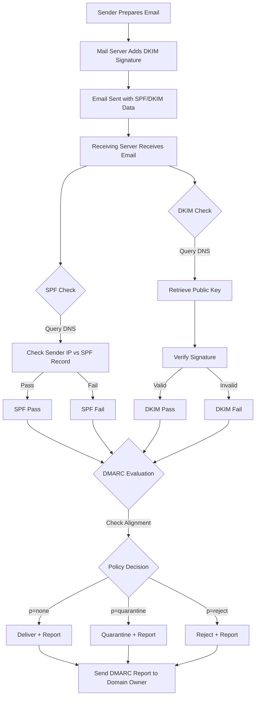

## Email Authentication - SPF, DKIM, and DMARC

This section covers email authentication protocols including DKIM, DMARC, and SPF for securing email communications and preventing spoofing.

The guide is split by protocol. If you are starting from nothing, work through them in order — DMARC depends on SPF and DKIM already being in place.

| Page | Covers |
|------|--------|
| [SPF (Sender Policy Framework)](spf.md) | How SPF works, record syntax, mechanisms, redirect vs include, the 10-lookup limit, best practices |
| [SPF Subdomain Protection and Attack Vectors](spf-security.md) | Subdomain and non-sending domain policies, spoofing and upstream-include attack vectors |
| [SPF Testing and Validation](spf-testing.md) | `dig` and `nslookup` checks, lookup counting, online validators, automated monitoring |
| [SPF Troubleshooting and Migration](spf-troubleshooting.md) | Common failure modes and fixes, the rollout checklist, syntax quick-reference card |
| [DKIM (DomainKeys Identified Mail)](dkim.md) | How DKIM works, signature fields, key generation, DNS publication, signing setup, selectors |
| [DKIM Testing and Troubleshooting](dkim-testing.md) | Signature verification, header inspection, and the common causes of DKIM failure |
| [DKIM Key Rotation and Operations](dkim-operations.md) | Key rotation procedure, best practices, migration checklist, quick reference |
| [DMARC (Domain-based Message Authentication)](dmarc.md) | How DMARC builds on SPF and DKIM, record syntax, strict vs relaxed alignment, creating records |
| [DMARC Reports and Analysis](dmarc-reports.md) | Aggregate (RUA) and forensic (RUF) reports, report format, analysis workflow |
| [DMARC Policy Rollout](dmarc-rollout.md) | Deployment phases, percentage rollout, migration checklist, quick reference |
| [DMARC Testing and Troubleshooting](dmarc-testing.md) | Record validation, alignment testing, and common DMARC failure modes |

## Overview

Email authentication protocols form the foundation of modern email security, working together to verify message authenticity and protect against phishing, spoofing, domain impersonation, and other email-based attacks. These protocols have become essential as email remains one of the primary attack vectors for cybercriminals.

The three primary protocols work in concert:

- **SPF** (Sender Policy Framework) - Validates that emails come from authorized sending servers for a domain
- **DKIM** (DomainKeys Identified Mail) - Cryptographically signs email messages to verify sender identity and message integrity
- **DMARC** (Domain-based Message Authentication, Reporting & Conformance) - Provides a policy framework and reporting mechanism that builds on SPF and DKIM

### Why Email Authentication Matters

Email was originally designed without authentication mechanisms, making it trivial for attackers to forge sender addresses. This fundamental security gap has led to:

- **Phishing attacks** - Criminals impersonating legitimate organizations
- **Business Email Compromise (BEC)** - Attackers posing as executives or partners
- **Brand reputation damage** - Fraudulent emails appearing to come from your domain
- **Email deliverability issues** - Legitimate emails being rejected or marked as spam

Modern email receivers increasingly require proper authentication, with major providers like Gmail, Yahoo, and Microsoft enforcing strict policies. Domains without proper authentication face significant deliverability challenges.

### The Three-Layer Defense

Email authentication uses a defense-in-depth approach:

1. **SPF (Infrastructure Layer)** - Verifies the sending server is authorized for the domain
2. **DKIM (Message Layer)** - Verifies the message hasn't been tampered with in transit
3. **DMARC (Policy Layer)** - Defines what to do when authentication fails and provides visibility

Each protocol addresses different attack vectors. SPF prevents unauthorized servers from sending mail for your domain. DKIM ensures message integrity and provides non-repudiation. DMARC ties them together with policy enforcement and reporting.

### Authentication Flow Overview

When an email is sent with full authentication:

1. **Sender** prepares message with proper headers
2. **Sending Server** adds DKIM signature using private key
3. **Message** travels through internet with SPF and DKIM data
4. **Receiving Server** checks SPF by querying DNS for authorized senders
5. **Receiving Server** verifies DKIM signature using public key from DNS
6. **Receiving Server** checks DMARC policy and alignment
7. **Action Taken** based on DMARC policy (deliver, quarantine, or reject)
8. **Report Sent** to domain owner about authentication results

### Complete Email Authentication Flow Diagram



This diagram shows the complete flow of email authentication from sending to policy enforcement and reporting.

## Getting Started

Before implementing email authentication, ensure you have:

1. **DNS Access** - Ability to create and modify TXT records
2. **Mail Server Access** - Configuration rights for DKIM signing
3. **Monitoring Tools** - For DMARC report analysis
4. **Testing Environment** - Validate configurations before production
5. **Documentation** - Track all sending sources and configurations

## Implementation Roadmap

### Phase 1: SPF (Week 1-4)

- Inventory all sending sources
- Create SPF record with soft fail (~all)
- Monitor and test for 2-4 weeks
- Upgrade to hard fail (-all)

### Phase 2: DKIM (Week 5-8)

- Generate DKIM keys
- Configure mail servers for signing
- Publish DKIM DNS records
- Verify DKIM signatures in headers

### Phase 3: DMARC (Week 9-12)

- Start with p=none policy
- Monitor DMARC reports
- Identify and fix failing sources
- Gradually increase policy to quarantine, then reject

### Phase 4: Optimization (Ongoing)

- Review DMARC reports monthly
- Rotate DKIM keys annually
- Audit SPF records quarterly
- Update documentation

## Quick Reference

### SPF Record Example

```text
v=spf1 ip4:192.0.2.0/24 include:_spf.google.com -all
```

### DKIM DNS Record Example

```text
default._domainkey.example.com IN TXT "v=DKIM1; k=rsa; p=MIGfMA0GCSqGSIb3DQEBAQUAA..."
```

### DMARC Record Example

```text
_dmarc.example.com IN TXT "v=DMARC1; p=quarantine; rua=mailto:dmarc@example.com; pct=100"
```

## Authentication Flow

Complete email authentication flow:

1. **Sender Prepares** - Mail server prepares message with proper headers
2. **DKIM Signing** - Server signs message with private key
3. **Message Sent** - Email transmitted with SPF and DKIM data
4. **SPF Check** - Receiving server queries DNS for authorized senders
5. **DKIM Verification** - Receiving server verifies signature using public key
6. **DMARC Evaluation** - Server checks DMARC policy and alignment
7. **Policy Action** - Deliver, quarantine, or reject based on policy
8. **DMARC Reporting** - Reports sent to domain owner

## Best Practices Summary

### SPF Configuration Best Practices

- Start with soft fail (~all), upgrade to hard fail (-all)
- Keep DNS lookups under 10
- Use include for third-party services
- Document all sending sources
- Implement for all domains and subdomains

### DKIM Configuration Best Practices

- Use 2048-bit keys minimum
- Sign all outgoing mail
- Include key rotation schedule
- Monitor signature verification
- Sign important headers

#### DMARC Configuration Best Practices

- Start with p=none for monitoring
- Implement SPF and DKIM first
- Monitor reports regularly
- Gradually increase policy strictness
- Use subdomain policies for granular control

### General Best Practices

- Document all configurations
- Monitor authentication results
- Test before deploying changes
- Train team on email authentication
- Review and update quarterly

## Troubleshooting Resources

- [Advanced SPF Architecture Patterns](../spf-advanced-patterns.md) - Complex SPF configurations
- [SPF Testing Tools](spf-testing.md) - Validators and test commands
- [Troubleshooting Guide](spf-troubleshooting.md) - Common problems and solutions
- [Migration Checklist](spf-troubleshooting.md#spf-migration-checklist) - Step-by-step implementation guide

## External Resources

### Specifications

- [RFC 7208: SPF Specification](https://www.rfc-editor.org/rfc/rfc7208)
- [RFC 6376: DKIM Specification](https://www.rfc-editor.org/rfc/rfc6376)
- [RFC 7489: DMARC Specification](https://www.rfc-editor.org/rfc/rfc7489)

### Tools and Services

- [MXToolbox](https://mxtoolbox.com/) - Comprehensive email testing tools
- [Kitterman SPF Validator](https://www.kitterman.com/spf/validate.html) - SPF testing
- [DMARC.org](https://dmarc.org/) - DMARC resources and documentation
- [Google Postmaster Tools](https://postmaster.google.com/) - Gmail delivery insights

### Learning Resources

- [DMARC Guide](https://dmarc.org/overview/) - Complete DMARC implementation guide
- [Email Authentication Best Practices](https://www.m3aawg.org/) - Industry best practices
- [Anti-Phishing Working Group](https://apwg.org/) - Phishing prevention resources

## Glossary

**SPF (Sender Policy Framework)** - Email authentication method that validates authorized sending servers

**DKIM (DomainKeys Identified Mail)** - Cryptographic authentication that signs email messages

**DMARC (Domain-based Message Authentication, Reporting & Conformance)** - Policy framework building on SPF and DKIM

**DNS (Domain Name System)** - System that stores email authentication records

**Envelope Sender** - Return-path address used in SMTP transaction (checked by SPF)

**Hard Fail** - SPF policy (-all) that explicitly fails unauthorized senders

**Soft Fail** - SPF policy (~all) that marks but doesn't reject unauthorized senders

**DNS Lookup** - Query to DNS server (SPF limited to 10 per validation)

**Include Mechanism** - SPF mechanism that references another domain's SPF record

**Redirect Modifier** - SPF modifier that replaces entire SPF record with another domain's

**CIDR Notation** - IP address range notation (e.g., 192.0.2.0/24)

**Alignment** - DMARC requirement that SPF/DKIM domain matches From header domain

## Related Topics

- [SMTP](../index.md) - SMTP fundamentals and server configuration
- [Advanced SPF Patterns](../spf-advanced-patterns.md) - Complex redirect and include architectures
- [Postfix](../../postfix/index.md) - Implementing DKIM signing on Postfix
- [Exchange](../../exchange/index.md) - Microsoft Exchange configuration
- [Email Security](../../../../security/networking/index.md) - Network and email security topics
