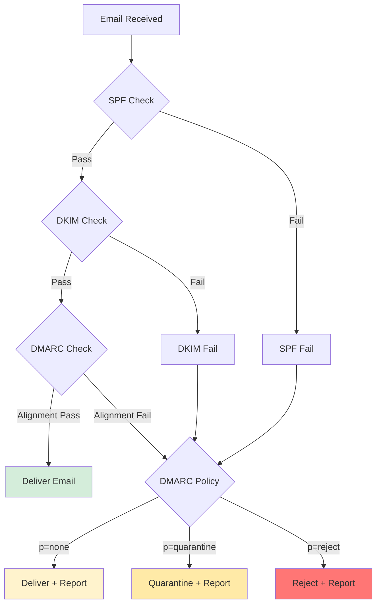

## SPF Security

Two areas where SPF records most often fall short in practice: subdomains left
unprotected, and record structures that an attacker can turn to their advantage.

### SPF Subdomain Protection

**CRITICAL SECURITY REQUIREMENT:** Protecting subdomains with SPF is not optional—it's essential to prevent subdomain spoofing attacks. Attackers actively target unprotected subdomains because they're often overlooked in SPF configurations.

#### Why Subdomain Protection Matters

By default, **subdomains do NOT inherit** the parent domain's SPF record. This creates a significant security vulnerability:

**The Attack Scenario:**

```text
# You protect your main domain
example.com. IN TXT "v=spf1 mx -all"

# But forget subdomains...
# mail.example.com - No SPF record
# app.example.com - No SPF record
# support.example.com - No SPF record

# Result: Attackers can spoof emails from:
# - support@support.example.com
# - admin@app.example.com
# - noreply@mail.example.com
```

**Real-World Impact:**

- ✅ Users trust emails from `support@support.example.com` because it's your domain
- ❌ No SPF protection means ANY server can send as that subdomain
- 📧 Phishing emails appear legitimate and bypass many filters
- 💰 Brand damage and potential legal liability

#### Comprehensive Subdomain SPF Configuration

##### Configuration Strategy

**Step 1: Identify Subdomain Types:**

Categorize your subdomains:

1. **Sending subdomains** - Legitimate mail servers (need specific SPF)
2. **Non-sending subdomains** - No legitimate email (need restrictive SPF)
3. **Wildcard protection** - Catch-all for undefined subdomains

##### Step 2: Configure Sending Subdomains

For subdomains that send legitimate email, create specific SPF records:

```text
# Marketing emails
marketing.example.com. IN TXT "v=spf1 include:sendgrid.net -all"

# Transactional emails from application
app.example.com. IN TXT "v=spf1 ip4:192.0.2.100 ip4:192.0.2.101 -all"

# Support system emails
support.example.com. IN TXT "v=spf1 include:zendesk.com -all"

# Newsletter subdomain
news.example.com. IN TXT "v=spf1 include:servers.mcsv.net -all"
```

##### Step 3: Protect Non-Sending Subdomains

For subdomains that should NEVER send email, use the most restrictive SPF:

```text
# Internal applications (no email)
internal.example.com. IN TXT "v=spf1 -all"

# Development environment
dev.example.com. IN TXT "v=spf1 -all"

# API endpoints
api.example.com. IN TXT "v=spf1 -all"

# Static content CDN
cdn.example.com. IN TXT "v=spf1 -all"

# Documentation site
docs.example.com. IN TXT "v=spf1 -all"
```

**Critical:** Use `-all` (hard fail), not `~all` (soft fail), for non-sending domains.

##### Step 4: Implement Wildcard Protection

**The Most Important Security Control:**

```text
# Wildcard SPF - protects ALL undefined subdomains
*.example.com. IN TXT "v=spf1 -all"
```

**What this does:**

- ✅ Protects every subdomain that doesn't have an explicit SPF record
- ✅ Prevents attackers from spoofing `random123.example.com`
- ✅ Provides defense-in-depth even if you miss a subdomain
- ✅ Stops subdomain enumeration attacks via email

**Record Precedence:**

```text
# Specific records override wildcard
example.com. IN TXT "v=spf1 mx -all"                    # Main domain
mail.example.com. IN TXT "v=spf1 a -all"                 # Specific subdomain
*.example.com. IN TXT "v=spf1 -all"                      # Wildcard catch-all

# Resolution examples:
# example.com         → Uses first record (mx mechanism)
# mail.example.com    → Uses second record (a mechanism)
# random.example.com  → Uses wildcard record (-all only)
# any.other.example.com → Uses wildcard record (-all only)
```

#### Complete DNS Zone Example

Here's a complete zone file demonstrating comprehensive subdomain protection:

```text
; Main domain SPF
example.com. IN TXT "v=spf1 mx include:_spf.google.com -all"

; Explicit sending subdomains
mail.example.com. IN TXT "v=spf1 a -all"
smtp.example.com. IN TXT "v=spf1 ip4:192.0.2.0/24 -all"
marketing.example.com. IN TXT "v=spf1 include:sendgrid.net -all"
transactional.example.com. IN TXT "v=spf1 include:_spf.sparkpost.com -all"

; Explicit non-sending subdomains
www.example.com. IN TXT "v=spf1 -all"
api.example.com. IN TXT "v=spf1 -all"
cdn.example.com. IN TXT "v=spf1 -all"
static.example.com. IN TXT "v=spf1 -all"
dev.example.com. IN TXT "v=spf1 -all"
staging.example.com. IN TXT "v=spf1 -all"
test.example.com. IN TXT "v=spf1 -all"

; Wildcard protection for everything else
*.example.com. IN TXT "v=spf1 -all"
```

#### Why Soft Fail (~all) is Dangerous

**⚠️ NEVER use `~all` (soft fail) in production, especially for non-sending domains:**

##### The Problem with Soft Fail

```text
# DANGEROUS - Soft fail
*.example.com. IN TXT "v=spf1 ~all"
```

**What soft fail means:**

- `~all` = "This server is probably not authorized, but don't reject the email"
- Receiving servers often deliver these emails anyway
- **Result:** Spoofing protection is essentially disabled

**Real-world impact:**

```text
# Attacker sends phishing email
From: password-reset@secure.example.com
Authentication-Results: mx.google.com;
  spf=softfail (domain owner discourages use of this host)

# Gmail's decision:
# - SPF says "softfail" 
# - Not a hard failure
# - Other signals (DKIM, DMARC) also weak/missing
# - Email is delivered to inbox or spam folder
# - User clicks phishing link
```

##### Hard Fail vs Soft Fail Comparison

| Qualifier | Meaning | Attacker Result | Use Case |
| --------- | ------- | --------------- | -------- |
| `-all` | Hard fail - **reject** | Email rejected | Production domains |
| `~all` | Soft fail - **accept but mark** | Email delivered | Testing phase only |
| `?all` | Neutral - **no policy** | Email delivered | No protection |
| `+all` | Pass - **explicitly allow** | Email delivered | Never use! |

**Bottom line:** In production, use `-all` for all domains and subdomains. Use `~all` only during initial testing periods.

#### Subdomain SPF Testing

**Test each subdomain:**

```bash
# Test main domain
dig +short TXT example.com | grep spf

# Test specific subdomains
dig +short TXT mail.example.com | grep spf
dig +short TXT marketing.example.com | grep spf

# Test wildcard (query non-existent subdomain)
dig +short TXT nonexistent123.example.com | grep spf
```

**Expected results:**

```text
# Main domain
"v=spf1 mx include:_spf.google.com -all"

# Specific subdomain
"v=spf1 a -all"

# Non-existent (should return wildcard)
"v=spf1 -all"
```

**Send test emails from subdomains:**

```bash
# Test from authorized subdomain
echo "Test from mail subdomain" | mail -a "From: test@mail.example.com" -s "SPF Test" recipient@gmail.com

# Check headers for: spf=pass

# Test from non-sending subdomain (should fail)
echo "Test from api subdomain" | mail -a "From: test@api.example.com" -s "SPF Test" recipient@gmail.com

# Check headers for: spf=fail
```

#### Subdomain Security Checklist

Before considering subdomain protection complete, verify:

- [ ] Main domain has SPF record with `-all`
- [ ] All email-sending subdomains have specific SPF records
- [ ] All non-sending subdomains have `v=spf1 -all` records
- [ ] Wildcard SPF record `*.example.com` configured with `-all`
- [ ] NO domains use `~all` in production (only during initial testing)
- [ ] NO domains use `?all` or `+all` (provides no/negative protection)
- [ ] Test emails from each sending subdomain show `spf=pass`
- [ ] Test emails from non-sending subdomains show `spf=fail`
- [ ] DMARC policy covers all subdomains (see DMARC section)
- [ ] Regular audits of new subdomains (quarterly review)

#### Common Subdomain Mistakes

##### Mistake 1: Forgetting Wildcard

```text
# Incomplete - Only main domain protected
example.com. IN TXT "v=spf1 mx -all"

# Missing: *.example.com protection
# Result: Any undefined subdomain can be spoofed
```

##### Mistake 2: Using Soft Fail for Non-Sending Domains

```text
# WRONG - Soft fail provides weak protection
dev.example.com. IN TXT "v=spf1 ~all"
api.example.com. IN TXT "v=spf1 ~all"

# CORRECT - Hard fail prevents spoofing
dev.example.com. IN TXT "v=spf1 -all"
api.example.com. IN TXT "v=spf1 -all"
```

##### Mistake 3: Assuming Inheritance

```text
# Developers often assume this works:
example.com. IN TXT "v=spf1 mx -all"
# Expectation: mail.example.com inherits parent SPF
# Reality: mail.example.com has NO SPF protection!

# Must explicitly configure:
mail.example.com. IN TXT "v=spf1 a -all"
```

#### Multi-Level Subdomain Protection

For deep subdomain hierarchies:

```text
# Second-level subdomains also need protection
app.prod.example.com. IN TXT "v=spf1 ip4:192.0.2.50 -all"
api.prod.example.com. IN TXT "v=spf1 -all"

# Wildcard at multiple levels
*.prod.example.com. IN TXT "v=spf1 -all"
*.dev.example.com. IN TXT "v=spf1 -all"
*.example.com. IN TXT "v=spf1 -all"
```

**Note:** Most DNS providers support multi-level wildcards, but verify with your provider.

#### Automated Subdomain Discovery

**Script to find unprotected subdomains:**

```bash
#!/bin/bash
# Find subdomains without SPF protection

DOMAIN="example.com"
SUBDOMAINS_FILE="subdomains.txt"

echo "Checking SPF records for subdomains of $DOMAIN..."
echo

while IFS= read -r subdomain; do
    FULL_DOMAIN="${subdomain}.${DOMAIN}"
    SPF=$(dig +short TXT "$FULL_DOMAIN" | grep "v=spf1" || true)
    
    if [ -z "$SPF" ]; then
        echo "⚠️  MISSING: $FULL_DOMAIN has no SPF record"
    else
        echo "✓ $FULL_DOMAIN: $SPF"
    fi
done < "$SUBDOMAINS_FILE"
```

**Usage:**

```bash
# Create subdomain list
echo -e "mail\napp\napi\nmarketing\nsupport" > subdomains.txt

# Run check
./check-subdomain-spf.sh
```

### SPF Security and Attack Vectors

Understanding how attackers exploit SPF weaknesses helps you build stronger email authentication defenses.

#### SPF Bypass Techniques

Attackers use various techniques to bypass or exploit SPF protection:

##### Attack 1: Subdomain Spoofing

**Technique:** Target unprotected subdomains

```text
# Main domain protected
example.com. IN TXT "v=spf1 mx -all"

# Subdomain unprotected
# support.example.com - No SPF record

# Attacker sends:
From: security@support.example.com
Subject: Urgent: Password Reset Required
```

**Why it works:**

- Users trust `@support.example.com` addresses
- No SPF record = no authentication check
- Email passes most filters

**Defense:**

```text
# Protect all subdomains with wildcard
*.example.com. IN TXT "v=spf1 -all"
```

##### Attack 2: Display Name Spoofing

**Technique:** SPF checks envelope sender, not display name

```text
# SPF checks this (MAIL FROM):
Return-Path: <attacker@malicious.com>

# But users see this (From header):
From: "IT Department" <it@example.com>
```

**SPF Result:**

```text
Authentication-Results: mx.google.com;
  spf=pass (malicious.com SPF passes)
  # SPF doesn't verify From header!
```

**Why it works:**

- SPF only validates envelope sender (MAIL FROM/Return-Path)
- Display name and From header are not checked by SPF
- Email clients show the From header prominently

**Defense:**

- **DKIM** signs the From header, detecting modifications
- **DMARC** requires alignment between envelope and header From
- Combined SPF + DKIM + DMARC prevents this attack

##### Attack 3: Email Forwarding Bypass

**Technique:** Exploit SPF's forwarding problem

```text
1. Attacker sends email through legitimate service with valid SPF
2. Recipient's mailbox forwards to final destination
3. Final destination sees forwarding server's IP, not original
4. SPF check fails for forwarded email
```

**Why it works:**

- SPF breaks with forwarding (by design)
- Legitimate emails may fail SPF after forwarding
- Creates confusion about SPF reliability

**Defense:**

- **SRS (Sender Rewriting Scheme)** at forwarding servers
- Rely on **DKIM** which survives forwarding
- **DMARC** with DKIM alignment handles this scenario

##### Attack 4: Soft Fail Exploitation

**Technique:** Soft fail doesn't prevent delivery

```text
# Weak SPF configuration
example.com. IN TXT "v=spf1 ~all"

# Attacker sends from any IP:
From: admin@example.com
Sending IP: 203.0.113.50 (attacker controlled)

# Result:
Authentication-Results: mx.gmail.com;
  spf=softfail (sender IP is 203.0.113.50)

# Email still delivered!
```

**Why it works:**

- `~all` means "probably not authorized" but not a hard fail
- Many receivers deliver softfail emails anyway
- Provides false sense of security

**Defense:**

```text
# Use hard fail in production
example.com. IN TXT "v=spf1 mx include:_spf.google.com -all"
```

##### Attack 5: Cousin Domain Spoofing

**Technique:** Register similar domain with no SPF checks

```text
# Legitimate domain
example.com. IN TXT "v=spf1 mx -all"

# Attacker registers similar domain
examp1e.com. - No SPF record needed (attacker controls it)

# Attacker sends:
From: admin@examp1e.com  # Note the "1" instead of "l"
```

**Why it works:**

- Attacker controls `examp1e.com`, so SPF passes
- Visual similarity deceives users
- SPF can't protect against this

**Defense:**

- Register common typosquatting domains
- Configure SPF `-all` for defensive registrations
- User training to verify sender domains
- **DMARC** reports show unauthorized use of your domain (not cousin domains)

#### SPF Forgery Detection Limitations

SPF alone has significant limitations in detecting forgery:

##### Limitation 1: Header vs Envelope

**What SPF checks:**

```text
✓ Envelope Sender (MAIL FROM/Return-Path)
✗ From Header (what users see)
✗ Reply-To Header
✗ Display Name
```

**Real example:**

```text
Return-Path: <legitimate@authorized.com>  # SPF checks this
From: "CEO" <ceo@yourcompany.com>         # SPF ignores this
Reply-To: attacker@malicious.com           # SPF ignores this
```

**SPF result:** PASS (because envelope sender is authorized)  
**Actual threat:** High (users see forged From header)

##### Limitation 2: No Message Integrity

SPF doesn't detect message tampering:

```text
# Email passes SPF validation
# Then content is modified in transit
# SPF can't detect this
```

**Defense:** Use DKIM for message integrity verification

##### Limitation 3: No Replay Protection

SPF doesn't prevent legitimate emails from being replayed:

```text
# Attacker intercepts legitimate email that passed SPF
# Replays it to different recipients
# SPF still passes (legitimate sender's IP)
```

**Defense:** DKIM signatures include timestamps and can expire

##### Limitation 4: Shared Infrastructure

Many legitimate senders share IP addresses:

```text
# Shared hosting environment
IP 192.0.2.100 sends for:
- example.com (your domain)
- attacker.com (attacker's domain)
- other-site.com (unrelated site)

# SPF passes for all domains using this IP
# No way to distinguish legitimate vs attacker
```

**Defense:** Use dedicated IP addresses or services with proper segmentation

#### Email Forgery Techniques Beyond SPF

Attackers use multiple techniques that SPF alone cannot prevent:

##### Technique 1: SMTP Header Injection

```text
# Attacker adds multiple From headers
From: attacker@malicious.com
From: ceo@example.com

# Some clients display second header
# SPF checks envelope, not headers
```

##### Technique 2: Homograph Attacks

```text
# Using Unicode lookalikes
exаmple.com  # Uses Cyrillic 'а' (U+0430)
example.com  # Uses Latin 'a' (U+0061)

# Visually identical, different domains
# Each has its own SPF record
```

##### Technique 3: Compromised Accounts

```text
# Attacker compromises legitimate user account
# Sends from legitimate server with valid SPF
# SPF passes because it's a legitimate source

# SPF cannot detect:
- Compromised credentials
- Insider threats
- Lateral movement
```

#### Comprehensive Email Authentication Security

To properly defend against email forgery, use all three protocols together:



**Layered Security Approach:**

1. **SPF** - Validates sending server infrastructure
2. **DKIM** - Verifies message integrity and signing domain
3. **DMARC** - Enforces alignment and provides reporting

**Example of complete protection:**

```text
# SPF record
example.com. IN TXT "v=spf1 mx include:_spf.google.com -all"

# DKIM public key
default._domainkey.example.com. IN TXT "v=DKIM1; k=rsa; p=MIGfMA0GCSqGSIb3..."

# DMARC policy
_dmarc.example.com. IN TXT "v=DMARC1; p=reject; rua=mailto:dmarc@example.com; ruf=mailto:forensic@example.com; pct=100"
```

#### SPF Security Deployment Checklist

Before considering your SPF security complete:

**Infrastructure Security:**

- [ ] All sending IPs documented and authorized in SPF
- [ ] Third-party service SPF includes verified and monitored
- [ ] DNS lookup count under 10 (preferably under 8)
- [ ] SPF record uses `-all` (hard fail) in production
- [ ] No use of deprecated `ptr` mechanism

**Subdomain Protection:**

- [ ] All subdomains have explicit SPF records
- [ ] Wildcard SPF `*.example.com` configured with `-all`
- [ ] Non-sending subdomains use `v=spf1 -all`
- [ ] Regular subdomain audits (quarterly minimum)

**Testing and Validation:**

- [ ] SPF passes from all legitimate sending sources
- [ ] SPF fails from unauthorized test sources
- [ ] Authentication headers show `spf=pass` for legitimate mail
- [ ] PermError testing completed (syntax, lookup limits)
- [ ] Test emails sent from all subdomains

**Monitoring and Response:**

- [ ] SPF failure monitoring alerts configured
- [ ] DNS lookup count monitoring in place
- [ ] Regular SPF record audits scheduled
- [ ] Incident response plan for SPF bypass attempts
- [ ] DMARC reports reviewed for SPF failures

**Defense in Depth:**

- [ ] DKIM configured for all sending sources
- [ ] DMARC policy published with reporting
- [ ] DMARC policy progressed to `p=quarantine` or `p=reject`
- [ ] Regular review of DMARC aggregate reports
- [ ] Forensic reports analyzed for attack patterns

**Documentation:**

- [ ] SPF record changes documented with rationale
- [ ] Authorized sending sources inventory maintained
- [ ] Third-party service configurations documented
- [ ] Emergency contact procedures for SPF issues
- [ ] Runbook for SPF lookup limit exceeded

#### Advanced Security Considerations

##### Rate Limiting and Anomaly Detection

While SPF doesn't provide these features, implement at SMTP level:

```text
# Postfix example - rate limiting
smtpd_client_connection_rate_limit = 100
smtpd_client_message_rate_limit = 50
smtpd_client_recipient_rate_limit = 100
```

##### Geographic IP Restrictions

If your mail servers are in specific regions:

```text
# SPF with specific IP ranges
v=spf1 ip4:192.0.2.0/24 ip4:198.51.100.0/24 -all

# Consider geo-blocking at firewall level
# Allow SMTP only from expected geographic regions
```

##### Emergency SPF Rollback Procedure

Document steps for emergency SPF changes:

1. **Identify issue** - SPF too restrictive, blocking legitimate mail
2. **Temporary softfail** - Change `-all` to `~all` temporarily
3. **Update DNS** - Make correction with low TTL (300s)
4. **Verify fix** - Test from affected sources
5. **Restore hardfail** - Change back to `-all` after verification
6. **Post-incident review** - Document what went wrong

```bash
# Emergency rollback script
#!/bin/bash
DOMAIN="example.com"

# Backup current SPF
CURRENT_SPF=$(dig +short TXT "$DOMAIN" | grep "v=spf1")
echo "Current SPF: $CURRENT_SPF" > spf-backup-$(date +%Y%m%d-%H%M%S).txt

# Temporarily softfail (manual DNS update required)
echo "Change SPF to: ${CURRENT_SPF/-all/~all}"
echo "After fixing, restore: $CURRENT_SPF"
```

## Related Topics

- [Email Authentication Overview](index.md)
- [SPF (Sender Policy Framework)](spf.md)
- [SPF Subdomain Protection and Attack Vectors](spf-security.md)
- [SPF Testing and Validation](spf-testing.md)
- [SPF Troubleshooting and Migration](spf-troubleshooting.md)
- [DKIM (DomainKeys Identified Mail)](dkim.md)
- [DKIM Testing and Troubleshooting](dkim-testing.md)
- [DKIM Key Rotation and Operations](dkim-operations.md)
- [DMARC (Domain-based Message Authentication)](dmarc.md)
- [DMARC Reports and Analysis](dmarc-reports.md)
- [DMARC Policy Rollout](dmarc-rollout.md)
- [DMARC Testing and Troubleshooting](dmarc-testing.md)
