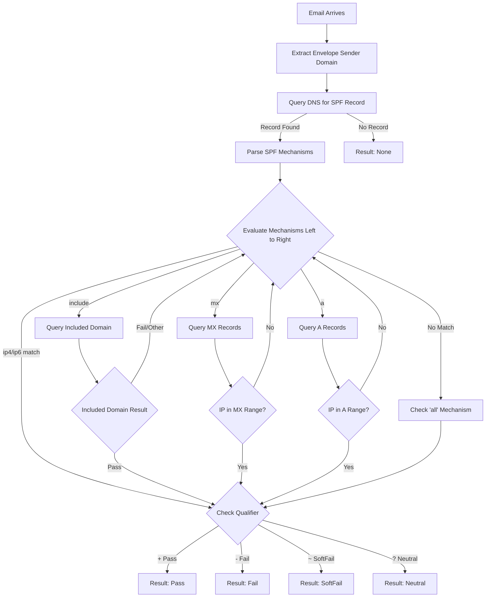
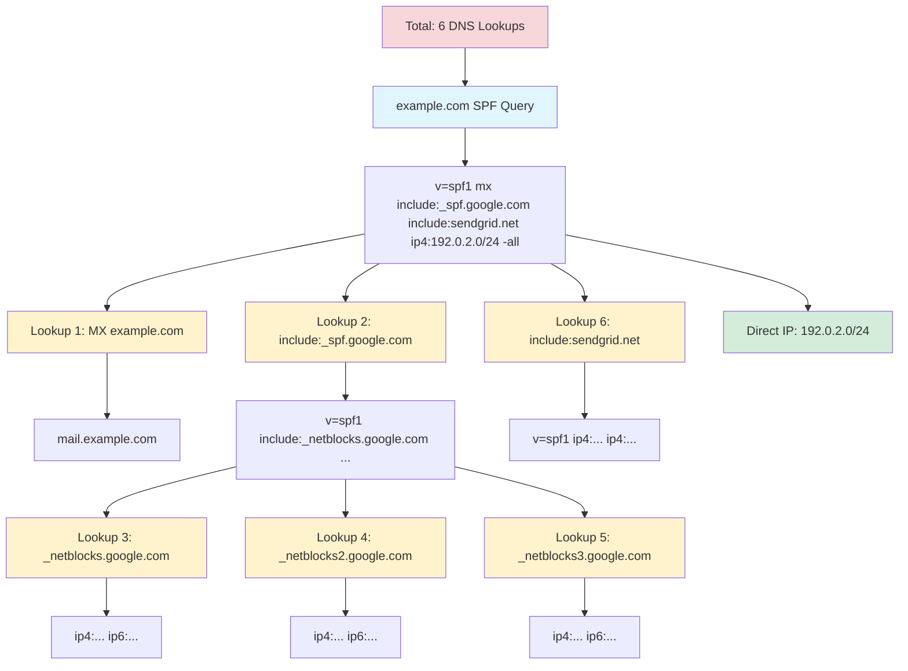

## SPF (Sender Policy Framework)

### SPF Overview

SPF, defined in RFC 7208, allows domain owners to specify which mail servers are authorized to send email on behalf of their domain. It works by publishing a DNS TXT record listing authorized sending sources. Receiving mail servers check this record against the actual sending server's IP address.

### How SPF Works

The SPF verification process occurs during the SMTP transaction:

1. **Receiving server** accepts connection from sending server
2. **MAIL FROM** command specifies the envelope sender (return-path)
3. **Receiving server** extracts domain from envelope sender
4. **DNS query** retrieves SPF record from sender's domain
5. **IP comparison** checks if sending server IP matches SPF record
6. **Result determined** - pass, fail, softfail, neutral, or none
7. **Action taken** based on result and local policy

SPF checks happen before message content is transmitted, making it an efficient first line of defense.

#### SPF Validation Flow Diagram



This diagram illustrates the step-by-step SPF validation process from email receipt to final result determination.

### SPF Record Syntax

An SPF record is published as a DNS TXT record for the domain. Basic syntax:

```text
v=spf1 [mechanisms] [modifiers]
```

#### Required Elements

- `v=spf1` - Version identifier (always spf1, must be first)

#### Mechanisms

Mechanisms define authorized sending sources. Evaluated left to right, first match wins:

| Mechanism | Description | Example |
| --- | --- | --- |
| `all` | Matches all IPs (catch-all) | `v=spf1 -all` |
| `ip4` | IPv4 address or range | `ip4:192.0.2.0/24` |
| `ip6` | IPv6 address or range | `ip6:2001:db8::/32` |
| `a` | Domain's A record | `a:mail.example.com` |
| `mx` | Domain's MX records | `mx:example.com` |
| `include` | Include another domain's SPF | `include:_spf.google.com` |
| `exists` | Check if domain exists | `exists:%{i}.spf.example.com` |
| `ptr` | PTR record (deprecated) | `ptr:example.com` |

#### Qualifiers

Each mechanism can have a qualifier prefix:

| Qualifier | Symbol | Meaning | Result |
| --- | --- | --- | --- |
| Pass | `+` | Authorized (default) | Pass |
| Fail | `-` | Not authorized | Fail (hard fail) |
| SoftFail | `~` | Probably not authorized | SoftFail |
| Neutral | `?` | No assertion | Neutral |

Examples:

```text
+ip4:192.0.2.0/24    Explicitly pass
-all                 Fail all others (hard fail)
~all                 Soft fail all others (common)
?all                 Neutral (don't use)
```

#### Modifiers

Modifiers provide additional information:

| Modifier | Description | Example |
| --- | --- | --- |
| `redirect` | Redirect to another domain's SPF | `redirect=_spf.example.com` |
| `exp` | Explanation for failures | `exp=explain.example.com` |

### Creating SPF Records

#### Basic SPF Record

Simplest configuration - only allow domain's MX servers:

```text
example.com. IN TXT "v=spf1 mx -all"
```

This means:

- `v=spf1` - SPF version 1
- `mx` - Authorize servers listed in domain's MX records
- `-all` - Hard fail all others

#### Common SPF Configurations

**Company using own mail servers:**

```text
v=spf1 mx ip4:192.0.2.0/24 -all
```

**Using third-party email service (like Google Workspace):**

```text
v=spf1 include:_spf.google.com -all
```

**Multiple sending sources:**

```text
v=spf1 mx include:_spf.google.com include:servers.mcsv.net ip4:203.0.113.0/24 -all
```

**Subdomain delegation:**

```text
mail.example.com. IN TXT "v=spf1 ip4:192.0.2.10 -all"
```

**Complex organization:**

```text
v=spf1 mx include:_spf.google.com include:_spf.salesforce.com include:servers.mcsv.net ip4:192.0.2.0/24 ip4:198.51.100.0/24 -all
```

#### SPF for Subdomains

By default, subdomains don't inherit the parent domain's SPF record. You must create explicit records:

```text
# Parent domain
example.com. IN TXT "v=spf1 mx -all"

# Subdomain for marketing
marketing.example.com. IN TXT "v=spf1 include:servers.mcsv.net -all"

# Subdomain for transactional email
app.example.com. IN TXT "v=spf1 ip4:203.0.113.50 -all"

# Prevent subdomain spoofing (no legitimate email)
*.example.com. IN TXT "v=spf1 -all"
```

### SPF Mechanisms in Detail

#### IP4 and IP6 Mechanisms

Specify exact IP addresses or ranges:

```text
# Single IPv4 address
v=spf1 ip4:192.0.2.10 -all

# IPv4 CIDR range
v=spf1 ip4:192.0.2.0/24 -all

# Multiple IPv4 ranges
v=spf1 ip4:192.0.2.0/24 ip4:198.51.100.0/24 -all

# IPv6 address
v=spf1 ip6:2001:db8::1 -all

# IPv6 range
v=spf1 ip6:2001:db8::/32 -all

# Mixed IPv4 and IPv6
v=spf1 ip4:192.0.2.0/24 ip6:2001:db8::/32 -all
```

#### Include Mechanism

Include another domain's SPF policy. Most common for third-party services:

```text
v=spf1 include:_spf.google.com include:_spf.salesforce.com -all
```

Important: `include` only passes if the included domain returns Pass. If it returns Fail, evaluation continues.

Nesting depth limited to 10 DNS lookups total (see Limitations section).

### Redirect vs Include: Decision Guide

Understanding when to use `redirect` versus `include` is critical for efficient SPF design.

#### Quick Decision Tree

```text
┌─────────────────────────────────────────┐
│ Do you need to add mechanisms           │
│ beyond the delegated record?            │
└──────────────┬──────────────────────────┘
               │
       ┌───────┴───────┐
       │               │
      NO              YES
       │               │
       ↓               ↓
  Use REDIRECT    Use INCLUDE
       │               │
       ↓               ↓
┌─────────────┐  ┌──────────────┐
│ Full        │  │ Modular      │
│ Delegation  │  │ Composition  │
└─────────────┘  └──────────────┘
```

#### Comparison Table

| Factor | Redirect | Include |
| ------ | -------- | ------- |
| **Purpose** | Replace entire SPF | Add to existing SPF |
| **DNS Lookups** | 1 | 1 per include |
| **Additional Mechanisms** | ❌ Cannot add | ✅ Can add |
| **All Mechanism** | In redirected record | In both main & included |
| **Use Case** | All domains same infrastructure | Mix internal + third-party |
| **Management** | Centralized (single team) | Distributed (multiple teams) |
| **Lookup Efficiency** | Most efficient | Moderate |
| **Best For** | Multi-brand/domain consolidation | Modular service separation |

#### Redirect: When and How

**Use redirect when:**

- ✅ All domains use identical mail infrastructure
- ✅ You manage multiple domains/brands centrally
- ✅ You want maximum DNS lookup efficiency
- ✅ You need single-point SPF management
- ✅ Domains have no unique sending sources

**Example: Multi-Brand Organization:**

```text
# All brands redirect to shared infrastructure
acmecorp.com. IN TXT "v=spf1 redirect=_spf.acmecorp.com"
acmebrands.com. IN TXT "v=spf1 redirect=_spf.acmecorp.com"
acmeservices.com. IN TXT "v=spf1 redirect=_spf.acmecorp.com"

# Single SPF definition
_spf.acmecorp.com. IN TXT "v=spf1 mx include:_spf.google.com ip4:192.0.2.0/24 -all"
```

**Benefits:**

- Update once, affects all domains
- Reduces total DNS lookups
- Simple maintenance
- Clear infrastructure ownership

**DNS Lookup Analysis:**

```bash
# Check redirect
dig TXT acmecorp.com +short
# v=spf1 redirect=_spf.acmecorp.com

dig TXT _spf.acmecorp.com +short
# v=spf1 mx include:_spf.google.com ip4:192.0.2.0/24 -all

# Total lookups: 1 (redirect) + 1 (mx) + 1 (include) = 3 ✓
```

#### Include: When and How

**Use include when:**

- ✅ Combining internal servers + third-party services
- ✅ Different departments manage different services
- ✅ Domains have unique sending sources
- ✅ You need modular, flexible architecture
- ✅ You want per-function separation

**Example: Department-Based Management:**

```text
# Main domain coordinates sources
example.com. IN TXT "v=spf1 include:_spf-corp.example.com include:_spf-cloud.example.com -all"

# IT department manages infrastructure
_spf-corp.example.com. IN TXT "v=spf1 mx ip4:192.0.2.0/24 -all"

# Marketing manages cloud services
_spf-cloud.example.com. IN TXT "v=spf1 include:_spf.google.com include:servers.mcsv.net -all"
```

**Benefits:**

- Team ownership per include
- Add/remove services independently
- Logical grouping by function
- Easier troubleshooting

**DNS Lookup Analysis:**

```bash
# Total lookups:
# 2 (includes in main) + 1 (mx) + 2 (includes in cloud) = 5 ✓
```

#### Architectural Decision Flowchart

```text
                    ┌─────────────────────┐
                    │ Starting SPF Design │
                    └──────────┬──────────┘
                               │
                               ↓
                    ┌─────────────────────┐
                    │ How many domains?   │
                    └──────────┬──────────┘
                               │
                  ┌────────────┴─────────────┐
                  │                          │
            Single Domain              Multiple Domains
                  │                          │
                  ↓                          ↓
         ┌─────────────────┐      ┌──────────────────────┐
         │ Same sending    │      │ Same infrastructure  │
         │ infrastructure  │      │ across all domains?  │
         │ for all mail?   │      └──────────┬───────────┘
         └────────┬────────┘                 │
                  │              ┌───────────┴────────────┐
         ┌────────┴────────┐     │                        │
         │                 │    YES                       NO
        YES               NO     │                        │
         │                 │     ↓                        ↓
         ↓                 ↓  ┌──────────────┐  ┌─────────────────┐
   ┌──────────┐    ┌──────────────┐  │ Use REDIRECT │  │ Each domain has │
   │ Direct   │    │ Use INCLUDE  │  │              │  │ unique sources? │
   │ IP/MX    │    │ - Group by   │  │ Benefits:    │  └────────┬────────┘
   │ listing  │    │   function   │  │ • Efficient  │           │
   │          │    │ - Team-based │  │ • Central    │  ┌────────┴────────┐
   │ Example: │    │   ownership  │  │   mgmt       │  │                 │
   │ v=spf1   │    │              │  │ • Simple     │ YES               NO
   │ mx       │    │ Example:     │  └──────────────┘  │                 │
   │ ip4:...  │    │ v=spf1       │                    ↓                 ↓
   │ -all     │    │ include:_corp│         ┌──────────────┐  ┌──────────────┐
   └──────────┘    │ include:_saas│         │ Use INCLUDE  │  │ Use REDIRECT │
                   │ -all         │         │ per domain   │  │ + INCLUDE    │
                   └──────────────┘         │              │  │ hybrid       │
                                            │ Benefits:    │  │              │
                                            │ • Flexible   │  │ Benefits:    │
                                            │ • Modular    │  │ • Best of    │
                                            │              │  │   both       │
                                            └──────────────┘  └──────────────┘
```

#### Common Patterns by Organization Type

**Small Business (1-2 domains):**

```text
# Simple direct listing
example.com. IN TXT "v=spf1 mx include:_spf.google.com -all"
```

**Growing Company (3-10 domains, shared infrastructure):**

```text
# Redirect pattern
example.com. IN TXT "v=spf1 redirect=_spf.example.com"
example.net. IN TXT "v=spf1 redirect=_spf.example.com"
example.org. IN TXT "v=spf1 redirect=_spf.example.com"

_spf.example.com. IN TXT "v=spf1 mx include:_spf.google.com include:_spf.salesforce.com -all"
```

**Mid-Size Enterprise (multiple departments/services):**

```text
# Include pattern with modular design
example.com. IN TXT "v=spf1 include:_spf-it.example.com include:_spf-marketing.example.com include:_spf-sales.example.com -all"

_spf-it.example.com. IN TXT "v=spf1 mx ip4:192.0.2.0/24 -all"
_spf-marketing.example.com. IN TXT "v=spf1 include:servers.mcsv.net include:_spf.sendgrid.net -all"
_spf-sales.example.com. IN TXT "v=spf1 include:_spf.salesforce.com -all"
```

**Large Enterprise (many domains/brands):**

```text
# Hybrid: Redirect for brand domains + Include for services
# Brand domains redirect to regional infrastructure
acmecorp.com. IN TXT "v=spf1 redirect=_spf-us.acme.com"
acmecorp.eu. IN TXT "v=spf1 redirect=_spf-eu.acme.com"

# Regional records use includes for services
_spf-us.acme.com. IN TXT "v=spf1 include:_spf-infra-us.acme.com include:_spf-saas.acme.com -all"
_spf-infra-us.acme.com. IN TXT "v=spf1 ip4:192.0.2.0/24 mx -all"
_spf-saas.acme.com. IN TXT "v=spf1 include:_spf.google.com include:_spf.salesforce.com -all"
```

#### Key Differences in Behavior

**Redirect Behavior:**

```bash
# When SPF checking encounters redirect:
1. Ignore all mechanisms after redirect
2. Replace current record with redirected record
3. Evaluate redirected record as if it were the original
4. Redirected record MUST have 'all' mechanism

# Example:
example.com: v=spf1 redirect=_spf.example.com
_spf.example.com: v=spf1 ip4:192.0.2.0/24 -all

# Evaluation: As if example.com had "v=spf1 ip4:192.0.2.0/24 -all"
```

**Include Behavior:**

```bash
# When SPF checking encounters include:
1. Query included domain
2. If included returns Pass → Pass
3. If included returns Fail/SoftFail/Neutral → Continue evaluation
4. If included returns TempError/PermError → TempError/PermError

# Example:
example.com: v=spf1 include:_spf.partner.com ip4:192.0.2.0/24 -all
_spf.partner.com: v=spf1 ip4:198.51.100.0/24 -all

# Sending from 192.0.2.10:
# 1. Check include → Partner IP doesn't match → Continue
# 2. Check ip4:192.0.2.0/24 → Match! → Pass
```

### Advanced Patterns

> **For Complex Scenarios**: See [Advanced SPF Architecture Patterns](../spf-advanced-patterns.md) for:
>
> - Multi-region SPF deployment strategies
> - SPF flattening techniques and tools
> - Tiered include structures
> - Vendor-specific grouping patterns
> - DNS lookup optimization
> - Enterprise-scale implementations

#### A and MX Mechanisms

Reference DNS records:

```text
# Use domain's A record
v=spf1 a -all

# Use specific host's A record
v=spf1 a:mail.example.com -all

# Use domain's MX records
v=spf1 mx -all

# Use specific domain's MX records
v=spf1 mx:example.com -all

# With CIDR notation (IP must be in range)
v=spf1 a:mail.example.com/24 -all
```

#### Exists Mechanism

Advanced mechanism for conditional logic:

```text
v=spf1 exists:%{i}.spf.example.com -all
```

Passes if the constructed domain name exists (returns any A record). Used for complex conditional authorization.

### SPF Macros

Macros enable dynamic SPF record construction:

| Macro | Expands To |
| --- | --- |
| `%{s}` | Sender email address |
| `%{l}` | Local part of sender |
| `%{d}` | Domain of sender |
| `%{i}` | Sending IP address |
| `%{v}` | IP version (in-addr/ip6) |
| `%{h}` | HELO/EHLO domain |

Example using macro for per-IP validation:

```text
v=spf1 exists:%{i}.whitelist.example.com -all
```

If sending IP is 192.0.2.10, checks for `192.0.2.10.whitelist.example.com`.

### SPF Validation Process

#### Validation Steps

1. **Extract domain** from MAIL FROM (envelope sender)
2. **Query DNS** for TXT record at domain
3. **Parse SPF record** and evaluate mechanisms left to right
4. **Perform DNS lookups** for includes, mx, a, exists mechanisms
5. **Compare sending IP** against authorized sources
6. **Return result** - pass, fail, softfail, neutral, none, temperror, or permerror

#### SPF Results

| Result | Meaning | Recommended Action |
| --- | --- | --- |
| `Pass` | Sender is authorized | Accept message |
| `Fail` | Sender is not authorized | Reject message |
| `SoftFail` | Sender probably not authorized | Accept but mark |
| `Neutral` | No assertion made | Accept message |
| `None` | No SPF record found | Accept message |
| `TempError` | Temporary DNS error | Retry later |
| `PermError` | SPF record error | Accept with caution |

#### Authentication-Results Header

Receiving servers add authentication results to message headers:

```text
Authentication-Results: mx.example.com;
  spf=pass smtp.mailfrom=sender@example.com smtp.helo=mail.example.com
```

### SPF Limitations and Challenges

#### DNS Lookup Limit

SPF imposes a limit of **10 DNS lookups** per validation. This includes:

- Each `include` mechanism (1 lookup)
- Each `a` mechanism (1 lookup)
- Each `mx` mechanism (1 lookup + 1 per MX record)
- Each `exists` mechanism (1 lookup)

Exceeding this limit causes `PermError`, resulting in SPF failure.

Example exceeding limit:

```text
v=spf1 
  include:_spf.google.com        # Lookup 1 (may cause additional internal)
  include:_spf.salesforce.com    # Lookup 2
  include:servers.mcsv.net       # Lookup 3
  include:_spf.service4.com      # Lookup 4
  include:_spf.service5.com      # Lookup 5
  mx                             # Lookup 6 + per MX
  a:mail1.example.com            # Lookup 7
  a:mail2.example.com            # Lookup 8
  a:mail3.example.com            # Lookup 9
  a:mail4.example.com            # Lookup 10
  -all
```

**Solution**: Consolidate using IP addresses instead of mechanisms:

```text
v=spf1 
  include:_spf.google.com 
  ip4:192.0.2.0/24 
  ip4:198.51.100.0/24 
  -all
```

#### 255 Character Limit

DNS TXT records have soft limit of 255 characters per string. While multiple strings can be concatenated, keep records concise:

**Too long:**

```text
v=spf1 include:_spf.google.com include:_spf.salesforce.com include:servers.mcsv.net include:_spf.service4.com include:_spf.service5.com include:_spf.service6.com ip4:192.0.2.0/24 ip4:198.51.100.0/24 ip4:203.0.113.0/24 -all
```

**Better - use redirect or split:**

```text
example.com. IN TXT "v=spf1 include:_spf.example.com -all"
_spf.example.com. IN TXT "v=spf1 include:_spf.google.com include:_spf.salesforce.com ip4:192.0.2.0/24 -all"
```

**Redirect vs Include:**

For complex SPF architectures, you can use either `redirect` or `include` mechanisms:

- **`redirect`** - Replaces the entire SPF record with another domain's record (centralized management)
- **`include`** - Adds another domain's authorized sources to the current record (modular composition)

Basic example of redirect:

```text
example.com. IN TXT "v=spf1 redirect=_spf.example.com"
_spf.example.com. IN TXT "v=spf1 mx include:_spf.google.com ip4:192.0.2.0/24 -all"
```

Basic example of include:

```text
example.com. IN TXT "v=spf1 include:_spf-corp.example.com include:_spf-cloud.example.com -all"
_spf-corp.example.com. IN TXT "v=spf1 mx ip4:192.0.2.0/24 -all"
_spf-cloud.example.com. IN TXT "v=spf1 include:_spf.google.com -all"
```

**For detailed guidance on complex SPF architectures, enterprise patterns, and performance optimization, see [Advanced SPF Architecture Patterns](../spf-advanced-patterns.md).**

#### Redirect vs Include Architecture Comparison

```mermaid
graph TB
    subgraph "Include Pattern - Modular Composition"
        A1[example.com] --> B1["v=spf1 include:_spf-corp.example.com<br/>include:_spf-cloud.example.com -all"]
        B1 --> C1[_spf-corp.example.com]
        C1 --> D1["v=spf1 mx ip4:192.0.2.0/24 -all"]
        B1 --> E1[_spf-cloud.example.com]
        E1 --> F1["v=spf1 include:_spf.google.com -all"]
        F1 --> G1[Google's SPF]
    end
    
    subgraph "Redirect Pattern - Centralized Management"
        A2[example.com] --> B2["v=spf1 redirect=_spf.example.com"]
        B2 --> C2[_spf.example.com]
        C2 --> D2["v=spf1 mx include:_spf.google.com<br/>ip4:192.0.2.0/24 -all"]
        D2 --> E2[Google's SPF]
    end
    
    subgraph "Multi-Domain Redirect - Enterprise Pattern"
        A3[brand1.com] --> B3["v=spf1 redirect=_spf.company.com"]
        A4[brand2.com] --> B3
        A5[brand3.com] --> B3
        B3 --> C3[_spf.company.com]
        C3 --> D3["v=spf1 mx include:_spf.google.com<br/>include:sendgrid.net -all"]
    end
    
    style A1 fill:#e1f5ff
    style A2 fill:#e1f5ff
    style A3 fill:#e1f5ff
    style A4 fill:#e1f5ff
    style A5 fill:#e1f5ff
    style C2 fill:#d4edda
    style C3 fill:#d4edda
```



**When to use Include:**

- ✅ Adding third-party services to existing SPF
- ✅ Modular SPF architecture with multiple sources
- ✅ Each include handles a specific mail source

**When to use Redirect:**

- ✅ Centralizing SPF for multiple domains
- ✅ Complete delegation to another SPF record
- ✅ Simplifying multi-brand management

#### Email Forwarding Problem

SPF breaks with email forwarding:

1. Alice sends from `alice@example.com` via authorized server
2. Bob's server receives and forwards to Charlie's server
3. Charlie's server sees Bob's IP, not example.com's authorized IP
4. SPF check fails

**Solutions:**

- **SRS (Sender Rewriting Scheme)** - Forwarding server rewrites envelope sender
- **DKIM** - Survives forwarding since signature stays with message
- **DMARC** - Can pass with DKIM even if SPF fails

For more details on handling forwarding scenarios, see [Advanced SPF Architecture Patterns](../spf-advanced-patterns.md#troubleshooting-complex-spf).

### SPF Best Practices

#### Start with Soft Fail

When first implementing SPF, use soft fail to avoid breaking legitimate email:

```text
v=spf1 mx include:_spf.google.com ~all
```

Monitor for several weeks, then upgrade to hard fail:

```text
v=spf1 mx include:_spf.google.com -all
```

#### Document Sending Sources

Maintain an inventory of all legitimate sending sources:

- Corporate mail servers
- Marketing platforms (Mailchimp, SendGrid, etc.)
- Transactional email services
- CRM systems (Salesforce, HubSpot)
- Help desk software
- Application servers
- Third-party services sending on your behalf

#### Use Include for Third-Party Services

Don't list third-party IPs directly - they change frequently:

```text
# Bad - IPs change
v=spf1 ip4:192.0.2.10 ip4:192.0.2.11 -all

# Good - use provider's SPF
v=spf1 include:_spf.provider.com -all
```

#### Implement for All Domains and Subdomains

Every domain and subdomain should have an SPF record:

```text
# Main domain
example.com. IN TXT "v=spf1 mx -all"

# Subdomain that sends email
mail.example.com. IN TXT "v=spf1 a -all"

# Subdomains that never send email
*.example.com. IN TXT "v=spf1 -all"
```

#### Monitor DNS Lookup Count

Regularly audit your SPF record to stay under 10 lookups:

```bash
# Tools to check SPF lookup count
dig +short TXT example.com
# Manual count or use online tools
```

For strategies to reduce DNS lookup count through IP consolidation and other optimization techniques, see [Advanced SPF Architecture Patterns](../spf-advanced-patterns.md#performance-optimization).

#### DNS Lookup Tree Visualization



This visualization shows how DNS lookups accumulate. Each `include`, `mx`, and `a` mechanism counts toward the 10-lookup limit.

### SPF Dangerous Patterns to Avoid

#### ❌ DON'T: Use Soft Fail in Production

```text
# Bad - Allows unauthorized senders to deliver mail
v=spf1 mx include:_spf.google.com ~all
```

**Why it's dangerous:** Soft fail (`~all`) doesn't prevent spoofing. Attackers can send from any server, and mail may still be delivered.

#### ✅ DO: Use Hard Fail in Production

```text
# Good - Rejects unauthorized senders
v=spf1 mx include:_spf.google.com -all
```

**Why it's better:** Hard fail (`-all`) explicitly rejects mail from unauthorized servers, providing real protection.

---

#### ❌ DON'T: Forget Subdomain Protection

```text
# Bad - Only main domain protected
example.com. IN TXT "v=spf1 mx -all"
# mail.example.com has no SPF record
# app.example.com has no SPF record
```

**Why it's dangerous:** Attackers can spoof any subdomain without SPF protection.

#### ✅ DO: Protect All Subdomains

```text
# Good - Main domain and all subdomains protected
example.com. IN TXT "v=spf1 mx -all"
mail.example.com. IN TXT "v=spf1 a -all"
app.example.com. IN TXT "v=spf1 ip4:192.0.2.100 -all"
*.example.com. IN TXT "v=spf1 -all"  # Non-sending subdomains
```

**Why it's better:** Comprehensive protection prevents subdomain spoofing attacks.

---

#### ❌ DON'T: Exceed DNS Lookup Limit

```text
# Bad - 12+ lookups, causes PermError
v=spf1 mx a:mail1.example.com a:mail2.example.com include:_spf.google.com include:_spf.salesforce.com include:servers.mcsv.net include:_spf.service4.com include:_spf.service5.com include:_spf.service6.com -all
```

**Why it's dangerous:** Exceeds 10 lookup limit, results in SPF failure for all mail.

#### ✅ DO: Consolidate with IP Addresses

```text
# Good - Under 10 lookups
v=spf1 ip4:192.0.2.0/24 ip4:198.51.100.0/24 include:_spf.google.com include:servers.mcsv.net -all
```

**Why it's better:** Stays under lookup limit while covering all legitimate sources.

---

#### ❌ DON'T: Use Overly Permissive Mechanisms

```text
# Bad - Too broad, includes unintended servers
v=spf1 a mx ptr ?all
```

**Why it's dangerous:**

- `ptr` is deprecated and unreliable
- `?all` provides no protection (neutral result)
- May authorize unintended servers

#### ✅ DO: Be Explicit and Specific

```text
# Good - Specific, authorized sources only
v=spf1 ip4:192.0.2.0/24 include:_spf.google.com -all
```

**Why it's better:** Only explicitly authorized sources can send, clear policy enforcement.

---

#### ❌ DON'T: Hardcode Third-Party IPs

```text
# Bad - SendGrid IPs will change
v=spf1 ip4:168.245.0.0/16 ip4:167.89.0.0/17 mx -all
```

**Why it's dangerous:** Third-party services change IPs frequently. Hardcoded IPs become outdated, breaking email delivery.

#### ✅ DO: Use Provider's SPF Include

```text
# Good - Uses SendGrid's maintained SPF record
v=spf1 include:sendgrid.net mx -all
```

**Why it's better:** Provider maintains their SPF record with current IPs. Automatically stays up-to-date.

#### Advanced SPF Architectures

For complex multi-domain or enterprise SPF architectures, see the comprehensive guide: [Advanced SPF Architecture Patterns](../spf-advanced-patterns.md).

This advanced guide covers:

- **Redirect vs Include Decision Matrix** - Detailed comparison and use cases
- **Enterprise Architecture Patterns** - Multi-domain, multi-region, multi-team structures
- **Performance Optimization** - IP consolidation, DNS lookup reduction strategies
- **Migration Patterns** - Step-by-step guides for restructuring SPF records
- **Troubleshooting Complex SPF** - DNS lookup counting, circular redirects, and more

#### Avoid ptr Mechanism

The `ptr` mechanism is deprecated due to performance and reliability issues:

```text
# Avoid this
v=spf1 ptr:example.com -all

# Use explicit mechanisms instead
v=spf1 ip4:192.0.2.0/24 -all
```

## Related Topics

- [Email Authentication Overview](index.md)
- [SPF (Sender Policy Framework)](spf.md)
- [SPF Subdomain Protection and Attack Vectors](spf-security.md)
- [SPF Testing and Validation](spf-testing.md)
- [SPF Troubleshooting and Migration](spf-troubleshooting.md)
- [DKIM (DomainKeys Identified Mail)](dkim.md)
- [DKIM Testing and Troubleshooting](dkim-testing.md)
- [DKIM Key Rotation and Operations](dkim-operations.md)
- [DMARC (Domain-based Message Authentication)](dmarc.md)
- [DMARC Reports and Analysis](dmarc-reports.md)
- [DMARC Policy Rollout](dmarc-rollout.md)
- [DMARC Testing and Troubleshooting](dmarc-testing.md)
