A comprehensive guide to implementing effective identity and access management solutions that protect sensitive information while ensuring compliance and enhancing user experience.

> [!NOTE]
> This guide covers fundamental IAM concepts and best practices applicable across various platforms including cloud environments (Azure AD, AWS IAM, Google Cloud Identity), on-premises systems (Active Directory), and hybrid infrastructures.

## What is Identity and Access Management?

Identity and Access Management (IAM) involves the processes, policies, and technologies used to manage digital identities and control access to resources. The primary goal of IAM is to ensure that **only authorized individuals have access to the resources they need** to perform their jobs or complete tasks.

### Core Functions

IAM encompasses three fundamental functions:

1. **Authentication** - Verifying who users claim to be
2. **Authorization** - Determining what users are allowed to access
3. **Access Control** - Enforcing permissions and restrictions

### The IAM Lifecycle

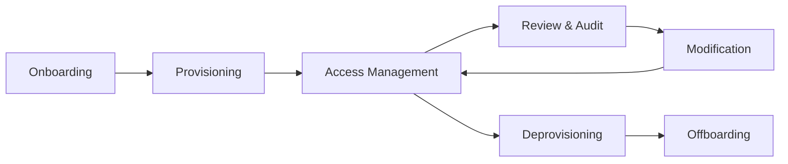

**Lifecycle stages:**

- **Onboarding** - New user joins organization
- **Provisioning** - Creating accounts and granting initial access
- **Access Management** - Day-to-day permission management
- **Review & Audit** - Regular access reviews and compliance checks
- **Modification** - Role changes, promotions, transfers
- **Deprovisioning** - Removing access when no longer needed
- **Offboarding** - Complete account termination

## Why IAM is Critical

In today's digital landscape, effective IAM is essential for several critical reasons:

### 1. Protection Against Cyberattacks

By implementing robust access controls, IAM solutions ensure that only authorized users can access sensitive data and systems, preventing cybercriminals from stealing or compromising valuable information.

**Statistics:**

- 81% of data breaches involve compromised credentials
- Average cost of a data breach: $4.45 million (2023)
- 74% of breaches involve human element (social engineering, misuse)

### 2. Data Breach Prevention

A single data breach can result in:

- Significant financial losses
- Legal penalties and regulatory fines
- Irreparable damage to reputation
- Loss of customer trust
- Business disruption

IAM solutions help prevent breaches by enforcing policies and controls that ensure compliance with security best practices.

### 3. Regulatory Compliance

Many industries face strict regulatory requirements:

| Regulation | Industry | Key Requirements |
| --- | --- | --- |
| HIPAA | Healthcare | Patient data protection, access controls |
| GDPR | EU/International | Data privacy, consent management |
| SOX | Finance | Financial data integrity, audit trails |
| PCI DSS | Payment Processing | Cardholder data protection |
| FERPA | Education | Student record privacy |
| CMMC | Defense Contractors | Controlled unclassified information protection |

IAM solutions help organizations meet these requirements and avoid costly penalties.

### 4. Simplified Access Management

Centralized IAM systems:

- Reduce administrative overhead
- Minimize manual errors
- Streamline user onboarding/offboarding
- Provide consistent access policies across systems
- Enable self-service capabilities

### 5. Enhanced User Experience

Modern IAM improves productivity by:

- Enabling single sign-on (SSO) across applications
- Reducing password fatigue
- Providing seamless access to needed resources
- Supporting mobile and remote work scenarios
- Offering self-service password reset

## Key Components of IAM

### Authentication

**Authentication** verifies a user's identity through various methods:

#### Authentication Factors

**Something you know:**

- Passwords
- PINs
- Security questions

**Something you have:**

- Hardware tokens
- Smart cards
- Mobile devices (OTP apps)
- Security keys (FIDO2/WebAuthn)

**Something you are:**

- Fingerprints
- Facial recognition
- Iris scans
- Voice recognition

**Somewhere you are:**

- Geolocation
- IP address ranges
- Network location

#### Authentication Methods

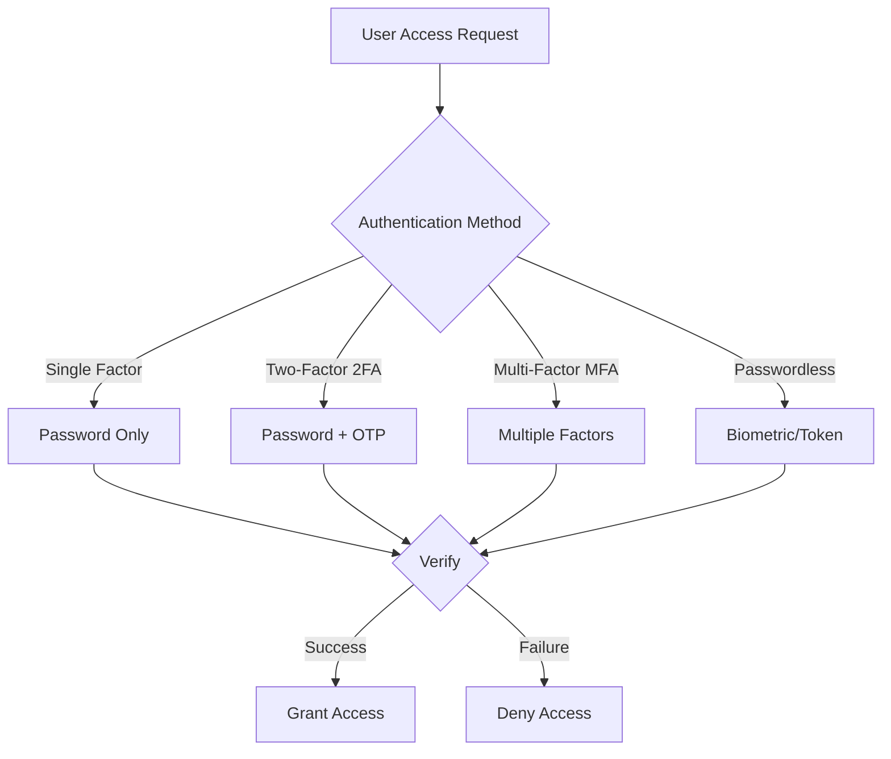

##### Single-Factor Authentication (SFA)

- Uses one authentication factor (typically password)
- Least secure method
- Not recommended for sensitive systems

##### Two-Factor Authentication (2FA)

- Requires two different factors
- Significantly more secure than SFA
- Common: password + SMS/OTP

##### Multi-Factor Authentication (MFA)

- Requires two or more factors from different categories
- Recommended for all critical systems
- Adaptive MFA adjusts requirements based on risk

##### Passwordless Authentication

- Eliminates passwords entirely
- Uses biometrics, hardware tokens, or magic links
- Improves security and user experience

### Authorization

**Authorization** determines what resources users can access and what actions they can perform.

#### Authorization Models

##### Role-Based Access Control (RBAC)

Users are assigned roles, and roles have permissions.

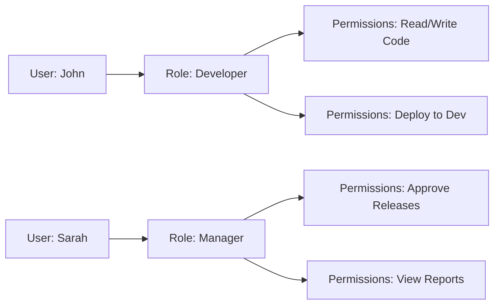

**Advantages:**

- Simplified management
- Consistent permissions
- Easy to understand

**Example roles:**

- Developer, Manager, Administrator, Read-Only User

##### Attribute-Based Access Control (ABAC)

Access decisions based on attributes (user, resource, environment).

```text

IF (user.department == "Finance" AND 
    resource.classification == "Financial" AND 
    time.business_hours == TRUE AND
    location.country == "US")
THEN GRANT access

```

**Advantages:**

- Fine-grained control
- Dynamic decisions
- Scalable for complex scenarios

##### Policy-Based Access Control (PBAC)

Access governed by centralized policies.

**Example policy:**

```yaml

Policy: Restrict_Sensitive_Data
  Effect: Deny
  Conditions:
    - user.clearance < "Secret"
    - resource.classification >= "Secret"

```

##### Least Privilege Principle

> [!IMPORTANT]
> Users should have the minimum access necessary to perform their job functions - no more, no less.

Benefits:

- Reduces attack surface
- Limits damage from compromised accounts
- Simplifies compliance
- Reduces insider threat risk

### User Provisioning

**User provisioning** manages the complete lifecycle of user accounts and access rights.

#### Provisioning Processes

##### Automated Provisioning

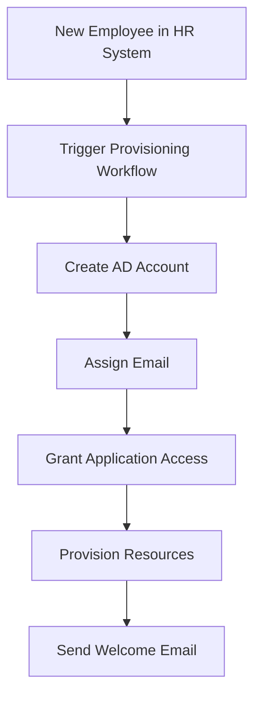

##### Just-In-Time (JIT) Provisioning

- Accounts created upon first login
- Used with federated identity
- Reduces pre-provisioning overhead

##### Self-Service Provisioning

- Users request access through portal
- Approval workflows enforce governance
- Reduces IT helpdesk burden

#### Deprovisioning

**Critical importance:**

> [!WARNING]
> Former employee accounts are a common attack vector. Timely deprovisioning is essential for security.

**Deprovisioning checklist:**

- ✅ Disable accounts immediately upon termination
- ✅ Remove from all groups and roles
- ✅ Revoke application access
- ✅ Retrieve hardware tokens and access badges
- ✅ Transfer ownership of resources
- ✅ Archive accounts per retention policy
- ✅ Audit access history

### Directory Services

**Directory services** provide a centralized repository for user information, credentials, and permissions.

#### Common Directory Solutions

##### Active Directory (AD)

- Microsoft's on-premises directory
- LDAP-based
- Integrated with Windows environments
- Group Policy management

##### Azure Active Directory (Azure AD / Entra ID)

- Cloud-based identity platform
- Modern authentication (OAuth, SAML, OpenID Connect)
- Conditional Access policies
- Integration with Microsoft 365 and thousands of SaaS apps

##### LDAP (Lightweight Directory Access Protocol)

- Industry-standard protocol
- Platform-agnostic
- Used by many directory implementations

##### Cloud Directory Services

- AWS Directory Service
- Google Cloud Identity
- Okta Universal Directory
- OneLogin

#### Directory Synchronization

**Hybrid identity scenarios:**

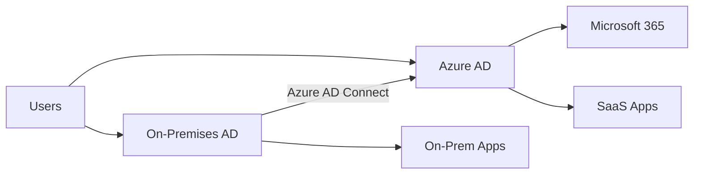

**Synchronization considerations:**

- Password hash synchronization vs Pass-through authentication
- Attribute mapping
- Filtering (which objects to sync)
- Synchronization frequency
- Disaster recovery

### Identity Governance

**Identity Governance** ensures compliance through policies, monitoring, and auditing.

#### Governance Components

##### Access Certification

Regular reviews to verify access is still appropriate:

```text

Quarterly Review Process:

1. Generate access reports for all users
2. Send to managers for certification
3. Managers review and certify/revoke access
4. Automatically remove uncertified access
5. Document results for audit

```

##### Segregation of Duties (SoD)

Prevent conflicts of interest:

```text

Toxic Combinations (Examples):
❌ Cannot have both: Create Purchase Order + Approve Purchase Order
❌ Cannot have both: Initiate Payment + Approve Payment
❌ Cannot have both: Create User Account + Assign Privileged Roles

```

##### Privileged Access Management (PAM)

Special controls for high-risk accounts:

- Just-in-time privileged access
- Elevated access with approval workflows
- Session recording and monitoring
- Automatic de-escalation
- Privileged account vaulting

##### Audit Logging

Comprehensive logging of all identity-related activities:

```text

Log Events:

- Authentication attempts (success/failure)
- Authorization decisions
- Account creation/modification/deletion
- Permission changes
- Access to sensitive resources
- Administrative actions

```

##### Compliance Reporting

Automated reports for auditors and regulators:

- Who has access to what
- Access certification results
- SoD violations
- Orphaned accounts
- Dormant accounts
- Privilege escalations

### Identity Federation

**Identity Federation** enables users to access resources across multiple domains without separate logins.

#### Federation Protocols

##### SAML 2.0 (Security Assertion Markup Language)

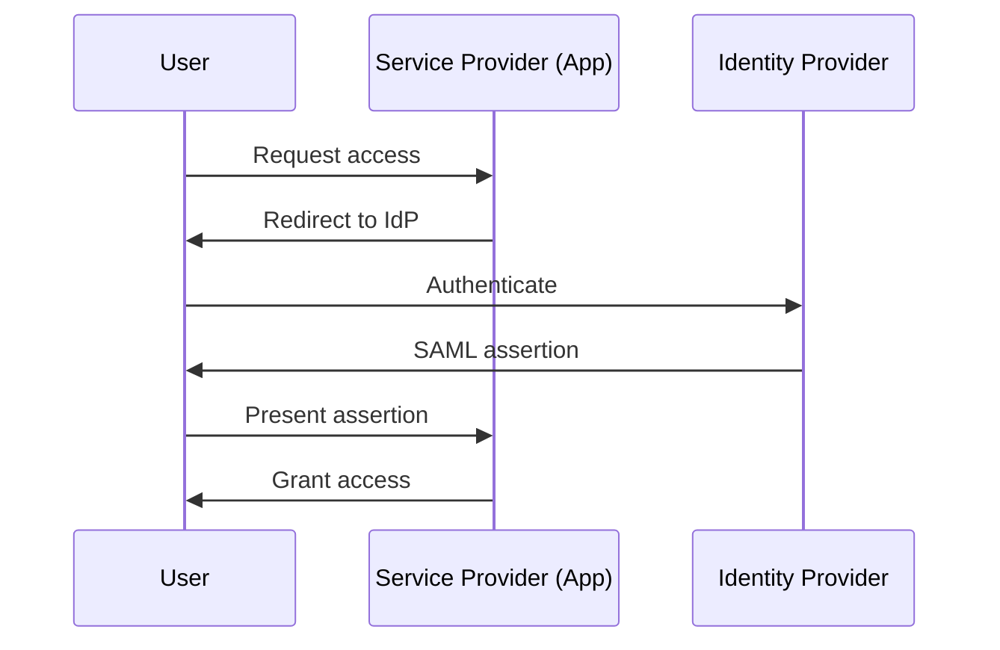

##### OAuth 2.0

- Authorization framework
- Delegated access
- Used for API access

##### OpenID Connect (OIDC)

- Built on OAuth 2.0
- Adds authentication layer
- Modern standard for SSO

##### WS-Federation

- Older enterprise standard
- Common with Microsoft products
- Being replaced by SAML/OIDC

#### Federation Use Cases

##### Cross-Organization Collaboration

- B2B partner access
- Contractor/vendor access
- Customer access (B2C)

##### Single Sign-On (SSO)

- One login for multiple applications
- Improved user experience
- Centralized authentication

##### Cloud Service Integration

- SaaS application access
- Multi-cloud scenarios
- Hybrid environments

## IAM Best Practices

### 1. Conduct Regular Access Reviews

**Why it matters:**

- Prevents privilege creep
- Identifies orphaned accounts
- Ensures compliance
- Reduces attack surface

**Implementation:**

```text

Access Review Schedule:

Monthly:

- Privileged account access
- New employee access (30-day check)

Quarterly:

- Standard user access by manager
- Application-specific permissions
- Group memberships

Annually:

- Comprehensive access audit
- Role definitions and assignments
- Service account review

```

**Best practices:**

✅ Automate review workflows
✅ Make managers accountable
✅ Provide clear context (last login, what access allows)
✅ Default to revoke if no response
✅ Document all decisions
✅ Follow up on exceptions

### 2. Implement Multi-Factor Authentication (MFA)

> [!IMPORTANT]
> MFA is one of the most effective security controls, preventing 99.9% of account compromise attacks.

**MFA deployment strategy:**

#### Phase 1: Protect Privileged Accounts

```bash

Priority 1 (Immediate):

- Global administrators
- Security administrators
- Privileged role administrators

```

#### Phase 2: Protect All Users

```bash

Priority 2 (First 30 days):

- All administrative access
- Access to sensitive systems
- Remote access (VPN)

Priority 3 (First 90 days):

- All cloud application access
- Email access
- Financial system access

Priority 4 (First 180 days):

- All user authentication
- Workstation login

```

**MFA methods comparison:**

| Method | Security | User Experience | Cost | Deployment Complexity |
| --- | --- | --- | --- | --- |
| SMS/Text | ⭐⭐ | ⭐⭐⭐⭐ | Low | Easy |
| Authenticator App | ⭐⭐⭐⭐ | ⭐⭐⭐⭐ | Low | Easy |
| Hardware Token | ⭐⭐⭐⭐⭐ | ⭐⭐⭐ | High | Medium |
| Biometric | ⭐⭐⭐⭐⭐ | ⭐⭐⭐⭐⭐ | Medium | Medium |
| Push Notification | ⭐⭐⭐⭐ | ⭐⭐⭐⭐⭐ | Low | Easy |

**MFA considerations:**

⚠️ **SMS is deprecated** - Vulnerable to SIM swapping
✅ **Authenticator apps** - Good balance of security and usability
✅ **FIDO2/WebAuthn** - Best security, growing adoption
✅ **Backup methods** - Always provide fallback options
✅ **Trusted devices** - Reduce MFA prompts for known devices

### 3. Implement Strong Password Policies

**Modern password guidance:**

> [!NOTE]
> NIST guidelines have evolved significantly. Length matters more than complexity.

**Recommended password policy:**

```yaml

Password Requirements:
  minimum_length: 12 characters (14+ for privileged accounts)
  complexity: Optional (if long enough)
  expiration: No periodic resets (change only if compromised)
  history: Prevent reuse of last 24 passwords
  lockout: 5 failed attempts = 15-minute lockout
  
Prohibited Practices:
  - Common passwords (check against breach databases)
  - Dictionary words
  - Sequential characters (abc, 123)
  - Repeated characters (aaa, 111)
  - Username in password

```

**Password vs Passphrase:**

```text

❌ Weak: P@ssw0rd!
   - Short (9 chars)
   - Common pattern
   - Predictable substitutions

✅ Strong: coffee-dragon-bicycle-mountain
   - Long (33 chars)
   - Easy to remember
   - Hard to crack
   - No expiration needed

```

**Enterprise password tools:**

- **Password managers** - Encourage use of enterprise password managers
- **Breach detection** - Monitor for leaked credentials
- **Password-less options** - Move toward eliminating passwords

### 4. Train Employees on Security Best Practices

**Security awareness is critical:**

> [!WARNING]
> 74% of breaches involve human error. Training is not optional.

**Comprehensive training program:**

#### New Employee Onboarding (Required)

- IAM policies and procedures
- Password management
- MFA enrollment
- Phishing awareness
- Data classification
- Acceptable use policy

#### Annual Security Training (Required)

- Current threat landscape
- Social engineering tactics
- Secure remote work practices
- Incident reporting procedures
- Compliance requirements

#### Ongoing Awareness (Monthly/Quarterly)

- Security newsletters
- Simulated phishing campaigns
- Lunch-and-learn sessions
- Security tips and reminders

#### Role-Specific Training

```text

Developers:

- Secure coding practices
- API security
- Secrets management

Managers:

- Access review responsibilities
- Approval workflows
- Data stewardship

Executives:

- Targeted attack awareness
- Business email compromise
- Secure communication

```

**Measuring effectiveness:**

✅ Track training completion rates
✅ Monitor phishing simulation results
✅ Test knowledge retention
✅ Measure security incident trends
✅ Gather employee feedback

### 5. Implement Least Privilege Access

**Principle:**

> Users should have only the minimum access required to perform their job functions.

**Implementation strategy:**

#### Step 1: Define Roles and Responsibilities

```yaml

Role: Application_Developer
  Permissions:
    - Read source code repositories
    - Write to development branches
    - Deploy to development environment
    - View development logs
  Restrictions:
    - No production access
    - No database direct access
    - No security configuration changes

```

#### Step 2: Map Users to Roles

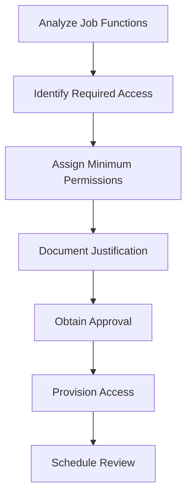

#### Step 3: Implement Just-In-Time Access

For temporary elevated privileges:

```bash

# Request elevated access
Request-ElevatedAccess -Role "DatabaseAdmin" -Duration 4hours -Justification "Emergency troubleshooting ticket #12345"

# Automated approval for emergency situations
# Manual approval for non-emergency

# Access automatically revoked after duration

```

#### Step 4: Monitor and Adjust

- Review access logs for unused permissions
- Identify over-privileged accounts
- Respond to access requests with minimum required
- Regular access certification

**Common over-privileging risks:**

❌ Default to admin access "just in case"
❌ Never remove permissions (privilege creep)
❌ Shared accounts with broad access
❌ Service accounts with excessive privileges
❌ Generic "PowerUser" roles

### 6. Limit Access to Sensitive Data

**Data-centric security approach:**

#### Step 1: Classify Data

| Classification | Description | Examples | Protection Level |
| --- | --- | --- | --- |
| Public | Can be freely disclosed | Marketing materials | Low |
| Internal | For internal use only | Policies, procedures | Medium |
| Confidential | Sensitive business info | Financial data, strategy | High |
| Restricted | Highly sensitive/regulated | PII, PHI, PCI | Very High |

#### Step 2: Implement Access Controls

```yaml

Data: Customer_Financial_Records
  Classification: Restricted
  
  Access_Controls:
    - Role: Finance_Analyst
      Permissions: Read
      Conditions:
        - Business hours only
        - Corporate network only
        - MFA required
        - Audit all access
        
    - Role: Finance_Manager
      Permissions: Read, Modify
      Conditions:
        - MFA required
        - Manager approval for bulk export
        - Audit all access

```

#### Step 3: Apply Data Protection

- **Encryption at rest** - Protect stored data
- **Encryption in transit** - Protect data in motion
- **Data masking** - Hide sensitive fields
- **Tokenization** - Replace sensitive data with tokens
- **DLP (Data Loss Prevention)** - Prevent unauthorized sharing

#### Step 4: Monitor and Audit

```text

Monitor for:

- Unusual access patterns
- Access from unusual locations
- Bulk downloads
- After-hours access
- Failed access attempts
- Permission escalations

```

### 7. Implement Zero Trust Architecture

**Zero Trust principles:**

> Never trust, always verify. Verify explicitly, use least privilege access, and assume breach.

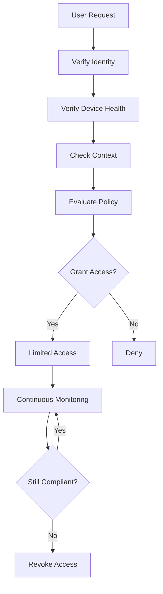

**Zero Trust components:**

1. **Identity verification** - Strong authentication for all access
2. **Device compliance** - Ensure devices meet security standards
3. **Context-aware access** - Consider location, time, risk
4. **Microsegmentation** - Limit lateral movement
5. **Continuous monitoring** - Real-time threat detection

## Common IAM Challenges and Solutions

### Challenge 1: Complexity and Integration

**Problem:**

Large organizations face:

- Multiple disparate systems
- Legacy applications
- Cloud and on-premises mix
- Inconsistent authentication methods
- Complex user provisioning

**Impact:**

- High administrative overhead
- Increased security gaps
- Poor user experience
- Difficult compliance

**Solutions:**

#### 1. Implement Unified IAM Platform

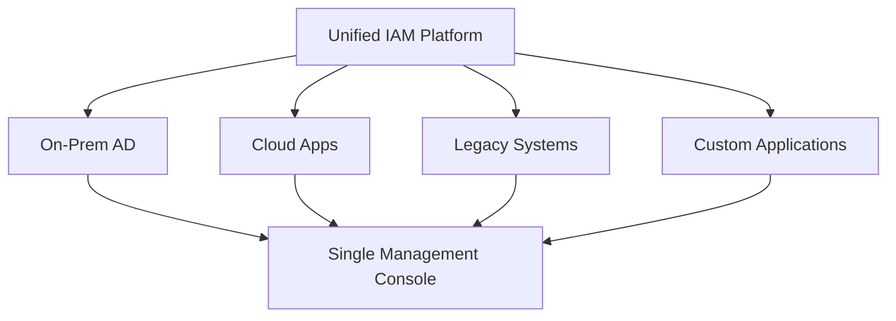

**Benefits:**

- Centralized management
- Consistent policies
- Simplified integration
- Better visibility

##### 2. Use Identity Federation

Connect systems using standard protocols (SAML, OIDC):

```bash

# Instead of creating accounts in every system
User Account in:
├── System A (local account)
├── System B (local account)
├── System C (local account)
└── System D (local account)

# Federate to single identity provider
User Account in IdP → Federated access to:
├── System A (via SAML)
├── System B (via OIDC)
├── System C (via OAuth)
└── System D (via SAML)

```

##### 3. Adopt API-First Integration

Modern applications with APIs enable:

- Automated provisioning
- Real-time synchronization
- Event-driven workflows
- Scalable architecture

##### 4. Phase Legacy System Migration

```text

Phase 1 (0-6 months):

- Inventory all systems
- Document current state
- Identify integration capabilities

Phase 2 (6-12 months):

- Migrate modern apps to federation
- Implement password synchronization for legacy
- Deploy SSO where possible

Phase 3 (12-24 months):

- Upgrade or replace legacy systems
- Achieve full federation
- Retire obsolete authentication methods

```

### Challenge 2: Balancing Security and Usability

**Problem:**

The security vs usability tension:

```text

High Security → Complex requirements → Poor user experience → Workarounds → Reduced security

```

**Impact:**

- User frustration
- Shadow IT
- Help desk overload
- Security policy violations
- Reduced productivity

**Solutions:**

#### 1. Implement Risk-Based Authentication

Adaptive authentication adjusts requirements based on risk:

```yaml

Login_Scenario_1:
  User: Regular employee
  Location: Corporate office
  Device: Managed laptop
  Time: Business hours
  Risk: Low
  Requirements: Username + Password

Login_Scenario_2:
  User: Regular employee
  Location: Foreign country
  Device: Personal phone
  Time: 2 AM
  Risk: High
  Requirements: Username + Password + MFA + Manager approval

```

##### 2. Deploy Single Sign-On (SSO)

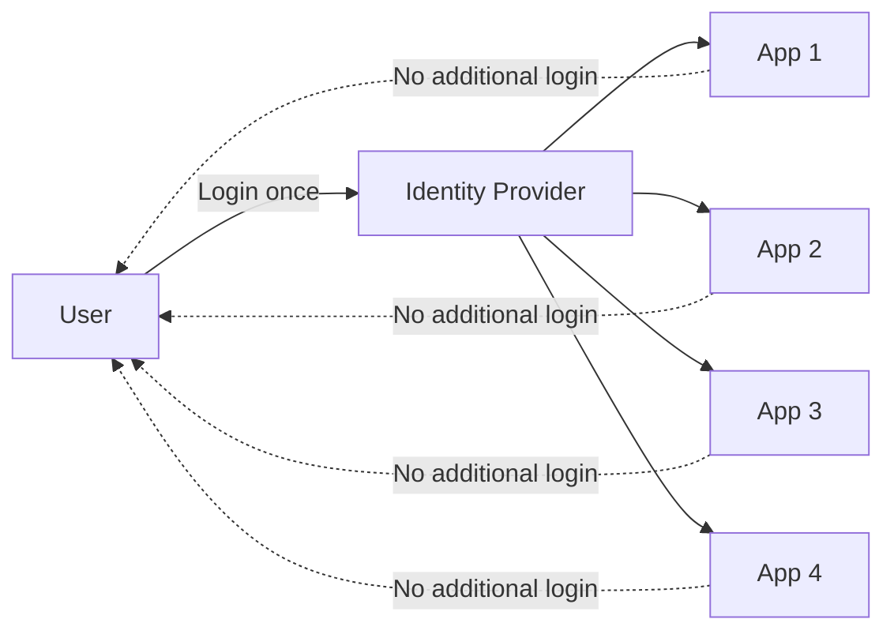

**Benefits:**

- Fewer passwords to remember
- Reduced login friction
- Centralized security controls
- Better user experience

##### 3. Enable Self-Service Capabilities

Reduce IT dependency:

- Self-service password reset
- Self-service MFA enrollment
- Access request portal
- Profile management

##### 4. Choose User-Friendly MFA Methods

```text

❌ User-Hostile:

- Grid cards with complex lookup
- Multiple hardware tokens
- Frequent re-authentication

✅ User-Friendly:

- Push notifications to mobile app
- Biometric authentication
- Trusted device exemptions
- Adaptive MFA (only when risk elevated)

```

##### 5. Provide Excellent Support

- Clear documentation
- Video tutorials
- 24/7 help desk
- Proactive communication
- Feedback mechanisms

### Challenge 3: Maintaining Compliance

**Problem:**

Organizations face:

- Multiple regulatory frameworks
- Frequent regulation changes
- Complex audit requirements
- Global operations with varying laws
- Penalties for non-compliance

#### Common regulations

```text

GDPR (EU):

- Right to erasure
- Right to data portability
- Consent management
- Breach notification (72 hours)

HIPAA (Healthcare):

- PHI access controls
- Audit trails
- Minimum necessary principle
- Business associate agreements

SOX (Finance):

- Segregation of duties
- Change management
- Access controls
- Audit trails

PCI DSS (Payment):

- Strong access control
- Monitoring and testing
- Vulnerability management
- Incident response

```

**Solutions:**

#### 1. Implement IAM with Compliance Features

```yaml

Compliance_Capabilities:
  Access_Certification:
    - Scheduled reviews
    - Automated workflows
    - Manager attestation
    - Audit trail
    
  Segregation_of_Duties:
    - Conflict detection
    - Policy enforcement
    - Exception management
    - Risk scoring
    
  Audit_Logging:
    - Comprehensive activity logs
    - Tamper-proof storage
    - Long-term retention
    - Searchable archives
    
  Reporting:
    - Compliance dashboards
    - Pre-built audit reports
    - Custom report builder
    - Automated distribution

```

##### 2. Map IAM Controls to Regulations

| Control | GDPR | HIPAA | SOX | PCI DSS |
| --- | --- | --- | --- | --- |
| MFA | ✅ | ✅ | ✅ | ✅ Required |
| Access Reviews | ✅ | ✅ | ✅ Required | ✅ |
| Audit Logging | ✅ Required | ✅ Required | ✅ Required | ✅ Required |
| Role-Based Access | ✅ | ✅ Required | ✅ | ✅ |
| Encryption | ✅ | ✅ | ✅ | ✅ Required |
| Data Minimization | ✅ Required | ✅ | | |
| Right to Erasure | ✅ Required | | | |

##### 3. Automate Compliance Workflows

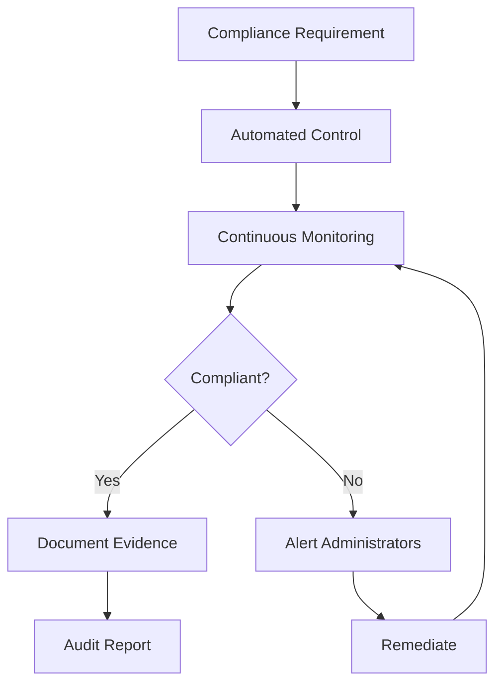

##### 4. Conduct Regular Compliance Assessments

```text

Quarterly:

- Access review completion rates
- Policy violations
- Unresolved exceptions
- System access reports

Annually:

- Full compliance audit
- Gap analysis
- Risk assessment
- Control effectiveness review

```

##### 5. Maintain Documentation

Critical documentation:

- IAM policies and procedures
- Role definitions and assignments
- Access review results
- Exception approvals
- Incident responses
- Training records
- Audit reports

### Challenge 4: Insider Threats

**Problem:**

Insider threats come from:

- Malicious insiders (intentional harm)
- Negligent insiders (careless behavior)
- Compromised insiders (account takeover)

**Statistics:**

- 34% of breaches involve internal actors
- Average cost: $15.38 million
- Insider incidents take 85 days to contain

**Solutions:**

#### 1. Implement User Behavior Analytics (UBA)

```yaml

Behavioral_Anomalies:
  - Unusual login times
  - Access from unexpected locations
  - Bulk data downloads
  - Access to unrelated systems
  - Privilege escalation attempts
  - Failed access attempts
  - Use of dormant accounts

```

##### 2. Apply Strict Privileged Access Management

```text

Privileged Access Controls:
✅ Just-in-time elevation (temporary)
✅ Approval workflows
✅ Session recording
✅ Credential vaulting
✅ Break-glass procedures
✅ Automatic de-escalation

```

##### 3. Monitor and Audit Continuously

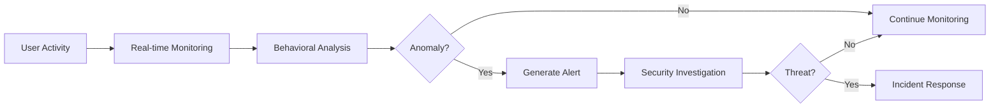

#### 4. Implement Data-Centric Controls

- Data classification and labeling
- Data loss prevention (DLP)
- Rights management (encryption + permissions)
- Watermarking for sensitive documents
- Download restrictions

##### 5. Conduct Thorough Offboarding

```text

Immediate (Day 0):
✅ Disable all accounts
✅ Revoke remote access (VPN)
✅ Revoke physical access (badges)
✅ Notify IT security team

Within 24 hours:
✅ Remove from all groups
✅ Revoke application access
✅ Transfer email/files ownership
✅ Collect hardware and tokens
✅ Change shared passwords

Within 1 week:
✅ Complete access audit
✅ Archive accounts per policy
✅ Document offboarding completion

```

## Choosing the Right IAM Solution

### Assessment Framework

#### Step 1: Identify Requirements

```yaml

Business_Requirements:
  - Number of users
  - Number of applications
  - Geographic distribution
  - Compliance requirements
  - Integration needs
  - Budget constraints
  
Technical_Requirements:
  - Authentication methods needed
  - Federation protocols required
  - API availability
  - On-premises vs cloud
  - High availability needs
  - Disaster recovery requirements
  
User_Requirements:
  - Self-service capabilities
  - Mobile access
  - Single sign-on expectations
  - User experience standards

```

#### Step 2: Evaluate Solutions

| Criteria | Weight | Solution A | Solution B | Solution C |
| --- | --- | --- | --- | --- |
| Authentication methods | High | ⭐⭐⭐⭐ | ⭐⭐⭐⭐⭐ | ⭐⭐⭐ |
| Federation protocols | High | ⭐⭐⭐⭐ | ⭐⭐⭐ | ⭐⭐⭐⭐⭐ |
| Integration capabilities | High | ⭐⭐⭐ | ⭐⭐⭐⭐⭐ | ⭐⭐⭐⭐ |
| User experience | Medium | ⭐⭐⭐⭐⭐ | ⭐⭐⭐⭐ | ⭐⭐⭐ |
| Compliance features | High | ⭐⭐⭐⭐ | ⭐⭐⭐⭐ | ⭐⭐⭐⭐⭐ |
| Cost | Medium | ⭐⭐⭐ | ⭐⭐⭐⭐ | ⭐⭐ |
| Vendor support | Medium | ⭐⭐⭐⭐ | ⭐⭐⭐ | ⭐⭐⭐⭐⭐ |

### Popular IAM Solutions

#### Enterprise IAM Platforms

##### Microsoft Entra ID (Azure AD)

- Best for: Microsoft-centric environments
- Strengths: Deep Microsoft 365 integration, conditional access
- Considerations: Best value with Microsoft ecosystem

##### Okta

- Best for: Cloud-first organizations
- Strengths: Extensive app catalog, developer-friendly APIs
- Considerations: Premium pricing

##### Ping Identity

- Best for: Large enterprises with complex requirements
- Strengths: Robust federation, strong customer IAM
- Considerations: Complex deployment

##### ForgeRock

- Best for: Organizations needing open-source flexibility
- Strengths: Highly customizable, IoT support
- Considerations: Requires technical expertise

##### SailPoint

- Best for: Identity governance focus
- Strengths: Advanced IGA capabilities, compliance
- Considerations: Primarily governance, not authentication

#### Cloud Provider IAM

##### AWS IAM

- Best for: AWS-native applications
- Strengths: Deep AWS integration, granular policies
- Considerations: AWS-specific

##### Google Cloud Identity

- Best for: Google Cloud customers
- Strengths: Google Workspace integration
- Considerations: Less mature than competitors

#### Open Source Options

##### Keycloak

- Best for: Self-hosted, cost-conscious
- Strengths: Free, flexible, standards-based
- Considerations: Requires operational expertise

##### Gluu

- Best for: On-premises deployment
- Strengths: Open source, comprehensive features
- Considerations: Commercial support available

### Decision Matrix

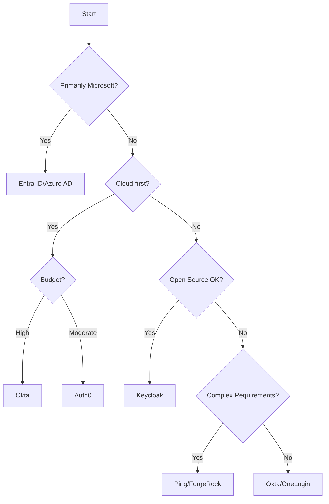

### Implementation Considerations

#### Phase 1: Planning (Months 1-2)

- Define requirements
- Evaluate solutions
- Select vendor
- Design architecture
- Plan migration

#### Phase 2: Pilot (Months 3-4)

- Deploy to test environment
- Onboard pilot users
- Test integrations
- Refine configuration
- Train administrators

#### Phase 3: Rollout (Months 5-8)

- Phased user migration
- Application integration
- Decommission legacy systems
- Monitor and adjust
- Provide user support

#### Phase 4: Optimization (Months 9-12)

- Analyze usage patterns
- Optimize policies
- Implement advanced features
- Conduct access reviews
- Measure success

## Measuring IAM Success

### Key Performance Indicators (KPIs)

#### Security Metrics

```yaml

Authentication_Metrics:
  - MFA adoption rate (Target: >99%)
  - Failed login attempts (Track trends)
  - Account lockouts (Lower is better)
  - Password reset frequency (Lower is better)
  - Compromised credential incidents (Target: 0)

Authorization_Metrics:
  - Privileged account count (Minimize)
  - Accounts with excessive permissions (Target: 0)
  - Access review completion rate (Target: 100%)
  - Average time to provision access (Target: <24 hours)
  - Average time to deprovision (Target: <1 hour)

Governance_Metrics:
  - Orphaned accounts (Target: 0)
  - Dormant accounts (>90 days, minimize)
  - SoD violations (Target: 0 unmitigated)
  - Audit findings (Minimize)
  - Compliance assessment score (Target: 100%)

```

#### Operational Metrics

```yaml

Help_Desk_Metrics:
  - Password reset requests (Track reduction)
  - Access request tickets (Track volume)
  - Average resolution time (Lower is better)
  - First-call resolution rate (Target: >80%)

User_Experience_Metrics:
  - SSO adoption rate (Target: >95%)
  - Self-service adoption rate (Target: >80%)
  - User satisfaction score (Target: >4/5)
  - Login success rate (Target: >99%)

```

#### Cost Metrics

```yaml

Financial_Metrics:
  - Help desk costs (Track reduction)
  - License costs per user
  - Implementation costs
  - Operational costs
  - ROI (Track improvement)

```

### Continuous Improvement

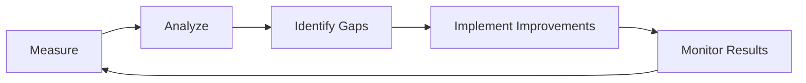

#### Improvement areas

1. **Automation** - Reduce manual processes
2. **Integration** - Connect more systems
3. **User experience** - Simplify workflows
4. **Security posture** - Strengthen controls
5. **Compliance** - Address gaps

## IAM Implementation Roadmap

### Year 1: Foundation

#### Quarter 1

- ✅ Implement MFA for privileged accounts
- ✅ Deploy password policy
- ✅ Begin access reviews
- ✅ Enable audit logging

#### Quarter 2

- ✅ Deploy SSO for cloud apps
- ✅ Implement self-service password reset
- ✅ Roll out MFA to all users
- ✅ Begin user training

#### Quarter 3

- ✅ Integrate major applications
- ✅ Implement automated provisioning
- ✅ Deploy privileged access management
- ✅ Conduct first compliance audit

#### Quarter 4

- ✅ Implement identity governance
- ✅ Deploy user behavior analytics
- ✅ Optimize policies based on data
- ✅ Plan Year 2 initiatives

### Year 2: Maturity

#### Quarter 1-2

- Implement adaptive authentication
- Deploy federation for partners
- Enhance automation
- Improve analytics

#### Quarter 3-4

- Implement zero trust architecture
- Advanced threat detection
- AI/ML-based anomaly detection
- Continuous optimization

## Conclusion

Identity and Access Management is a critical foundation for modern cybersecurity. By implementing the best practices outlined in this guide, organizations can:

✅ **Protect sensitive information** from unauthorized access
✅ **Prevent data breaches** through strong access controls
✅ **Meet compliance requirements** with comprehensive governance
✅ **Improve user experience** with SSO and self-service
✅ **Reduce operational costs** through automation
✅ **Respond effectively** to evolving threats

### Key Takeaways

1. **Start with MFA** - Quick win with massive security improvement
2. **Implement least privilege** - Minimize attack surface
3. **Automate where possible** - Reduce errors and improve efficiency
4. **Focus on user experience** - Security that users can work with
5. **Measure and improve** - Use data to drive decisions
6. **Stay current** - IAM is constantly evolving

> [!IMPORTANT]
> IAM is not a one-time project but an ongoing program requiring continuous attention, improvement, and adaptation to new threats and technologies.

## Additional Resources

### Documentation and Standards

- [NIST Digital Identity Guidelines](https://pages.nist.gov/800-63-3/)
- [OWASP Authentication Cheat Sheet](https://cheatsheetseries.owasp.org/cheatsheets/Authentication_Cheat_Sheet.html)
- [CIS Controls - Identity Management](https://www.cisecurity.org/controls/)
- [ISO/IEC 27001 - Access Control](https://www.iso.org/standard/54534.html)

### Industry Organizations

- [IDPro (Identity Professional Association)](https://idpro.org/)
- [Cloud Security Alliance - Identity Management](https://cloudsecurityalliance.org/)
- [FIDO Alliance (Authentication Standards)](https://fidoalliance.org/)

### Tools and Technologies

- [Microsoft Entra (Azure AD)](https://www.microsoft.com/security/business/identity-access/microsoft-entra-id)
- [Okta Identity Platform](https://www.okta.com/)
- [Ping Identity](https://www.pingidentity.com/)
- [ForgeRock Identity Platform](https://www.forgerock.com/)
- [Keycloak (Open Source)](https://www.keycloak.org/)

### Learning Resources

- [Microsoft Learn - Identity and Access](https://learn.microsoft.com/training/browse/?products=azure-active-directory)
- [Okta Developer](https://developer.okta.com/)
- [Auth0 by Okta](https://auth0.com/docs)
- [IDPro Body of Knowledge](https://bok.idpro.org/)

---

*This guide is based on industry best practices and should be adapted to your organization's specific requirements, risk tolerance, and regulatory obligations.*
