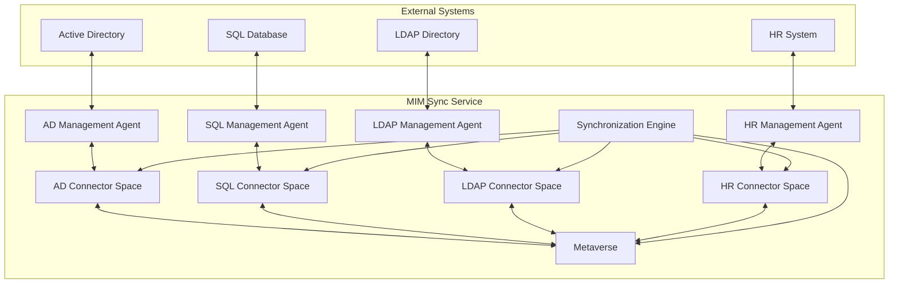

# Microsoft Identity Manager 2016 Synchronization Service

Microsoft Identity Manager (MIM) 2016 Synchronization Service is a powerful identity synchronization platform that enables organizations to manage and synchronize identity data across multiple disparate systems. This document provides a comprehensive high-level overview of the service, its architecture, capabilities, and use cases.

## What is MIM 2016 Synchronization Service?

The **Microsoft Identity Manager 2016 Synchronization Service** (formerly known as Forefront Identity Manager or FIM Synchronization Service) is the core synchronization engine within the MIM suite. It serves as a central hub for identity data synchronization, enabling organizations to:

- **Synchronize identities** across multiple connected data sources
- **Transform and map** identity attributes between different systems
- **Maintain data consistency** across heterogeneous environments
- **Automate identity lifecycle management** processes
- **Enforce business rules** through custom logic and workflows

> [!NOTE]
> The Synchronization Service can operate independently of the MIM Service and Portal, making it a lightweight solution for pure synchronization scenarios.

## Architecture Overview

### Core Components

The MIM 2016 Synchronization Service consists of several key components that work together to provide comprehensive identity synchronization capabilities:

#### 1. Synchronization Engine

The **Synchronization Engine** is the heart of the service, responsible for:

- **Data processing**: Reading, transforming, and writing identity data
- **Rule evaluation**: Applying synchronization rules and business logic
- **Conflict resolution**: Handling data conflicts and inconsistencies
- **Change tracking**: Monitoring and processing data changes
- **Workflow orchestration**: Coordinating synchronization operations

#### 2. Metaverse

The **Metaverse** serves as the authoritative identity store within MIM:

- **Central repository**: Stores the unified view of each identity
- **Schema definition**: Defines the structure and attributes of identity objects
- **Relationship management**: Maintains connections between related objects
- **Data consolidation**: Combines data from multiple connected systems
- **Authoritative source**: Provides the single source of truth for identities

#### 3. Connector Space

**Connector Spaces** represent the staging areas for connected data sources:

- **Data staging**: Temporarily stores data from connected systems
- **Change detection**: Identifies modifications in source systems
- **Transformation preparation**: Prepares data for processing rules
- **Isolation**: Keeps each system's data separate during processing
- **Synchronization coordination**: Manages the flow of data to/from systems

#### 4. Management Agents (MAs)

**Management Agents** are the connectors that interface with external systems:

- **Data source connectivity**: Establish connections to various systems
- **Protocol support**: Handle different communication protocols and formats
- **Import/Export operations**: Facilitate data transfer operations
- **Change detection**: Monitor source systems for modifications
- **Error handling**: Manage connectivity and data processing errors

### Architecture Diagram

## Key Capabilities

### 1. Multi-System Synchronization

**Bidirectional Synchronization:**

- Supports both inbound and outbound data flows
- Enables real-time or scheduled synchronization
- Handles complex many-to-many relationships
- Manages data precedence and authority

**Supported Systems:**

- Active Directory (AD)
- Azure Active Directory (Azure AD)
- SQL Server databases
- LDAP directories
- Exchange Server
- SharePoint
- Custom systems via extensible connectors

### 2. Data Transformation and Mapping

**Attribute Mapping:**

- Maps attributes between different schemas
- Supports complex transformation logic
- Handles data type conversions
- Enables attribute flow customization

**Business Rules Engine:**

- Implements custom business logic
- Supports conditional processing
- Enables data validation and filtering
- Provides extensibility through rule extensions

### 3. Identity Lifecycle Management

**Provisioning:**

- Automatic account creation in target systems
- Template-based provisioning workflows
- Conditional provisioning based on business rules
- Bulk provisioning capabilities

**Deprovisioning:**

- Automated account deactivation and deletion
- Grace period management
- Data retention policies
- Audit trail maintenance

**Modification Tracking:**

- Real-time change detection
- Delta synchronization
- Conflict resolution mechanisms
- Change history logging

### 4. Extensibility and Customization

**Rule Extensions:**

- Custom .NET code for complex business logic
- Attribute flow customization
- Data validation and transformation
- External system integration

**Custom Management Agents:**

- Support for proprietary systems
- Flexible connectivity options
- Custom protocol implementations
- Third-party connector ecosystem

## Synchronization Process Flow

### 1. Import Phase

During the **Import Phase**, the Synchronization Service:

1. **Connects to source systems** using Management Agents
2. **Retrieves changed data** from connected systems
3. **Stages data** in respective Connector Spaces
4. **Detects changes** by comparing with previous imports
5. **Prepares data** for synchronization processing

### 2. Synchronization Phase

The **Synchronization Phase** involves:

1. **Rule evaluation** for inbound synchronization rules
2. **Data transformation** using attribute flow rules
3. **Metaverse updates** with processed identity data
4. **Relationship establishment** between connected objects
5. **Conflict resolution** for competing data changes

### 3. Export Phase

During the **Export Phase**, the service:

1. **Evaluates outbound rules** for target systems
2. **Transforms data** for target system schemas
3. **Stages export operations** in Connector Spaces
4. **Executes exports** to connected systems
5. **Confirms successful operations** and updates status

## Management and Administration

### 1. Synchronization Service Manager

The **Synchronization Service Manager** provides administrative capabilities:

- **Management Agent configuration** and management
- **Synchronization rule** creation and editing
- **Run profile** definition and execution
- **Connector Space** browsing and management
- **Metaverse** search and object viewing

### 2. PowerShell Administration

**PowerShell cmdlets** enable automated administration:

- Script-based configuration management
- Bulk operations and maintenance tasks
- Integration with enterprise automation tools
- Custom monitoring and reporting solutions

### 3. Monitoring and Reporting

**Built-in monitoring capabilities:**

- Synchronization run statistics
- Error and warning reporting
- Performance metrics and trending
- Operational health monitoring

## Use Cases and Scenarios

### 1. Enterprise Identity Synchronization

**Common scenarios:**

- Synchronizing HR systems with Active Directory
- Maintaining consistent user attributes across systems
- Automating joiner/mover/leaver processes
- Centralizing identity data management

### 2. Cloud Integration

**Hybrid identity scenarios:**

- Synchronizing on-premises AD with Azure AD
- Enabling single sign-on across cloud and on-premises
- Managing cloud service provisioning
- Maintaining identity consistency in hybrid environments

### 3. Data Consolidation

**Identity data unification:**

- Merging identity data from multiple sources
- Creating authoritative identity records
- Eliminating data silos and redundancy
- Establishing master data management practices

### 4. Compliance and Governance

**Regulatory compliance support:**

- Maintaining audit trails for identity changes
- Enforcing data retention policies
- Supporting access certification processes
- Enabling identity governance workflows

## Benefits and Advantages

### 1. Operational Efficiency

- **Automated processes** reduce manual administration overhead
- **Centralized management** simplifies identity operations
- **Real-time synchronization** ensures data currency
- **Bulk operations** enable efficient large-scale changes

### 2. Data Consistency

- **Single source of truth** eliminates data conflicts
- **Automated validation** ensures data quality
- **Conflict resolution** maintains data integrity
- **Change tracking** provides complete audit trails

### 3. Scalability and Performance

- **High-volume processing** supports large enterprise environments
- **Parallel operations** optimize synchronization performance
- **Delta synchronization** minimizes network and processing overhead
- **Clustered deployment** enables high availability

### 4. Flexibility and Extensibility

- **Custom rule extensions** support unique business requirements
- **Multiple connector types** enable diverse system integration
- **Configurable workflows** adapt to organizational processes
- **API integration** supports custom applications

## Architecture Considerations

### 1. Deployment Models

**Standalone Deployment:**

- Single server installation for smaller environments
- Simplified management and maintenance
- Lower resource requirements
- Suitable for basic synchronization scenarios

**Distributed Deployment:**

- Multiple servers for load distribution
- Enhanced performance and scalability
- Geographic distribution capabilities
- Complex topology support

**High Availability Deployment:**

- Clustered configurations for fault tolerance
- Automated failover capabilities
- Data replication and backup strategies
- Business continuity assurance

### 2. Security Considerations

**Authentication and Authorization:**

- Service account security and privilege management
- Encrypted communication channels
- Access control and permissions
- Audit logging and monitoring

**Data Protection:**

- Sensitive attribute handling
- Password synchronization security
- Data encryption at rest and in transit
- Privacy compliance measures

### 3. Performance Optimization

**Configuration Tuning:**

- Management Agent optimization
- Run profile scheduling
- Batch size and concurrency settings
- Memory and resource allocation

**Monitoring and Maintenance:**

- Performance counter tracking
- Regular maintenance procedures
- Capacity planning and scaling
- Troubleshooting and diagnostics

## Integration Patterns

### 1. Hub and Spoke Model

**Characteristics:**

- MIM Sync as central hub
- All systems connect through MIM
- Simplified integration architecture
- Centralized control and monitoring

**Benefits:**

- Reduced complexity
- Easier maintenance
- Consistent data flows
- Single point of control

### 2. Mesh Integration Model

**Characteristics:**

- Direct system-to-system connections
- MIM Sync as one participant
- Distributed integration approach
- Multiple data flow paths

**Benefits:**

- Reduced single points of failure
- Optimized data flows
- System independence
- Flexible architecture

### 3. Layered Architecture Model

**Characteristics:**

- Multiple synchronization layers
- Hierarchical data flow
- Specialized processing at each layer
- Clear separation of concerns

**Benefits:**

- Modular design
- Specialized functionality
- Easier troubleshooting
- Scalable architecture

## Best Practices

### 1. Design Principles

**Start Simple:**

- Begin with basic synchronization scenarios
- Gradually add complexity as needed
- Test thoroughly at each stage
- Document all configurations

**Plan for Scale:**

- Design for future growth
- Consider performance implications
- Plan capacity requirements
- Design for high availability

**Security First:**

- Implement least privilege principles
- Secure all communication channels
- Regular security reviews
- Compliance with organizational policies

### 2. Implementation Guidelines

**Phased Approach:**

- Pilot implementations first
- Gradual rollout to production
- Comprehensive testing at each phase
- User training and change management

**Documentation and Standards:**

- Comprehensive configuration documentation
- Standard operating procedures
- Troubleshooting guides
- Architecture diagrams and specifications

### 3. Operational Excellence

**Monitoring and Alerting:**

- Proactive monitoring strategies
- Automated alerting systems
- Performance trending analysis
- Capacity planning procedures

**Maintenance and Support:**

- Regular backup procedures
- Disaster recovery planning
- Change management processes
- Support escalation procedures

## Conclusion

Microsoft Identity Manager 2016 Synchronization Service provides a robust, scalable, and flexible platform for enterprise identity synchronization. Its architecture supports complex multi-system environments while maintaining data consistency and enabling automated identity lifecycle management.

The service's ability to operate independently of the MIM Service and Portal makes it an ideal solution for organizations that need powerful synchronization capabilities without the overhead of a full identity management portal. With proper planning, implementation, and management, MIM 2016 Synchronization Service can significantly improve operational efficiency, data quality, and identity governance across the enterprise.

Whether used for simple two-system synchronization or complex multi-directional identity flows, the Synchronization Service provides the tools and flexibility needed to meet diverse organizational requirements while maintaining the security, reliability, and performance expected in enterprise environments.

## Related Topics

- **[MIM 2016 SQL Synchronization Guide](sql-sync-guide.md)**: Detailed implementation guide
- **[Rule Extensions Development](rule-extensions.md)**: Custom code development
- **[Active Directory Integration](ad-integration.md)**: AD-specific configuration
- **[Troubleshooting Guide](troubleshooting.md)**: Common issues and solutions
- **[Performance Tuning](performance-tuning.md)**: Optimization strategies
