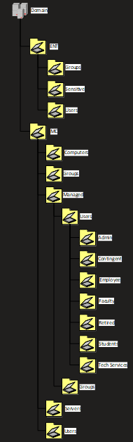

# Organizational Units

An Organizational Unit (OU) is an Active Directory object that acts as a container for other objects. OUs have two primary purposes: application of policy and delegation of administrative tasks. Application of policy is accomplished through the linking of Group Policy Objects to the OU. Delegation of administration is accomplished by applying Access Control Lists to the OU that apply to rights and properties for the OU itself as well as objects contained in that OU.

## Organizational Unit Structure

There is often a tendency to create the OU structure to strictly mirror the organizational chart. In order to efficiently design the OU structure around administrative responsibility and Group Policy application the organizational data can be contained in the attributes of the user objects.

The design and implementation of Organizational Units are shaped by several overarching goals:

- The OU design should reflect how the AD objects are managed and not replicate the College's organizational chart
- The OU design must take into account both delegation of rights and the application of Group Policy
- Least privilege - Administrators at all levels will be granted only the privileges required to perform their duties
- Simplicity - The AD forest will be a complex environment that will be supported and managed by a large number of departments across the college

## Intent

The intent of this OU structure design is to concentrate the creation and management of objects in a single location. This will simplify delegation and application of Group Policy through the elimination of redundancies as much as possible. The organization will be able to realize a reduction in the number of highly privileged accounts, often given as an easy but dangerous method of granting access, by explicitly delegating all directory access that includes the creation or managing of objects within this OU structure. Combined with the RBAC model, this improves visibility of who is granted rights to what objects while eliminating many Domain Administrators.

## Design

The OU structure design will consist of several top-level OUs that will contain second-level OUs. Within the second-level OUs will be the sub-OUs that will contain all Madison College created leaf objects, linked Group Policy Objects, and rights delegations.

The top-level OUs will consist of the following:

- ENT - This OU will contain user and group objects that are considered "highly privileged" or could lead to elevating other objects to "highly privileged."
- MC - This OU will contain all other managed and unmanaged leaf objects

Second level sub-OUs will include:

- ENT
  - Groups
  - Users
- MC
  - Managed Objects - Contains OU, User and Group objects managed through the IdM system
  - Computers - Contains OU and computer objects associated with desktops, notebooks, tablets, etc
  - Servers - Contains OU and computer objects associated with servers
  - Users - Contains OU and user objects that are created outside of the IdM system
  - Groups - Contains OU and group objects that are created outside of the IdM system

{width="1.9791666666666667in" height="6.541666666666667in"}
