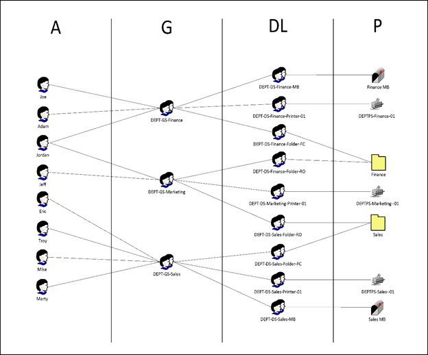

# Group Objects

Created: 2019-05-13 11:14:22 -0500

Modified: 2020-07-15 07:47:24 -0500

---

Groups will be nested within the guidelines of this document in order to prevent redundancies and circular nesting.

Group objects will be created and managed by the Identity and Access Management Team.

Groups Types and Scope

- Type -- Active Directory supports two classes of groups; Distribution and Security.
  - Distribution groups are used for mail distribution.
  - Security groups are security principals for use in granting or denying rights to resources and filtering the application of Group Policy Objects.
- Scope -- Active Directory supports four group scopes:
  - Local
  - Domain Local -- May have users, computers, other domain local groups, global groups and universal groups as members from any domain in the forest or from trusted domains in other forests
  - Global -- May have users, computers, and other global groups from within the same domain as members
  - Universal -- May have users, computers, global groups, and universal groups from anywhere in the forest or from trusted forests

Nesting

Groups can be nested to increase the effective number of members and ease administration overhead. However, nesting in a large organization can quickly get out of control. A lack of standardization and governance can lead to redundancies and circular nesting.

- Universal group membership will consist of user accounts and computer accounts from any domain.
- Global group membership will consist of Universal and Global groups from any domain.
- Domain Local and Local group membership will consist of Universal and Global groups from any domain. They may also have other Domain Local groups from the same domain as members.
- All groups will be named with a three to five letter code for the department followed by a short description of the group separated by spaces (e.g. <dept> <description>).

For standardization and performance, the following rules will be followed while using security groups in an Active Directory forest:

- Users or computer objects will be assigned to Global groups.
- Rights will be assigned to Domain Local or Local groups.
- Global groups containing users or computers will be placed into Domain Local or Local groups to associate user or computer objects with the rights or GPO filtering.
- Universal groups can be populated with Global groups and placed into Domain Local or Local groups to in order to assign rights to users or computers from other domains.
- Universal, Domain Local, and Local groups will not contain user or computer objects.

## Group Management

When assigning rights and permissions resources never assign permissions to individual users. Always assign permissions to security groups.

- User rights - User rights include both privileges (such as Back Up Files and Directories) and logon rights (such as allow logon locally).
- Access control permissions -- Any object (files, folders, mailboxes, directory object, etc) that has an Access Control List (ACL) can be given permissions such as Read, Write, Full Control, or Modify.

It is recommended that when creating and managing security groups you follow the Role Based Access Control (RBAC) model. The RBAC model lays out a multi-level strategy involving individual users, groups, and resources that lends itself to attestation and self-documentation. The pneumonic AGDLP explains the implementation of RBAC in Active Directory.

AGDLP stands for "Accounts go in Global groups, global groups go in Domain Local groups, and local groups are assigned Permissions"

The AGDLP strategy is based the idea of using the different group scopes at each level:

- Global groups contain only users.
- Domain Local groups contain only other global or universal groups. End-point permissions are assigned only to local groups. Directory permissions are assigned to domain local groups.
- Universal groups contain only global groups.

AGDLP provides maximum flexibility, scalability, and ease of administration when creating and managing security groups. The following description outlines the recommended method of using global and domain local groups.

- Users are placed into security groups with global scope that represents a role that all members of the group will fulfill (Help Desk, Web Admin, Manager, Financial group, local admin).
- Create security groups with domain local scope and assign them permissions to access a resource (File, folder, mailbox, directory object, etc).
- Put the global group that was created for the role into any domain local group in the forest that is assigned permissions or rights required by those users assigned to the role.

## Domain Local

For example, to give five users access to a particular printer, you could add all five user accounts, one at a time, to the printer permissions list. Later, if you wanted to give the same five users access to a new printer, you would again have to specify all five accounts in the permissions list for the new printer. Or, you could take advantage of groups with domain local scope.

## Global

Use global groups to collect users or computers that are in the same domain and share the same job, organizational role, or function. For example, "Full-time employees," "Managers," "RAS Servers" are all possible global groups. Because group members typically need to access the same resources, make these global groups members of domain local or machine local groups, which, in turn, are listed on the DACL of needed resources.

## Universal

If you choose to use groups with universal scope in a multi-domain environment, these groups can help you represent and consolidate groups that span domains. For example, you might use universal groups to build groups that perform a common function across an enterprise.

Although few organizations will choose to implement this level of complexity, you can add user accounts to groups with global scope, nest these groups within groups having universal scope, and then make the universal group a member of a domain local (or machine local) group that has access permissions to resources. Using this strategy, any membership changes in the groups having global scope do not affect the groups with universal scope.

### Example

A department administrator needs to secure a number of resources. The resources are for the finance, marketing, and sales staff. The finance and sales staff each have access to a shared folder, shared Exchange mailbox, and a printer. The marketing staff only requires read only access to the other staff's shared folders and their own printer.

First, the administrator creates a global security group for each role (i.e. Finance, Marketing, and Sales) in either Manifest or Active Directory. The staff's user objects are then added to the appropriate "role" group.

Then the administrator creates domain local security groups for each level of access to be allowed to each resource (i.e. Shared folder -- Full Control, Shared Folder -- Read Only, Mailbox -- Send-as, etc). These "resource" groups are then given the appropriate permissions to each of the resources. It is important that a detailed description of the resource and level of access being provided to the group.

The "role" groups are then made members of the "resource" groups in order to provide the users access to those resources.

{width="7.1875in" height="5.96875in"}
